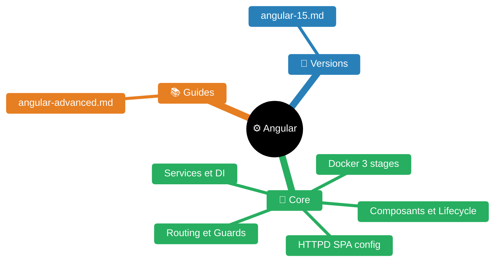
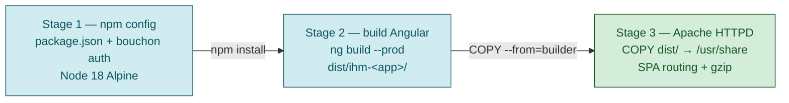
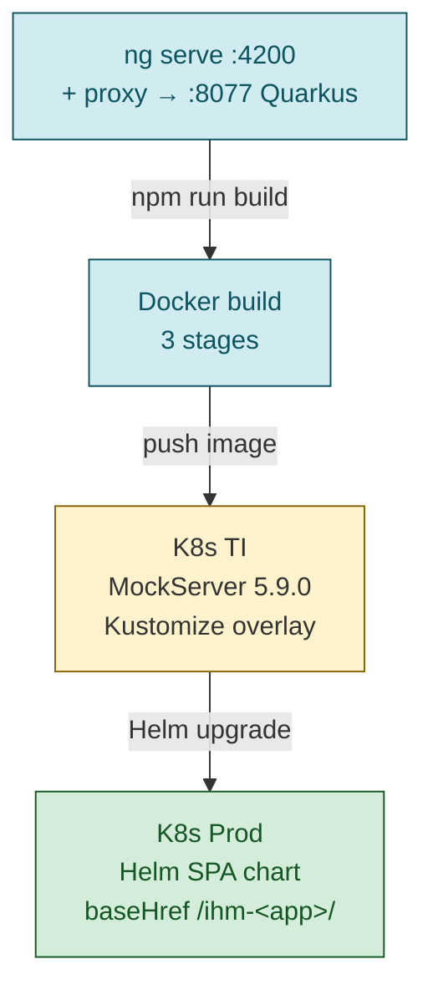

# Skill — Angular

> **Expérience projet** : voir `experience/angular.md` pour les leçons spécifiques au workspace <solution-numerique>.


| Fichier | Description |
|---------|-------------|
| [README.md](README.md) | Point d'entrée Angular |
| [guides/angular-advanced.md](guides/angular-advanced.md) | Référentiel avancé Angular |
| [versions/angular-15.md](versions/angular-15.md) | Notes de version Angular 15 |

## Vue d'ensemble

SPA Angular 15 — frontend du projet. Déployé sur Apache HTTPD via Docker, K8s/Kustomize.

**Angular** : 15.2.10
**Node** : 18.19.0
**Tests** : Jest (unit) + Cypress (E2E)

---

## Structure

```
<repo-angular>/
├── angular.json                   ← Build config, baseHref /ihm-<app>/
├── package.json                   ← Angular 15, Jest, Cypress, ngx-translate, <internal-auth-library>
├── proxy.conf.json                ← /exp-<code>/* → localhost:1080 (mock server)
├── tsconfig.json                  ← Strict mode, ES2022
├── .eslintrc.json                 ← Angular ESLint (prefix: app)
├── sonar-project.properties       ← SonarQube config
├── cypress.json                   ← Cypress config (multi-reporter)
├── cypress/
│   ├── config/local.json          ← BASE_URL: http://localhost:4200
│   ├── config/ti.json             ← BASE_URL: http://<app>-ti.dev.k8s…
│   └── fixtures/ressource.json    ← Mock API response
├── conteneur/
│   ├── Dockerfile                 ← 3 stages : npm config → Node build → Apache HTTPD
│   └── config/
│       ├── 01-httpd-spa.conf      ← SPA routing (rewrite → index.html)
│       ├── 02-enf-*.conf          ← Cache (HTML 15min, assets 100j)
│       └── 03-enf-*.conf          ← Gzip compression
└── infra-as-code/
    ├── tondeuse/                  ← K8s base (MockServer 5.9.0 : deployment, service, ingress)
    └── overlays/TI/               ← values.yaml Helm (image, ingress, probes)
```

**Note** : dans un workspace pseudonymisé, le répertoire `src/` (code TypeScript applicatif) peut être absent — seuls les fichiers de config, build, infra et test E2E sont typiquement pseudonymisés.

---

## Stack technique

| Composant | Technologie |
|-----------|------------|
| Framework | Angular 15.2.10 |
| Tests unitaires | Jest 29 + jest-preset-angular |
| Tests E2E | Cypress 12 |
| i18n | @ngx-translate/core 14 |
| Auth | <internal-auth-library> + jwt-decode 4 |
| Linting | ESLint + @angular-eslint |
| Build | Angular CLI, Node 18 Alpine |
| Serve | Apache HTTPD 2.4 (pe-apache-httpd) |
| CI/CD | Concourse |
| Déploiement | Docker + K8s/Kustomize + Helm SPA |

---

## Scripts npm

| Script | Usage |
|--------|-------|
| `start` | Dev server + proxy vers mock API |
| `start:mocked` | Dev + MockServer Docker |
| `build` | Build prod (output hashing) |
| `test` | Jest avec couverture |
| `cypress:run:all` | MockServer + build + Cypress |
| `docker:build/run` | Build/run image Docker |
| `lint` | ESLint |

---

## Déploiement

**Base href** : `/ihm-<app>/`
**API proxy** : `/exp-<code>/*` → backend (MockServer en TI)
**Image Docker** : 3 étapes (npm config → build Angular → Apache HTTPD)


**K8s** : MockServer 5.9.0 en TI, Kustomize overlays, Helm chart SPA



---

## Guides par version

Les spécificités de chaque version Angular sont documentées dans des fichiers dédiés :

| Version | Fichier | Contenu |
|---------|---------|---------|
| Angular 15 | `versions/angular-15.md` | Proxy dev, dev replacement, build Docker, bouchon authent |

Quand on travaille sur un projet Angular, consulter le fichier de la version correspondante pour les contraintes et bonnes pratiques spécifiques.
