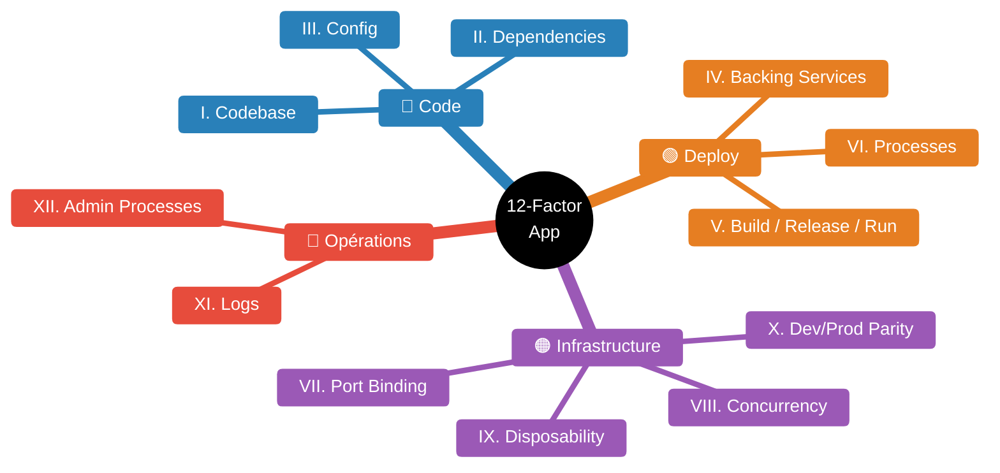

# 12-Factor App — méthodologie opérable

Source primaire : [12factor.net](https://12factor.net/) (Adam Wiggins, Heroku, 2011).
Extensions : *Beyond the Twelve-Factor App* — Kevin Hoffman, O'Reilly 2016 ([résumé Tanzu](https://tanzu.vmware.com/content/blog/beyond-the-twelve-factor-app)) ; révision *The Twelve Factors, Revisited* — Heroku 2024 ([heroku.com/blog/twelve-factors-revisited](https://www.heroku.com/blog/twelve-factors-revisited)).

Cible : service HTTP/worker conteneurisé tournant sur Kubernetes, livré par CI/CD.



| Facteur | Résumé K8s |
|---------|-----------|
| I. Codebase | 1 repo → N envs (même image Docker promue) |
| II. Dependencies | Image pinnée + SBOM |
| III. Config | ConfigMap / Secret / External Secrets |
| IV. Backing Services | DATABASE_URL injectée, swap transparent |
| V. Build/Release/Run | Pipeline CI → image immuable → Helm release |
| VI. Processes | Stateless, no sticky session, state = Redis/S3 |
| VII. Port Binding | EXPOSE 8080, Service ClusterIP |
| VIII. Concurrency | replicas + HPA/KEDA |
| IX. Disposability | start &lt;10s, SIGTERM géré, preStop hook |
| X. Dev/Prod Parity | Testcontainers en CI, même stack |
| XI. Logs | JSON stdout → Fluent Bit → Loki |
| XII. Admin Processes | Job K8s ou Helm pre-upgrade hook |
```

## Les 12 facteurs

### I. Codebase — une codebase suivie en VCS, plusieurs déploiements
- **Principe** : 1 app = 1 repo Git ; N environnements = N déploiements du même build.
- **Violation** : un repo par env (repo-prod / repo-staging) ; fork pour patcher la prod.
- **Correction** : mono-repo ou 1 repo / service ; même image Docker promue via tag/digest sur tous les clusters.

### II. Dependencies — déclarer et isoler explicitement
- **Principe** : aucune dépendance implicite sur l'environnement (pas de binaire système attendu).
- **Violation** : `Dockerfile: FROM ubuntu ... apt-get install` sans version pin.
- **Correction** : `requirements.txt` / `go.mod` / `package-lock.json` versionnés ; images *distroless* ou pinnées ; SBOM généré (`syft`, `cyclonedx`).

### III. Config — config dans l'environnement
- **Principe** : tout ce qui change entre envs vit hors du code.
- **Violation** : `config/prod.yaml` vs `config/staging.yaml` committés ; secrets en clair.
- **Correction** : variables d'env via `ConfigMap`/`Secret` ; secrets via External Secrets Operator + Vault/SOPS ; jamais de branche par env.

### IV. Backing services — ressources attachables
- **Principe** : DB, cache, broker = URL + credentials injectés ; swap transparent.
- **Violation** : hostname codé en dur `db.prod.internal` ; code qui bascule selon `ENV == "prod"`.
- **Correction** : `DATABASE_URL` injecté ; Service Bindings / `ExternalName` Service ; même code contre RDS/Postgres local/staging.

### V. Build, release, run — étapes strictement séparées
- **Principe** : build → release (build + config) → run. Pas de modif en live.
- **Violation** : `kubectl exec` pour patcher un fichier ; `git pull` dans le pod au démarrage.
- **Correction** : pipeline CI produit une image immuable taggée par digest ; release = `image + values Helm` versionnée ; rollback = redeploy d'une release antérieure.

### VI. Processes — processus stateless, share-nothing
- **Principe** : aucune donnée persistée dans le process ; state = backing services.
- **Violation** : session en mémoire, cache local persistant, fichiers uploadés dans `/tmp` du pod.
- **Correction** : Redis/Memcached pour session ; S3/MinIO pour fichiers ; `replicas: N` sans sticky session.

### VII. Port binding — l'app expose son port
- **Principe** : l'app est self-contained, écoute un port HTTP.
- **Violation** : WAR déployé dans Tomcat partagé ; app qui écoute sur unix socket non configurable.
- **Correction** : `EXPOSE 8080` dans Dockerfile, `containerPort` dans manifest, `Service ClusterIP` devant.

### VIII. Concurrency — scale horizontal via process model
- **Principe** : plusieurs types de process (web, worker, scheduler) ; scale = plus de replicas.
- **Violation** : un seul binaire monolithique qui spawn des threads pour tout faire.
- **Correction** : `Deployment web` + `Deployment worker` + `CronJob` ; HPA sur CPU/métriques custom (KEDA).

### IX. Disposability — démarrage rapide, shutdown propre
- **Principe** : start < 10 s, handle `SIGTERM` (drain connexions, flush queue).
- **Violation** : 2 min de warmup JVM ; ignorer `SIGTERM`, K8s tue après `terminationGracePeriodSeconds`.
- **Correction** : `preStop` hook + readiness probe qui flip à false ; idempotence jobs ; `lifecycle: preStop: sleep 5` pour laisser le LB retirer le pod.

### X. Dev/prod parity — gap minimal
- **Principe** : même stack en dev, staging, prod ; même backing services.
- **Violation** : SQLite en dev, Postgres en prod ; message broker mocké en local.
- **Correction** : `docker-compose` ou `kind`/`k3d` avec Postgres/Redis/Kafka ; Testcontainers en CI.

### XI. Logs — flux d'événements vers stdout/stderr
- **Principe** : l'app n'écrit **jamais** de fichier log ; la plateforme route.
- **Violation** : `/var/log/app.log` monté en volume ; rotation maison.
- **Correction** : JSON structuré sur stdout ; collecté par Fluent Bit/Vector → Loki/Elastic/CloudWatch.

### XII. Admin processes — one-off dans le même environnement
- **Principe** : migrations DB, scripts ponctuels tournent avec le même code + config que l'app.
- **Violation** : script ssh-é sur un bastion avec une autre version du code.
- **Correction** : `kubectl run --image=<même digest> -- python manage.py migrate` ou `Job` K8s pré-déploiement ; Helm `pre-install`/`pre-upgrade` hook.

## Extensions modernes

### Beyond the Twelve-Factor App (Hoffman, 2016)
Ajoute 3 facteurs pertinents cloud-native ([résumé](https://tanzu.vmware.com/content/blog/beyond-the-twelve-factor-app)) :

| # | Facteur | Application K8s |
|---|---|---|
| 13 | **API first** | contrat OpenAPI/gRPC committé avant le code ; génération de stubs. |
| 14 | **Telemetry** | métriques Prometheus (`/metrics`), traces OTel, logs corrélés par `trace_id`. |
| 15 | **Authentication & Authorization** | OIDC/JWT, mTLS via mesh (Istio/Linkerd), RBAC K8s, zéro trust. |

Hoffman recadre aussi : *Dependencies* inclut l'OS (→ images minimales), *Disposability* inclut la gestion propre des jobs (idempotence, at-least-once).

### Révision Heroku 2024
[heroku.com/blog/twelve-factors-revisited](https://www.heroku.com/blog/twelve-factors-revisited) — ajouts principaux :

- **Secrets ≠ Config** : traiter les secrets comme classe à part (rotation, audit, chiffrement at-rest).
- **Observability** natif (logs + métriques + traces, pas juste logs).
- **Supply chain** : SBOM, signature d'image (Cosign, Sigstore), attestations SLSA.
- **Platform contract** : l'app déclare ce qu'elle attend (CPU, mémoire, probes, scaling) — mappe directement sur les manifests K8s et les specs Score/OAM.

## Checklist rapide (code review)

- [ ] Image tagguée par digest, pas par `latest`.
- [ ] Aucun `if ENV == "prod"` dans le code.
- [ ] `readinessProbe` + `livenessProbe` + `SIGTERM` géré.
- [ ] Logs JSON sur stdout, aucun fichier.
- [ ] Secrets via External Secrets / Vault, pas en `ConfigMap`.
- [ ] Migrations en `Job` / Helm hook, jamais au boot de l'app.
- [ ] `/metrics` Prometheus + instrumentation OTel.
- [ ] Même image sur dev/staging/prod, seule la config change.

## Guides et sources

- [12factor.net](https://12factor.net/) — texte original.
- [Beyond the Twelve-Factor App (Hoffman, O'Reilly 2016)](https://tanzu.vmware.com/content/blog/beyond-the-twelve-factor-app).
- [Heroku — The Twelve Factors, Revisited (2024)](https://www.heroku.com/blog/twelve-factors-revisited).
- [CNCF TAG App Delivery](https://tag-app-delivery.cncf.io/).
- [Google SRE Book — Release Engineering](https://sre.google/sre-book/release-engineering/).
