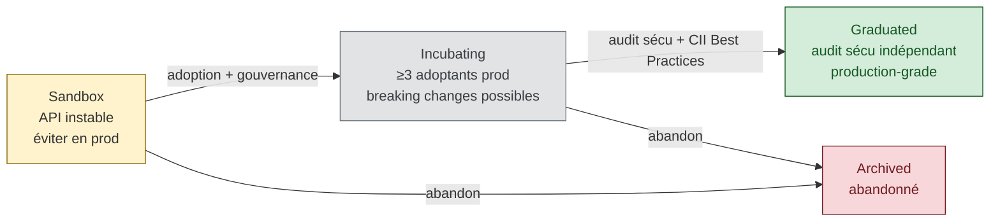
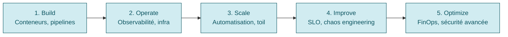

# CNCF — landscape et standards

Sources :
- [cncf.io](https://www.cncf.io/) — organisation mère (Linux Foundation, créée 2015).
- [landscape.cncf.io](https://landscape.cncf.io/) — carte interactive de l'écosystème.
- [cncf.io/reports](https://www.cncf.io/reports/) — rapports annuels et whitepapers.
- [cncf.io/projects](https://www.cncf.io/projects/) — liste officielle des projets.

## Niveaux de maturité

La CNCF classe ses projets en 3 niveaux ; chacun demande des critères de gouvernance, d'adoption et de sécurité croissants ([Graduation Criteria v1.4](https://github.com/cncf/toc/blob/main/process/graduation_criteria.md)).

| Niveau | Critères | Signification pratique |
|---|---|---|
| **Sandbox** | proposition validée par TOC, licence Apache 2.0, gouvernance ouverte | expérimental, API instable, éviter en prod critique |
| **Incubating** | ≥ 3 adoptants en prod, contributeurs diversifiés, roadmap publique, sécurité | adopté en prod mais breaking changes possibles |
| **Graduated** | audit de sécurité indépendant, CII Best Practices Passing, gouvernance mature | production-grade, API stable, support long terme |

Un projet peut être **archived** (abandonné) : toujours vérifier le statut sur [cncf.io/projects](https://www.cncf.io/projects/).

## Projets Graduated pour une plateforme dev

Sélection minimale pour construire une plateforme K8s + CI/CD + observabilité :

### Orchestration & runtime
| Projet | Rôle | Notes |
|---|---|---|
| [Kubernetes](https://kubernetes.io/) | orchestrateur de conteneurs | cycle release 3/an, supporter n-2 |
| [containerd](https://containerd.io/) | runtime conteneur OCI | runtime par défaut K8s depuis 1.24 |
| [etcd](https://etcd.io/) | KV store distribué | backing store K8s ; backups critiques |
| [CoreDNS](https://coredns.io/) | DNS cluster | remplaçant kube-dns, plugin-based |

### Packaging & delivery
| Projet | Rôle | Notes |
|---|---|---|
| [Helm](https://helm.sh/) | package manager K8s | charts = standard de fait ; Helm 3 sans Tiller |
| [Argo](https://argoproj.github.io/) (CD, Workflows, Rollouts, Events) | GitOps + workflow + progressive delivery | voir gitops/guides/principles-and-patterns.md |
| [Flux](https://fluxcd.io/) | GitOps toolkit | alternative à ArgoCD |
| [Buildpacks](https://buildpacks.io/) | build d'images sans Dockerfile | utile pour plateforme self-service |

### Observabilité
| Projet | Rôle | Notes |
|---|---|---|
| [Prometheus](https://prometheus.io/) | métriques + alerting | standard de fait, PromQL, pull model |
| [OpenTelemetry](https://opentelemetry.io/) | traces + métriques + logs | remplace OpenTracing/OpenCensus |
| [Fluentd](https://www.fluentd.org/) / [Fluent Bit](https://fluentbit.io/) | log forwarding | Fluent Bit = léger, edge/sidecar |
| [Jaeger](https://www.jaegertracing.io/) | tracing distribué | backend OTel populaire |

### Service mesh & networking
| Projet | Rôle | Notes |
|---|---|---|
| [Istio](https://istio.io/) | service mesh | graduated 2023, complet mais complexe |
| [Linkerd](https://linkerd.io/) | service mesh | plus léger, Rust data plane |
| [Envoy](https://www.envoyproxy.io/) | proxy L7 | data plane d'Istio |
| [Cilium](https://cilium.io/) | CNI + network policy eBPF | graduated 2023 |

### Sécurité & supply chain
| Projet | Rôle | Notes |
|---|---|---|
| [SPIFFE/SPIRE](https://spiffe.io/) | workload identity | zéro trust, attestation cryptographique |
| [Falco](https://falco.org/) | runtime security | détection anomalies via eBPF/syscalls |
| [Open Policy Agent](https://www.openpolicyagent.org/) | policy as code | Rego ; Gatekeeper pour K8s admission |
| [TUF](https://theupdateframework.io/) | secure software updates | base de Sigstore/Notary |

## Incubating à surveiller

Projets utiles fréquemment croisés en dev-platform : [cert-manager](https://cert-manager.io/), [KEDA](https://keda.sh/), [Crossplane](https://www.crossplane.io/), [Backstage](https://backstage.io/), [Kyverno](https://kyverno.io/), [Knative](https://knative.dev/), [Dapr](https://dapr.io/), [Longhorn](https://longhorn.io/), [Chaos Mesh](https://chaos-mesh.org/).

## Whitepapers incontournables

### 1. CNCF Cloud Native Definition v1.1
[github.com/cncf/toc/blob/main/DEFINITION.md](https://github.com/cncf/toc/blob/main/DEFINITION.md)
Piliers : containers, service meshes, microservices, immutable infrastructure, declarative APIs.

### 2. Cloud Native Maturity Model v3
[maturitymodel.cncf.io](https://maturitymodel.cncf.io/)
5 niveaux (Build → Operate → Scale → Improve → Optimize) sur 6 axes (People, Policy, Process, Tech, Business Outcomes, Platforms).

### 3. TAG App Delivery — Platform Engineering
[tag-app-delivery.cncf.io](https://tag-app-delivery.cncf.io/)
- [Platforms Whitepaper](https://tag-app-delivery.cncf.io/whitepapers/platforms/) — définition des *internal developer platforms*.
- [Platform Engineering Maturity Model](https://tag-app-delivery.cncf.io/whitepapers/platform-eng-maturity-model/).

### 4. Autres papers utiles
- [Cloud Native Security Whitepaper v2](https://tag-security.cncf.io/community/resources/security-whitepaper/).
- [CNCF Sustainability TAG](https://tag-env-sustainability.cncf.io/).
- [FinOps for Kubernetes](https://www.cncf.io/reports/finops-for-kubernetes/).
- [CNCF Annual Survey](https://www.cncf.io/reports/) — baromètre d'adoption.

## Comment choisir un projet CNCF

1. **Statut** : graduated > incubating > sandbox pour la prod critique.
2. **Gouvernance** : plusieurs vendors contributeurs ? Bus factor > 3 ?
3. **Release cadence** : régulière, CHANGELOG propre, CVE tracking.
4. **Sécurité** : audit public récent ([tag-security assessments](https://github.com/cncf/tag-security/tree/main/assessments)), CII passing.
5. **Écosystème** : plugins, docs, conférences (KubeCon talks).
6. **Exit cost** : standards ouverts (OCI, CNI, CSI, CRI, OpenTelemetry, SMI) > APIs propriétaires.

## Guides et sources

- [cncf.io/projects](https://www.cncf.io/projects/) — liste officielle à jour.
- [landscape.cncf.io](https://landscape.cncf.io/) — carte interactive.
- [cncf.io/reports](https://www.cncf.io/reports/) — whitepapers et études.
- [TOC process](https://github.com/cncf/toc) — graduation, archivage, gouvernance.
- [TAG App Delivery](https://tag-app-delivery.cncf.io/), [TAG Security](https://tag-security.cncf.io/), [TAG Observability](https://tag-dynatrace.cncf.io/).
