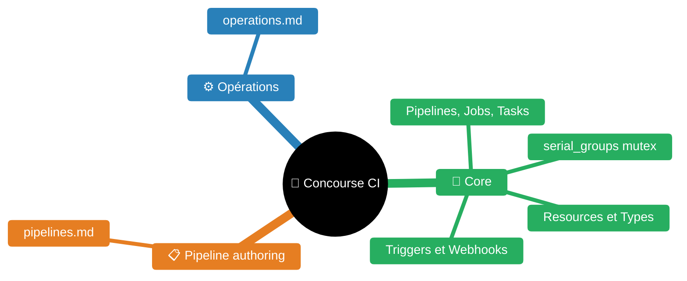
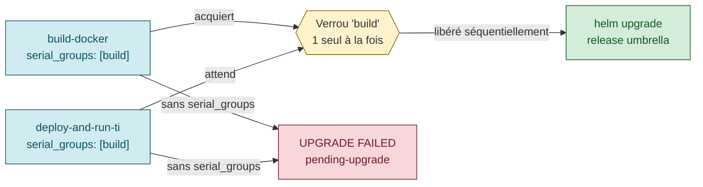
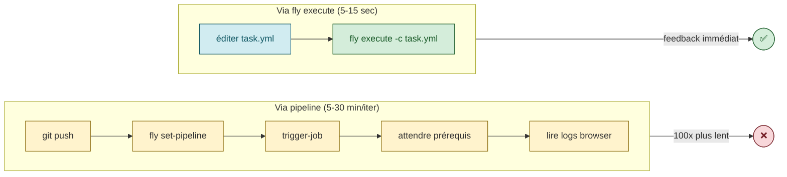

# Skill — Concourse CI

> Ce README.md fournit le récap rapide de la syntaxe Concourse ; les détails poussés sont dans les fichiers de `guides/`.

---


| Fichier | Description |
|---------|-------------|
| [README.md](README.md) | Point d'entrée — syntaxe rapide, fly CLI, checklist, serial_groups |
| [guides/pipelines.md](guides/pipelines.md) | YAML authoring — concepts, steps, resources, patterns, sécurité, intégration |
| [guides/operations.md](guides/operations.md) | Opérations — fly CLI reference, incidents (ATC restart, K8s credentials) |

## Syntaxe Concourse — rappels clés

### Variables et credentials

```yaml
# Variable simple (définie en pipeline-var, env var, ou dummy var_sources)
((variable))

# Credential Vault/Conjur (notation double-guillemet)
(("vault-path.clé"))

# Variable chargée dynamiquement dans un step
((.:variable-chargée))  # dot prefix = variable locale au build plan
```

**Exemples du projet** :
```yaml
# Credentials Conjur
(("docker_galanterie.registre"))       # registre Docker interne
(("gitlab.cle_privee"))                # clé SSH GitLab
(("<code>/dev.kafka_url"))              # URL Kafka pour l'env dev
(("kubernetes_z4-dev.value"))          # kubeconfig Z4-dev
(("snow_prod.url"))                    # URL ServiceNow prod

# Variables de pipeline
((quarkus))                            # nom du composant (instance var)
((git-app-uri))                        # URI du repo GitLab de l'app
```

### `var_sources` — variables statiques

```yaml
var_sources:
  - name: global-vars
    type: dummy
    config:
      vars:
        chart-helm:
          virtual_repo_name: helm-dev-virtual
          name: sld-ng
          version: 2.58.0
```

Référencées via `((global-vars:chart-helm.version))`.

### `load_var` — chargement dynamique

```yaml
- load_var: version
  file: versionning/number        # lit le fichier et charge dans la variable
  reveal: true                    # affiche la valeur dans les logs

- load_var: conf-namespace
  format: yml                     # parse YAML → accès aux champs
  file: repo-<equipe>-ci/infra-as-code/overlays/DEPLOYMENT/Z4-dev/namespace.yaml

# Utilisation
namespace: ((.:conf-namespace.metadata.name))
```

### `in_parallel` — parallélisation

```yaml
- in_parallel:
    - get: source-code
      trigger: true
    - get: pipeline-code
    - task: values-override
      file: ...
      params: { ... }
```

### `serial_groups` — mutex entre jobs

```yaml
- name: build-docker
  serial_groups: [ build ]   # partage le verrou "build" avec d'autres jobs

- name: deploy-and-run-ti
  serial_groups: [ build ]   # ne peut pas tourner en même temps que build-docker
```

**Cas d'usage critique — Helm concurrence sur la même release** : Helm n'a **pas de lock natif** sur ses releases ([Helm #10829](https://github.com/helm/helm/issues/10829)). Si 2 pipelines Concourse (ou 2 jobs) font `helm upgrade` sur la **même release umbrella** en parallèle → `Error: UPGRADE FAILED: another operation in progress` et release coincée en `pending-upgrade`. Parades, par ordre de préférence :

1. **Un seul pipeline orchestre le deploy umbrella** — les pipelines composants ne poussent qu'image+chart, un 3e pipeline fait le `helm upgrade`. Zéro race.
2. **`serial_groups: [helm-<release>]`** sur tous les jobs `deploy-*` qui touchent la même release, cross-pipeline via instance vars — force la sérialisation côté Concourse.
3. **Chain orchestration externe** — script mise qui `pause-job` / `unpause-job` pour sérialiser (pattern `trigger-chain-solution` de <solution-numerique>).
4. **Task `wait-release-unlocked`** défensive en pré-étape — attend que la release sorte de `pending-*` (timeout 60s → `helm rollback` auto). Défense en profondeur.

> Voir aussi [skill helm](../helm/README.md#concurrence-multi-pipelines--race-release-lock) et `helm/experience/umbrella-charts.md` section 6.



### Hooks

```yaml
on_success:
  task: alerting-teams-deploiement
  file: tasks-all-in-one/secret/teams/teams-deploiement.yaml
  params:
    STATUT: OK

on_failure:
  task: alerting-teams-deploiement
  params:
    STATUT: KO

ensure:
  try:                       # try = ne pas faire échouer le job si le hook échoue
    task: save-report-ti
    file: ...
```

---

## Ressources principales

### Git

```yaml
- name: repo-<code>-quarkus
  type: git
  source:
    uri: ssh://git@<gitlab-host>/<equipe>/<app>-sldng-quarkus.git
    private_key: (("gitlab.cle_privee"))
    branch: master
    ignore_paths: [infra-as-code, README.md]  # trigger seulement sur le code source
  check_every: never
  webhook_token: token-du-webhook

- name: versionning
  type: concourse-git-semver-tag  # resource type custom — tag semver sur git
  source:
    <<: *uri_git
```

### Docker Image

```yaml
- name: image-docker
  type: docker-image
  source:
    repository: (("docker_galanterie.registre"))/<equipe>/<app>
    insecure_registries: [(("docker_galanterie.registre"))]
    username: (("docker_galanterie.fascination"))
    password: (("docker_galanterie.mot_de_passe"))
    registry_mirror: http://(("docker_galanterie.registre"))
```

### Kubernetes

```yaml
- name: cluster-kubernetes-dev
  type: kubernetes-resource
  source:
    kubeconfig: (("kubernetes_z4-dev.value"))
    context: z4-dev
```

### Helm

```yaml
- name: helm-deployment
  type: helm-resource-deploiement
  source:
    stable_repo: "false"
    repos:
      - name: helm-dev-virtual
        url: (("helm_galanterie.repo"))
```

### ServiceNow (complicite)

```yaml
- name: complicite-snow
  type: concourse-snow-resource
  source:
    SNOW_URL: (("snow_prod.url"))
    SNOW_USER: (("snow_prod.fascination"))
    SNOW_PASSWORD: (("snow_prod.mot_de_passe"))
    S3_ENDPOINT_URL: (("s3_sauvegarde-concourse-m.endpoint"))
    FOLDER_PATH: <equipe>/complicite-iams/((quarkus))/reference-complicite
    WORKFLOW: default_s3
  check_every: ((snow_check_interval))
```

---

## Fly CLI — référence complète

### Connexion et cibles

```bash
# Login (local)
fly -t local login -c http://localhost:8088 -u admin -p admin

# Login (entreprise)
fly -t <equipe> login -c https://concourse.entreprise.intra --team-name <equipe>

# Lister les cibles enregistrées
fly targets

# Synchroniser la version CLI avec le serveur
fly -t local sync
```

### Pipelines

```bash
# Lister tous les pipelines
fly -t local pipelines

# Installer / mettre à jour un pipeline
fly -t local set-pipeline -p <pipeline> \
  -c ci/<pipeline>-pipeline.yml \
  -l pipeline-vars/<vars>.yml \
  -l pipeline-vars/credentials-kind.yml

# Récupérer le YAML déployé (utile pour vérifier l'interpolation)
fly -t local get-pipeline -p <pipeline>

# Exposer un pipeline (public)
fly -t local expose-pipeline -p <pipeline>

# Pauser / dépauser un pipeline
fly -t local pause-pipeline -p <pipeline>
fly -t local unpause-pipeline -p <pipeline>

# Détruire un pipeline
fly -t local destroy-pipeline -p <pipeline>
```

### Jobs et builds

```bash
# Lister les builds d'un pipeline (tous les jobs)
fly -t local builds -p <pipeline>

# Lister les builds d'un job spécifique
fly -t local builds -j <pipeline>/<job>

# Déclencher un job manuellement
fly -t local trigger-job -j <pipeline>/<job>

# Déclencher et suivre en temps réel (-w = watch)
fly -t local trigger-job -j <pipeline>/<job> -w

# Suivre un build en cours (par ID)
fly -t local watch -b <build-id>

# Annuler un build en cours
fly -t local abort-build -b <build-id>

# Pauser / dépauser un job
fly -t local pause-job -j <pipeline>/<job>
fly -t local unpause-job -j <pipeline>/<job>
```

### Resources

```bash
# Forcer la vérification d'une resource (OBLIGATOIRE après restart ATC ou git push)
fly -t local check-resource -r <pipeline>/<resource>

# Lister les versions détectées d'une resource
fly -t local resource-versions -r <pipeline>/<resource>

# Épingler une resource à une version
fly -t local pin-resource -r <pipeline>/<resource> -v ref:<sha>

# Désépingler une resource
fly -t local unpin-resource -r <pipeline>/<resource>
```

### Debug et introspection

```bash
# Entrer dans un container de task en cours (SSH interactif)
fly -t local intercept -b <build-id> -s <step-name>

# Exécuter une task one-off (hors pipeline)
fly -t local execute -c task.yml -i input=./local-dir

# Lister les workers
fly -t local workers

# Élaguer un worker mort
fly -t local prune-worker -w <worker-name>

# Lister les containers actifs
fly -t local containers

# Lister les volumes
fly -t local volumes
```

### Patterns d'usage courants

```bash
# Trouver les builds en cours ou en attente
fly -t local builds -p <pipeline> | grep -E "started|pending"

# Lire la fin d'un build terminé
fly -t local watch -b <build-id> | tail -30

# Chercher des erreurs dans la sortie d'un build
fly -t local watch -b <build-id> | grep -iE "ERROR|FAIL|Exception"

# Annuler un build stale avant d'en déclencher un nouveau (éviter l'empilement)
fly -t local abort-build -b <old-build-id>
fly -t local trigger-job -j <pipeline>/<job>

# Forcer la détection d'un nouveau commit après git push
fly -t local check-resource -r <pipeline>/source-code

# Vérifier qu'un pipeline est correctement interpolé
fly -t local get-pipeline -p <pipeline> | grep "((.*))"`  # aucune (()) ne doit rester

# Récupérer le résultat d'un test depuis un build
fly -t local watch -b <build-id> | grep -E "passed|failed|scenarios"
```

### Pièges fréquents

| Piège | Solution |
|-------|----------|
| Après restart ATC, les versions disparaissent | `fly check-resource -r <pipeline>/<resource>` obligatoire |
| `fly trigger-job` utilise la dernière version connue | Si aucune version n'est connue, le job reste `pending` — faire `check-resource` d'abord |
| `-l` files n'interpolent que le pipeline YAML | Les task files utilisent le credential manager K8s (secrets `concourse-main/*`) |
| `fly set-pipeline` ne redémarre pas les jobs | Les jobs en cours continuent avec l'ancien pipeline — `abort-build` si nécessaire |
| `fly intercept` échoue si le container est terminé | Utiliser `-s <step>` pour cibler le bon step, et le build doit être encore actif |
| Les noms de secrets K8s n'acceptent pas les underscores | RFC 1123 : utiliser des tirets (`docker-mirror`, pas `docker_mirror`) |

---

## Tests unitaires des tasks (`fly execute`)

> **Pattern indispensable** : tester une task Concourse en isolation, en
> 5-15 secondes, sans installer de pipeline ni declencher de job. Cycle de
> feedback **100x plus rapide** que via la pipeline complete.

### Pourquoi

Debugger une task via la pipeline est lent et bruyant :


1. Editer la task → `git commit && git push`
2. `fly set-pipeline` (ou attendre install-pipeline self-update)
3. `fly trigger-job -j .../job-qui-utilise-la-task -w`
4. Attendre les jobs prerequis (build, image, e2e prerequis)
5. Lire les logs Concourse dans le navigateur
6. Goto 1 → **5-30 minutes par iteration**

Avec `fly execute --config <task.yml>`, on lance la task **directement sur le
worker Concourse**, sans pipeline. Le cycle tombe a **5-15 secondes**.

### Anatomie

`fly execute` accepte :
- `-c, --config <task.yml>` : la task a executer
- `-i, --input NAME=PATH` : monte un dossier local comme input de la task
- `-o, --output NAME=PATH` : recupere un output dans un dossier local
- `-l <vars-file.yml>` : resoud les `((var))` dans la task
- `-v NAME=value` : surcharge un `((var))` Concourse (PAS un param task)
- `-p, --privileged` : run le container en privileged (necessaire pour
  oci-build-task notamment)
- `--include-ignored` : essentiel pour uploader les `.git/` des fixtures
  (sinon fly fait `git ls-files` sur l'input et exclut les .git/)
- `-j PIPELINE/JOB` : reutilise les inputs d'un job existant

**Piege** : `fly execute -v NAME=val` ne sur-charge PAS les params de la task.
Le `-v` resoud uniquement les `((var))` dans le YAML. Pour overrider un param,
il faut soit modifier le YAML avant execution (sed/yq), soit utiliser
`((nom-param))` dans la section `params:` du YAML pour le rendre interpolable.

### Exemple minimal

```bash
# Test direct via fly execute
fly -t local execute -p \
  --include-ignored \
  --config tasks/git/get-last-v.yml \
  -i source-code=tasks/.tests/fixtures/git-repo-with-v-tags \
  -l pipeline-vars/credentials-kind.yml
```

### Harness `scripts/test-task.sh`

Pour eviter de re-ecrire le boilerplate, le repo cicd inclut un runner qui
prend des **specs** declaratives et fait :
- merge des `PARAMS` du spec dans les `params:` du yaml source (via Python+yaml)
- charge automatiquement `pipeline-vars/credentials-kind.yml`
- expose des helpers (`require_kafka`, `require_oracle`, `load_kubeconfig`,
  `mk_test_namespace`, ...) pour skipper les tests si l'infra n'est pas la
- assertions sur exit code + grep/not-grep sur stdout
- cleanup `TEARDOWN` systematique

Spec type :

```bash
#!/usr/bin/env bash
. "$(dirname "${BASH_SOURCE[0]}")/_common.sh"

TASK="tasks/deploy/purge-kafka-groups.yml"
SETUP() { require_kafka; }                          # SKIP si pas de kafka

declare -A PARAMS=(
  [KAFKA_NAMESPACE]="<your-tiers-namespace>"
  [GROUP_PREFIX]="prefixe-test"
)
PARAMS[KUBECONFIG_CONTENT]="$(load_kubeconfig)"

EXPECT_GREP="Aucun consumer group"                  # multiline ok
EXPECT_NOT_GREP="ERREUR"
EXPECT_EXIT=0

TEARDOWN() { rm_test_namespace test-sandbox; }
```

### Lancer

```bash
mise test-tasks                          # tous (slow auto-skippes)
mise test-task purge-kafka-groups-empty  # un seul
mise test-tasks-slow                     # avec slow (Maven, Sonar, OWASP, behave Job K8s)
KEEP_TMP=1 mise test-task <nom>          # garde les fichiers temp pour debug
VERBOSE=1  mise test-task <nom>          # affiche stdout meme en PASS
```

### Bonnes pratiques pour rendre une task testable

- **Defaults sains** dans `params:` du YAML — un test minimal sans override doit
  pouvoir tourner. Sinon le test devient un duplicate de la pipeline calling code.
- **Validation explicite** des params requis en debut de task :
  ```sh
  if [ -z "$NAMESPACE" ]; then
    echo "ERREUR: NAMESPACE requis" ; exit 1
  fi
  ```
  → permet un test "happy path" et un test "missing param" sans toucher au YAML.
- **Hardening defensive** des operations git :
  ```sh
  git config --global --add safe.directory '*'
  ```
  → pas obligatoire en prod (les git resources sont owned correctement) mais
  permet aux tests avec fixtures git d'eviter le CVE-2022-24765 protection.
- **Pas de hardcode** de namespaces, URLs, registry. Tout passe par params →
  testable avec n'importe quelle valeur.
- **Sortie texte stable** pour le grep d'assertion. Eviter les timestamps ou
  IDs aleatoires en debut de ligne. Les bandeaux ANSI sont OK car le runner
  fait grep -F (literal).

### Bugs typiques attrapes par ce harness

| Bug | Symptome production | Test de regression |
|-----|---------------------|---------------------|
| `kubectl jsonpath '.items[0]'` crash sur liste vide | "array index out of bounds" → job en erreur opaque | spec qui pointe sur un selector inexistant, EXPECT_EXIT=0 |
| Default param obsolete (ex: `KAFKA_NAMESPACE: <code-composant>-dev` apres rename) | pod pas trouve → job KO 8s apres start | spec qui force le default a etre celui attendu |
| Validation manquante quand param vide | curl ou kubectl avec URL malformee | spec EXPECT_GREP="ERREUR: X requis" + EXPECT_EXIT=1 |
| `set -e` + curl `-sf` 4xx → exit 22 surprise | task plante en cours de boucle | spec qui exerce l'auth path puis attend l'exit 22 sur job 404 |

### Limites

- Couvre **1 task isolee**, pas le chainage `passed:`/`ensure:`/`serial_groups:`
- Vars du pipeline-vars composant (`((app-name))`, `((namespace))`) doivent
  etre passees explicitement via PARAMS (seul `credentials-kind.yml` est
  charge auto)
- Si TEARDOWN echoue, des artefacts peuvent rester (ns sandbox, /tmp logs)
- Tests destructifs sur infra reelle : utiliser des namespaces prefixes `test-*`

### Inline tasks → fichiers

**Anti-pattern** : avoir des `task:` inline avec `config:` complet dans le
pipeline.yaml. Avantage : auto-suffisant. Inconvenients :
- Non testable via `fly execute --config` (il n'y a pas de fichier)
- Duplique entre pipelines si plusieurs jobs utilisent la meme operation
- Pas d'historique git pertinent quand on debugge

**Pattern** : extraire chaque inline task vers `tasks/<categorie>/<nom>.yml` et
appeler via `file:` :

```yaml
# Avant (inline, non testable)
- task: build-image
  privileged: true
  config:
    platform: linux
    image_resource: { ... }
    inputs: [{ name: source-code }]
    outputs: [{ name: image }]
    run: { ... }

# Apres (fichier reutilisable + testable)
- task: build-image
  privileged: true
  file: pipelines/tasks/build/oci-build-image.yml
  input_mapping: { source: source-code }
  params:
    CONTEXT: source
    DOCKERFILE: source/Dockerfile
```

Le `input_mapping:` permet a la task generique (qui declare un input nomme
`source`) d'accepter n'importe quel input du pipeline (`source-code`, `db-code`,
etc.) → 1 task generique reutilisee 3x.

---


## Bonnes pratiques avancées

### `inputs: detect` sur les `put` steps

Par défaut, un `put` envoie **tous** les outputs du job au worker (source-code + tasks + versionning + ...). Utiliser `inputs: detect` (ou spécifier explicitement) pour limiter :

```yaml
- put: image-docker
  inputs: detect       # auto-détecte uniquement les inputs référencés dans params
  params:
    build: source-build
    tag_file: versionning/number
```

**Impact** : moins de données transférées au worker → moins d'attente avant le `put`.

### `across` + `set_pipeline` — gestion dynamique de flotte

Remplace les scripts `init-quarkus-pipeline.sh` manuels. Un job gère tous les pipelines :

```yaml
jobs:
  - name: set-all-quarkus-pipelines
    plan:
      - get: repo-<equipe>-ci
        trigger: true
      - load_var: components
        file: repo-<equipe>-ci/pipeline-vars/components-list.json
        format: json
        # components-list.json: ["<app>", "autre-composant"]
      - across:
          - var: component
            values: ((.:components))
        set_pipeline: quarkus
        file: repo-<equipe>-ci/ci/quarkus-pipeline.yml
        instance_vars:
          quarkus: ((.:component))
        var_files:
          - repo-<equipe>-ci/pipeline-vars/((.:component)).yml
```

**Avantages** :
- Ajouter un composant : ajouter son vars file + mettre à jour `components-list.json` → push → pipeline créé
- Supprimer un composant : retirer de la liste → pipeline archivé automatiquement
- Mettre à jour le template : modifier `quarkus-pipeline.yml` → tous les pipelines mis à jour

### Flyway — `validate` avant `migrate`

```bash
# Ordre recommandé (détecte les migrations modifiées après application)
flyway \
  -url=jdbc:oracle:thin:@${DB_HOST}:${DB_PORT}/${DB_SID} \
  -user=${FLYWAY_USER} -password=${FLYWAY_PASSWORD} \
  -cleanDisabled=true \
  -outOfOrder=false \
  validate migrate info
```

**`validate`** : vérifie les checksums des migrations déjà appliquées — détecte si un fichier SQL a été modifié après avoir été joué (erreur courante en dev). Coût : quasi nul. Ne jamais faire `migrate` sans `validate` en prod.

### Pinning de `tasks-all-in-one` sur semver tags

**Problème actuel** : si `branch: main` de `tasks-all-in-one` reçoit un changement cassant, tous les pipelines qui font un `get: tasks-all-in-one` au prochain run vont être brisés.

**Solution** : utiliser `concourse-git-semver-tag` (déjà dans votre stack) pour pinning :
```yaml
- name: tasks-all-in-one
  type: concourse-git-semver-tag
  source:
    uri: ssh://...tasks-all-in-one.git
    private_key: (("gitlab.cle_privee"))
    tag_filter: "v*"
```
Ou utiliser `tag: v1.2.3` dans un resource `type: git` pour pin manuel.

### `in_parallel` avec `fail_fast` et `limit`

```yaml
- in_parallel:
    fail_fast: true     # annule les steps en cours si l'un échoue
    limit: 3            # max 3 steps concurrent (évite de saturer l'API K8s)
    steps:
      - put: deploy-va
      - put: deploy-bench
      - put: deploy-camee
```

---

## Convention de nommage des pipelines

| Type | Nom pipeline | Exemple |
|------|-------------|---------|
| Master dédié | `{app}-master` | `<code-composant>-<solution-numerique>-master` |
| Générique instancié | `{project}/{type}:{app}` | `support-data-solution/quarkus:<code-composant>` |
| Feature branch | `{app}-{branch}` | `<code-composant>-feat-kafka-dlq` |
| Oracle DB | `{project}/oracle:{db}` | `support-data-solution/oracle:<code-composant>-base` |

---

## Checklist nouveau pipeline Concourse

- [ ] **Pipeline self-update** : job `installation-du-pipeline` avec `set_pipeline: self`
- [ ] **Webhook** : `check_every: never` + `webhook_token` (GitLab → Concourse)
- [ ] **Versioning** : RC/V tags ou `concourse-git-semver-tag`
- [ ] **Build** : Maven/Node/uv + TU dans la même task
- [ ] **Qualité** : SonarQube + OWASP Dependency Check
- [ ] **Image** : `oci-build-task-pe` (rootless, cache layers)
- [ ] **Deploy TI** : namespace éphémère + tests d'intégration + `ensure: save-reports`
- [ ] **Deploy env** : Helm ou Kustomize + Flyway si Oracle
- [ ] **Health check** : curl post-deploy sur chaque env
- [ ] **Rollback** : job dédié (avant-dernière version)
- [ ] **Secrets** : ExternalSecrets (préféré) ou Conjur vars `(("path.key"))`
- [ ] **Alerting** : webhook Teams `on_failure` sur chaque job
- [ ] **Reports** : Allure/Serenity/HTML sur S3
- [ ] **Feature branch** : pipeline séparé si besoin CI pre-merge
- [ ] **Change mgmt** : SNOW/IAMS pour prod (si requis)
- [ ] **`inputs: detect`** : sur tous les `put` (optimisation transfert)
- [ ] **`atomic: true`** : sur Helm deploy env non-TI (rollback auto si KO)
- [ ] **`try:`** : sur namespace create/delete et save-reports (non-bloquant)

---

## Skills connexes

- [`../sre/README.md`](../sre/README.md) — SRE et CI/CD : SLO comme deployment gate, smoke tests, postmortem
- [`../devops/README.md`](../devops/README.md) — Cycle DevOps, conventional commits, semantic release
- `../gitops/README.md` — Alternative pull-based au CI/CD push
