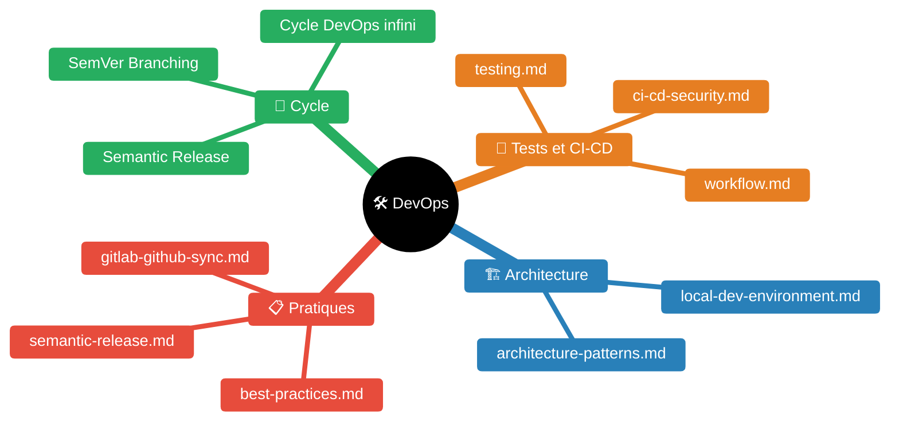
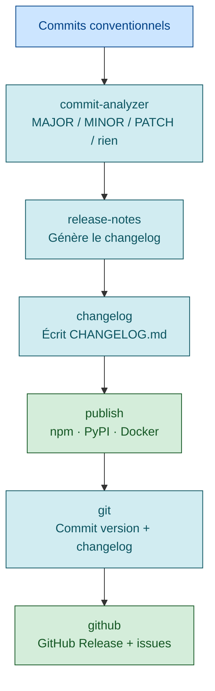
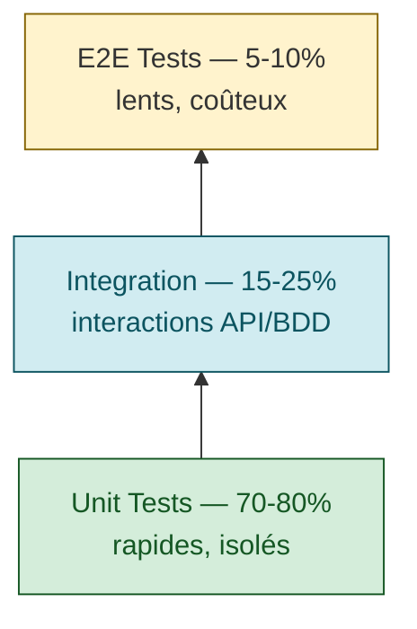
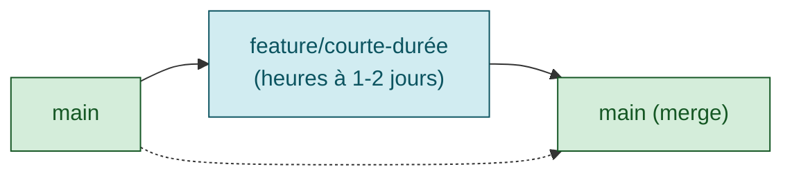
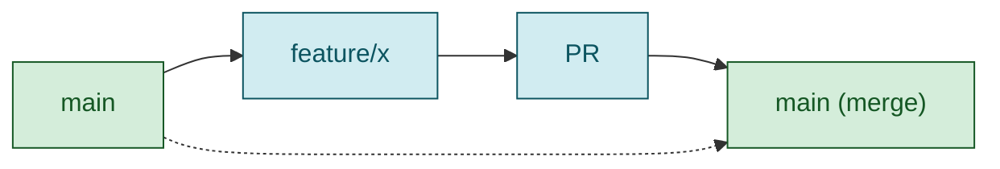

# DevOps — Skill de bonnes pratiques

> **Expérience projet** : voir `experience/devops.md` pour les leçons spécifiques au workspace <solution-numerique>.



| Fichier | Description |
|---------|-------------|
| [README.md](README.md) | Point d'entrée DevOps |
| [guides/architecture-patterns.md](guides/architecture-patterns.md) | Patterns d'architecture |
| [guides/best-practices.md](guides/best-practices.md) | Bonnes pratiques |
| [guides/ci-cd-security.md](guides/ci-cd-security.md) | Sécurité CI/CD |
| [guides/local-dev-environment.md](guides/local-dev-environment.md) | Environnement de dev local |
| [guides/semantic-release.md](guides/semantic-release.md) | Semantic Release |
| [guides/gitlab-github-sync.md](guides/gitlab-github-sync.md) | GitLab ↔ GitHub — options de synchronisation (verdict : source unique + mirror one-way) |
| [guides/testing.md](guides/testing.md) | Tests |
| [guides/workflow.md](guides/workflow.md) | Workflow |

## Le cycle ∞ DevOps

```mermaid
%%{init: {"theme": "base", "themeVariables": {"primaryColor": "#2C3E50", "primaryTextColor": "#FFFFFF"}}}%%
flowchart LR
    classDef proc fill:#D1ECF1,stroke:#0C5460,color:#0C5460
    classDef ok   fill:#D4EDDA,stroke:#155724,color:#155724
    classDef warn fill:#FFF3CD,stroke:#856404,color:#333
    classDef key  fill:#CCE5FF,stroke:#004085,color:#004085

    FF["Fix / Feat"]:::key
    B["Build"]:::proc
    A["Automate"]:::proc
    D["Docs"]:::proc
    T["Tests"]:::proc
    TI["TI"]:::proc
    S["Skills / KB"]:::proc
    V["Versioning"]:::proc
    P["Push + CI"]:::proc
    R["Release"]:::ok
    PR["Prod"]:::ok
    O["Observe"]:::warn
    FB["Feedback"]:::warn

    FF --> B --> A --> D --> T --> TI --> S --> V --> P --> R --> PR --> O --> FB --> FF
```



### Description des étapes

| Étape | Ce qu'on fait | Critère de sortie |
|-------|--------------|-------------------|
| **Build** | Implémenter feat/fix, lint, compiler | 0 erreur lint, build OK |
| **Automate** | Écrire/mettre à jour les tests unitaires et intégration | Tous les tests passent |
| **Docs** | README, README.md, CLAUDE.md, CHANGELOG | Docs synchronisées avec le code |
| **Tests** | Lancer la suite complète (unit + integ + E2E si dispo) | 0 régression |
| **TI** | Déployer / tester en environnement d'intégration | Smoke tests verts |
| **Skills** | Mettre à jour les README.md si nouveau pattern architectural | README.md reflète l'état réel |
| **Versioning** | Bumper la version (semantic-release ou manuellement) | Tag Git créé |
| **Push** | git push + CI/CD déclenché | Pipeline CI vert |
| **Release** | GitHub/GitLab Release, artefact publié | Release créée avec notes |
| **Prod** | Déploiement production | Health checks verts |
| **Observe** | Métriques, logs, traces, alertes | Dashboard nominal |
| **Feedback** | Retours utilisateurs, bugs, demandes | Backlog mis à jour |
| **Fix/Feat** | Prioriser et implémenter | → retour à Build |

---

## Règle fondamentale : Always finish what you start

**⚠️ NE JAMAIS RENDRE LA MAIN AU MILIEU DU PIPELINE.**

Quand Claude commence une étape du cycle, il va jusqu'au bout avant de rendre la main. L'utilisateur ne retrouve que des états stables :
- Code qui compile
- Tests qui passent
- Docs synchronisées
- Commit + push effectués

**Si une étape est interrompue (contexte saturé, erreur), la PROCHAINE session commence par finir l'étape en cours avant d'en démarrer une nouvelle.**

Si un doute sur le besoin → demander AVANT de coder. Sinon, dérouler tout.

---

## Pipeline local (obligatoire avant push — AUCUNE exception)

**S'applique à CHAQUE itération : `feat`, `fix`, `refactor`, `perf` — sans passe-droit.**

```
1. Code        → Implémenter le changement
2. Lint        → 0 erreurs (ruff / eslint / tsc selon stack)
3. Tests unit  → Maintenir les tests existants + ajouter les tests pour le nouveau code
                  - Un nouveau module/service/composant = un nouveau fichier de test
                  - Un fix → un test qui reproduit le bug
4. Tests integ → Si applicables (E2E, API tests)
5. Docs        → Mettre à jour TOUS les fichiers impactés :
                  - README.md (compteurs, architecture, API, fonctionnalités)
                  - README.md du projet (état, compteurs, nouvelles sections)
                  - CLAUDE.md (si nouvelle convention ou architecture)
                  - skills/devops/README.md (si nouveau scope, process)
6. Commit      → Message conventionnel (voir section Conventional Commits)
7. Push        → git push origin main (ou branche feature)
```

### Règles impératives (sans exception)

1. **Ne jamais pusher sans tests** — tous doivent passer
2. **Ne jamais pusher avec des erreurs de lint**
3. **Toujours maintenir ET augmenter les tests** — chaque feat/fix ajoute des tests, jamais de régression
4. **Toujours mettre à jour la doc** — README, README.md, CLAUDE.md — à chaque itération
5. **Un commit = un changement logique** — pas de commits fourre-tout
6. **Ne jamais commiter de secrets** — .env, tokens, credentials dans .gitignore
7. **Ne jamais rendre la main au milieu du pipeline** — exécuter toutes les étapes d'affilée
8. **Toujours proposer les prochaines étapes** — à chaque jalon (feat livrée, bug fixé, test vert, runbook validé), proposer ce qui vient après pour maintenir le cycle ∞ en mouvement
9. **Ne jamais remettre un problème à plus tard** — un test flaky, un warning, une fragilité détectée se corrige immédiatement, pas "dans un prochain sprint". La dette technique naît de chaque problème ignoré

---

## Conventional Commits

### Format

```
<type>(<scope>): <description>

[corps optionnel]

[pied de page optionnel]
```

### Types autorisés

| Type | Usage | Impact SemVer |
|------|-------|---------------|
| `feat` | Nouvelle fonctionnalité | MINOR (0.X.0) |
| `fix` | Correction de bug | PATCH (0.0.X) |
| `docs` | Documentation uniquement | Aucun |
| `style` | Formatage, espaces — pas de logique | Aucun |
| `refactor` | Restructuration sans changement de comportement | Aucun |
| `perf` | Amélioration de performance | PATCH |
| `test` | Ajout ou correction de tests | Aucun |
| `build` | Système de build, dépendances externes | Aucun |
| `ci` | Configuration CI/CD | Aucun |
| `chore` | Maintenance, tâches annexes | Aucun |
| `revert` | Annulation d'un commit précédent | Variable |

### Breaking changes → MAJOR (X.0.0)

```
feat(api)!: changer le format de réponse d'authentification

BREAKING CHANGE: Le header Basic Auth n'est plus accepté.
```

---

## Semantic Release

### Principe



### Semantic Versioning (SemVer)

Format : **MAJOR.MINOR.PATCH** (ex: `2.4.1`)

| Incrément | Quand | Exemple |
|-----------|-------|---------|
| MAJOR | Changements incompatibles (breaking) | 1.4.2 → 2.0.0 |
| MINOR | Nouvelle fonctionnalité rétrocompatible | 2.0.0 → 2.1.0 |
| PATCH | Correction de bug rétrocompatible | 2.1.0 → 2.1.1 |

Pre-release : `2.1.0-beta.1`, `2.1.0-rc.1`

### Configuration Python (python-semantic-release)

```toml
# pyproject.toml
[tool.semantic_release]
version_toml = ["pyproject.toml:project.version"]
commit_parser = "conventional"
tag_format = "v{version}"

[tool.semantic_release.branches.main]
match = "main"

[tool.semantic_release.changelog]
exclude_commit_patterns = ["chore\\(release\\):"]
```

---

## Documentation as Code

### Principes

1. **Les docs vivent dans le repo** — même workflow que le code (PR, review, CI)
2. **Source unique de vérité** — pas de wiki séparé qui dérive
3. **Mettre à jour en même temps que le code** — un changement d'API = un changement de doc
4. **Auto-générer quand possible** — OpenAPI/Swagger, TypeDoc, Sphinx

### Checklist documentation (à chaque changement)

- [ ] README.md à jour (compteurs, commandes, structure)
- [ ] README.md concerné mis à jour
- [ ] CLAUDE.md si nouvelle convention ou pattern
- [ ] CHANGELOG.md généré automatiquement (semantic-release)

---

## Bonnes pratiques DevOps reconnues

### Pyramide de tests



- **Unit** : tester chaque fonction isolément, mock des dépendances externes
- **Integration** : tester les interactions (API endpoints, BDD, service-to-service)
- **E2E** : parcours critiques uniquement, garder la suite minimale
- **Seuil de couverture** : viser 80%+ sans forcer 100% (rendements décroissants)

### CI/CD pipeline

```mermaid
flowchart LR
    classDef proc fill:#D1ECF1,stroke:#0C5460,color:#0C5460
    classDef ok   fill:#D4EDDA,stroke:#155724,color:#155724
    classDef warn fill:#FFF3CD,stroke:#856404,color:#333
    subgraph QA["Qualité"]
        CO["1. Checkout"]:::proc
        LI["2. Lint"]:::proc
        SA["3. Analyse statique"]:::proc
        TU["4. Tests unitaires"]:::proc
        BU["5. Build"]:::proc
        TI["6. Tests intégration"]:::proc
        SC["7. Scan sécurité"]:::proc
        TE["8. Tests E2E"]:::proc
    end
    subgraph DEPLOY["Déploiement"]
        DS["9. Deploy staging"]:::proc
        SK["10. Smoke tests"]:::ok
        DP["11. Deploy prod"]:::ok
        MO["12. Monitoring"]:::warn
    end
    QA --> DEPLOY
```



**Principes clés :**
- **Build once, deploy many** — un seul artefact promu à travers les environnements
- **Fail fast** — les tests les plus rapides en premier
- **Paralléliser** les étapes indépendantes
- **Cache** les dépendances entre runs

### Stratégies de branching

**Trunk-Based Development (recommandé pour CI/CD) :**

Branches courtes, merge fréquent, feature flags pour découpler déploiement et release.

**GitHub Flow (compromis simple) :**


### Sécurité (DevSecOps)

| Pratique | Outils | Quand |
|----------|--------|-------|
| SAST (analyse statique) | SonarQube, Semgrep, CodeQL | Chaque PR |
| DAST (analyse dynamique) | OWASP ZAP, Burp Suite | Post-déploiement staging |
| SCA (dépendances) | Snyk, Dependabot, Trivy | Chaque build |
| Secrets | detect-secrets, gitleaks | Pre-commit hook |
| SBOM | Syft, CycloneDX | Chaque release |

**Principes :**
- Ne jamais stocker de secrets dans le code ou les images Docker
- Centraliser dans un vault (HashiCorp Vault, Conjur, AWS Secrets Manager)
- Credentials dynamiques et courte durée plutôt que statiques
- Scanner les dépendances automatiquement, bloquer les CVE critiques

### Observabilité (les 3 piliers)

| Pilier | Ce que c'est | Outils |
|--------|-------------|--------|
| **Logs** | Événements horodatés, structurés (JSON) | ELK, Loki, Datadog |
| **Métriques** | Mesures numériques agrégées | Prometheus, Grafana, Dynatrace |
| **Traces** | Chemin de bout en bout des requêtes | OpenTelemetry, Jaeger |

**SLI / SLO / SLA :**
- **SLI** : ce qu'on mesure (latence p99, taux d'erreur, disponibilité)
- **SLO** : objectif interne (99.9% dispo, p99 < 200ms)
- **SLA** : engagement contractuel client
- **Error budget** = 100% - SLO → budget sain = shipper ; budget épuisé = fiabiliser

**Alerting :**
- Alerter sur le burn rate du SLO, pas sur des métriques brutes
- Éviter l'alert fatigue — uniquement des alertes actionnables
- Inclure un runbook avec chaque alerte

### Conteneurs

**Dockerfile bonnes pratiques :**
```dockerfile
# Multi-stage : build séparé du runtime
FROM eclipse-temurin:17-jdk AS builder
WORKDIR /app
COPY . .
RUN ./mvnw package -DskipTests

FROM eclipse-temurin:17-jre
WORKDIR /app
COPY --from=builder /app/target/*.jar app.jar
USER 1000
EXPOSE 8080
ENTRYPOINT ["java", "-jar", "app.jar"]
```

- Tags spécifiques (pas `latest`) pour la reproductibilité
- `.dockerignore` pour exclure target/, node_modules/, .git/
- Run en non-root (USER 1000)
- Scanner les images (Trivy, Docker Scout)
- Ordonner les instructions par fréquence de changement (cache Docker)

### Release management

1. Commits conventionnels → semantic-release détermine la version
2. CHANGELOG.md généré automatiquement
3. Tag Git + GitHub/GitLab Release créés
4. Package publié (npm, PyPI, Docker, Maven)
5. Artefacts signés + SBOM généré

---

## Les 12 Facteurs (The Twelve-Factor App) #bonnepratiques

Méthodologie pour construire des apps cloud-native maintenables. Applicable au-delà du SaaS, pour toute pratique DevOps/Ops.

| # | Facteur | Résumé | Application DevOps |
|---|---------|--------|-------------------|
| I | **Codebase** | Un repo, N déploiements | Un seul repo par app, branches ≠ apps |
| II | **Dependencies** | Déclaration explicite et isolation | `requirements.txt`, `pom.xml`, containers — jamais de dépendance implicite système |
| III | **Config** | Config dans l'environnement, pas dans le code | Variables d'env, Vault/Conjur/Credhub — jamais de credentials dans le repo |
| IV | **Backing Services** | DB, broker, cache = ressources interchangeables | Changer une URL de connexion, pas le code |
| V | **Build, Release, Run** | Séparer build → release → run | Artefacts immutables, CI/CD reproductible |
| VI | **Processes** | Stateless, état dans les backing services | Pas de fichiers locaux persistants en mémoire process |
| VII | **Port Binding** | App auto-contenue, exporte via port | Containers, pas de serveur web externe installé séparément |
| VIII | **Concurrency** | Scale horizontal par process model | Pods/replicas Kubernetes, process types séparés |
| IX | **Disposability** | Démarrage rapide, arrêt gracieux | Rolling deploys, auto-scaling, résilience |
| X | **Dev/Prod Parity** | Environnements identiques dev/staging/prod | Mêmes versions, mêmes backing services — pas de SQLite en dev si Oracle en prod |
| XI | **Logs** | Logs = flux d'événements sur stdout/stderr | App n'écrit pas dans des fichiers — l'orchestrateur (Docker, K8s) capture et route |
| XII | **Admin Processes** | Tâches admin dans le même environnement | Migrations DB, scripts one-off livrés avec le code, pas ad-hoc sur un serveur |

### Facteurs les plus critiques pour l'Ops
- **III (Config)** : externalisée, jamais commitée
- **V (Build/Release/Run)** : artefacts immutables
- **IX (Disposability)** : processus jetables et résilients
- **X (Dev/Prod Parity)** : environnement de test au plus proche de la prod (mêmes versions DB, même OS, mêmes services)

### Anti-patterns fréquents
- SQLite en test / Oracle en prod → bugs découverts trop tard
- Config en dur dans le code → secrets exposés, déploiement fragile
- État dans le filesystem local → perte au redémarrage, scale impossible
- Logs dans des fichiers rotatifs → perte de visibilité, pas de corrélation

---

## Cohérence du patrimoine #bonnepratiques

### 1. Dev/Prod Parity (Factor X)

- L'environnement de test doit utiliser les mêmes versions que la production (DB, middleware, OS)
- Si impossible (ex: Oracle 19c EE pas disponible en Docker gratuit → Oracle 21c XE), le documenter explicitement comme dette technique
- Lister les écarts connus et leurs risques dans la documentation du projet

### 2. Cohérence code ↔ documentation ↔ tests

- Après chaque refactoring majeur, vérifier que la documentation (runbooks, description des tests, README.md) reflète le code actuel
- Anti-pattern : le code évolue mais les docs référencent encore l'ancienne architecture (ex: TRUNCATE+ATCSN dans les docs alors que le code fait TMST_SOURCE+purge)
- Checklist post-refactoring : scripts ✓, tests ✓, docs ✓, runbooks ✓, README.md ✓

### 3. Patrimoine de tests

- Chaque fichier de test doit avoir un rôle distinct (ex: test_30 = logique directe Python, test_40 = scripts shell en containers)
- Ne pas supprimer un test "parce qu'il semble redondant" sans vérifier qu'il teste bien une couche différente
- Documenter le rôle de chaque fichier de test dans un fichier dédié (ex: description_tests.md)
- Les tests qui échouent de manière connue doivent être documentés avec la raison (ex: "6 EXPDP permissions Oracle XE")

### 4. Transmission d'état inter-composants

- Préférer des fichiers auto-descriptifs (enveloppes avec métadonnées : source, cible, timestamp, machine) aux fichiers plats contenant juste une valeur
- Format sourceable par bash : `key="value"` avec header commenté
- Nommer les fichiers avec assez de contexte pour qu'un opérateur puisse les identifier sans documentation externe

---

## Apprendre en testant

**Philosophie : l'environnement de test EST la documentation vivante.**

Un test qui passe prouve que la procédure fonctionne. Un runbook sans test est une opinion.

### Principes

1. **Docker Compose comme validateur de runbook** — si le test passe, la procédure est exécutable. Le fichier `docker-compose.yml` devient le runbook machine-readable.
2. **Composants réels > mocks** — un OGG Free 23ai dans Docker valide le vrai LogMiner, les vrais trail files, le vrai comportement HANDLECOLLISIONS. Un mock ne peut pas capturer les edge cases d'un produit aussi complexe.
3. **Les tests alimentent les runbooks** — chaque bug trouvé en test corrige la procédure. C'est la boucle ∞ DevOps appliquée à l'infrastructure : test → découverte → fix runbook → re-test.
4. **Tests = filet de sécurité** — quand on modifie une procédure (changer l'ordre des étapes, ajouter un pré-requis), les tests existants détectent les régressions.

### Exemple concret : OGG stock refresh

Le projet `ogg-stock-refresh` valide 3 méthodes de refresh Oracle GoldenGate avec 56 tests pytest sur des conteneurs Oracle 23ai + OGG Free réels :
- Integrated Extract (LogMiner) + Classic Replicat en Docker
- Convergence validée par polling row-count (source = cible)
- HANDLECOLLISIONS testé en conditions réelles (INSERT conflicts, UPDATE sur ligne absente)
- Chaque méthode de refresh (A, B, C) testée indépendamment

Les 3 bugs SQL des scripts discovery (produit cartésien, colonnes absentes) ont été trouvés grâce aux tests, pas en production.

---

## Observabilité des environnements de test

Les tests sans observabilité sont des boîtes noires. Un test rouge sans logs exploitables fait perdre plus de temps que le test lui-même.

### Sorties exploitables

| Sortie | Usage | Convention |
|--------|-------|------------|
| JUnit XML (`--junitxml=reports/junit.xml`) | CI/CD, trend analysis | Toujours activer en CI |
| Logs structurés (module `logging`, pas `print`) | Debug post-mortem | Level INFO par défaut, DEBUG sur demande |
| Logs conteneur (`docker logs <ctn>`) | Diagnostic infra | Nommer les conteneurs explicitement |
| Répertoire `reports/` | Collecte centralisée | Dans `.gitignore`, jamais commité |

### Métriques de convergence (spécifique réplication)

- **Trail file size** — indicateur d'activité Extract (si le fichier ne grossit plus, l'Extract est bloqué)
- **Row-count polling** — métrique de convergence source/cible (boucle until `count_source == count_cible`)
- **OGG report files** (`dirrpt/`) — Extract et Replicat écrivent leur journal ; parser les `ERROR` et `WARNING`
- **Lag monitoring** — `SEND REPLICAT, LAG` donne le retard en secondes

### Patterns Bash pour observabilité (USE/RED)

#### Step lifecycle (RED : Rate, Errors, Duration)
Chaque etape d'une chaine industrialisee est instrumentee :
```bash
step_begin "nom_etape" "Description"    # enregistre timestamp debut
# ... logique metier ...
step_add_rows 1500                      # compteur lignes traitees
step_end "OK"                           # calcule duration, rate, ecrit .metrics
```
Fichier metrics genere : `$REPORT_DIR/nom_etape.metrics` (format key=value, sourceable).

#### USE snapshots (Utilization, Saturation, Errors)
Captures a des moments cles (avant/apres chaque operation critique) :
```bash
capture_use_metrics "pre_purge"   # FRA%, FRA libre, lag replicat
capture_use_metrics "post_purge"
```

#### Rapport de chaine
`generate_chain_report "methode_c"` lit tous les `.metrics`, affiche 2 tableaux (RED + USE) + resume.

#### Table rendering (pure bash)
`render_table "Titre" "Col1|Col2|Col3" "val1|val2|val3" ...` : colonnes auto-sizees, alignement numerique/texte, couleurs par status (OK=vert, FAILED=rouge).

### Envelope inter-chaine (communication par fichier)

Pattern pour transmettre l'etat entre scripts/machines sans base de donnees partagee :
```bash
# Source cree une enveloppe
create_envelope "methode_c" "o085301" "t001302" \
    "refresh_timestamp=\"2026-03-09 00:00:00\"" \
    "scn_before=\"12345678\""

# Cible charge l'enveloppe
source_envelope "methode_c" "o085301" "t001302"
echo "$refresh_timestamp"  # variable disponible
```
- Format : `key="value"` (sourceable par bash)
- Nommage : `method_source_to_target_timestamp.env`
- Directories : `envelopes/` (sortant), `inbox/` (entrant)
- Transfert : scp/rsync/volume partage entre les machines

### Boucle retour

Les résultats de test sont des inputs pour l'itération suivante du cycle ∞ :
```
Test rouge → Lire les logs/rapports → Identifier la cause → Corriger runbook/code → Re-tester
```

Chaque itération rend le runbook plus fiable et le test plus précis.

---

## Infrastructure as mise tasks -- cycle vertueux

L'infra locale est pilotee par des taches mise organisees par **scenario de vie** :

| Scenario | Quand | Effet |
|----------|-------|-------|
| `stack` | Premiere install (nouvelle machine) | Cree tout de zero |
| `start` | Matin (apres stop) | Relance les containers existants |
| `stop` | Soir | Arrete tout, conserve l'etat |
| `update` | Changement de code | Push + reinstalle |
| `rebuild-m2` | Changement de dependances | Reconstruit les images concernees |
| `nuke` | Reset complet | Supprime tout, repart de zero |

**Principes :**
- Chaque operation manuelle d'infra devient une tache mise (documentation executable)
- Les taches sont **idempotentes** : les relancer produit le meme resultat
- `stop`/`start` preservent l'etat (volumes, clusters) -- seul `nuke` detruit
- Le developpeur ameliore ces taches au fil du temps : chaque friction corrigee rend l'infra plus fiable (cycle vertueux)
- Les taches utilitaires (`worker-start`, `registry-portforward`, `gitea-push`) sont composables par les scenarios
- **Regle des 3 repetitions** : toute commande (fly, kubectl, docker, curl) executee 3 fois manuellement doit devenir une tache mise. Si elle existe deja, l'enrichir. Cela inclut les commandes d'observation (logs, status, builds) autant que les commandes d'action (trigger, deploy, rollback)
- Les taches d'observation sont aussi importantes que les taches d'action : pouvoir voir ce qui se passe (builds, jobs, tasks, logs) est essentiel pour diagnostiquer les problemes et comprendre le systeme

---

## Environnement de développement local

Voir `guides/local-dev-environment.md` pour les bonnes pratiques complètes :
- **Profils applicatifs** : default=TU (H2/in-memory), %dev=Docker Compose localhost, prod=env vars
- **Docker Compose** : active le profil dev via env var (`QUARKUS_PROFILE=dev`), zéro duplication de config
- **Dev replacement** : remplacer un container par une instance locale (`mise dev-<code>`)
- **Retour Docker** : rebuild + restart (`mise box-<code>`)
- **Tests E2E** : polling BDD direct (pas de `wait_for_log`), fiable quel que soit le mode de déploiement

## Réflexe troubleshooting

Dès qu'une solution complète est trouvée pour un problème (plus d'effet de bord, objectif atteint), elle DOIT être ajoutée dans `experience/<skill-name>.md` de la skill du domaine concerné. Format : fait concret → **Pourquoi** → **Où**. Cette KB cumulative permet d'éviter de re-débuger les mêmes problèmes.

---

## Guides détaillés

- `guides/architecture-patterns.md` — Patterns architecture frontend/backend
- `guides/best-practices.md` — React, TypeScript, performance, sécurité
- `guides/ci-cd-security.md` — Pipeline CI/CD, DevSecOps
- `guides/local-dev-environment.md` — Environnement de dev local, profiling
- `experience/pieges-et-correctifs.md` — KB cumulative des pièges et correctifs rencontrés
- `guides/semantic-release.md` — Versioning, commitlint, release automation
- `guides/testing.md` — Pyramide des tests, stratégies
- `guides/workflow.md` — Méthode A/R, git workflow, déploiement

---

## Skills connexes

- [`../sre/README.md`](../sre/README.md) — Site Reliability Engineering : SLI/SLO/error budget pilotent le pipeline CI/CD
- [`../concourse/README.md`](../concourse/README.md) — Outil CI/CD spécifique avec ses patterns
- `../gitops/README.md` — Déploiement déclaratif pull-based, complémentaire au CI/CD push
- [`../kubernetes/README.md`](../kubernetes/README.md) — Déploiement et orchestration cible
