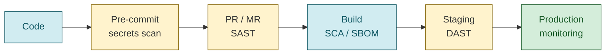

# CI/CD & Sécurité — Référence détaillée

## Pipeline CI/CD complet

### Architecture type

```yaml
# .github/workflows/ci.yml
name: CI/CD Pipeline
on:
  push:
    branches: [main]
  pull_request:
    branches: [main]

jobs:
  lint:
    runs-on: ubuntu-latest
    steps:
      - uses: actions/checkout@v4
      - name: Backend lint
        run: cd backend && ruff check .
      - name: Frontend lint
        run: cd frontend && npx tsc --noEmit

  test-backend:
    runs-on: ubuntu-latest
    needs: lint
    steps:
      - uses: actions/checkout@v4
      - uses: actions/setup-python@v5
        with: { python-version: "3.12" }
      - run: cd backend && pip install -e ".[dev]"
      - run: cd backend && pytest --cov=app --cov-report=xml
      - uses: codecov/codecov-action@v4

  test-frontend:
    runs-on: ubuntu-latest
    needs: lint
    steps:
      - uses: actions/checkout@v4
      - uses: actions/setup-node@v4
        with: { node-version: 20 }
      - run: cd frontend && npm ci
      - run: cd frontend && npm test -- --coverage

  test-e2e:
    runs-on: ubuntu-latest
    needs: [test-backend, test-frontend]
    steps:
      - uses: actions/checkout@v4
      - uses: actions/setup-python@v5
        with: { python-version: "3.12" }
      - uses: actions/setup-node@v4
        with: { node-version: 20 }
      - run: cd backend && pip install -e ".[dev]"
      - run: cd frontend && npm ci && npx playwright install --with-deps chromium
      - run: cd frontend && npx playwright test
        env:
          MOCK_MODE: "true"

  security:
    runs-on: ubuntu-latest
    needs: lint
    steps:
      - uses: actions/checkout@v4
      - name: Scan secrets
        uses: trufflesecurity/trufflehog@main
      - name: Scan dependencies
        uses: snyk/actions/node@master
        env:
          SNYK_TOKEN: ${{ secrets.SNYK_TOKEN }}

  release:
    if: github.ref == 'refs/heads/main' && github.event_name == 'push'
    needs: [test-e2e, security]
    runs-on: ubuntu-latest
    permissions:
      contents: write
    steps:
      - uses: actions/checkout@v4
        with: { fetch-depth: 0 }
      - run: npx semantic-release
        env:
          GITHUB_TOKEN: ${{ secrets.GITHUB_TOKEN }}
```

### Principes de pipeline

| Principe | Description |
|----------|------------|
| **Build once, deploy many** | Un seul artefact promu à travers les environnements |
| **Fail fast** | Tests les plus rapides en premier (lint → unit → integration → E2E) |
| **Paralléliser** | Étapes indépendantes en parallèle (backend et frontend) |
| **Cache agressif** | Dépendances npm/pip, layers Docker, résultats de build |
| **Reproductibilité** | Versions pinnées, lockfiles, images Docker taguées |
| **Idempotent** | Re-run le pipeline N fois = même résultat |

### Stratégies de déploiement

| Stratégie | Description | Risque |
|-----------|-------------|--------|
| **Blue-green** | Deux environnements identiques, basculer le trafic | Faible |
| **Canary** | Petit % du trafic vers la nouvelle version | Très faible |
| **Rolling** | Remplacement progressif des instances | Moyen |
| **Feature flags** | Découpler déploiement de release | Très faible |
| **Recreate** | Tout arrêter, tout redéployer | Élevé (downtime) |

### Rollback

- Rollback automatique sur échec des health checks
- Garder N versions précédentes déployables
- Feature flags pour désactiver sans redéployer
- Blue-green : basculer le trafic instantanément

---

## DevSecOps

### Shift-left security

Intégrer la sécurité le plus tôt possible dans le cycle :

```
Code → Pre-commit (secrets) → PR (SAST) → Build (SCA) → Staging (DAST) → Production (monitoring)


```

### SAST — Static Application Security Testing

Analyse du code source sans exécution.

| Outil | Langages | Usage |
|-------|----------|-------|
| SonarQube | Multi-langage | Qualité + sécurité, très complet |
| Semgrep | Multi-langage | Règles personnalisables, rapide |
| CodeQL | Multi-langage | Intégré GitHub, analyse sémantique |
| Bandit | Python | Spécialisé Python, léger |

**Quand :** Chaque PR, en CI.

### DAST — Dynamic Application Security Testing

Tests boîte noire contre l'application en cours d'exécution.

| Outil | Usage |
|-------|-------|
| OWASP ZAP | Open-source, API scan, spider |
| Burp Suite | Professionnel, très complet |
| Nuclei | Templates de vulnérabilités, rapide |

**Quand :** Post-déploiement en staging, avant promotion en production.

### SCA — Software Composition Analysis

Scan des dépendances tierces pour les CVE connues.

| Outil | Fonctionnalités |
|-------|----------------|
| Snyk | Scan + fix automatique des vulnérabilités |
| Dependabot | PRs automatiques de mise à jour (GitHub natif) |
| Renovate | PRs automatiques, très configurable |
| Trivy | Scan conteneurs + dépendances + IaC |
| Grype | Scan de vulnérabilités, léger |

**Quand :** Chaque build + scan quotidien programmé.

### Gestion des secrets

**Règles absolues :**
1. Ne JAMAIS commiter de secrets (tokens, mots de passe, clés API)
2. `.env` dans `.gitignore` — toujours
3. Utiliser des variables d'environnement ou un vault
4. Credentials dynamiques et courte durée > credentials statiques
5. Rotation automatique sur un calendrier
6. RBAC : accès minimum nécessaire

**Outils de détection :**

| Outil | Usage |
|-------|-------|
| `detect-secrets` | Pre-commit hook, baseline de secrets |
| `gitleaks` | Scan historique Git complet |
| `trufflehog` | Scan profond, entropy detection |
| GitHub Secret Scanning | Natif GitHub, alertes automatiques |

**Pre-commit hook :**
```yaml
# .pre-commit-config.yaml
repos:
  - repo: https://github.com/Yelp/detect-secrets
    rev: v1.4.0
    hooks:
      - id: detect-secrets
        args: ['--baseline', '.secrets.baseline']
```

### Supply chain security

| Pratique | Outil |
|----------|-------|
| SBOM (Software Bill of Materials) | Syft, CycloneDX |
| Signature d'artefacts | Sigstore, cosign |
| Provenance vérifiable | SLSA framework |
| Pin des versions | Lockfiles (package-lock.json, poetry.lock) |
| Registre privé | Nexus, Artifactory, GitHub Packages |

---

## Conteneurs

### Dockerfile bonnes pratiques

```dockerfile
# 1. Multi-stage : séparer build et runtime
FROM python:3.12-slim AS builder
WORKDIR /app
COPY requirements.txt .
RUN pip install --no-cache-dir --prefix=/install -r requirements.txt
COPY . .

FROM python:3.12-slim
WORKDIR /app
COPY --from=builder /install /usr/local
COPY --from=builder /app .

# 2. Non-root
RUN adduser --disabled-password --no-create-home appuser
USER appuser

# 3. Health check
HEALTHCHECK --interval=30s --timeout=3s \
  CMD curl -f http://localhost:8080/health || exit 1

# 4. Signal handling
STOPSIGNAL SIGTERM

EXPOSE 8080
CMD ["uvicorn", "app.main:app", "--host", "0.0.0.0", "--port", "8080"]
```

### Checklist conteneur

- [ ] Tag spécifique (pas `latest`)
- [ ] Multi-stage build
- [ ] Run en non-root
- [ ] `.dockerignore` configuré
- [ ] Pas de secrets dans l'image
- [ ] Health check défini
- [ ] Image scannée (Trivy)
- [ ] Layer ordering optimisé pour le cache

### Scan d'images

```bash
# Trivy
trivy image myapp:latest

# Docker Scout
docker scout cves myapp:latest

# Grype
grype myapp:latest
```

---

## Observabilité

### Les 4 signaux dorés (Golden Signals)

| Signal | Ce qu'il mesure | Alerte quand |
|--------|----------------|-------------|
| **Latency** | Temps de réponse des requêtes | p99 > seuil SLO |
| **Traffic** | Volume de requêtes | Anomalie vs baseline |
| **Errors** | Taux de requêtes en erreur | > seuil SLO |
| **Saturation** | Utilisation des ressources | > 80% CPU/mémoire/disque |

### OpenTelemetry (standard 2025-2026)

```python
# Instrumentation Python
from opentelemetry import trace
from opentelemetry.sdk.trace import TracerProvider
from opentelemetry.sdk.trace.export import BatchSpanProcessor
from opentelemetry.exporter.otlp.proto.grpc.trace_exporter import OTLPSpanExporter

provider = TracerProvider()
processor = BatchSpanProcessor(OTLPSpanExporter(endpoint="http://collector:4317"))
provider.add_span_processor(processor)
trace.set_tracer_provider(provider)

tracer = trace.get_tracer(__name__)

with tracer.start_as_current_span("process_request") as span:
    span.set_attribute("service.name", "topology-api")
    # ... logique métier
```

### Alerting SLO-based

```
Error budget = 100% - SLO

Exemple : SLO = 99.9% disponibilité
→ Error budget = 0.1% = 43.8 minutes/mois

Si burn rate > 1x → consommation normale
Si burn rate > 2x → notification
Si burn rate > 10x → page d'astreinte
Si budget épuisé → gel des features, focus fiabilité
```
