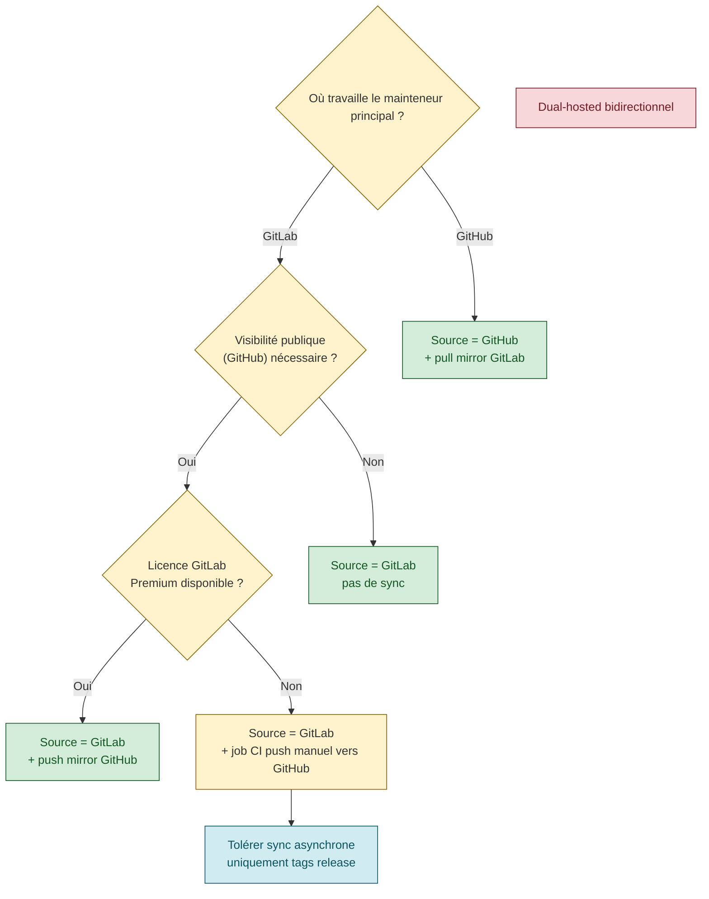

# GitLab ↔ GitHub — options de synchronisation

> **Verdict pratique** : il n'existe pas de "lien symbolique" cross-plateforme entre GitLab et GitHub, et **la synchronisation bidirectionnelle est déconseillée officiellement par GitLab** (risques de boucles + divergences). La seule approche sans friction est **une source de vérité + mirror one-way**.

---

## §1 — Cas d'usage typiques

| Cas | Intention | Solution recommandée |
|---|---|---|
| Projet perso visible sur GitHub ET gardé sur GitLab corpo | Double vitrine | Source GitHub + pull mirror GitLab (1 sens) |
| Projet corpo (GitLab) dont l'open-source doit être publié sur GitHub | Publication OSS | Source GitLab + push mirror GitHub (1 sens, GitLab Premium+) |
| Projet développé à 4 mains avec un collaborateur externe | Collaboration hétérogène | **Déconseillé** — migrer les deux côtés sur la même plateforme |
| Dual-hosted de facto (repos différents) qu'on veut "unifier" | Idée séduisante | **Accepter la contrainte** : choisir un côté, abandonner l'autre |

---

## §2 — Pull mirror GitHub → GitLab (gratuit)

**Disponibilité** : GitLab Free et au-dessus, on-prem et SaaS.

**Principe** : GitLab tire régulièrement depuis GitHub. Le repo GitLab devient un miroir **read-only** (push refusé si le mirror est actif).

**Setup** : Settings → Repository → Mirroring repositories → Mirror direction: **Pull** → URL HTTPS de GitHub + PAT GitHub `repo` scope.

**Délai** : check toutes les 30 minutes par défaut, déclenchement manuel possible via API.

**Limite** : pas de sync dans l'autre sens. Les modifications poussées sur GitLab seraient écrasées à la prochaine synchro (donc refusées d'office).

---

## §3 — Push mirror GitLab → GitHub (Premium+)

**Disponibilité** : GitLab **Premium** (self-managed) ou **Premium SaaS**. Non disponible en Free.

**Principe** : GitLab pousse à chaque push sur GitHub. Le repo GitHub devient le miroir.

**Setup** : Settings → Repository → Mirroring repositories → Mirror direction: **Push** → URL HTTPS de GitHub + PAT GitHub `repo` scope.

**Délai** : déclenché quasi-temps réel par les hooks post-receive GitLab.

**Limite** : non gratuit. Pour un projet perso sans licence Premium, impraticable.

---

## §4 — GitHub Actions / GitLab CI pour sync croisé

**Principe** : chaque push déclenche un job qui fait `git push` vers l'autre plateforme.

**Avantages** : fonctionne sur Free des deux côtés.

**Risques** :
- **Boucles** : si le job ne filtre pas correctement son propre commit de sync, la plateforme opposée déclenche à son tour → boucle infinie
- **Divergences** : un push concurrent des deux côtés produit une divergence que le job ne sait pas résoudre
- **Maintenance** : double CI à maintenir, tokens à faire tourner sur les deux

**À n'utiliser que** : pour des cas très simples (sync d'une branche unique, pas de tags protégés, un seul mainteneur).

---

## §5 — Webhook n8n / relais externe

**Principe** : un workflow n8n (ou Node-RED, ou script cron) écoute les webhooks des deux côtés et fait les push correspondants.

**Avantages** : contrôle total sur la logique de sync, possibilité de filtrer/transformer les commits.

**Risques** : mêmes que §4 + dépendance à un relais tiers qui doit rester up.

---

## §6 — Ce qui n'existe pas

- ❌ **Liens symboliques git cross-plateforme** — git n'a pas de notion de repo distant permanent, seulement de remotes qu'il faut pousser/tirer manuellement ou via hook
- ❌ **Fork cross-plateforme natif** — GitHub fork un GitHub, GitLab fork un GitLab, pas de fork cross
- ❌ **Mode bidirectionnel natif supporté par GitLab** — [la doc officielle GitLab Mirroring](https://docs.gitlab.com/ee/user/project/repository/mirror/) recommande explicitement d'utiliser **soit** pull **soit** push, jamais les deux en même temps

---

## §7 — Recommandation finale

> **Choisir un côté comme source de vérité** et utiliser le mirror one-way approprié. Le dual-hosted bidirectionnel est une source permanente de friction, même avec de l'automation.

Arbre de décision :

---

## §8 — Notes opérationnelles pour <entreprise>

- **Groupes privés GitLab <entreprise>** : `<groupe-interne>` est owner-only (non-membres : 404). Mirror push vers GitHub exposerait des repos privés — vérifier que le contenu est véritablement publiable
- **Risque de fuite secrets** : avant d'activer un mirror push GitHub, auditer l'historique du repo GitLab pour tokens, credentials, chemins internes (hostnames internes du type `git-scm.<your-org>.intra`, URLs d'applications internes, etc.)
- **Approche conservative** : pour un projet qui commence sur GitLab <entreprise>, garder sur GitLab jusqu'à ce que l'ouverture OSS soit formalisée (validation hiérarchique + audit sécurité)

---

## Sources

- [GitLab Docs — Repository mirroring](https://docs.gitlab.com/ee/user/project/repository/mirror/ "GitLab — Repository mirroring (pull/push)")
- [GitHub Docs — Pushing to a mirror](https://docs.github.com/en/repositories/creating-and-managing-repositories/duplicating-a-repository "GitHub — Duplicating a repository (via bare mirror)")
- Session d'exploration JD (conv. `b6125ca6`, 2026-04-20) — validation du verdict one-way
