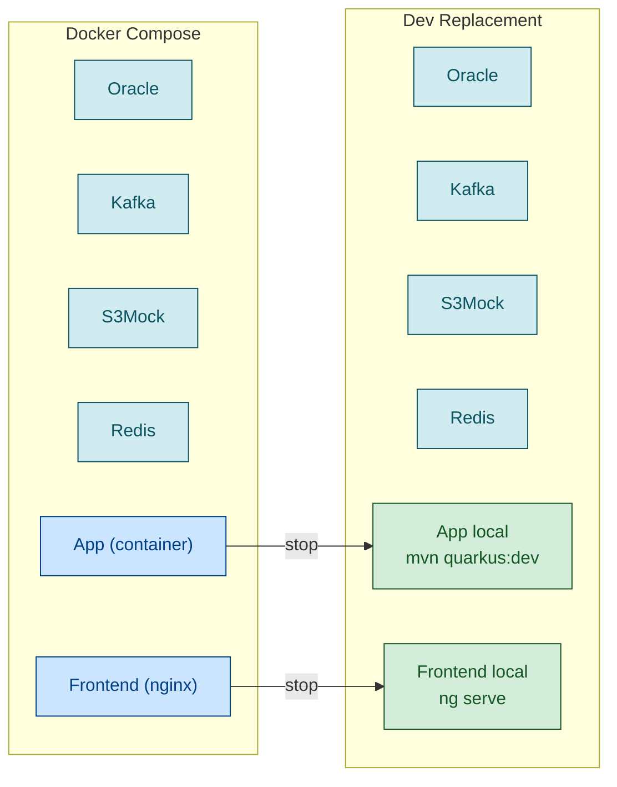

# Environnement de developpement local — Bonnes pratiques

## Principes

Un bon environnement de dev local doit offrir :
1. **Onboarding court** : `mise stack && misetest` suffit pour demarrer
2. **Zero config manuelle** : tout est dans les fichiers de config versiones
3. **Dev replacement** : pouvoir remplacer n'importe quel container par une instance locale
4. **Pas de duplication** : une seule source de verite pour la config

## Architecture des profils

### Default = TU (Tests Unitaires)

Les valeurs par defaut dans `application.properties` (ou equivalent) doivent etre TU-safe :
- **BDD** : H2 en memoire (ou equivalent in-process)
- **Messaging** : in-memory (pas de broker reel)
- **Services externes** : NONE ou mock
- **Pas de reference a des hosts distants**

### %dev = Docker Compose local

Le profil dev pointe vers les tiers locaux (Docker Compose) :
- BDD : `localhost:1521` (Oracle), `localhost:5432` (PostgreSQL)
- Kafka : `localhost:9092`
- S3 : `localhost:9090` (S3Mock)
- Redis : `localhost:6379`

### Prod = env vars

Les env vars K8s/Concourse surchargent tout. Les defaults ne sont jamais utilises en prod.

### Docker Compose active le profil dev

```yaml
<composant>-app:
  environment:
    - QUARKUS_PROFILE=dev           # Quarkus
    - SPRING_PROFILES_ACTIVE=dev    # Spring Boot
    # Pas d'autres env vars ! Tout est dans application.properties %dev.
```

Avantages :
- **Zero duplication** entre docker-compose.yml et application.properties
- **Meme config** pour Docker Compose et `mvn quarkus:dev` / `./mvnw spring-boot:run`
- **Dev replacement** transparent : arreter le container, lancer localement

## Dev replacement

### Concept



### .mise.toml recommande

Le `.mise.toml` doit etre le **point d'entree unique** pour toutes les operations. Un nouveau developpeur doit pouvoir demarrer avec `mise stack && mise test`.

```bash
# ── Lifecycle ───────────────────────────────────────────────
mise stack          # Build complet + demarrage
mise test           # Lance les tests
mise kill           # Arrete tout (containers + process locaux)
mise fresh          # kill + nettoyage complet des volumes

# ── Kill parametrable ──────────────────────────────────────
mise kill -- --target=quarkus   # Arrete seulement le backend
mise kill -- --target=angular   # Arrete seulement le frontend
mise kill -- --except=oracle    # Arrete tout sauf la BDD

# ── Nettoyage complet ─────────────────────────────────────
mise fresh          # Supprime tout (containers + volumes + images + process dev)

# ── Dev replacement ───────────────────────────────────────
mise dev-<code-backend>    # Stop container backend → mvn quarkus:dev
mise dev-<code-frontend>  # Stop container frontend → ng serve
mise box-<code-backend>   # Rebuild + retour au container backend
mise box-<code-frontend>  # Rebuild + retour au container frontend
```

### Principes cles du .mise.toml

1. **Idempotent** — `sources`/`outputs` pour le setup, `|| true` pour les commandes tolerantes
2. **Tolerant** — `set -euo pipefail` avec `|| true` explicite sur les commandes optionnelles
3. **Auto-documenté** — `mise aide` ou `mise tasks`

### Tests E2E — polling BDD plutot que wait_for_log

Ne jamais se fier a la lecture des logs Docker pour valider qu'un traitement asynchrone est termine. Les logs dependent du mode de deploiement (container vs process local) et du format de sortie.

**Bonne pratique : polling BDD direct**
```python
# MAUVAIS — fragile, depend du mode de deploiement
def wait_for_log(pattern, timeout=20):
    docker_logs = subprocess.run(["docker", "logs", "my-container"], ...)
    # Ne marche pas si l'app tourne en quarkus:dev

# BON — fiable, independant du deploiement
POLL_RETRIES = int(os.environ.get("POLL_RETRIES", 60))  # 120s max, sort des la 1ere donnee
for _ in range(POLL_RETRIES):
    if sql_query("SELECT COUNT(*) FROM my_table") > baseline:
        return  # traitement termine
    time.sleep(2)
```

Avantages :
- Fonctionne quel que soit le mode de deploiement (container, quarkus:dev, jar)
- Pas de dependance au format des logs
- Pas besoin de modifier l'application (pas d'endpoint de test dedie)
- Detecte le resultat reel (donnees en BDD) plutot qu'un effet de bord (log)

## Permissions .m2

Les builds Docker qui montent `~/.m2` en volume creent des fichiers owned par root. Avant un `mvn quarkus:dev` ou `mvn test` local :

```bash
sudo chown -R $(id -u):$(id -g) ~/.m2/repository
```

A documenter dans le README et automatiser via `misefix-permissions`.

## Logs et diagnostics pendant le demarrage

Bonne pratique : pendant que le stack demarre (et avant le timeout du health check), surveiller les logs des tiers pour detecter les erreurs tot :

```bash
# En parallele du mise stack :
docker logs -f <composant>-base 2>&1 | grep -E "ERROR|WARN|Flyway"
docker logs -f kafka 2>&1 | grep -E "ERROR|started"
docker logs -f <composant>-<service> 2>&1 | grep -E "ERROR|started|Profile"
```

Les erreurs Flyway, les problemes de connexion Kafka, et les erreurs de demarrage Quarkus sont visibles bien avant le timeout du health check.

## Quarkus 2.x vs 3.x — impact sur la config

| Aspect | Quarkus 2.x | Quarkus 3.x |
|--------|-------------|-------------|
| `db-kind` | Build-time fixe | Runtime-overridable |
| Default = H2 | Impossible (build fige Oracle) | Possible |
| Workaround TU | `%test` override vers H2 | H2 par defaut, `%dev` override vers Oracle |
| Dev Services | TestContainers (peut etre incompatible) | TestContainers ameliores + Redpanda |

## Kafka dev mode — consumer groups et timeouts

En dev mode (`quarkus:dev`), les consumers Kafka SmallRye sont plus lents a rebalancer. Bonnes pratiques :

1. **`session.timeout.ms` raisonnable** — 30s (pas 30 min !). Le broker doit detecter un consumer mort rapidement
2. **`heartbeat.interval.ms`** — 10s (⅓ du session timeout)
3. **`auto.offset.reset=latest`** — les nouveaux consumer groups ignorent les messages anterieurs
4. **Purge des consumer groups** avant `dev-quarkus` — evite le replay de messages perimes (S3 404)
5. **`-D` log suppression** pour les WARN framework non corrigeables — documenter dans le README pour retester lors d'une montee de version

## Outil de build : mise

**mise** (`.mise.toml`) est l'unique outil d'orchestration. Il installe automatiquement Python/Node et offre du parallelisme.

Points cles mise :
- `[tools]` declare les versions python/node → `mise install` suffit
- `sources`/`outputs` pour l'idempotence (remplace les marker files)
- `usage` flags pour les parametres (`--authent`, `--target`, `--except`)
- `depends` statiques (les deps conditionnelles restent du bash dans `run`)

## Anti-patterns a eviter

1. **Copier toutes les env vars dans docker-compose.yml** → utiliser le profil Quarkus/Spring
2. **Pointer `%dev` vers des serveurs distants** → `%dev` = toujours localhost
3. **Tests unitaires dependant d'un Oracle reel** → H2 en memoire + Mockito
4. **Oublier les Dev Services** → les desactiver si on utilise Docker Compose
5. **Permissions root dans .m2** → automatiser le fix dans le .mise.toml
6. **Kafka session.timeout.ms trop long** → 30s max en dev, pas 30 min
7. **Pas de `auto.offset.reset`** → toujours `latest` en dev pour eviter les replays

## Proxy corporate — pièges courants

### no_proxy manquant sur localhost

Dans un environnement avec proxy corporate, `localhost` et `127.0.0.1` doivent être explicitement exclus du proxy. Sinon les appels locaux (Ollama, services dev, APIs locales) sont interceptés et échouent avec des réponses HTML.

```bash
export no_proxy=localhost,127.0.0.1,::1
export NO_PROXY=localhost,127.0.0.1,::1  # certains outils lisent la version majuscule
```

Dans `.mise.toml` :
```toml
[env]
no_proxy = "localhost,127.0.0.1,::1"
NO_PROXY = "localhost,127.0.0.1,::1"
```

Symptôme : requêtes HTTP vers localhost retournent du HTML d'authentification proxy, status 407, ou connexion refusée.

### bubblewrap / AppArmor sur Ubuntu 23.10+

Ubuntu 23.10+ et systèmes avec AppArmor activent `restrict_unprivileged_userns=1`, ce qui bloque bubblewrap (`bwrap`) — outil de sandboxing utilisé par Flatpak, certains outils de build, harnesses de tests.

```bash
# Vérifier si bubblewrap fonctionne :
bwrap --ro-bind / / --dev /dev --proc /proc --tmpfs /tmp echo ok
```

Si cette commande échoue avec `bwrap: Can't bind mount...` ou `Operation not permitted`, bwrap est bloqué par AppArmor.

**Solution A (patch système)** :
```bash
sudo sysctl -w kernel.apparmor_restrict_unprivileged_userns=0
```

**Solution B (fallback code)** : détecter bwrap au runtime et basculer sur `subprocess` classique si indisponible. Toujours avoir un fallback non-sandboxé.

## Output Python en temps réel (CI/CD)

Python bufferise stdout par défaut. En CI, cela donne des logs vides pendant de longues exécutions puis tout apparaît d'un coup à la fin.

```bash
# Variable d'env :
PYTHONUNBUFFERED=1 python3 my_script.py

# Dans le script :
import sys
print("message", flush=True)
sys.stdout.flush()
```

Dans un Dockerfile ou une task CI :
```dockerfile
ENV PYTHONUNBUFFERED=1
```

## Scripts shell — python3 obligatoire sur Ubuntu moderne

Sur Ubuntu 22.04+ et Debian 12+, `python` n'est plus installé par défaut, seulement `python3`. Les scripts CI et les Dockerfiles doivent utiliser `python3` explicitement.

```bash
# ✗
python my_script.py

# ✓
python3 my_script.py
```
