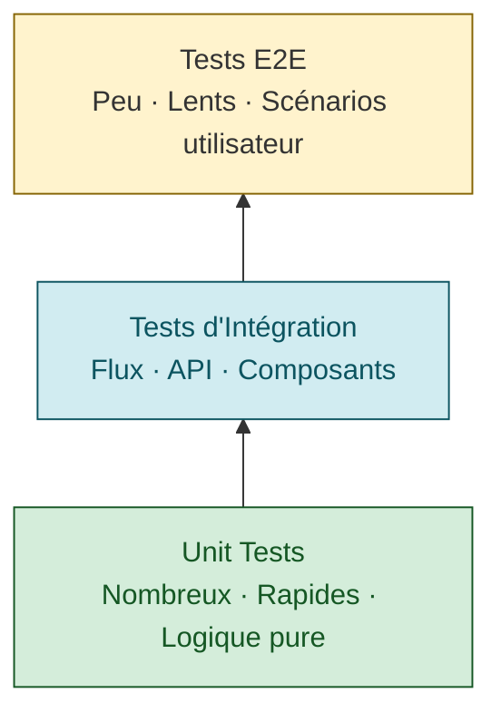

# Testing Strategies

Guide complet des stratégies de test, de la vérification manuelle aux tests automatisés.

## Table of Contents
1. [Testing Philosophy](#testing-philosophy)
2. [Manual Testing](#manual-testing)
3. [Unit Testing](#unit-testing)
4. [Integration Testing](#integration-testing)
5. [End-to-End Testing](#end-to-end-testing)
6. [Test Automation](#test-automation)

---

## Testing Philosophy

### Testing Pyramid



**Distribution recommandée**:
- **70%** Unit tests - Logique métier, fonctions pures, hooks
- **20%** Integration tests - Flux complets, API, state management
- **10%** E2E tests - Scénarios utilisateur critiques

### Test First, Fix Later

**Principe**: Écrire un test qui échoue avant de fixer un bug

```typescript
// 1. Write failing test
test('handles empty array', () => {
  expect(processData([])).toEqual([]);
});
// ❌ Test fails - processData crashes on empty array

// 2. Fix the bug
function processData(data: any[]) {
  if (!data || data.length === 0) return []; // Add check
  return data.map(item => transform(item));
}
// ✅ Test passes

// 3. Commit test + fix together
```

---

## Manual Testing

### Pre-Deployment Checklist

**Critical Paths** - Tester avant chaque déploiement:

#### UI/UX
- [ ] Page loads without errors
- [ ] All navigation links work
- [ ] Forms submit correctly
- [ ] Validation messages display
- [ ] Buttons have correct labels
- [ ] Loading states show during async operations
- [ ] Error states display user-friendly messages
- [ ] Success states show confirmation

#### Functionality
- [ ] Main feature works as expected
- [ ] Edge cases handled (empty data, max values, etc.)
- [ ] User permissions enforced
- [ ] Data persistence works (save, reload)
- [ ] Filters/search return correct results

#### Cross-Browser
- [ ] Chrome (latest)
- [ ] Firefox (latest)
- [ ] Safari (latest)
- [ ] Edge (latest)

#### Responsive Design
- [ ] Mobile (< 768px)
- [ ] Tablet (768px - 1024px)
- [ ] Desktop (> 1024px)

#### Performance
- [ ] Initial load < 3 seconds
- [ ] Interactions responsive (< 100ms)
- [ ] No memory leaks (check DevTools)
- [ ] Images optimized/lazy loaded

#### Accessibility
- [ ] Keyboard navigation works
- [ ] Screen reader compatible (ARIA labels)
- [ ] Sufficient color contrast
- [ ] Focus indicators visible

#### Console Checks
- [ ] No errors in browser console
- [ ] No warnings (or documented)
- [ ] No failed network requests
- [ ] No 404s for assets

### Manual Testing Template

**Fichier**: `MANUAL_TEST_CHECKLIST.md`

```markdown
# Manual Test Checklist - v1.2.0

**Date**: 2026-01-15
**Tester**: Alice
**Environment**: Staging

## Feature: User Profile Update

### Test Cases

#### TC-001: Update Profile Name
- [ ] Navigate to /profile
- [ ] Click "Edit Profile"
- [ ] Change name field
- [ ] Click "Save"
- [ ] Verify name updated on page
- [ ] Reload page
- [ ] Verify name persisted

**Result**: ✅ Pass
**Notes**: -

#### TC-002: Invalid Email Format
- [ ] Enter invalid email (e.g., "notanemail")
- [ ] Click "Save"
- [ ] Verify error message displays
- [ ] Verify save did not occur

**Result**: ✅ Pass
**Notes**: -

#### TC-003: Upload Avatar
- [ ] Click "Upload Avatar"
- [ ] Select image file (< 2MB)
- [ ] Verify preview shows
- [ ] Click "Save"
- [ ] Verify avatar updated

**Result**: ❌ Fail
**Notes**: Upload fails with 500 error. Bug #456 created.

## Summary
- Total: 15 test cases
- Pass: 14
- Fail: 1
- Blocked: 0
```

### Exploratory Testing

**Time-boxed sessions** (30-60 min):

1. **Goal**: Découvrir bugs non anticipés
2. **Method**: Utiliser l'app "comme un utilisateur réel"
3. **Focus**: Scénarios inhabituels, edge cases
4. **Document**: Capturer screenshots/vidéos des bugs trouvés

**Template de session**:
```markdown
# Exploratory Testing Session

**Date**: 2026-01-15
**Duration**: 45 min
**Tester**: Bob
**Charter**: Explore user profile features, focus on data validation

## Findings

### Bug 1: Phone Number Accepts Letters
- **Severity**: Medium
- **Steps**: Enter "abc" in phone number field
- **Expected**: Only digits allowed
- **Actual**: Letters accepted, causes server error on save
- **Screenshot**: bug-001.png

### Improvement 1: No Character Count on Bio
- **Type**: Enhancement
- **Description**: Bio field has 500 char limit but no counter
- **Suggestion**: Add "X/500" counter like Twitter

## Summary
- Bugs found: 3 (1 high, 1 medium, 1 low)
- Enhancements: 2
- Time well spent: Yes, found critical validation issue
```

---

## Unit Testing

### Setup (Jest + React Testing Library)

```bash
npm install --save-dev jest @testing-library/react @testing-library/jest-dom @testing-library/user-event
```

**jest.config.js**:
```javascript
module.exports = {
  preset: 'ts-jest',
  testEnvironment: 'jsdom',
  setupFilesAfterEnv: ['<rootDir>/jest.setup.js'],
  moduleNameMapper: {
    '\\.(css|less|scss)$': 'identity-obj-proxy',
  },
};
```

**jest.setup.js**:
```javascript
import '@testing-library/jest-dom';
```

### Testing Pure Functions

```typescript
// utils/calculations.ts
export function calculateTotal(items: { price: number; quantity: number }[]) {
  return items.reduce((sum, item) => sum + item.price * item.quantity, 0);
}

// utils/calculations.test.ts
import { calculateTotal } from './calculations';

describe('calculateTotal', () => {
  it('calculates total for multiple items', () => {
    const items = [
      { price: 10, quantity: 2 },
      { price: 5, quantity: 3 },
    ];
    expect(calculateTotal(items)).toBe(35); // (10*2) + (5*3)
  });

  it('returns 0 for empty array', () => {
    expect(calculateTotal([])).toBe(0);
  });

  it('handles single item', () => {
    expect(calculateTotal([{ price: 7, quantity: 1 }])).toBe(7);
  });
});
```

### Testing React Components

```typescript
// components/Button.tsx
interface Props {
  onClick: () => void;
  children: React.ReactNode;
  disabled?: boolean;
}

export function Button({ onClick, children, disabled }: Props) {
  return (
    <button onClick={onClick} disabled={disabled}>
      {children}
    </button>
  );
}

// components/Button.test.tsx
import { render, screen, fireEvent } from '@testing-library/react';
import { Button } from './Button';

describe('Button', () => {
  it('renders children', () => {
    render(<Button onClick={() => {}}>Click me</Button>);
    expect(screen.getByText('Click me')).toBeInTheDocument();
  });

  it('calls onClick when clicked', () => {
    const handleClick = jest.fn();
    render(<Button onClick={handleClick}>Click me</Button>);

    fireEvent.click(screen.getByText('Click me'));
    expect(handleClick).toHaveBeenCalledTimes(1);
  });

  it('does not call onClick when disabled', () => {
    const handleClick = jest.fn();
    render(<Button onClick={handleClick} disabled>Click me</Button>);

    fireEvent.click(screen.getByText('Click me'));
    expect(handleClick).not.toHaveBeenCalled();
  });
});
```

### Testing Custom Hooks

```typescript
// hooks/useCounter.ts
export function useCounter(initialValue = 0) {
  const [count, setCount] = useState(initialValue);

  const increment = () => setCount(c => c + 1);
  const decrement = () => setCount(c => c - 1);
  const reset = () => setCount(initialValue);

  return { count, increment, decrement, reset };
}

// hooks/useCounter.test.ts
import { renderHook, act } from '@testing-library/react';
import { useCounter } from './useCounter';

describe('useCounter', () => {
  it('initializes with default value', () => {
    const { result } = renderHook(() => useCounter());
    expect(result.current.count).toBe(0);
  });

  it('initializes with custom value', () => {
    const { result } = renderHook(() => useCounter(10));
    expect(result.current.count).toBe(10);
  });

  it('increments count', () => {
    const { result } = renderHook(() => useCounter());

    act(() => {
      result.current.increment();
    });

    expect(result.current.count).toBe(1);
  });

  it('decrements count', () => {
    const { result } = renderHook(() => useCounter(5));

    act(() => {
      result.current.decrement();
    });

    expect(result.current.count).toBe(4);
  });

  it('resets to initial value', () => {
    const { result } = renderHook(() => useCounter(10));

    act(() => {
      result.current.increment();
      result.current.increment();
      result.current.reset();
    });

    expect(result.current.count).toBe(10);
  });
});
```

### Testing Async Code

```typescript
// services/api.ts
export async function fetchUser(id: string) {
  const response = await fetch(`/api/users/${id}`);
  if (!response.ok) throw new Error('User not found');
  return response.json();
}

// services/api.test.ts
import { fetchUser } from './api';

global.fetch = jest.fn();

describe('fetchUser', () => {
  beforeEach(() => {
    (fetch as jest.Mock).mockClear();
  });

  it('fetches user successfully', async () => {
    const mockUser = { id: '1', name: 'Alice' };
    (fetch as jest.Mock).mockResolvedValueOnce({
      ok: true,
      json: async () => mockUser,
    });

    const user = await fetchUser('1');

    expect(fetch).toHaveBeenCalledWith('/api/users/1');
    expect(user).toEqual(mockUser);
  });

  it('throws error when user not found', async () => {
    (fetch as jest.Mock).mockResolvedValueOnce({
      ok: false,
    });

    await expect(fetchUser('999')).rejects.toThrow('User not found');
  });
});
```

---

## Integration Testing

### Testing Component Interactions

```typescript
// UserProfile.tsx
function UserProfile() {
  const [user, setUser] = useState(null);
  const [loading, setLoading] = useState(false);

  const loadUser = async () => {
    setLoading(true);
    try {
      const data = await fetchUser('123');
      setUser(data);
    } finally {
      setLoading(false);
    }
  };

  return (
    <div>
      <button onClick={loadUser}>Load User</button>
      {loading && <div>Loading...</div>}
      {user && <div>{user.name}</div>}
    </div>
  );
}

// UserProfile.test.tsx
import { render, screen, fireEvent, waitFor } from '@testing-library/react';
import { UserProfile } from './UserProfile';
import * as api from '../services/api';

jest.mock('../services/api');

describe('UserProfile integration', () => {
  it('loads and displays user on button click', async () => {
    const mockUser = { id: '123', name: 'Alice' };
    (api.fetchUser as jest.Mock).mockResolvedValue(mockUser);

    render(<UserProfile />);

    // Click button
    fireEvent.click(screen.getByText('Load User'));

    // Loading state shows
    expect(screen.getByText('Loading...')).toBeInTheDocument();

    // Wait for user to load
    await waitFor(() => {
      expect(screen.getByText('Alice')).toBeInTheDocument();
    });

    // Loading state removed
    expect(screen.queryByText('Loading...')).not.toBeInTheDocument();
  });
});
```

### Testing Context Providers

```typescript
// AuthContext.tsx
const AuthContext = createContext<{
  user: User | null;
  login: (username: string, password: string) => Promise<void>;
  logout: () => void;
} | null>(null);

export function AuthProvider({ children }) {
  const [user, setUser] = useState(null);

  const login = async (username: string, password: string) => {
    const user = await api.login(username, password);
    setUser(user);
  };

  const logout = () => setUser(null);

  return (
    <AuthContext.Provider value={{ user, login, logout }}>
      {children}
    </AuthContext.Provider>
  );
}

// AuthContext.test.tsx
import { render, screen, fireEvent, waitFor } from '@testing-library/react';
import { AuthProvider, useAuth } from './AuthContext';
import * as api from '../services/api';

jest.mock('../services/api');

function TestComponent() {
  const { user, login, logout } = useAuth()!;

  return (
    <div>
      {user ? (
        <>
          <div>Logged in as {user.name}</div>
          <button onClick={logout}>Logout</button>
        </>
      ) : (
        <button onClick={() => login('alice', 'pass123')}>Login</button>
      )}
    </div>
  );
}

describe('AuthContext integration', () => {
  it('handles login flow', async () => {
    const mockUser = { id: '1', name: 'Alice' };
    (api.login as jest.Mock).mockResolvedValue(mockUser);

    render(
      <AuthProvider>
        <TestComponent />
      </AuthProvider>
    );

    // Initially not logged in
    expect(screen.getByText('Login')).toBeInTheDocument();

    // Click login
    fireEvent.click(screen.getByText('Login'));

    // Wait for login
    await waitFor(() => {
      expect(screen.getByText('Logged in as Alice')).toBeInTheDocument();
    });

    // Click logout
    fireEvent.click(screen.getByText('Logout'));

    // Logged out
    expect(screen.getByText('Login')).toBeInTheDocument();
  });
});
```

---

## End-to-End Testing

### Setup (Playwright)

```bash
npm install --save-dev @playwright/test
npx playwright install
```

**playwright.config.ts**:
```typescript
import { defineConfig } from '@playwright/test';

export default defineConfig({
  testDir: './e2e',
  use: {
    baseURL: 'http://localhost:3000',
    screenshot: 'only-on-failure',
    video: 'retain-on-failure',
  },
  webServer: {
    command: 'npm run dev',
    port: 3000,
    reuseExistingServer: !process.env.CI,
  },
});
```

### E2E Test Example

```typescript
// e2e/login.spec.ts
import { test, expect } from '@playwright/test';

test.describe('User Login', () => {
  test('successful login flow', async ({ page }) => {
    // Navigate to login page
    await page.goto('/login');

    // Fill form
    await page.fill('input[name="username"]', 'alice');
    await page.fill('input[name="password"]', 'password123');

    // Submit
    await page.click('button[type="submit"]');

    // Wait for navigation
    await page.waitForURL('/dashboard');

    // Verify logged in
    await expect(page.locator('text=Welcome, Alice')).toBeVisible();
  });

  test('shows error on invalid credentials', async ({ page }) => {
    await page.goto('/login');

    await page.fill('input[name="username"]', 'alice');
    await page.fill('input[name="password"]', 'wrongpassword');
    await page.click('button[type="submit"]');

    // Error message appears
    await expect(page.locator('text=Invalid credentials')).toBeVisible();

    // Still on login page
    expect(page.url()).toContain('/login');
  });
});

// e2e/user-flow.spec.ts
test.describe('User Profile Update', () => {
  test.beforeEach(async ({ page }) => {
    // Login first
    await page.goto('/login');
    await page.fill('input[name="username"]', 'alice');
    await page.fill('input[name="password"]', 'password123');
    await page.click('button[type="submit"]');
    await page.waitForURL('/dashboard');
  });

  test('updates profile name', async ({ page }) => {
    // Navigate to profile
    await page.click('a[href="/profile"]');
    await page.waitForURL('/profile');

    // Edit name
    await page.click('button:has-text("Edit Profile")');
    await page.fill('input[name="name"]', 'Alice Smith');
    await page.click('button:has-text("Save")');

    // Verify success message
    await expect(page.locator('text=Profile updated')).toBeVisible();

    // Verify name changed
    await expect(page.locator('h1')).toHaveText('Alice Smith');
  });
});
```

---

## Test Automation

### CI/CD Integration

**GitHub Actions** (.github/workflows/test.yml):
```yaml
name: Tests

on: [push, pull_request]

jobs:
  test:
    runs-on: ubuntu-latest

    steps:
      - uses: actions/checkout@v3

      - name: Setup Node.js
        uses: actions/setup-node@v3
        with:
          node-version: '18'

      - name: Install dependencies
        run: npm ci

      - name: Run type check
        run: npm run type-check

      - name: Run linter
        run: npm run lint

      - name: Run unit tests
        run: npm test -- --coverage

      - name: Run E2E tests
        run: npx playwright test

      - name: Upload coverage
        uses: codecov/codecov-action@v3
        with:
          files: ./coverage/lcov.info
```

### Test Coverage

**package.json**:
```json
{
  "scripts": {
    "test": "jest",
    "test:coverage": "jest --coverage --coverageReporters=text --coverageReporters=lcov"
  },
  "jest": {
    "collectCoverageFrom": [
      "src/**/*.{ts,tsx}",
      "!src/**/*.test.{ts,tsx}",
      "!src/**/*.d.ts"
    ],
    "coverageThresholds": {
      "global": {
        "branches": 70,
        "functions": 70,
        "lines": 70,
        "statements": 70
      }
    }
  }
}
```

### Pre-commit Tests

**.husky/pre-commit**:
```bash
#!/bin/sh
. "$(dirname "$0")/_/husky.sh"

# Run tests on staged files
npm run test -- --bail --findRelatedTests $(git diff --cached --name-only --diff-filter=ACM | grep -E '\.(ts|tsx)$' | tr '\n' ' ')
```

---

## Test Maintenance

### Keep Tests Fast

```typescript
// ✅ GOOD: Mock expensive operations
jest.mock('../services/api');

test('component renders', () => {
  (api.fetchData as jest.Mock).mockResolvedValue(mockData);
  render(<Component />);
  // Fast test, no real API call
});
```

### Avoid Test Interdependence

```typescript
// ❌ BAD: Tests depend on execution order
let sharedState = 0;

test('test 1', () => {
  sharedState = 5;
  expect(sharedState).toBe(5);
});

test('test 2', () => {
  expect(sharedState).toBe(5); // Breaks if test 1 doesn't run first!
});

// ✅ GOOD: Independent tests
test('test 1', () => {
  const state = 5;
  expect(state).toBe(5);
});

test('test 2', () => {
  const state = 5;
  expect(state).toBe(5);
});
```

### Update Tests with Code

**Principe**: Test code = production code

- Refactor tests when refactoring code
- Update tests when changing behavior
- Delete tests for removed features
- Keep test coverage high (> 70%)

---

**Version**: 1.0.0
**Last Updated**: January 2, 2026
