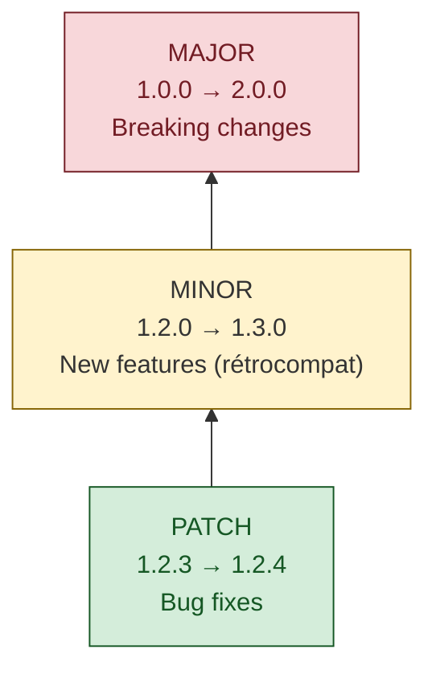

# Development Workflow

Guide complet du workflow de développement, de la création d'une feature au déploiement en production.

## Table of Contents
1. [Development Workflow (A/R Method)](#development-workflow-ar-method)
2. [Git Workflow](#git-workflow)
3. [Semantic Versioning](#semantic-versioning)
4. [Conventional Commits](#conventional-commits)
5. [Deployment Process](#deployment-process)
6. [Rollback Procedures](#rollback-procedures)
7. [Release Management](#release-management)

---

## Development Workflow (A/R Method)

**A/R** = **Arrêt / Relance** - Méthode éprouvée pour développement sans erreurs

### Principe

Cycle court et reproductible pour chaque modification:
1. Arrêter le serveur dev
2. Vérifier qualité du code
3. Builder
4. Relancer
5. Tester

### Implémentation Standard

```bash
#!/bin/bash
# Script: ar.sh - Workflow A/R automatisé

echo "=== 1. ARRÊT ==="
pkill -f "npm run dev" || echo "Aucun serveur à arrêter"

echo "=== 2. VÉRIFICATION ==="
npm run type-check
if [ $? -ne 0 ]; then
  echo "❌ TypeScript errors found"
  exit 1
fi

npm run lint
if [ $? -ne 0 ]; then
  echo "❌ Linting errors found"
  exit 1
fi

echo "=== 3. BUILD ==="
npm run build
if [ $? -ne 0 ]; then
  echo "❌ Build failed"
  exit 1
fi

echo "=== 4. RELANCE ==="
npm run dev &
DEV_PID=$!

echo "=== 5. TESTS MANUELS ==="
echo "✅ Serveur dev démarré (PID: $DEV_PID)"
echo "🔗 http://localhost:3000"
echo "📝 Effectuer tests manuels puis commit"
```

### Utilisation

```bash
# Rendre exécutable
chmod +x ar.sh

# Exécuter
./ar.sh

# Ou manuellement
npm run type-check && npm run lint && npm run build && npm run dev
```

### Variante Rapide (A/R Light)

Pour petits changements (CSS, typo):

```bash
# Skip type-check et lint
npm run build && npm run dev
```

**⚠️ Attention**: Toujours A/R complet avant commit!

---

## Git Workflow

### Strategy: Feature Branch Workflow

**Branches principales**:
- `main` (ou `master`) - Production-ready code
- `develop` - Integration branch (optionnel)
- `feat/*` - Feature branches
- `fix/*` - Bug fix branches
- `hotfix/*` - Urgent production fixes

### Cycle Complet

#### 1. Créer Feature Branch

```bash
# Depuis main à jour
git checkout main
git pull origin main

# Créer branche feature
git checkout -b feat/my-feature-name
```

**Naming conventions**:
- `feat/add-user-auth` - Nouvelle fonctionnalité
- `fix/button-alignment` - Bug fix
- `refactor/api-client` - Refactoring
- `perf/optimize-query` - Performance
- `docs/update-readme` - Documentation

#### 2. Développer

```bash
# Faire modifications
# ...

# A/R workflow
./ar.sh

# Tester manuellement
# ...
```

#### 3. Commit

```bash
# Stage changes
git add .

# Commit avec message conventionnel
git commit -m "feat(auth): add JWT authentication"

# Ou commit interactif pour sélectionner fichiers
git add -p
git commit
```

#### 4. Push

```bash
# Premier push
git push -u origin feat/my-feature-name

# Pushs suivants
git push
```

#### 5. Pull Request

```bash
# Via GitHub CLI (optionnel)
gh pr create --title "Add JWT authentication" --body "Implements JWT-based auth with refresh tokens"

# Ou via interface web GitHub/GitLab
```

#### 6. Review & Merge

```bash
# Reviewer: Check out PR locally
git fetch origin
git checkout feat/my-feature-name
npm install
npm run dev
# Test fonctionnalité

# Approuver et merger via interface web
# Ou en ligne de commande
git checkout main
git merge feat/my-feature-name
git push origin main
git branch -d feat/my-feature-name
```

### Best Practices Git

#### Commits Fréquents, Petits

```bash
# ✅ GOOD: Commits atomiques
git add src/components/Button.tsx
git commit -m "feat(ui): add primary button variant"

git add src/components/Button.css
git commit -m "style(ui): style primary button"

git add tests/Button.test.tsx
git commit -m "test(ui): add button tests"

# ❌ BAD: Commit géant
git add .
git commit -m "add button stuff"
```

#### Messages Descriptifs

```bash
# ✅ GOOD
git commit -m "fix(api): handle 404 errors in user fetch

- Add error handling for missing users
- Return null instead of throwing
- Update tests accordingly"

# ❌ BAD
git commit -m "fix stuff"
git commit -m "wip"
git commit -m "changes"
```

#### Amend vs New Commit

```bash
# Si commit précédent pas encore pushé: amend
git add .
git commit --amend --no-edit

# Si commit déjà pushé: nouveau commit
git add .
git commit -m "fix(api): correct error message typo"
```

#### Rebase vs Merge

```bash
# Rebase pour historique linéaire (avant push)
git checkout feat/my-feature
git rebase main

# Merge pour intégrer (après PR approval)
git checkout main
git merge feat/my-feature --no-ff  # Preserve branch history
```

### Gestion des Conflits

```bash
# Conflit détecté lors merge/rebase
git status  # Voir fichiers en conflit

# Ouvrir fichier, résoudre marqueurs
# <<<<<<< HEAD
# =======
# >>>>>>> feat/my-feature

# Marquer comme résolu
git add resolved-file.tsx

# Continuer rebase/merge
git rebase --continue
# ou
git merge --continue

# Si trop complexe, abandonner
git rebase --abort
git merge --abort
```

---

## Semantic Versioning

**Format**: MAJOR.MINOR.PATCH (SemVer 2.0.0)

### Rules



### Examples

#### PATCH (1.2.3 → 1.2.4)
```
fix(api): correct response status code
fix(ui): align button text properly
perf(query): optimize database index usage
```

#### MINOR (1.2.0 → 1.3.0)
```
feat(api): add user profile endpoint
feat(ui): add dark mode toggle
feat(filters): add date range filter
```

#### MAJOR (1.0.0 → 2.0.0)
```
feat(api)!: change authentication to OAuth2

BREAKING CHANGE: API now requires OAuth2 tokens.
Previous session-based auth is removed.
Clients must update to use OAuth2 flow.
```

### Pre-release Versions

```
1.2.3-alpha.1   # Alpha release
1.2.3-beta.2    # Beta release
1.2.3-rc.1      # Release candidate
```

### Version Incrementing

```bash
# Manual (package.json et app.config.json)
# Change: "version": "1.2.3" → "1.2.4"

# npm (package.json only)
npm version patch  # 1.2.3 → 1.2.4
npm version minor  # 1.2.3 → 1.3.0
npm version major  # 1.2.3 → 2.0.0

# Create git tag automatically
npm version patch -m "chore(release): %s"
```

### Version in Multiple Files

Pour projets avec multiple fichiers de version:

```bash
#!/bin/bash
# Script: bump-version.sh

NEW_VERSION=$1

if [ -z "$NEW_VERSION" ]; then
  echo "Usage: ./bump-version.sh <version>"
  exit 1
fi

# Update package.json
npm version $NEW_VERSION --no-git-tag-version

# Update app.config.json
sed -i "s/\"version\": \".*\"/\"version\": \"$NEW_VERSION\"/" app.config.json

# Commit
git add package.json app.config.json
git commit -m "chore(release): bump version to $NEW_VERSION"
git tag "v$NEW_VERSION"

echo "✅ Version bumped to $NEW_VERSION"
```

---

## Conventional Commits

**Spec**: https://www.conventionalcommits.org/

### Format

```
<type>(<scope>): <subject>

[optional body]

[optional footer(s)]
```

### Types

| Type | Description | Bump |
|------|-------------|------|
| `feat` | Nouvelle fonctionnalité | MINOR |
| `fix` | Correction de bug | PATCH |
| `perf` | Optimisation performance | PATCH |
| `refactor` | Refactoring (no functional change) | - |
| `docs` | Documentation uniquement | - |
| `style` | Formatting, whitespace (no code change) | - |
| `test` | Ajout/modification tests | - |
| `chore` | Build, dependencies, tooling | - |
| `ci` | CI/CD configuration | - |
| `revert` | Revert previous commit | - |

### Scopes (Examples)

```
feat(api): ...
feat(ui): ...
feat(auth): ...
fix(database): ...
perf(query): ...
docs(readme): ...
```

### Breaking Changes

```
feat(api)!: change endpoint response format

BREAKING CHANGE: API responses now use camelCase instead of snake_case.
Update clients to handle new format.
```

ou

```
feat(api): change endpoint response format

The API now returns camelCase fields.

BREAKING CHANGE: snake_case fields removed
```

### Examples Complets

```
feat(filters): add date range filter

Allow users to filter data by custom date range.
Includes calendar picker UI and backend query support.

Closes #123
```

```
fix(ui): resolve button alignment on mobile

Buttons were misaligned on screens < 768px.
Changed flexbox justify-content to center.

Fixes #456
```

```
perf(api): optimize user query with database index

Added composite index on (user_id, created_at).
Reduced query time from 500ms to 50ms (90% improvement).

Closes #789
```

```
docs(contributing): update PR review process

Clarify reviewer responsibilities and timeline expectations.
```

---

## Deployment Process

### Pre-Deployment Checklist

**Automated Check** (recommended):

```bash
#!/bin/bash
# Script: pre-deploy-check.sh

echo "🔍 Pre-deployment checks..."

# 1. Version updated?
echo "⚠️  Did you increment version in package.json and app.config.json?"
read -p "Proceed? (y/n) " -n 1 -r
echo
if [[ ! $REPLY =~ ^[Yy]$ ]]; then
  exit 1
fi

# 2. Type check
echo "📘 Running type check..."
npm run type-check || exit 1

# 3. Lint
echo "🔎 Running linter..."
npm run lint || exit 1

# 4. Build
echo "🔨 Building..."
npm run build || exit 1

# 5. Confirm
echo "✅ All checks passed!"
echo "Ready to deploy version: $(node -p "require('./package.json').version")"
read -p "Deploy now? (y/n) " -n 1 -r
echo
if [[ $REPLY =~ ^[Yy]$ ]]; then
  npm run deploy
fi
```

**Manual Checklist**:
- [ ] Version incrémentée (package.json, app.config.json)
- [ ] `npm run type-check` passes
- [ ] `npm run lint` passes
- [ ] `npm run build` successful
- [ ] Tests manuels effectués
- [ ] Changements committés et pushés
- [ ] Tag créé (`git tag vX.Y.Z`)
- [ ] Documentation mise à jour

### Deployment Steps

#### Standard Deployment

```bash
# 1. Increment version
npm version minor  # ou patch, major

# 2. Build
npm run build

# 3. Deploy
npm run deploy

# 4. Verify
# Navigate to deployed app
# Check logs for errors
# Test critical paths
```

#### Multi-Environment Deployment

```bash
# Deploy to staging
npm run deploy:staging

# Test in staging
# ...

# Deploy to production
npm run deploy:production
```

**package.json**:
```json
{
  "scripts": {
    "deploy:staging": "dt-app deploy --environment staging",
    "deploy:production": "dt-app deploy --environment production"
  }
}
```

### Post-Deployment Verification

**Checklist**:
- [ ] App loads without errors
- [ ] Critical features functional
- [ ] No console errors (browser dev tools)
- [ ] No API errors (network tab)
- [ ] Performance acceptable (load times)
- [ ] Logs show no errors (server/platform logs)

**Monitoring** (first 15 minutes post-deploy):
```bash
# Watch logs in real-time
tail -f /var/log/app.log

# Or via platform (Dynatrace, CloudWatch, etc.)
# Monitor:
# - Error rate
# - Response times
# - Traffic patterns
# - Memory/CPU usage
```

---

## Rollback Procedures

### When to Rollback

**Critical issues**:
- App crashes on load
- Data corruption
- Security vulnerability
- Critical feature broken
- Performance degradation >50%

**Non-critical** (can be fixed forward):
- Minor UI bugs
- Non-essential feature issues
- Cosmetic problems

### Rollback Methods

#### Method 1: Revert Deployment (Preferred)

```bash
# 1. Uninstall broken version
npm run uninstall

# 2. Checkout previous version
git checkout tags/v1.2.3  # Last good version

# 3. Install dependencies
npm install

# 4. Deploy
npm run deploy
```

#### Method 2: Git Revert (For Code Issues)

```bash
# 1. Revert problematic commit
git revert <commit-hash>

# 2. Test locally
npm run build
npm run dev
# Test...

# 3. Deploy revert
npm version patch  # Increment version
npm run deploy
```

#### Method 3: Hotfix Branch

```bash
# 1. Create hotfix from last good version
git checkout tags/v1.2.3
git checkout -b hotfix/critical-fix

# 2. Apply minimal fix
# ... edit files ...

# 3. Test
npm run build
npm run dev

# 4. Commit and deploy
git commit -m "fix: critical issue in production"
npm version patch  # 1.2.3 → 1.2.4
npm run deploy

# 5. Merge back to main
git checkout main
git merge hotfix/critical-fix
git push origin main
git branch -d hotfix/critical-fix
```

### Post-Rollback Actions

1. **Notify stakeholders** - Email, Slack, status page
2. **Create incident report** - What, when, why, how fixed
3. **Root cause analysis** - Why did issue reach production?
4. **Improve processes** - Add tests, checks, monitoring
5. **Fix forward** - Create fix in develop, test thoroughly

---

## Release Management

### Release Planning

**Minor releases** (every 2-4 weeks):
- Feature complete
- Tested
- Documented
- Versioned

**Patch releases** (as needed):
- Bug fixes
- Security patches
- Performance improvements

**Major releases** (quarterly/biannually):
- Breaking changes
- Architecture updates
- Major features

### Release Checklist

**1 Week Before Release**:
- [ ] Feature freeze
- [ ] Final testing
- [ ] Documentation updates
- [ ] Release notes drafted

**Release Day**:
- [ ] Final build and tests
- [ ] Version bumped
- [ ] Tag created
- [ ] Deploy to staging
- [ ] Smoke tests in staging
- [ ] Deploy to production
- [ ] Verify production
- [ ] Release notes published
- [ ] Stakeholders notified

**Post-Release**:
- [ ] Monitor for 24h
- [ ] Address any issues
- [ ] Retrospective meeting
- [ ] Plan next release

### Release Notes Template

```markdown
# Release v1.3.0 - 2026-01-15

## Features
- Add user profile page with avatar upload (#123)
- Implement dark mode toggle (#145)
- Add export to CSV functionality (#167)

## Bug Fixes
- Fix button alignment on mobile devices (#156)
- Resolve memory leak in chart component (#178)
- Correct timezone handling in date picker (#189)

## Performance
- Optimize database queries (50% faster) (#134)
- Reduce bundle size by 200KB (#198)

## Breaking Changes
None

## Upgrade Notes
No action required. Backward compatible.

## Known Issues
- Safari 14 may show scrollbar on modal (fix planned for v1.3.1)

## Contributors
@alice, @bob, @charlie
```

---

## Workflow Automation

### Pre-commit Hooks

**Setup** (using Husky):

```bash
npm install --save-dev husky
npx husky install

# Add pre-commit hook
npx husky add .husky/pre-commit "npm run type-check && npm run lint"

# Add commit-msg hook (validate conventional commits)
npx husky add .husky/commit-msg "npx --no -- commitlint --edit $1"
```

**.husky/pre-commit**:
```bash
#!/bin/sh
. "$(dirname "$0")/_/husky.sh"

echo "🔍 Running pre-commit checks..."

npm run type-check || exit 1
npm run lint || exit 1

echo "✅ Pre-commit checks passed!"
```

### Git Aliases

**~/.gitconfig**:
```ini
[alias]
  st = status
  co = checkout
  br = branch
  ci = commit
  cm = commit -m
  ca = commit --amend
  df = diff
  lg = log --oneline --graph --all --decorate
  undo = reset --soft HEAD~1
```

Usage:
```bash
git st          # git status
git lg          # pretty log
git undo        # undo last commit (keep changes)
```

---

## Post-Removal Simplification

Après chaque retrait de fonctionnalité, vérifier systématiquement les effets en cascade :

1. **Code mort** : fonctions, imports, classes, modules devenus inaccessibles
2. **Tests orphelins** : tests qui testaient le code retiré (les supprimer, pas les commenter)
3. **Simplifications induites** : interfaces, abstractions ou indirections qui n'existent plus que pour la feature retirée — les simplifier ou les supprimer
4. **Documentation** : retirer toute mention de la fonctionnalité dans les docs, README, SKILL, commentaires — ne jamais laisser de traces historiques d'un état qui n'est plus vrai
5. **Configuration** : options de config, variables d'environnement, flags CLI devenus inopérants

Le coût d'un nettoyage immédiat est faible. Le coût d'un nettoyage différé est élevé (confusion, dette technique, faux positifs dans les recherches).

---

**Version**: 1.1.0
**Last Updated**: March 13, 2026
