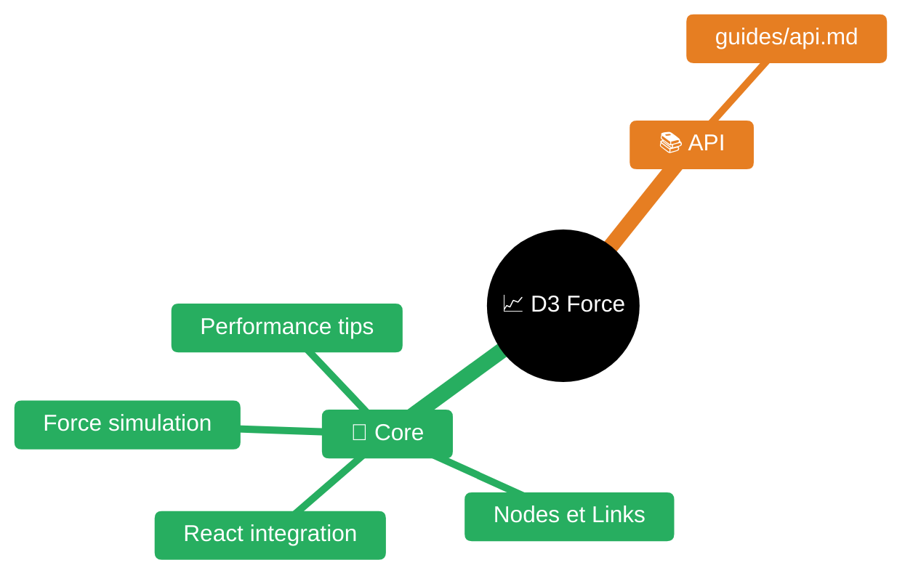

# D3 Force Simulation

D3-force implements velocity Verlet integration for simulating physical forces on particles (nodes). Use for network graphs, hierarchies, collision detection, and physics-based layouts.


| Fichier | Description |
|---------|-------------|
| [README.md](README.md) | Point d'entrée D3 Force |
| [guides/api.md](guides/api.md) | Référence API D3 Force |

## Quick Start

```javascript
import * as d3 from "d3";

// Basic force-directed graph
const simulation = d3.forceSimulation(nodes)
  .force("charge", d3.forceManyBody().strength(-100))
  .force("link", d3.forceLink(links).id(d => d.id))
  .force("center", d3.forceCenter(width / 2, height / 2))
  .on("tick", render);
```

## Core Concepts

### Node Properties (mutated by simulation)
- `x`, `y` - current position
- `vx`, `vy` - current velocity  
- `fx`, `fy` - fixed position (set to pin node, null to release)
- `index` - zero-based array index

### Alpha (simulation temperature)
- Starts at 1, decays toward 0
- Simulation stops when alpha < alphaMin (default 0.001)
- ~300 ticks by default
- Use `simulation.alpha(1).restart()` to reheat

## Available Forces

| Force | Purpose | Key Parameters |
|-------|---------|----------------|
| `forceManyBody()` | Attraction/repulsion between all nodes | `strength` (-30 default, negative=repel) |
| `forceLink(links)` | Spring connections | `distance` (30), `strength`, `id` accessor |
| `forceCenter(x,y)` | Keep center of mass at point | `x`, `y`, `strength` |
| `forceCollide(r)` | Prevent node overlap | `radius`, `strength`, `iterations` |
| `forceX(x)` / `forceY(y)` | Push toward position | `x`/`y`, `strength` (0.1) |
| `forceRadial(r,x,y)` | Push toward circle | `radius`, `x`, `y`, `strength` |

## Common Patterns

### Interactive Drag
```javascript
function drag(simulation) {
  return d3.drag()
    .on("start", (event, d) => {
      if (!event.active) simulation.alphaTarget(0.3).restart();
      d.fx = d.x; d.fy = d.y;
    })
    .on("drag", (event, d) => {
      d.fx = event.x; d.fy = event.y;
    })
    .on("end", (event, d) => {
      if (!event.active) simulation.alphaTarget(0);
      d.fx = null; d.fy = null;
    });
}
```

### Static Layout (pre-compute)
```javascript
const simulation = d3.forceSimulation(nodes)
  .force("charge", d3.forceManyBody())
  .force("link", d3.forceLink(links))
  .stop();

// Run synchronously
for (let i = 0; i < 300; i++) simulation.tick();
// Now nodes have final x,y positions
```

### Bounded Layout
```javascript
simulation.on("tick", () => {
  nodes.forEach(d => {
    d.x = Math.max(radius, Math.min(width - radius, d.x));
    d.y = Math.max(radius, Math.min(height - radius, d.y));
  });
  render();
});
```

### Clustered by Group
```javascript
simulation
  .force("x", d3.forceX(d => groupCenters[d.group].x).strength(0.1))
  .force("y", d3.forceY(d => groupCenters[d.group].y).strength(0.1));
```

## Integration with React

```jsx
useEffect(() => {
  const sim = d3.forceSimulation(nodes)
    .force("charge", d3.forceManyBody().strength(-50))
    .force("link", d3.forceLink(links).id(d => d.id).distance(50))
    .force("center", d3.forceCenter(width/2, height/2))
    .on("tick", () => setPositions([...nodes]));
  
  return () => sim.stop(); // Cleanup
}, [nodes, links]);
```

## Performance Tips

1. **Large graphs (>1000 nodes)**: Reduce iterations, increase theta (0.9→1.5)
2. **Static layout**: Use web worker to avoid UI freeze
3. **Sparse updates**: Only restart on actual data changes
4. **Distance limits**: Use `manyBody.distanceMax()` for localized force

## Detailed API Reference

See [guides/api.md](guides/api.md) for complete API documentation with all methods and parameters.

## Common Issues

| Problem | Solution |
|---------|----------|
| Nodes fly off screen | Add `forceCenter()` or position forces |
| Overlapping nodes | Add `forceCollide()` with appropriate radius |
| Too much movement | Increase `velocityDecay` (default 0.4) |
| Simulation too slow | Reduce `alphaDecay` or increase `alphaMin` |
| Links crossing | Increase `link.iterations()` |
