# Mermaid.js -- Skill de reference diagrammes

> Mermaid **10.7** — Diagrammes as code en Markdown. Cible : **GitLab 18.x** (Mermaid 10.7 embarqué).
> ⚠️ Types NON supportés dans GitLab 18.x (requièrent Mermaid 11+) : `block-beta`, `architecture-beta`, `kanban`, `packet-beta`.
> Config : utiliser **uniquement** `%%{init: {...}}%%` dans GitLab/Mermaid 10.7 (le frontmatter `---config:---` est Mermaid 11+).
> Source officielle : <https://mermaid.js.org> · Editeur live : <https://mermaid.live/edit>

---

## Table des matieres

1. [Integration Markdown (GitHub/GitLab)](#1-integration-markdown)
2. [Configuration globale](#2-configuration-globale)
3. [Flowchart](#3-flowchart)
4. [Sequence Diagram](#4-sequence-diagram)
5. [Class Diagram](#5-class-diagram)
6. [State Diagram](#6-state-diagram)
7. [Entity Relationship Diagram](#7-entity-relationship-diagram)
8. [Gantt Chart](#8-gantt-chart)
9. [Pie Chart](#9-pie-chart)
10. [Mindmap](#10-mindmap)
11. [Timeline](#11-timeline)
12. [Gitgraph](#12-gitgraph)
13. [C4 Diagram](#13-c4-diagram)
14. [Quadrant Chart](#14-quadrant-chart)
15. [Sankey Diagram](#15-sankey-diagram)
16. [XY Chart](#16-xy-chart)
17. ~~Block Diagram~~ — Mermaid 11+ (absent de GitLab 18.x)
18. ~~Architecture Diagram~~ — Mermaid 11+ (absent de GitLab 18.x)
19. ~~Kanban~~ — Mermaid 11+ (absent de GitLab 18.x)
20. ~~Packet Diagram~~ — Mermaid 11+ (absent de GitLab 18.x)
21. [Styling et themes](#21-styling-et-themes)
22. [Bonnes pratiques](#22-bonnes-pratiques)
23. [Fichiers .mmd](#23-fichiers-mmd)

---

## 1. Integration Markdown

### GitHub

GitHub rend nativement les blocs Mermaid dans les fichiers Markdown, Issues, PRs, Discussions et Wikis.

````markdown
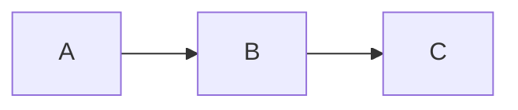
````

### GitLab 18.x (Mermaid 10.7)

GitLab rend nativement les blocs Mermaid partout où le Markdown est supporté (README, issues, MR, wikis, snippets). Même syntaxe que GitHub.

**Limitations GitLab spécifiques** :
- Rendu dans une **iframe sandboxée** (pas de scripts, pas de popups)
- `htmlLabels` désactivé par défaut (sécurité XSS) — éviter dans la KB
- **Configuration** : utiliser `%%{init}%%` uniquement (le frontmatter `---config:---` est Mermaid 11+)
- Mode sombre + thème `default` : problèmes de contraste — préférer `forest` ou `neutral`
- Vue "project overview" : le rendu peut s'afficher en code brut — ouvrir le fichier directement

### Verifier la version supportee

````markdown
```mermaid
info
```
````

---

## 2. Configuration globale

### Configuration via directive (seule méthode GitLab/Mermaid 10.7)

```
%%{init: {'theme': 'forest'}}%%
flowchart LR
    A --> B
```

### Directive inline

```
%%{init: {'theme': 'dark'}}%%
flowchart LR
    A --> B
```

### Commentaires

```
%% Ceci est un commentaire (ignore par le parser)
```

**Attention** : ne pas utiliser `{}` dans les commentaires `%%` (conflit avec les directives).

### Layouts disponibles

| Layout | Description |
|--------|------------|
| `dagre` | Par defaut, bon compromis simplicite/clarte |
| `elk` | Avancé — expérimental en Mermaid 10.7, **non confirmé dans GitLab 18.x** |

### Accessibilite

```
flowchart LR
    accTitle: Flux de deploiement
    accDescr: Montre les etapes du pipeline CI/CD
    A[Build] --> B[Test] --> C[Deploy]
```

---

## 3. Flowchart

### Declaration et direction

```
flowchart TD
```

| Direction | Signification |
|-----------|--------------|
| `TD` / `TB` | Top to Bottom |
| `BT` | Bottom to Top |
| `LR` | Left to Right |
| `RL` | Right to Left |

### Formes de noeuds

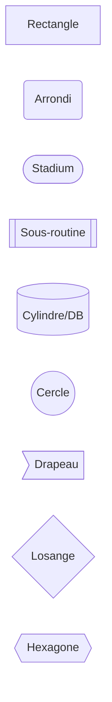

Formes supplementaires :
- `[/texte/]` parallelogramme, `[\texte\]` parallelogramme inverse
- `[/texte\]` trapeze, `[\texte/]` trapeze inverse

### Types de liens

```mermaid
flowchart LR
    A --> B           %% fleche
    C --- D           %% ligne sans fleche
    E -->|texte| F    %% fleche avec label
    G -- texte --> H  %% idem
    I -.-> J          %% pointille + fleche
    K ==> L           %% trait epais + fleche
    M ~~~ N           %% lien invisible (espacement)
    O -o P            %% cercle en bout
    Q -x R            %% croix en bout
    S <--> T          %% bidirectionnel
```

### Longueur de liens (nombre de tirets)

```mermaid
flowchart TD
    A --> B            %% normal
    A ---> C           %% plus long
    A ----> D          %% encore plus long
```

Fonctionne aussi pour les pointilles (`-..-`, `-...-`) et epais (`====`, `=====`).

### Subgraphs

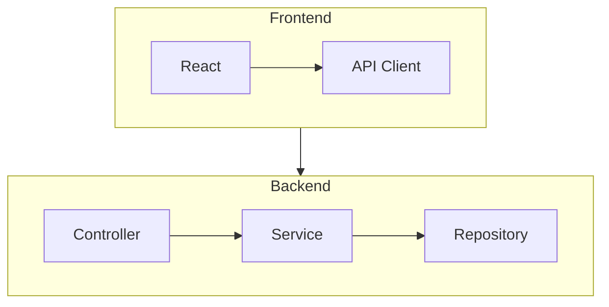

Chaque subgraph peut avoir sa propre `direction`. Les subgraphs peuvent etre imbriques.
On peut creer des liens depuis/vers un subgraph entier.

### Styling de noeuds

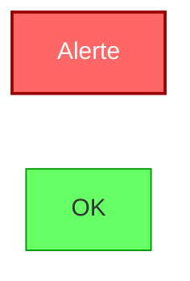

### Classes CSS

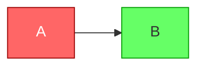

`classDef default` s'applique a tous les noeuds sans classe.

### Styling de liens (par index, base 0)

```
flowchart LR
    A --> B --> C
    linkStyle 0 stroke:#f00,stroke-width:3px
    linkStyle 1 stroke:#0f0
    linkStyle default stroke:#999
```

### Click events et liens

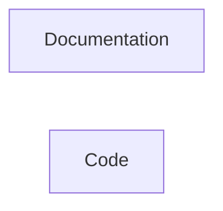

Cibles : `_self`, `_blank`, `_parent`, `_top`.

Syntaxe alternative : `click A href "https://docs.example.com" "tooltip"`.

**Prerequis** : `securityLevel: 'loose'` pour les callbacks JS.

### Markdown dans les noeuds

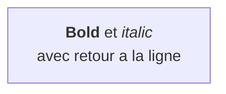

### Caracteres speciaux

Utiliser des guillemets ou des entity codes :
- `#35;` pour `#`
- `#amp;` pour `&`
- `#quot;` pour `"`

### Courbes de liens

Configurable via `%%{init}%%` : `basis`, `linear`, `cardinal`, `stepBefore`, `stepAfter`.

```
%%{init: {'flowchart': {'curve': 'stepBefore'}}}%%
```

---

## 4. Sequence Diagram

### Structure de base

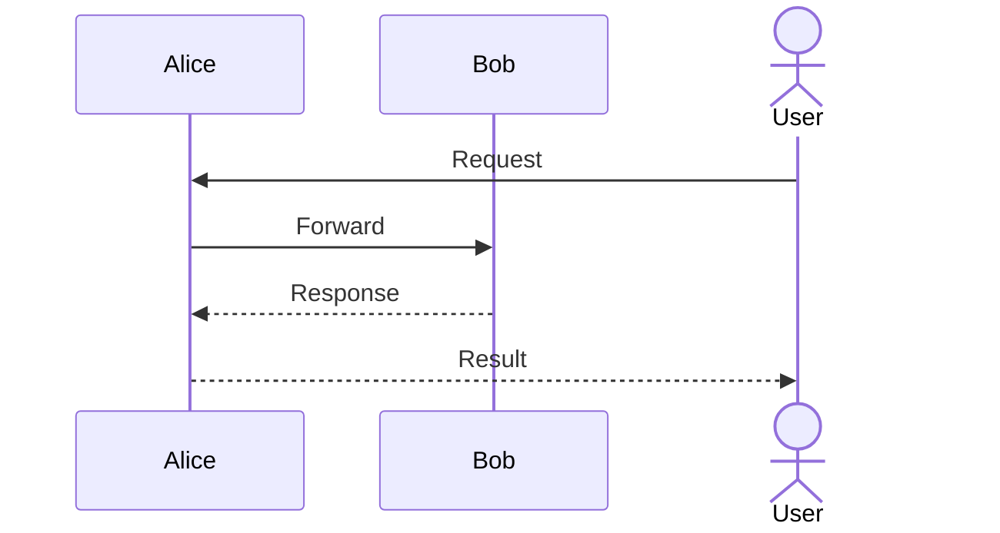

### Types de fleches

| Syntaxe | Description |
|---------|------------|
| `->` | Trait plein, sans fleche |
| `-->` | Pointille, sans fleche |
| `->>` | Trait plein, avec fleche |
| `-->>` | Pointille, avec fleche |
| `-x` | Trait plein, croix (message perdu) |
| `--x` | Pointille, croix |
| `-)` | Trait plein, fleche ouverte (async) |
| `--)` | Pointille, fleche ouverte |
| `<<->>` | Bidirectionnel, trait plein |
| `<<-->>` | Bidirectionnel, pointille |

### Activations

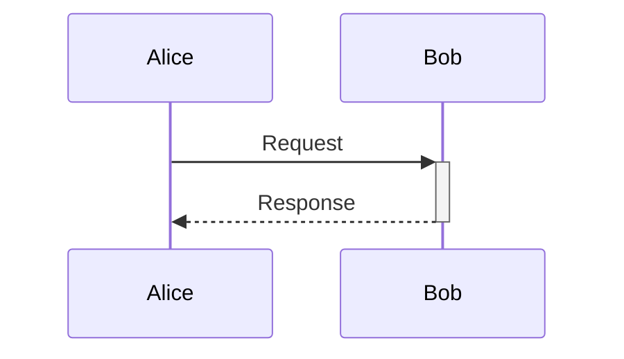

`+` active la lifeline, `-` la desactive. Empilables sur le meme acteur.

Forme explicite :

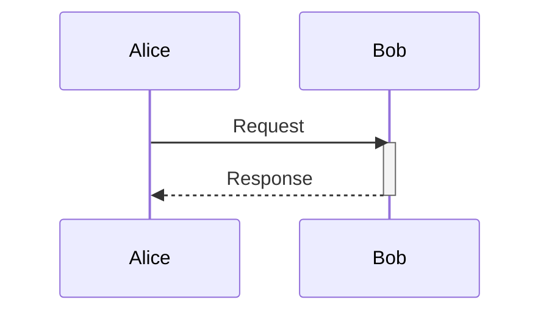

### Notes

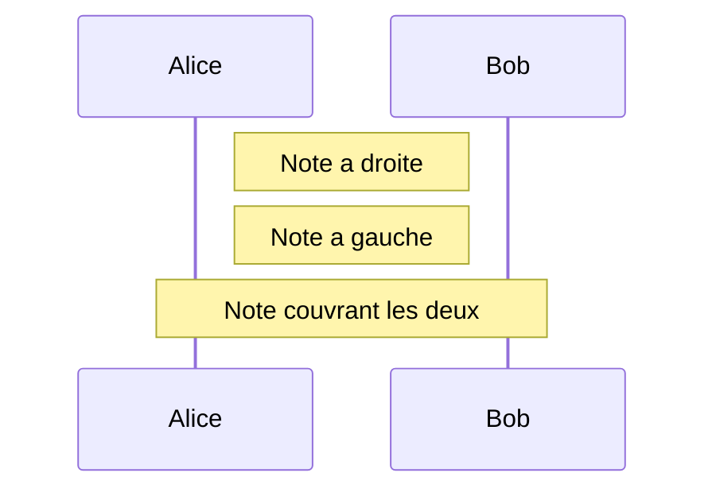

Retour a la ligne dans les notes : `<br/>`.

### Blocs de controle

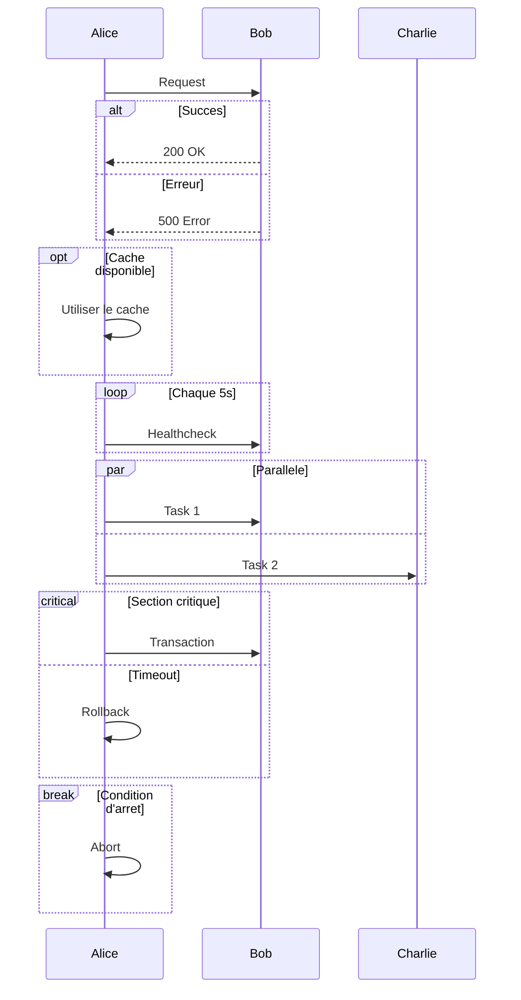

### Fond colore (rect)

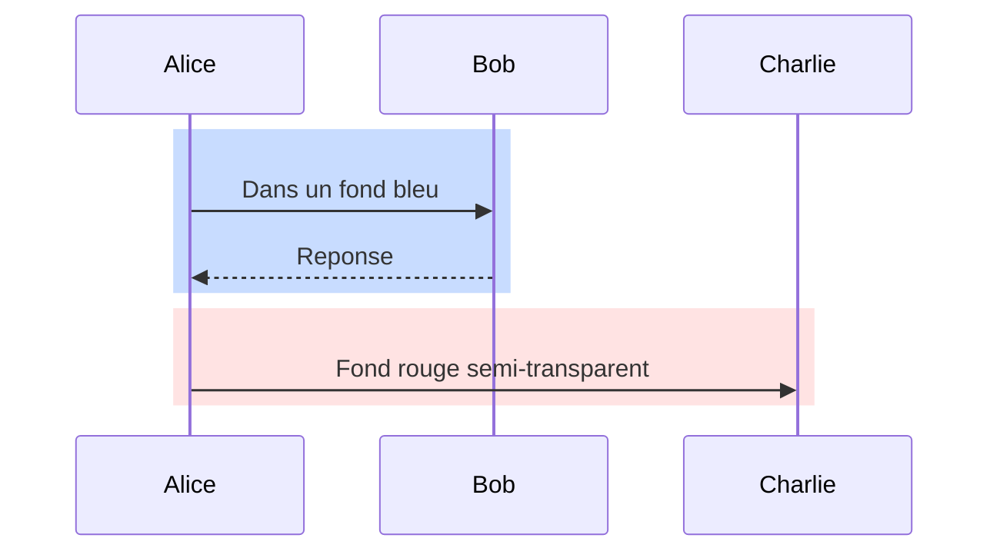

### Numeros de sequence

```
%%{init: {'sequence': {'showSequenceNumbers': true}}}%%
sequenceDiagram
    Alice ->> Bob: Message 1
    Bob -->> Alice: Message 2
```

### Grouper les participants (box)

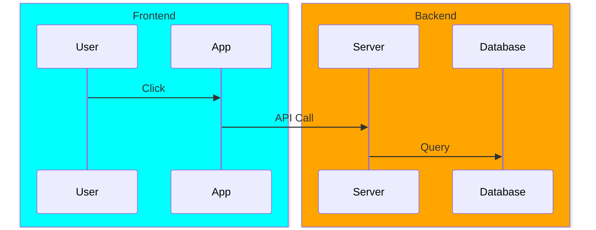

Couleurs : noms CSS, `rgb()`, `rgba()`, ou `transparent`.

### Creation / Destruction de participants

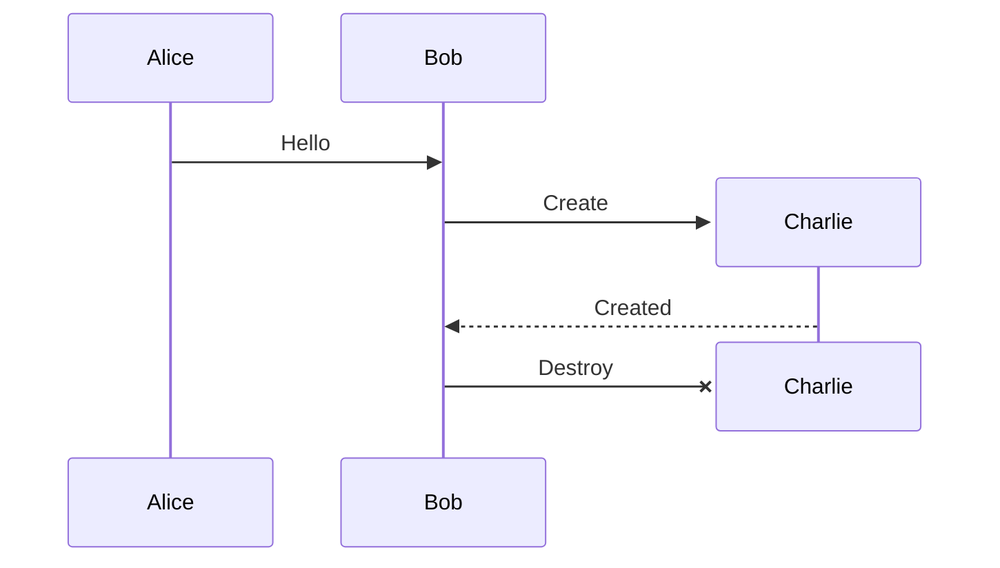

### Menus de liens

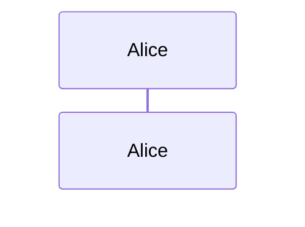

### Stereotypes (participants speciaux)

Supportes via configuration : Boundary, Control, Entity, Database, Collections, Queue.

---

## 5. Class Diagram

### Structure de base

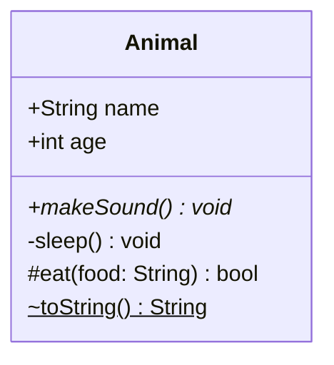

### Visibilite

| Symbole | Visibilite |
|---------|-----------|
| `+` | Public |
| `-` | Private |
| `#` | Protected |
| `~` | Package/Internal |

### Classificateurs

| Symbole | Signification |
|---------|--------------|
| `*` apres `()` | Abstract |
| `$` apres `()` ou nom | Static |

### Relations (8 types)

```mermaid
classDiagram
    Animal <|-- Dog           %% Inheritance (extends)
    Vehicle *-- Engine        %% Composition (contient, cycle de vie lie)
    University o-- Student    %% Aggregation (contient, independant)
    Order --> Product         %% Association (utilise)
    Class ..|> Interface      %% Realization (implements)
    Client ..> Service        %% Dependency (depend de)
    A -- B                    %% Link solid
    C .. D                    %% Link dashed
```

| Notation | Type |
|----------|------|
| `<\|--` | Inheritance (extends) |
| `*--` | Composition |
| `o--` | Aggregation |
| `-->` | Association |
| `..\|>` | Realization (implements) |
| `..>` | Dependency |
| `--` | Link solid |
| `..` | Link dashed |

Relations bidirectionnelles : `<\|`, `*`, `o`, `>`, `<`, `\|>` combinables des deux cotes.

### Cardinalite

```mermaid
classDiagram
    Customer "1" --> "*" Order : places
    Order "1" *-- "1..*" LineItem : contains
    Student "0..*" -- "1..*" Course : enrolled in
```

Valeurs : `1`, `0..1`, `1..*`, `*`, `n`, `0..n`.

### Annotations

```mermaid
classDiagram
    class Shape {
        <<interface>>
        +draw() void
    }
    class Color {
        <<enumeration>>
        RED
        GREEN
        BLUE
    }
    class Animal {
        <<abstract>>
        +makeSound()* void
    }
```

Autres annotations possibles : `<<Service>>`, `<<Entity>>`, etc.

### Generics

```mermaid
classDiagram
    class List~T~ {
        +add(item: T) void
        +get(index: int) T
    }
    class Map~K,V~ {
        +put(key: K, value: V) void
    }
```

Generics imbriques : `List~List~int~~`.

### Namespaces

```mermaid
classDiagram
    namespace com.example.model {
        class User
        class Order
    }
    namespace com.example.service {
        class UserService
        class OrderService
    }
    UserService --> User
    OrderService --> Order
```

### Notes

```mermaid
classDiagram
    class User
    note "Represente un utilisateur du systeme"
    note for User "Stocke dans la table USERS"
```

### Lollipop interfaces

```mermaid
classDiagram
    class Database
    Database --() Serializable
    Printable ()-- Report
```

### Direction

```
classDiagram
    direction LR
```

### Liens cliquables

```
classDiagram
    class User
    click User href "https://docs.example.com/user"
    click User callback "showDetails"
```

**Prerequis** : `securityLevel: 'loose'` pour les callbacks.

### Masquer les compartiments vides

```
%%{init: {'class': {'hideEmptyMembersBox': true}}}%%
```

---

## 6. State Diagram

### Structure de base

```mermaid
stateDiagram-v2
    [*] --> Idle
    Idle --> Processing : start
    Processing --> Done : complete
    Processing --> Error : fail
    Error --> Idle : retry
    Done --> [*]
```

`[*]` represente l'etat initial ou final selon le sens de la fleche.

### Etats composites (imbriques)

```mermaid
stateDiagram-v2
    [*] --> Active
    state Active {
        [*] --> Running
        Running --> Paused : pause
        Paused --> Running : resume
    }
    Active --> [*] : stop
```

Imbrication multi-niveaux supportee.

### Fork et Join (parallelisme)

```mermaid
stateDiagram-v2
    state fork_state <<fork>>
    state join_state <<join>>

    [*] --> fork_state
    fork_state --> Task1
    fork_state --> Task2
    Task1 --> join_state
    Task2 --> join_state
    join_state --> Done
    Done --> [*]
```

### Choice (decision)

```mermaid
stateDiagram-v2
    state check <<choice>>
    [*] --> check
    check --> Active : if valid
    check --> Error : if invalid
```

### Concurrence (etats paralleles)

```mermaid
stateDiagram-v2
    state Active {
        [*] --> Working
        --
        [*] --> Listening
    }
```

Le separateur `--` cree des regions concurrentes.

### Notes

```mermaid
stateDiagram-v2
    State1
    note right of State1
        Note importante
        sur plusieurs lignes
    end note
    note left of State1 : Note courte
```

### Direction

```
stateDiagram-v2
    direction LR
```

### Styling

```mermaid
stateDiagram-v2
    classDef alert fill:#f66,color:#fff
    classDef ok fill:#6f6,color:#000
    s1 : Error State
    s2 : OK State
    s1:::alert
    s2:::ok
```

**Limitation** : le styling ne s'applique pas aux etats `[*]` ni aux etats composites.

---

## 7. Entity Relationship Diagram

### Structure de base

```mermaid
erDiagram
    CUSTOMER ||--o{ ORDER : places
    ORDER ||--|{ LINE_ITEM : contains
    PRODUCT ||--o{ LINE_ITEM : "is in"
    CUSTOMER }|..|{ DELIVERY_ADDRESS : uses
```

### Notation de cardinalite

| Gauche | Droite | Signification |
|--------|--------|--------------|
| `\|o` | `o\|` | Zero ou un |
| `\|\|` | `\|\|` | Exactement un |
| `}o` | `o{` | Zero ou plusieurs |
| `}\|` | `\|{` | Un ou plusieurs |

**Aliases textuels** : `one or zero`, `zero or one`, `one or more`, `one or many`, `many(1)`, `1+`, `zero or more`, `zero or many`, `many(0)`, `0+`, `only one`, `1`.

### Types de relations

| Syntaxe | Type | Quand utiliser |
|---------|------|---------------|
| `--` (tirets) | Identifiante (trait plein) | L'enfant depend du parent |
| `..` (points) | Non-identifiante (pointille) | Entites independantes |

Aliases : `to` = identifiante, `optionally to` = non-identifiante.

### Attributs d'entites

```mermaid
erDiagram
    CUSTOMER {
        int id PK "Auto-generated"
        string name
        string email UK "Must be unique"
        date created_at
    }
    ORDER {
        int id PK
        int customer_id FK "References CUSTOMER"
        decimal total
        string status
    }
```

- Cles : `PK` (Primary Key), `FK` (Foreign Key), `UK` (Unique Key)
- Commentaires en double guillemets apres le nom
- `*` devant le nom = indicateur de cle primaire (alternatif)
- Types doivent commencer par une lettre

### Direction

```
erDiagram
    direction LR
```

Options : `TB`, `BT`, `LR`, `RL`.

### Styling

```
erDiagram
    CUSTOMER {
        int id PK
    }
    style CUSTOMER fill:#f9f,stroke:#333
```

---

## 8. Gantt Chart

### Structure de base

```mermaid
gantt
    title Projet de migration
    dateFormat YYYY-MM-DD
    axisFormat %Y-%m-%d
    excludes weekends

    section Preparation
    Analyse           :done,    a1, 2025-01-06, 5d
    Specifications    :done,    a2, after a1, 3d

    section Developpement
    Backend           :active,  b1, after a2, 10d
    Frontend          :         b2, after a2, 8d
    Integration       :crit,    b3, after b1 b2, 5d

    section Deploiement
    Tests E2E         :         c1, after b3, 3d
    Mise en prod      :crit, milestone, c2, after c1, 1d
```

### Format de dates

- `dateFormat YYYY-MM-DD` -- format d'entree (syntaxe day.js)
- `axisFormat %Y-%m-%d` -- format d'affichage (syntaxe d3-time-format)
- `tickInterval 1week` -- intervalle des graduations (`1day`, `1week`, `1month`)

### Tags de taches

| Tag | Effet |
|-----|-------|
| `done` | Tache terminee (grisee) |
| `active` | Tache en cours (surlignee) |
| `crit` | Chemin critique (rouge) |
| `milestone` | Jalon (losange, point unique) |

Combinables : `crit, done`, `crit, active`.

### Syntaxe des taches

```
Nom de la tache :tags, id, date_debut, duree_ou_date_fin
```

Exemples :
```
gantt
    task1 :a1, 2025-01-01, 3d                %% date + duree
    task2 :a2, 2025-01-01, 2025-01-05        %% date + date fin
    task3 :a3, after a1, 5d                   %% apres + duree
    task4 :a4, after a1 a2, 2d               %% apres PLUSIEURS taches
    task5 :a5, after a1, until a3            %% de fin a1 jusqu'a debut a3
```

### Exclusions

```
gantt
    excludes weekends
    excludes 2025-12-25, 2025-01-01
    weekend friday
```

`weekend friday` : le vendredi est considere comme weekend (defaut : samedi).

### Marqueurs verticaux

```
gantt
    vert 2025-02-15
```

Affiche une ligne verticale sur la date specifiee.

### Click events

```
gantt
    click a1 href "https://jira.example.com/PROJ-123"
    click a2 call openDetails("a2")
```

---

## 9. Pie Chart

### Structure de base

```mermaid
pie showData title Budget par departement
    "Engineering" : 45
    "Marketing" : 20
    "Operations" : 25
    "HR" : 10
```

### Options

- `showData` : affiche les valeurs numeriques a cote de la legende
- `title` : titre du graphique
- Valeurs positives uniquement (pas de negatifs), jusqu'a 2 decimales
- Les parts sont rendues dans le sens horaire, dans l'ordre d'apparition

### Configuration

```
%%{init: {'pie': {'textPosition': 0.75}}}%%
```

`textPosition` : 0.0 (centre) a 1.0 (bord exterieur), defaut 0.75.

---

## 10. Mindmap

### Structure de base (indentation = hierarchie)

```mermaid
mindmap
    root((Projet))
        Backend
            Java
            Quarkus
            Oracle
        Frontend
            Angular
            TypeScript
        DevOps
            Kubernetes
            Concourse
            Dynatrace
```

### Formes de noeuds

| Syntaxe | Forme |
|---------|-------|
| `texte` | Oval/ellipse (defaut) |
| `[texte]` | Carre |
| `(texte)` | Carre arrondi |
| `((texte))` | Cercle |
| `))texte((` | Bang (explosion) |
| `)texte(` | Cloud |
| `{{texte}}` | Hexagone |

### Icones

```mermaid
mindmap
    root((Projet))
        Backend
        ::icon(fa fa-server)
        Frontend
        ::icon(fa fa-desktop)
```

Utilise Font Awesome ou d'autres libraries d'icones.

### Classes CSS

```mermaid
mindmap
    root((Projet))
        Important:::urgent
```

### Markdown dans les noeuds

```mermaid
mindmap
    root(("`**Projet**
    *Description du projet*`"))
```

---

## 11. Timeline

> ⚠️ **GitLab 18.x** : `timeline` est dans Mermaid 10.7 mais son rendu dans GitLab n'est **pas confirmé** — tester avant usage dans la KB.

### Structure de base

```mermaid
timeline
    title Histoire du projet
    2023 : Conception
         : Prototype
    2024 : Developpement
         : Tests
    2025 : Mise en production
```

Les periodes et evenements sont du texte libre (pas limites aux nombres).
Plusieurs evenements par periode : separes par `:` sur la meme ligne ou indendes avec `:` sur les lignes suivantes.

### Sections (groupement)

```mermaid
timeline
    title Roadmap
    section Phase 1
        Q1 2025 : Analyse des besoins
                 : Choix de stack
        Q2 2025 : Developpement Backend
    section Phase 2
        Q3 2025 : Developpement Frontend
        Q4 2025 : Integration
                 : Tests E2E
                 : Mise en production
```

Les periodes d'une section partagent la meme palette de couleurs.

### Themes et couleurs

- Multi-couleur par defaut (chaque periode a sa couleur)
- Desactiver : `disableMulticolor: true` dans la config
- Variables : `cScale0` a `cScale11` pour les fonds, `cScaleLabel0` a `cScaleLabel11` pour le texte
- Themes predefinies : `base`, `forest`, `dark`, `default`, `neutral`
- Retour a la ligne force : `<br>`

---

## 12. Gitgraph

### Structure de base

```mermaid
gitGraph
    commit
    commit
    branch develop
    commit
    commit
    checkout main
    merge develop tag:"v1.0"
    commit
```

### Commandes

| Commande | Description |
|----------|------------|
| `commit` | Ajouter un commit sur la branche courante |
| `branch <name>` | Creer et switcher sur une nouvelle branche |
| `checkout <name>` | Switcher de branche |
| `switch <name>` | Alias de checkout |
| `merge <name>` | Merger une branche dans la courante |
| `cherry-pick id: "<id>"` | Cherry-pick un commit specifique |

### Options de commit

```mermaid
gitGraph
    commit id: "init" tag: "v0.1" type: NORMAL
    commit id: "feat-1"
    commit id: "revert-1" type: REVERSE
    commit id: "hotfix" type: HIGHLIGHT tag: "v0.2"
```

| Type | Visuel |
|------|--------|
| `NORMAL` | Cercle plein (defaut) |
| `REVERSE` | Cercle barre |
| `HIGHLIGHT` | Rectangle plein |

### Options de merge

```mermaid
gitGraph
    commit
    branch feature
    commit id: "feat-1"
    checkout main
    merge feature id: "merge-feat" tag: "v1.0" type: HIGHLIGHT
```

### Cherry-pick

```mermaid
gitGraph
    commit id: "init"
    branch feature
    commit id: "important-fix"
    checkout main
    cherry-pick id: "important-fix"
```

Contraintes : le commit cible doit avoir un `id` explicite, et ne doit pas etre sur la branche courante.

### Orientation

```
gitGraph TB:
```

Ou `LR:` (defaut).

### Ordre des branches

```mermaid
gitGraph
    commit
    branch hotfix order: 1
    branch develop order: 2
    branch feature order: 3
```

`main` a l'order `0` par defaut. Configurable via `mainBranchOrder`.

### Configuration

```
%%{init: {'gitGraph': {'showBranches': true, 'showCommitLabel': true, 'rotateCommitLabel': true, 'parallelCommits': false, 'mainBranchName': 'main', 'mainBranchOrder': 0}}}%%
```

### Themes

Variables de couleur : `git0`-`git7` pour les branches, `gitBranchLabel0`-`gitBranchLabel7`, `commitLabelColor`, `tagLabelColor`, `gitInv0`-`gitInv7` (pour HIGHLIGHT). Supporte jusqu'a 8 branches (cyclique).

---

## 13. C4 Diagram

### Types disponibles

| Keyword | Niveau C4 |
|---------|----------|
| `C4Context` | Contexte systeme (vue la plus haute) |
| `C4Container` | Conteneurs (applications, BDD, etc.) |
| `C4Component` | Composants internes d'un conteneur |
| `C4Dynamic` | Interactions dynamiques numerotees |
| `C4Deployment` | Infrastructure de deploiement |

### Exemple C4Context

```mermaid
C4Context
    title System Context Diagram

    Person(user, "Developpeur", "Utilise l'application")
    System(harness, "Agent Harness", "Orchestration agentique")
    System_Ext(ollama, "Ollama", "Modele local")
    System_Ext(claude, "Claude API", "Modele cloud")

    Rel(user, harness, "CLI / MCP / HTTP")
    Rel(harness, ollama, "API chat")
    Rel(harness, claude, "API Anthropic")
```

### Exemple C4Container

```mermaid
C4Container
    title Container Diagram

    Person(user, "Developpeur")

    System_Boundary(app, "Agent Harness") {
        Container(cli, "CLI", "Python", "Interface ligne de commande")
        Container(agent, "Agent Loop", "Python", "Boucle ReAct")
        Container(mcp, "MCP Server", "Python", "Integration IDE")
        ContainerDb(chroma, "ChromaDB", "Vector Store", "Skills RAG")
    }

    System_Ext(ollama, "Ollama", "LLM local")

    Rel(user, cli, "Commandes", "Terminal")
    Rel(cli, agent, "Delegation")
    Rel(agent, ollama, "Chat API", "HTTP")
    Rel(agent, chroma, "search_rag", "Embedding")
```

### Elements

| Fonction | Arguments |
|----------|----------|
| `Person(id, label, desc)` | Acteur / utilisateur |
| `Person_Ext(...)` | Acteur externe |
| `System(id, label, desc)` | Systeme interne |
| `System_Ext(...)` | Systeme externe |
| `SystemDb(...)` / `SystemQueue(...)` | Variantes DB / Queue |
| `Container(id, label, tech, desc)` | Conteneur avec technologie |
| `ContainerDb(...)` / `ContainerQueue(...)` | Variantes conteneur |
| `Component(id, label, tech, desc)` | Composant |
| `Boundary(id, label)` | Groupement generique |
| `System_Boundary(id, label)` | Frontiere systeme |
| `Enterprise_Boundary(id, label)` | Frontiere entreprise |
| `Container_Boundary(id, label)` | Frontiere conteneur |

### Relations

| Fonction | Description |
|----------|------------|
| `Rel(from, to, label, tech)` | Unidirectionnelle |
| `BiRel(from, to, label, tech)` | Bidirectionnelle |
| `Rel_U(...)` / `Rel_D(...)` / `Rel_L(...)` / `Rel_R(...)` | Avec direction |
| `Rel_Back(...)` | Direction inverse |
| `RelIndex(index, from, to, label, tech)` | Pour C4Dynamic (numerotee) |

### C4Deployment

```mermaid
C4Deployment
    title Deployment Diagram

    Deployment_Node(dc, "Datacenter") {
        Deployment_Node(k8s, "Kubernetes Cluster") {
            Container(api, "API", "Quarkus")
            ContainerDb(db, "Oracle", "19c")
        }
    }
```

**Note** : le style C4 est fixe (couleurs CSS predefinies). Le positionnement se fait en modifiant l'ordre des declarations.

---

## 14. Quadrant Chart

### Structure de base

```mermaid
quadrantChart
    title Priorisation des features
    x-axis Effort faible --> Effort eleve
    y-axis Impact faible --> Impact eleve
    quadrant-1 Quick wins
    quadrant-2 Projets majeurs
    quadrant-3 A eviter
    quadrant-4 A planifier

    Feature A: [0.8, 0.9]
    Feature B: [0.2, 0.8]
    Feature C: [0.7, 0.3]
    Feature D: [0.2, 0.2]
```

Coordonnees : `[x, y]` avec valeurs de 0.0 a 1.0.

### Quadrants

| Quadrant | Position |
|----------|----------|
| `quadrant-1` | En haut a droite |
| `quadrant-2` | En haut a gauche |
| `quadrant-3` | En bas a gauche |
| `quadrant-4` | En bas a droite |

### Axes

```
x-axis "Texte gauche" --> "Texte droite"     %% les deux cotes
x-axis "Texte gauche"                         %% cote gauche seulement
y-axis "Texte bas" --> "Texte haut"
```

### Styling des points

```
quadrantChart
    Point A: [0.9, 0.9] radius: 15, color: #ff0000
    Point B: [0.5, 0.5] radius: 10, stroke-color: #0000ff, stroke-width: 2

    Point C:::important: [0.3, 0.3]
    classDef important color: #ff0000, radius: 12
```

Proprietes : `color`, `radius`, `stroke-width`, `stroke-color`.

### Configuration

Parametres : `chartWidth`, `chartHeight`, `titleFontSize`, `pointRadius`, `xAxisPosition`, `yAxisPosition`.

Theme variables : `quadrant1Fill`, `quadrant2Fill`, `quadrant3Fill`, `quadrant4Fill`, `quadrantPointFill`, `quadrantXAxisTextFill`, `quadrantYAxisTextFill`.

---

## 15. Sankey Diagram

### Structure de base (format CSV)

```mermaid
sankey-beta

Electricity,Heating,50
Electricity,Lighting,30
Gas,Heating,40
Gas,Cooking,20
Oil,Transport,60
Oil,Heating,10
```

3 colonnes obligatoires : Source, Target, Value.
Lignes vides autorisees pour la lisibilite (sans virgules).

### Guillemets pour les valeurs avec virgules

```
sankey-beta

"Source, with comma",Target,100
"He said ""hello""",Target,50
```

Double les guillemets pour les echapper.

### Configuration

```
%%{init: {'sankey': {'width': 800, 'height': 400, 'linkColor': 'gradient', 'nodeAlignment': 'justify'}}}%%
```

| Option | Valeurs | Description |
|--------|---------|------------|
| `linkColor` | `source`, `target`, `gradient`, `#hex` | Couleur des flux |
| `nodeAlignment` | `justify`, `center`, `left`, `right` | Alignement des noeuds |
| `width` / `height` | nombre | Dimensions |

---

## 16. XY Chart

> ⚠️ **GitLab 18.x** : `xychart-beta` est dans Mermaid 10.7 mais son rendu dans GitLab est **non confirmé** — tester avant usage.

### Structure de base

```mermaid
xychart-beta
    title "Ventes mensuelles"
    x-axis "Mois" [Jan, Fev, Mar, Avr, Mai, Jun]
    y-axis "Revenue (k)" 0 --> 100
    bar [30, 45, 60, 55, 70, 85]
    line [30, 45, 60, 55, 70, 85]
```

### Axes

```
x-axis "Titre" [cat1, "cat 2", cat3]     %% categoriel
x-axis "Titre" 10 --> 100                  %% numerique
y-axis "Titre" 0 --> 500                   %% avec range
y-axis "Titre"                             %% range auto depuis les donnees
```

Les deux axes sont optionnels. Les ranges se generent automatiquement depuis les donnees si omis.

### Orientation

```mermaid
xychart-beta horizontal
    title "Horizontal Chart"
    x-axis [A, B, C]
    bar [10, 20, 30]
```

### Types de graphiques

- `bar [val1, val2, ...]` -- barres
- `line [val1, val2, ...]` -- courbe
- **Combinables** dans le meme graphique (bar + line overlay)

### Diagramme minimal

Seuls `xychart-beta` et un dataset sont requis :

```mermaid
xychart-beta
    line [1.3, 0.6, 2.4, -0.34]
```

### Configuration

```
%%{init: {'xyChart': {'width': 800, 'height': 500, 'titleFontSize': 20, 'chartOrientation': 'vertical', 'showDataLabel': true, 'showDataLabelOutsideBar': false}}}%%
```

### Theme variables

`backgroundColor`, `titleColor`, `xAxisLabelColor`, `yAxisLabelColor`, `xAxisLineColor`, `yAxisLineColor`, `plotColorPalette` (couleurs separees par virgule pour les series).

---

## 21. Styling et themes

### Themes integres

| Theme | Usage recommande |
|-------|-----------------|
| `default` | Theme standard, usage general |
| `neutral` | Documents imprimes, noir et blanc |
| `dark` | Interfaces sombres, dark mode |
| `forest` | Palette verte, nature |
| `base` | **Seul theme personnalisable** via themeVariables |

### Appliquer un theme

**Via directive `%%{init}%%`** (seule méthode dans GitLab/Mermaid 10.7) :
```
%%{init: {'theme': 'dark'}}%%
```

**Via JavaScript (site entier)** :
```javascript
mermaid.initialize({ theme: 'dark' });
```

### Personnaliser le theme base

```
%%{init: {'theme': 'base', 'themeVariables': {'primaryColor': '#4a90d9', 'primaryTextColor': '#ffffff', 'primaryBorderColor': '#2c6fbb', 'lineColor': '#666666', 'secondaryColor': '#f0f0f0', 'tertiaryColor': '#e8e8e8', 'background': '#ffffff', 'fontFamily': 'monospace'}}}%%
```

**Important** : le moteur de theming ne reconnait que les couleurs hexadecimales, pas les noms de couleur (`red`, `blue`, etc. ne fonctionnent pas).

### Variables principales

| Variable | Defaut | Description |
|----------|--------|------------|
| `primaryColor` | `#fff4dd` | Fond des noeuds principaux |
| `primaryTextColor` | auto | Texte sur fond primaire |
| `primaryBorderColor` | auto | Bordure des noeuds primaires |
| `secondaryColor` | derive | Noeuds secondaires |
| `tertiaryColor` | derive | Noeuds tertiaires |
| `lineColor` | auto | Couleur des connexions |
| `background` | `#f4f4f4` | Fond du diagramme |
| `fontFamily` | auto | Police de caracteres |
| `fontSize` | auto | Taille de police |

Les couleurs secondaires et tertiaires sont **derivees automatiquement** de la couleur primaire.

### Styling inline (flowchart, class, state, ER)

```
style nodeId fill:#f9f,stroke:#333,stroke-width:4px,color:#000
```

Proprietes CSS supportees : `fill`, `stroke`, `stroke-width`, `color`, `stroke-dasharray`, `opacity`.

### Classes CSS reutilisables

```
classDef critical fill:#f66,stroke:#900,color:#fff,stroke-width:2px
classDef success fill:#6f6,stroke:#090,color:#000
classDef default fill:#fff,stroke:#333

%% Attribution par classe
class node1,node2 critical

%% Attribution inline (triple colon)
node3:::success
```

`classDef default` s'applique a tous les noeuds sans classe explicite.

### Styling de liens par index

```
linkStyle 0 stroke:#ff0000,stroke-width:3px
linkStyle 1,2 stroke:#00ff00
linkStyle default stroke:#999
```

L'index est base 0, dans l'ordre de declaration des liens.

---

## 22. Bonnes pratiques

### Structure et lisibilite

1. **Un diagramme = un concept** -- ne pas surcharger. Au-dela de ~15-20 noeuds, decouper en plusieurs diagrammes.

2. **Nommer les IDs de maniere semantique** :
   ```
   %% BON :
   flowchart LR
       api[API Gateway] --> auth[Auth Service]

   %% MAUVAIS :
   flowchart LR
       A[API Gateway] --> B[Auth Service]
   ```

3. **Utiliser les subgraphs** pour structurer les diagrammes complexes par domaine.

4. **Choisir la bonne direction** :
   - `TD` : processus sequentiels, hierarchies, organigrammes
   - `LR` : flux de donnees, pipelines, timelines
   - `BT` : rarement utilise (structures ascendantes)
   - `RL` : rarement utilise

5. **Layout ELK** (expérimental, **non confirmé dans GitLab 18.x**) pour diagrammes complexes avec croisements :
   ```
   %%{init: {'layout': 'elk'}}%%
   ```

6. **Labels sur les fleches** pour expliquer les transitions, protocoles, ou donnees echangees.

7. **Couleurs limitees** : 3-5 couleurs maximum par diagramme. Utiliser `classDef` plutot que `style` inline.

### Choix du type de diagramme

| Besoin | Type recommande |
|--------|----------------|
| Processus, decisions, flux | Flowchart |
| Interactions temporelles entre composants | Sequence Diagram |
| Structure de code OOP | Class Diagram |
| Machine a etats, cycle de vie | State Diagram |
| Schema de base de donnees | ER Diagram |
| Planning projet, sprints | Gantt Chart |
| Repartition, proportions | Pie Chart |
| Brainstorming, exploration | Mindmap |
| Chronologie, historique | Timeline |
| Strategie de branche Git | Gitgraph |
| Architecture systeme multi-niveaux | C4 Diagram |
| Priorisation sur 2 axes | Quadrant Chart |
| Flux et proportions entre noeuds | Sankey Diagram |
| Donnees numeriques, benchmarks | XY Chart |
| Architecture en blocs, layout | Block Diagram |
| Infrastructure, topologie | Architecture Diagram |
| Suivi de taches, workflow | Kanban |
| Structure de paquets reseau | Packet Diagram |

### Robustesse

1. **Echapper les mots reserves** : le mot `end` casse certains diagrammes -- toujours le mettre entre guillemets `"end"`.
2. **Guillemets** pour les labels avec caracteres speciaux.
3. **Tester dans le Live Editor** (<https://mermaid.live>) avant de committer.
4. **Eviter les `{}` dans les commentaires** `%%`.
5. **Mots inconnus** et fautes de frappe cassent silencieusement le diagramme -- pas d'erreur explicite.
6. **Indentation YAML coherente** dans le frontmatter.

### Coherence visuelle

1. **Un seul theme par document**.
2. **`classDef`** pour la coherence, pas de `style` inline eparpilles.
3. **Palette de couleurs** : vert = OK/succes, rouge = erreur/critique, bleu = info, orange = warning.
4. **Notes** dans les sequence diagrams pour les points importants.

---

## 23. Fichiers .mmd

### Pourquoi des fichiers .mmd

- Certains environnements ne rendent pas le Mermaid (emails, PDF, exports Word)
- Les fichiers `.mmd` permettent de versionner les diagrammes separement
- Ils peuvent etre pre-rendus en SVG/PNG par CI/CD
- Un `.mmd` = un diagramme = une responsabilite

### Convention de nommage

```
docs/
  diagrams/
    architecture-overview.mmd
    deployment-flow.mmd
    database-schema.mmd
    pipeline-ci.mmd
```

### Contenu d'un fichier .mmd

Le fichier contient uniquement la definition Mermaid (sans les backticks markdown) :

```
%%{init: {'theme': 'neutral'}}%%
flowchart LR
    A[Build] --> B[Test] --> C[Deploy]
```

### Pre-rendu en CI (Mermaid CLI)

```bash
# Installation
npm install -g @mermaid-js/mermaid-cli

# Rendu SVG
mmdc -i docs/diagrams/architecture-overview.mmd -o docs/diagrams/architecture-overview.svg

# Rendu PNG
mmdc -i docs/diagrams/architecture-overview.mmd -o docs/diagrams/architecture-overview.png -b transparent

# Rendu de tous les .mmd d'un repertoire
for f in docs/diagrams/*.mmd; do
    mmdc -i "$f" -o "${f%.mmd}.svg"
done
```

### Inclure dans le Markdown (double strategie)

```markdown
<!-- Rendu natif GitHub/GitLab -->
```mermaid
flowchart LR
    A[Build] --> B[Test] --> C[Deploy]
```

<!-- Fallback image pour environnements sans Mermaid -->

```

### Pipeline CI pour auto-render

```yaml
# .gitlab-ci.yml
render-diagrams:
  image: minlag/mermaid-cli:latest
  script:
    - for f in docs/diagrams/*.mmd; do mmdc -i "$f" -o "${f%.mmd}.svg"; done
  artifacts:
    paths:
      - docs/diagrams/*.svg
```

```yaml
# Concourse task
render-diagrams:
  platform: linux
  image_resource:
    type: registry-image
    source: { repository: minlag/mermaid-cli }
  inputs: [{ name: repo }]
  outputs: [{ name: rendered }]
  run:
    path: sh
    args:
      - -c
      - |
        for f in repo/docs/diagrams/*.mmd; do
          mmdc -i "$f" -o "rendered/$(basename "${f%.mmd}.svg")"
        done
```

---

## Exemples prets a l'emploi

Des exemples sont dans `examples/` -- adapter les noeuds et labels au contexte du projet.

---

## Process d'enrichissement KB

Pattern validé pour enrichir un dossier entier de docs KB avec des Mermaid colorés et une mindmap d'index :

→ voir experience/kb-enrichissement.md
