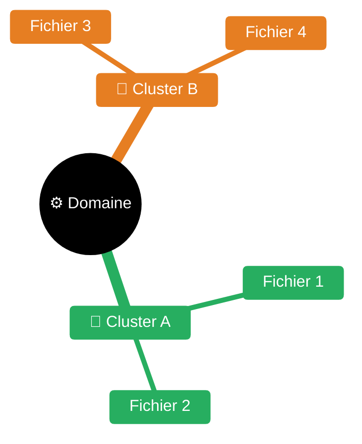

# Enrichissement Mermaid d'une KB — process complet

> Pattern validé sur `knowledge-world-wide-web/sre/guides/` : 23 fichiers, 37 diagrammes Mermaid,
> 0 ASCII art résiduel, mindmap de navigation en index.
> Cible : **GitLab 18.x — Mermaid 10.7**.

---

## Phase 1 — Inventaire

**Règle proactive** : scanner l'ASCII art à **chaque** lecture d'un fichier KB, pas seulement
en phase d'enrichissement dédiée. Si présent → convertir sans attendre une demande explicite.

Avant d'écrire un seul diagramme, lire **tous** les fichiers du dossier et catégoriser :

```bash
# Fichiers sans aucun Mermaid
grep -rL 'mermaid' /chemin/domaine/guides/

# Fichiers avec ASCII art à remplacer (palette complète box-drawing + flèches)
grep -rnE '[┌└├┤┬┴┼─│╱╲▼▶◀▲]|─▶|◀─|⇒|⇐' /chemin/domaine/guides/

# Compter les blocs Mermaid existants
grep -c 'mermaid' /chemin/domaine/guides/*.md
```

**Patterns ASCII à détecter** (tous équivalents à un diagramme Mermaid) :

| Pattern | Signature | Mermaid cible |
|---------|-----------|---------------|
| Box drawing + flèches horizontales | `┌─┐ ──▶ ┌─┐` | `flowchart LR` |
| Box drawing empilé | `┌─┐\n  │\n  ▼\n┌─┐` | `flowchart TD` |
| Pyramide ASCII | `╱╲ ╱──╲ ╱────╲` | `flowchart BT` |
| Flèches simples | `A → B → C` | `flowchart LR` |
| Arborescence | `├── └──` | `flowchart TD` |

Pour chaque fichier, noter :
- Présence d'ASCII art → **remplacer**
- Tableaux qui seraient plus clairs en diagramme → **ajouter**
- Chaînes de dérivation (`A → B → C`) → **ajouter flowchart LR**
- Arbres de décision → **ajouter flowchart TD**
- Cycles / state machines → **ajouter stateDiagram-v2**

---

## Phase 2 — Types valides GitLab 18.x (Mermaid 10.7)

| Type | Usage | Direction |
|------|-------|-----------|
| `flowchart LR` | Pipelines, timelines, chaînes de dérivation | Gauche → droite |
| `flowchart TD` | Arbres de décision, org-charts, cycles avec loop-back | Haut → bas |
| `flowchart BT` | Pyramides (base large en bas) | Bas → haut |
| `stateDiagram-v2` | Machines à états (circuit breaker, lifecycle) | — |
| `sequenceDiagram` | Interactions entre acteurs dans le temps | — |
| `mindmap` | Index / carte de navigation d'un dossier | Radial |
| `gantt` | Timelines de projet, planning | — |
| `pie` | Répartitions | — |
| `gitGraph` | Branching strategy | — |

**❌ Non supportés GitLab 18.x** : `block-beta`, `architecture-beta`, `kanban`, `packet-beta`.
**❌ Ne pas utiliser** : frontmatter YAML `---config:---` → utiliser `%%{init}%%` uniquement.

---

## Phase 3 — Palette couleur sémantique (à appliquer systématiquement)

Déclarer en tête de **chaque bloc** flowchart :

```mermaid
flowchart TD
    classDef proc fill:#D1ECF1,stroke:#0C5460,color:#0C5460
    classDef ok   fill:#D4EDDA,stroke:#155724,color:#155724
    classDef ko   fill:#F8D7DA,stroke:#721C24,color:#721C24
    classDef warn fill:#FFF3CD,stroke:#856404,color:#333
    classDef key  fill:#CCE5FF,stroke:#004085,color:#004085
    classDef neutral fill:#E2E3E5,stroke:#6C757D,color:#383D41
```

| Classe | Couleur | Sémantique |
|--------|---------|------------|
| `proc` | Bleu info | Processus, étape neutre |
| `ok` | Vert | Succès, nominal, healthy |
| `ko` | Rouge | Erreur, danger, freeze |
| `warn` | Jaune | Décision, seuil, warning |
| `key` | Bleu primaire | Concept clé, entrée principale |
| `neutral` | Gris | Contexte, passif |

Appliquer avec `:::nomClasse` sur chaque nœud : `A["texte"]:::ok`.

---

## Phase 4 — Règles de direction

| Choisir | Quand |
|---------|-------|
| `LR` | Pipeline CI/CD, timeline séquentielle, chaîne de dérivation (CUJ → SLI → SLO), comparaison côte à côte |
| `TD` | Arbre de décision (if/else), org-chart (rôles IC), cycle avec feedback loop |
| `BT` | Pyramide dont la base large est la fondation (pyramide de tests) |
| `stateDiagram-v2` | Dès qu'il y a des états explicites et des transitions nommées |

---

## Phase 5 — Règles syntaxiques anti-piège GitLab

### Shapes diamant `{}`
Les labels multilignes ou contenant `>` / `<` doivent être **entre guillemets** :
```
✅ A{"Incident > 20% budget ?"} -->
❌ A{Incident > 20% budget ?} -->        # > mal interprété
❌ A{Budget\nconsommé ?} -->             # \n casse le parsing
```

### Edge labels
Labels d'arête **toujours sur une seule ligne** :
```
✅ A -->|"RPO — perte données max"| B
❌ A -->|"RPO\nperte données max"| B    # \n invalide dans edge label
```

### stateDiagram-v2 — transitions
Labels de transition **sur une seule ligne** :
```
✅ Closed --> Open : seuil d'erreurs atteint (x% sur fenêtre)
❌ Closed --> Open : seuil d'erreurs franchi\n(x% sur fenêtre)
```

### Caractères spéciaux dans les labels
Utiliser `&lt;` pour `<` dans les nœuds (htmlLabels désactivé dans GitLab sandbox) :
```
✅ A["latence &lt; 300ms"]
❌ A["latence < 300ms"]    # peut casser le parsing
```

### Python — chaînes triple-quoted
`\n` dans une triple-quoted string Python = **vrai saut de ligne** dans le fichier.
Cela casse silencieusement les labels multilignes Mermaid :
```python
# ❌ Piège : \n = newline réel dans le fichier
old = """A{Budget
4 semaines}"""
# ✅ Corriger : label sur une ligne, entre guillemets
new = 'A{"Budget 4 semaines"}'
```

---

## Phase 6 — Approche script Python (batch)

Pour enrichir un dossier entier (10+ fichiers), utiliser des scripts Python :

### Pattern replace_block (remplacement par marqueur unique)
```python
import re, os

BASE = '/chemin/domaine/guides/'

def replace_block(content, marker, new_block):
    """Remplace le bloc mermaid contenant 'marker' par new_block."""
    pattern = r'```mermaid\n.*?```'
    for block in re.finditer(pattern, content, re.DOTALL):
        if marker in block.group():
            s, e = block.span()
            return content[:s] + new_block + content[e:], True
    return content, False

def apply(filename, changes):
    path = os.path.join(BASE, filename)
    with open(path, 'r', encoding='utf-8') as f:
        content = f.read()
    for i, (marker, new_block) in enumerate(changes, 1):
        content, ok = replace_block(content, marker, new_block)
        print(f"  [{filename}] {i}: {'OK' if ok else 'NOT FOUND'}")
    with open(path, 'w', encoding='utf-8') as f:
        f.write(content)
```

### Pattern insert_after (insertion après une ancre)
```python
def insert_after(content, anchor, block):
    """Insère block après la ligne contenant anchor."""
    idx = content.find(anchor)
    if idx == -1:
        return content, False
    end = content.find('\n', idx)
    return content[:end+1] + '\n' + block + '\n' + content[end+1:], True
```

### Pattern replace_ascii (remplacement d'ASCII art)
```python
def replace_ascii(content, old_ascii, new_mermaid):
    if old_ascii in content:
        return content.replace(old_ascii, new_mermaid, 1), True
    return content, False
```

**Travailler localement** → SCP → exécuter sur dev-server → vérifier la sortie → commit.

---

## Phase 7 — Audit systématique post-enrichissement

Une fois tous les fichiers traités, **relire chaque fichier** et vérifier :

1. **Couverture** : chaque concept important est-il illustré ?
2. **Direction** : LR/TD/BT est-elle la plus claire pour ce contenu ?
3. **Couleurs** : la palette sémantique est-elle cohérente ?
4. **Syntaxe** : labels `{}` quotés, pas de `\n` dans edge labels ?
5. **Conformité** : aucun type Mermaid 11+ utilisé ?

Grille d'audit par fichier (priorités) :

| Verdict | Critère | Action |
|---------|---------|--------|
| 🔴 Critique | Sujet central du fichier non illustré | Ajouter diagramme immédiatement |
| 🟠 Haute | Tableau complexe restant en texte pur | Ajouter diagramme de classification |
| 🟡 Moyenne | Direction sous-optimale | Réécrire avec la bonne direction |
| 🟢 OK | Couverture suffisante | Rien |

Corriger les 🔴 et 🟠 avant de valider.

---

## Phase 8 — Mindmap d'index pour un dossier

Créer un `README.md` à la racine du dossier avec une mindmap colorée comme index de navigation.
Placer les liens de navigation dans une **table Markdown** sous la mindmap
(les `click` directives Mermaid ne fonctionnent pas dans le sandbox GitLab — issue #4152 ouverte).

```markdown
## Carte de navigation



| 🎯 Cluster A | 📐 Cluster B |
|:---:|:---:|
| [Fichier 1](guides/fichier1.md) | [Fichier 3](guides/fichier3.md) |
| [Fichier 2](guides/fichier2.md) | [Fichier 4](guides/fichier4.md) |
```

Les `cScale0`–`cScale5` colorient les 6 premières branches dans l'ordre de déclaration.

---

## Comment l'agent lit les diagrammes dans la KB

Quand l'agent lit un fichier contenant des blocs Mermaid, il doit **interpréter le diagramme** comme un humain le lirait visuellement — pas ignorer le bloc.

### Règles d'interprétation

| Type de diagramme | Ce que l'agent doit en extraire |
|-------------------|---------------------------------|
| `flowchart LR/TD` | Séquence des étapes, conditions de branchement, boucles, couleur = sémantique (ok/ko/warn) |
| `stateDiagram-v2` | États possibles et conditions de transition |
| `sequenceDiagram` | Acteurs, ordre des messages, parallélisme |
| `mindmap` | Structure hiérarchique, clusters thématiques |
| `gantt` | Chronologie, durées, dépendances entre tâches |

### Correspondance couleur → sens (palette KB)

| Couleur observée | Sens opérationnel |
|-----------------|-------------------|
| Vert pâle (`#D4EDDA`) | Nominal, succès, chemin heureux |
| Rouge pâle (`#F8D7DA`) | Erreur, blocage, action urgente |
| Jaune pâle (`#FFF3CD`) | Décision, seuil, zone d'attention |
| Bleu pâle (`#D1ECF1`) | Processus standard, étape neutre |
| Bleu primaire (`#CCE5FF`) | Concept clé, entrée principale |
| Gris pâle (`#E2E3E5`) | Contexte passif, information secondaire |

### Règle de lecture active

Si un fichier contient un diagramme, l'agent **ne saute pas le bloc mermaid**. Il le lit
comme une représentation structurée du texte qui l'entoure. Le diagramme peut contenir des
informations non répétées dans le texte (ex : conditions d'une branche `|"Non"|`).

En cas de contradiction entre texte et diagramme dans le même fichier : **le texte fait foi**,
le diagramme est une représentation synthétique pouvant être légèrement simplifiée.

---

## Liens

- Spec Mermaid 10.7 complète : `knowledge-world-wide-web/diagramming/mermaid/README.md`
- Application sur SRE : `knowledge-world-wide-web/sre/README.md` (mindmap) + `sre/guides/` (37 diagrammes)

---

## Limites connues — liens dans les nœuds mindmap

**Conclusion** : il n'existe **pas** de moyen fiable d'avoir des liens cliquables *dans* les nœuds
d'une mindmap Mermaid rendue dans GitLab.

Approches testées et **écartées** :

| Approche | Résultat |
|----------|----------|
| `click` directives Mermaid (flowchart stylisé en étoile) | URLs résolues contre le sandbox iframe → 404 |
| SVG inline dans le Markdown (`<svg>...</svg>`) | GitLab sanitizer **strippe le `<style>`** → SVG non stylé + CSS affiché en texte brut |
| `<object data="mindmap.svg">` | Le sanitizer GitLab bloque / dégrade en fallback `` non interactif |
| `` | Affiche l'image mais SVG non interactif (comportement standard navigateur) |
| Markdown links `[text](url)` dans nœud mindmap | Non supporté (issue Mermaid #4152) |

**Tickets upstream à suivre** :
- [mermaid-js/mermaid#4152](https://github.com/mermaid-js/mermaid/issues/4152) — *"Clickable hyperlinks in mindmap"* (ouverte 2023, non résolue)
- [mermaid-js/mermaid#4099](https://github.com/mermaid-js/mermaid/issues/4099) — *"Add click interactions to MindMap"* (feature request approuvée, non implémentée)

Si l'un des deux tickets est résolu dans une future version Mermaid **et** déployée dans GitLab,
la table Markdown dessous pourra être retirée au profit de liens natifs dans les nœuds.

**Solution retenue** : mindmap Mermaid natif (visuel étoile) **+** table Markdown de liens en dessous.
C'est la combinaison la plus fiable : l'utilisateur a l'aperçu visuel en étoile et les liens cliquables
à portée de main.

Ne pas retenter les approches écartées sans validation préalable sur le rendu GitLab cible.
