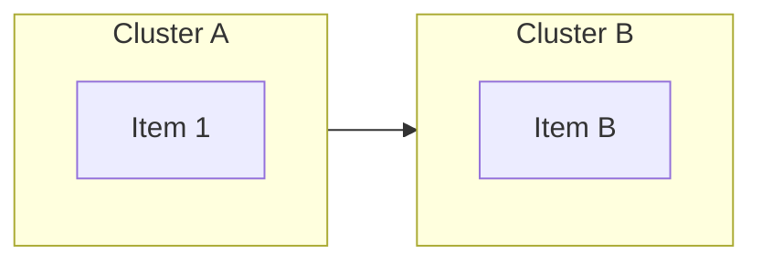
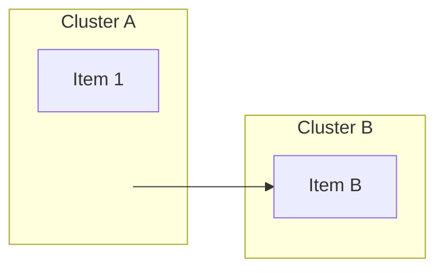
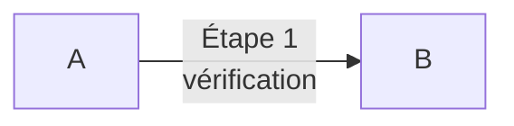
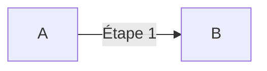
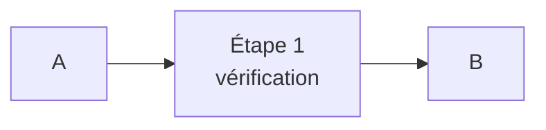
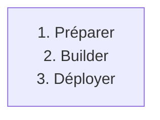
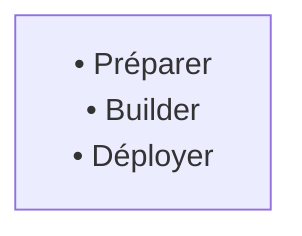
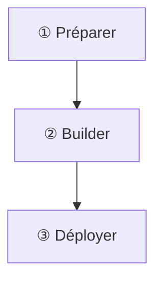
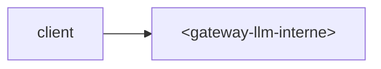
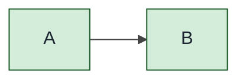

# Mermaid 11.x — pièges vs 10.7 (contexte mdbook)

> **Contexte** : `mdbook-mermaid` embarque Mermaid **11.x** (vs GitLab 18.x qui reste sur 10.7). La syntaxe est plus stricte sur 5 comportements qui passaient en 10.x. Les diagrammes copiés depuis une KB GitLab vers une page mdbook peuvent casser silencieusement. Ce guide documente les pièges et leurs résolutions.
>
> Pour le **process général** d'enrichissement Mermaid d'une KB (cible 10.7), voir [`kb-enrichissement.md`](kb-enrichissement.md).

---

## Piège 1 — Edges inter-subgraph directs

### Cassé en 11.x



### Symptôme

Erreur de parsing ou flèche manquante. 11.x refuse l'edge node-vers-subgraph quand le subgraph est utilisé comme nom direct.

### Résolution

Toujours passer par un **node intermédiaire** :



Ou plus simplement : connecter les nodes internes (`a1 --> b1`) — Mermaid place automatiquement la flèche entre clusters.

---

## Piège 2 — `<br/>` dans labels d'edges

### Cassé en 11.x



### Symptôme

Erreur de parsing. Le `<br/>` à l'intérieur d'un label d'edge `|...|` casse en 11.x.

### Résolution

Soit **un seul mot par label** :



Soit **HTML entity** (parfois OK selon contexte) :


Soit déporter l'info dans le **nom du node** suivant :



> ⚠️ Le `<br/>` reste OK **dans les labels de nodes** (entre crochets), juste pas dans les labels d'edges (entre `|`).

---

## Piège 3 — Listes auto-numérotées dans labels

### Cassé en 11.x



### Symptôme

Mermaid 11.x interprète `1.`, `2.` au début de ligne comme syntaxe markdown imbriquée → label cassé ou listes parasites.

### Résolution

Échapper la numérotation ou changer le format :



Ou utiliser des nodes séparés numérotés explicitement :



---

## Piège 4 — Chevrons `<...>` dans les IDs de nodes

### Cassé en 11.x

```mermaid
flowchart LR
  client --> <gateway-llm-interne>[Gateway LLM]
```

### Symptôme

Parser échoue. Les chevrons `<>` dans les IDs (utilisés en doc pour signaler des placeholders) ne sont pas valides pour Mermaid.

### Résolution

Utiliser un **alias court sans chevrons** + garder les chevrons dans le **label** (entre crochets) :



Note : `<` et `>` doivent être HTML-encodés dans les labels.

---

## Piège 5 — `themeVariables` sombre en `@media print`

### Symptôme


Rendu OK en HTML, mais en PDF : **fond noir, texte noir** sur certaines plateformes (le `@media print` ne propage pas le `themeVariables` à mermaid). Diagrammes illisibles.

### Résolution

Forcer un theme **clair pour le print** :



**Texte foncé sur tous les nodes** (`#1B2631`) évite le piège blanc-sur-blanc en print. Utiliser `theme: "base"` plutôt que `dark` ou `default` pour avoir le contrôle exact.

---

## Récap des invariants Mermaid 11.x → mdbook

| Invariant | Pourquoi |
|---|---|
| Pas d'edge `subA --> subB` direct | parser 11.x strict sur référence subgraph comme node |
| Pas de `<br/>` dans labels d'edges `\|...\|` | parser 11.x rejette l'imbrication HTML dans les labels d'arête |
| Échapper `1.`, `2.` dans labels de nodes | conflit syntaxe markdown / mermaid |
| Pas de `<>` dans les IDs de nodes | caractères réservés du parser |
| Theme `base` + texte `#1B2631` partout | sécurité print PDF |
| `--virtual-time-budget=30000` côté Chrome | laisser mermaid rendre les SVG avant capture |

---

## Block-beta → div HTML/CSS (cas pyramide)

`block-beta` reste **non disponible en GitLab 18.x** et se rend trop petit dans mdbook. Pour des pyramides (ex : pyramide tests, pyramide observabilité), préférer du **HTML/CSS pur** :

```html
<div class="pyramide">
  <div class="lvl5">Synthetic 24/7</div>
  <div class="lvl4">Pré-prod gate</div>
  <div class="lvl3">Post-deploy</div>
  <div class="lvl2">CI MR gate</div>
  <div class="lvl1">Poste dev</div>
</div>

<style>
.pyramide div {
  margin: 0 auto;
  padding: 0.5em;
  text-align: center;
  border: 1px solid #155724;
  background: #D4EDDA;
  box-sizing: border-box;       /* ← évite débordement avec padding */
}
.lvl1 { width: 92%; }
.lvl2 { width: 75%; }
.lvl3 { width: 58%; }
.lvl4 { width: 40%; }
.lvl5 { width: 25%; }
</style>
```

**Piège classique** : sans `box-sizing: border-box`, le padding s'**ajoute** à la width → débordement progressif des étages. Toujours border-box sur les pyramides CSS.

---

## Liens

- Process général d'enrichissement Mermaid (cible 10.7) : [`kb-enrichissement.md`](kb-enrichissement.md)
- Pipeline mdbook complet : [`../../mdbook/experience/mdbook-pdf-pipeline.md`](../../../mdbook/experience/mdbook-pdf-pipeline.md)
