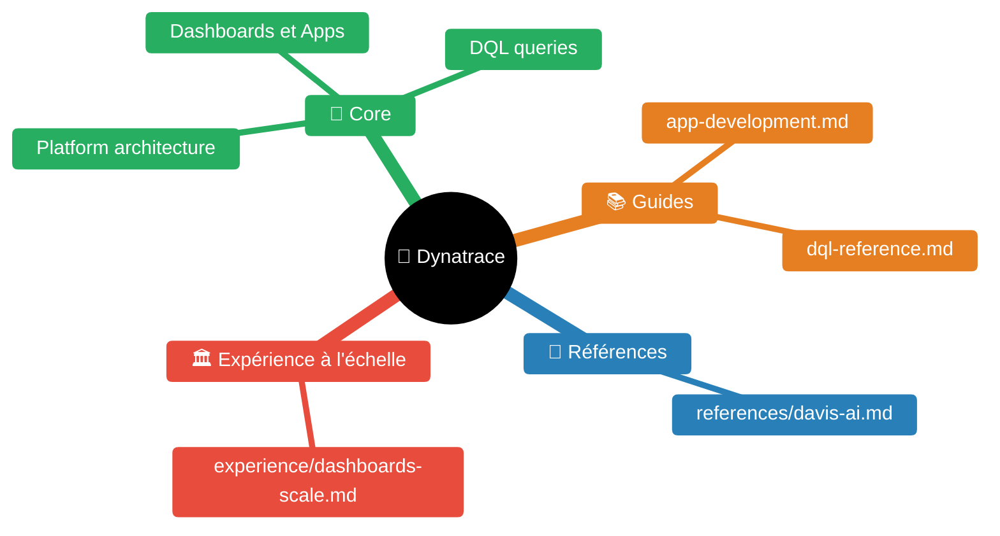
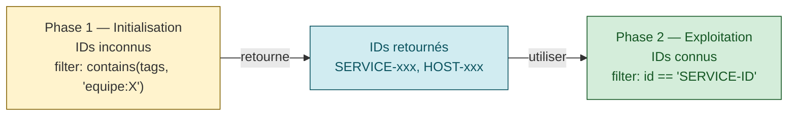
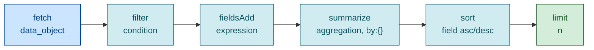

# Dynatrace Development Skill


| Fichier | Description |
|---------|-------------|
| [README.md](README.md) | Point d'entrée Dynatrace |
| [guides/app-development.md](guides/app-development.md) | Développement d'applications |
| [guides/dql-reference.md](guides/dql-reference.md) | Référence DQL |
| [references/davis-ai.md](references/davis-ai.md) | Davis AI : 4 modes anomaly detection, baselines, RCA topology-aware, CoPilot, matrice quand-Davis-vs-static |
| [experience/dashboards-scale.md](experience/dashboards-scale.md) | Dashboards Dynatrace à grande échelle (+100 équipes, +1000 SN, +7000 services) : signal-first, hiérarchie 5 niveaux, dashboard-as-code, anti-patterns |

## ⚠️ RÈGLES CRITIQUES DQL

### Règle #1 : UNE REQUÊTE = UN TYPE D'ENTITÉ

Chaque requête fetch un seul type d'entité. Le LLM orchestre le chaînage via les IDs retournés.

```dql
// ✅ CORRECT - une requête par type
fetch dt.entity.service | filter ...
fetch dt.entity.process_group | filter ...

// ❌ ÉVITER - join/lookup complexes
fetch dt.entity.service | join [fetch dt.entity.host], on:...
```

### Règle #2 : DEUX PHASES DE RECHERCHE

| Phase | Contexte | Méthode de filtre |
|-------|----------|-------------------|
| **Initialisation** | Équipe/produit identifié, IDs inconnus | `contains(toString(tags), "...")` |
| **Exploitation** | Contexte initialisé, IDs connus | `id == "ID-xxx"` ou `in(id, array(...))` |

**Après initialisation du contexte, NE PLUS JAMAIS utiliser les tags pour filtrer.**



### Règle #3 : PARSE AVANT UTILISER (JSON)

```dql
// ❌ ÉCHOUE silencieusement
fetch logs | fieldsAdd userId = content[user][id]

// ✅ CORRECT
fetch logs
| parse content, "JSON:parsed"
| fieldsAdd userId = parsed[user][id]
```

### Règle #4 : FILTRER PAR TAGS avec contains()

```dql
// ❌ ÉCHOUE - parsing regex sur tags
| parse toString(tags), "LD '\"equipe:' ([^\"]*):equipe"

// ✅ CORRECT - contains simple
| filter contains(toString(tags), "equipe:aTeam")
```

---

## Quick Reference

### DQL Query Structure
```
fetch <data_object> [, from:] [, to:]
| filter <condition>
| fieldsAdd <expression>
| summarize <aggregation>, by:{<grouping>}
| sort <field> [asc|desc]
| limit <n>
```



### Common Data Objects
- `logs` - Log records
- `events` - Davis events
- `bizevents` - Business events
- `spans` - Distributed traces
- `metrics` - Use `timeseries` command instead
- `dt.entity.*` - Entity data (hosts, services, processes)

### Essential DQL Commands
| Command | Purpose |
|---------|---------|
| `fetch` | Load data from Grail |
| `filter` | Keep matching records |
| `filterOut` | Remove matching records |
| `fields` | Select/rename fields |
| `fieldsAdd` | Add computed fields |
| `summarize` | Aggregate with grouping |
| `timeseries` | Metric time series |
| `makeTimeseries` | Event-based time series |
| `parse` | Extract from strings |
| `sort`, `limit` | Order and limit results |
| `expand` | Transform array to rows |

### Fonctions Entités (résolution de noms)

| Fonction | Usage |
|----------|-------|
| `entityName(id, type:"...")` | Nom d'une entité |
| `entityAttr(id, "attr", type:"...")` | Attribut d'une entité |
| `classicEntitySelector("...")` | Sélecteur classique (relations complexes) |

---

## Relations entre entités

| Relation | Direction inverse | Description |
|----------|-------------------|-------------|
| `runs` | `runs_on` | Entités qui s'exécutent |
| `calls` | `called_by` | Appels de services |
| `contains` | `belongs_to` | Hiérarchie |

### ⚠️ Limite : 100 IDs max par relation par record

```dql
// Obtenir les hosts d'un PG
fetch dt.entity.process_group
| filter id == "PROCESS_GROUP-xxx"
| fieldsAdd hosts = runs_on[dt.entity.host]

// Avec résolution de nom
| expand hosts
| fieldsAdd host_name = entityName(hosts, type:"dt.entity.host")
```

---

## When to Read References

**Read [guides/dql-reference.md](guides/dql-reference.md) when:**
- Writing complex DQL queries
- Using aggregation functions (avg, sum, count, percentile)
- Parsing logs or extracting data
- Working with timeseries/metrics
- Joining or correlating data
- Debugging DQL syntax errors

**Read [guides/app-development.md](guides/app-development.md) when:**
- Creating Dynatrace Apps
- Using SDK clients (@dynatrace-sdk/*)
- Building React UIs with Strato components
- Implementing app functions (backend)
- Working with AppEngine APIs
- Deploying apps to Dynatrace Hub

## DQL Quick Examples

### Entités par tag (initialisation)
```dql
fetch dt.entity.service
| filter contains(toString(tags), "equipe:aTeam")
| fields id, entity.name, tags
```

### Métriques par ID (exploitation)
```dql
timeseries avg(dt.host.cpu.usage),
    by:{dt.entity.host},
    interval:5m,
    filter:in(dt.entity.host, array("HOST-xxx", "HOST-yyy"))
```

### Filter logs by level
```dql
fetch logs, from:now()-1h
| filter loglevel == "ERROR"
| fields timestamp, content, dt.entity.host
| limit 100
```

### Count events by type
```dql
fetch events, from:now()-24h
| summarize count(), by:{event.type}
| sort `count()` desc
```

### Parse structured content
```dql
fetch logs
| parse content, "JSON:parsed"
| fieldsAdd error_code = parsed[error][code]
```

## App Development Quick Start

### Create new app
```bash
npx dt-app@latest create my-app
cd my-app
npm run start  # Local dev
npm run build && npm run deploy  # Deploy
```

### SDK Client Usage
```typescript
import { queryExecutionClient } from '@dynatrace-sdk/client-query';

const result = await queryExecutionClient.queryExecute({
  body: {
    query: 'fetch logs | limit 10',
    requestTimeoutMilliseconds: 30000
  }
});
```

### React Component with DQL
```typescript
import { useDqlQuery } from '@dynatrace-sdk/react-hooks';
import { DataTable } from '@dynatrace/strato-components-preview';

function LogViewer() {
  const { data, isLoading } = useDqlQuery({
    body: { query: 'fetch logs | limit 50' }
  });
  
  if (isLoading) return <ProgressCircle />;
  return <DataTable data={data?.records ?? []} />;
}
```

## Troubleshooting

### DQL Issues
| Symptôme | Cause | Solution |
|----------|-------|----------|
| `PARSE_ERROR` sur tags | Parsing regex | `contains(toString(tags), "...")` |
| No data returned | Timeframe trop court | Étendre `from:now()-Xh` |
| Champ non trouvé | JSON non parsé | `parse content, "JSON:parsed"` |
| Limite 100 IDs | Relations 1:n | `classicEntitySelector()` |

### App Issues
- **CORS errors**: Use EdgeConnect for external APIs
- **Permission denied**: Check app.config.json scopes
- **Build failures**: Verify TypeScript types, check SDK versions

## Agent Harness — accès programmatique

L'agent harness (`copilot-gemma4/agent-harness`) expose 3 outils Dynatrace
activables via le profil `ops.yaml` (`ops_tools.dynatrace.enabled: true`) :

| Outil | Usage |
|-------|-------|
| `dynatrace_dql(query, time_range)` | Exécuter une requête DQL sur Grail (async submit/poll) |
| `dynatrace_problems(time_range)` | Lister les problèmes ouverts/récents |
| `dynatrace_entity_search(selector)` | Chercher des entités monitorées |

Prérequis : `DT_API_TOKEN` en variable d'environnement (scope read suffit).

```bash
# Lancer l'agent ops avec Dynatrace
mise run agent:serve -- coding   # ou depuis le terminal :
DT_API_TOKEN=dt0c01.xxx mise run agent:coding -- "Quels sont les problèmes ouverts ?" ~/projet
```

Code source : `agent-harness/src/harness/tools/dynatrace.py`

## Key Documentation URLs

- DQL Reference: https://docs.dynatrace.com/docs/discover-dynatrace/platform/grail/dynatrace-query-language
- Entity Topology: https://docs.dynatrace.com/docs/discover-dynatrace/guides/semantic-dictionary/model/dt-entities
- Developer Portal: https://developer.dynatrace.com/
- SDK Reference: https://developer.dynatrace.com/develop/sdks/
- Strato Components: https://developer.dynatrace.com/design/about-strato-design-system/

---

## Skills connexes

- [`../sre/README.md`](../sre/README.md) — Référence SRE complète (golden signals, dynatrace vs monitoring, SLI/SLO)
- [`../sre/guides/signal-first-doctrine.md`](../sre/guides/signal-first-doctrine.md) — Doctrine signal-first portable (non Dynatrace-spécifique) — top-K, anomaly-first, burn-rate-first, hiérarchie 5 niveaux
- [`../sre/guides/dashboards-audiences.md`](../sre/guides/dashboards-audiences.md) — 3 audiences (dev/ops/métier), 1 dashboard par audience, anti-patterns mixing
- `../n8n-observabilite/README.md` — Workflows n8n pilotant Dynatrace (RED/USE)
- [`../kubernetes/README.md`](../kubernetes/README.md) — Cible monitorée par Dynatrace
