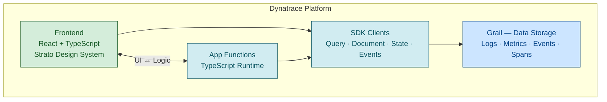

# Dynatrace App Development Reference

## Table of Contents
1. [Architecture Overview](#architecture-overview)
2. [Project Setup](#project-setup)
3. [App Configuration](#app-configuration)
4. [SDK Clients](#sdk-clients)
5. [React Components](#react-components)
6. [App Functions](#app-functions)
7. [Data Querying](#data-querying)
8. [State Management](#state-management)
9. [Navigation and Intents](#navigation-and-intents)
10. [Security and Permissions](#security-and-permissions)
11. [Deployment](#deployment)
12. [Common Patterns](#common-patterns)

---

## Architecture Overview

Dynatrace Apps run on AppEngine with:
- **Frontend**: React + TypeScript with Strato Design System
- **Backend**: App Functions running in Dynatrace JavaScript Runtime
- **Data**: DQL queries to Grail via SDK



---

## Project Setup

### Create New App
```bash
# Create app with interactive wizard
npx dt-app@latest create my-app

# Or with options
npx dt-app@latest create my-app --template default
```

### Project Structure
```
my-app/
├── app.config.json       # App configuration
├── package.json          # Dependencies
├── tsconfig.json         # TypeScript config
├── src/
│   ├── app/
│   │   ├── App.tsx       # Main component
│   │   ├── pages/        # Page components
│   │   └── components/   # Shared components
│   └── api/              # App functions
│       └── my-function.ts
└── assets/               # Static assets
```

### Development Commands
```bash
npm run start     # Start dev server
npm run build     # Build for production
npm run deploy    # Deploy to environment
npm run lint      # Run linter
npm run typecheck # TypeScript check
```

---

## App Configuration

### app.config.json
```json
{
  "environmentUrl": "https://abc12345.apps.dynatrace.com",
  "app": {
    "id": "my.company.my-app",
    "name": "My App",
    "description": "App description",
    "icon": "rocket",
    "version": "1.0.0"
  },
  "scopes": [
    { "name": "storage:logs:read", "comment": "Read logs" },
    { "name": "storage:metrics:read", "comment": "Read metrics" },
    { "name": "document:documents:read", "comment": "Read documents" },
    { "name": "app-engine:apps:run", "comment": "Run app" }
  ]
}
```

### Common Scopes
| Scope | Purpose |
|-------|---------|
| `storage:logs:read` | Read log data |
| `storage:metrics:read` | Read metrics |
| `storage:events:read` | Read events |
| `storage:spans:read` | Read traces |
| `storage:bizevents:read` | Read business events |
| `storage:entities:read` | Read entities |
| `document:documents:read/write` | Document service |
| `app-engine:apps:run` | Execute app functions |
| `state:app-states:read/write` | App state storage |
| `settings:objects:read/write` | Settings service |

---

## SDK Clients

### Installation
```bash
npm install @dynatrace-sdk/client-query
npm install @dynatrace-sdk/client-document
npm install @dynatrace-sdk/client-state
npm install @dynatrace-sdk/react-hooks
```

### Query Client (DQL)
```typescript
import { queryExecutionClient } from '@dynatrace-sdk/client-query';

// Execute DQL query
const result = await queryExecutionClient.queryExecute({
  body: {
    query: 'fetch logs | limit 100',
    requestTimeoutMilliseconds: 30000,
    maxResultRecords: 1000
  }
});

// Access results
const records = result.result?.records ?? [];
```

### Document Client
```typescript
import { documentsClient } from '@dynatrace-sdk/client-document';

// Create document
const doc = await documentsClient.createDocument({
  body: {
    name: 'my-document',
    type: 'dashboard',
    content: JSON.stringify({ widgets: [] }),
    isPrivate: false
  }
});

// List documents
const docs = await documentsClient.listDocuments({
  filter: 'type=="dashboard"'
});

// Get document
const document = await documentsClient.getDocument({
  id: 'document-id'
});
```

### State Client (Key-Value Storage)
```typescript
import { stateClient } from '@dynatrace-sdk/client-state';

// Set state
await stateClient.setAppState({
  key: 'user-preferences',
  body: JSON.stringify({ theme: 'dark' })
});

// Get state
const state = await stateClient.getAppState({
  key: 'user-preferences'
});
const prefs = JSON.parse(state.value);

// Delete state
await stateClient.deleteAppState({
  key: 'user-preferences'
});
```

### Classic Environment Client
```typescript
import { 
  metricsClient,
  activeGatesClient 
} from '@dynatrace-sdk/client-classic-environment-v2';

// Query metrics
const metrics = await metricsClient.query({
  metricSelector: 'builtin:host.cpu.usage',
  from: 'now-1h'
});

// Get ActiveGates
const activeGates = await activeGatesClient.getAllActiveGates({
  networkZone: 'default'
});
```

---

## React Components

### Strato Design System
```typescript
import {
  Flex,
  Text,
  Button,
  DataTable,
  ProgressCircle,
  Surface,
  Heading,
  Page,
  TitleBar
} from '@dynatrace/strato-components-preview';
```

### Page Layout
```typescript
import { Page, TitleBar } from '@dynatrace/strato-components-preview';

export function MyPage() {
  return (
    <Page>
      <Page.Header>
        <TitleBar>
          <TitleBar.Title>My Page Title</TitleBar.Title>
          <TitleBar.Subtitle>Subtitle here</TitleBar.Subtitle>
        </TitleBar>
      </Page.Header>
      <Page.Main>
        {/* Page content */}
      </Page.Main>
    </Page>
  );
}
```

### Data Table
```typescript
import { DataTable } from '@dynatrace/strato-components-preview';

function LogTable({ logs }) {
  const columns = [
    { accessor: 'timestamp', header: 'Time' },
    { accessor: 'loglevel', header: 'Level' },
    { accessor: 'content', header: 'Message' }
  ];

  return (
    <DataTable
      data={logs}
      columns={columns}
      sortable
      paginated
      pageSize={20}
    />
  );
}
```

### Forms
```typescript
import { 
  TextInput, 
  Select, 
  FormField,
  Button 
} from '@dynatrace/strato-components-preview';

function SearchForm({ onSearch }) {
  const [query, setQuery] = useState('');
  
  return (
    <Flex direction="column" gap={8}>
      <FormField label="Search Query">
        <TextInput
          value={query}
          onChange={setQuery}
          placeholder="Enter search term"
        />
      </FormField>
      <Button onClick={() => onSearch(query)}>
        Search
      </Button>
    </Flex>
  );
}
```

---

## App Functions

App functions run server-side in Dynatrace JavaScript Runtime.

### Define Function (src/api/my-function.ts)
```typescript
import { queryExecutionClient } from '@dynatrace-sdk/client-query';

export default async function(payload: { query: string }) {
  const result = await queryExecutionClient.queryExecute({
    body: {
      query: payload.query,
      requestTimeoutMilliseconds: 60000
    }
  });
  
  return {
    records: result.result?.records ?? [],
    metadata: result.result?.metadata
  };
}
```

### Call from Frontend
```typescript
import { functions } from '@dynatrace-sdk/app-utils';

async function fetchData() {
  const result = await functions.call('my-function', {
    query: 'fetch logs | limit 100'
  });
  return result;
}
```

### Available APIs in Functions
- All SDK clients
- `fetch()` for HTTP requests
- Standard JavaScript/TypeScript features
- No DOM APIs (server-side only)

---

## Data Querying

### Using React Hooks
```typescript
import { useDqlQuery } from '@dynatrace-sdk/react-hooks';

function LogViewer() {
  const { data, isLoading, error, refetch } = useDqlQuery({
    body: {
      query: `
        fetch logs, from:now()-1h
        | filter loglevel == "ERROR"
        | limit 100
      `
    }
  });

  if (isLoading) return <ProgressCircle />;
  if (error) return <Text>Error: {error.message}</Text>;

  return (
    <DataTable 
      data={data?.records ?? []} 
      columns={[
        { accessor: 'timestamp', header: 'Time' },
        { accessor: 'content', header: 'Message' }
      ]}
    />
  );
}
```

### Dynamic Queries
```typescript
function DynamicQuery({ timeRange, logLevel }) {
  const query = useMemo(() => `
    fetch logs, from:now()-${timeRange}
    ${logLevel ? `| filter loglevel == "${logLevel}"` : ''}
    | limit 100
  `, [timeRange, logLevel]);

  const { data, isLoading } = useDqlQuery({
    body: { query }
  });

  // ...
}
```

### Polling/Auto-refresh
```typescript
const { data, isLoading } = useDqlQuery({
  body: { query: 'fetch logs | limit 10' },
  options: {
    refetchInterval: 30000 // Refresh every 30 seconds
  }
});
```

---

## State Management

### App State (Persistent)
```typescript
import { stateClient } from '@dynatrace-sdk/client-state';

// Save settings
async function saveSettings(settings: Settings) {
  await stateClient.setAppState({
    key: `settings-${userId}`,
    body: JSON.stringify(settings)
  });
}

// Load settings
async function loadSettings(): Promise<Settings> {
  try {
    const state = await stateClient.getAppState({
      key: `settings-${userId}`
    });
    return JSON.parse(state.value);
  } catch {
    return defaultSettings;
  }
}
```

### React State with Persistence
```typescript
function usePersistedState<T>(key: string, initial: T) {
  const [value, setValue] = useState<T>(initial);
  const [loading, setLoading] = useState(true);

  useEffect(() => {
    stateClient.getAppState({ key })
      .then(state => setValue(JSON.parse(state.value)))
      .catch(() => {})
      .finally(() => setLoading(false));
  }, [key]);

  const setPersistedValue = async (newValue: T) => {
    setValue(newValue);
    await stateClient.setAppState({
      key,
      body: JSON.stringify(newValue)
    });
  };

  return [value, setPersistedValue, loading] as const;
}
```

---

## Navigation and Intents

### App Navigation
```typescript
import { useNavigation } from '@dynatrace-sdk/navigation';

function MyComponent() {
  const nav = useNavigation();

  // Navigate within app
  nav.navigate('/settings');

  // Navigate with params
  nav.navigate('/details', { id: '123' });

  // Navigate to external app
  nav.navigateToApp('dynatrace.classic.hosts', {
    path: '/ui/entity/HOST-ABC123'
  });
}
```

### Intents (Inter-App Communication)
```typescript
import { sendIntent } from '@dynatrace-sdk/navigation';

// Send intent to another app
sendIntent({
  'dt.intent.action': 'view-details',
  'dt.entity.host': 'HOST-ABC123'
});
```

### Receive Intents
```typescript
import { useCurrentIntent } from '@dynatrace-sdk/navigation';

function MyPage() {
  const intent = useCurrentIntent();
  
  useEffect(() => {
    if (intent?.['dt.entity.host']) {
      loadHostDetails(intent['dt.entity.host']);
    }
  }, [intent]);
}
```

---

## Security and Permissions

### Scope Declaration
Always declare minimum required scopes in `app.config.json`.

### EdgeConnect (External APIs)
For external API calls, use EdgeConnect:

```typescript
// In app function
const response = await fetch('https://internal-api.company.com/data', {
  headers: {
    'Authorization': `Bearer ${token}`
  }
});
```

Configure EdgeConnect in Dynatrace to allow the domain.

### Error Handling
```typescript
import { 
  isClientRequestError,
  isPermissionDenied 
} from '@dynatrace-sdk/client-query';

try {
  const result = await queryExecutionClient.queryExecute({ ... });
} catch (error) {
  if (isPermissionDenied(error)) {
    showError('Missing permissions. Check app scopes.');
  } else if (isClientRequestError(error)) {
    showError(`API Error: ${error.message}`);
  } else {
    throw error;
  }
}
```

---

## Deployment

### Build and Deploy
```bash
# Build production bundle
npm run build

# Deploy to environment
npm run deploy

# Deploy to specific environment
DT_ENVIRONMENT_URL=https://abc.apps.dynatrace.com npm run deploy
```

### Version Management
Update version in `app.config.json`:
```json
{
  "app": {
    "version": "1.1.0"
  }
}
```

### Hub Distribution
For public distribution:
1. Package app with `npm run build`
2. Submit to Dynatrace Hub
3. Complete certification process

---

## Common Patterns

### Loading State Pattern
```typescript
function DataView() {
  const { data, isLoading, error } = useDqlQuery({ ... });

  if (isLoading) {
    return (
      <Flex justifyContent="center" padding={32}>
        <ProgressCircle />
      </Flex>
    );
  }

  if (error) {
    return (
      <Surface>
        <Text color="critical">Failed to load: {error.message}</Text>
        <Button onClick={() => refetch()}>Retry</Button>
      </Surface>
    );
  }

  return <DataTable data={data?.records ?? []} />;
}
```

### Time Range Selector
```typescript
const TIME_RANGES = [
  { label: 'Last hour', value: '1h' },
  { label: 'Last 24 hours', value: '24h' },
  { label: 'Last 7 days', value: '7d' }
];

function TimeRangeSelector({ value, onChange }) {
  return (
    <Select value={value} onChange={onChange}>
      {TIME_RANGES.map(range => (
        <Select.Option key={range.value} value={range.value}>
          {range.label}
        </Select.Option>
      ))}
    </Select>
  );
}
```

### Dashboard Widget Pattern
```typescript
function MetricWidget({ title, query }) {
  const { data, isLoading } = useDqlQuery({
    body: { query }
  });

  const value = data?.records?.[0]?.value ?? 0;

  return (
    <Surface padding={16}>
      <Flex direction="column" gap={8}>
        <Text variant="label">{title}</Text>
        {isLoading ? (
          <ProgressCircle size="small" />
        ) : (
          <Heading level={2}>{value}</Heading>
        )}
      </Flex>
    </Surface>
  );
}
```

### Entity Lookup Pattern
```typescript
async function getEntityDetails(entityId: string) {
  const { data } = await queryExecutionClient.queryExecute({
    body: {
      query: `
        fetch dt.entity.host
        | filter id == "${entityId}"
        | fields id, entity.name, tags
      `
    }
  });
  return data?.records?.[0];
}
```
