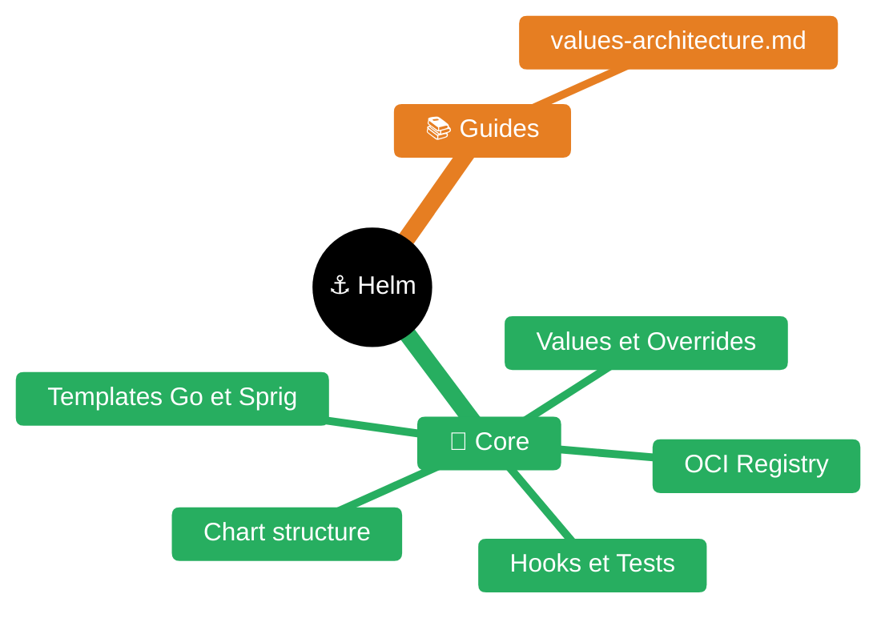

# Helm 3

> **Expérience projet** : voir `experience/helm.md` pour les leçons spécifiques au workspace <solution-numerique> (intégration Concourse `helm-upgrade.yml`, pattern OCI entreprise, chart local vs chart entreprise, convention Quarkus double-underscore, pièges `pending-upgrade`).
> **Publication Artifactory** : voir `<experience/artifactory-helm-push.md>` pour le guide complet (push curl, resource Concourse, credentials, URLs repos, workflow avec guardrails).

> **Sources principales** :
> - [Helm documentation](https://helm.sh/docs/)
> - [Helm chart template guide](https://helm.sh/docs/chart_template_guide/)
> - [Helm chart best practices](https://helm.sh/docs/chart_best_practices/)
> - [Helm Chart.yaml reference](https://helm.sh/docs/topics/charts/)
> - [Helm built-in objects](https://helm.sh/docs/chart_template_guide/builtin_objects/)
> - [Helm values files](https://helm.sh/docs/chart_template_guide/values_files/)
> - [Helm hooks](https://helm.sh/docs/topics/charts_hooks/)
> - [Helm library charts](https://helm.sh/docs/topics/library_charts/)
> - [Helm OCI registries](https://helm.sh/docs/topics/registries/)
> - [Sprig function documentation](https://masterminds.github.io/sprig/)
> - [Kubernetes API reference](https://kubernetes.io/docs/reference/kubernetes-api/)
> - [Helm commands reference](https://helm.sh/docs/helm/)


| Fichier | Description |
|---------|-------------|
| [README.md](README.md) | Point d'entrée Helm |
| [guides/values-architecture.md](guides/values-architecture.md) | Architecture des values |

## Architecture & concepts fondamentaux

### Chart, release, repository

Un **chart** est un package Helm : un répertoire (ou un tgz) contenant des templates Kubernetes + un fichier `values.yaml` de défauts. Un **release** est une instance d'un chart déployée dans un cluster, identifiée par un nom unique par namespace. Un **repository** est un index HTTP(S) ou un registre **OCI** distribuant des charts versionnés.

| Concept | Définition |
|---------|-----------|
| **Chart** | Package = templates + values + metadata (`Chart.yaml`) |
| **Release** | Instance nommée d'un chart installée dans un namespace |
| **Repository** | Source distante de charts (HTTP index.yaml ou OCI registry) |
| **Values** | Paramètres injectés dans les templates (merge défauts + overrides) |
| **Manifest** | YAML Kubernetes rendu après templating |
| **History** | Séquence des révisions d'un release (stockée en Secret K8s) |
| **Revision** | Numéro monotone incrémenté à chaque upgrade/rollback |

> Source : [helm.sh/docs/intro/using_helm](https://helm.sh/docs/intro/using_helm/)

### Stockage d'un release

Helm 3 stocke l'état de chaque release sous forme de **Secret Kubernetes** dans le namespace cible :

```bash
kubectl get secrets -n <ns> -l owner=helm
# sh.helm.release.v1.<release-name>.v<revision>
```

Le Secret contient le manifest rendu + les values + metadata, compressé gzip + base64. Helm 3 n'a **plus de Tiller** (server-side) — tout est client-side avec les perms RBAC de l'utilisateur.

### Architecture Helm 3 vs 2

| Sujet | Helm 2 (legacy) | **Helm 3** |
|-------|-----------------|------------|
| Component server-side | Tiller (cluster-admin) | **Aucun** |
| Stockage release | ConfigMap dans kube-system | **Secret dans le namespace** |
| Namespace release | Implicite | **Explicite** (`--namespace`) |
| CRDs | Templates | **`crds/` dossier dédié** |
| `requirements.yaml` | séparé | **Fusionné dans `Chart.yaml`** |
| Sécurité | Tiller = risque | RBAC user natif |

---

## Structure d'un chart

```
mychart/
├── Chart.yaml           # metadata
├── values.yaml          # valeurs par défaut
├── values.schema.json   # JSON Schema de validation (optionnel)
├── templates/
│   ├── _helpers.tpl     # named templates (partials)
│   ├── deployment.yaml
│   ├── service.yaml
│   ├── configmap.yaml
│   ├── ingress.yaml
│   ├── serviceaccount.yaml
│   ├── hpa.yaml
│   ├── NOTES.txt        # message post-install
│   └── tests/
│       └── test-connection.yaml
├── charts/              # subcharts vendored (helm dependency update)
│   └── postgresql-12.5.8.tgz
├── crds/                # CRDs installés avant les templates, jamais templated
│   └── mycrd.yaml
├── .helmignore          # fichiers exclus du package
└── README.md
```

| Dossier / fichier | Rôle |
|-------------------|------|
| `Chart.yaml` | Metadata obligatoire (apiVersion, name, version) |
| `values.yaml` | Valeurs par défaut — **doit rendre un chart installable sans override** |
| `values.schema.json` | JSON Schema pour valider les values à l'install |
| `templates/*.yaml` | Templates Go rendus en manifests K8s |
| `templates/_*.tpl` | Fichiers partials (underscore = pas de rendu direct) |
| `templates/NOTES.txt` | Affiché en post-install/upgrade |
| `templates/tests/*` | Test pods exécutés par `helm test` |
| `charts/` | Subcharts vendored (tgz ou répertoires) |
| `crds/` | CRDs installés en premier, **non templated**, jamais upgradés |
| `.helmignore` | Patterns exclus lors du `helm package` |

> Source : [helm.sh/docs/topics/charts](https://helm.sh/docs/topics/charts/)

### `.helmignore`

Patterns glob style `.gitignore`. Exclusions utiles :

```
.git/
.gitignore
.DS_Store
*.swp
*.bak
*.tmp
.vscode/
.idea/
tests/
ci/
```

---

## `Chart.yaml`

```yaml
apiVersion: v2                    # v2 = Helm 3, v1 = legacy Helm 2
name: myapp-backend
description: Backend Quarkus pour MyApp
type: application                 # application | library
version: 1.4.2                    # version DU CHART (SemVer) — obligatoire
appVersion: "2.16.10"             # version de l'APP packagée (string libre)
kubeVersion: ">=1.25.0-0"         # contrainte K8s cible
home: https://gitlab.example.com/myapp
sources:
  - https://gitlab.example.com/myapp/quarkus
maintainers:
  - name: Équipe MyApp
    email: myapp@example.com
icon: https://example.com/icon.png
keywords:
  - quarkus
  - backend
  - java
annotations:
  artifacthub.io/changes: |
    - Bump Quarkus 2.16.10

dependencies:
  - name: postgresql
    version: "12.5.8"
    repository: "https://charts.bitnami.com/bitnami"
    condition: postgresql.enabled
    alias: db
    tags:
      - database
    import-values:
      - child: primary.service
        parent: db.service
```

| Champ | Obligatoire | Notes |
|-------|:-----------:|-------|
| `apiVersion` | Oui | **`v2` pour Helm 3** |
| `name` | Oui | DNS-1123 (minuscule, `-`, chiffres) |
| `version` | Oui | **SemVer strict** — version du chart |
| `appVersion` | Non | Version de l'app empaquetée (libre, quoted recommandé) |
| `type` | Non | `application` (défaut) ou `library` |
| `kubeVersion` | Non | Contrainte SemVer K8s |
| `dependencies` | Non | Subcharts — depuis Helm 3 dans `Chart.yaml` (plus de `requirements.yaml`) |

### `version` vs `appVersion`

- **`version`** : version du chart Helm → bumpée à chaque modif de templates/values. SemVer strict (pas de `v` préfixe, pas de `-SNAPSHOT`).
- **`appVersion`** : version de l'application déployée → **`image.tag` par défaut** si non surchargé (`{{ .Chart.AppVersion }}`).

Exemple : `version: 1.4.2` (chart) pour `appVersion: "2.16.10"` (Quarkus).

---

## Templates Go — syntaxe et objets built-in

### Syntaxe `{{ }}`

```yaml
apiVersion: apps/v1
kind: Deployment
metadata:
  name: {{ .Values.name }}
  namespace: {{ .Release.Namespace }}
spec:
  replicas: {{ .Values.replicaCount | default 1 }}
```

- `{{-` ou `-}}` : trim les whitespaces (gauche ou droite)
- `{{/* comment */}}` : commentaire template (n'apparait pas dans le rendu)
- `$var := expr` : variable locale
- `range`, `if/else`, `with` : flow control

### Objets built-in

| Objet | Contenu |
|-------|---------|
| **`.Values`** | Merge `values.yaml` + `-f overrides.yaml` + `--set` |
| **`.Release`** | `.Name` `.Namespace` `.IsInstall` `.IsUpgrade` `.Revision` `.Service` |
| **`.Chart`** | Contenu de `Chart.yaml` (`.Chart.Name`, `.Chart.Version`, `.Chart.AppVersion`) |
| **`.Files`** | Accès aux fichiers du chart (`.Files.Get`, `.Files.Glob`, `.Files.AsConfig`) |
| **`.Capabilities`** | `.KubeVersion.Major`, `.APIVersions.Has "..."`, version Helm |
| **`.Template`** | `.Name` (fichier courant), `.BasePath` |
| **`.Subcharts`** | Accès aux subcharts (depuis Helm 3) |

> Source : [helm.sh/docs/chart_template_guide/builtin_objects](https://helm.sh/docs/chart_template_guide/builtin_objects/)

### Pipelines `|` et fonctions Sprig

Helm embarque les [Sprig functions](https://masterminds.github.io/sprig/) + quelques helpers Helm.

| Fonction | Exemple | Résultat |
|----------|---------|----------|
| `quote` | `{{ .Values.name | quote }}` | `"myapp"` |
| `default` | `{{ .Values.replicas | default 1 }}` | Valeur ou défaut |
| `upper` / `lower` | `{{ "foo" | upper }}` | `FOO` |
| `indent N` | `{{ toYaml .Values.env | indent 4 }}` | Indente **toutes** les lignes de N espaces |
| **`nindent N`** | `{{ toYaml .Values.env | nindent 4 }}` | **Newline puis indent N** — préféré |
| `toYaml` | `{{ toYaml .Values.resources | nindent 10 }}` | Sérialise en YAML |
| `toJson` | `{{ .Values.config | toJson }}` | Sérialise en JSON compact |
| `include` | `{{ include "mychart.labels" . | nindent 4 }}` | Inclut un named template **avec pipe possible** |
| **`tpl`** | `{{ tpl .Values.urlTemplate . }}` | **Rend un string comme un template** |
| `required` | `{{ required "image.tag est obligatoire" .Values.image.tag }}` | Fail si manquant |
| `trunc` / `trimSuffix` | `{{ .Name | trunc 63 | trimSuffix "-" }}` | DNS-1123 safe |
| `sha256sum` | `{{ include (print $.Template.BasePath "/cm.yaml") . | sha256sum }}` | Checksum pour rolling update sur changement config |
| `lookup` | `{{ (lookup "v1" "Secret" .Release.Namespace "existing").data.token }}` | Query du cluster (⚠️ vide en `helm template`) |
| `fromYaml` / `toYaml` | `{{ .Files.Get "config.yaml" | fromYaml }}` | Parse YAML fichier |

### Conditions, boucles, scope

```yaml
{{- if .Values.ingress.enabled }}
apiVersion: networking.k8s.io/v1
kind: Ingress
...
{{- end }}

{{- range $host := .Values.ingress.hosts }}
  - host: {{ $host.name | quote }}
    paths:
      {{- range $host.paths }}
      - path: {{ . }}
      {{- end }}
{{- end }}

{{- with .Values.nodeSelector }}
nodeSelector:
  {{- toYaml . | nindent 2 }}
{{- end }}
```

- **`with`** change le scope du `.` → accès direct aux fields sans répéter le chemin
- Attention : dans un `with` ou `range`, `.` n'est plus la racine → pour remonter, passer la racine en paramètre `$` ou `$root := .`

---

## `_helpers.tpl` — named templates

Fichiers préfixés `_` dans `templates/` ne sont **pas rendus comme manifests**. Ils contiennent des **named templates** réutilisables.

### Pattern standard (généré par `helm create`)

```gotemplate
{{/*
Nom complet (tronqué à 63 char pour DNS-1123)
*/}}
{{- define "myapp.fullname" -}}
{{- if .Values.fullnameOverride }}
{{- .Values.fullnameOverride | trunc 63 | trimSuffix "-" }}
{{- else }}
{{- $name := default .Chart.Name .Values.nameOverride }}
{{- if contains $name .Release.Name }}
{{- .Release.Name | trunc 63 | trimSuffix "-" }}
{{- else }}
{{- printf "%s-%s" .Release.Name $name | trunc 63 | trimSuffix "-" }}
{{- end }}
{{- end }}
{{- end }}

{{/*
Labels communs
*/}}
{{- define "myapp.labels" -}}
helm.sh/chart: {{ printf "%s-%s" .Chart.Name .Chart.Version | replace "+" "_" }}
{{ include "myapp.selectorLabels" . }}
app.kubernetes.io/version: {{ .Chart.AppVersion | quote }}
app.kubernetes.io/managed-by: {{ .Release.Service }}
{{- end }}

{{/*
Selector labels (stables, jamais changés après install — matchLabels)
*/}}
{{- define "myapp.selectorLabels" -}}
app.kubernetes.io/name: {{ include "myapp.name" . }}
app.kubernetes.io/instance: {{ .Release.Name }}
{{- end }}
```

### `include` vs `template`

| Forme | Pipe possible | Usage |
|-------|:-------------:|-------|
| `{{ template "name" . }}` | **Non** | Legacy, évite |
| **`{{ include "name" . }}`** | **Oui** | **Recommandé** |

**Pourquoi `include` + `nindent`** : `template` est une **action** (pas une fonction) → ne peut pas être passé dans un pipe `| nindent N`. Avec `include`, on peut faire :

```yaml
metadata:
  labels:
    {{- include "myapp.labels" . | nindent 4 }}
```

Sans ça, l'indentation doit être codée en dur dans le `define`, rendant le helper non-réutilisable.

---

## Values

### Ordre de précédence (du plus faible au plus fort)

1. `values.yaml` du chart
2. `values.yaml` des subcharts (dépendances)
3. `-f values-prod.yaml` (multiples acceptés, ordre compte → dernier gagne)
4. `--set key=value` (CLI)
5. `--set-string` (force string — évite conversions auto)
6. `--set-file key=path` (lit un fichier comme valeur)

> Source : [helm.sh/docs/chart_template_guide/values_files](https://helm.sh/docs/chart_template_guide/values_files/)

### `values.yaml` typique

```yaml
replicaCount: 2

image:
  repository: registry.example.com/myapp/quarkus
  tag: ""                         # défaut : .Chart.AppVersion
  pullPolicy: IfNotPresent

imagePullSecrets:
  - name: registry-creds

serviceAccount:
  create: true
  name: ""

service:
  type: ClusterIP
  port: 8080

ingress:
  enabled: true
  className: nginx
  annotations: {}
  hosts:
    - host: myapp.local
      paths:
        - path: /
          pathType: Prefix

resources:
  limits:
    cpu: 1000m
    memory: 1Gi
  requests:
    cpu: 200m
    memory: 512Mi

env:
  QUARKUS_PROFILE: prod
  QUARKUS_DATASOURCE__DB_MYAPP__USERNAME: myapp
  QUARKUS_DATASOURCE__DB_MYAPP__JDBC__URL: "jdbc:oracle:thin:@oracle:1521/XEPDB1"

envFromSecret:
  name: myapp-secrets
  keys:
    - QUARKUS_DATASOURCE__DB_MYAPP__PASSWORD
```

> **Variables Quarkus à double underscore** : `QUARKUS_DATASOURCE__DB_MYAPP__USERNAME` correspond à la propriété `quarkus.datasource."db-myapp".username` — le **double underscore** délimite les **segments nommés** (datasources multiples), simple underscore = séparateur de mot dans le nom de propriété.

### Override à l'install/upgrade

```bash
# Multiple -f (merge profond dans l'ordre)
helm upgrade --install myapp ./chart \
  -f values.yaml \
  -f values-prod.yaml \
  -f values-secrets.yaml

# --set (scalaires, liste avec {}, sous-objets avec .)
helm upgrade --install myapp ./chart \
  --set image.tag=2.16.10 \
  --set replicaCount=3 \
  --set ingress.hosts[0].host=myapp.prod.local \
  --set-string image.tag="2.16.10"

# --set-file pour injecter le contenu d'un fichier
helm upgrade --install myapp ./chart \
  --set-file tls.crt=./cert.pem
```

⚠️ **Piège `--set`** : merge **superficiel** pour les listes → passer la liste entière. Préférer `-f values.yaml` pour les structures complexes.

### `values.schema.json`

Validation JSON Schema au moment du `helm install/upgrade` :

```json
{
  "$schema": "https://json-schema.org/draft-07/schema#",
  "required": ["image", "replicaCount"],
  "properties": {
    "replicaCount": {
      "type": "integer",
      "minimum": 1,
      "maximum": 10
    },
    "image": {
      "type": "object",
      "required": ["repository"],
      "properties": {
        "repository": { "type": "string" },
        "tag": { "type": "string" },
        "pullPolicy": { "enum": ["Always", "IfNotPresent", "Never"] }
      }
    }
  }
}
```

---

## Exemple — Deployment template avec helpers

```yaml
apiVersion: apps/v1
kind: Deployment
metadata:
  name: {{ include "myapp.fullname" . }}
  namespace: {{ .Release.Namespace }}
  labels:
    {{- include "myapp.labels" . | nindent 4 }}
spec:
  replicas: {{ .Values.replicaCount }}
  selector:
    matchLabels:
      {{- include "myapp.selectorLabels" . | nindent 6 }}
  template:
    metadata:
      annotations:
        # Force rolling restart si configmap change
        checksum/config: {{ include (print $.Template.BasePath "/configmap.yaml") . | sha256sum }}
      labels:
        {{- include "myapp.selectorLabels" . | nindent 8 }}
    spec:
      {{- with .Values.imagePullSecrets }}
      imagePullSecrets:
        {{- toYaml . | nindent 8 }}
      {{- end }}
      serviceAccountName: {{ include "myapp.serviceAccountName" . }}
      containers:
        - name: {{ .Chart.Name }}
          image: "{{ .Values.image.repository }}:{{ .Values.image.tag | default .Chart.AppVersion }}"
          imagePullPolicy: {{ .Values.image.pullPolicy }}
          ports:
            - name: http
              containerPort: {{ .Values.service.port }}
              protocol: TCP
          env:
            {{- range $key, $val := .Values.env }}
            - name: {{ $key }}
              value: {{ $val | quote }}
            {{- end }}
            {{- range .Values.envFromSecret.keys }}
            - name: {{ . }}
              valueFrom:
                secretKeyRef:
                  name: {{ $.Values.envFromSecret.name }}
                  key: {{ . }}
            {{- end }}
          livenessProbe:
            httpGet:
              path: /q/health/live
              port: http
            initialDelaySeconds: 30
          readinessProbe:
            httpGet:
              path: /q/health/ready
              port: http
            initialDelaySeconds: 10
          resources:
            {{- toYaml .Values.resources | nindent 12 }}
```

---

## Hooks

Les hooks exécutent des jobs/ressources K8s à des **moments précis** du cycle de vie via l'annotation `"helm.sh/hook"`.

| Hook | Quand |
|------|-------|
| **`pre-install`** | Avant création des ressources (avant templates normaux) |
| **`post-install`** | Après que toutes les ressources soient prêtes |
| **`pre-upgrade`** | Avant upgrade |
| **`post-upgrade`** | Après upgrade |
| **`pre-delete`** | Avant suppression du release |
| **`post-delete`** | Après suppression |
| **`pre-rollback`** / **`post-rollback`** | Rollback |
| **`test`** | Exécuté par `helm test` uniquement |

### Exemple — Job de migration DB pré-upgrade

```yaml
apiVersion: batch/v1
kind: Job
metadata:
  name: {{ include "myapp.fullname" . }}-migrate
  annotations:
    "helm.sh/hook": pre-upgrade,pre-install
    "helm.sh/hook-weight": "-5"
    "helm.sh/hook-delete-policy": before-hook-creation,hook-succeeded
spec:
  template:
    spec:
      restartPolicy: Never
      containers:
        - name: flyway
          image: flyway/flyway:7.8.2
          args: ["migrate"]
          env:
            - name: FLYWAY_URL
              value: {{ .Values.env.QUARKUS_DATASOURCE__DB_MYAPP__JDBC__URL }}
```

### Annotations de hook

| Annotation | Valeurs |
|------------|---------|
| `helm.sh/hook` | `pre-install`, `post-install`, `pre-upgrade`, `post-upgrade`, `pre-delete`, `post-delete`, `pre-rollback`, `post-rollback`, `test` (virgule-séparé) |
| `helm.sh/hook-weight` | Entier (négatif ou positif) — ordre d'exécution croissant |
| `helm.sh/hook-delete-policy` | `before-hook-creation` (défaut), `hook-succeeded`, `hook-failed` |

⚠️ **Hooks orphelins** : sans `hook-delete-policy`, les Jobs/Pods de hook restent dans le cluster indéfiniment. **Toujours mettre `before-hook-creation,hook-succeeded`** au minimum.

> Source : [helm.sh/docs/topics/charts_hooks](https://helm.sh/docs/topics/charts_hooks/)

---

## Dependencies (subcharts)

### Déclaration dans `Chart.yaml`

```yaml
dependencies:
  - name: postgresql
    version: "12.5.8"
    repository: "https://charts.bitnami.com/bitnami"
    condition: postgresql.enabled
    alias: db
    tags:
      - database
```

| Champ | Rôle |
|-------|------|
| `condition` | Active/désactive le subchart selon une value (`postgresql.enabled: false`) |
| `alias` | Renomme le subchart (accès via `.Values.<alias>`) |
| `tags` | Active/désactive un groupe via `--set tags.database=false` |
| `import-values` | Remonte des values du subchart vers le parent |

### Commandes

```bash
# Télécharge les subcharts dans charts/ d'après Chart.lock
helm dependency update ./chart
helm dependency build ./chart   # utilise Chart.lock existant
helm dependency list ./chart
```

Après `dependency update`, un `Chart.lock` est généré (à committer) et `charts/*.tgz` sont vendored.

### Override des values d'un subchart

```yaml
# values.yaml du parent
postgresql:                 # = nom du subchart (ou alias)
  auth:
    postgresPassword: secret
  primary:
    persistence:
      size: 10Gi
```

### OCI dependencies (Helm 3.8+)

```yaml
dependencies:
  - name: common
    version: "2.2.5"
    repository: "oci://registry-1.docker.io/bitnamicharts"
```

---

## Umbrella charts

Un **umbrella chart** (chart parapluie) est un chart parent **sans templates propres** (ou presque), qui agrège plusieurs subcharts pour déployer une application ou une suite complète comme une seule release Helm. Le parent ne contient que `Chart.yaml` + `values.yaml` + `charts/`, éventuellement un `templates/NOTES.txt`.

```yaml
# Chart.yaml — umbrella
apiVersion: v2
name: mysuite
type: application
version: 1.0.0
appVersion: "2026.03"
dependencies:
  - name: myapp-backend
    version: "1.4.x"
    repository: "oci://registry.example.com/charts"
  - name: myapp-frontend
    version: "2.1.x"
    repository: "oci://registry.example.com/charts"
  - name: postgresql
    version: "12.5.x"
    repository: "https://charts.bitnami.com/bitnami"
    condition: postgresql.enabled
```

```yaml
# values.yaml de l'umbrella
global:
  environment: prod
  imageRegistry: registry.example.com

myapp-backend:            # override des values du subchart
  replicaCount: 3
  image:
    tag: v1.4.2

myapp-frontend:
  replicaCount: 2

postgresql:
  enabled: true
  auth:
    database: myapp
```

### Quand utiliser un umbrella

| Situation | Umbrella ? |
|-----------|-----------|
| Déployer plusieurs composants versionnés ensemble comme une suite | **Oui** |
| Une seule version métier (ex: v2026.03) agrégeant backend+frontend+migrations | **Oui** |
| Release unique à rollback d'un coup | **Oui** |
| Sharing de valeurs globales entre composants (`.Values.global.*`) | **Oui** |
| Composants déployés indépendamment avec cycles de vie distincts | **Non** — charts séparés |
| Besoin de deployer/rollback chaque composant isolément | **Non** |
| Team ownership par composant avec propre pipeline | **Non** |
| Chart géré par une équipe transverse, composants par équipes produit | **Non** — risque de couplage |

### Avantages

- **Version unique de la suite** — `mysuite-1.4.0` déploie la combinaison testée des sous-composants. Élimine la question "quelle version du backend marche avec quelle version du frontend ?".
- **Rollback atomique** — `helm rollback mysuite 1` ramène tout en arrière d'un coup, pas de rollback coordonné multi-releases.
- **Valeurs globales partagées** — `global.imageRegistry`, `global.environment`, `global.oracleHost` définis une seule fois, consommés via `{{ .Values.global.* }}` depuis chaque subchart. Pattern Bitnami common.
- **Dépendances explicites** — `Chart.yaml` documente les composants et leur version. Un `helm dependency list` révèle la composition.
- **Un seul `helm upgrade --install`** — un seul job CI, un seul `--atomic --wait`, un seul polling status.
- **Activation/désactivation par `condition`** — désactiver Postgres en prod (DB managée) sans toucher au chart : `postgresql.enabled: false`.

### Inconvénients

- **Couplage des cycles de vie** — un simple bug patch du backend impose de republier l'umbrella entière (bump version, rebuild `Chart.lock`, push OCI, deploy). Lent si la suite contient 10+ composants.
- **Scope values imbriqué et verbeux** — override du username postgres = `postgresql.auth.username`, du replicaCount backend = `myapp-backend.replicaCount`. Les YAML deviennent profondément nested, perdant la lisibilité.
- **Pas de rollback partiel** — si seul le frontend foire, `helm rollback` rollback aussi backend et DB migrations. Compensation possible via hooks mais complexe.
- **`helm dependency update` sur 10+ subcharts est lent** — packaging+push de l'umbrella devient un goulot en CI (plusieurs minutes vs quelques secondes pour un chart simple).
- **Tests Helm à composer** — chaque subchart a ses propres `helm test`, l'umbrella doit orchestrer ou dupliquer. `helm test umbrella` exécute tous les hooks `helm.sh/hook: test` de tous les subcharts.
- **Ownership flou** — qui détient l'umbrella ? L'équipe DevOps, Platform, un produit maître ? Sans governance claire, il devient une zone d'échauffourée entre équipes.
- **Couplage versions subcharts** — si un subchart bump une major (breaking change), l'umbrella doit arbitrer la migration de tous ses consommateurs en même temps.
- **`global.*` fuit partout** — tout subchart peut lire `.Values.global.*`, créant un espace de noms implicite sans contrat formel. Difficile à tracer.
- **Conflits de noms ressources** — deux subcharts qui créent un `ConfigMap app-config` ou un `Service backend` collent. Solution : préfixer via `{{ include "chart.fullname" . }}` (à la charge des subcharts).
- **Secrets scope** — un `Secret` partagé entre subcharts doit être déclaré dans l'umbrella avec annotation `helm.sh/resource-policy: keep` pour survivre à un `helm uninstall` partiel.

### Patterns recommandés

- **Umbrella fin** : pas de templates propres à part `NOTES.txt` et éventuellement `Secret` partagé. Tout le contenu vient des subcharts.
- **`global` values** : namespace, registry, environment, cluster-wide config (ex: `global.oracleHost`). Éviter de mettre des configs métier dans `global`.
- **`Chart.lock` committé** — Garant de la reproductibilité. `helm dependency build` utilise le lock, `helm dependency update` le met à jour.
- **`file://` dans `dependencies:` ne génère PAS de `Chart.lock`** ([Helm #8851](https://github.com/helm/helm/issues/8851)). Utilisable en dev local uniquement ; en CI, passer par `oci://` (registry Kind en local, JFrog en entreprise). Fallback si le subchart est vendorisé in-tree : commit aussi `charts/*.tgz` pour garantir `helm dep build` offline.
- **Alias 2× pour multi-instance** — un même subchart peut être déclaré N fois dans `dependencies:` avec des `alias:` différents. Usage canonique dans le projet <solution-numerique> : le chart générique `sld-ng` est aliasé en `backend` et `frontend` pour déployer les 2 composants depuis une seule umbrella. Chaque instance a sa section de values scopée par l'alias (`backend:` / `frontend:`).
- **Subcharts via OCI** — plus scalable qu'un index HTTP, auth unifiée avec les images.
- **Versioning SemVer strict** — l'umbrella bump au moindre changement d'un subchart (patch si le subchart patch, minor si le subchart minor...).
- **NE PAS** nester d'umbrellas d'umbrellas — Helm gère techniquement, mais le debug devient impossible. Max 2 niveaux (parent → subcharts).

### Concurrence multi-pipelines — race release lock

Helm **n'a pas de lock natif** sur les releases ([Helm #10829](https://github.com/helm/helm/issues/10829), [#11863](https://github.com/helm/helm/issues/11863)). Deux `helm upgrade` concurrents sur la même release → `Error: UPGRADE FAILED: another operation (install/upgrade/rollback) is in progress` et release coincée en `pending-upgrade` / `pending-install`.

**Conséquence CI/CD** : si 2 pipelines (backend + frontend) déploient chacun leur `helm upgrade` sur la même umbrella, race systématique. Solutions, par ordre de préférence :

1. **Un seul pipeline fait le deploy** ⭐ — backend/frontend font build+push image+push chart, et **un 3e pipeline** orchestré fait le `helm upgrade` de l'umbrella. Zéro concurrence.
2. **Sérialisation via Concourse** — `serial_groups: [helm-deploy]` sur les jobs deploy-* pour qu'un seul tourne à la fois.
3. **Sérialisation côté orchestration** — chain script qui `pause-job` l'un pendant que l'autre tourne (pattern utilisé dans <solution-numerique> `trigger-chain-solution`).
4. **Lock défensif via ConfigMap** — `kubectl create configmap helm-lock-<rel>` atomique + TTL + GC cronjob. Dernier recours (fragilité trap).
5. **Détection + réparation `pending-upgrade`** — task `wait-release-unlocked.yml` qui `helm rollback` après 60s de pending coincé. Défense en profondeur, pas une solution.

> **Détail et code** : voir `experience/umbrella-charts.md` section 6 (CI/CD multi-pipeline + umbrella).

### Alternatives à considérer

| Alternative | Quand préférer |
|-------------|----------------|
| **Charts séparés + Argo CD App-of-Apps** | Releases indépendantes, orchestration GitOps déclarative |
| **Helmfile** | Déclaratif multi-releases avec dépendances inter-releases, sans forcer un chart parent |
| **Kustomize overlays** | Transformations simples sans Go templating |
| **Flux Kustomization dependsOn** | GitOps avec ordonnancement explicite |

> **Expérience projet** : voir `experience/helm.md` pour les patterns concrets d'umbrella dans le workspace <solution-numerique> (suite backend+frontend agrégée, chart local vs chart entreprise), et `experience/umbrella-charts.md` pour l'étude approfondie (dependencies+alias+conditions, hooks Flyway pre-upgrade, upgrade atomique, concurrence CI/CD multi-pipelines, portage OCI entreprise, 20+ sources).

---

## Library charts

Chart de type `library` — ne produit **pas de manifests**, expose uniquement des named templates réutilisables par d'autres charts.

```yaml
# Chart.yaml
apiVersion: v2
name: common
type: library                   # ← pas application
version: 1.0.0
```

Utilisation par un chart consommateur :

```yaml
# Chart.yaml du consommateur
dependencies:
  - name: common
    version: "1.0.0"
    repository: "file://../common"
```

```yaml
# templates/deployment.yaml
{{- include "common.deployment" (dict "Values" .Values "Context" .) }}
```

**Use case** : factoriser les patterns deployment/service/ingress à travers 50+ charts d'entreprise.

> Source : [helm.sh/docs/topics/library_charts](https://helm.sh/docs/topics/library_charts/)

---

## Releases & history

### Commandes principales

| Commande | Rôle |
|----------|------|
| `helm list -n <ns>` | Liste les releases |
| `helm list -A` | Tous namespaces |
| `helm status <release> -n <ns>` | État + ressources déployées |
| `helm history <release> -n <ns>` | Historique des révisions |
| `helm get values <release>` | Values actives |
| `helm get manifest <release>` | Manifest rendu actuellement déployé |
| `helm get notes <release>` | NOTES.txt du release |
| `helm get hooks <release>` | Hooks exécutés |
| `helm rollback <release> <revision> -n <ns>` | Rollback vers une révision |
| `helm uninstall <release> -n <ns>` | Supprime (garder historique avec `--keep-history`) |

### Exemple history

```bash
$ helm history myapp -n prod
REVISION  UPDATED                   STATUS      CHART            APP VERSION  DESCRIPTION
1         Mon Mar 21 14:00:00 2026  superseded  myapp-1.4.0      2.16.8       Install complete
2         Mon Mar 21 16:30:00 2026  superseded  myapp-1.4.1      2.16.9       Upgrade complete
3         Tue Mar 22 09:15:00 2026  deployed    myapp-1.4.2      2.16.10      Upgrade complete

$ helm rollback myapp 2 -n prod    # revert to revision 2
```

### Limite d'historique

```bash
helm upgrade --history-max 10 ...    # garde 10 révisions (défaut 10)
```

Releases anciennes supprimés automatiquement (les Secrets K8s sont GC).

---

## `helm upgrade --install` — pattern idempotent

**LE pattern standard CI/CD** : installe si absent, upgrade sinon.

```bash
helm upgrade --install myapp ./chart \
  --namespace mysuite-prod \
  --create-namespace \
  --values values.yaml \
  --values values-prod.yaml \
  --set image.tag=2.16.10 \
  --atomic \
  --wait \
  --timeout 10m \
  --cleanup-on-fail \
  --history-max 10
```

### Flags critiques

| Flag | Effet |
|------|-------|
| **`--install`** | Install si release absent (sinon échec avec juste `upgrade`) |
| **`--atomic`** | Rollback automatique si l'upgrade échoue → implique `--wait` |
| **`--wait`** | Attend que tous les pods soient `Ready` / jobs `Complete` avant de retourner |
| `--wait-for-jobs` | Attend aussi les jobs (hooks inclus) |
| **`--timeout 10m`** | Borne sup de l'attente |
| **`--cleanup-on-fail`** | Supprime les ressources créées si l'upgrade échoue |
| `--force` | Force la recréation des ressources (⚠️ downtime) |
| `--reset-values` | Ignore les values précédentes du release |
| `--reuse-values` | Merge avec les values du dernier release (⚠️ attention avec `-f`) |
| `--create-namespace` | Crée le namespace si absent |
| `--dry-run` | Simule sans appliquer (rend les templates côté API) |
| `--debug` | Affiche les manifests rendus + trace |

### `--atomic` + `--wait` — comportement

```
1. Render templates
2. Apply manifests (patch, create)
3. Wait for Ready (timeout)
4. Sur échec : rollback automatique + cleanup
5. Exit code non-zero
```

**Recommandé pour toute CI** — garantit l'idempotence et évite les releases dans un état `pending-upgrade`.

---

## OCI registries

Depuis **Helm 3.8 GA** (2022), OCI est le mode recommandé pour distribuer des charts (déprécie progressivement les repos HTTP classiques).

### Login

```bash
helm registry login registry.example.com \
  --username $USER --password $TOKEN
```

### Push / pull

```bash
# Package + push
helm package ./chart               # → myapp-1.4.2.tgz
helm push myapp-1.4.2.tgz oci://registry.example.com/charts

# Pull
helm pull oci://registry.example.com/charts/myapp --version 1.4.2

# Install directement depuis OCI
helm upgrade --install myapp oci://registry.example.com/charts/myapp \
  --version 1.4.2 \
  -f values-prod.yaml
```

### Repos HTTP classiques (legacy)

```bash
helm repo add bitnami https://charts.bitnami.com/bitnami
helm repo update
helm search repo postgresql
helm install db bitnami/postgresql --version 12.5.8
```

| Distribution | Avantages | Inconvénients |
|--------------|-----------|---------------|
| **OCI** (recommandé) | Registre unique images + charts, signatures Cosign, auth standard | Nécessite registry OCI-compliant (Harbor, JFrog, GHCR, ECR...) |
| **HTTP index.yaml** (ChartMuseum) | Simple, nginx + tgz | Ancien, peu d'outils de signature |

---

## `helm template` — rendu local

Rend les manifests **sans cluster**, sans enregistrer de release. Usage :

```bash
helm template myapp ./chart \
  -f values-prod.yaml \
  --set image.tag=2.16.10 \
  --namespace prod \
  > /tmp/myapp-manifests.yaml
```

### Use cases

- **Debug** : inspecter le YAML rendu
- **GitOps** (ArgoCD/Flux) : committer les manifests rendus dans un repo
- **Validation** (kubeval, kubeconform, OPA, Conftest)
- **`--show-only templates/deployment.yaml`** : rendre un seul template

⚠️ **Piège `lookup`** : la fonction `lookup` retourne **toujours `nil`** en `helm template` (pas d'accès cluster). Les charts qui en dépendent pour leurs Secrets/defaults sont cassés en rendu offline.

---

## `helm lint` et `helm test`

### `helm lint`

```bash
helm lint ./chart
helm lint ./chart -f values-prod.yaml
```

Vérifie : `Chart.yaml` valide, templates rendables, K8s kinds valides, conformité `values.schema.json`. À lancer **en CI** avant push.

### `helm test`

Execute les pods définis dans `templates/tests/*.yaml` (hook `test`) :

```yaml
apiVersion: v1
kind: Pod
metadata:
  name: "{{ include "myapp.fullname" . }}-test-conn"
  annotations:
    "helm.sh/hook": test
    "helm.sh/hook-delete-policy": before-hook-creation,hook-succeeded
spec:
  restartPolicy: Never
  containers:
    - name: curl
      image: curlimages/curl:8.4.0
      command: ["curl", "-fsS", "http://{{ include "myapp.fullname" . }}:{{ .Values.service.port }}/q/health"]
```

```bash
helm test myapp -n prod
```

---

## Pièges classiques

| Piège | Symptôme | Correction |
|-------|----------|------------|
| `| indent N` au lieu de `| nindent N` | YAML mal formé, première ligne sans indentation | **Utiliser `nindent N`** (newline + indent) |
| `template` au lieu de `include` | Impossible de piper dans `nindent` | **`{{ include "..." . | nindent 4 }}`** |
| `lookup` en `helm template` | Retourne `nil`, Secrets absents | Ne pas dépendre de `lookup` pour GitOps / CI |
| `--set` profond sur listes | Écrase au lieu de merger | Préférer `-f values.yaml` |
| Secrets en clair dans `values.yaml` | Credentials committés | **ExternalSecrets Operator, Sealed Secrets, Conjur, ou Vault Agent** |
| Hook sans `hook-delete-policy` | Pods/Jobs orphelins dans le cluster | **`before-hook-creation,hook-succeeded`** minimum |
| `version` non bumpée en upgrade | Cache OCI sert l'ancien chart | Bump SemVer à **chaque modif de templates** |
| `appVersion` sans quotes (`2.16.10`) | Parsé en float, `.0` tronqué | **Toujours `appVersion: "2.16.10"`** quoted |
| Pas de `checksum/config` annotation | ConfigMap change mais pods pas redéployés | Annotation `checksum/config: {{ include ... | sha256sum }}` |
| Subchart values mal scopées | Override ignoré | Scope = `<nom-subchart>:` (ou `<alias>:`) |
| Release en `pending-upgrade` | Kill Concourse / timeout sans `--atomic` | **`--atomic --cleanup-on-fail`** |
| `helm install` au lieu de `upgrade --install` | Échec si release existe | **Toujours `helm upgrade --install`** en CI |
| CRDs dans `templates/` | Pas installés avant les ressources qui en dépendent | **Dossier `crds/`** dédié (Helm 3) |
| CRDs jamais upgradés | `crds/` installé une seule fois | Upgrade CRDs hors Helm (kubectl apply) ou operator dédié |
| `--reuse-values` + `-f` | Merge imprévisible | **`--reset-values`** et tout repasser |
| DNS-1123 > 63 char | Release rejeté K8s | `| trunc 63 | trimSuffix "-"` dans helpers |
| Labels `matchLabels` qui changent | Deployment immutable error | **Ne jamais toucher aux `selectorLabels`** post-install |

---

## Commandes cheatsheet

| Commande | Rôle |
|----------|------|
| `helm create mychart` | Scaffold d'un chart |
| `helm lint ./mychart` | Validation |
| `helm template release ./mychart -f values.yaml` | Rendu local |
| `helm install release ./mychart -n ns --create-namespace` | Première install |
| `helm upgrade --install release ./mychart -n ns --atomic --wait` | **CI standard** |
| `helm list -A` | Tous les releases |
| `helm history release -n ns` | Historique révisions |
| `helm rollback release 2 -n ns` | Rollback à rev 2 |
| `helm uninstall release -n ns` | Suppression |
| `helm get values release -n ns` | Values actives |
| `helm get manifest release -n ns` | Manifest rendu |
| `helm test release -n ns` | Exécute les test hooks |
| `helm dependency update ./mychart` | Télécharge subcharts |
| `helm package ./mychart` | Crée le tgz |
| `helm push chart.tgz oci://registry/charts` | Push OCI |
| `helm pull oci://registry/charts/chart --version 1.0.0` | Pull OCI |
| `helm registry login registry.example.com` | Auth OCI |

---

## Cheatsheet — chiffres à retenir

| Item | Valeur |
|------|--------|
| **Helm version** actuelle stable | 3.14+ |
| **apiVersion Chart.yaml** | `v2` (Helm 3) |
| **DNS-1123 max** (noms) | **63 caractères** |
| **History max défaut** | 10 révisions |
| **Timeout défaut `--wait`** | 5 minutes |
| **OCI registries GA** | Helm **3.8** (2022) |
| **Stockage release** | Secret K8s dans le namespace |
| **Chart dépendances** | Dans `Chart.yaml` (plus de `requirements.yaml`) |
| **CRDs** | Dossier `crds/` installé en premier, jamais upgradés |

---

## Lectures complémentaires

- [Helm Chart Development Tips and Tricks](https://helm.sh/docs/howto/charts_tips_and_tricks/)
- [Helm Chart Best Practices](https://helm.sh/docs/chart_best_practices/)
- [Sprig function documentation (template functions)](https://masterminds.github.io/sprig/)
- [Helm + GitOps avec ArgoCD](https://argo-cd.readthedocs.io/en/stable/user-guide/helm/)
- [Bitnami Common library chart](https://github.com/bitnami/charts/tree/main/bitnami/common)
- [Helmfile — déclarer N releases](https://github.com/helmfile/helmfile)
- [Chart Testing (ct)](https://github.com/helm/chart-testing) — CI linter + install test

---

## Skills connexes

- [`../kubernetes/README.md`](../kubernetes/README.md) — Concepts K8s sous-jacents (Deployment, Service, Ingress, RBAC)
- [`../concourse/README.md`](../concourse/README.md) — Pipelines CI/CD, tasks, credential managers
- [`../quarkus/README.md`](../quarkus/README.md) — Config Quarkus `QUARKUS_DATASOURCE__*` et profils
- `../gitops/README.md` — ArgoCD / Flux avec charts Helm
- [`../devops/README.md`](../devops/README.md) — Secrets management (ExternalSecrets, Sealed Secrets, Vault)
