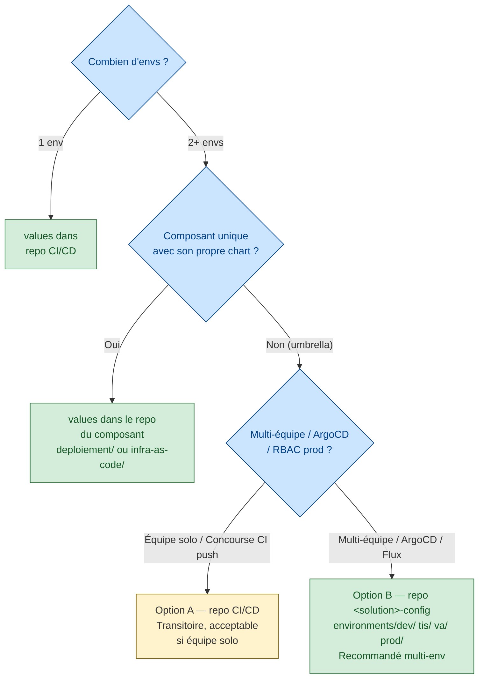

# Architecture du placement des values Helm

> Sources industrielles :
> - [Helm chart best practices](https://helm.sh/docs/chart_best_practices/)
> - [12-factor app §III Config](https://12factor.net/config)
> - [OpenGitOps principles](https://opengitops.dev/)
> - ArgoCD best practices, Codefresh "GitOps environment repository", Weaveworks "Separation of config and code"

> Pour les patterns observés en interne dans une grande DSI, voir le repo de souveraineté correspondant (chaque organisation a ses propres équipes plateforme et conventions ArgoCD/Concourse).

---

## Principes directeurs (non négociables)

**Séparer code / chart / values — 3 cycles de vie distincts** (12-factor §III Config).
- Le **chart** (structure technique) change rarement.
- Le **code** (image applicative) est tagué à chaque release.
- Les **values par env** changent à chaque promotion, rollback, incident, rotation de secret.

Les mélanger force à rebuilder/retagger pour un simple ajustement de replicas ou d'URL. C'est l'anti-pattern principal.

**Blast radius & RBAC**. Le repo des values **prod** doit être le plus restreint : protection de branche, reviewers SRE, signature. Si les values vivent dans le repo CI/CD, toute personne qui touche aux pipelines a de facto accès à la config prod — mauvaise séparation des devoirs.

**Source of truth unique par env**. `un cluster = un chemin Git = un état`. Facilite l'audit (`git log` pointé sur un seul endroit) et la migration vers GitOps (ArgoCD/Flux) plus tard.

---

## 4 options — quand les utiliser

| Option | Quand c'est pertinent | À éviter quand… |
|---|---|---|
| **Repo CI/CD** (values + pipelines ensemble) | Équipe solo, un seul env, pipeline simple, MVP | Multi-env + GitOps visé. Couple config et orchestration. |
| **Repo dédié `config`** / `deploy` / `env` | **Recommandé** multi-env + ArgoCD/Flux/Fleet. RBAC fin, auditabilité. Prépare migration GitOps. | Mono-env, un seul service, équipe de 1. |
| **Repo du composant applicatif** | Microservice autonome avec son propre chart + values minimales | Umbrella multi-composant (aucun composant n'est propriétaire des values umbrella). |
| **Repo du chart Helm** (values embarqués) | **Uniquement les defaults** (`values.yaml` racine du chart) | Stocker les values d'env dans le chart — couplage fort, anti-GitOps, le chart OCI devient non-réutilisable. |

---

## Arbre de décision concret

---

## Anti-patterns à éviter

- **Values d'env dans le repo du chart** — couple chart ↔ env, chart OCI non-réutilisable par d'autres projets. Seuls les **defaults génériques** vont dans le chart.
- **Branches par env** (`dev`, `prod`) pour les values — pattern déprécié depuis 2020 (cf. Codefresh/Weaveworks GitOps guides). Préférer **dossiers par env** sur `master`.
- **Un repo par env** — cauchemar de sync, PR cross-repo impossibles.
- **Overlays Kustomize** (`overlays/<env>/values.yaml`) quand on reste en pur Helm — seulement utile si on mixe Helm+Kustomize.

---

## Versionnement des values

- **Chart** : SemVer strict (`Chart.yaml` : `version:` = chart, `appVersion:` = image applicative).
- **Values** : **pas de tag SemVer**. Versionnement par commit Git + référence explicite dans le déploiement (`targetRevision: <SHA>` ArgoCD, ou SHA figé dans le pipeline Concourse `version-rc`).
- **Promotion d'env** : PR de `tis/values.yaml` → `prod/values.yaml` (pattern "PR-based promotion" — ArgoCD Autopilot, Kargo).

---

## Signaux pour migrer vers un repo config dédié

Rester dans le repo CI/CD est acceptable **tant que** :
1. Équipe restreinte (1-2 personnes)
2. Aucun besoin de RBAC prod différencié
3. Pas d'ArgoCD/Flux à l'horizon
4. 1 seule solution numérique concernée

Déclencheurs de migration :
- Adoption d'ArgoCD ou Flux — le repo config séparé devient quasi-obligatoire.
- L'équipe grossit et la config prod doit être verrouillée à un sous-groupe (RBAC/PR).
- Ajout d'une 2ème solution numérique qui partage des values communes.
- Incident post-mortem où la confusion « qui a pushé quoi sur les values prod » ressort.
