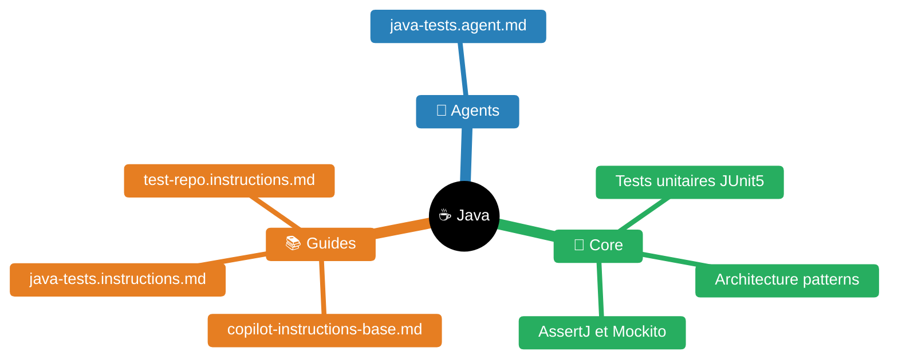

# Java / Maven / Spring Boot — Conventions et tests

> **Expérience projet** : voir `experience/java.md` pour les leçons spécifiques au workspace <solution-numerique> (Maven mirrors, fat build image, audit de tests legacy).


| Fichier | Description |
|---------|-------------|
| [README.md](README.md) | Point d'entrée Java |
| [guides/copilot-instructions-base.md](guides/copilot-instructions-base.md) | Instructions Copilot base |
| [guides/java-tests.instructions.md](guides/java-tests.instructions.md) | Instructions tests Java |
| [guides/test-repo.instructions.md](guides/test-repo.instructions.md) | Instructions repo de tests |
| [agents/java-tests.agent.md](agents/java-tests.agent.md) | Agent tests Java |

## Stack technique

- **Java 17+**, Maven, Spring Boot 3.x+
- **JPA** (Hibernate), **MapStruct**, **Lombok**
- **Tests** : JUnit 5, AssertJ, Mockito, JaCoCo, Cucumber (BDD)
- **Qualité** : SonarQube, OWASP Dependency Check

## Conventions de code

- Code en **anglais**, commentaires en **français**
- camelCase (Java), kebab-case (endpoints REST)
- Injection par **constructeur** (pas @Autowired sur champs)
- `@DisplayName` en français sur toutes les classes/méthodes de test
- Variable SUT nommée `sut` (pas `service`, `controller`, etc.)

## Conventions de test

### Structure obligatoire

```java
@Tag("unit")  // ou @Tag("integration")
@DisplayName("MonService — tests unitaires")
class MonServiceTest {

    @Nested
    @DisplayName("maMethode()")
    class MaMethode {

        @Test
        @DisplayName("retourne le résultat attendu quand l'entrée est valide")
        void retourne_resultat_quand_entree_valide() {
            // Arrange
            var sut = new MonService(mockDep);

            // Act
            var result = sut.maMethode(input);

            // Assert
            assertThat(result).isNotNull();
            assertThat(result.getChamp()).isEqualTo("attendu");
        }
    }
}
```

### Règles

- Pattern **AAA** (Arrange-Act-Assert) systématique
- **Minimum 2 assertions** par test
- **AssertJ** en priorité (pas JUnit assertEquals)
- Soft assertions pour les vérifications multiples
- `@ParameterizedTest` pour les variations d'entrée
- `@Nested` par méthode/contexte pour organiser
- Pas de logique dans les tests (pas de if/for/try-catch)

## Couverture JaCoCo

```bash
mvn verify -Pjacoco             # Générer le rapport
# Rapport : target/site/jacoco/index.html
```

Métriques : lignes, branches, instructions, complexité cyclomatique.

## Audit qualité — 5 axes

1. **Conventions** : @DisplayName, @Tag, @Nested, nommage, AAA
2. **Couverture** : lignes/branches manquantes, classes non testées
3. **Assertions** : qualité et nombre (min 2), soft assertions
4. **Cohérence données** : builders de test cohérents avec les verify()
5. **Cas limites** : null, vide, exceptions, edge cases

## Test smells à éviter

| Smell | Symptôme | Fix |
|-------|----------|-----|
| Assertion Roulette | Un seul assert sans message | Ajouter assertions + messages |
| Eager Test | Un test vérifie trop de choses | Découper en tests focalisés |
| Mystery Guest | Données magiques sans contexte | Utiliser des builders explicites |
| Sensitive Equality | toString() dans les assertions | Comparer champ par champ |
| Test Redundancy | Tests dupliqués | Fusionner ou @ParameterizedTest |

## Harness tools et pratiques intégrées

| Capability | Intégration | Description |
|------------|-------------|-------------|
| Test QA | `agents/java-tests.agent.md` + system prompt | Conventions JUnit 5, iteration JaCoCo |
| SonarQube | tools `sonarqube_quality_gate` / `sonarqube_issues` | Quality gate + boucle itérative (system prompt) |
| Security | tool `sonarqube_issues` (type=VULNERABILITY) | Couvert par le filtre SonarQube |
| Couverture | tool `jacoco_coverage` | Parse JaCoCo XML, top classes à tester |

## Guides détaillés

- `guides/copilot-instructions-base.md` — Conventions Java/Maven/Spring Boot complètes
- `guides/java-tests.instructions.md` — Conventions détaillées de fichiers de test
- `guides/test-audit-lessons.md` — Catalogue de problèmes de test et solutions
- `guides/test-repo.instructions.md` — Guide QA tests Java

---

## Skills connexes

- [`../quarkus/README.md`](../quarkus/README.md) — Framework Java cloud-native
- [`../spring/README.md`](../spring/README.md) — Framework Spring Boot/Framework
- `../oracle/README.md` — JDBC Oracle, GoldenGate
- [`../mise/README.md`](../mise/README.md) — Gestion versions JDK/Maven via mise
