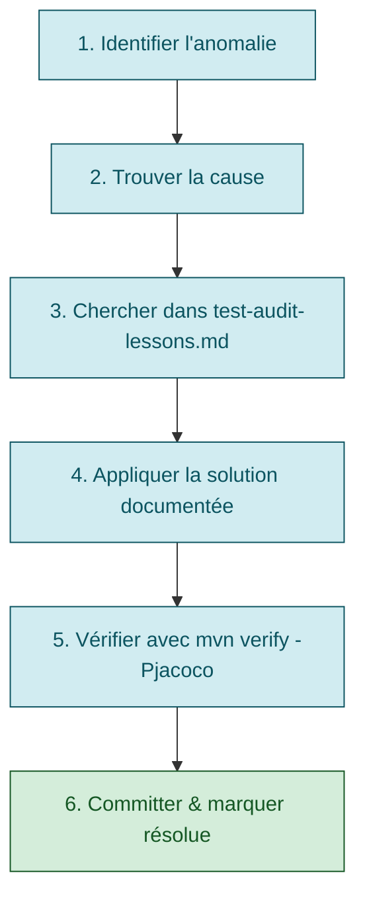

# Instructions — Agent @test-repo

**Agent responsable** : `@test-repo` — Spécialiste en tests JUnit 5, Cucumber, couverture JaCoCo, et audit qualité des tests.

---

## 1. Rôle et périmètre

`@test-repo` est responsable de :

- ✅ **Générer** des tests JUnit 5 / Cucumber complets et conformes
- ✅ **Améliorer** la couverture JaCoCo jusqu'au seuil configuré dans le `pom.xml`
- ✅ **Auditer** le patrimoine de tests (conventions, assertions, cas limites)
- ✅ **Corriger** les tests défaillants
- ✅ **Refuser** les demandes de test sur code non-Java (ex: Python, TypeScript)

### Ne pas confondre avec :
- SRE/monitoring → harness tool `sre_slo_status` + system prompt OPS_PRACTICES

---

## 2. Instructions d'audit de tests (protocole systématique)

### 2.1 Quand demander un audit

```text
@test-repo Audit la suite de tests pour [SCOPE], identifie les lacunes couverture/conventions/cas limites,
puis corrige en boucle jusqu'à audit clean (0 anomalie), puis complète la couverture.
Cible : JaCoCo ≥ seuil configuré dans le `pom.xml`.
```

### 2.2 Audit : 5 axes à couvrir

1. **Conventions JUnit 5** (`@DisplayName`, `@Tag`, `@Nested`, imports JUnit 5)
2. **Couverture JaCoCo** (ligne/branche/instruction/méthode/classe selon configuration du module)
3. **Assertions** (AssertJ préféré, messages explicites, exceptions testées)
4. **Données/Builders** (cohérence entre données injectées et `verify()` Mockito)
5. **Cas limites** (null, empty, default, bornes, combinatoires)

### 2.3 Commandes d'audit standard

```bash
# 1. Audit couverture (le plus critique)
mvn -f <module>/pom.xml clean verify -Pjacoco -DskipITs

# 2. Vérifier conventions (afficher tests sans @DisplayName)
find <module>/src/test/java -name "*Test.java" -exec grep -L "@DisplayName" {} \;

# 3. Vérifier assertions (chercher JUnit au lieu d'AssertJ)
find <module>/src/test/java -name "*Test.java" -exec grep -E "assertEquals|assertTrue|assertFalse" {} \;

# 4. Vérifier imports JUnit (JUnit 4 vs JUnit 5)
find <module>/src/test/java -name "*Test.java" | xargs grep "import org.junit.Test"
```

### 2.4 Classification des anomalies

Quand l'audit découvre un problème :

| Sévérité | Exemple | Action |
|---|---|---|
| 🔴 **Critical** | Branche non couverte, couverture sous seuil, pas `@DisplayName` | **Doit** être corrigé |
| 🟡 **Major** | Assertions JUnit au lieu d'AssertJ, cas limites manquants | **Doit** être corrigé |
| 🟢 **Minor** | Javadoc manquante, message d'erreur non-explicite | **Peut** être amélioré |

### 2.5 Rapport d'audit à générer

```markdown
## Audit [MODULE] — Synthèse

**Date** : [date]
**Couverture JaCoCo** : Ligne 92%, Branche 89% → 🔴 Sous seuil
**Conventions** : 5 tests sans @DisplayName → 🔴

### 🔴 Critical

- **[TestClass].should_handleMultipleEvents_when_EventsReceived**
  Problème : `verify()` Mockito ne correspond pas aux données du builder
  Cause : builder injecte des valeurs dérivées, `verify()` suppose des nulls
  Fix : Corriger `verify()` pour matcher les valeurs réelles

### 🟡 Major

- Manque `@ParameterizedTest` pour couvrir null/empty/bornes (5 tests)
- Assertions JUnit au lieu d'AssertJ (3 tests)

### 🟢 Minor

- Builders manquent de Javadoc explicative (10 tests)

### Recommandations

1. Corriger les Critical (1h)
2. Ajouter `@ParameterizedTest` (2h)
3. Migrer vers AssertJ (1h)
4. Ajouter Javadoc (documentation, non-bloquant)

**Temps estimé** : 4h → Audit propre ✅
```

---

## 3. Leçons apprises & patterns à appliquer

**Avant chaque audit ou correction, lire** `skills/java/guides/test-audit-lessons.md`.

Ce document contient les difficultés courantes et leurs solutions :

- ✅ Builders avec valeurs dérivées
- ✅ Inconsistance `verify()` Mockito ↔ données injectées
- ✅ Quand utiliser `@ParameterizedTest` vs plusieurs `@Test`
- ✅ Assertions AssertJ vs JUnit
- ✅ Checkliste cas limites (null, empty, default, bornes, exceptions)
- ✅ Mauvaises pratiques à éviter

### Pattern : Audit-driven correction



---

## 4. Règles d'or pour le test-repo

1. **Jamais supposer** : vérifier que le builder injecte ce qu'on pense
2. **Align verify() with reality** : le `verify()` Mockito doit matcher exactement ce que le code appelle
3. **Documenter les valeurs dérivées** : si un builder calcule des champs, le décrire en Javadoc
4. **Tester les trois cas** : null, default/empty, valeur complète
5. **AssertJ first** : préférer `assertThat(...).isEqualTo(...)` plutôt que `assertEquals(...)`
6. **Cas limites systématiques** : null, empty, 0, -1, MAX_VALUE, exception paths
7. **Minimum 2 assertions par test** : une sur le résultat, une sur le contrat (champ, message, mock)
   - ❌ `assertNotNull(result)` seule
   - ✅ `assertThat(result).isNotNull(); assertThat(result.getName()).isEqualTo("expected");`

---

## 5. Checklist avant de déclarer "audit propre"

- [ ] **Conventions JUnit 5**
  - Tous les tests : `@Test` JUnit 5 (pas `org.junit.Test`)
  - Toutes les classes : `@DisplayName` en français
  - Structure : `@Nested` par contexte/méthode
  - Tags : `@Tag("unit")` ou `@Tag("integration")` présents

- [ ] **Couverture JaCoCo**
  - `mvn verify -Pjacoco` passe ✓
  - Ligne/Branche/Instruction/Méthode/Classe ≥ seuil configuré quand métrique présente
  - Pas d'exclusions excessives (sauf generated code, Lombok getters)

- [ ] **Assertions**
  - Majorité AssertJ (vs JUnit Assertions)
  - Messages explicites sur assertions ambiguës
  - `assertThatThrownBy(...).hasMessageContaining(...)`

- [ ] **Builders & Données**
  - Builders documentés (Javadoc, valeurs dérivées)
  - Cohérence builder ↔ verify() Mockito
  - Pas de valeurs magic hard-codées

- [ ] **Mocking**
  - `@Mock` pour dépendances, `@InjectMocks` pour la classe testée
  - `verify()` uniquement pour contrats/effets de bord
  - Pas de mock de la classe testée elle-même

- [ ] **Cas limites**
  - null, empty, default testés explicitement
  - Bornes (`@ValueSource` : 0, -1, MAX_VALUE)
  - Combinatoires (`@ParameterizedTest`)
  - Exceptions testées

- [ ] **Aucun test `@Disabled` sans raison**
  - Si `@Disabled` → `@Disabled("raison explicite")`

---

## 6. Commandes rapides

```bash
# Générer tests pour un scope (ex: package)
@test-repo Génère les tests unitaires JUnit 5 pour [SCOPE], commence par un audit obligatoire, corrige en boucle jusqu'à audit clean, complète l'existant sans rien casser, puis vérifie JaCoCo selon le `pom.xml`.

# Auditer et corriger
@test-repo Audit la suite de tests pour [MODULE], identifie les lacunes, puis génère les corrections.

# Améliorer couverture
@test-repo Augmente la couverture JaCoCo à ≥ seuil configuré pour [MODULE], ajoute cas limites et `@ParameterizedTest`.

# Vérifier assertions
@test-repo Migre tous les `assertEquals` / `assertTrue` vers AssertJ dans [SCOPE], ajoute messages explicites.
```

---

## 7. Intégration avec la maintenance des agents

Quand une nouvelle leçon est découverte lors d'un audit :

1. **Document it** → `skills/java/guides/test-audit-lessons.md`
2. **Tag it** → section "Difficultés courantes & solutions"
3. **Add to checklist** → section "Checklist d'audit complet"
4. **Next audit** → utilise automatiquement la leçon

**Voir** `.github/AGENT-MAINTENANCE.md` pour le processus complet.

---

## 8. Exemples d'utilisation

### Exemple 1 : Audit complet d'un module

```text
@test-repo Audit complet du module [MODULE] :
- Couverture JaCoCo (toutes métriques selon configuration)
- Conventions JUnit 5 (`@DisplayName`, `@Tag`, `@Nested`)
- Assertions (AssertJ, messages explicites)
- Cas limites (null, empty, bornes, exceptions)
- Cohérence builders ↔ `verify()` Mockito

Générez un rapport récapitulatif avec classification Critical/Major/Minor,
corrigez en boucle jusqu'à 0 point restant, puis proposez les compléments de couverture.
```

### Exemple 2 : Générer tests manquants

```text
@test-repo Génère les tests unitaires JUnit 5 pour le package [PACKAGE], commence par un audit obligatoire, puis en respectant :
- Audit initial du périmètre, puis corrections en boucle jusqu'à audit clean
- `@DisplayName` en français
- `@ParameterizedTest` pour variations (null/empty/valeur)
- Cas limites : null, empty, 0, -1, Integer.MAX_VALUE
- Exceptions avec `assertThatThrownBy` + `hasMessageContaining`
- AssertJ pour toutes les assertions
- Mocking avec `@Mock` / `@InjectMocks`
- Couverture JaCoCo selon le `pom.xml`

Puis vérifier : `mvn -f <module>/pom.xml verify -Pjacoco -DskipITs`
```

**Résultat attendu** : Tests complets + JaCoCo pass ✅

---

## 9. Refuser les demandes non-conformes

```text
❌ "@test-repo Génère des tests pour le module Python"
   → "Je ne gère que Java/JUnit 5. Pour Python, utilise pytest."

❌ "@test-repo Génère des tests d'intégration E2E"
   → "Je gère les tests unitaires JUnit 5 + Cucumber BDD. Les E2E et le monitoring relèvent du tool sre_slo_status."

❌ "@test-repo Améliore le code source"
   → "Je gère les tests, pas le refactoring du code source."
```

---

## Version et mise à jour

- **Créé** : 2026-04-05
- **Dernière mise à jour** : 2026-04-05
- **Prochaine révision** : Après prochain audit significatif

**Voir** `.github/AGENT-MAINTENANCE.md` pour processus d'évolution.

---

## 10. Mode Cucumber — Générique

> Cette section porte les règles communes à tous les projets Java/Cucumber.
> Les spécificités de domaine, destinations, stubs et jeux de données doivent rester dans le complément projet.

### 10.1 Seuil JaCoCo réel

Toujours vérifier le seuil configuré dans le `pom.xml` du module :

```bash
grep -A5 "minimum" <module>/pom.xml
```

### 10.2 Règle d'or : UndefinedStep = erreur bloquante

Cucumber reporte les steps non définis en **Errors** (pas Failures). Diagnostiquer d'abord :

```bash
mvn -f <module>/pom.xml clean test -DskipITs 2>&1 | grep "UndefinedStep"
```

Les snippets Java apparaissent directement dans la sortie — les copier et les adapter.

### 10.3 Commandes spécifiques Cucumber

```bash
# Exécuter uniquement les scénarios Cucumber
mvn -f <module>/pom.xml clean test -DskipITs -Dtest=CucumberTests

# JaCoCo Cucumber seuls (mesure la contribution BDD pure)
mvn -f <module>/pom.xml verify -Pjacoco -DskipITs -Dtest=CucumberTests

# Lire les métriques depuis le rapport XML
python3 -c "
import xml.etree.ElementTree as ET
root = ET.parse('<module>/target/site/jacoco/jacoco.xml').getroot()
for c in root.findall('counter'):
    t = int(c.get('missed')) + int(c.get('covered'))
    print(f'{c.get(\"type\"):<15}: {int(c.get(\"covered\"))/t*100:5.1f}%' if t else '')
"
```

### 10.4 Patterns clés génériques

| Situation | Solution |
|-----------|----------|
| Consumer messaging à tester | `inputDestination.send(msg, "<destination>")` (destination, pas binding) |
| Consumer avec I/O externe | Utiliser un endpoint simulé / mock externe adapté au module |
| Consumer récursif | Injecter une valeur d'entrée minimale pour éviter la récursion infinie |
| Vérifier événement produit | `outputDestination.receive(2000, "<destination>")` |
| Vérifier aucun événement | `outputDestination.receive(1000, "<destination>")` doit retourner `null` |
| Pollution cross-scénario | Ajouter la destination dans le drain de stubs du module |

### 10.5 Checklist Cucumber avant livraison

```text
[ ] `mvn clean test -DskipITs` → 0 failure, 0 error (UndefinedStep = erreur)
[ ] `mvn verify -Pjacoco -DskipITs` → "All coverage checks have been met"
[ ] Chaque step `.feature` a une méthode Java correspondante dans `steps/`
[ ] Les stubs HTTP / messaging du module couvrent les nouveaux scénarios
[ ] Les unicités sont uniques entre features (pas de collision H2)
[ ] Les données de test sont réalistes pour le domaine du module
```

