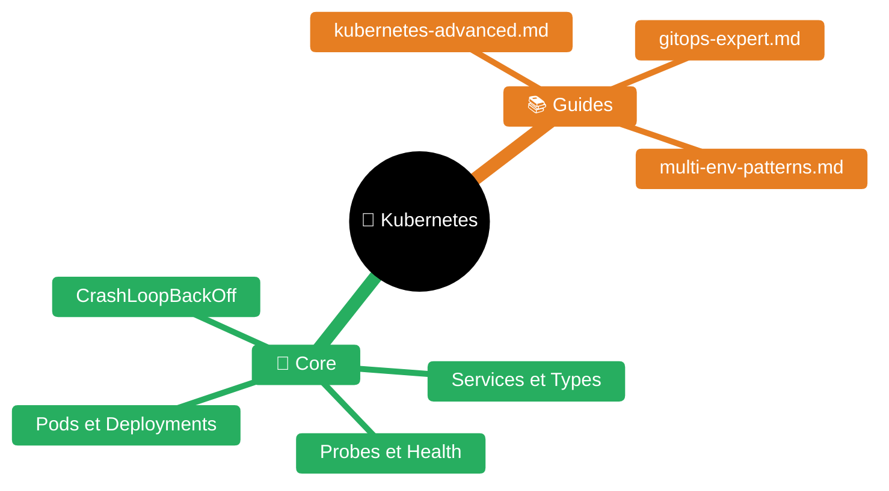
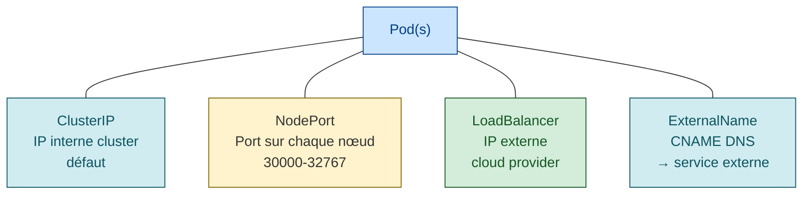
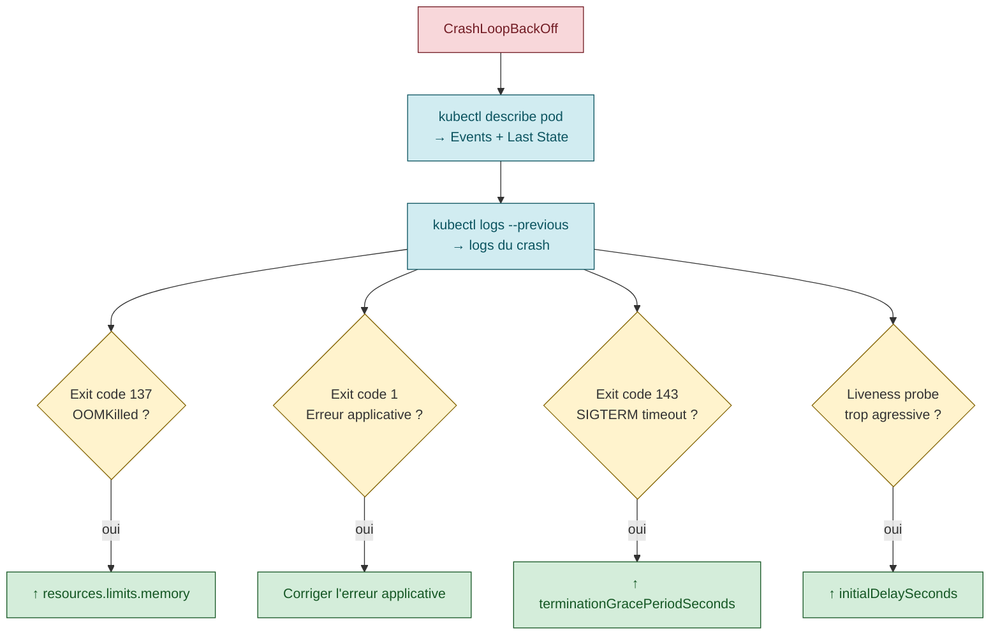

# Kubernetes

> **Expérience projet** : voir `experience/kubernetes.md` pour les leçons spécifiques au workspace <solution-numerique>.

Expertise Kubernetes pour le diagnostic, l'investigation et le monitoring de clusters.


| Fichier | Description |
|---------|-------------|
| [README.md](README.md) | Point d'entrée Kubernetes |
| [guides/kubernetes-advanced.md](guides/kubernetes-advanced.md) | Kubernetes avancé |
| [guides/gitops-expert.md](guides/gitops-expert.md) | GitOps expert |
| [guides/multi-env-patterns.md](guides/multi-env-patterns.md) | Patterns multi-environnement |
| [gateway-api.md](gateway-api.md) | Gateway API — successeur d'Ingress (routage L4/L7) |

## Architecture conceptuelle

### Objets fondamentaux

- **Pod** : plus petite unite deployable. Contient un ou plusieurs conteneurs.
- **Deployment** : gere un ReplicaSet, rolling updates, rollbacks.
- **StatefulSet** : pods avec identite stable et stockage persistant.
- **DaemonSet** : un pod par noeud (monitoring, logging, CNI).
- **Service** : abstraction reseau stable devant des pods.
  - ClusterIP (defaut), NodePort, LoadBalancer, ExternalName.


- **Ingress** : routage HTTP/HTTPS externe vers les Services.
- **ConfigMap / Secret** : configuration et donnees sensibles injectees dans les pods.
- **PersistentVolume (PV) / PersistentVolumeClaim (PVC)** : stockage persistant.
- **Job / CronJob** : taches ponctuelles ou planifiees.
- **HorizontalPodAutoscaler (HPA)** : autoscaling sur CPU/memoire/metriques custom.
- **NetworkPolicy** : regles de filtrage reseau entre pods.

### Namespaces

Isolation logique. Bonnes pratiques :
- `kube-system` : composants systeme (coredns, kube-proxy, CNI).
- `monitoring` : Prometheus, Grafana, Dynatrace OneAgent.
- Un namespace par application ou par equipe.
- ResourceQuota et LimitRange par namespace en production.

## Diagnostic courant

### Pod en CrashLoopBackOff

1. `kubectl describe pod <name>` : lire la section Events et le Last State.
2. `kubectl logs <pod> --previous` : logs du conteneur qui a crashe.
3. Causes frequentes :
   - OOMKilled : le conteneur depasse sa limite memoire. Augmenter `resources.limits.memory`.
   - Exit code 1 : erreur applicative. Lire les logs.
   - Exit code 137 : SIGKILL (OOM ou preemption). Verifier les metriques memoire.
   - Exit code 143 : SIGTERM gracieux mais le process n'a pas fini dans le `terminationGracePeriodSeconds`.
4. Liveness probe trop agressive : le pod redemarrage avant d'etre pret. Augmenter `initialDelaySeconds`.



### Pod en Pending

1. `kubectl describe pod <name>` : section Events.
2. Causes :
   - Insufficient CPU/memory : le scheduler ne trouve pas de noeud. Verifier `kubectl describe nodes` (Allocatable vs Allocated).
   - PVC en Pending : le StorageClass ne provisionne pas. Verifier `kubectl get pvc` et `kubectl get pv`.
   - Taints/tolerations : le noeud a un taint que le pod ne tolere pas.
   - NodeSelector/affinity : aucun noeud ne matche.

### Pod en ImagePullBackOff

1. Image introuvable ou tag inexistant.
2. Credentials manquants : `imagePullSecrets` absent ou expire.
3. Registry inaccessible (reseau, proxy, DNS).

### Service ne repond pas

1. Verifier les endpoints : `kubectl get endpoints <service>`.
   - Vide = aucun pod ne matche le selector du Service.
2. Verifier le selector du Service vs les labels des pods.
3. Tester la connectivite depuis un pod : `kubectl exec -it <pod> -- curl <service>:<port>`.
4. Pour NodePort/LoadBalancer : verifier le firewall et les security groups.

## Patterns de deploiement

### Rolling Update (defaut)

```yaml
spec:
  strategy:
    type: RollingUpdate
    rollingUpdate:
      maxSurge: 25%
      maxUnavailable: 25%
```

- Deploie progressivement les nouveaux pods avant de supprimer les anciens.
- `maxSurge` : combien de pods en plus pendant la transition.
- `maxUnavailable` : combien de pods indisponibles pendant la transition.

### Blue-Green

- Deux Deployments (blue et green) avec un Service qui pointe sur un seul.
- Switcher le selector du Service apres validation.
- Rollback instantane : re-switcher le selector.

### Canary

- Deployer une petite portion de trafic sur la nouvelle version.
- Avec Ingress nginx : annotation `canary-weight`.
- Avec Istio/Linkerd : VirtualService avec weight-based routing.

## Probes

```yaml
livenessProbe:
  httpGet:
    path: /health/live
    port: 8080
  initialDelaySeconds: 30
  periodSeconds: 10
  failureThreshold: 3

readinessProbe:
  httpGet:
    path: /health/ready
    port: 8080
  initialDelaySeconds: 5
  periodSeconds: 5

startupProbe:
  httpGet:
    path: /health/started
    port: 8080
  failureThreshold: 30
  periodSeconds: 10
```

- **Liveness** : le conteneur est-il vivant ? Echec = restart.
- **Readiness** : le conteneur accepte-t-il du trafic ? Echec = retire des endpoints.
- **Startup** : pour les demarrages lents. Desactive liveness/readiness pendant le startup.

## Gestion des ressources

```yaml
resources:
  requests:
    cpu: 250m
    memory: 256Mi
  limits:
    cpu: "1"
    memory: 512Mi
```

- `requests` : minimum garanti. Utilise par le scheduler.
- `limits` : maximum. Depassement memoire = OOMKilled. Depassement CPU = throttle.
- **Bonne pratique** : toujours definir les deux. Ratio limits/requests de 2:1 a 4:1.

## Observabilite

### Metriques

- **Metrics Server** : `kubectl top pods`, `kubectl top nodes`.
- **Prometheus** : scrape `/metrics` via ServiceMonitor.
- **Dynatrace OneAgent** : injection automatique dans les pods (operator).
- **HPA** : autoscaling sur `cpu`, `memory`, ou metriques custom via Prometheus Adapter.

### Logs

- `kubectl logs <pod>` : stdout/stderr du conteneur.
- `kubectl logs <pod> -c <container>` : conteneur specifique dans un pod multi-conteneurs.
- `kubectl logs <pod> --previous` : logs du conteneur precedent (apres crash).
- `kubectl logs -l app=myapp` : logs de tous les pods avec le label.
- **Centralisation** : Loki + Promtail, ELK (Filebeat), Dynatrace Log Monitoring.

### Events

- `kubectl get events --sort-by=.lastTimestamp` : tous les evenements du namespace.
- `kubectl get events --field-selector involvedObject.name=<pod>` : evenements d'un pod.
- Les events expirent apres 1h (defaut). Pour du long-terme, configurer un event exporter.

## Kustomize

Structure standard pour les overlays multi-environnement :

```
deployments/
  base/
    deployment.yaml
    service.yaml
    kustomization.yaml
  overlays/
    dev/
      kustomization.yaml      # patches dev
    preprod/
      kustomization.yaml
    prod/
      kustomization.yaml
```

- `kustomize build overlays/dev | kubectl apply -f -`
- Patches : strategic merge, JSON patches, ou `patchesStrategicMerge`.
- Remplacements : `images`, `namePrefix`, `nameSuffix`, `commonLabels`.

## Helm

- `helm install <release> <chart>` : installer.
- `helm upgrade <release> <chart> -f values-prod.yaml` : mettre a jour.
- `helm rollback <release> <revision>` : revenir en arriere.
- `helm list` : releases installees.
- `helm template` : generer les manifests sans installer (utile pour debug).
- Toujours utiliser `--atomic` en CI pour rollback automatique en cas d'echec.

## Securite

### RBAC

- **Role/ClusterRole** : definit les permissions (verbs sur resources).
- **RoleBinding/ClusterRoleBinding** : associe un Role a un User/Group/ServiceAccount.
- Principe du moindre privilege : un ServiceAccount par application, pas de `cluster-admin`.

### Pod Security

- `securityContext.runAsNonRoot: true` : interdire root.
- `securityContext.readOnlyRootFilesystem: true` : filesystem en lecture seule.
- `securityContext.allowPrivilegeEscalation: false` : pas d'escalade.
- Pod Security Standards (PSS) : Privileged, Baseline, Restricted.

### Network Policies

```yaml
apiVersion: networking.k8s.io/v1
kind: NetworkPolicy
metadata:
  name: deny-all
spec:
  podSelector: {}
  policyTypes:
    - Ingress
    - Egress
```

- Deny-all par defaut, puis ouvrir ce qui est necessaire.
- Necessite un CNI compatible (Calico, Cilium, Weave).

## Troubleshooting avance

### DNS

- Tester depuis un pod : `kubectl exec -it <pod> -- nslookup <service>`.
- CoreDNS logs : `kubectl logs -n kube-system -l k8s-app=kube-dns`.
- Service FQDN : `<service>.<namespace>.svc.cluster.local`.

### Stockage

- PVC en Pending : verifier StorageClass, provisioner, quotas.
- Pod en ContainerCreating avec volume : `kubectl describe pod` pour les events de montage.
- Multi-attach error : le PV est deja monte sur un autre noeud (ReadWriteOnce).

### Performance

- CPU throttling : `kubectl top pod` vs limits. Si `throttled_time` eleve, augmenter les limits CPU.
- OOMKilled frequent : augmenter limits memory ou investiguer les fuites memoire.
- Slow scheduling : verifier les ResourceQuotas et le nombre de pods pending.

## GitOps — changement de paradigme

GitOps est un modèle opérationnel où **Git est la seule source de vérité** pour l'état désiré de l'infrastructure et des applications.

### Les 4 principes OpenGitOps

1. **Déclaratif** : l'état désiré est exprimé déclarativement (YAML, pas scripts)
2. **Versionné et immuable** : chaque changement a un historique permanent (git log = audit)
3. **Tiré automatiquement** : un agent dans le cluster tire depuis Git (pas de push externe)
4. **Réconcilié en continu** : boucle de réconciliation toutes les 3-5min, auto-heal du drift

### Pourquoi c'est fondamentalement différent du CI/CD

| | CI/CD traditionnel (push) | GitOps (pull) |
|---|---|---|
| **Direction** | CI pousse vers le cluster | Agent dans le cluster tire depuis Git |
| **Credentials** | CI a les clés admin de tous les clusters | Agent a juste l'accès lecture Git |
| **Drift** | Aucune détection | Réconciliation continue |
| **Rollback** | Relancer un vieux pipeline (si possible) | `git revert` + auto-réconcile |
| **Audit** | Logs CI (éphémères) | Historique Git (permanent) |

### ArgoCD — outil de référence

```yaml
apiVersion: argoproj.io/v1alpha1
kind: Application
metadata:
  name: myapp
  namespace: argocd
spec:
  source:
    repoURL: https://github.com/org/config.git
    path: overlays/prod
    targetRevision: main
  destination:
    server: https://kubernetes.default.svc
    namespace: myapp
  syncPolicy:
    automated:
      prune: true       # supprime les ressources absentes de Git
      selfHeal: true    # corrige le drift automatiquement
    syncOptions:
      - CreateNamespace=true
```

### Rollback en GitOps

```bash
# Méthode 1 : git revert (recommandé, traçable)
git revert HEAD
git push   # ArgoCD réconcilie automatiquement

# Méthode 2 : ArgoCD UI/CLI
argocd app history myapp
argocd app rollback myapp REVISION-ID

# Méthode 3 : Argo Rollouts (canary/blue-green automatique)
# Rollback automatique si les métriques Prometheus dépassent les seuils
```

### Smoke tests post-déploiement

```yaml
# ArgoCD PostSync hook : Job exécuté après le sync
apiVersion: batch/v1
kind: Job
metadata:
  name: smoke-test
  annotations:
    argocd.argoproj.io/hook: PostSync
    argocd.argoproj.io/hook-delete-policy: HookSucceeded
spec:
  template:
    spec:
      containers:
        - name: smoke
          image: curlimages/curl
          command: ["sh", "-c", "curl -sf http://myapp:8080/health || exit 1"]
      restartPolicy: Never
  backoffLimit: 3
```

### Référence complète

- `guides/gitops-expert.md` — 1813 lignes : paradigme GitOps, 4 principes OpenGitOps, architecture (mono-repo vs multi-repo, promotion d'environnements, app-of-apps), ArgoCD en profondeur (sync waves, hooks, RBAC, SSO, notifications, image updater), procédures de rollback (5 méthodes), testing (pre-deploy validation, PostSync smoke tests, Argo Rollouts canary/blue-green avec analyse Prometheus), applications métier (feature flags, migrations DB, secrets, multi-tenant SaaS, audit compliance), excellence opérationnelle (drift detection, disaster recovery, multi-cluster), anti-patterns
- `guides/kubernetes-advanced.md` — HPA/VPA, Pod Security Standards, PDB, topology spread, debug containers, GitOps ArgoCD

## Integration avec le harness

L'agent dispose de 3 outils Kubernetes read-only :
- `kubectl_get(kind, namespace?, selector?)` : lister des ressources.
- `kubectl_describe(kind, name, namespace?)` : detail d'une ressource.
- `kubectl_logs(pod, container?, namespace?, tail?, since?, previous?)` : logs.

Contraintes de securite :
- Le contexte est **verrouille** dans le profil (pas de switch accidentel).
- Les namespaces sont **restreints** a une liste autorisee.
- Les kinds sont **filtres** : seules les ressources read-only sont permises.
- Aucune commande mutante (apply, delete, create, scale, exec) n'est disponible.

---

## Skills connexes

- `../gitops/README.md` — GitOps natif Kubernetes (Flux, ArgoCD, reconciliation)
- [`../sre/README.md`](../sre/README.md) — Pratiques SRE applicables aux workloads K8s
- [`../dynatrace/README.md`](../dynatrace/README.md) — Monitoring distribué K8s
- [`../tanzu/README.md`](../tanzu/README.md) — Plateforme Cloud Foundry (alternative K8s)
