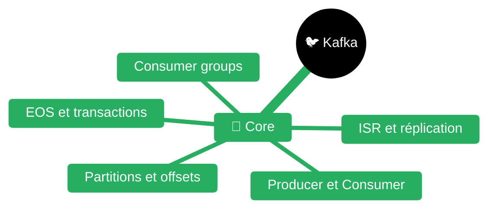
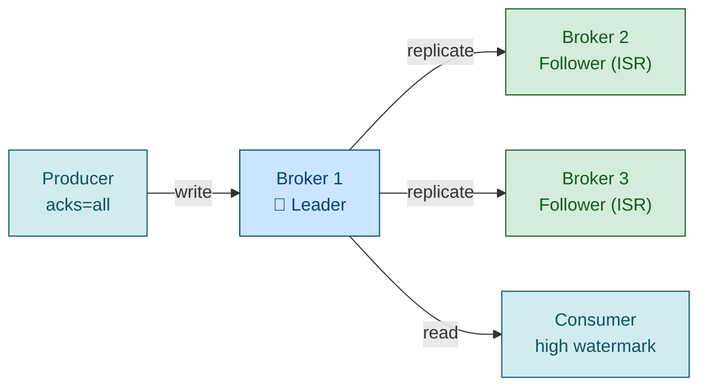
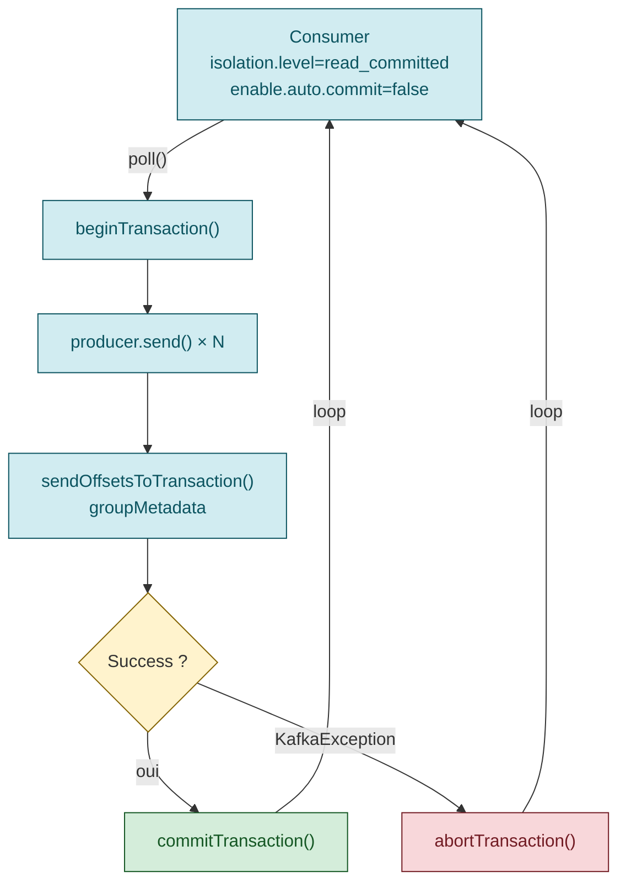

# Apache Kafka

> **Expérience projet** : voir `experience/kafka.md` pour les leçons spécifiques au workspace <solution-numerique> (timeouts dev, purge CG, log suppression).

> **Sources principales** :
> - [Apache Kafka documentation](https://kafka.apache.org/documentation/)
> - [Kafka producer configs](https://kafka.apache.org/documentation/#producerconfigs)
> - [Kafka consumer configs](https://kafka.apache.org/documentation/#consumerconfigs)
> - [Kafka replication](https://kafka.apache.org/documentation/#replication)
> - [Kafka semantics (EOS)](https://kafka.apache.org/documentation/#semantics)
> - [Kafka KRaft mode](https://kafka.apache.org/documentation/#kraft)
> - [Confluent Schema Registry](https://docs.confluent.io/platform/current/schema-registry/index.html)
> - [Confluent Schema Registry — Schema evolution](https://docs.confluent.io/platform/current/schema-registry/fundamentals/schema-evolution.html)
> - [Quarkus Kafka guide](https://quarkus.io/guides/kafka)
> - [Quarkus Kafka + Schema Registry Avro](https://quarkus.io/guides/kafka-schema-registry-avro)
> - [confluent-kafka Python](https://docs.confluent.io/platform/current/clients/confluent-kafka-python/html/index.html)


| Fichier | Description |
|---------|-------------|
| [README.md](README.md) | Point d'entrée Kafka |

## Architecture & concepts fondamentaux

### Brokers, topics, partitions, offsets, replicas, ISR

Un **cluster Kafka** = N brokers hébergeant des **topics** découpés en **partitions**. Chaque partition est un **commit log append-only** ordonné. Chaque message reçoit un **offset** monotone par partition. **L'ordre n'est garanti que par partition**, jamais globalement.

| Concept | Définition |
|---------|-----------|
| **Replica** | Copie d'une partition sur un autre broker (`replication.factor`) |
| **Leader** | Réplica qui sert lectures et écritures |
| **Follower** | Réplica qui réplique le leader |
| **ISR** | In-Sync Replicas — followers ayant rattrapé le leader (fenêtre `replica.lag.time.max.ms`, défaut 30s) |
| **High watermark** | Offset max committé par tous les ISR — c'est ce que voient les consumers |

> Source : [kafka.apache.org/documentation/#intro_topics](https://kafka.apache.org/documentation/#intro_topics) + [#replication](https://kafka.apache.org/documentation/#replication)



### Consumer groups & rebalance

Un **consumer group** se partage les partitions d'un topic — chaque partition est assignée à **un seul consumer** du groupe à un instant T.

| N partitions, M consumers | Comportement |
|---------------------------|--------------|
| M < N | certains consumers ont plusieurs partitions |
| M > N | certains consumers sont **idle** |
| **M = N** | répartition 1:1 (optimal) |

**Rebalance** déclenché par : arrivée/départ consumer, ajout de partitions, timeout (`session.timeout.ms`, `max.poll.interval.ms`).

### Stratégies d'assignation

| Stratégie | Comportement | Recommandation |
|-----------|-------------|----------------|
| `RangeAssignor` (défaut historique) | Range par topic, déséquilibres possibles | Éviter |
| `RoundRobinAssignor` | Round-robin sur toutes partitions | OK |
| `StickyAssignor` | Minimise les mouvements | OK |
| **`CooperativeStickyAssignor`** (Kafka 2.4+, KIP-429) | **Rebalance incrémental** — pas de stop-the-world | **Recommandé** |

**Migration** : `[RangeAssignor, CooperativeStickyAssignor]` → puis `[CooperativeStickyAssignor]` en rolling.

### KRaft vs ZooKeeper

| Version Kafka | État |
|---------------|------|
| 2.8 | KRaft preview |
| 3.3 | KRaft production-ready |
| 3.5+ | ZooKeeper deprecated |
| **4.0** | Suppression ZooKeeper (KIP-833) |

**Avantages KRaft** : un seul système, démarrage plus rapide, scaling jusqu'à des millions de partitions, failover plus rapide.

> Source : [kafka.apache.org/documentation/#kraft](https://kafka.apache.org/documentation/#kraft)

### Log retention

| Politique | Comportement |
|-----------|-------------|
| `delete` (défaut) | Suppression par âge (`retention.ms`, défaut 7j) ou taille (`retention.bytes`) |
| **`compact`** | Conserve **la dernière valeur par clé** — pour state stores, changelogs |
| `compact,delete` | Combinaison |

**Tombstone** : record `(key, null)` sur un topic compacté → marque la clé pour suppression après `delete.retention.ms` (24h défaut).

> Source : [kafka.apache.org/documentation/#compaction](https://kafka.apache.org/documentation/#compaction)

### Topic naming conventions (communauté)

Pattern usuel : `<domain>.<entity>.<event-type>` → `commande.order.created`

- Séparateur `.` ou `-` (jamais `_` qui entre en conflit avec metrics JMX)
- Préfixe d'env si multi-env sur même cluster : `prod.commande.order.created`
- Versionnage par suffixe : `commande.order.created.v2`

⚠️ Convention communautaire, pas dans la doc Apache officielle.

---

## Producer

### Configurations clés

| Config | Défaut | Recommandation prod |
|--------|--------|---------------------|
| `acks` | `all` (depuis 3.0) | `all` |
| `enable.idempotence` | `true` (depuis 3.0) | `true` |
| `retries` | `Integer.MAX_VALUE` | défaut |
| `max.in.flight.requests.per.connection` | 5 | ≤5 si idempotence |
| `delivery.timeout.ms` | 120000 (2 min) | borne sup totale |
| `linger.ms` | 0 | **5-20 ms pour batcher** |
| `batch.size` | 16 384 (16 KB) | **32-64 KB pour throughput** |
| `compression.type` | `none` | **`lz4` ou `zstd`** |
| `buffer.memory` | 32 MB | selon volume |

> Source : [kafka.apache.org/documentation/#producerconfigs](https://kafka.apache.org/documentation/#producerconfigs)

### Producer idempotent

Avec `enable.idempotence=true` :
- Chaque producer reçoit un **PID**
- Chaque message un **sequence number** par partition
- Le broker déduplique → garantie **exactly-once par partition** sur retry

**Activé par défaut depuis Kafka 3.0** (KIP-679).
**Contrainte** : `max.in.flight.requests.per.connection ≤ 5` et `acks=all`.

### Producer transactionnel (EOS cross-partition)

```java
producer.initTransactions();
try {
  producer.beginTransaction();
  producer.send(record1);
  producer.send(record2);
  producer.sendOffsetsToTransaction(offsets, consumer.groupMetadata());
  producer.commitTransaction();
} catch (KafkaException e) {
  producer.abortTransaction();
}
```

**Use case** : pattern **consume-transform-produce** atomique.

> Source : [kafka.apache.org/documentation/#semantics](https://kafka.apache.org/documentation/#semantics)

### Sérialisation

| Type | Lib |
|------|-----|
| String / ByteArray | natif |
| JSON | Jackson custom ou `JsonSerializer` |
| **Avro + Schema Registry** | `io.confluent.kafka.serializers.KafkaAvroSerializer` (standard) |
| Protobuf | `KafkaProtobufSerializer` |
| JSON Schema | `KafkaJsonSchemaSerializer` |

### Anti-patterns producer

| Anti-pattern | Conséquence |
|--------------|-------------|
| `acks=0` en prod | Perte silencieuse |
| `retries=Integer.MAX_VALUE` sans idempotence | Doublons sur retry |
| Clé partition à faible cardinalité (ex: `country` 80% FR) | **Hot partition** |
| Pas de `delivery.timeout.ms` réaliste | Messages bloqués indéfiniment |
| `linger.ms=0` + haut volume | Micro-batches, throughput dégradé |

---

## Consumer

### Configurations clés

| Config | Défaut | Usage |
|--------|--------|-------|
| `group.id` | — | obligatoire |
| `auto.offset.reset` | `latest` | `earliest` si replay |
| `enable.auto.commit` | `true` | **`false` recommandé** |
| `max.poll.records` | 500 | réduire si traitement lent |
| `max.poll.interval.ms` | 300000 (5 min) | **borne sup du traitement entre 2 polls** |
| `session.timeout.ms` | 45000 | détection de mort |
| `heartbeat.interval.ms` | 3000 | ~1/3 de session.timeout |
| `fetch.min.bytes` | 1 | augmenter (ex: 50 KB) pour batcher |
| `isolation.level` | `read_uncommitted` | **`read_committed`** si producer transactionnel |
| `partition.assignment.strategy` | `Range,CooperativeSticky` | **`CooperativeSticky` seul** recommandé |

> Source : [kafka.apache.org/documentation/#consumerconfigs](https://kafka.apache.org/documentation/#consumerconfigs)

### Manual commit vs auto commit

**Auto-commit** : DANGEREUX → l'offset peut être committé **avant** que le traitement réussisse → message loss au crash.

**Manual commit** :
- `commitSync()` : bloque, garantit le commit
- `commitAsync()` + callback : non-bloquant
- **Toujours `commitSync()` au close** pour garantir le dernier commit

### Rebalance listeners

```java
consumer.subscribe(topics, new ConsumerRebalanceListener() {
    public void onPartitionsRevoked(Collection<TopicPartition> partitions) {
        // commit sync avant de perdre les partitions
        consumer.commitSync(offsets);
    }
    public void onPartitionsAssigned(Collection<TopicPartition> partitions) {
        // initialiser caches, DB connections
    }
});
```

### Anti-patterns consumer

| Anti-pattern | Conséquence |
|--------------|-------------|
| Auto-commit + traitement long | **Message loss** |
| `max.poll.interval.ms < temps_traitement_p99` | **Rebalance infini** |
| `session.timeout.ms < heartbeat.interval.ms × 3` | Faux positifs |
| `max.poll.records=500` + 1s/record | 500s > 300s → rebalance |
| Bloquer (DB sync) dans le thread poll | Utiliser `pause()/resume()` |

---

## Patterns avancés

### Dead Letter Queue (DLQ)

Messages non traitables → topic DLQ dédié `<topic>.DLT` avec headers enrichis (exception, stacktrace, offset original).

**Implémentation Quarkus** : `failure-strategy=dead-letter-queue` sur le channel.

### Retry topic (pattern Uber)

Au lieu de retry in-process (bloque la partition) → publier sur `<topic>.retry.5s` avec délai. Topics en cascade : `retry.5s` → `retry.30s` → `retry.5m` → DLQ après N attempts.

**Pas natif Kafka** — pattern applicatif. Confluent Parallel Consumer et Spring Kafka `RetryTopic` l'implémentent.

### Exactly-Once Semantics (EOS)

```
1. Producer  : enable.idempotence=true + transactional.id=<stable> + acks=all
2. initTransactions() au démarrage
3. Boucle    : beginTransaction() → send() → sendOffsetsToTransaction() → commitTransaction()
4. Consumer  : isolation.level=read_committed + enable.auto.commit=false
```

> Source : [kafka.apache.org/documentation/#semantics](https://kafka.apache.org/documentation/#semantics)




### Compaction pour state stores

Topic compacté = snapshot par clé. Use cases :
- Changelog d'une table DB (CDC Debezium)
- State store Kafka Streams
- Cache distribué répliqué via Kafka

Config : `cleanup.policy=compact`, `min.cleanable.dirty.ratio=0.5`, `segment.ms=86400000`.

### Consumer lag monitoring

**Lag** = `log_end_offset - committed_offset` du groupe. **LE KPI critique** :

| Pattern de lag | Diagnostic |
|----------------|-----------|
| Lag monte linéairement | Consumer trop lent → scale ou optimiser |
| Lag stable haut | Capacity limit atteinte |
| Lag descend après pic | Rattrapage sain |

Outils : `kafka-consumer-groups.sh --describe`, Burrow (LinkedIn), Confluent Control Center, Prometheus JMX exporter (metric `kafka.consumer:records-lag-max`).

---

## Schema Registry & Avro

> Sources :
> - [Confluent Schema Registry](https://docs.confluent.io/platform/current/schema-registry/index.html)
> - [Schema evolution](https://docs.confluent.io/platform/current/schema-registry/fundamentals/schema-evolution.html)

### Concept

Le **Schema Registry** stocke les schémas Avro/Protobuf/JSON Schema par **subject** (typiquement `<topic>-value` et `<topic>-key`). Chaque record embarque un **magic byte + schema ID** (5 octets header).

### Modes de compatibilité

| Mode | Effet | Qui upgrade en premier |
|------|-------|------------------------|
| **`BACKWARD`** (défaut) | Nouveau schema lit anciennes données | **Consumer** |
| **`FORWARD`** | Ancien schema lit nouvelles données | **Producer** |
| **`FULL`** | Les deux | n/a |
| `BACKWARD_TRANSITIVE` / `FORWARD_TRANSITIVE` / `FULL_TRANSITIVE` | Sur **toute l'historique**, pas juste le précédent | n/a |
| `NONE` | Pas de check | ⚠️ Dangereux |

### Règles d'évolution Avro

| Modification | BACKWARD | FORWARD |
|-------------|:--------:|:-------:|
| Ajouter un champ **avec default** | ✅ | ❌ |
| Supprimer un champ **avec default** | ❌ | ✅ |
| Renommer un champ | ❌ | ❌ — utiliser `aliases` |
| Changer le type | Promotion uniquement (int→long) | idem |

### Implementation alternatives

| Registry | Compatibilité |
|----------|---------------|
| **Confluent Schema Registry** | Standard de fait |
| **Apicurio Registry** (Red Hat) | API-compatible Confluent + features |

---

## Configuration broker — durabilité

### Setup durable standard

```properties
# Pas de perte silencieuse
min.insync.replicas=2          # avec replication.factor=3
unclean.leader.election.enable=false

# Replication
default.replication.factor=3
offsets.topic.replication.factor=3
transaction.state.log.replication.factor=3
transaction.state.log.min.isr=2
```

| Config | Effet |
|--------|-------|
| `min.insync.replicas=2` | Au moins 2 replicas confirment en `acks=all` — sinon rejette le write (`NotEnoughReplicasException`) |
| `unclean.leader.election.enable=false` | Interdit qu'un replica non-ISR devienne leader → pas de perte, indispo possible |
| `replication.factor=3` | Tolère 1 broker down avec `min.insync=2` |

### Replication factor

| RF | Tolérance | Usage |
|----|-----------|-------|
| 1 | 0 broker down | **Dev/test seulement** |
| **3** | 1 broker down | **Standard prod** |
| 5 | 2 brokers down | Critique, coût ×5 |

---

## Monitoring & observabilité

### Métriques consumer (JMX)

| Metric | Alerte si |
|--------|-----------|
| **`records-lag-max`** | **> seuil** (priorité max) |
| `records-consumed-rate` | Drop soudain |
| `commit-rate`, `commit-latency-avg` | Latence anormale |
| `rebalance-rate-per-hour` | > 1/h en régime stable = problème |
| `last-rebalance-seconds-ago` | Trop récent et fréquent |

### Métriques producer

| Metric | Alerte si |
|--------|-----------|
| `record-send-rate`, `record-send-total` | Drop |
| `record-error-rate`, `record-retry-rate` | > 0.1% |
| `request-latency-avg/max` | > seuil |
| `buffer-available-bytes` | Proche de 0 → producer saturé |

### Métriques broker (critiques)

| Metric | Valeur attendue |
|--------|----------------|
| **`UnderReplicatedPartitions`** | **= 0** |
| **`OfflinePartitionsCount`** | **= 0** |
| `ActiveControllerCount` | 1 (sur un seul broker) |
| `RequestHandlerAvgIdlePercent` | > 20% (sinon saturé) |

### Outils

| Outil | Type | Force |
|-------|------|-------|
| **kafka-ui** (provectuslabs) | OSS | Léger, topics + consumers + browser |
| **Conduktor** | Commercial | UX riche |
| **Confluent Control Center** | Payant | Stack Confluent |
| **Burrow** (LinkedIn) | OSS | Spécialisé lag monitoring |
| **Redpanda Console** | OSS | Bonne UX |
| **JMX exporter + Grafana** | OSS | Standard Prometheus |

---

## Sécurité

### SASL mechanisms

| Mécanisme | Usage |
|-----------|-------|
| **PLAIN** | User/password en clair → **uniquement avec SSL** |
| **SCRAM-SHA-256/512** | Challenge-response, credentials dans KRaft/ZK |
| **GSSAPI** | Kerberos (entreprise legacy) |
| **OAUTHBEARER** | OAuth2, intégration SSO/cloud |

### TLS

```properties
listeners=SSL://:9093
ssl.keystore.location=/path/kafka.keystore.jks
ssl.truststore.location=/path/kafka.truststore.jks
ssl.client.auth=required  # mTLS
```

### ACLs

```bash
kafka-acls.sh --add --allow-principal User:alice \
  --operation Read --topic orders
```

### Encryption at rest

⚠️ **Pas nativement supporté** par Kafka. Options :
- Chiffrement disque (LUKS, dm-crypt)
- Chiffrement applicatif (payload chiffré avant `send()`)
- Confluent Platform : Cluster Linking + encryption (commercial)

> Source : [kafka.apache.org/documentation/#security](https://kafka.apache.org/documentation/#security)

---

## Code Quarkus — `smallrye-reactive-messaging-kafka`

> Source : [quarkus.io/guides/kafka](https://quarkus.io/guides/kafka)

### `application.properties`

```properties
# Broker
kafka.bootstrap.servers=kafka:9092

# Channel incoming
mp.messaging.incoming.orders-in.connector=smallrye-kafka
mp.messaging.incoming.orders-in.topic=commande.order.created
mp.messaging.incoming.orders-in.group.id=order-processor
mp.messaging.incoming.orders-in.auto.offset.reset=earliest
mp.messaging.incoming.orders-in.enable.auto.commit=false
mp.messaging.incoming.orders-in.value.deserializer=io.confluent.kafka.serializers.KafkaAvroDeserializer
mp.messaging.incoming.orders-in.schema.registry.url=http://schema-registry:8081
mp.messaging.incoming.orders-in.specific.avro.reader=true
mp.messaging.incoming.orders-in.failure-strategy=dead-letter-queue
mp.messaging.incoming.orders-in.dead-letter-queue.topic=commande.order.created.DLT
mp.messaging.incoming.orders-in.partition.assignment.strategy=org.apache.kafka.clients.consumer.CooperativeStickyAssignor
mp.messaging.incoming.orders-in.session.timeout.ms=30000
mp.messaging.incoming.orders-in.max.poll.interval.ms=300000

# Channel outgoing
mp.messaging.outgoing.orders-out.connector=smallrye-kafka
mp.messaging.outgoing.orders-out.topic=commande.order.validated
mp.messaging.outgoing.orders-out.value.serializer=io.confluent.kafka.serializers.KafkaAvroSerializer
mp.messaging.outgoing.orders-out.acks=all
mp.messaging.outgoing.orders-out.enable.idempotence=true
mp.messaging.outgoing.orders-out.compression.type=lz4
mp.messaging.outgoing.orders-out.linger.ms=20
```

### Injection et traitement

```java
@ApplicationScoped
public class OrderProcessor {

    @Inject
    @Channel("orders-out")
    Emitter<OrderValidated> emitter;

    @Incoming("orders-in")
    @Outgoing("orders-out")
    public Message<OrderValidated> process(Message<OrderCreated> msg) {
        OrderCreated in = msg.getPayload();
        OrderValidated out = validate(in);
        return msg.withPayload(out); // ack propagé automatiquement
    }
}
```

### Acknowledgement strategies

| Strategy | Quand |
|----------|-------|
| `PRE_PROCESSING` | Ack avant handler → **at-most-once** |
| `POST_PROCESSING` (défaut) | Ack après handler → **at-least-once** |
| `MANUAL` | `msg.ack()` / `msg.nack()` — contrôle total async/batch |

### Failure strategies

| Strategy | Effet |
|----------|-------|
| `fail` (défaut) | Arrête l'application |
| `ignore` | Loggue et skip |
| **`dead-letter-queue`** | Publie sur DLT avec headers `dead-letter-*` |
| `delayed-retry-topic` | Réessaye via topics cascadés |

### Backpressure

- `pause-if-no-requests=true` (défaut) : pause Kafka client si downstream lent
- `max-queue-size-factor=2` : buffer interne = `max.poll.records × factor`

### Schema Registry intégration

```xml
<!-- Apicurio Registry (Red Hat) -->
<dependency>
    <groupId>io.quarkus</groupId>
    <artifactId>quarkus-apicurio-registry-avro</artifactId>
</dependency>

<!-- OU Confluent Schema Registry -->
<dependency>
    <groupId>io.quarkus</groupId>
    <artifactId>quarkus-confluent-registry-avro</artifactId>
</dependency>
```

Quarkus génère les classes Avro depuis `src/main/avro/*.avsc` au build (plugin `avro-maven-plugin`).

> Source : [quarkus.io/guides/kafka-schema-registry-avro](https://quarkus.io/guides/kafka-schema-registry-avro)

---

## Code Python — `confluent-kafka`

> Source : [confluent-kafka-python docs](https://docs.confluent.io/platform/current/clients/confluent-kafka-python/html/index.html)

### Producer basique

```python
from confluent_kafka import Producer
import json

conf = {
    'bootstrap.servers': 'kafka:9092',
    'acks': 'all',
    'enable.idempotence': True,
    'compression.type': 'lz4',
    'linger.ms': 20,
    'batch.num.messages': 10000,
    'client.id': 'order-test-producer',
}

producer = Producer(conf)

def delivery_callback(err, msg):
    if err:
        print(f'Delivery failed: {err}')
    else:
        print(f'Delivered to {msg.topic()}[{msg.partition()}]@{msg.offset()}')

for i in range(100):
    producer.produce(
        topic='commande.order.created',
        key=f'order-{i}'.encode(),
        value=json.dumps({'id': i, 'amount': 42.0}).encode(),
        callback=delivery_callback,
    )
    producer.poll(0)  # déclenche les callbacks

producer.flush(timeout=10)
```

### Consumer basique

```python
from confluent_kafka import Consumer, KafkaException

conf = {
    'bootstrap.servers': 'kafka:9092',
    'group.id': 'order-test-consumer',
    'auto.offset.reset': 'earliest',
    'enable.auto.commit': False,
    'session.timeout.ms': 30000,
    'heartbeat.interval.ms': 10000,
    'max.poll.interval.ms': 300000,
    'partition.assignment.strategy': 'cooperative-sticky',
    'isolation.level': 'read_committed',
}

consumer = Consumer(conf)
consumer.subscribe(['commande.order.created'])

try:
    while True:
        msg = consumer.poll(timeout=1.0)
        if msg is None:
            continue
        if msg.error():
            raise KafkaException(msg.error())
        process(msg.value())
        consumer.commit(msg, asynchronous=False)
finally:
    consumer.close()
```

### Schema Registry (Avro)

```python
from confluent_kafka import Producer
from confluent_kafka.schema_registry import SchemaRegistryClient
from confluent_kafka.schema_registry.avro import AvroSerializer
from confluent_kafka.serialization import StringSerializer, SerializationContext, MessageField

sr = SchemaRegistryClient({'url': 'http://schema-registry:8081'})

schema_str = """
{
  "type": "record",
  "name": "OrderCreated",
  "namespace": "commande.order",
  "fields": [
    {"name": "id", "type": "string"},
    {"name": "amount", "type": "double"},
    {"name": "customer", "type": ["null", "string"], "default": null}
  ]
}
"""

avro_serializer = AvroSerializer(sr, schema_str)
string_serializer = StringSerializer('utf_8')

producer = Producer({'bootstrap.servers': 'kafka:9092'})

value = {'id': 'ord-1', 'amount': 99.9, 'customer': 'alice'}
producer.produce(
    topic='commande.order.created',
    key=string_serializer('ord-1', SerializationContext('commande.order.created', MessageField.KEY)),
    value=avro_serializer(value, SerializationContext('commande.order.created', MessageField.VALUE)),
)
producer.flush()
```

⚠️ Note : `AvroConsumer` / `AvroProducer` (legacy) sont **deprecated** au profit de `AvroSerializer` / `AvroDeserializer`.

### Transactions

```python
producer = Producer({
    'bootstrap.servers': 'kafka:9092',
    'transactional.id': 'order-tx-1',
    'enable.idempotence': True,
})
producer.init_transactions()

try:
    producer.begin_transaction()
    producer.produce('topic-a', value=b'msg1')
    producer.produce('topic-b', value=b'msg2')
    producer.send_offsets_to_transaction(offsets, consumer.consumer_group_metadata())
    producer.commit_transaction()
except KafkaException:
    producer.abort_transaction()
```

---

## Anti-patterns récapitulatifs

| Anti-pattern | Symptôme | Correction |
|--------------|----------|------------|
| Trop peu de partitions | Parallélisme consumer plafonné | Sur-provisionner (10-30× consumers) à la création |
| Trop de partitions (>4000/broker) | Overhead metadata, latence | Regrouper, archiver topics |
| Clé à faible cardinalité | Hot partition | Clé granulaire, salting |
| Pas de monitoring lag | Détection tardive | Alertes sur `records-lag-max` |
| Auto-commit + traitement long | Message loss | `enable.auto.commit=false` + commit manuel |
| RF=1 en prod | Perte totale si broker down | **RF=3 minimum** |
| `min.insync.replicas` non défini | Perte silencieuse | `min.insync.replicas=2` (RF=3) |
| `acks=0` ou `acks=1` critique | Perte sur crash leader | `acks=all` |
| `max.poll.interval.ms` trop bas | Rebalances infinis | Mesurer p99 traitement, ×2-3 |
| Idempotence off + retries | Doublons | `enable.idempotence=true` (défaut 3.0+) |
| `RangeAssignor` seul | Stop-the-world rebalance | `CooperativeStickyAssignor` |
| Pas de Schema Registry | Incompatibilités silencieuses | SR + BACKWARD compatibility |
| Unclean leader election ON | Perte de données | `unclean.leader.election.enable=false` |

---

## Cheatsheet — chiffres à retenir

| Item | Valeur |
|------|--------|
| **Replication factor min prod** | 3 |
| **min.insync.replicas (RF=3)** | 2 |
| **Idempotence par défaut** | Kafka 3.0+ |
| **KRaft production-ready** | Kafka 3.3+ |
| **CooperativeStickyAssignor** | Kafka 2.4+ |
| **Tombstone retention** | `delete.retention.ms` (défaut 24h) |
| **ISR fenêtre** | `replica.lag.time.max.ms` (défaut 30s) |
| **Producer batch défaut** | 16 KB → recommandé 32-64 KB |
| **Consumer poll défaut** | 500 records / 5 min |

---

## Lectures complémentaires

- [KIP-679 — Idempotent producer par défaut (Kafka 3.0)](https://cwiki.apache.org/confluence/display/KAFKA/KIP-679%3A+Producer+will+enable+the+strongest+delivery+guarantee+by+default)
- [KIP-429 — Cooperative incremental rebalance](https://cwiki.apache.org/confluence/display/KAFKA/KIP-429%3A+Kafka+Consumer+Incremental+Rebalance+Protocol)
- [KIP-447 — Exactly-once v2 (transactional consumer)](https://cwiki.apache.org/confluence/display/KAFKA/KIP-447%3A+Producer+scalability+for+exactly+once+semantics)
- [KIP-833 / KIP-500 — KRaft & ZooKeeper removal](https://cwiki.apache.org/confluence/display/KAFKA/KIP-500%3A+Replace+ZooKeeper+with+a+Self-Managed+Metadata+Quorum)
- *Kafka: The Definitive Guide* (2e édition, Shapira/Palino/Sivaram/Petty)
- [Confluent Developer courses](https://developer.confluent.io/courses/)

---

## Skills connexes

- `../quarkus/README.md` — Extension `smallrye-reactive-messaging-kafka` Quarkus
- `../spring/README.md` — Spring Cloud Stream Kafka binder
- [`../rabbitmq/README.md`](../rabbitmq/README.md) — Alternative messaging (AMQP)
- `../sre/README.md` — Patterns SRE pour messaging (DLQ, retry, idempotence)
- `../sre/guides/release-engineering.md` — Cooperative rebalance et déploiements
