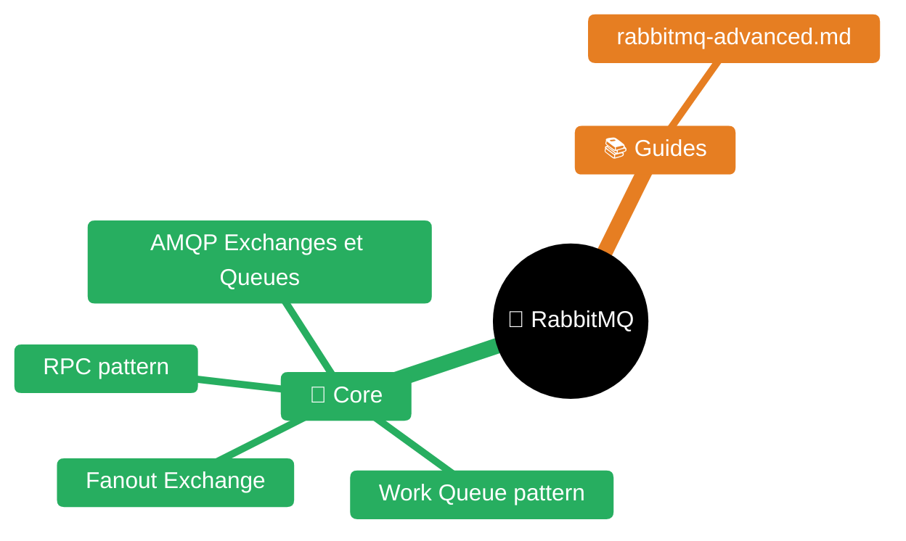
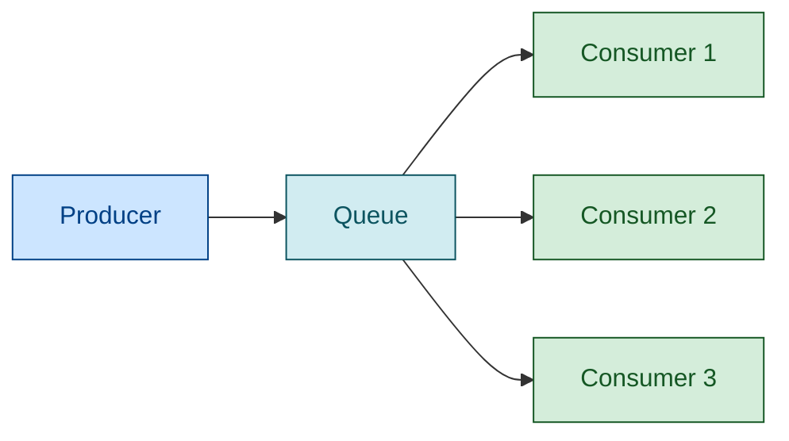
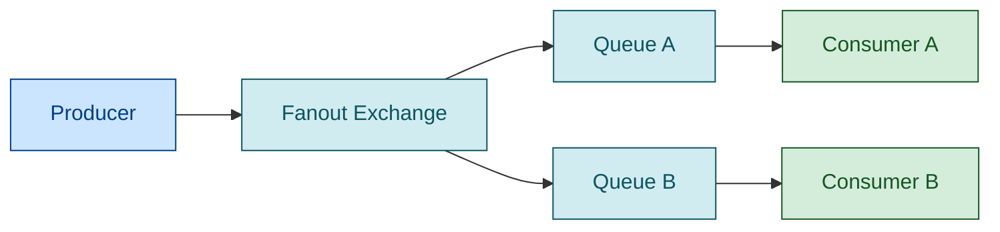
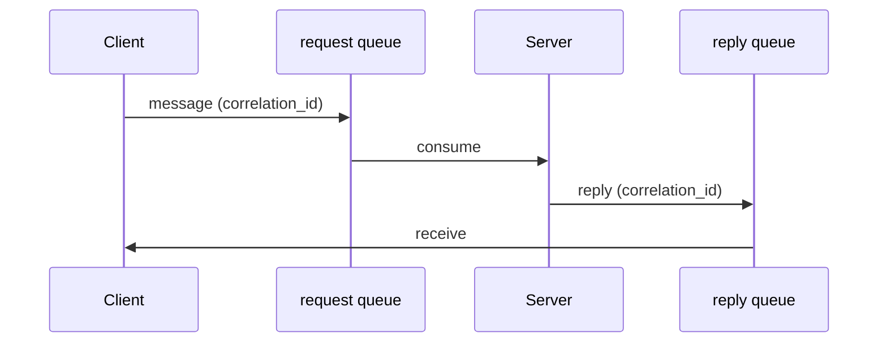

# RabbitMQ — Messaging broker


| Fichier | Description |
|---------|-------------|
| [README.md](README.md) | Point d'entrée RabbitMQ |
| [guides/rabbitmq-advanced.md](guides/rabbitmq-advanced.md) | RabbitMQ avancé |

## Architecture AMQP

```

```

### Types d'exchanges

| Type | Routage | Usage |
|------|---------|-------|
| **direct** | routing key exacte | Point-to-point, RPC |
| **topic** | pattern avec `*` (un mot) et `#` (zéro ou plus) | Pub/sub filtré |
| **fanout** | Toutes les queues bindées | Broadcast |
| **headers** | Attributs des headers (match all/any) | Routage complexe |

### Exemples de routing keys topic

```
order.created       → matche order.* et order.#
order.item.added    → matche order.# mais PAS order.*
payment.failed      → matche payment.* et *.failed
```

## Patterns de messaging

### Work Queue (competing consumers)

Plusieurs consumers sur une même queue. RabbitMQ distribue les messages round-robin.

```

```

Configurer `prefetch_count` pour ne pas surcharger un consumer lent.

### Pub/Sub (fanout)

```

```

### Request-Reply (RPC)



Utiliser `reply_to` et `correlation_id` dans les properties du message.

## Fiabilité

### Publisher Confirms

Le producer reçoit un ack du broker quand le message est persisté.

```java
channel.confirmSelect();
channel.basicPublish(exchange, routingKey, props, body);
channel.waitForConfirmsOrDie(5000); // timeout 5s
```

**Spring AMQP** :
```yaml
spring.rabbitmq.publisher-confirm-type: correlated
spring.rabbitmq.publisher-returns: true
```

### Consumer Acknowledgments

| Mode | Quand l'ack est envoyé | Risque |
|------|----------------------|--------|
| `AUTO` | Dès réception | Perte si crash pendant traitement |
| `MANUAL` | Après traitement réussi | At-least-once (recommandé) |
| `NONE` | Jamais (fire-and-forget) | Perte possible |

```java
@RabbitListener(queues = "my-queue", ackMode = "MANUAL")
public void listen(Message msg, Channel channel, @Header(AmqpHeaders.DELIVERY_TAG) long tag) {
    try {
        process(msg);
        channel.basicAck(tag, false);
    } catch (Exception e) {
        channel.basicNack(tag, false, false); // reject, no requeue → DLX
    }
}
```

### Messages persistants

```java
MessageProperties props = new MessageProperties();
props.setDeliveryMode(MessageDeliveryMode.PERSISTENT);
```

Queue durable + message persistent = survit au redémarrage du broker.

## Dead Letter Exchange (DLX)

Les messages rejetés (`nack` sans requeue), expirés (TTL), ou en queue pleine sont routés vers le DLX.

```java
@Bean
public Queue mainQueue() {
    return QueueBuilder.durable("main-queue")
        .withArgument("x-dead-letter-exchange", "dlx")
        .withArgument("x-dead-letter-routing-key", "main-queue.dlq")
        .withArgument("x-message-ttl", 60000) // 60s TTL
        .build();
}

@Bean
public Queue deadLetterQueue() {
    return QueueBuilder.durable("main-queue.dlq").build();
}
```

### Pattern retry avec DLX

```
Main Queue → (nack) → DLX → Wait Queue (TTL 30s) → Main Queue (retry)
                                                  → DLQ (après max retries)
```

Utiliser un header `x-death` pour compter les retries.

## Spring AMQP

### Configuration

```yaml
spring:
  rabbitmq:
    host: localhost
    port: 5672
    username: guest
    password: guest
    virtual-host: /
    listener:
      simple:
        acknowledge-mode: manual
        prefetch: 10
        concurrency: 3
        max-concurrency: 10
        retry:
          enabled: true
          max-attempts: 3
          initial-interval: 1000
          multiplier: 2.0
```

### Producer

```java
@Service
public class OrderProducer {
    private final RabbitTemplate template;

    public void send(Order order) {
        template.convertAndSend("orders-exchange", "order.created", order);
    }
}
```

### Consumer

```java
@Component
public class OrderConsumer {

    @RabbitListener(queues = "orders-queue")
    public void handle(Order order) {
        processOrder(order);
    }
}
```

## Spring Cloud Stream (modèle fonctionnel)

```java
@Bean
public Consumer<Order> processOrder() {
    return order -> {
        // traitement
        log.info("Processing order: {}", order.getId());
    };
}
```

```yaml
spring:
  cloud:
    stream:
      bindings:
        processOrder-in-0:
          destination: orders
          group: order-processor
      rabbit:
        bindings:
          processOrder-in-0:
            consumer:
              auto-bind-dlq: true
              dlq-ttl: 30000
              max-attempts: 3
```

### Test avec TestChannelBinder

```java
@SpringBootTest
class OrderProcessorTest {
    @Autowired
    InputDestination input;

    @Test
    void processOrder() {
        input.send(new GenericMessage<>(new Order("123")));
        // verify processing
    }
}
```

## Monitoring

### Métriques clés

| Métrique | Seuil alerte | Signification |
|----------|-------------|---------------|
| `queue_messages_ready` | > 10000 | Messages en attente (consumers trop lents) |
| `queue_messages_unacked` | > 1000 | Messages livrés mais pas ackés (consumer bloqué) |
| `channel_consumers` | = 0 | Aucun consumer (panne) |
| `node_mem_used` | > 80% limit | Mémoire (flow control imminent) |
| `node_disk_free` | < 50MB | Disque (broker bloqué) |

### Endpoints

- **Management UI** : `http://localhost:15672` (guest/guest)
- **Prometheus** : `http://localhost:15692/metrics` (plugin `rabbitmq_prometheus`)
- **Health check** : `GET /api/health/checks/alarms`

## Quorum Queues (recommandé depuis 3.8)

Remplacement des mirrored queues classiques. Basées sur Raft (consensus distribué).

```java
@Bean
public Queue quorumQueue() {
    return QueueBuilder.durable("my-queue")
        .withArgument("x-queue-type", "quorum")
        .build();
}
```

Avantages : tolérance aux pannes, pas de split-brain, delivery-limit natif.

## Stream Queues (depuis 3.9)

Pour le streaming haute performance (type Kafka). Messages immutables, offset-based.

```java
@Bean
public Queue streamQueue() {
    return QueueBuilder.durable("events")
        .withArgument("x-queue-type", "stream")
        .withArgument("x-max-length-bytes", 1_000_000_000) // 1GB
        .build();
}
```

## Pitfalls courants

| Piège | Symptôme | Solution |
|-------|----------|---------|
| Messages non ackés | Queue grossit, consumer bloqué | Toujours ack/nack, timeout |
| Pas de DLX | Messages poison en boucle infinie | Configurer DLX + max retries |
| prefetch trop élevé | Un consumer monopolise tout | `prefetch: 10-50` (pas 65535) |
| Queues non durables | Perte au redémarrage | `durable: true` systématique |
| Connection leaks | File descriptors épuisés | Pool de connections, close dans finally |
| Pas de publisher confirms | Messages perdus silencieusement | `publisher-confirm-type: correlated` |
| Queue explosion | Mémoire saturée | `x-max-length`, `x-overflow: reject-publish` |

## Opérations

### Virtual hosts

Isolation logique (permissions, queues, exchanges séparés par vhost).

```bash
rabbitmqctl add_vhost /myapp
rabbitmqctl set_permissions -p /myapp myuser ".*" ".*" ".*"
```

### Policies

Appliquer des règles à des groupes de queues/exchanges :

```bash
# Toutes les queues en quorum
rabbitmqctl set_policy quorum ".*" '{"x-queue-type": "quorum"}' --apply-to queues

# TTL 24h sur les queues DLQ
rabbitmqctl set_policy dlq-ttl ".*\.dlq" '{"message-ttl": 86400000}' --apply-to queues
```

### Shovel et Federation

- **Shovel** : copie de messages entre brokers (migration, réplication)
- **Federation** : partage de messages entre clusters géographiquement distribués

## Types de queues (choix critique)

| Type | Usage | HA | Replay |
|------|-------|----|----|
| **Classic v2** | Queues temporaires, single-node, exclusive | Non | Non |
| **Quorum** | Queues critiques, commandes, HA (recommandé) | Oui (Raft) | Non |
| **Stream** | Fan-out massif, replay, haute ingestion | Oui (Raft) | Oui |

### Quorum queues (recommandé en production)

```java
@Bean
public Queue quorumQueue() {
    return QueueBuilder.durable("orders")
        .withArgument("x-queue-type", "quorum")
        .withArgument("x-delivery-limit", 3)  // max redeliveries avant DLX
        .withArgument("x-dead-letter-exchange", "dlx")
        .withArgument("x-dead-letter-strategy", "at-least-once")
        .build();
}
```

Mémoire : ~32 bytes/message dans le Raft log. 1 million messages ≈ 30 MB.

### Stream queues (type Kafka)

```java
@Bean
public Queue streamQueue() {
    return QueueBuilder.durable("events")
        .withArgument("x-queue-type", "stream")
        .withArgument("x-max-length-bytes", 5_000_000_000L) // rétention 5GB
        .withArgument("x-stream-max-segment-size-bytes", 500_000_000) // 500MB/segment
        .build();
}
```

Consumers lisent par offset (comme Kafka). Pas de DLX. Parfait pour event sourcing.

## TTL (Time-To-Live)

```java
// TTL par queue (tous les messages)
.withArgument("x-message-ttl", 60000)  // 60s

// TTL par message (priorité sur queue TTL si plus bas)
MessageProperties props = new MessageProperties();
props.setExpiration("30000");  // 30s, STRING pas int

// Queue auto-delete après inactivité
.withArgument("x-expires", 3600000)  // supprime la queue après 1h sans consumers
```

**Piège** : le TTL par queue n'expire que les messages en tête de queue. Si un message longue durée bloque, les messages derrière ne sont pas expirés même si leur TTL est dépassé.

## Flow Control

RabbitMQ bloque automatiquement les publishers quand :
- **Mémoire** > watermark (défaut 0.6 = 60% de la RAM)
- **Disque** < seuil (défaut 50MB)

**Bonne pratique** : séparer les connexions publisher et consumer. Un publisher bloqué par flow control ne doit pas bloquer les consumers.

```conf
# rabbitmq.conf
vm_memory_high_watermark.relative = 0.6
disk_free_limit.absolute = 1GB
```

## Production checklist

- **Hardware** : minimum 4 cores, 4 GiB RAM
- **File descriptors** : `ulimit -n 500000` (défaut 1024 trop bas)
- **Quorum queues** : pour toutes les queues critiques (pas classic)
- **Publisher confirms** : toujours activer
- **Consumer prefetch** : 10-50 (pas le défaut 250 si messages lourds)
- **Heartbeat** : 5-20s (défaut 60s trop lent pour détecter les pannes)
- **Monitoring** : Prometheus sur port 15692
- **Clustering** : minimum 3 noeuds (pas 2, risque de split-brain)
- **Network partitions** : `pause_minority` (recommandé pour 3+ noeuds)

## Versions Tanzu RabbitMQ

Versions utilisées en production :

| Version Tanzu | RabbitMQ OSS | Erlang | Date |
|---|---|---|---|
| **2.4.3** | 3.13.11 | 26.2.5.16 | Nov 2025 |
| **10.0.3** | 4.0.12 | 26.2.5.12 | Jun 2025 |
| **10.1.2** | 4.1.9 | 27.3.4.7 | Mar 2026 |

**Attention** : upgrade 2.4 → 10.0 = suppression classic mirroring (migration quorum obligatoire).

Détails complets dans `versions/tanzu-rabbitmq.md` : chemins d'upgrade, features exclusives Tanzu (WSR, compression, Vault), opérateurs K8s, breaking changes.

## Référence avancée

- `guides/rabbitmq-advanced.md` — 1254 lignes, 19 sections : quorum queues en détail, streams, prefetch tuning, TTL, flow control, memory management, clustering, network partitions, monitoring Prometheus, Erlang VM tuning, production checklist, reliability patterns. Tous les paramètres avec valeurs par défaut officielles.

---

## Skills connexes

- `../spring/README.md` — Spring AMQP, Spring Cloud Stream
- `../quarkus/README.md` — Quarkus messaging (alternative)
- `../sre/README.md` — Patterns de fiabilité messaging (DLQ, retries, idempotence)
- `../tanzu/README.md` — Tanzu RabbitMQ (versions production)
