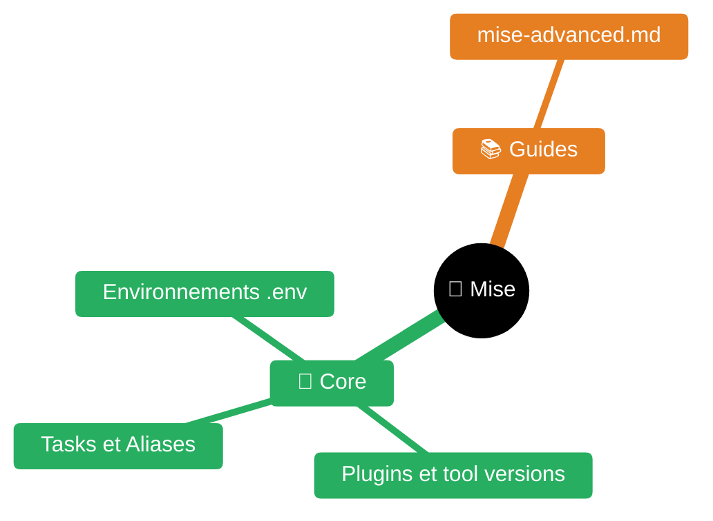

> **Expérience projet** : voir `experience/mise.md` pour les leçons spécifiques au workspace <solution-numerique>.

# mise — Task runner et bonnes pratiques


| Fichier | Description |
|---------|-------------|
| [README.md](README.md) | Point d'entrée Mise |
| [guides/mise-advanced.md](guides/mise-advanced.md) | Mise avancé |

## Qu'est-ce que mise

[mise](https://mise.jdx.dev/) est un task runner polyglot + gestionnaire de versions d'outils. Remplace Makefile, scripts bash épars, et nvm/rbenv/pyenv.

## Configuration : mise.toml

Le fichier `mise.toml` (ou `.mise.toml`) à la racine du projet configure l'environnement.

### [env] — Variables d'environnement

```toml
[env]
no_proxy = "localhost,127.0.0.1"
MY_MODEL = "gemma4:26b"
VENV_DIR = "{{env.HOME}}/venvs/myproject"
```

Tera templates disponibles : `{{env.HOME}}`, `{{env.USER}}`, etc.

**Piège** : Tera interprète `{{ }}` — éviter dans les valeurs (ex: `docker --format '{{.ID}}'` → utiliser un script bash externe).

### [tools] — Outils versionnés

```toml
[tools]
python = "3.12"
node = "20"
kind = "0.24"
```

### [tasks] — Tasks inline (simples)

```toml
[tasks.hello]
description = "Dire bonjour"
run = "echo 'Bonjour !'"

[tasks.test]
description = "Lancer les tests"
run = "pytest tests/ -q"
depends = ["lint"]
```

## Tasks file-based (recommandé pour > 5 lignes)

Les tasks complexes vivent dans `.mise/tasks/` comme scripts exécutables.

### Structure

```
.mise/tasks/
├── agent/coding     # mise run agent:coding
├── agent/doc        # mise run agent:doc
├── model/install    # mise run model:install
├── chat             # mise run chat
└── clean            # mise run clean
```

Le chemin du fichier = le nom de la task. `agent/coding` → `mise run agent:coding`.

### Anatomie d'une task

```bash
#!/usr/bin/env bash
#MISE description="Description courte de la task"
set -euo pipefail

REPO_DIR="${MISE_PROJECT_DIR:-$(cd "$(dirname "${BASH_SOURCE[0]}")/.." && pwd)}"

# Arguments
ARG1="${1:-}"

# Usage si pas d'arguments
if [ -z "$ARG1" ]; then
    echo "Usage: mise run ma:task -- <argument>"
    echo ""
    echo "  mise run ma:task -- valeur1"
    echo "  mise run ma:task -- valeur2"
    echo ""
    echo "Autres commandes :"
    echo "  mise run autre:task    Description"
    exit 1
fi

# Logique...
echo "[OK] Fait."

# Guidage vers la suite
echo ""
echo "Prochaines étapes :"
echo "  mise run etape:suivante    Description"
```

### Règles obligatoires

1. **Shebang** : `#!/usr/bin/env bash` (ou `#!/usr/bin/env python3`)
2. **Description** : `#MISE description="..."` sur la 2ème ligne
3. **set -euo pipefail** : toujours (fail fast)
4. **Usage** : afficher l'aide si appelé sans arguments
5. **Guidage** : afficher les prochaines commandes possibles (succès ET échec)
6. **Permissions** : `chmod +x` obligatoire

## sh vs bash — LE piège

**CRITIQUE** : mise exécute les tasks inline avec `sh`, pas `bash`.

| Fonctionne en bash | Ne fonctionne PAS en sh |
|---|---|
| `[[ "$x" == "y" ]]` | Utiliser `[ "$x" = "y" ]` |
| `arrays=("a" "b")` | Utiliser des strings séparées |
| `set -o pipefail` | Non supporté en sh |
| `${var:0:5}` (substring) | Utiliser `cut` ou `expr` |
| `$((x++))` | Utiliser `x=$((x + 1))` |
| `source file` | Utiliser `. file` (POSIX) |
| `function f() {}` | Utiliser `f() {}` |

**Solution** : utiliser des tasks file-based avec `#!/usr/bin/env bash` pour avoir bash.

## TOML — Pièges d'escaping

### Strings multilignes

```toml
# Guillemets triples — interprète \n et \"
run = """
echo "ligne 1"
echo "ligne 2"
"""

# Guillemets triples littéraux — PAS d'interprétation
run = '''
echo "ligne 1"
echo "ligne 2"
'''
```

**Piège** : `"""..."""` interprète `\n` et `\"`. Utiliser `'''...'''` pour du bash littéral.

### Tera dans les valeurs

```toml
# ⚠ {{ }} est interprété par Tera
MY_VAR = "{{env.HOME}}/path"  # OK, Tera résout

# ⚠ docker --format '{{.ID}}' → ERREUR Tera
# Solution : mettre dans un script bash externe
```

## Bonnes pratiques

### 1. Idempotence

Chaque task doit pouvoir être relancée sans effets de bord.

#### Idempotence simple
```bash
# Mauvais
pip install package

# Bon
pip install package 2>/dev/null || true
```

#### Idempotence avec sources/outputs (recommandé)

Mise peut tracker les fichiers sources et outputs pour ne relancer une task que quand les dépendances changent :

```toml
[tasks._setup-python]
description = "Installation venv Python (idempotent)"
hide = true
sources = ["requirements.txt"]
outputs = [".venv/.installed"]
run = '''
#!/usr/bin/env bash
set -euo pipefail
rm -rf .venv
python3 -m venv --without-pip .venv
curl -sS https://bootstrap.pypa.io/get-pip.py | .venv/bin/python3
.venv/bin/pip install -q -r requirements.txt
touch .venv/.installed
'''
```

- `sources` : si `requirements.txt` n'a pas changé, mise skip la task
- `outputs` : le fichier `.installed` sert de marqueur de complétion
- La task ne se relance que si `requirements.txt` est modifié ou `.venv/.installed` absent

### 2. Python venv — le bon pattern

**CRITIQUE** : deux pièges selon l'environnement :
- `python3 -m venv .venv` → échoue si `ensurepip` absent (Python précompilé par mise = pas de wheels pip bundlés)
- `--without-pip` + `curl bootstrap.pypa.io` → échoue en enterprise (accès bloqué par le proxy/pare-feu)

#### Pattern correct (universel — fonctionne en local ET enterprise)
```bash
# 1. Créer le venv SANS pip (évite l'absence de ensurepip dans mise Python)
python3 -m venv --without-pip .venv

# 2. Copier pip depuis l'installation mise (100% local, zéro réseau)
PY_VER=$(python3 -c "import sys; print(f'{sys.version_info.major}.{sys.version_info.minor}')")
cp -rp "$(python3 -c 'import pip, os; print(os.path.dirname(pip.__file__))')" \
  ".venv/lib/python${PY_VER}/site-packages/pip"

# 3. Créer le script pip wrapper
printf '#!/bin/sh\nexec "$(dirname "$0")/python3" -m pip "$@"\n' > .venv/bin/pip
chmod +x .venv/bin/pip

# 4. Installer les dépendances (crée les scripts behave, playwright, etc. dans .venv/bin/)
.venv/bin/pip install -q -r requirements.txt

# 5. Marquer la complétion (pour idempotence)
touch .venv/.installed
```

#### Pourquoi ce pattern
- `ensurepip` absent dans les builds Python précompilés de mise (py 3.12+)
- `bootstrap.pypa.io` bloqué en enterprise (proxy + pare-feu)
- `cp -rp pip` depuis `site-packages` de mise : 100% local, zéro réseau
- Le wrapper `pip` délègue à `python3 -m pip` → les scripts créés par `pip install` ont le bon shebang

### 3. Helper scripts partagés

Extraire la logique commune dans `scripts/` :
```bash
# Dans scripts/harness-run.sh
harness_run() { ... }

# Dans .mise/tasks/agent/coding
source "$REPO_DIR/scripts/harness-run.sh"
harness_run coding "$TASK" "$WORKSPACE"
```

### 4. Détection de prérequis

```bash
if ! command -v ollama &>/dev/null; then
    echo "[ERREUR] ollama non trouvé"
    echo "  → mise run prereqs:install"
    exit 1
fi
```

### 5. Guidage systématique

Chaque task affiche les commandes suivantes en cas de **succès ET d'échec** :
```bash
if [ $EXIT -eq 0 ]; then
    echo "Prochaines étapes :"
    echo "  mise run agent:coding -- \"tâche\""
else
    echo "Corrigez l'erreur puis :"
    echo "  mise run agent:setup"
fi
```

### 6. Playwright / navigateur en enterprise

**Problème** : `playwright install chromium` télécharge depuis `cdn.playwright.dev` — bloqué par les proxies enterprise (DNS ENOTFOUND ou ZIP corrompu via interception SSL).

#### Pattern robuste (local + enterprise)
```bash
# Dans _setup-behave : détection chromium systeme > apt > playwright download
CHROME_BIN=""
for bin in chromium-browser chromium google-chrome google-chrome-stable /snap/bin/chromium; do
  if command -v "$bin" >/dev/null 2>&1 || [ -x "$bin" ]; then
    CHROME_BIN=$(command -v "$bin" 2>/dev/null || echo "$bin")
    break
  fi
done
if [ -n "$CHROME_BIN" ]; then
  echo "Chromium systeme detecte: $CHROME_BIN"
elif sudo apt-get install -y -q chromium-browser 2>/dev/null || \
     sudo apt-get install -y -q chromium 2>/dev/null; then
  CHROME_BIN=$(command -v chromium-browser 2>/dev/null || command -v chromium 2>/dev/null || echo "")
  echo "Chromium installe via apt: $CHROME_BIN"
else
  # Dernier recours : download playwright (local uniquement)
  NODE_EXTRA_CA_CERTS=/etc/ssl/certs/ca-certificates.crt .venv/bin/playwright install chromium
fi

# Dans la task test : exporter CHROMIUM_EXECUTABLE_PATH pour playwright
CHROME_BIN=$(command -v chromium-browser 2>/dev/null || command -v chromium 2>/dev/null || \
             command -v google-chrome 2>/dev/null || echo "")
[ -n "$CHROME_BIN" ] && export CHROMIUM_EXECUTABLE_PATH="$CHROME_BIN"
cd tests/behave && PYTHONPATH=. .venv/bin/behave ...
```

Dans le code Python (`frontend_steps.py`) :
```python
import os
executable_path = os.environ.get("CHROMIUM_EXECUTABLE_PATH") or None
context._browser = context._pw.chromium.launch(headless=True, executable_path=executable_path)
```

#### SSL proxy enterprise (Node.js)
```bash
# NODE_EXTRA_CA_CERTS permet à Node.js de faire confiance au CA enterprise
NODE_EXTRA_CA_CERTS=/etc/ssl/certs/ca-certificates.crt npm install ...
NODE_EXTRA_CA_CERTS=/etc/ssl/certs/ca-certificates.crt .venv/bin/playwright install chromium
```
Fonctionne uniquement si le CA enterprise a été ajouté au store système via `update-ca-certificates`.

### 7. Background processes

**Piège** : les processus background causent exit code 144 (SIGPIPE).
Solution : externaliser dans un script shell séparé.

### 8. MISE_PROJECT_DIR

Toujours utiliser `MISE_PROJECT_DIR` pour trouver la racine du projet :
```bash
REPO_DIR="${MISE_PROJECT_DIR:-$(cd "$(dirname "${BASH_SOURCE[0]}")/.." && pwd)}"
```

### 9. Nommage

| Pattern | Exemple | Usage |
|---------|---------|-------|
| `domaine/action` | `model/install` | CRUD sur un domaine |
| `domaine` seul | `chat`, `clean` | Action unique |
| Verbe impératif | `verify`, `clean` | Actions globales |

## Commandes utiles

```bash
mise task ls                    # Lister toutes les tasks
mise run <task> -- <args>       # Lancer une task avec arguments
mise run <task>                 # Lancer sans arguments (affiche usage)
mise trust                      # Faire confiance au projet
mise env                        # Voir les variables d'environnement
mise doctor                     # Diagnostic de l'installation mise
```

## Référence avancée

- `guides/mise-advanced.md` — Arguments (usage field), caching (sources/outputs), dépendances avancées, mise watch, MISE_ENV profils, Tera templates, gotchas supplémentaires
