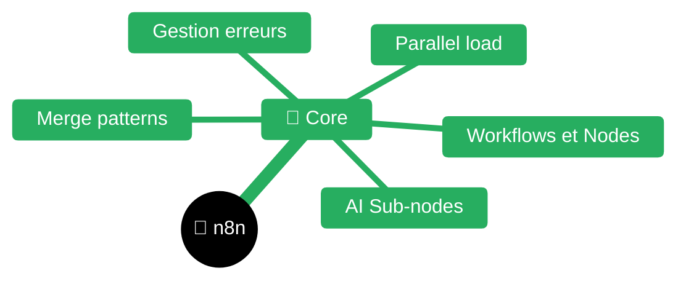
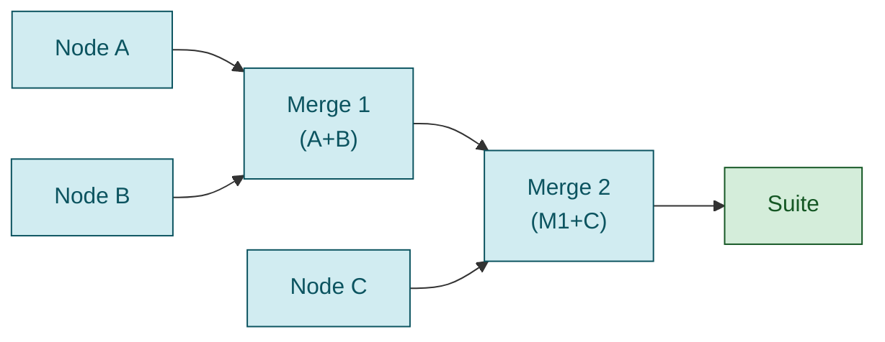
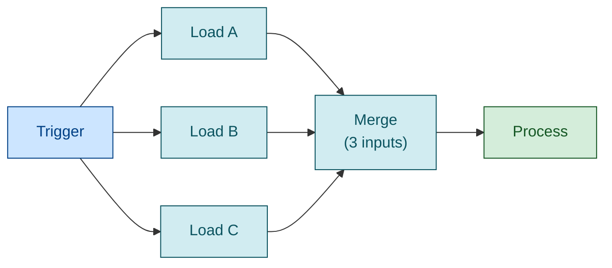
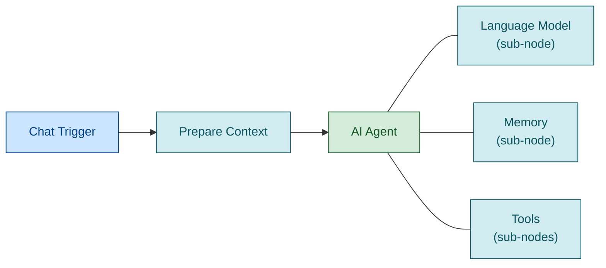

---
name: n8n-workflows
description: Guide complet pour créer des workflows n8n, notamment la gestion des flux de données, les merges de branches parallèles, l'accès aux données des nodes précédents, et l'intégration avec les AI Agents. Utiliser quand on crée ou débogue des workflows n8n, particulièrement pour combiner des données de plusieurs sources ou branches.
---

# n8n Workflow Development Guide


| Fichier | Description |
|---------|-------------|
| [README.md](README.md) | Point d'entrée n8n |

## Concepts fondamentaux

### Structure des données n8n

Chaque node traite des **items**. Un item a la structure :
```json
{
  "json": { "field1": "value1", "field2": "value2" },
  "binary": { /* optionnel: fichiers */ }
}
```

### Flux de données

- Les données circulent de node en node via des **connexions**
- Un node peut avoir plusieurs **outputs** (branches)
- Un node peut avoir plusieurs **inputs** (merge)
- Par défaut, chaque node ne reçoit que les données du node **immédiatement précédent**

---

## Merge Node - Combiner plusieurs branches

### Modes disponibles

| Mode | Usage | Description |
|------|-------|-------------|
| **Append** | Concaténation | Combine tous les items de toutes les branches en séquence |
| **Combine by Position** | Fusion par index | Item 0 de A + Item 0 de B, Item 1 de A + Item 1 de B... |
| **Combine by Matching Fields** | Join SQL-like | Fusionne les items qui ont les mêmes valeurs dans les champs spécifiés |
| **SQL Query** | Requête SQL | Écrit une requête SQL pour combiner (tables: input1, input2...) |
| **Choose Branch** | Sélection | Attend les deux branches, mais ne garde qu'une seule |

### Merge avec plus de 2 inputs (n8n >= 1.49.0)

Pour combiner 3+ branches :

```json
{
  "parameters": {
    "numberInputs": 3
  },
  "type": "n8n-nodes-base.merge",
  "typeVersion": 3
}
```

**Connexions** - Chaque branche doit aller vers un index différent :
```json
"connections": {
  "Node A": { "main": [[{ "node": "Merge", "type": "main", "index": 0 }]] },
  "Node B": { "main": [[{ "node": "Merge", "type": "main", "index": 1 }]] },
  "Node C": { "main": [[{ "node": "Merge", "type": "main", "index": 2 }]] }
}
```

**IMPORTANT**: Le Merge attend que TOUTES les branches aient terminé avant de continuer.

### Versions anciennes (< 1.49.0)

Chaîner plusieurs Merge nodes :


---

## Code Node - Accéder aux données

### Modes d'exécution

| Mode | Variable | Usage |
|------|----------|-------|
| `For Each Item` (défaut) | `$json` | Traite chaque item individuellement |
| `Run Once for All Items` | `$input.all()` | Traite tous les items en une fois |

### Accéder aux items de l'input courant

```javascript
// Mode "Run Once for All Items"
const allItems = $input.all();

for (const item of allItems) {
  console.log(item.json.field1);
}
```

### Accéder à un node précédent spécifique

```javascript
// Récupérer tous les items d'un node nommé
const items = $('Nom du Node').all();

// Récupérer le premier item seulement
const firstItem = $('Nom du Node').first();
const value = firstItem.json.myField;

// Récupérer un item spécifique
const item = $('Nom du Node').item;  // Item lié à l'item courant
```

### Après un Merge - Pattern recommandé

Quand on est après un Merge avec plusieurs inputs, utiliser `$input.all()` et identifier les items par leur contenu :

```javascript
// Mode: Run Once for All Items
const allItems = $input.all();

let dataA = null;
let dataB = null;
let dataC = null;

for (const item of allItems) {
  const path = item.json.path || item.json.name || '';
  
  if (path.includes('identifiant-A')) {
    dataA = item.json;
  } else if (path.includes('identifiant-B')) {
    dataB = item.json;
  } else if (path.includes('identifiant-C')) {
    dataC = item.json;
  }
}

// Utiliser dataA, dataB, dataC...
return [{ json: { combined: { dataA, dataB, dataC } } }];
```

### Retourner des données

```javascript
// Mode "For Each Item" - retourne un objet
return { field1: 'value1', field2: 'value2' };

// Mode "Run Once for All Items" - retourne un tableau d'items
return [
  { json: { field1: 'value1' } },
  { json: { field2: 'value2' } }
];
```

---

## Patterns d'architecture

### Split → Parallel → Merge

Pour charger plusieurs ressources en parallèle :



**JSON des connexions** :
```json
{
  "Trigger": {
    "main": [[
      { "node": "Load A", "type": "main", "index": 0 },
      { "node": "Load B", "type": "main", "index": 0 },
      { "node": "Load C", "type": "main", "index": 0 }
    ]]
  },
  "Load A": { "main": [[{ "node": "Merge", "type": "main", "index": 0 }]] },
  "Load B": { "main": [[{ "node": "Merge", "type": "main", "index": 1 }]] },
  "Load C": { "main": [[{ "node": "Merge", "type": "main", "index": 2 }]] }
}
```

### Données persistantes entre exécutions

Utiliser `$getWorkflowStaticData()` :

```javascript
const staticData = $getWorkflowStaticData('global');

// Lire
const savedValue = staticData.myValue || 'default';

// Écrire
staticData.myValue = 'new value';

// Les données persistent entre les exécutions du workflow
```

---

## AI Agent Integration

### Structure d'un workflow avec AI Agent



### Passer un System Prompt dynamique

```json
{
  "parameters": {
    "options": {
      "systemMessage": "={{ $json.systemPrompt }}"
    }
  },
  "type": "@n8n/n8n-nodes-langchain.agent"
}
```

### Tools - Appeler des sous-workflows

```json
{
  "parameters": {
    "name": "tool_name",
    "description": "Description pour le LLM",
    "workflowId": {
      "__rl": true,
      "value": "workflow-id-here",
      "mode": "list"
    }
  },
  "type": "@n8n/n8n-nodes-langchain.toolWorkflow"
}
```

---

## Erreurs courantes et solutions

### "Node 'X' hasn't been executed"

**Cause** : Tentative d'accéder à un node qui n'est pas dans le chemin d'exécution.

**Solution** : Utiliser le Merge node pour synchroniser les branches avant d'accéder aux données.

### "Fields to Match" required pour Merge

**Cause** : Mode "Combine by Matching Fields" sélectionné sans configuration.

**Solution** : Utiliser mode "Append" si on veut juste concaténer, ou configurer les champs.

### Données perdues après Merge

**Cause** : Les items ne sont pas identifiables après le merge.

**Solution** : Ajouter un champ identifiant dans chaque branche avant le merge, ou identifier par le contenu (path, type, etc.)

### $input.all() ne retourne qu'un item

**Causes possibles** :
1. Le node précédent n'a produit qu'un item
2. Le mode n'est pas "Run Once for All Items"
3. Bug connu avec certaines versions - ajouter un IF node (always true) avant

---

## Bonnes pratiques

1. **Nommer les nodes clairement** - Facilite le débogage et `$('Nom')` 
2. **Utiliser les Sticky Notes** - Documenter l'architecture dans le workflow
3. **continueOnFail: true** - Sur les nodes qui peuvent échouer légitimement
4. **Tester chaque branche** - Exécuter node par node pour vérifier les données
5. **Versionner les workflows** - Inclure un `versionId` dans le JSON
---

## Skills connexes

- `../n8n-observabilite/README.md` — Workflows n8n pour observabilité Dynatrace
- `../mermaid/README.md` — Diagrammes mermaid (souvent générés via n8n)
