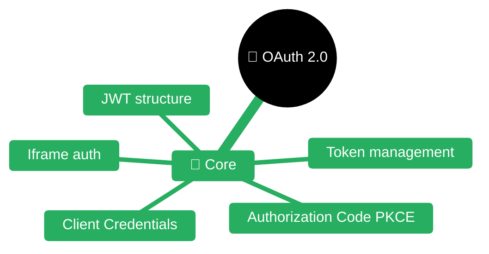
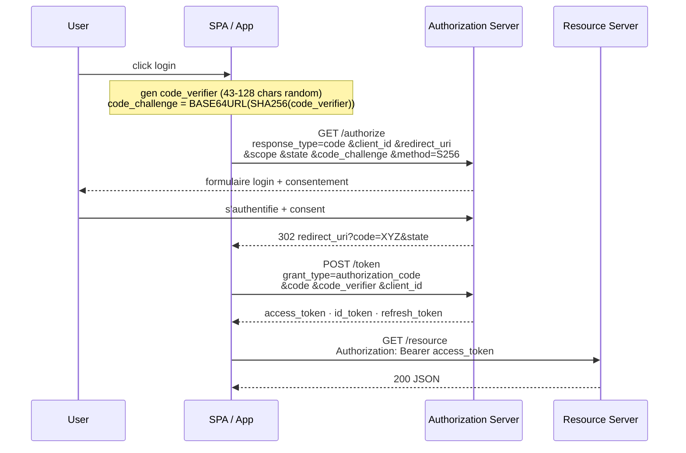

# OAuth 2.0 / OIDC / JWT

> **Expérience projet** : voir `experience/oauth-jwt.md` pour les leçons spécifiques au workspace <solution-numerique> (cas `<provider>` iframe, `<internal-auth-library>`, intégration Quarkus backend et Angular frontend).

> **Sources principales** :
> - [RFC 6749 — The OAuth 2.0 Authorization Framework](https://datatracker.ietf.org/doc/html/rfc6749)
> - [RFC 6750 — OAuth 2.0 Bearer Token Usage](https://datatracker.ietf.org/doc/html/rfc6750)
> - [RFC 7519 — JSON Web Token (JWT)](https://datatracker.ietf.org/doc/html/rfc7519)
> - [RFC 7515 — JSON Web Signature (JWS)](https://datatracker.ietf.org/doc/html/rfc7515)
> - [RFC 7516 — JSON Web Encryption (JWE)](https://datatracker.ietf.org/doc/html/rfc7516)
> - [RFC 7517 — JSON Web Key (JWK)](https://datatracker.ietf.org/doc/html/rfc7517)
> - [RFC 7636 — PKCE for OAuth Public Clients](https://datatracker.ietf.org/doc/html/rfc7636)
> - [RFC 8628 — Device Authorization Grant](https://datatracker.ietf.org/doc/html/rfc8628)
> - [RFC 8725 — JWT Best Current Practices](https://datatracker.ietf.org/doc/html/rfc8725)
> - [OpenID Connect Core 1.0](https://openid.net/specs/openid-connect-core-1_0.html)
> - [OpenID Connect Discovery 1.0](https://openid.net/specs/openid-connect-discovery-1_0.html)
> - [OAuth 2.1 (IETF draft)](https://datatracker.ietf.org/doc/html/draft-ietf-oauth-v2-1)
> - [OAuth 2.0 Security BCP (RFC 9700)](https://datatracker.ietf.org/doc/html/rfc9700)
> - [Quarkus OIDC guide](https://quarkus.io/guides/security-oidc-bearer-token-authentication)
> - [Quarkus OIDC Web App guide](https://quarkus.io/guides/security-oidc-code-flow-authentication)
> - [Quarkus SmallRye JWT guide](https://quarkus.io/guides/security-jwt)
> - [Angular HTTP interceptors](https://angular.io/guide/http-intercept-requests-and-responses)


| Fichier | Description |
|---------|-------------|
| [README.md](README.md) | Point d'entrée OAuth 2.0 |

## Concepts fondamentaux

### Acteurs OAuth 2.0

| Rôle | Définition |
|------|-----------|
| **Resource Owner** (RO) | L'utilisateur final qui possède la ressource |
| **Client** | Application qui demande l'accès pour le compte du RO |
| **User Agent** | Navigateur ou app native qui porte l'interaction |
| **Authorization Server** (AS) | Serveur qui authentifie le RO et émet les tokens |
| **Resource Server** (RS) | API qui accepte le token et sert les données protégées |

> Source : [RFC 6749 §1.1](https://datatracker.ietf.org/doc/html/rfc6749#section-1.1)

### Types de clients

| Type | Authentification client | Secret stockable ? |
|------|------------------------|-------------------|
| **Confidential** | `client_id` + `client_secret` (ou mTLS, JWT) | Oui — backend, CLI confidentiel |
| **Public** | `client_id` seul (+ **PKCE obligatoire**) | Non — SPA, mobile native |

Un SPA Angular est un **client public** → jamais de secret côté navigateur, PKCE obligatoire.

### Scopes vs claims

| Concept | Définition |
|---------|-----------|
| **Scope** | Périmètre d'autorisation demandé au consentement (`openid profile email orders:read`) — propriété du **token** |
| **Claim** | Assertion sur le sujet encodée **dans** le token (`sub=alice`, `email=alice@example.com`) |
| **Audience (`aud`)** | Qui peut consommer le token — doit être vérifiée par le RS |

---

## Flows OAuth 2.0

### Vue d'ensemble

| Flow | Client | Usage | État |
|------|--------|-------|------|
| **Authorization Code + PKCE** | Public ou confidentiel | SPA, mobile, webapp | **Recommandé universel** |
| **Authorization Code** (sans PKCE) | Confidentiel | Webapp server-side | OK, mais PKCE recommandé même ici |
| **Client Credentials** | Confidentiel | Service-to-service, batch | OK |
| **Device Code** | Public | TV, CLI, IoT sans browser | OK (RFC 8628) |
| **Refresh Token** | Tous | Renouvellement silencieux | OK avec rotation |
| **Resource Owner Password Credentials** (ROPC) | — | Legacy uniquement | **Supprimé OAuth 2.1** |
| **Implicit** | SPA legacy | — | **Déprécié** (Security BCP, OAuth 2.1) |

> Source : [OAuth 2.0 Security BCP — RFC 9700](https://datatracker.ietf.org/doc/html/rfc9700) + [OAuth 2.1 draft §2.1.2](https://datatracker.ietf.org/doc/html/draft-ietf-oauth-v2-1)

### Authorization Code + PKCE (le standard 2026)



| Étape | Détail |
|-------|--------|
| `code_verifier` | 43-128 chars base64url aléatoires |
| `code_challenge` | `BASE64URL(SHA256(code_verifier))` |
| `code_challenge_method` | `S256` (pas `plain`) |
| `state` | Anti-CSRF, vérifié au retour |
| `nonce` (OIDC) | Anti-replay id_token, vérifié dans les claims |

**Pourquoi PKCE** : sans PKCE, un attaquant qui intercepte le `code` (redirect, log, historique) peut l'échanger contre un token. Avec PKCE, il faut aussi le `code_verifier` stocké uniquement côté client légitime.

> Source : [RFC 7636](https://datatracker.ietf.org/doc/html/rfc7636)

### Client Credentials

```
POST /token
grant_type=client_credentials
client_id=batch-job
client_secret=***
scope=orders:write
```

**Use case** : appel service-to-service sans utilisateur. Pas d'`id_token`, pas de `refresh_token` (on redemande un `access_token` quand il expire).

### Device Code (RFC 8628)

```
1. POST /device_authorization → device_code, user_code, verification_uri, interval
2. Afficher "Go to https://.../device and enter ABCD-1234"
3. Polling POST /token grant_type=urn:ietf:params:oauth:grant-type:device_code
   → tant que "authorization_pending", attendre interval secondes
4. Une fois l'user authentifié depuis un autre device → access_token
```

### Refresh Token rotation

| Pratique | Détail |
|----------|--------|
| **Rotation** | Chaque usage d'un refresh token en émet un nouveau et invalide l'ancien |
| **Detection de replay** | Si un ancien refresh token est réutilisé → révoquer toute la famille (l'utilisateur a été compromis) |
| **Durée** | Refresh token bien plus long que access token (heures/jours vs minutes) |
| **Stockage client public** | **En mémoire ou cookie `HttpOnly Secure SameSite=Lax`** — jamais localStorage |

> Source : [OAuth 2.0 Security BCP §4.14](https://datatracker.ietf.org/doc/html/rfc9700#section-4.14)

### Implicit Flow — pourquoi déprécié

| Problème | Conséquence |
|----------|-------------|
| `access_token` dans l'URL fragment `#` | Fuites via logs, historique, referrer, extensions |
| Pas de `code_verifier` → token injectable | Attaquant peut injecter un token volé |
| Pas de refresh token | Flows silencieux complexes (iframe hidden) |
| Pas de `client_authentication` | Pas de vérification du client |

**Remplacement** : Authorization Code + PKCE fonctionne pour les SPA depuis 2019 (tous les AS modernes le supportent).

> Source : [OAuth 2.0 for Browser-Based Apps (draft)](https://datatracker.ietf.org/doc/html/draft-ietf-oauth-browser-based-apps)

---

## OpenID Connect (OIDC)

### OIDC vs OAuth 2.0

| Axe | OAuth 2.0 | OIDC |
|-----|-----------|------|
| **But** | Autorisation (accès à des APIs) | **Authentification** (identité de l'user) + autorisation |
| **Token** | `access_token` (opaque ou JWT, peu importe) | + **`id_token`** (JWT signé, prouve l'identité) |
| **Userinfo** | Ø | **`/userinfo` endpoint** retourne claims user |
| **Discovery** | Ø | **`.well-known/openid-configuration`** |
| **Scope trigger** | selon AS | **`openid` obligatoire** |

### Discovery (`.well-known/openid-configuration`)

```http
GET https://peam.example.com/.well-known/openid-configuration
```

```json
{
  "issuer": "https://peam.example.com",
  "authorization_endpoint": "https://peam.example.com/authorize",
  "token_endpoint": "https://peam.example.com/token",
  "userinfo_endpoint": "https://peam.example.com/userinfo",
  "jwks_uri": "https://peam.example.com/jwks.json",
  "end_session_endpoint": "https://peam.example.com/logout",
  "response_types_supported": ["code", "id_token", "code id_token"],
  "id_token_signing_alg_values_supported": ["RS256", "ES256"],
  "code_challenge_methods_supported": ["S256"]
}
```

Les clients OIDC **découvrent tout** depuis ce document → aucun endpoint hardcodé.

### id_token vs access_token

| Token | Destination | Contenu | Format |
|-------|-------------|---------|--------|
| **`id_token`** | **Le client** (Angular, Quarkus web-app) — prouve *qui* est l'user | Claims OIDC (sub, email, name, ...) | **Toujours JWT signé** |
| **`access_token`** | **Le RS** (API Quarkus) — prouve *quel droit* est accordé | Scopes, `aud`, claims custom | JWT ou opaque (dépend AS) |

**Erreur fréquente** : envoyer l'`id_token` comme Bearer à une API. C'est FAUX — l'`id_token` n'est pas destiné au RS (`aud` = client_id, pas le RS).

---

## JWT — structure et claims

### Format (RFC 7519)

```
eyJhbGciOiJSUzI1NiIsImtpZCI6ImsxIn0.eyJzdWIiOiJhbGljZSIsImV4cCI6MTczMzAwMDAwMH0.SIG
└──── header ─────┘ └──────── payload ────────┘ └sig┘
```

Trois parties **base64url** (pas base64 standard : `-_` au lieu de `+/`, sans padding) séparées par des points.

### Header JOSE

```json
{
  "alg": "RS256",
  "kid": "k1",
  "typ": "JWT"
}
```

| Champ | Usage |
|-------|-------|
| `alg` | Algorithme de signature (RS256, ES256, EdDSA, HS256, `none`...) |
| `kid` | Key ID — permet au RS de choisir la bonne clé dans le JWKS |
| `typ` | `JWT` ou `at+jwt` (RFC 9068 access token) |

### Claims standards (RFC 7519)

| Claim | Sens | Exemple |
|-------|------|---------|
| `iss` | Issuer — qui a émis le token | `https://peam.example.com` |
| `sub` | Subject — identifiant stable de l'user | `agent-12345` |
| `aud` | Audience — pour qui est le token | `backend-api` |
| `exp` | Expiration (epoch seconds) | `1733000000` |
| `nbf` | Not Before (token invalide avant) | `1732999000` |
| `iat` | Issued At | `1732999000` |
| `jti` | JWT ID unique (anti-replay, blacklist) | `uuid-...` |

### Claims OIDC (OpenID Connect Core §5.1)

| Claim | Scope | Sens |
|-------|-------|------|
| `name`, `given_name`, `family_name` | `profile` | Nom de l'user |
| `email`, `email_verified` | `email` | Email |
| `preferred_username` | `profile` | Login |
| `groups` | (custom) | Groupes/rôles — non standard OIDC mais quasi universel |
| `nonce` | — | Valeur passée en authorize, rejouée dans id_token (anti-replay) |
| `auth_time` | — | Horodatage de l'authentification |
| `acr`, `amr` | — | Niveau/méthode d'authentification (MFA...) |

### Exemple de payload avec claims custom

```json
{
  "iss": "https://auth.example.com",
  "sub": "agent-12345",
  "aud": "my-api",
  "exp": 1733000000,
  "iat": 1732999100,
  "scope": "openid profile orders:read orders:write",
  "groups": ["USER", "ADMIN"],
  "site": "75056"
}
```

Les claims hors RFC 7519 / OIDC (ici `site`) sont libres et spécifiques au contrat entre l'AS et le RS. Les noms doivent être documentés et stables dans le temps.

---

## Algorithmes de signature (JWS)

### Familles

| Algo | Type | Taille clé | Usage |
|------|------|------------|-------|
| `HS256` / `HS384` / `HS512` | **Symétrique** (HMAC + SHA-2) | 256+ bits | Secret partagé — OK intra-service, **pas pour multi-party** |
| **`RS256`** / `RS384` / `RS512` | **Asymétrique RSA** | 2048+ bits | **Standard de fait OIDC** — clé publique exposée via JWKS |
| `PS256` / `PS384` / `PS512` | RSA-PSS | 2048+ bits | Plus moderne que RS* (padding probabiliste) |
| **`ES256`** / `ES384` / `ES512` | ECDSA (courbes NIST) | 256+ bits | Plus compact que RS, bon compromis |
| **`EdDSA`** (Ed25519) | Edwards-curve | 256 bits | Moderne, rapide, résistant aux side-channels |
| `none` | **Aucune signature** | — | **JAMAIS** — vulnérabilité connue |

### Pourquoi RS256 (ou ES256) côté service

1. **Séparation des pouvoirs** : l'AS détient la clé privée, le RS n'a que la clé publique → même si le RS est compromis, l'attaquant ne peut pas forger de tokens.
2. **JWKS publique** : `jwks_uri` distribue la clé publique → N services peuvent valider sans partage de secret.
3. **Rotation** : l'AS rotate sa clé, publie les deux dans le JWKS (ancienne et nouvelle avec `kid` différents), les RS rechargent automatiquement.

**Contre-indication HS256 pour OIDC multi-service** : si chaque RS a le secret HMAC, **chacun peut forger des tokens valides**.

### Vulnérabilité `alg=none`

Certaines anciennes libs acceptaient `{"alg":"none"}` → signature vide acceptée. **Exploit trivial** :

```
{"alg":"none"}.{"sub":"admin","exp":9999999999}.
```

**Mitigation** : la lib de validation doit **exiger explicitement** l'algorithme attendu (`RS256`), jamais accepter ce que dit le header.

### Vulnérabilité confusion `alg`

Passer un header `{"alg":"HS256"}` à un RS qui attend `RS256`, avec comme "secret" HMAC la **clé publique RSA** du RS. Certaines libs utilisaient cette clé publique comme secret HMAC → token forgé accepté.

**Mitigation** : toujours pinner l'algo côté RS.

> Source : [RFC 8725 — JWT BCP §3](https://datatracker.ietf.org/doc/html/rfc8725#section-3)

---

## JWKS — rotation de clés

### Format JWKS (RFC 7517)

```json
{
  "keys": [
    {
      "kty": "RSA",
      "kid": "k1",
      "use": "sig",
      "alg": "RS256",
      "n": "0vx7agoebGcQSuuPiLJ...",
      "e": "AQAB"
    },
    {
      "kty": "RSA",
      "kid": "k2",
      "use": "sig",
      "alg": "RS256",
      "n": "xjlKxS2fP...",
      "e": "AQAB"
    }
  ]
}
```

### Processus de rotation

| Étape | État JWKS | Tokens émis |
|-------|-----------|-------------|
| T0 — régime stable | `[k1]` | signés avec `k1` |
| T1 — introduction | `[k1, k2]` | toujours signés avec `k1` |
| T2 — bascule | `[k1, k2]` | **signés avec `k2`** |
| T3 — grace period | `[k1, k2]` | tant que des tokens `k1` peuvent traîner (= max `exp`) |
| T4 — retrait | `[k2]` | ancienne clé purgée |

Les RS **doivent rafraîchir** le JWKS périodiquement (cache avec TTL, ou invalidation si `kid` inconnu rencontré).

---

## Validation côté Resource Server

### Checklist obligatoire

| Check | Pourquoi |
|-------|----------|
| **Signature** | Authentique — clé publique du JWKS via `kid` |
| **`alg`** | **Pinné** à la liste attendue (jamais `none`, jamais accepter ce que dit le header) |
| **`iss`** | Exactement l'issuer attendu (`https://auth.example.com`) |
| **`aud`** | Contient l'identifiant du RS (`my-api`) |
| **`exp`** | `now < exp` (petit `leeway` ≤ 60s max pour clock skew) |
| **`nbf`** | `now >= nbf` si présent |
| **`iat`** | Raisonnable (pas dans le futur) |
| **Scopes / groups** | L'endpoint demandé est autorisé |

### Pièges de validation

| Piège | Exploit |
|-------|---------|
| Pas de check `aud` | Token émis pour service A utilisé sur service B (confused deputy) |
| Pas de check `iss` | Token d'un autre AS (si plusieurs AS ont la même clé) |
| Accepter `alg` du header | `alg=none` ou confusion RS256/HS256 |
| `kid` non pinné à un JWKS trusted | Attaquant injecte un JWKS URL via `jku`/`x5u` header |
| Clock skew > 5 min | Tokens expirés acceptés longuement |
| Vérifier `exp` en millisecondes | JWT `exp` est en **secondes epoch** — erreur ×1000 |

---

## Quarkus OIDC — mode service (Resource Server)

> Source : [quarkus.io/guides/security-oidc-bearer-token-authentication](https://quarkus.io/guides/security-oidc-bearer-token-authentication)

### Dépendance

```xml
<dependency>
  <groupId>io.quarkus</groupId>
  <artifactId>quarkus-oidc</artifactId>
</dependency>
```

### `application.properties`

```properties
# Mode service (défaut) : l'app valide des Bearer tokens, ne redirige pas
quarkus.oidc.application-type=service

# Discovery auto depuis l'AS
quarkus.oidc.auth-server-url=https://auth.example.com
%dev.quarkus.oidc.auth-server-url=http://localhost:9012/openam/oauth2

# Identifiant du RS attendu dans aud
quarkus.oidc.client-id=my-api
quarkus.oidc.token.audience=my-api

# Pinning de l'algo (sinon, Quarkus accepte ce que signale l'AS)
quarkus.oidc.token.signature-algorithm=RS256

# Claim qui porte les rôles
quarkus.oidc.roles.role-claim-path=groups

# Cache JWKS
quarkus.oidc.jwks.resolve-early=true
quarkus.oidc.connection-delay=10S

# Leeway pour clock skew
quarkus.oidc.token.lifespan-grace=30
```

### Endpoint sécurisé

```java
@Path("/orders")
public class OrderResource {

    @Inject
    SecurityIdentity identity;

    @Inject
    JsonWebToken jwt; // le token courant injectable

    @GET
    @RolesAllowed("USER")
    public List<Order> list() {
        String agent = jwt.getClaim("agentCode");
        return service.listForAgent(agent);
    }

    @POST
    @RolesAllowed("ADMIN")
    public Response create(OrderInput in) {
        return Response.status(201).entity(service.create(in, identity.getPrincipal().getName())).build();
    }
}
```

### Modes Quarkus OIDC

| Mode | Usage | Redirection |
|------|-------|-------------|
| **`service`** (défaut) | API REST / RS pur — attend `Authorization: Bearer` | Aucune, 401 si token manquant |
| **`web-app`** | Webapp server-side (Qute, JSF) → gère le flow code + cookie session | Redirige vers `/authorize` |
| **`hybrid`** | Les deux sur le même endpoint selon présence du Bearer | — |

### Multi-tenant

```properties
quarkus.oidc.external.auth-server-url=https://auth.example.com
quarkus.oidc.external.client-id=external-api
quarkus.oidc.internal.auth-server-url=https://keycloak.internal
quarkus.oidc.internal.client-id=internal-api
```

Résolveur `TenantResolver` pour router selon l'URL, l'issuer, un header, etc.

---

## Quarkus SmallRye JWT — mode service pur

> Source : [quarkus.io/guides/security-jwt](https://quarkus.io/guides/security-jwt)

**Quand l'utiliser** : on n'a besoin que de **valider** un JWT déjà émis (pas de discovery OIDC, pas de refresh, pas de flow). Utile pour :
- Service interne avec clé publique fournie par ops (pas de JWKS HTTP)
- Intégration simple où on veut la vérification de signature et c'est tout
- GraalVM native — smallrye-jwt a moins d'intégrations runtime

### Dépendance

```xml
<dependency>
  <groupId>io.quarkus</groupId>
  <artifactId>quarkus-smallrye-jwt</artifactId>
</dependency>
```

### Configuration

```properties
mp.jwt.verify.publickey.location=META-INF/public.pem
mp.jwt.verify.issuer=https://auth.example.com
mp.jwt.verify.audiences=my-api
smallrye.jwt.required.claims=sub

# Ou JWKS HTTP
# mp.jwt.verify.publickey.location=https://auth.example.com/jwks.json
# mp.jwt.verify.publickey.algorithm=RS256
```

### Injection du JWT et claims

```java
@Path("/me")
@RequestScoped
public class MeResource {

    @Inject
    JsonWebToken jwt;

    @Inject
    @Claim("agentCode")
    String agentCode;

    @GET
    @RolesAllowed("USER")
    public Map<String, Object> me() {
        return Map.of(
            "sub", jwt.getSubject(),
            "issuer", jwt.getIssuer(),
            "groups", jwt.getGroups(),
            "agent", agentCode,
            "expiresAt", jwt.getExpirationTime()
        );
    }
}
```

### OIDC vs SmallRye JWT — comparatif

| Axe | `quarkus-oidc` | `quarkus-smallrye-jwt` |
|-----|----------------|------------------------|
| Discovery `.well-known` | Oui | Non |
| JWKS rotation auto | Oui | Oui (si publickey.location = URL JWKS) |
| Flow code + PKCE | Oui (web-app) | Non |
| Introspection opaque | Oui | Non |
| Refresh token | Oui | Non |
| Multi-tenant | Oui natif | Manuel |
| Empreinte runtime | Plus lourd | Minimal |

**Règle usuelle** : `quarkus-oidc` par défaut. `smallrye-jwt` si on veut vraiment du léger sans discovery.

---

## Angular — intercepteur HTTP & stockage

> Source : [angular.io/guide/http-intercept-requests-and-responses](https://angular.io/guide/http-intercept-requests-and-responses)

### Intercepteur Bearer

```typescript
import { HttpInterceptorFn } from '@angular/common/http';
import { inject } from '@angular/core';
import { AuthService } from './auth.service';

export const bearerInterceptor: HttpInterceptorFn = (req, next) => {
  const auth = inject(AuthService);
  const token = auth.getAccessToken();

  if (!token || !req.url.startsWith(auth.apiBaseUrl)) {
    return next(req);
  }

  const authReq = req.clone({
    setHeaders: { Authorization: `Bearer ${token}` }
  });
  return next(authReq);
};
```

Enregistrement (standalone) :

```typescript
bootstrapApplication(AppComponent, {
  providers: [
    provideHttpClient(withInterceptors([bearerInterceptor]))
  ]
});
```

### Refresh token on 401

```typescript
export const refreshInterceptor: HttpInterceptorFn = (req, next) => {
  const auth = inject(AuthService);
  return next(req).pipe(
    catchError((err: HttpErrorResponse) => {
      if (err.status !== 401 || req.headers.has('X-Skip-Refresh')) {
        return throwError(() => err);
      }
      return auth.refresh().pipe(
        switchMap(() => {
          const retry = req.clone({
            setHeaders: { Authorization: `Bearer ${auth.getAccessToken()}` }
          });
          return next(retry);
        })
      );
    })
  );
};
```

Attention : sérialiser les refresh concurrents (sinon N appels parallèles → N refresh) — pattern `shareReplay(1)` ou `BehaviorSubject` sur l'observable de refresh en cours.

### Route guard

```typescript
export const authGuard: CanActivateFn = (route, state) => {
  const auth = inject(AuthService);
  const router = inject(Router);
  if (auth.isAuthenticated()) return true;
  router.navigate(['/login'], { queryParams: { returnUrl: state.url } });
  return false;
};
```

### Stockage des tokens — pourquoi PAS localStorage

| Stockage | XSS vulnerable | Persistant | Recommandation |
|----------|:--------------:|:----------:|----------------|
| **Mémoire JS** (variable, service Angular) | Oui mais éphémère | Non (F5 perd) | **Meilleur pour SPA pure** |
| **`sessionStorage`** | **Oui — toute XSS l'exfiltre** | Onglet uniquement | Acceptable si MAJ obligatoire |
| **`localStorage`** | **Oui — toute XSS l'exfiltre, persistant** | Oui | **NON** — persistance de la compromission |
| **Cookie `HttpOnly Secure SameSite=Lax/Strict`** | **Non exfiltrable en JS** | Oui | **Meilleur global** (nécessite backend qui set le cookie) |

**Règle** : un XSS dans ton app = game over pour tous les tokens stockés côté JS. Le cookie `HttpOnly` est le seul stockage hors de portée du JS. Pour les SPA pure (token pattern), garder en mémoire + short-lived + silent refresh via iframe hidden ou refresh token en cookie `HttpOnly`.

> Source : [OAuth 2.0 for Browser-Based Apps draft §6.2](https://datatracker.ietf.org/doc/html/draft-ietf-oauth-browser-based-apps)

---

## Flows legacy — implicit en iframe cachée

Certains AS historiques (surtout de grandes entreprises qui n'ont jamais migré vers PKCE) n'exposent qu'un **flow implicit** et attendent que le client ouvre une **iframe cachée** qui capture le token et le transmet via `postMessage` au parent. C'est formellement déprécié (RFC 9700, OAuth 2.1) mais parfois imposé.

### Architecture générique

```mermaid
sequenceDiagram
    participant U as User
    participant SPA as Parent window (SPA)
    participant IF as iframe (AS login)
    participant AS as Authorization Server

    SPA->>IF: embed &lt;iframe src="/authorize?response_type=token&..."/&gt;
    IF->>AS: GET /authorize (implicit flow)
    AS-->>U: formulaire login
    U->>AS: s'authentifie
    AS-->>IF: 302 redirect_uri#access_token=...
    IF->>SPA: postMessage({token}, parentOrigin)
    Note over SPA: window.addEventListener('message')<br/>valider e.origin avant usage
    SPA->>SPA: authService.storeToken(e.data.token)
```

### Contraintes et pièges

| Contrainte | Mitigation |
|------------|-----------|
| Flow implicit (déprécié) imposé par le legacy | Accepté uniquement si l'AS n'expose pas PKCE |
| `access_token` dans l'URL fragment `#` | L'iframe parse le fragment côté client avant redirect, évite les fuites dans les logs serveur |
| `postMessage` → vérifier l'**origin** côté parent | `if (event.origin !== 'https://as.example.com') return` (jamais `*`) |
| `X-Frame-Options: DENY` / `frame-ancestors` | L'AS doit explicitement autoriser l'embedding depuis l'origine app |
| Cookie de session AS `SameSite=None` | Nécessaire pour que l'iframe partage la session SSO entre requêtes cross-site |
| Pas de refresh token | Re-lancer l'iframe hidden quand l'access_token expire (silent re-auth) |
| Token révocation | Impossible côté RS — durée de vie courte obligatoire |

### Intégration Angular (pattern générique)

```typescript
@Injectable({ providedIn: 'root' })
export class LegacyAuthService {
  private token$ = new BehaviorSubject<string | null>(null);

  login(): Observable<string> {
    const iframe = document.createElement('iframe');
    iframe.style.display = 'none';
    iframe.src = this.buildAuthorizeUrl();

    return new Observable(subscriber => {
      const handler = (event: MessageEvent) => {
        if (event.origin !== environment.authOrigin) return;
        if (!event.data?.access_token) return;
        window.removeEventListener('message', handler);
        document.body.removeChild(iframe);
        this.token$.next(event.data.access_token);
        subscriber.next(event.data.access_token);
        subscriber.complete();
      };
      window.addEventListener('message', handler);
      document.body.appendChild(iframe);
    });
  }

  private buildAuthorizeUrl(): string {
    const params = new URLSearchParams({
      response_type: 'token',
      client_id: environment.authClientId,
      redirect_uri: environment.authRedirectUri,
      scope: 'openid profile',
      state: crypto.randomUUID(),
      nonce: crypto.randomUUID()
    });
    return `${environment.authAuthorizeUrl}?${params}`;
  }
}
```

---

## Pièges et anti-patterns récapitulatifs

| Piège | Conséquence | Correction |
|-------|-------------|------------|
| `alg=none` accepté par le validateur | Forge triviale | Pinner `alg` côté RS |
| Confusion `alg` RS256/HS256 | Forge avec clé publique | Pinner `alg`, ne jamais utiliser la même clé pour deux algos |
| `aud` non vérifié | Confused deputy (token service A réutilisé sur B) | Toujours vérifier `aud` == RS |
| `iss` non vérifié | Token d'un autre AS accepté | Toujours vérifier `iss` |
| `exp` en ms au lieu de s | Bugs d'expiration | `exp` toujours en secondes epoch |
| Clock skew > 5 min | Tokens expirés acceptés | `leeway` ≤ 60s |
| `localStorage` pour tokens | XSS = exfiltration | Mémoire ou cookie HttpOnly |
| Pas de `state` | CSRF sur `/callback` | `state` aléatoire vérifié |
| Pas de `nonce` (OIDC) | Replay id_token | `nonce` dans authorize + check dans id_token |
| Refresh token sans rotation | Vol = accès indéfini | Rotation + detection de replay |
| `access_token` dans l'URL | Fuites logs, referer, historique | Header `Authorization: Bearer` |
| Implicit flow pour nouveau SPA | Déprécié, attaques connues | Authorization Code + PKCE |
| ROPC (password grant) | Le client voit le password | Supprimé OAuth 2.1 |
| `id_token` envoyé à l'API | `aud` != RS, rejeté | Envoyer l'`access_token` |
| Long-lived access tokens (heures) | Révocation impossible | Durée courte (5-15 min) + refresh token |
| JWT stocké en cookie sans `Secure` / `SameSite` | CSRF, fuite HTTP | `HttpOnly Secure SameSite=Lax` minimum |
| Trust du `jku`/`x5u` header | JWKS attacker-controlled → forge | Toujours utiliser le JWKS trusted de config |
| Pas de max size sur le JWT reçu | DoS parsing | Limite (ex: 8 KB) côté RS |
| RS qui lit le token sans valider | Bypass total | Toujours passer par une lib de validation (`quarkus-oidc`, nimbus-jose-jwt, jose4j) |
| `HS256` avec secret trop court / dict | Brute force offline | ≥ 256 bits aléatoires si vraiment HS256 |

---

## Cheatsheet — chiffres et bonnes valeurs

| Item | Valeur recommandée |
|------|-------------------|
| **Flow SPA 2026** | Authorization Code + PKCE (S256) |
| **Algo signature OIDC** | RS256 ou ES256 |
| **Taille clé RSA** | ≥ 2048 bits (3072+ préféré) |
| **Access token lifespan** | 5-15 min |
| **Refresh token lifespan** | Heures à jours, avec rotation |
| **`state` / `nonce` / `code_verifier`** | Aléatoires ≥ 128 bits (crypto.randomUUID ou webcrypto) |
| **Clock skew leeway** | 30-60 s max |
| **JWT taille raisonnable** | < 4-8 KB (header HTTP limits) |
| **JWKS cache TTL** | 5-15 min, invalidation sur `kid` inconnu |
| **Cookie refresh token** | `HttpOnly Secure SameSite=Lax Path=/token` |
| **`code_verifier`** | 43-128 chars base64url |
| **Stockage SPA pure** | Mémoire (BehaviorSubject) + silent refresh |

---

## Lectures complémentaires

- [RFC 9068 — JWT Profile for OAuth 2.0 Access Tokens](https://datatracker.ietf.org/doc/html/rfc9068)
- [RFC 9449 — OAuth 2.0 Demonstrating Proof-of-Possession (DPoP)](https://datatracker.ietf.org/doc/html/rfc9449)
- [RFC 9126 — OAuth 2.0 Pushed Authorization Requests (PAR)](https://datatracker.ietf.org/doc/html/rfc9126)
- [RFC 9207 — OAuth 2.0 Authorization Server Issuer Identification](https://datatracker.ietf.org/doc/html/rfc9207)
- [RFC 9700 — OAuth 2.0 Security Best Current Practice](https://datatracker.ietf.org/doc/html/rfc9700)
- [OAuth 2.0 for Browser-Based Apps (draft)](https://datatracker.ietf.org/doc/html/draft-ietf-oauth-browser-based-apps)
- [OWASP JWT Cheat Sheet](https://cheatsheetseries.owasp.org/cheatsheets/JSON_Web_Token_for_Java_Cheat_Sheet.html)
- [OWASP OAuth 2.0 Cheat Sheet](https://cheatsheetseries.owasp.org/cheatsheets/OAuth2_Cheat_Sheet.html)
- *OAuth 2.0 in Action* — Justin Richer, Antonio Sanso (Manning)
- [jose4j](https://bitbucket.org/b_c/jose4j) / [Nimbus JOSE+JWT](https://connect2id.com/products/nimbus-jose-jwt) — libs de référence Java

---

## Skills connexes

- [`../quarkus/README.md`](../quarkus/README.md) — Extensions `quarkus-oidc` et `quarkus-smallrye-jwt`
- [`../angular/README.md`](../angular/README.md) — Intercepteurs HTTP, guards, DI standalone
- [`../sre/README.md`](../sre/README.md) — Rotation de secrets, gestion des clés, incident response
- [`../devops/README.md`](../devops/README.md) — Secrets K8s, cert-manager, sealed secrets
