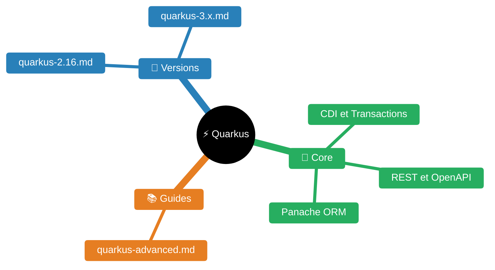

# Skill — Quarkus

> **Expérience générique** : leçons réutilisables avec placeholders `<...>` dans `experience/quarkus.md` (double JDK, datasources nommées, `%test` overrides, pièges Kafka dev).
>
> **Walkthroughs workspace-specific** : les détails concrets d'un projet (versions exactes, repos, configs, dépendances réelles) vivent dans le repo Quarkus du workspace courant — pas ici. Convention : `<repo-quarkus>/docs/quarkus-experience.md`.

Cette skill regroupe la référence **générique** Quarkus (patterns, bonnes pratiques, roadmap 2.16→3.x). Tout ce qui concerne un projet concret du workspace est dans le repo de ce projet, pas dans la KB.

---


| Fichier | Description |
|---------|-------------|
| [README.md](README.md) | Point d'entrée Quarkus |
| [guides/quarkus-advanced.md](guides/quarkus-advanced.md) | Quarkus avancé |
| [versions/quarkus-2.16.md](versions/quarkus-2.16.md) | Notes de version Quarkus 2.16 |
| [versions/quarkus-3.x.md](versions/quarkus-3.x.md) | Notes de version Quarkus 3.x |

## Patterns avancés (bonne pratique 2024-2025)

### `@TestTransaction` pour tests Panache

Préférable à `@Transactional` sur la classe de test — rollback automatique après chaque test :

```java
@QuarkusTest
class MonRepositoryTest {

    @Inject MonRepository repository;

    @Test
    @TestTransaction  // rollback après ce test — état propre garanti
    void testFindByStatut() {
        // Arrange — données insérées dans la transaction
        MonEntity entity = new MonEntity();
        entity.statut = "ACTIF";
        repository.persist(entity);

        // Act
        List<MonEntity> result = repository.findByStatut("ACTIF");

        // Assert
        assertThat(result).hasSize(1);
    }
}
```

Disponible depuis Quarkus 1.13+ (stable en 2.16).

### `InMemoryConnector` — tester les handlers Kafka sans broker

**Différence avec `enabled=false`** :

| Approche | Utilisation |
|----------|-------------|
| `%test.mp.messaging.incoming.canal.enabled=false` | Tests de la couche service sans traitement Kafka |
| `InMemoryConnector` | Teste le handler Kafka complet (logique de consommation) |

```java
// 1. QuarkusTestResourceLifecycleManager
public class KafkaTestResource implements QuarkusTestResourceLifecycleManager {
    @Override
    public Map<String, String> start() {
        Map<String, String> props = new HashMap<>();
        props.putAll(InMemoryConnector.switchIncomingChannelsToInMemory("reception-enchantement"));
        props.putAll(InMemoryConnector.switchOutgoingChannelsToInMemory("emission-resultat"));
        return props;
    }
    @Override
    public void stop() { InMemoryConnector.clear(); }
}

// 2. Test class
@QuarkusTest
@QuarkusTestResource(KafkaTestResource.class)
class ReceptionEnchantementTest {

    @Inject @Any InMemoryConnector connector;

    @Test
    void testTraitementMessage() {
        InMemorySource<String> source = connector.source("reception-enchantement");
        InMemorySink<String> sink = connector.sink("emission-resultat");

        source.send("{\"id\":\"123\",\"statut\":\"NOUVEAU\"}");

        await().atMost(5, SECONDS).until(() -> sink.received().size() == 1);
        assertThat(sink.received().get(0).getPayload()).contains("TRAITE");
    }
}
```

**Dépendance test** (gérée par le BOM Quarkus 2.16, pas besoin de version) :
```xml
<dependency>
    <groupId>io.smallrye.reactive</groupId>
    <artifactId>smallrye-reactive-messaging-in-memory</artifactId>
    <scope>test</scope>
</dependency>
```

### `@ConfigMapping` — groupes de config (recommandé sur `@ConfigProperty`)

```java
@ConfigMapping(prefix = "<app>")
public interface ApplicationProperties {
    int nombreElementParPageCopieTable();
    Optional<String> envEnchantement();         // optionnel : pas d'erreur si absent
    List<String> bootstrapServers();            // <app>.bootstrap-servers[0], [1], ...
    RetryConfig retry();                        // <app>.retry.*

    interface RetryConfig {
        int maxAttempts();
        Duration delay();
    }
}
```

**Avantages vs `@ConfigProperty`** : validation à la compilation, accès type-safe aux structures imbriquées, `Optional<T>` natif.

### `@Transactional` sur méthodes privées — piège Quarkus 2.16

```java
@ApplicationScoped
public class MonService {
    @Transactional  // ← SILENCIEUSEMENT IGNORÉ en 2.16 sur private !
    private void methodePriveeTransactionnelle() { ... }

    @Transactional  // ← CORRECT — public, interceptable par CDI
    public void methodePubliqueTransactionnelle() { ... }
}
```

**En Quarkus 3.x** : erreur de build si `@Transactional` sur méthode `private` → détection précoce.

---

## Roadmap — migration Quarkus 2.16 → 3.x

**Outil officiel** :
```bash
quarkus update --stream=3.x
git diff  # inspecter les transformations automatiques
```

**Changements majeurs** :

| Aspect | Quarkus 2.16 | Quarkus 3.x |
|--------|-------------|-------------|
| Namespace Java | `javax.*` | `jakarta.*` (breaking) |
| API REST | `javax.ws.rs` | `jakarta.ws.rs` |
| Persistence | `javax.persistence` | `jakarta.persistence` |
| Validation | `javax.validation` | `jakarta.validation` |
| Hibernate ORM | 5.6 | 6.2+ (API significativement modifiée) |
| RESTEasy | `quarkus-resteasy` | `quarkus-rest` (renommé en 3.9) |
| `@AlternativePriority` | Disponible | Supprimé → `@Alternative + @Priority` |
| `@Transactional` private | Ignoré silencieusement | **Erreur de build** |
| `@WithTestResource` | Non disponible | Disponible 3.13+ (remplace `@QuarkusTestResource`) |
| Health | `quarkus-smallrye-health` (inchangé) | Idem |

**Attention** : l'outil `quarkus update` ne couvre pas les changements Hibernate ORM — migration manuelle nécessaire pour les requêtes Criteria API et certaines annotations.


---

---

## Skills connexes

- [`../java/README.md`](../java/README.md) — Conventions Java/Maven, JUnit 5, JaCoCo
- [`../spring/README.md`](../spring/README.md) — Framework alternative à Quarkus
- `../oracle/README.md` — Datasource Oracle (config Quarkus DATASOURCE)
- `../rabbitmq/README.md` — Messaging via Spring AMQP / Quarkus messaging
- [`../sre/README.md`](../sre/README.md) — Tests, dynatrace, SLO sur services Quarkus
