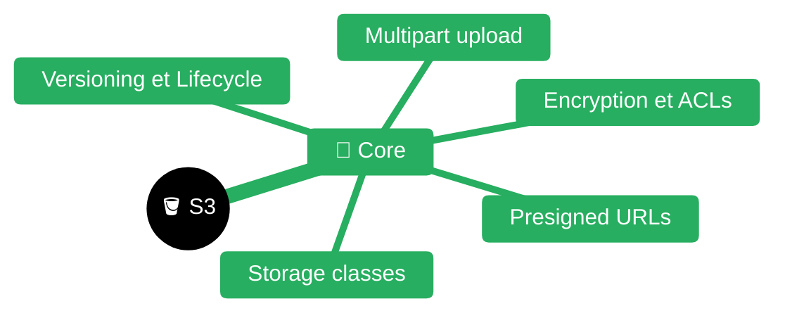
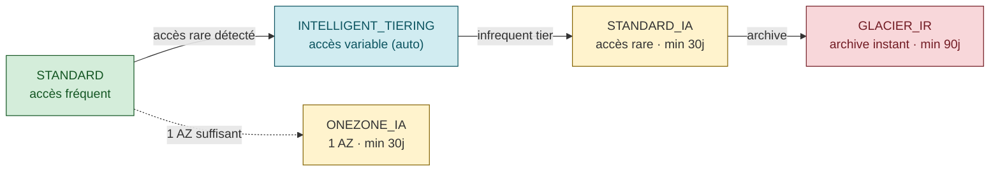

# Amazon S3 (et compatibles S3Mock / MinIO)

> **Expérience projet** : voir `experience/s3.md` pour les leçons spécifiques au workspace <solution-numerique>.

> **Sources principales** :
> - [Amazon S3 — User Guide](https://docs.aws.amazon.com/AmazonS3/latest/userguide/Welcome.html)
> - [S3 API Reference](https://docs.aws.amazon.com/AmazonS3/latest/API/Welcome.html)
> - [Signature Version 4](https://docs.aws.amazon.com/AmazonS3/latest/API/sig-v4-authenticating-requests.html)
> - [Multipart upload overview](https://docs.aws.amazon.com/AmazonS3/latest/userguide/mpuoverview.html)
> - [Presigned URLs](https://docs.aws.amazon.com/AmazonS3/latest/userguide/ShareObjectPreSignedURL.html)
> - [Versioning](https://docs.aws.amazon.com/AmazonS3/latest/userguide/Versioning.html)
> - [Lifecycle management](https://docs.aws.amazon.com/AmazonS3/latest/userguide/object-lifecycle-mgmt.html)
> - [Server-side encryption](https://docs.aws.amazon.com/AmazonS3/latest/userguide/serv-side-encryption.html)
> - [Strong consistency (Dec 2020)](https://docs.aws.amazon.com/AmazonS3/latest/userguide/Welcome.html#ConsistencyModel)
> - [AWS SDK for Java v2 — S3](https://docs.aws.amazon.com/sdk-for-java/latest/developer-guide/examples-s3.html)
> - [boto3 S3 client](https://boto3.amazonaws.com/v1/documentation/api/latest/reference/services/s3.html)
> - [Quarkus Amazon S3 extension](https://quarkus.io/guides/amazon-s3)
> - [Quarkiverse amazon-services](https://docs.quarkiverse.io/quarkus-amazon-services/dev/amazon-s3.html)
> - [S3Mock (Adobe)](https://github.com/adobe/S3Mock)
> - [MinIO documentation](https://min.io/docs/minio/linux/index.html)


| Fichier | Description |
|---------|-------------|
| [README.md](README.md) | Point d'entrée S3 |

## Architecture & concepts fondamentaux

### Bucket, object, key, region, endpoint

S3 = **object store plat** (pas de hiérarchie réelle). Unités :

| Concept | Définition |
|---------|-----------|
| **Bucket** | Conteneur global (nom unique **inter-comptes AWS**), rattaché à une **région** |
| **Object** | Blob binaire (0 octet → 5 TiB) + metadata |
| **Key** | Chaîne UTF-8 jusqu'à 1024 octets — identifiant unique dans le bucket |
| **Region** | Localisation physique (`eu-west-3`, `us-east-1`…) — la latence et le coût varient |
| **Endpoint** | URL du service : `https://s3.<region>.amazonaws.com` ou `https://<bucket>.s3.<region>.amazonaws.com` |
| **Metadata** | System-defined (`Content-Type`, `Content-Length`, `ETag`, `Last-Modified`) + user-defined (`x-amz-meta-*`) |
| **ETag** | MD5 pour upload simple ; `<hash>-<N>` pour multipart (pas un MD5 standard) |

Les "dossiers" sont une **illusion de la console** — `a/b/c.txt` n'est qu'une clé avec des `/`. `ListObjectsV2` avec `delimiter=/` et `prefix=a/` simule une navigation hiérarchique.

> Source : [docs.aws.amazon.com/AmazonS3/latest/userguide/Welcome.html](https://docs.aws.amazon.com/AmazonS3/latest/userguide/Welcome.html)

### Path-style vs virtual-hosted-style

| Style | URL | Statut |
|-------|-----|--------|
| **Virtual-hosted** | `https://<bucket>.s3.<region>.amazonaws.com/<key>` | **Standard actuel AWS** |
| **Path-style** | `https://s3.<region>.amazonaws.com/<bucket>/<key>` | **Deprecated AWS** (maintenu pour compat legacy) — **obligatoire pour S3Mock, MinIO** |

Config SDK pour path-style :
- Java v2 : `S3Client.builder().forcePathStyle(true)`
- boto3 : `Config(s3={'addressing_style': 'path'})`
- Quarkus : `quarkus.s3.path-style-access=true`

### Strong consistency (depuis décembre 2020)

| Opération | Consistency |
|-----------|-------------|
| **PUT** (nouveau ou overwrite) | **Read-after-write strong** |
| **DELETE** | **Strong** |
| **LIST** | **Strong** |
| Versionning activé | Strong sur toutes les versions |

⚠️ Avant décembre 2020, S3 était **eventually consistent** pour overwrite PUT et DELETE. Tout code défensif style "retry sur 404 après PUT" est désormais **inutile**.

> Source : [Announcing S3 strong consistency](https://aws.amazon.com/s3/consistency/)

### Storage classes

| Classe | Usage | Min duration | Retrieval |
|--------|-------|--------------|-----------|
| `STANDARD` | Accès fréquent | — | Immédiat |
| `INTELLIGENT_TIERING` | Accès variable | — | Immédiat (tiering auto) |
| `STANDARD_IA` | Accès peu fréquent | 30j | Immédiat |
| `ONEZONE_IA` | IA 1 AZ | 30j | Immédiat |
| `GLACIER_IR` | Archive "instant retrieval" | 90j | Immédiat |


| `GLACIER_FLEXIBLE` | Archive | 90j | 1 min → 12h |
| `GLACIER_DEEP_ARCHIVE` | Archive long terme | 180j | 12h |

---

## API REST fondamentale

### Verbes de base

| Verbe HTTP | Opération | SDK Java v2 | boto3 |
|-----------|-----------|-------------|-------|
| `PUT /bucket/key` | **PutObject** | `s3.putObject(req, body)` | `client.put_object(...)` |
| `GET /bucket/key` | **GetObject** | `s3.getObject(req)` | `client.get_object(...)` |
| `HEAD /bucket/key` | **HeadObject** (metadata seule) | `s3.headObject(req)` | `client.head_object(...)` |
| `DELETE /bucket/key` | **DeleteObject** | `s3.deleteObject(req)` | `client.delete_object(...)` |
| `GET /bucket?list-type=2` | **ListObjectsV2** | `s3.listObjectsV2Paginator(req)` | `client.get_paginator('list_objects_v2')` |
| `POST /bucket/?delete` | **DeleteObjects** (batch ≤1000) | `s3.deleteObjects(req)` | `client.delete_objects(...)` |
| `PUT /bucket/key?x-amz-copy-source=…` | **CopyObject** | `s3.copyObject(req)` | `client.copy_object(...)` |

### ListObjectsV2 — pagination

S3 retourne **1000 objets max** par page → toujours utiliser un **paginator** (SDK) ou itérer via `ContinuationToken`.

```python
paginator = client.get_paginator('list_objects_v2')
for page in paginator.paginate(Bucket='my-bucket', Prefix='parquet/'):
    for obj in page.get('Contents', []):
        print(obj['Key'], obj['Size'])
```

### Signature Version 4 (SigV4)

Chaque requête signée porte :
- `Authorization: AWS4-HMAC-SHA256 Credential=<AK>/<date>/<region>/s3/aws4_request, SignedHeaders=<list>, Signature=<hex>`
- `x-amz-date: 20260411T120000Z`
- `x-amz-content-sha256: <hash payload ou "UNSIGNED-PAYLOAD">`

Étapes :
1. **Canonical request** (method + URI + query + headers + hashed payload)
2. **String to sign** (`AWS4-HMAC-SHA256\n<date>\n<scope>\n<hash(canonical)>`)
3. **Signing key** dérivée : `HMAC(HMAC(HMAC(HMAC("AWS4"+secret, date), region), "s3"), "aws4_request")`
4. `signature = HMAC(signing_key, string_to_sign)`

⚠️ **Horloge désynchronisée** (>15 min) → `RequestTimeTooSkewed`. Toujours synchroniser NTP avant de débugger une `SignatureDoesNotMatch`.

> Source : [Signing AWS requests with Signature V4](https://docs.aws.amazon.com/AmazonS3/latest/API/sig-v4-authenticating-requests.html)

---

## Multipart upload (>5 Mo)

### Quand l'utiliser

| Taille objet | Stratégie |
|--------------|-----------|
| < 5 MiB | PutObject simple |
| 5 MiB → 100 MiB | PutObject OK mais multipart recommandé si réseau lent |
| **> 100 MiB** | **Multipart obligatoire en pratique** |
| > 5 GiB | **PutObject impossible — multipart obligatoire** |
| Max object | **5 TiB** (10 000 parts × 5 GiB, dernière part < 5 MiB OK) |

### Contraintes de parts

| Contrainte | Valeur |
|------------|--------|
| Nombre de parts | 1 → **10 000** |
| Taille part min | **5 MiB** (sauf la dernière) |
| Taille part max | **5 GiB** |
| Taille objet max | **5 TiB** |

### Workflow

```
1. CreateMultipartUpload     → retourne uploadId
2. UploadPart (×N, parallèle) → retourne ETag par part
3. CompleteMultipartUpload   → liste ordonnée {partNumber, ETag}
   OU AbortMultipartUpload    → nettoyage
```

⚠️ **Abort oublié** → parts stockées et **facturées indéfiniment**. Toujours poser une **lifecycle rule** `AbortIncompleteMultipartUpload` (ex: 7 jours).

### High-level transfer managers

| SDK | Classe | Comportement |
|-----|--------|--------------|
| Java v2 | `S3TransferManager` (module `s3-transfer-manager`) | Multipart auto, parallélisme, checksums, CRT |
| Python | `boto3 upload_file()` / `download_file()` | Multipart auto au-delà de `multipart_threshold` (défaut 8 MiB) |

boto3 avec config custom :
```python
from boto3.s3.transfer import TransferConfig
config = TransferConfig(multipart_threshold=16*1024*1024,
                       multipart_chunksize=8*1024*1024,
                       max_concurrency=10)
client.upload_file('big.parquet', 'my-bucket', 'data/big.parquet', Config=config)
```

> Source : [Multipart upload overview](https://docs.aws.amazon.com/AmazonS3/latest/userguide/mpuoverview.html)

---

## Presigned URLs

### Principe

URL **temporaire** signée qui autorise un tiers à effectuer une opération (GET, PUT) **sans credentials AWS**. Signature inclut :
- Méthode HTTP
- Key et bucket
- `X-Amz-Expires` (max **7 jours** avec SigV4, 1h si IAM role via STS)
- Credential de l'appelant (⚠️ l'URL hérite des permissions de l'issuer)

### Cas d'usage

| Use case | Méthode |
|----------|---------|
| **Download temporaire** (ex: export utilisateur) | GET presigned |
| **Upload direct browser → S3** (bypass backend) | PUT presigned ou POST policy |
| **Partage inter-équipes** sans IAM | GET presigned |

### Java v2

```java
S3Presigner presigner = S3Presigner.builder().region(Region.EU_WEST_3).build();
PresignedGetObjectRequest presigned = presigner.presignGetObject(
    GetObjectPresignRequest.builder()
        .signatureDuration(Duration.ofMinutes(15))
        .getObjectRequest(GetObjectRequest.builder()
            .bucket("my-bucket").key("report.pdf").build())
        .build());
URL url = presigned.url();
```

### Python boto3

```python
url = client.generate_presigned_url(
    'get_object',
    Params={'Bucket': 'my-bucket', 'Key': 'report.pdf'},
    ExpiresIn=900,  # 15 min
)

# Upload
upload_url = client.generate_presigned_url(
    'put_object',
    Params={'Bucket': 'my-bucket', 'Key': 'upload.bin', 'ContentType': 'application/octet-stream'},
    ExpiresIn=3600,
)
```

⚠️ **POST policy** (form upload browser) ≠ presigned PUT URL. POST policy autorise des conditions (size range, content-type regex) via un JSON policy signé.

> Source : [Sharing objects with presigned URLs](https://docs.aws.amazon.com/AmazonS3/latest/userguide/ShareObjectPreSignedURL.html)

---

## Versionning

### Activation

| État | Effet |
|------|-------|
| `Unversioned` (défaut) | Overwrite écrase |
| **`Enabled`** | Chaque PUT crée une nouvelle **version ID**, DELETE crée un **delete marker** |
| `Suspended` | Nouveaux objets → version `null`, anciennes versions conservées |

**Irréversible** : une fois activé, on ne peut que **suspendre** — pas revenir à "Unversioned".

### Comportement DELETE

- `DELETE /key` → crée un **delete marker** (nouvelle version "tombstone")
- `DELETE /key?versionId=abc` → **suppression physique** de cette version
- `GET /key` → 404 si delete marker courant
- `GET /key?versionId=abc` → récupère la version

### MFA Delete

Protection renforcée : suppression d'une version ou désactivation du versionning requièrent MFA. Activable **uniquement par le root account** via CLI.

### Use cases

- **Audit / rollback** (revenir à une version antérieure)
- **Protection contre écrasement accidentel**
- **Compliance** (WORM via Object Lock)

---

## Object Lock & compliance

| Mode | Effet |
|------|-------|
| `GOVERNANCE` | Suppression autorisée avec permission `s3:BypassGovernanceRetention` |
| **`COMPLIANCE`** | **Personne ne peut supprimer**, même root, avant expiration |
| **Legal hold** | Verrouillage indéfini jusqu'à retrait explicite |

⚠️ Requiert **versionning activé** et **flag Object Lock à la création du bucket** (ne peut pas être ajouté après).

---

## Lifecycle policies

### Transitions & expirations

Règles appliquées par S3 une fois par jour :

```json
{
  "Rules": [
    {
      "ID": "archive-parquet",
      "Status": "Enabled",
      "Filter": {"Prefix": "logs/"},
      "Transitions": [
        {"Days": 30, "StorageClass": "STANDARD_IA"},
        {"Days": 90, "StorageClass": "GLACIER_IR"}
      ],
      "Expiration": {"Days": 365},
      "NoncurrentVersionExpiration": {"NoncurrentDays": 30},
      "AbortIncompleteMultipartUpload": {"DaysAfterInitiation": 7}
    }
  ]
}
```

### Règles clés à toujours poser

| Règle | Pourquoi |
|-------|---------|
| **`AbortIncompleteMultipartUpload`** (7j) | Évite la fuite de parts orphelines |
| **`NoncurrentVersionExpiration`** | Évite l'explosion des coûts sur bucket versionné |
| `Expiration` sur logs | Retention compliance (ex: 1 an) |

> Source : [Lifecycle management](https://docs.aws.amazon.com/AmazonS3/latest/userguide/object-lifecycle-mgmt.html)

---

## Server-side encryption

### Modes

| Mode | Clé | Contrôle | Coût |
|------|-----|----------|------|
| **`SSE-S3`** (défaut AWS depuis 2023) | Géré AWS, AES-256 | Aucun | Gratuit |
| **`SSE-KMS`** | AWS KMS (CMK) | Rotation, audit CloudTrail, grants | Coût KMS/requête |
| `SSE-C` | Fournie par le client à chaque requête | Total | Gratuit mais complexe |
| `DSSE-KMS` | Double chiffrement KMS (compliance) | Idem KMS | ×2 |

Depuis **janvier 2023**, **SSE-S3 est activé par défaut** sur tous les nouveaux buckets.

### SSE-KMS — bucket key

`BucketKeyEnabled=true` → réduit les appels KMS (une clé dérivée par bucket, mise en cache S3) → **divise par 99% le coût KMS** sur hot buckets.

### Configuration à la création

```java
PutObjectRequest.builder()
    .bucket("my-bucket").key("secret.dat")
    .serverSideEncryption(ServerSideEncryption.AWS_KMS)
    .ssekmsKeyId("arn:aws:kms:eu-west-3:123:key/abc")
    .bucketKeyEnabled(true)
    .build();
```

---

## Permissions : Bucket policies vs IAM vs ACL

### Hiérarchie d'évaluation

```
Explicit DENY  (block)
    > Explicit ALLOW (IAM user/role OU bucket policy)
    > Implicit DENY (défaut)
```

| Mécanisme | Scope | Usage |
|-----------|-------|-------|
| **IAM policy** | User/role attaché | Permissions cross-services, principe standard |
| **Bucket policy** | Bucket + clés | Accès cross-compte, public read, conditions IP/VPCE |
| **ACL** (legacy) | Bucket / objet | **Deprecated** — désactivé par défaut depuis avril 2023 (`BucketOwnerEnforced`) |
| **Access points** | Endpoint dédié par usage | Isoler les policies par app |

### Bucket policy — exemple cross-account read

```json
{
  "Version": "2012-10-17",
  "Statement": [{
    "Sid": "AllowAccountBRead",
    "Effect": "Allow",
    "Principal": {"AWS": "arn:aws:iam::222222222222:root"},
    "Action": ["s3:GetObject", "s3:ListBucket"],
    "Resource": [
      "arn:aws:s3:::data-bucket",
      "arn:aws:s3:::data-bucket/*"
    ],
    "Condition": {"IpAddress": {"aws:SourceIp": "10.0.0.0/8"}}
  }]
}
```

### Block Public Access

4 flags **activés par défaut** depuis 2023 :
- `BlockPublicAcls`, `IgnorePublicAcls`
- `BlockPublicPolicy`, `RestrictPublicBuckets`

⚠️ **Ne jamais désactiver sans raison.** Les fuites S3 publiques emblématiques (Accenture, Verizon, NSA…) viennent toutes d'un bucket public par erreur.

---

## CORS

Nécessaire pour **upload/download depuis un navigateur** (presigned URL appelée en JS).

```json
{
  "CORSRules": [{
    "AllowedOrigins": ["https://app.example.com"],
    "AllowedMethods": ["GET", "PUT", "POST"],
    "AllowedHeaders": ["*"],
    "ExposeHeaders": ["ETag", "x-amz-request-id"],
    "MaxAgeSeconds": 3000
  }]
}
```

⚠️ **CORS est porté par le bucket S3**, pas par le serveur applicatif. Une 403 CORS sur presigned URL = règle CORS bucket manquante.

---

## Intégration Quarkus — `quarkus-amazon-s3`

> Source : [quarkus.io/guides/amazon-s3](https://quarkus.io/guides/amazon-s3)

### Dépendances

```xml
<dependency>
    <groupId>io.quarkiverse.amazonservices</groupId>
    <artifactId>quarkus-amazon-s3</artifactId>
</dependency>
<!-- HTTP client (UN SEUL à choisir) -->
<dependency>
    <groupId>software.amazon.awssdk</groupId>
    <artifactId>url-connection-client</artifactId>  <!-- sync simple -->
</dependency>
<dependency>
    <groupId>software.amazon.awssdk</groupId>
    <artifactId>netty-nio-client</artifactId>       <!-- async / réactif -->
</dependency>
```

### Configuration `application.properties`

```properties
# Endpoint & région
quarkus.s3.endpoint-override=http://s3mock:9090
quarkus.s3.aws.region=eu-west-3
quarkus.s3.aws.credentials.type=static
quarkus.s3.aws.credentials.static-provider.access-key-id=test
quarkus.s3.aws.credentials.static-provider.secret-access-key=test

# Path-style OBLIGATOIRE pour S3Mock/MinIO
quarkus.s3.path-style-access=true

# Sync client
quarkus.s3.sync-client.type=url

# OU async (Netty)
quarkus.s3.async-client.type=netty

# Timeouts
quarkus.s3.sync-client.connection-timeout=PT5S
quarkus.s3.sync-client.socket-timeout=PT30S
```

| Config | Description |
|--------|-------------|
| `quarkus.s3.endpoint-override` | Override endpoint (vide en AWS réel, `http://s3mock:9090` en tests) |
| `quarkus.s3.aws.region` | Région (obligatoire même avec endpoint override) |
| `quarkus.s3.path-style-access` | **`true` obligatoire S3Mock/MinIO** |
| `quarkus.s3.aws.credentials.type` | `default` (chain), `static`, `system-property`, `env-variable`, `profile`, `container`, `instance-profile` |
| `quarkus.s3.sync-client.type` | `url` (JDK, léger) ou `apache` (pooled, CRT) |

### Injection S3Client

```java
@ApplicationScoped
public class ParquetStorage {

    @Inject
    S3Client s3;

    public void upload(String key, byte[] data) {
        s3.putObject(
            PutObjectRequest.builder()
                .bucket("data-bucket")
                .key(key)
                .contentType("application/octet-stream")
                .serverSideEncryption(ServerSideEncryption.AES256)
                .build(),
            RequestBody.fromBytes(data));
    }

    public byte[] download(String key) {
        return s3.getObjectAsBytes(
            GetObjectRequest.builder().bucket("data-bucket").key(key).build()
        ).asByteArray();
    }

    public List<String> list(String prefix) {
        return s3.listObjectsV2Paginator(
            ListObjectsV2Request.builder().bucket("data-bucket").prefix(prefix).build()
        ).contents().stream()
         .map(S3Object::key)
         .toList();
    }
}
```

### Version async (`S3AsyncClient`)

```java
@Inject
S3AsyncClient s3Async;

public Uni<byte[]> downloadReactive(String key) {
    return Uni.createFrom().completionStage(
        s3Async.getObject(
            GetObjectRequest.builder().bucket("data-bucket").key(key).build(),
            AsyncResponseTransformer.toBytes())
    ).map(BytesWrapper::asByteArray);
}
```

### Profils Quarkus — AWS réel vs S3Mock

```properties
# %prod : AWS réel (credentials via IAM role instance)
%prod.quarkus.s3.endpoint-override=
%prod.quarkus.s3.path-style-access=false
%prod.quarkus.s3.aws.credentials.type=default

# %dev / %test : S3Mock local
%dev.quarkus.s3.endpoint-override=http://localhost:9090
%dev.quarkus.s3.path-style-access=true
%dev.quarkus.s3.aws.credentials.type=static
%dev.quarkus.s3.aws.credentials.static-provider.access-key-id=test
%dev.quarkus.s3.aws.credentials.static-provider.secret-access-key=test
```

---

## Intégration Python — `boto3`

> Source : [boto3 S3 client](https://boto3.amazonaws.com/v1/documentation/api/latest/reference/services/s3.html)

### Session, client, resource

| Objet | Usage | Recommandation |
|-------|-------|----------------|
| `boto3.Session()` | Isolation de credentials / région | Créer 1 par thread si multi-tenant |
| `session.client('s3')` | API bas niveau, toutes les opérations | **Recommandé** |
| `session.resource('s3')` | API OO (Bucket, Object) | **Deprecated** (plus d'évolution depuis 2023) |

### Client configuré pour S3Mock

```python
import boto3
from botocore.config import Config

session = boto3.Session(
    aws_access_key_id='test',
    aws_secret_access_key='test',
    region_name='eu-west-3',
)

client = session.client(
    's3',
    endpoint_url='http://s3mock:9090',
    config=Config(
        s3={'addressing_style': 'path'},  # path-style obligatoire
        signature_version='s3v4',
        retries={'max_attempts': 3, 'mode': 'standard'},
    ),
)
```

### Opérations usuelles

```python
# Upload bytes
client.put_object(Bucket='data', Key='report.parquet', Body=b'...',
                  ContentType='application/vnd.apache.parquet')

# Upload fichier avec multipart auto
client.upload_file('/tmp/big.parquet', 'data', 'parquet/big.parquet')

# Download streaming
resp = client.get_object(Bucket='data', Key='report.parquet')
for chunk in resp['Body'].iter_chunks(chunk_size=8192):
    ...

# Delete batch
client.delete_objects(Bucket='data', Delete={
    'Objects': [{'Key': k} for k in keys[:1000]]  # max 1000
})

# Paginator listing
for page in client.get_paginator('list_objects_v2').paginate(
    Bucket='data', Prefix='parquet/'):
    for obj in page.get('Contents', []):
        print(obj['Key'], obj['Size'], obj['LastModified'])
```

### Streaming upload (pas de fichier temporaire)

```python
import io
buf = io.BytesIO()
df.to_parquet(buf)          # pandas
buf.seek(0)
client.upload_fileobj(buf, 'data', 'df.parquet')
```

### Lecture parquet directe via `s3://` (pandas/pyarrow)

```python
import pandas as pd
# Nécessite s3fs installé ; s3fs lit boto3 config via env AWS_*
df = pd.read_parquet('s3://data/parquet/report.parquet',
                     storage_options={'client_kwargs': {'endpoint_url': 'http://s3mock:9090'}})
```

---

## Tests avec S3Mock (Adobe)

> Source : [github.com/adobe/S3Mock](https://github.com/adobe/S3Mock)

### Image Docker

| Image | Port API | Port HTTPS |
|-------|----------|-----------|
| `adobe/s3mock:latest` | **9090** | 9191 |

### Docker Compose

```yaml
services:
  s3mock:
    image: adobe/s3mock:latest
    ports:
      - "9090:9090"
    environment:
      initialBuckets: "data-bucket,logs-bucket"
      root: /s3data
      retainFilesOnExit: "false"
      debug: "false"
    volumes:
      - s3mock-data:/s3data
volumes:
  s3mock-data:
```

### Contraintes S3Mock

| Contrainte | Effet |
|------------|-------|
| **Path-style addressing obligatoire** | `forcePathStyle(true)` / `addressing_style=path` |
| **Credentials ignorés** (acceptés tels quels) | Utiliser `test`/`test` en dev |
| **Pas de vraie IAM** | Bucket policies partiellement supportées |
| **Signature v4 supportée** | SigV2 aussi |
| **Versionning, multipart, presigned URL, SSE** | Supportés (v3+) |
| **Lifecycle** | Supporté |

### MinIO comme alternative

| Critère | S3Mock | MinIO |
|---------|--------|-------|
| **Usage cible** | Tests E2E / CI | Production "on-prem S3" |
| Compat API S3 | Élevée (bonne pour tests) | Très élevée (cas d'usage prod) |
| IAM/policies réelles | Non | Oui |
| Console web | Non | Oui (`:9001`) |
| Persistance | Optionnelle | Oui (erasure coding) |
| Poids image | ~200 MB | ~200 MB |

Pour du **test**, S3Mock est plus léger et suffit. Pour du **stockage prod local (bare-metal / K8s self-hosted)**, MinIO est le standard.

### Mock Python : `moto`

Pour **tests unitaires Python sans conteneur** :

```python
import boto3
from moto import mock_aws

@mock_aws
def test_upload():
    client = boto3.client('s3', region_name='eu-west-3')
    client.create_bucket(Bucket='test-bucket',
                         CreateBucketConfiguration={'LocationConstraint': 'eu-west-3'})
    client.put_object(Bucket='test-bucket', Key='k', Body=b'data')
    assert client.get_object(Bucket='test-bucket', Key='k')['Body'].read() == b'data'
```

**moto** patche boto3 in-process — idéal pour tests unitaires sans conteneur. S3Mock reste préférable pour valider le round-trip réseau complet.

---

## Patterns courants

### Upload streaming (sans charger en mémoire)

**Java v2** — `RequestBody.fromInputStream`

```java
try (InputStream in = Files.newInputStream(path)) {
    s3.putObject(
        PutObjectRequest.builder().bucket(b).key(k)
            .contentLength(Files.size(path))  // obligatoire pour streaming
            .build(),
        RequestBody.fromInputStream(in, Files.size(path)));
}
```

⚠️ Sans `contentLength`, le SDK doit **bufferiser en mémoire** pour calculer la taille.

**Python boto3** — `upload_fileobj` gère multipart transparent et streaming :

```python
with open('big.parquet', 'rb') as f:
    client.upload_fileobj(f, 'data', 'big.parquet',
                          Config=TransferConfig(multipart_threshold=16*1024*1024))
```

### Copy cross-region

```python
copy_source = {'Bucket': 'src-bucket', 'Key': 'file.parquet'}
dst_client.copy(copy_source, 'dst-bucket', 'file.parquet',
                SourceClient=src_client)  # boto3 gère multipart copy si >5 GiB
```

### Batch delete (1000 max par appel)

```python
from itertools import islice
def batched(it, n):
    while batch := list(islice(it, n)):
        yield batch

for chunk in batched(keys, 1000):
    client.delete_objects(
        Bucket='data',
        Delete={'Objects': [{'Key': k} for k in chunk], 'Quiet': True}
    )
```

### Select Object Content (SQL sur parquet/CSV)

```python
resp = client.select_object_content(
    Bucket='data', Key='big.csv',
    Expression="SELECT * FROM S3Object WHERE s.\"country\" = 'FR'",
    ExpressionType='SQL',
    InputSerialization={'CSV': {'FileHeaderInfo': 'USE'}, 'CompressionType': 'NONE'},
    OutputSerialization={'JSON': {}},
)
for event in resp['Payload']:
    if 'Records' in event:
        print(event['Records']['Payload'].decode())
```

Alternative moderne : **S3 Object Lambda** (transformation à la volée via Lambda), **Athena** (SQL sérieux sur S3).

---

## Pièges classiques

| Piège | Symptôme | Correction |
|-------|---------|-----------|
| **Path-style non activé avec S3Mock/MinIO** | `NoSuchBucket` ou DNS fail sur `<bucket>.localhost` | `forcePathStyle(true)` / `addressing_style=path` |
| **Horloge désynchronisée** | `RequestTimeTooSkewed` | NTP sync (skew > 15 min refusé) |
| **SignatureDoesNotMatch sur presigned URL** | 403 aléatoire | Vérifier `Content-Type` identique entre presign et PUT réel |
| **Clés contenant `+`, espaces, accents** | Erreur ou clé malformée | URL-encoder côté requête (SDK le fait déjà) mais pas dans bucket policy resource ARN |
| **Multipart abort oublié** | Facture qui gonfle | Lifecycle `AbortIncompleteMultipartUpload` 7j |
| **PUT simple > 5 GiB** | `EntityTooLarge` | Utiliser multipart |
| **`ListObjects` (v1)** | Pagination cassée, deprecated | Utiliser **`ListObjectsV2`** |
| **Liste complète en mémoire** | OOM sur gros bucket | Paginator + itérer |
| **ACL au lieu de bucket policy** | Permissions ignorées depuis 2023 | `BucketOwnerEnforced` + bucket policy |
| **Region mismatch** | `PermanentRedirect` 301 | Toujours spécifier la bonne région sur le client |
| **Content-Type oublié** | `application/octet-stream` → browser télécharge au lieu d'afficher | Poser `contentType()` explicite |
| **`ETag` pris comme MD5 sur multipart** | Checksum invalide | ETag multipart = `hash-N`, utiliser `x-amz-checksum-sha256` (depuis 2022) |
| **Endpoint override oublié en tests** | Tests pointent sur AWS réel | Toujours setter `endpoint-override` en profil `%test` |
| **Bucket public par erreur** | Fuite de données | Block Public Access activé + policy review |
| **SSE-KMS sur hot bucket** | Coût KMS explosé | `BucketKeyEnabled=true` |
| **`key` avec `/` initial** | Clé `"//file"` (vide en préfixe) | Jamais de `/` initial |
| **Eventual consistency défensive** (retry loop) | Code obsolète | Strong consistency depuis déc. 2020 — supprimer le retry |

---

## Cheatsheet — chiffres à retenir

| Item | Valeur |
|------|--------|
| **Taille objet max** | 5 TiB |
| **PutObject simple max** | 5 GiB |
| **Multipart parts** | 1 → 10 000 |
| **Part min** | 5 MiB (sauf la dernière) |
| **Part max** | 5 GiB |
| **DeleteObjects batch** | 1000 clés max |
| **ListObjectsV2 page** | 1000 objets max |
| **Presigned URL max expiry (SigV4)** | 7 jours |
| **Clé (key) max** | 1024 octets UTF-8 |
| **Buckets par compte défaut** | 100 (extensible 1000) |
| **Clock skew max** | 15 min |
| **Strong consistency** | Depuis décembre 2020 |
| **SSE-S3 par défaut** | Depuis janvier 2023 |
| **ACLs disabled par défaut** | Depuis avril 2023 |
| **S3Mock port API** | 9090 |
| **MinIO ports** | 9000 (API) + 9001 (console) |

---

## Lectures complémentaires

- [S3 — Best practices design patterns](https://docs.aws.amazon.com/AmazonS3/latest/userguide/optimizing-performance.html)
- [S3 strong consistency announcement (2020)](https://aws.amazon.com/s3/consistency/)
- [S3 ACLs disabled by default (2023)](https://aws.amazon.com/blogs/aws/heads-up-amazon-s3-security-changes-are-coming-in-april-of-2023/)
- [AWS SDK Java v2 — Migration guide](https://docs.aws.amazon.com/sdk-for-java/latest/developer-guide/migration.html)
- [boto3 S3 Transfer Manager](https://boto3.amazonaws.com/v1/documentation/api/latest/reference/customizations/s3.html)
- [S3 Object Lock for compliance](https://docs.aws.amazon.com/AmazonS3/latest/userguide/object-lock.html)
- [MinIO — S3 compatibility matrix](https://min.io/docs/minio/linux/operations/concepts/aws-compatibility.html)

---

## Skills connexes

- [`../quarkus/README.md`](../quarkus/README.md) — Extension `quarkus-amazon-s3`, profils `%dev`/`%test`/`%prod`
- [`../messaging/kafka/README.md`](../messaging/kafka/README.md) — Messaging complémentaire au stockage objet
