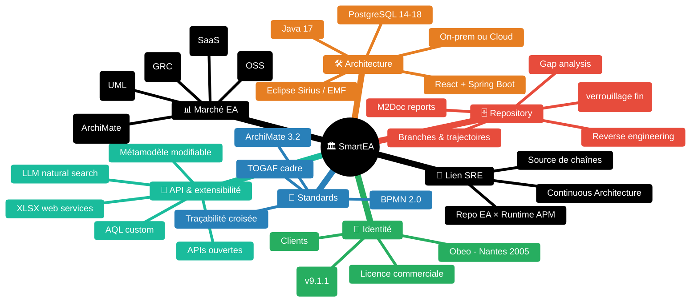

# SmartEA — Enterprise Architecture par Obeo

> *"graphical and collaborative Continuous Enterprise Architecture solution enabling you to map your organization and its IT system"* [📖¹](https://www.obeosoft.com/en/products/smartea/ "Obeo SmartEA — page produit, positionnement Continuous Enterprise Architecture")
>
> *En français* : **solution d'Enterprise Architecture continue, graphique et collaborative**, conçue pour cartographier l'organisation et son SI.

Skill construite à partir de sources officielles ([Obeo](https://www.obeosoft.com/), [Eclipse Foundation](https://www.eclipse.org/), [The Open Group](https://www.opengroup.org/) pour ArchiMate / TOGAF, [OMG](https://www.omg.org/) pour BPMN), reviews indépendantes ([Capterra](https://www.capterra.com/), [GetApp](https://www.getapp.com/)) et analystes tiers du marché EA 2026.

Le détail de chaque sujet est dans `guides/`. Cette page est l'index + les patterns à retenir + la **bibliothèque exhaustive des sources** utilisées dans la KB (voir la section en bas).

---

## Pourquoi SmartEA existe

Toute organisation au-delà de quelques dizaines d'applications a besoin de **modéliser son SI** pour :
- savoir **qui possède quoi** (équipes, applications, services, infrastructure)
- décider **où investir** dans la transformation (gap entre AS-IS et TO-BE)
- détecter les **dépendances cachées** avant qu'un changement ne casse la chaîne
- répondre aux **audits** (RGPD, conformité sectorielle, SOC2)

Trois familles d'outils répondent à ce besoin :

1. **Outils desktop mono-utilisateur** — [Archi](https://www.archimatetool.com/about/ "Archi — outil ArchiMate desktop libre, Phil Beauvoir, depuis 2010") (gratuit, ArchiMate 3.1), [Sparx EA](https://sparxsystems.com/ "Sparx Systems — Enterprise Architect, modélisation UML/SysML/ArchiMate") (UML/SysML), Modelio. Forts en modélisation, faibles en collaboration.
2. **Plateformes EA d'entreprise** — [LeanIX](https://www.leanix.net/ "LeanIX — SaaS EA, racheté par SAP, 4.7★ 446 reviews G2") (SaaS, racheté par SAP), [Bizzdesign HoriZZon](https://bizzdesign.com/ "Bizzdesign — leader marché ArchiMate, consolidation HOPEX/Alfabet sous Bizzdesign"), [MEGA HOPEX](https://www.mega.com/ "MEGA — HOPEX, EA + GRC, gros français"), [Avolution Abacus](https://www.avolutionsoftware.com/ "Avolution — Abacus, multi-framework TOGAF/ArchiMate/DoDAF").
3. **SmartEA** — solution française d'Obeo positionnée entre les deux : **repository collaboratif d'entreprise** (branches, gap analysis, multi-utilisateur) + **standards ouverts à jour** (ArchiMate 3.2, BPMN 2.0) + **stack Eclipse Sirius** maîtrisée par l'éditeur.

> *"Founded in 2005, Obeo is a leading independent software vendor specializing in Model-Based Systems Engineering (MBSE), Enterprise Architecture (EA), and other domain-specific modeling needs."* [📖²](https://www.obeosoft.com/en/company/ "Obeo — page Company, fondation 2005, MBSE + EA + DSL")
>
> *En français* : **Obeo est un éditeur indépendant français fondé en 2005**, spécialisé dans l'ingénierie système basée modèle (MBSE), l'EA et les langages de modélisation métier.

---

## Carte de navigation — sujets SmartEA

| 🏢 Identité | 🛠️ Architecture | 📐 Standards | 🗄️ Repository | 🔌 API | 📊 Marché | 🔗 SRE |
|:---:|:---:|:---:|:---:|:---:|:---:|:---:|
| [Positionnement](guides/positionnement.md) | [Architecture technique](guides/architecture.md) | [Standards de modélisation](guides/standards-modelisation.md) | [Repository collaboratif](guides/repository.md) | [API & extensibilité](guides/api-extensibilite.md) | [Comparaison alternatives](guides/comparaison-alternatives.md) | [Lien SRE / Continuous Architecture](guides/sre-link.md) |

---

## Identité produit en bref

| Dimension | Valeur | Source |
|---|---|---|
| Éditeur | Obeo (Nantes, France) — bureaux Paris, Toulouse, Vancouver | [📖²](https://www.obeosoft.com/en/company/ "Obeo — Company") |
| Année de fondation Obeo | 2005 | [📖²](https://www.obeosoft.com/en/company/ "Obeo — Company") |
| Marketplace Eclipse | Listing depuis le 8 juin 2012, **License : Commercial** | [📖³](https://marketplace.eclipse.org/content/obeo-smartea "Eclipse Marketplace — Obeo SmartEA, license commercial") |
| Version courante | **9.1.1** (sortie 31 mars 2026) | [📖⁴](https://www.obeosoft.com/en/products/smartea/changelog "Obeo SmartEA — Changelog officiel") |
| Cycle de release | ~4 versions majeures par an (v8.4 mai 2025 → v9.1 mars 2026) | [📖⁴](https://www.obeosoft.com/en/products/smartea/changelog "Obeo SmartEA — Changelog officiel") |
| Tarification | Modèle commercial B2B sur devis (per-user pricing — pas de tarif public) | [📖⁵](https://www.capterra.com/p/231378/Obeo-SmartEA/ "Capterra — Obeo SmartEA, pricing model") |
| Clients EA documentés | **Chorégie** (groupe mutualiste santé), **MAIF** (assurance) — Obeo groupe : Thales, Airbus, Safran, CEA, ESA, Rolls-Royce | [📖⁶](https://www.obeosoft.com/en/company/customers/ "Obeo — page Clients, ~200 clients groupe") |
| Notation utilisateurs | **0 reviews** publiques sur Capterra/G2 — visibilité publique faible | [📖⁵](https://www.capterra.com/p/231378/Obeo-SmartEA/ "Capterra — Obeo SmartEA, 0 reviews") |

---

## Stack technique en bref

| Couche | Composant | Note |
|---|---|---|
| Cœur de modélisation | **Eclipse Sirius** + EMF | Sirius créé par Obeo et Thales, open source [📖⁷](https://newsroom.eclipse.org/eclipse-newsletter/2023/october/revolutionizing-graphical-modeling-eclipse-sirius-web "Eclipse Newsroom — Sirius Web, octobre 2023") |
| Runtime serveur | Java 17 | v9.1.1 [📖⁴](https://www.obeosoft.com/en/products/smartea/changelog "Obeo SmartEA — Changelog") |
| Persistence | PostgreSQL 14.x → 18.x | v9.1.1 [📖⁴](https://www.obeosoft.com/en/products/smartea/changelog "Obeo SmartEA — Changelog") |
| UI web | **React + Spring Boot + GraphQL** | via Sirius Web [📖⁷](https://newsroom.eclipse.org/eclipse-newsletter/2023/october/revolutionizing-graphical-modeling-eclipse-sirius-web "Eclipse Newsroom — Sirius Web") |
| Auth | **SSO OpenID Connect ou LDAP** | [📖⁸](https://www.obeosoft.com/en/products/smartea/features "Obeo SmartEA — Features") |
| Modes de déploiement | **On-premise** (vous hébergez) ou **Cloud** managé Obeo | [📖¹](https://www.obeosoft.com/en/products/smartea/ "Obeo SmartEA — Product, deployment modes") |

> ⚠️ **Pas de SaaS multi-tenant pure** — chaque client a son instance dédiée (on-prem ou cloud Obeo). Différenciateur fort vs LeanIX qui est un SaaS shared.

---

## Standards supportés

> *"Support of ArchiMate 3.2"* + *"Support of BPMN® 2.0"* [📖⁸](https://www.obeosoft.com/en/products/smartea/features "Obeo SmartEA — Features, ArchiMate 3.2 + BPMN 2.0")
>
> *En français* : **ArchiMate 3.2 et BPMN 2.0 supportés** au niveau métamodèle complet et notation graphique.

| Standard | Version | Couverture | Détail |
|---|---|---|---|
| **ArchiMate®** | 3.2 | Toutes couches : Business / Application / Technology / Strategy / Implementation & Migration / Motivation, derived relationships | [📖⁸](https://www.obeosoft.com/en/products/smartea/features "Obeo — Features, ArchiMate 3.2") |
| **BPMN 2.0** | 2.0 | Métamodèle + notation, **export OMG BPMN2 XML** depuis v8.3.0 | [📖⁸](https://www.obeosoft.com/en/products/smartea/features "Obeo — Features, BPMN 2.0") |
| **TOGAF®** | — | Cité comme cadre méthodologique sous-jacent (pas un éditeur d'ADM dédié) | [📖⁹](https://www.obeosoft.com/en/products/smartea/solution "Obeo — Solution, ArchiMate + TOGAF") |
| Traçabilité ArchiMate ↔ BPMN | — | *« objects can be linked together to establish traceability relations between high level processes defined with ArchiMate and their equivalence defined more precisely with BPMN »* [📖¹⁰](https://www.obeosoft.com/en/products/smartea/whatsnew-4-0 "Obeo — What's New 4.0, traçabilité ArchiMate ↔ BPMN") | Process haut niveau ArchiMate → raffinement BPMN |
| UML / SysML / C4 / NAF / DoDAF / FEAF | ❌ | **Non supporté** par SmartEA. UML/SysML couverts par [Capella](https://www.eclipse.org/capella/ "Capella — Eclipse, MBSE, autre produit Obeo") (autre produit Obeo) | — |

---

## Capacités fonctionnelles à retenir

### Repository collaboratif

> *"based on a common repository that can be shared between all the members of your Enterprise Architecture team"* + *"Several architects can simultaneously work consistently and coherently on the same repository, with any changes only locking the specific modified elements"* [📖⁸](https://www.obeosoft.com/en/products/smartea/features "Obeo — Features, repository collaboratif et verrouillage fin")
>
> *En français* : **repository unique partagé** par toute l'équipe EA, avec **verrouillage au niveau de l'objet** modifié — pas du modèle entier. Plusieurs architectes peuvent éditer simultanément des éléments différents.

### Branches & trajectoires de transformation

> *"Obeo SmartEA provides a branch mechanism for defining transformation trajectories, allowing users to work simultaneously on different versions of the same architecture and compare or merge branches"* [📖⁸](https://www.obeosoft.com/en/products/smartea/features "Obeo — Features, branches type Git pour trajectoires")
>
> *En français* : **mécanisme de branches type Git** pour modéliser des trajectoires de transformation et comparer / fusionner des scénarios concurrents. Différenciateur fort vs LeanIX et Bizzdesign.

### Gap analysis

> *"Gap analysis: compare current and potential architectures"* [📖⁸](https://www.obeosoft.com/en/products/smartea/features "Obeo — Features, gap analysis AS-IS / TO-BE")
>
> *En français* : **analyse d'écart native** entre AS-IS et TO-BE.

### Reverse engineering

> *"The numerous reference data sources (excel files, application execution logs, infrastructure repositories, etc.) can be reverse modeled, synthesized and integrated"* [📖⁹](https://www.obeosoft.com/en/products/smartea/solution "Obeo — Solution, reverse engineering depuis Excel / logs / CMDB")
>
> *En français* : **cartographie automatique** depuis Excel, logs applicatifs et CMDB → import dans le repository centralisé.

### Génération de rapports Word (M2Doc)

> *"Obeo SmartEA 4.0 natively recognizes M2Doc document templates to generate MS Word documents from your repository"* [📖¹⁰](https://www.obeosoft.com/en/products/smartea/whatsnew-4-0 "Obeo — What's New 4.0, génération Word via M2Doc")
>
> *En français* : **génération de documents Word** via templates M2Doc (technologie Obeo).

### Recherche en langage naturel via LLM

> *"Natural language search generating AQL queries via large language models"* [📖⁴](https://www.obeosoft.com/en/products/smartea/changelog "Obeo — Changelog, recherche LLM beta v8.2.0")
>
> *En français* : **recherche en langage naturel via LLM** (beta v8.2.0) qui traduit la requête utilisateur en requête AQL exécutable sur le repo.

---

## API & extensibilité

> *"Obeo SmartEA open APIs allow for connectors that can supply the repository according to your needs"* [📖⁸](https://www.obeosoft.com/en/products/smartea/features "Obeo — Features, APIs ouvertes")
>
> *En français* : **APIs ouvertes** pour brancher n'importe quelle source de données. Couplé à **AQL** (Acceleo Query Language, héritage Sirius) et au **métamodèle modifiable**, l'extensibilité couvre :

- **Imports/exports Excel typés** via web services (v9.1.0)
- **Services AQL custom** (requêtes, attributs dérivés, fonctions sémantiques)
- **Métamodèle, vues et connecteurs sur-mesurables**
- ⚠️ **Pas de catalogue documenté de connecteurs natifs** Confluence / JIRA / ServiceNow / webhooks — APIs ouvertes oui, mais peu de connecteurs out-of-the-box visibles dans la doc publique.

---

## Marché EA — où se positionne SmartEA

| Concurrent | Positionnement | Différenciateur vs SmartEA |
|---|---|---|
| **[LeanIX](https://www.leanix.net/ "LeanIX — SaaS EA, racheté par SAP")** (SAP) | SaaS pure, portfolio-centric, 4.7★ 446 reviews G2 | LeanIX = SaaS multi-tenant moderne, gros marché ; SmartEA = on-prem / cloud dédié, plus modélisation pure ArchiMate |
| **[Sparx EA](https://sparxsystems.com/ "Sparx Systems — Enterprise Architect")** | Desktop UML/SysML/ArchiMate, marché développeur, 3.7★ 203 reviews | Sparx couvre UML/SysML que SmartEA n'a pas ; SmartEA offre vraie collaboration web et branches |
| **[Bizzdesign HoriZZon](https://bizzdesign.com/ "Bizzdesign — HoriZZon, leader ArchiMate, consolidation HOPEX/Alfabet")** | Leader ArchiMate mainstream, consolidation HOPEX + Alfabet sous la marque Bizzdesign | Bizzdesign = leader marché ; SmartEA = niche francophone, plus léger, branches plus fortes |
| **[MEGA HOPEX](https://www.mega.com/ "MEGA — HOPEX, EA + GRC")** | EA + GRC + risk, gros français | HOPEX intègre GRC/conformité ; SmartEA = EA pure, modulaire, sans GRC |
| **[Avolution Abacus](https://www.avolutionsoftware.com/ "Avolution — Abacus, multi-framework")** | Multi-framework (TOGAF/ArchiMate/DoDAF), forte analytique | ABACUS plus large multi-framework ; SmartEA mieux ancré ArchiMate+BPMN+Sirius |
| **[Archi](https://www.archimatetool.com/about/ "Archi — outil ArchiMate desktop OSS")** (OSS) | Outil ArchiMate gratuit le plus populaire (Phil Beauvoir, depuis 2010, ArchiMate 3.1) | Archi = desktop mono-utilisateur gratuit ; SmartEA = repo collaboratif d'entreprise |
| **[Modelio](https://www.modelio.org/ "Modelio — UML/BPMN/ArchiMate open source")** (OSS) | UML + BPMN + ArchiMate, open source | Modelio open source et UML-natif ; SmartEA commercial, web-natif via Sirius Web |

> 📊 **Tendance marché 2025-2026** : *"SAP's acquisition of LeanIX and the full unification of MEGA HOPEX, Alfabet, and Horizzon under the Bizzdesign brand"* [📖¹¹](https://digitalmehmet.com/2026/03/04/enterprise-architecture-tooling-in-2026/ "Digitalmehmet — Enterprise Architecture Tooling in 2026") → consolidation forte autour de **SAP-LeanIX** et **Bizzdesign**. SmartEA reste un acteur indépendant français.

---

## Forces et limites synthétiques

### 🟢 Forces

1. **Stack open source maîtrisée par l'éditeur** : Obeo est l'éditeur de Sirius/EMF/Sirius Web sur lesquels SmartEA s'appuie → pérennité technique forte.
2. **Standards officiels à jour** : ArchiMate 3.2 + BPMN 2.0 (export OMG XML), traçabilité native ArchiMate ↔ BPMN.
3. **Branches type Git pour trajectoires** : différenciateur fort sur la modélisation de scénarios concurrents.
4. **Métamodèle / vues / connecteurs sur-mesurables** : adaptabilité forte aux contextes métier spécifiques.
5. **Cycle de release soutenu** : 4 versions majeures en 12 mois (v8.4 → v9.1) avec investissement IA visible (recherche LLM → AQL).

### 🟡 Limites

1. **Visibilité publique faible** : 0 reviews Capterra/G2, communauté restreinte vs LeanIX/Sparx → benchmarking difficile.
2. **Pas de SaaS multi-tenant** : déploiement on-prem ou cloud dédié → plus lourd qu'un LeanIX SaaS pure.
3. **Tarification opaque** : pas de prix publics, achat sur devis uniquement.
4. **UML/SysML absents** : ceux qui veulent unifier EA + ingénierie système combinent SmartEA + Capella (autre produit Obeo).
5. **Catalogue connecteurs natifs limité** publiquement : Excel + APIs ouvertes ; pas de marketplace Confluence/JIRA/ServiceNow visible.

---

## Anti-patterns à éviter

| Anti-pattern | D'où ça vient | Conséquence |
|---|---|---|
| Dupliquer la modélisation EA dans une autre couche (SRE, observabilité, CMDB) | Refus de consommer le repo EA, syndrome NIH | Drift inévitable entre les sources, charge double de maintenance |
| Vouloir SaaS multi-tenant avec SmartEA | Confusion avec LeanIX | SmartEA n'est **pas** un SaaS shared — chaque client a son instance |
| Modéliser tout en BPMN niveau 3 (exécutable) sans besoin métier | Sur-ingénierie | BPMN 2.0 est puissant mais lourd à maintenir — réserver à des process critiques avec moteur d'exécution |
| Stocker les credentials d'un connecteur dans le métamodèle SmartEA | Confusion avec une CMDB | Les credentials vont dans un coffre (Vault, Conjur, ExternalSecrets), le métamodèle EA pointe via référence |
| Ignorer le repo EA quand on cartographie les chaînes de valeur SRE | Top-down / bottom-up exclusifs | Cf. doctrine *3 vues croisées* — voir [`guides/sre-link.md`](guides/sre-link.md) |

---

## Cheatsheet — versions et liens essentiels

| Action | Référence |
|---|---|
| Site officiel | https://www.obeosoft.com/ |
| Page produit SmartEA | https://www.obeosoft.com/en/products/smartea/ |
| Features détaillées | https://www.obeosoft.com/en/products/smartea/features |
| Solution / cas d'usage | https://www.obeosoft.com/en/products/smartea/solution |
| Changelog (versions) | https://www.obeosoft.com/en/products/smartea/changelog |
| Eclipse Marketplace | https://marketplace.eclipse.org/content/obeo-smartea |
| Spec ArchiMate 3.2 | https://pubs.opengroup.org/architecture/archimate3-doc/ |
| Spec BPMN 2.0 | https://www.omg.org/spec/BPMN/2.0/ |
| TOGAF Standard | https://pubs.opengroup.org/togaf-standard/ |

---

## Glossaire rapide

- **EA** — Enterprise Architecture, discipline de modélisation du SI et de son alignement avec la stratégie métier.
- **ArchiMate** — Langage de modélisation EA standardisé par The Open Group (couches Business / Application / Technology / Strategy / Implementation & Migration / Motivation).
- **BPMN 2.0** — Business Process Model and Notation, standard OMG pour la modélisation et notation de processus métier (3 niveaux : descriptif, analytique, exécutable).
- **TOGAF** — Framework méthodologique d'EA de The Open Group, dont l'**ADM** (Architecture Development Method) est le cœur méthodo.
- **MBSE** — Model-Based Systems Engineering, ingénierie système basée modèles (couvert par Capella, autre produit Obeo).
- **Eclipse Sirius** — Framework open source créé par Obeo + Thales pour bâtir des éditeurs graphiques sur des modèles EMF.
- **Sirius Web** — Évolution web-native de Sirius (React + Spring Boot + PostgreSQL + GraphQL).
- **EMF** — Eclipse Modeling Framework, bibliothèque Eclipse pour définir des métamodèles.
- **AQL** — Acceleo Query Language, langage de requête sur modèles EMF utilisé par Sirius / SmartEA.
- **M2Doc** — Technologie Obeo pour générer des documents Word à partir de modèles EMF + templates.
- **Repository** — Base centralisée multi-utilisateur où vivent les modèles SmartEA, avec verrouillage fin et branches.
- **Gap analysis** — Comparaison AS-IS (état actuel) vs TO-BE (état cible) avec identification des écarts.
- **Trajectoire de transformation** — Séquence d'étapes intermédiaires entre AS-IS et TO-BE, modélisable via les branches SmartEA.

---

## Bibliothèque exhaustive des sources

Toutes les URLs citées dans les guides (`guides/*.md`), groupées par famille.
Chaque lien porte un **tooltip** (survol) avec l'auteur et la précision du sujet.
Format des citations inline dans les guides : `[📖n](url "tooltip")`.

### 🔖 Conventions de sourcing

- `[📖n](url)` — citation **vérifiée verbatim** dans la source pointée
- `⚠️` — reformulation pédagogique ou principe consensuel **non cité verbatim**
- Les formulations attribuées à une source mais **non retrouvées** ont été retirées

---

### Documentation officielle Obeo

- **[Obeo — Page produit SmartEA](https://www.obeosoft.com/en/products/smartea/ "Obeo SmartEA — page produit, deployment modes")** — Vue d'ensemble + modes de déploiement
- **[Obeo — Solution](https://www.obeosoft.com/en/products/smartea/solution "Obeo SmartEA — page solution, reverse modeling")** — Positionnement, reverse modeling, intégrations source
- **[Obeo — Features](https://www.obeosoft.com/en/products/smartea/features "Obeo SmartEA — features, ArchiMate 3.2 + BPMN 2.0 + repository + branches")** — Liste features (ArchiMate 3.2, BPMN 2.0, SSO, branches, gap, recherche)
- **[Obeo — What's New 4.0](https://www.obeosoft.com/en/products/smartea/whatsnew-4-0 "Obeo SmartEA — What's New 4.0, M2Doc + traçabilité ArchiMate↔BPMN")** — Gap analysis détaillée, ArchiMate ↔ BPMN, M2Doc
- **[Obeo — Changelog](https://www.obeosoft.com/en/products/smartea/changelog "Obeo SmartEA — changelog officiel, versions 8.x → 9.x")** — Versions, stack technique, recherche LLM
- **[Obeo — Company](https://www.obeosoft.com/en/company/ "Obeo — page Company, fondation 2005, MBSE/EA/DSL")** — Société, fondation 2005, expertise MBSE/EA/DSL
- **[Obeo — Customers](https://www.obeosoft.com/en/company/customers/ "Obeo — page Clients, ~200 clients groupe")** — Liste clients, case studies (~200 clients groupe)
- **[Obeo News — SmartEA 1.5](https://news.obeosoft.com/en/post/obeo-smartea-1-5-leverage-a-reliable-and-up-to-date-enterprise-architecture-repository "Obeo News — annonce v1.5, repository fiable et à jour")** — Annonce v1.5, principe du repository fiable

### Eclipse / écosystème open source

- **[Eclipse Marketplace — Obeo SmartEA](https://marketplace.eclipse.org/content/obeo-smartea "Eclipse Marketplace — Obeo SmartEA, license commercial, depuis 2012")** — Listing officiel Eclipse, license commercial
- **[Eclipse Newsroom — Sirius Web (octobre 2023)](https://newsroom.eclipse.org/eclipse-newsletter/2023/october/revolutionizing-graphical-modeling-eclipse-sirius-web "Eclipse Newsroom — Sirius Web, stack React + Spring + PostgreSQL + GraphQL")** — Stack web Sirius (React, Spring Boot, PostgreSQL, GraphQL)
- **[Eclipse Capella](https://www.eclipse.org/capella/ "Capella — Eclipse, MBSE, produit Obeo")** — MBSE / ingénierie système (autre produit Obeo)

### Standards officiels

- **[The Open Group — ArchiMate 3.2 Specification](https://pubs.opengroup.org/architecture/archimate3-doc/ "ArchiMate 3.2 — spécification officielle The Open Group")** — Spec officielle ArchiMate 3.2
- **[The Open Group — TOGAF Standard](https://pubs.opengroup.org/togaf-standard/ "TOGAF Standard — The Open Group")** — TOGAF Standard
- **[OMG — BPMN 2.0 Specification](https://www.omg.org/spec/BPMN/2.0/ "BPMN 2.0 — spécification OMG")** — Spec BPMN 2.0 (OMG)

### Reviews et marché

- **[Capterra — Obeo SmartEA](https://www.capterra.com/p/231378/Obeo-SmartEA/ "Capterra — Obeo SmartEA, 0 reviews, pricing per-user")** — Pricing model, alternatives, 0 reviews
- **[GetApp — Obeo SmartEA](https://www.getapp.com/development-tools-software/a/obeo-smartea/ "GetApp — Obeo SmartEA, features, training")** — Features, training, support
- **[Digitalmehmet — EA Tooling 2026](https://digitalmehmet.com/2026/03/04/enterprise-architecture-tooling-in-2026/ "Digitalmehmet — EA Tooling 2026, consolidation marché")** — Marché EA 2026, consolidation LeanIX/Bizzdesign

### Concurrents (référence rapide)

- **[Archi — Phil Beauvoir](https://www.archimatetool.com/about/ "Archi — outil ArchiMate desktop OSS, depuis 2010")** — Concurrent OSS desktop
- **[Sparx Systems Enterprise Architect](https://sparxsystems.com/ "Sparx Systems — Enterprise Architect, UML/SysML/ArchiMate")** — Concurrent UML/SysML
- **[LeanIX (SAP)](https://www.leanix.net/ "LeanIX — SaaS EA, racheté par SAP")** — Concurrent SaaS
- **[Bizzdesign HoriZZon](https://bizzdesign.com/ "Bizzdesign — HoriZZon, leader ArchiMate")** — Leader marché ArchiMate
- **[MEGA HOPEX](https://www.mega.com/ "MEGA — HOPEX, EA + GRC")** — Concurrent EA + GRC français
- **[Avolution Abacus](https://www.avolutionsoftware.com/ "Avolution — Abacus, multi-framework EA")** — Concurrent multi-framework
- **[Modelio](https://www.modelio.org/ "Modelio — UML/BPMN/ArchiMate OSS")** — Concurrent OSS

## Crédits & licences

Les citations issues d'Obeo (obeosoft.com et news.obeosoft.com) sont reproduites pour usage documentaire. Spec ArchiMate 3.2, TOGAF Standard, BPMN 2.0 : © The Open Group / OMG, accessibles via leurs portails publics. Eclipse Sirius, EMF, Sirius Web : Eclipse Public License 2.0.
