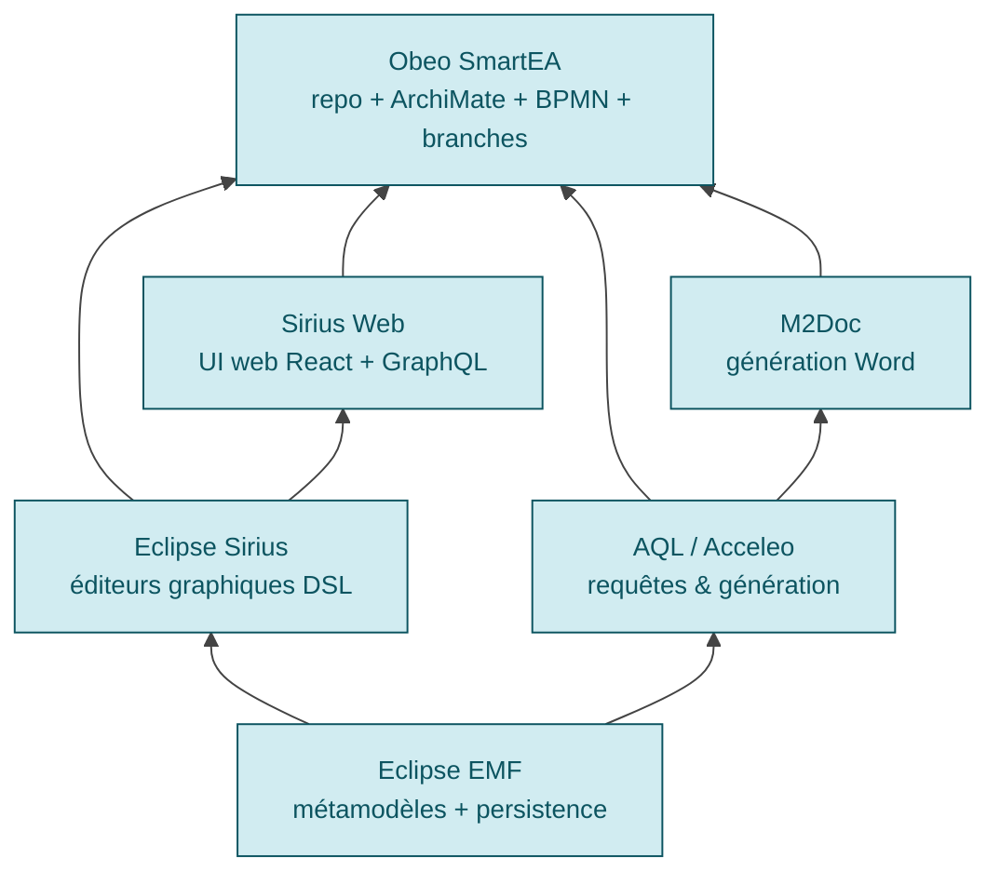

# SmartEA — Architecture technique

## Cœur Eclipse Sirius / EMF

> *"SmartEA 2.0 now uses Eclipse Sirius, the Open Source leading technology to create visual custom representations"* + Sirius *"was created by Obeo and Thales"* [📖¹](https://marketplace.eclipse.org/content/obeo-smartea "Eclipse Marketplace — Obeo SmartEA, Sirius créé par Obeo et Thales")
>
> *En français* : **le cœur technique de SmartEA est Eclipse Sirius**, framework open source de modélisation graphique créé par Obeo et Thales.

La pile de modélisation s'empile ainsi (du bas vers le haut) :

Chaque couche est **open source maintenue par Obeo** ou par la fondation Eclipse avec contribution Obeo majoritaire — ce qui rend SmartEA peu dépendant d'éditeurs tiers pour faire évoluer son cœur.

## Stack web : Sirius Web

> *"Sirius Web's technical foundation leverages the latest web technologies, including React, Spring Boot, PostgreSQL, and GraphQL"* [📖²](https://newsroom.eclipse.org/eclipse-newsletter/2023/october/revolutionizing-graphical-modeling-eclipse-sirius-web "Eclipse Newsroom — Sirius Web, octobre 2023")
>
> *En français* : **le socle web de Sirius (et donc de SmartEA Web) est React, Spring Boot, PostgreSQL et GraphQL**.

| Couche | Technologie |
|---|---|
| Frontend | **React** |
| API | **GraphQL** |
| Backend | **Spring Boot** (Java) |
| Persistence | **PostgreSQL** |

L'interface web SmartEA utilise donc des standards courants — pas de stack maison exotique. Cela facilite l'intégration dans des SI existants (reverse proxy, monitoring, déploiement K8s).

## Prérequis runtime — version 9.1.1

> Source : [📖³](https://www.obeosoft.com/en/products/smartea/changelog "Obeo SmartEA — Changelog officiel, prérequis v9.1.1")

| Composant | Version |
|---|---|
| **Java** | 17 |
| **Eclipse** (client lourd) | 2023-03 (4.27) |
| **Eclipse Sirius** | 7.4.9 |
| **Sirius Components** | 2026.1.0 |
| **PostgreSQL** | 14.x → 18.x |

L'**alignement Java 17** correspond à un LTS récent largement déployé en entreprise. PostgreSQL 14-18 couvre toutes les versions encore supportées upstream.

## Deux interfaces co-existent

SmartEA propose historiquement deux clients :

| Client | Public | État |
|---|---|---|
| **Eclipse desktop** (RCP) | Architectes EA experts qui ont besoin de la modélisation avancée | Toujours maintenu, parité progressive avec le web |
| **Web (Sirius Web)** | Utilisateurs étendus (managers, équipes métier) qui consultent et éditent | En montée en puissance, **édition complète web atteinte en v9.0** ([📖³](https://www.obeosoft.com/en/products/smartea/changelog "Obeo SmartEA — Changelog, v9.0 'Completed web browser editing functions'")) |

> ⚠️ **Migration desktop → web en cours** : les versions 8.x à 9.x complètent progressivement les fonctions d'édition web. Pour un déploiement neuf, prévoir que certaines opérations très spécialisées peuvent encore nécessiter le client desktop pendant un temps.

## Modes de déploiement

> *"On-Premise: You host: install the publication server on your own IT infrastructure"* + *"Cloud: We host: we manage the publication server on a cloud infrastructure"* [📖⁴](https://www.obeosoft.com/en/products/smartea/ "Obeo SmartEA — page produit, deployment modes")
>
> *En français* : **deux modes** — **on-premise** (vous hébergez chez vous) ou **cloud managé Obeo** (Obeo héberge sur son infrastructure cloud, instance dédiée par client).

| Mode | Avantages | Limites |
|---|---|---|
| **On-premise** | Contrôle total, données chez vous, intégration LDAP/PKI interne triviale | Vous gérez l'OS, PostgreSQL, sauvegardes, montées de version |
| **Cloud Obeo** | Obeo gère la stack, mises à jour automatiques, pas d'IT interne mobilisée | Données chez Obeo (vérifier conformité RGPD / sectorielle), latence selon hébergeur |

> ⚠️ **Pas de SaaS multi-tenant pure** — chaque client a son **instance dédiée**. Différenciateur fort vs [LeanIX](https://www.leanix.net/ "LeanIX — SaaS multi-tenant SAP") qui est un SaaS shared. Cela évite les problématiques de confidentialité multi-tenant mais demande un setup par client.

## Authentification

> *"Access to the repository is secured (SSO OpenId Connect or LDAP)"* [📖⁵](https://www.obeosoft.com/en/products/smartea/features "Obeo SmartEA — Features, SSO OIDC ou LDAP")
>
> *En français* : **accès sécurisé au repository via SSO OpenID Connect ou LDAP**.

| Mécanisme | Statut |
|---|---|
| **SSO OpenID Connect** | ✅ Documenté |
| **LDAP / Active Directory** | ✅ Documenté |
| SAML 2.0 | ⚠️ Non explicitement documenté dans les sources publiques |
| Profils utilisateur customisables | ✅ *"customizable profiles"* [📖⁵](https://www.obeosoft.com/en/products/smartea/features "Obeo SmartEA — Features, profils customisables") |

L'absence explicite de SAML peut être un point de blocage dans certaines organisations qui n'ont pas d'IdP OIDC — vérifier auprès d'Obeo en avant-vente.

## Performances et concurrence

SmartEA permet la **co-édition multi-utilisateur** sur le même repo avec verrouillage fin :

> *"Several architects can simultaneously work consistently and coherently on the same repository, with any changes only locking the specific modified elements"* [📖⁵](https://www.obeosoft.com/en/products/smartea/features "Obeo SmartEA — Features, verrouillage au niveau de l'objet")
>
> *En français* : **plusieurs architectes éditent en parallèle**, avec **verrouillage uniquement au niveau de l'objet modifié** (pas du modèle entier).

Cela évite le pattern *« le modèle est ouvert par X, on attend »* fréquent en outils desktop mono-utilisateur.

## Sauvegarde / restauration

Le repo SmartEA est persisté en **PostgreSQL**, donc les pratiques standard PostgreSQL s'appliquent :
- `pg_dump` / `pg_restore` pour backup logique
- `pg_basebackup` + WAL archiving pour PITR (point-in-time recovery)
- réplication streaming pour HA

Les modèles eux-mêmes peuvent être exportés en formats neutres (XMI ArchiMate, BPMN XML, Excel) pour archive long terme indépendante de la version SmartEA.

## Liens

- [`positionnement.md`](positionnement.md) — Identité Obeo et marché
- [`standards-modelisation.md`](standards-modelisation.md) — ArchiMate / BPMN / TOGAF
- [`api-extensibilite.md`](api-extensibilite.md) — APIs et scripting AQL
- [`repository.md`](repository.md) — Capacités collaboratives détaillées
