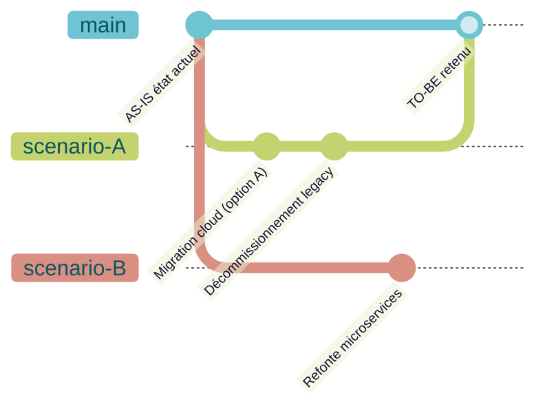

# SmartEA — Repository collaboratif

## Le principe : un repo unique partagé

> *"based on a common repository that can be shared between all the members of your Enterprise Architecture team, with secured access (SSO OpenId Connect or LDAP) and customizable profiles"* [📖¹](https://www.obeosoft.com/en/products/smartea/features "Obeo SmartEA — Features, repository commun")
>
> *En français* : **un repository unique partagé** entre tous les membres de l'équipe EA, avec accès sécurisé (SSO OIDC ou LDAP) et profils utilisateur customisables.

C'est le différenciateur fondamental face aux outils desktop mono-utilisateur ([Archi](https://www.archimatetool.com/about/ "Archi — desktop mono-utilisateur, OSS"), [Sparx EA](https://sparxsystems.com/ "Sparx EA — desktop principalement") en mode standalone) : tout le monde travaille sur le **même modèle**, en temps réel.

## Verrouillage fin (object-level)

> *"Several architects can simultaneously work consistently and coherently on the same repository, with any changes only locking the specific modified elements"* [📖¹](https://www.obeosoft.com/en/products/smartea/features "Obeo SmartEA — Features, verrouillage au niveau de l'objet modifié")
>
> *En français* : **verrouillage uniquement au niveau de l'objet modifié** — pas du modèle entier ni du diagramme entier.

Conséquence pratique : 5 architectes peuvent éditer en parallèle 5 `ApplicationComponent` distincts du même Application Layer sans se gêner. Pattern *« le modèle est pris par X »* évité.

## Branches & trajectoires de transformation

> *"Obeo SmartEA provides a branch mechanism for defining transformation trajectories, allowing users to work simultaneously on different versions of the same architecture and compare or merge branches"* [📖¹](https://www.obeosoft.com/en/products/smartea/features "Obeo SmartEA — Features, branches type Git pour trajectoires")
>
> *En français* : **mécanisme de branches type Git** pour modéliser des trajectoires de transformation — éditer en parallèle plusieurs versions, comparer, fusionner.

### Pattern d'usage : AS-IS / TO-BE / scénarios



Chaque scénario est une branche, comparable à `main` (AS-IS) via gap analysis. Le scénario retenu est mergé dans `main` une fois validé. Différenciateur fort vs [LeanIX](https://www.leanix.net/ "LeanIX — pas de branches type Git documentées") qui n'a pas de modèle de branches Git-like documenté.

## Gap analysis

> *"Gap analysis: compare current and potential architectures"* + v4.0 a apporté *"More detailed Gap Analysis"* [📖²](https://www.obeosoft.com/en/products/smartea/whatsnew-4-0 "Obeo SmartEA — What's New 4.0, gap analysis détaillée")
>
> *En français* : **analyse d'écart native** entre AS-IS et TO-BE, avec détail enrichi depuis v4.0.

Sortie typique :
- Liste des éléments **ajoutés** dans la cible
- Liste des éléments **supprimés** par rapport à la base
- Liste des éléments **modifiés** (attributs, relations)
- **Workpackages** dérivés (séquence d'actions pour passer de AS-IS à TO-BE)

C'est le matériau pour un programme de transformation : on dérive les chantiers concrets depuis la gap analysis.

## Reverse engineering depuis sources externes

> *"The numerous reference data sources (excel files, application execution logs, infrastructure repositories, etc.) can be reverse modeled, synthesized and integrated into a single repository"* [📖³](https://www.obeosoft.com/en/products/smartea/solution "Obeo SmartEA — Solution, reverse engineering")
>
> *En français* : **cartographie automatique** depuis Excel, logs applicatifs et repositories d'infrastructure → import dans le repository centralisé SmartEA.

Sources d'amorçage typiques :

| Source | Méthode | Sortie ArchiMate |
|---|---|---|
| **Excel** (catalogue applis) | Import natif avec onglets dédiés objets + relations | `ApplicationComponent` + `ApplicationService` + relations |
| **Logs applicatifs** | Import via APIs ouvertes + script custom | `ApplicationService` (services exposés observés) |
| **CMDB** | Import via API CMDB | `Node`, `SystemSoftware`, relations Technology Layer |
| **Cartographie existante** (autre outil EA) | Export → format pivot → import via API | Ré-instanciation des objets dans le métamodèle SmartEA |

> *"not only are objects managed by Excel import/export, but relations are also managed with dedicated tabs"* [📖²](https://www.obeosoft.com/en/products/smartea/whatsnew-4-0 "Obeo SmartEA — What's New 4.0, Excel relations dans tabs dédiés")
>
> *En français* : **Excel est citoyen de première classe** dans SmartEA — pas seulement les objets, mais aussi les **relations** sont importées/exportées via onglets Excel dédiés.

C'est important pour les organisations qui ont déjà une cartographie Excel : on ne perd rien à l'import, et on peut continuer à exporter en Excel pour les utilisateurs métier qui préfèrent ce format.

## Génération de rapports Word (M2Doc)

> *"Obeo SmartEA 4.0 natively recognizes M2Doc document templates to generate MS Word documents from your repository"* [📖²](https://www.obeosoft.com/en/products/smartea/whatsnew-4-0 "Obeo SmartEA — What's New 4.0, génération Word via M2Doc")
>
> *En français* : **génération de documents MS Word** à partir de templates [M2Doc](https://www.m2doc.org/ "M2Doc — génération de docs depuis modèles EMF, technologie Obeo") (technologie Obeo).

Pattern d'usage : un livrable d'audit ou un rapport de comité d'architecture s'auto-génère depuis le modèle SmartEA — quand le modèle change, le rapport se régénère sans réécriture manuelle.

## Recherche : AQL classique + LLM beta

### AQL — recherche standard

[AQL (Acceleo Query Language)](https://www.eclipse.org/acceleo/ "Eclipse Acceleo — AQL, langage de requête EMF") est le langage de requête historique de l'écosystème Sirius/EMF. Forme typique :

```aql
self.eContents()->select(e | e.oclIsKindOf(archimate::ApplicationComponent) and e.name.startsWith('Auth'))
```

Cette requête liste tous les `ApplicationComponent` dont le nom commence par `Auth`. AQL permet : filtrage, navigation des relations, attributs dérivés, fonctions custom.

### Recherche en langage naturel (LLM)

> *"Natural language search generating AQL queries via large language models"* (beta v8.2.0) [📖⁴](https://www.obeosoft.com/en/products/smartea/changelog "Obeo SmartEA — Changelog, recherche LLM beta v8.2.0")
>
> *En français* : **recherche en langage naturel via LLM** — la requête utilisateur en français/anglais est traduite par un LLM en requête AQL exécutable, puis exécutée sur le repo.

Exemple :

> Utilisateur : *« montre-moi toutes les applications consommant le service de paiement »*
> LLM → AQL : `self.eContents()->select(...)`
> SmartEA exécute et affiche le résultat.

Statut **beta** v8.2.0 — à surveiller en termes de coût LLM (qui paye, où le modèle tourne, gouvernance des prompts).

## Impact analysis

> *"new web impact analysis tool added to the web diagram tool palette"* (v8.5+) [📖⁴](https://www.obeosoft.com/en/products/smartea/changelog "Obeo SmartEA — Changelog, impact analysis web v8.5")
>
> *En français* : **outil d'analyse d'impact** disponible directement dans le diagramme web, depuis v8.5.

Pattern d'usage : on clique sur un `ApplicationService` → SmartEA affiche tous les `BusinessProcess`, `BusinessFunction`, autres `ApplicationService` impactés en cas de panne ou de changement.

## Vues, tableaux, matrices

SmartEA produit nativement plusieurs représentations pour le même contenu :

| Type de vue | Cas d'usage typique |
|---|---|
| **Diagramme** | Visualisation graphique d'un sous-ensemble (couche, viewpoint) |
| **Tableau** | Liste éditable d'objets d'un type (ex : tous les `ApplicationComponent` avec leur owner) |
| **Matrice** | Croisement N×M (ex : quels processus utilisent quelles applications) |
| **Dashboard** | Indicateurs agrégés (nb objets, % couverts, gap par couche) |

Ces vues sont **toutes synchronisées** avec le repository — modifier une cellule dans un tableau modifie l'objet, qui apparaît à jour dans tous les diagrammes qui le référencent.

## Versionning des modèles

Le repository SmartEA est versionné — chaque modification est enregistrée avec :
- Auteur
- Horodatage
- Branche
- Commentaire (optionnel)

Couplé aux **branches** et à la **gap analysis**, on peut comparer deux états quelconques du modèle (par exemple : « version validée comité Q1 2026 » vs « version en cours »).

## Liens

- [`architecture.md`](architecture.md) — Stack technique sous-jacente
- [`standards-modelisation.md`](standards-modelisation.md) — ArchiMate / BPMN / TOGAF
- [`api-extensibilite.md`](api-extensibilite.md) — APIs et scripting AQL pour automation
- [`sre-link.md`](sre-link.md) — Comment consommer ce repo dans une démarche SRE
