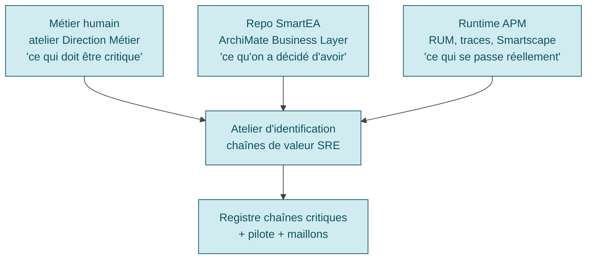
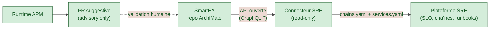

# SmartEA — Lien avec une démarche SRE / Continuous Architecture

> **Avertissement** : Obeo ne positionne **pas** SmartEA comme un outil SRE. Le rapprochement EA × SRE décrit ici est un **pattern à construire** — pas une fonctionnalité out-of-the-box. Ce guide capitalise une approche émergente (*Continuous Architecture* + *observability-driven architecture*) appliquée au cas spécifique d'une plateforme SRE qui consomme un repo EA.

---

## Pourquoi croiser EA et SRE

Une démarche SRE structurée distingue les **services** (composants applicatifs autonomes avec leur SLO) des **chaînes de valeur** (parcours utilisateur traversant N services). Cf. KB SRE : [`journey-slos-cross-service.md`](../../sre/guides/journey-slos-cross-service.md "KB SRE — Journey SLOs cross-service") et [`critical-user-journeys.md`](../../sre/guides/critical-user-journeys.md "KB SRE — Critical User Journeys").

Identifier les chaînes de valeur critiques d'une organisation est **politique** autant que technique :

| Source | Vérité de… | Manque |
|---|---|---|
| **Métier** (humain en atelier) | « ce qui doit être critique » | Le réel non observable et le couplage technique |
| **Repo EA** (ArchiMate dans SmartEA) | « ce qu'on a décidé d'avoir » | Le réel non documenté ; usage effectif inconnu |
| **Runtime APM** (RUM, traces, Smartscape) | « ce qui se passe réellement » | L'intention métier ; flux non-instrumentés |

Aucune de ces 3 sources ne suffit seule. **Leur croisement** est ce qui produit une cartographie utile et actionnable.

## Le repo SmartEA comme source d'amorçage SRE

ArchiMate dans SmartEA contient déjà ce qu'une démarche SRE veut savoir :

| Concept ArchiMate | Information utile SRE |
|---|---|
| `BusinessProcess` | Nom métier d'une chaîne de valeur (ex : *« Passer une commande »*) |
| `BusinessActor` | Acteur principal d'un parcours (ex : un type d'utilisateur, un SI partenaire) |
| `ApplicationService` | Service applicatif exposé — candidat SLO |
| `ApplicationComponent` | Application qui héberge le service — équipe propriétaire |
| `ApplicationCollaboration` | Groupement d'`ApplicationComponent` qui collaborent |
| `Flow` / `TriggeringRelationship` | Dépendances entre services — graphe pour identifier maillon faible |
| `Node`, `SystemSoftware` | Infrastructure — base pour SLI techniques |

**Pattern** : un connecteur lit le repo SmartEA via API ouverte et **pré-remplit** les inputs SRE :

- Liste des chaînes de valeur candidates (depuis `BusinessProcess` au tier critique)
- Graphe de dépendances technique (depuis `Flow` ArchiMate)
- Ownership officiel (depuis `BusinessActor` propriétaire d'un `ApplicationComponent`)
- Périmètre des SI partenaires (depuis `BusinessCollaboration` + `ApplicationInterface`)

Le SRE n'invente pas ces données — il les **consomme** depuis la source de vérité métier qu'est SmartEA.

## Pattern : confrontation 3-vues

L'atelier d'identification consomme **les 3 vues simultanément**. Chacune apporte ce que les deux autres ratent. Les **écarts** entre les vues sont le matériau le plus précieux :

| Métier | EA | APM | Interprétation |
|:---:|:---:|:---:|---|
| ✅ | ✅ | ✅ | Chaîne validée 3/3 → candidate forte |
| ✅ | ✅ | ❌ | Faible volume ou trou d'observabilité |
| ✅ | ❌ | ✅ | Trou de modélisation EA → mise à jour SmartEA |
| ❌ | ✅ | ❌ | Chaîne fantôme → dépréciation EA |
| ❌ | ❌ | ✅ | **Shadow chain** → audit gouvernance |
| ❌ | ✅ | ✅ | Métier à requalifier ou rebrand |
| ✅ | ❌ | ❌ | Chaîne désirée mais ni outillée ni visible → projet |

## Boucle de feedback : runtime APM → repo SmartEA

L'inverse aussi : le runtime APM (RUM, Smartscape, traces messaging) **détecte des choses** que le repo SmartEA ne représente pas. Trois types de signaux à remonter à rebours :

### Signal 1 — `BusinessProcess` manquant

**Symptôme runtime** : une Key User Action (RUM) avec volume significatif, pas de `BusinessProcess` ArchiMate associé.
**Lecture SmartEA** : trou de modélisation Business Layer.
**Action** : issue Urbanisme → qualifier la KUA → créer le `BusinessProcess` dans le repo SmartEA.

### Signal 2 — Flux asynchrone non modélisé

**Symptôme runtime** : un topic Kafka actif (producteur + consumer mesurés) sans `Flow` ArchiMate équivalent.
**Lecture SmartEA** : flux asynchrone non modélisé — c'est l'**angle mort EA classique**.
**Action** : modéliser le flux comme `TriggeringRelationship` ou `FlowRelationship` entre `ApplicationService`.

### Signal 3 — SI partenaire shadow

**Symptôme runtime** : appels en volume vers un hostname externe, pas de `BusinessActor` partenaire dans SmartEA.
**Lecture SmartEA** : shadow B2B — connexion non gouvernée.
**Action** : audit critique (RGPD, contrat, SLA) → modéliser dans SmartEA.

## Architecture du connecteur

### Pattern recommandé

**Règles** :

1. **Lecture seule côté SmartEA** : le connecteur SRE ne **modifie pas** le repo EA. SmartEA reste source de vérité métier.
2. **Boucle de feedback advisory only** : les dérives détectées par l'APM produisent des **PR suggestives** vers SmartEA, jamais des modifications automatiques. Pattern *advisory only* aligné avec [`llm-as-sre-advisor.md`](../../sre/guides/llm-as-sre-advisor.md "KB SRE — LLM as SRE Advisor").
3. **Cadence trimestrielle** : la synchronisation EA → SRE et le feedback APM → EA s'alignent sur la cadence naturelle de mise à jour du repo EA — pas en continu (éviter le bruit sur des dérives transitoires : feature flags, A/B test, migration).
4. **Filtrage**: le repo EA peut contenir des données sensibles (`BusinessActor` = personnes physiques). Filtrer ce qui sort du repo avant de l'envoyer à un LLM ou un service externe.

## Limites et zones d'incertitude

| Limite | Pourquoi | Atténuation |
|---|---|---|
| **Pas de connecteur SRE natif Obeo** | SmartEA n'est pas positionné SRE par Obeo | Construire le connecteur via APIs ouvertes (cf. [`api-extensibilite.md`](api-extensibilite.md)) |
| **Format API non détaillé publiquement** | Obeo ne documente pas l'API en open | Demander l'OpenAPI / GraphQL schema en avant-vente |
| **Repo EA peut être obsolète** | Maintenance EA souvent sous-investie | Métriques de fraîcheur du repo (date dernière modif par couche) avant d'utiliser comme source |
| **PII dans les `BusinessActor`** | Personnes physiques modélisées | Filtrage côté connecteur avant tout envoi externe |
| **Branches multiples = vue ambiguë** | SmartEA a des branches Git-like | Toujours lire la branche `main` (ou la branche désignée comme « source de vérité runtime ») |

## Maturité et adoption

> **🟡 Confiance 5/10** sur ce pattern global — il est **émergent** dans la communauté EA / SRE. Aucune source canonique unique ne le décrit complet (pas de Google SRE workbook chapter dédié, pas de papier ACM Queue spécifique). Les briques individuelles sont solides :
> - **EA + observability** est discuté en *Continuous Architecture* (Pierre Pureur, Murat Erder, livre éponyme)
> - **Runtime feedback to architecture** est une mouvance récente (2023+) sans nom canonique stable
> - **Shadow IT detection via APM** est un cas d'usage Dynatrace / Datadog documenté
>
> La **valeur** du pattern complet (croisement Métier × EA × APM avec boucles bidirectionnelles) est à **valider expérimentalement** sur 2-3 chaînes pilotes avant généralisation.

## Liens

- [`repository.md`](repository.md) — Capacités du repo SmartEA
- [`api-extensibilite.md`](api-extensibilite.md) — APIs disponibles pour construire le connecteur
- [`standards-modelisation.md`](standards-modelisation.md) — Concepts ArchiMate utilisés
- KB SRE : [`journey-slos-cross-service.md`](../../sre/guides/journey-slos-cross-service.md "KB SRE — SLO de chaîne, maillon faible")
- KB SRE : [`critical-user-journeys.md`](../../sre/guides/critical-user-journeys.md "KB SRE — Critical User Journeys")
- KB SRE : [`llm-as-sre-advisor.md`](../../sre/guides/llm-as-sre-advisor.md "KB SRE — Pattern advisory only LLM")
- KB SRE : [`knowledge-indexing-strategy.md`](../../sre/guides/knowledge-indexing-strategy.md "KB SRE — Indexer plutôt que dupliquer")
