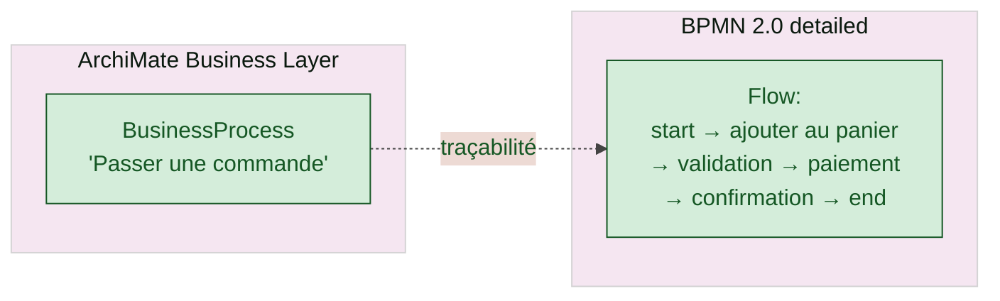

# SmartEA — Standards de modélisation

## ArchiMate 3.2

> *"Support of ArchiMate 3.2"* + *"ArchiMate® is 'The Open Group' standardised modeling language"* [📖¹](https://www.obeosoft.com/en/products/smartea/features "Obeo SmartEA — Features, support ArchiMate 3.2")
>
> *En français* : **ArchiMate 3.2 est intégralement supporté** — c'est un langage de modélisation standardisé par The Open Group.

### Couches ArchiMate

ArchiMate organise la modélisation EA en **6 couches** orthogonales, toutes prises en charge par SmartEA :

| Couche | Concepts clés | Usage typique |
|---|---|---|
| **Strategy** | `Resource`, `Capability`, `CourseOfAction` | Modélisation stratégique haute (alignement business / objectifs) |
| **Business** | `BusinessActor`, `BusinessProcess`, `BusinessFunction`, `BusinessService`, `BusinessObject` | Métier : qui fait quoi, processus, services métier |
| **Application** | `ApplicationComponent`, `ApplicationService`, `ApplicationInterface`, `DataObject` | Cartographie applicative : applis, services exposés, interfaces |
| **Technology** | `Node`, `Device`, `SystemSoftware`, `TechnologyService`, `Path`, `Network` | Infrastructure : serveurs, OS, réseaux |
| **Implementation & Migration** | `WorkPackage`, `Deliverable`, `Plateau`, `Gap` | Trajectoires de transformation, jalons |
| **Motivation** | `Stakeholder`, `Driver`, `Goal`, `Requirement`, `Constraint` | Rationale : pourquoi on fait ça |

> *"derived relationships"* [📖²](https://www.obeosoft.com/en/products/smartea/changelog "Obeo SmartEA — Changelog, derived relationships v8.0.0")
>
> *En français* : **relations dérivées** — depuis SmartEA v8.0.0, les relations transitives implicites entre couches sont automatiquement déduites par le moteur (ex : si `BusinessProcess` est servi par `ApplicationService` qui tourne sur `Node`, alors une relation dérivée `BusinessProcess` → `Node` est calculée).

### Spec officielle ArchiMate

Pour aller plus loin que ce que SmartEA expose dans son UI :

- **[ArchiMate 3.2 Specification — The Open Group](https://pubs.opengroup.org/architecture/archimate3-doc/ "ArchiMate 3.2 — spec officielle The Open Group")** — référence canonique du langage, métamodèle, viewpoints
- **[ArchiMate Forum — The Open Group](https://www.opengroup.org/archimate-forum/archimate-overview "ArchiMate Forum — vue d'ensemble")** — vue d'ensemble, certification

## BPMN 2.0

> *"Support of BPMN® 2.0"* + *"BPMN® (Business Process Model and Notation) is a modeling language standardized by the Object Management Group (OMG)"* [📖¹](https://www.obeosoft.com/en/products/smartea/features "Obeo SmartEA — Features, support BPMN 2.0")
>
> *En français* : **BPMN 2.0 est supporté** — langage standardisé par l'OMG pour modéliser et noter les processus métier.

### 3 niveaux d'usage BPMN

BPMN 2.0 se pratique à 3 niveaux d'abstraction :

| Niveau | Public | Usage |
|---|---|---|
| **1. Descriptif** | Métier non-tech | Modélisation high-level (sous-ensemble du langage), communication |
| **2. Analytique** | Analystes / Architectes | Modélisation détaillée avec exceptions, sous-process, événements |
| **3. Exécutable** | Développeurs / BPM | Modèle complet avec sémantique d'exécution, déployable sur un moteur BPM |

SmartEA couvre **niveau 1 et 2** (modélisation et notation). Le **niveau 3 exécutable** demande un moteur BPM (jBPM, Camunda, Activiti, Bonita) — SmartEA peut **exporter** le BPMN XML compatible OMG :

> *"Export of OMG BPMN2 XML"* (depuis v8.3.0) [📖²](https://www.obeosoft.com/en/products/smartea/changelog "Obeo SmartEA — Changelog, export OMG BPMN2 XML v8.3.0")
>
> *En français* : **export BPMN 2.0 XML conforme OMG** — donc importable dans Camunda, jBPM, Bonita, Bizagi, etc., pour exécution.

### Spec officielle BPMN

- **[BPMN 2.0 Specification — OMG](https://www.omg.org/spec/BPMN/2.0/ "BPMN 2.0 — spec OMG officielle")** — référence canonique

## TOGAF

> *"based on standards: ArchiMate® and TOGAF®, and Open Source technologies"* [📖³](https://www.obeosoft.com/en/products/smartea/solution "Obeo SmartEA — Solution, basé sur ArchiMate et TOGAF")
>
> *En français* : **TOGAF est cité comme cadre méthodologique** sous-jacent.

| Niveau de support | Réalité |
|---|---|
| ArchiMate (langage TOGAF-aligned) | ✅ Intégral |
| Méta-modèle TOGAF (Content Framework) | ⚠️ Compatible via ArchiMate, pas de dédié |
| **TOGAF ADM** (Architecture Development Method) | ⚠️ Pas d'éditeur dédié — le cadre méthodologique reste **porté par l'utilisateur**, SmartEA fournit le repository et le langage |

**À retenir** : SmartEA est *« TOGAF-friendly »* (ArchiMate étant l'instance TOGAF du langage de modélisation), mais ne pilote pas une démarche TOGAF ADM end-to-end. Pour cela, des outils spécialisés (Avolution Abacus, Bizzdesign HoriZZon) sont parfois préférés.

- **[TOGAF Standard — The Open Group](https://pubs.opengroup.org/togaf-standard/ "TOGAF Standard — The Open Group")** — référence canonique

## Traçabilité ArchiMate ↔ BPMN

> *"ArchiMate and BPMN objects can be linked together to establish traceability relations between high level processes defined with ArchiMate and their equivalence defined more precisely with BPMN"* [📖⁴](https://www.obeosoft.com/en/products/smartea/whatsnew-4-0 "Obeo SmartEA — What's New 4.0, traçabilité ArchiMate ↔ BPMN")
>
> *En français* : **les objets ArchiMate et BPMN peuvent être liés explicitement** pour établir une traçabilité — un `BusinessProcess` ArchiMate haut niveau peut être raffiné en un diagramme BPMN détaillé, avec navigation bidirectionnelle.

### Pattern d'usage

L'utilisateur clique sur le `BusinessProcess` ArchiMate et navigue vers le BPMN détaillé qui le raffine. Inverse aussi : depuis un nœud BPMN, retrouver le `BusinessProcess` ArchiMate parent.

**Cas d'usage typique** : la cartographie EA reste lisible (peu d'objets), les détails opérationnels sont dans des BPMN ciblés.

## Standards non supportés par SmartEA

| Standard | Couverture SmartEA | Alternative chez Obeo |
|---|---|---|
| **UML** | ❌ Non supporté | [Capella](https://www.eclipse.org/capella/ "Capella — Eclipse, MBSE / Arcadia") (autre produit Obeo, MBSE / Arcadia) |
| **SysML** | ❌ Non supporté | Capella (Arcadia est SysML-aligned) |
| **C4** (Simon Brown) | ❌ Non supporté nativement | Custom DSL via Sirius |
| **NAF / DoDAF / FEAF** (frameworks militaires/gouvernementaux) | ❌ Non supporté | Avolution Abacus |
| **ArchiMate Open Exchange File Format (XMI)** | ⚠️ **Non explicitement documenté** publiquement | À confirmer auprès d'Obeo |

> ⚠️ Le format ArchiMate Open Exchange File Format (XMI standardisé The Open Group) permet d'**échanger** des modèles ArchiMate entre outils EA différents (Archi, Bizzdesign, etc.). Sa prise en charge dans SmartEA n'est pas explicitement documentée dans les sources publiques fetchées — point à valider en avant-vente si l'interopérabilité multi-outils est un besoin.

## Liens

- [`positionnement.md`](positionnement.md) — Identité Obeo
- [`architecture.md`](architecture.md) — Stack technique
- [`repository.md`](repository.md) — Repository et capacités collaboratives
- [`comparaison-alternatives.md`](comparaison-alternatives.md) — Comparaison standards supportés par les concurrents
