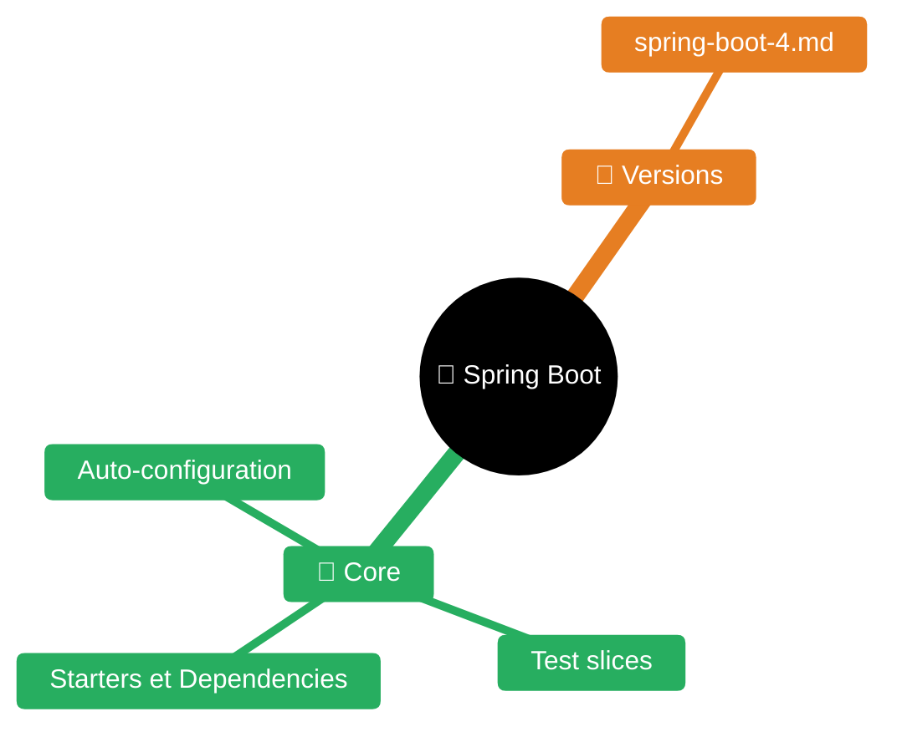
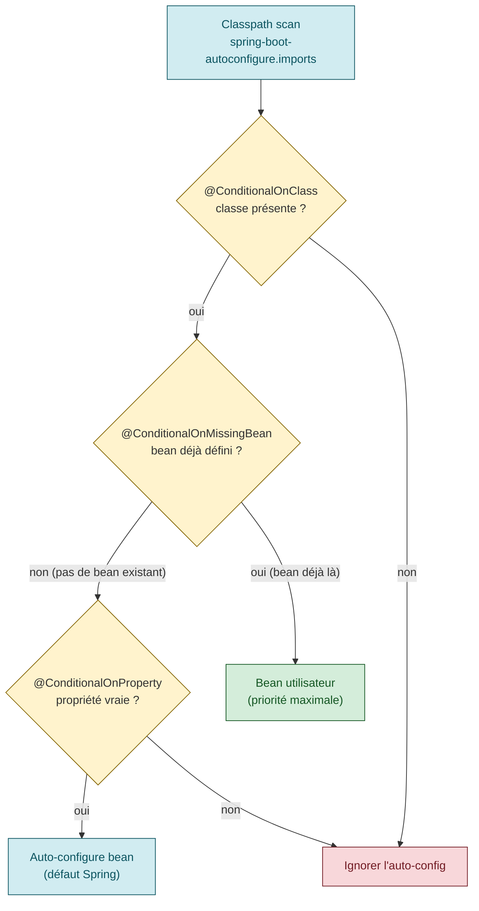
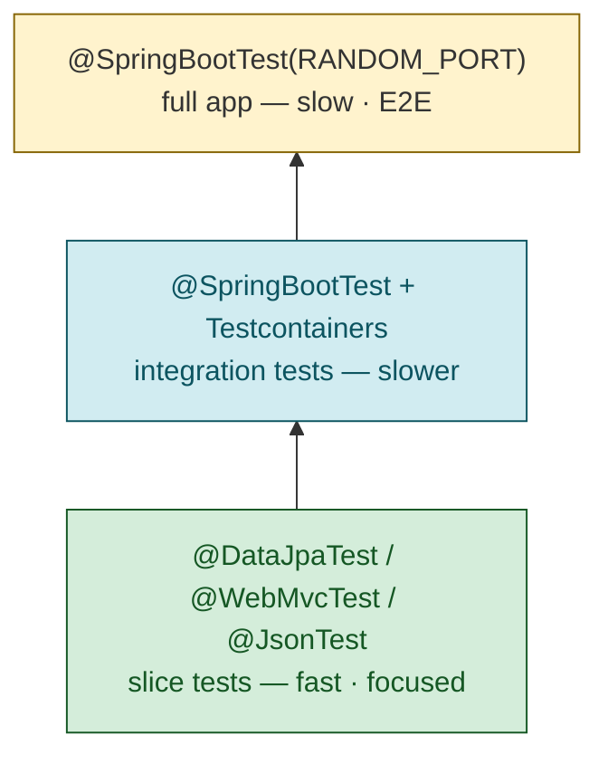

# Spring Boot & Spring Framework -- Skill Reference

> **Spring Boot 4.x** / Spring Framework 7.x / Java 21+ / Jakarta EE 11 — [détails dans `versions/spring-boot-4.md`]
> Spring Boot 3.x / Spring Framework 6.x / Java 17+ / Jakarta EE 10 — couvert ci-dessous
> Last updated: 2026-04-08

---


| Fichier | Description |
|---------|-------------|
| [README.md](README.md) | Point d'entrée Spring Boot |
| [versions/spring-boot-4.md](versions/spring-boot-4.md) | Notes de version Spring Boot 4 |
| [spring-cloud-gateway.md](spring-cloud-gateway.md) | Spring Cloud Gateway — API gateway réactive (routes, filtres, resilience) |

## Table of Contents

1. [Spring Boot Fundamentals](#1-spring-boot-fundamentals)
2. [Spring Boot 3.x Specifics](#2-spring-boot-3x-specifics)
3. [Spring Web / REST](#3-spring-web--rest)
4. [Spring Data JPA](#4-spring-data-jpa)
5. [Spring Security](#5-spring-security)
6. [Spring Cloud Stream (Messaging)](#6-spring-cloud-stream-messaging)
7. [Testing Best Practices](#7-testing-best-practices)
8. [Production Readiness](#8-production-readiness)
9. [Common Pitfalls and Anti-Patterns](#9-common-pitfalls-and-anti-patterns)

---

## 1. Spring Boot Fundamentals

### 1.1 Auto-Configuration Principle

Spring Boot auto-configuration attempts to automatically configure your Spring application based on the jar
dependencies you have added. It scans the classpath and applies `@Configuration` classes from
`META-INF/spring/org.springframework.boot.autoconfigure.AutoConfiguration.imports`.

**How it works:**
- `@SpringBootApplication` = `@Configuration` + `@EnableAutoConfiguration` + `@ComponentScan`
- Each auto-configuration class uses `@Conditional*` annotations to activate only when needed
- Key conditionals: `@ConditionalOnClass`, `@ConditionalOnMissingBean`, `@ConditionalOnProperty`
- User-defined beans always take precedence over auto-configured ones



```java
@SpringBootApplication
public class MyApplication {
    public static void main(String[] args) {
        SpringApplication.run(MyApplication.class, args);
    }
}
```

**Debugging auto-configuration:**
```properties
# Shows conditions evaluation report at startup
debug=true
# Or via command line: --debug
```

### 1.2 Starters and Dependency Management

Starters are curated dependency descriptors. They bring all required transitive dependencies.

| Starter | Purpose |
|---------|---------|
| `spring-boot-starter-web` | Web + embedded Tomcat |
| `spring-boot-starter-data-jpa` | JPA + Hibernate |
| `spring-boot-starter-security` | Spring Security |
| `spring-boot-starter-actuator` | Production monitoring |
| `spring-boot-starter-test` | JUnit 5 + Mockito + AssertJ |
| `spring-boot-starter-validation` | Bean Validation (Hibernate Validator) |
| `spring-boot-starter-oauth2-resource-server` | OAuth2 Resource Server |
| `spring-boot-starter-opentelemetry` | OpenTelemetry tracing bridge |

**Dependency management** via `spring-boot-starter-parent` (Maven) or `spring-boot-dependencies` BOM
(Gradle) -- no need to specify versions for managed dependencies.

```xml
<parent>
    <groupId>org.springframework.boot</groupId>
    <artifactId>spring-boot-starter-parent</artifactId>
    <version>3.4.5</version>
</parent>
```

```groovy
// Gradle
implementation platform('org.springframework.boot:spring-boot-dependencies:3.4.5')
```

### 1.3 Application Properties / YAML Config

Both `application.properties` and `application.yaml` (or `.yml`) are supported.
`.properties` takes precedence over YAML when both exist in the same location.

```yaml
# application.yaml
server:
  port: 8080
  servlet:
    context-path: /api

spring:
  application:
    name: my-service
  datasource:
    url: jdbc:postgresql://localhost:5432/mydb
    username: ${DB_USER:admin}
    password: ${DB_PASS}
  jpa:
    hibernate:
      ddl-auto: validate
    show-sql: false
    open-in-view: false   # ALWAYS disable -- see pitfalls
```

**Type-safe configuration with `@ConfigurationProperties`:**

```java
@ConfigurationProperties("app.mail")
public record MailProperties(
    String host,
    int port,
    @DefaultValue("false") boolean ssl,
    @DefaultValue("30s") Duration timeout
) {}
```

```java
@Configuration(proxyBeanMethods = false)
@EnableConfigurationProperties(MailProperties.class)
public class MailConfig {}
```

**Constructor binding** (records or immutable classes) is the recommended approach -- no setters needed.

### 1.4 Profiles

Activate profiles via `spring.profiles.active`:

```properties
spring.profiles.active=dev,local
```

Profile-specific files follow the naming convention `application-{profile}.yaml`:

```
application.yaml            # base config (always loaded)
application-dev.yaml         # overrides for dev
application-test.yaml        # overrides for tests
application-prod.yaml        # overrides for production
```

**Loading order** (last wins):
`application.yaml` -> `application-dev.yaml` -> `application-prod.yaml`

When multiple profiles are active, a last-wins strategy applies among them.

**Multi-document files** -- define profile-specific blocks in a single file:

```yaml
# application.yaml
server:
  port: 8080
---
spring:
  config:
    activate:
      on-profile: "prod"
server:
  port: 443
---
spring:
  config:
    activate:
      on-profile: "dev"
      on-cloud-platform: "kubernetes"
server:
  port: 8080
```

For `.properties`, separate multi-document sections with `#---`.

### 1.5 Externalized Configuration (Precedence Order)

Spring Boot property sources, from **lowest** to **highest** priority:

1. Default properties (`SpringApplication.setDefaultProperties()`)
2. `@PropertySource` annotations on `@Configuration` classes
3. Config data files (`application.properties` / YAML)
   - a. Inside JAR
   - b. Profile-specific inside JAR
   - c. Outside JAR
   - d. Profile-specific outside JAR
4. `RandomValuePropertySource` (`random.*`)
5. OS environment variables
6. Java System properties (`-Dkey=value`)
7. JNDI attributes (`java:comp/env`)
8. `ServletContext` init parameters
9. `ServletConfig` init parameters
10. `SPRING_APPLICATION_JSON` (inline JSON)
11. Command-line arguments (`--key=value`)
12. `@SpringBootTest(properties=...)` in tests
13. `@DynamicPropertySource` in tests
14. `@TestPropertySource` in tests
15. Devtools global settings (`~/.config/spring-boot`)

**Key rules:**
- Profile-specific files always override non-specific
- `.properties` takes precedence over YAML at the same location
- Environment variables use `UPPER_SNAKE_CASE` with relaxed binding:
  `MY_APP_SERVER_PORT` -> `my.app.server-port`

**Config import** (Spring Boot 2.4+):

```yaml
spring:
  config:
    import:
      - "optional:file:./config/extra.yaml"
      - "optional:configtree:/etc/config/"   # K8s ConfigMaps/Secrets
```

---

## 2. Spring Boot 3.x Specifics

### 2.1 Jakarta EE 10 Namespace (javax -> jakarta)

Spring Boot 3.0 / Spring Framework 6.0 migrated from Java EE (`javax.*`) to Jakarta EE 10 (`jakarta.*`).

**Migration checklist:**
```
javax.servlet.*          -> jakarta.servlet.*
javax.persistence.*      -> jakarta.persistence.*
javax.validation.*       -> jakarta.validation.*
javax.annotation.*       -> jakarta.annotation.*
javax.transaction.*      -> jakarta.transaction.*
javax.mail.*             -> jakarta.mail.*
javax.websocket.*        -> jakarta.websocket.*
javax.inject.*           -> jakarta.inject.*
```

**Required server versions:** Tomcat 10.1+, Jetty 12+, Undertow 2.3+
**Required ORM:** Hibernate 6.1+

Use OpenRewrite for automated migration:
```xml
<plugin>
    <groupId>org.openrewrite.maven</groupId>
    <artifactId>rewrite-maven-plugin</artifactId>
    <configuration>
        <activeRecipes>
            <recipe>org.openrewrite.java.spring.boot3.UpgradeSpringBoot_3_0</recipe>
        </activeRecipes>
    </configuration>
</plugin>
```

### 2.2 Java 17+ Baseline

Spring Boot 3.x requires **Java 17 minimum**. Leverage modern Java features:
- Records for DTOs and `@ConfigurationProperties`
- Sealed classes for domain modeling
- Pattern matching (`instanceof`, switch)
- Text blocks for multi-line strings
- `Optional` improvements

### 2.3 GraalVM Native Image Support

Spring Boot 3 provides first-class GraalVM native image support via AOT (Ahead-of-Time) processing.

**Benefits:** Sub-second startup, reduced memory (~50-80% less), ideal for serverless/K8s.

**Build a native image (Maven):**
```bash
./mvnw -Pnative native:compile
```

**Build a native OCI image (Buildpacks):**
```bash
./mvnw -Pnative spring-boot:build-image
```

**Key constraints:**
- Reflection, proxies, and resource access must be declared at build time
- Spring Boot AOT engine handles most cases automatically
- Some libraries may need GraalVM metadata (check `META-INF/native-image/`)
- Test with `@SpringBootTest` using AOT-processed context

**Gradle:**
```groovy
plugins {
    id 'org.graalvm.buildtools.native' version '0.10.4'
}
```

### 2.4 Observability with Micrometer + OpenTelemetry

Spring Boot 3 has built-in dynatrace support via the **Micrometer Observation API**.
An observation can be translated into both a **metric** and a **trace**.

**Dependencies:**
```xml
<dependency>
    <groupId>org.springframework.boot</groupId>
    <artifactId>spring-boot-starter-actuator</artifactId>
</dependency>
<!-- For tracing with OpenTelemetry -->
<dependency>
    <groupId>io.micrometer</groupId>
    <artifactId>micrometer-tracing-bridge-otel</artifactId>
</dependency>
<dependency>
    <groupId>io.opentelemetry</groupId>
    <artifactId>opentelemetry-exporter-otlp</artifactId>
</dependency>
```

Or use the all-in-one starter:
```xml
<dependency>
    <groupId>org.springframework.boot</groupId>
    <artifactId>spring-boot-starter-opentelemetry</artifactId>
</dependency>
```

**Configuration:**

```yaml
management:
  tracing:
    sampling:
      probability: 1.0        # 100% sampling for dev
  otlp:
    tracing:
      endpoint: http://otel-collector:4318/v1/traces
  observations:
    key-values:
      region: us-east-1        # common tags on all observations
  opentelemetry:
    resource-attributes:
      service.name: my-service
      environment: production
```

**Custom observations:**

```java
@Component
public class OrderService {
    private final ObservationRegistry registry;

    public OrderService(ObservationRegistry registry) {
        this.registry = registry;
    }

    public Order processOrder(Order order) {
        return Observation.createNotStarted("order.process", registry)
            .lowCardinalityKeyValue("orderType", order.getType())    // -> metric tag
            .highCardinalityKeyValue("orderId", order.getId())       // -> trace tag only
            .observe(() -> doProcess(order));
    }
}
```

### 2.5 Virtual Threads (Project Loom) Support

Available since **Spring Boot 3.2** with **Java 21+**.

**Enable virtual threads:**

```yaml
spring:
  threads:
    virtual:
      enabled: true
```

**What changes when enabled:**
- Tomcat/Jetty/Netty use virtual threads for request handling
- `@Async` methods run on virtual threads
- `@Scheduled` tasks run on virtual threads
- Spring MVC async processing uses virtual threads
- Spring Integration channels use virtual threads

**When to use:**
- Blocking I/O-heavy workloads (database, HTTP calls, file I/O)
- Thread-per-request model (classic Spring MVC)
- Applications that would otherwise need large thread pools

**When NOT to use:**
- CPU-bound tasks (no benefit, potential overhead)
- Already reactive (WebFlux + non-blocking I/O)

### 2.6 ProblemDetail for Error Responses (RFC 9457 / RFC 7807)

Spring Framework 6 / Boot 3 provides built-in support for RFC 9457 problem details.

**Enable globally:**
```yaml
spring:
  mvc:
    problemdetails:
      enabled: true
```

**ProblemDetail structure:**
```json
{
  "type": "https://example.com/errors/insufficient-credit",
  "title": "Insufficient Credit",
  "status": 402,
  "detail": "Your current balance is 30, but that costs 50.",
  "instance": "/account/12345/withdraw",
  "balance": 30,
  "cost": 50
}
```

**Custom exception with ProblemDetail:**

```java
public class InsufficientCreditException extends ErrorResponseException {
    public InsufficientCreditException(int balance, int cost) {
        super(HttpStatus.PAYMENT_REQUIRED, asProblemDetail(balance, cost), null);
    }

    private static ProblemDetail asProblemDetail(int balance, int cost) {
        ProblemDetail pd = ProblemDetail.forStatus(HttpStatus.PAYMENT_REQUIRED);
        pd.setTitle("Insufficient Credit");
        pd.setDetail(String.format("Balance is %d, but that costs %d.", balance, cost));
        pd.setType(URI.create("https://example.com/errors/insufficient-credit"));
        pd.setProperty("balance", balance);
        pd.setProperty("cost", cost);
        return pd;
    }
}
```

**Global exception handler with ProblemDetail:**

```java
@ControllerAdvice
public class GlobalExceptionHandler extends ResponseEntityExceptionHandler {

    @ExceptionHandler(ResourceNotFoundException.class)
    public ProblemDetail handleNotFound(ResourceNotFoundException ex, HttpServletRequest request) {
        ProblemDetail pd = ProblemDetail.forStatus(HttpStatus.NOT_FOUND);
        pd.setTitle("Resource Not Found");
        pd.setDetail("Resource with ID " + ex.getResourceId() + " not found");
        pd.setProperty("resourceId", ex.getResourceId());
        pd.setProperty("timestamp", Instant.now());
        return pd;
    }
}
```

**Internationalization** via `MessageSource`:
```properties
# messages.properties
problemDetail.title.com.example.InsufficientCreditException=Insufficient Credit
problemDetail.com.example.InsufficientCreditException=Balance is {0}, cost is {1}.
```

---

## 3. Spring Web / REST

### 3.1 @RestController and @RequestMapping

```java
@RestController
@RequestMapping("/api/v1/users")
public class UserController {

    private final UserService userService;

    // Constructor injection (recommended, no @Autowired needed with single constructor)
    public UserController(UserService userService) {
        this.userService = userService;
    }

    @GetMapping
    public List<UserDto> findAll(
            @RequestParam(defaultValue = "0") int page,
            @RequestParam(defaultValue = "20") int size) {
        return userService.findAll(PageRequest.of(page, size));
    }

    @GetMapping("/{id}")
    public UserDto findById(@PathVariable Long id) {
        return userService.findById(id);
    }

    @PostMapping
    @ResponseStatus(HttpStatus.CREATED)
    public UserDto create(@Valid @RequestBody CreateUserRequest request) {
        return userService.create(request);
    }

    @PutMapping("/{id}")
    public UserDto update(@PathVariable Long id, @Valid @RequestBody UpdateUserRequest request) {
        return userService.update(id, request);
    }

    @DeleteMapping("/{id}")
    @ResponseStatus(HttpStatus.NO_CONTENT)
    public void delete(@PathVariable Long id) {
        userService.delete(id);
    }
}
```

### 3.2 Request/Response DTOs with Validation

**Use Java records for DTOs** (immutable, concise):

```java
public record CreateUserRequest(
    @NotBlank(message = "Name is required")
    @Size(min = 2, max = 100)
    String name,

    @NotBlank
    @Email(message = "Invalid email format")
    String email,

    @NotNull
    @Min(18)
    @Max(150)
    Integer age,

    @Pattern(regexp = "^\\+?[1-9]\\d{1,14}$", message = "Invalid phone number")
    String phone
) {}

public record UserDto(
    Long id,
    String name,
    String email,
    Integer age,
    LocalDateTime createdAt
) {}
```

**Dependency:**
```xml
<dependency>
    <groupId>org.springframework.boot</groupId>
    <artifactId>spring-boot-starter-validation</artifactId>
</dependency>
```

**Nested validation** -- use `@Valid` on nested objects:

```java
public record OrderRequest(
    @NotNull @Valid AddressDto shippingAddress,
    @NotEmpty List<@Valid OrderItemDto> items
) {}
```

### 3.3 Exception Handling (@ControllerAdvice, @ExceptionHandler)

```java
@RestControllerAdvice
public class GlobalExceptionHandler extends ResponseEntityExceptionHandler {

    // Handle custom business exception
    @ExceptionHandler(ResourceNotFoundException.class)
    public ProblemDetail handleNotFound(ResourceNotFoundException ex) {
        ProblemDetail pd = ProblemDetail.forStatusAndDetail(
            HttpStatus.NOT_FOUND, ex.getMessage());
        pd.setTitle("Resource Not Found");
        pd.setProperty("resourceId", ex.getResourceId());
        return pd;
    }

    // Handle validation errors
    @Override
    protected ResponseEntity<Object> handleMethodArgumentNotValid(
            MethodArgumentNotValidException ex, HttpHeaders headers,
            HttpStatusCode status, WebRequest request) {

        ProblemDetail pd = ProblemDetail.forStatus(HttpStatus.UNPROCESSABLE_ENTITY);
        pd.setTitle("Validation Failed");

        Map<String, String> errors = ex.getBindingResult().getFieldErrors().stream()
            .collect(Collectors.toMap(
                FieldError::getField,
                fe -> fe.getDefaultMessage() != null ? fe.getDefaultMessage() : "invalid",
                (a, b) -> a));  // merge duplicate keys

        pd.setProperty("errors", errors);
        return ResponseEntity.unprocessableEntity().body(pd);
    }

    // Handle constraint violations (path/query params)
    @ExceptionHandler(ConstraintViolationException.class)
    public ProblemDetail handleConstraintViolation(ConstraintViolationException ex) {
        ProblemDetail pd = ProblemDetail.forStatus(HttpStatus.BAD_REQUEST);
        pd.setTitle("Constraint Violation");
        pd.setProperty("violations", ex.getConstraintViolations().stream()
            .map(v -> Map.of("field", v.getPropertyPath().toString(),
                             "message", v.getMessage()))
            .toList());
        return pd;
    }
}
```

### 3.4 Content Negotiation

Spring MVC supports content negotiation via:
- `Accept` header (default)
- URL suffix (deprecated)
- Request parameter (`?format=json`)

```yaml
spring:
  mvc:
    contentnegotiation:
      favor-parameter: true
      parameter-name: format
      media-types:
        json: application/json
        xml: application/xml
```

**Jackson uses `application/problem+json`** automatically for `ProblemDetail` objects.

For XML support, add:
```xml
<dependency>
    <groupId>com.fasterxml.jackson.dataformat</groupId>
    <artifactId>jackson-dataformat-xml</artifactId>
</dependency>
```

### 3.5 CORS Configuration

**Method/class level:**
```java
@RestController
@CrossOrigin(origins = "https://frontend.example.com", maxAge = 3600)
@RequestMapping("/api/v1/orders")
public class OrderController {

    @CrossOrigin(origins = "https://admin.example.com")
    @DeleteMapping("/{id}")
    public void delete(@PathVariable Long id) { /* ... */ }
}
```

**Global configuration (recommended):**

```java
@Configuration
public class WebConfig implements WebMvcConfigurer {

    @Override
    public void addCorsMappings(CorsRegistry registry) {
        registry.addMapping("/api/**")
            .allowedOrigins("https://frontend.example.com")
            .allowedMethods("GET", "POST", "PUT", "DELETE", "OPTIONS")
            .allowedHeaders("*")
            .exposedHeaders("X-Total-Count", "Link")
            .allowCredentials(true)
            .maxAge(3600);
    }
}
```

**IMPORTANT:** When using Spring Security, configure CORS at the Security level (see section 5.5),
otherwise the Security filter chain may reject preflight requests before they reach Spring MVC.

---

## 4. Spring Data JPA

### 4.1 Repository Pattern

```java
// Basic CRUD
public interface UserRepository extends JpaRepository<User, Long> {
    // Inherits: save, findById, findAll, delete, count, existsById, etc.
}

// Read-only repository pattern
@NoRepositoryBean
public interface ReadOnlyRepository<T, ID> extends Repository<T, ID> {
    Optional<T> findById(ID id);
    List<T> findAll();
    List<T> findAllById(Iterable<ID> ids);
    long count();
}
```

**Repository hierarchy:**
`Repository` -> `CrudRepository` -> `ListCrudRepository` -> `JpaRepository`

`JpaRepository` adds: `flush()`, `saveAndFlush()`, `deleteInBatch()`, `findAll(Sort/Pageable)`.

### 4.2 Query Methods Naming Conventions

Derived queries from method names:

| Keyword | Example | JPQL Equivalent |
|---------|---------|-----------------|
| `And` | `findByLastnameAndFirstname` | `WHERE x.lastname = ?1 AND x.firstname = ?2` |
| `Or` | `findByLastnameOrFirstname` | `WHERE x.lastname = ?1 OR x.firstname = ?2` |
| `Between` | `findByAgeBetween` | `WHERE x.age BETWEEN ?1 AND ?2` |
| `LessThan` | `findByAgeLessThan` | `WHERE x.age < ?1` |
| `GreaterThanEqual` | `findByAgeGreaterThanEqual` | `WHERE x.age >= ?1` |
| `IsNull` | `findByAgeIsNull` | `WHERE x.age IS NULL` |
| `Like` | `findByNameLike` | `WHERE x.name LIKE ?1` |
| `StartingWith` | `findByNameStartingWith` | `WHERE x.name LIKE ?1%` |
| `Containing` | `findByNameContaining` | `WHERE x.name LIKE %?1%` |
| `OrderBy` | `findByAgeOrderByNameDesc` | `WHERE x.age = ?1 ORDER BY x.name DESC` |
| `In` | `findByAgeIn(Collection)` | `WHERE x.age IN ?1` |
| `True` / `False` | `findByActiveTrue()` | `WHERE x.active = true` |
| `IgnoreCase` | `findByNameIgnoreCase` | `WHERE UPPER(x.name) = UPPER(?1)` |

```java
public interface UserRepository extends JpaRepository<User, Long> {

    Optional<User> findByEmail(String email);

    List<User> findByLastnameAndAgeBetween(String lastname, int minAge, int maxAge);

    List<User> findByActiveTrue();

    List<User> findByNameContainingIgnoreCaseOrderByCreatedAtDesc(String name);

    boolean existsByEmail(String email);

    long countByActiveTrue();

    // Delete
    void deleteByLastname(String lastname);
}
```

### 4.3 @Query with JPQL and Native SQL

```java
public interface UserRepository extends JpaRepository<User, Long> {

    // JPQL with positional parameters
    @Query("SELECT u FROM User u WHERE u.email = ?1")
    Optional<User> findByEmailJpql(String email);

    // JPQL with named parameters
    @Query("SELECT u FROM User u WHERE u.lastname = :name OR u.firstname = :name")
    List<User> findByName(@Param("name") String name);

    // Native SQL
    @NativeQuery("SELECT * FROM users WHERE email = :email")
    Optional<User> findByEmailNative(@Param("email") String email);

    // Native query with pagination (requires countQuery)
    @NativeQuery(
        value = "SELECT * FROM users WHERE department_id = :deptId",
        countQuery = "SELECT COUNT(*) FROM users WHERE department_id = :deptId")
    Page<User> findByDepartment(@Param("deptId") Long departmentId, Pageable pageable);

    // Modifying query (UPDATE / DELETE)
    @Modifying
    @Query("UPDATE User u SET u.active = false WHERE u.lastLogin < :cutoff")
    int deactivateInactiveUsers(@Param("cutoff") LocalDateTime cutoff);

    // Projections
    @Query("SELECT u.id AS id, u.name AS name FROM User u WHERE u.active = true")
    List<UserSummary> findActiveUserSummaries();
}

// Projection interface
public interface UserSummary {
    Long getId();
    String getName();
}
```

### 4.4 Pagination and Sorting

```java
// In service
public Page<UserDto> findUsers(int page, int size, String sortBy) {
    Pageable pageable = PageRequest.of(page, size, Sort.by(Sort.Direction.DESC, sortBy));
    return userRepository.findAll(pageable).map(this::toDto);
}

// In controller
@GetMapping
public Page<UserDto> list(
        @RequestParam(defaultValue = "0") int page,
        @RequestParam(defaultValue = "20") int size,
        @RequestParam(defaultValue = "createdAt") String sortBy) {
    return userService.findUsers(page, size, sortBy);
}

// Keyset-based scrolling (more efficient for large datasets)
Window<User> window = userRepository.findFirst10ByLastnameOrderByFirstname(
    "Doe", ScrollPosition.keyset());
```

### 4.5 Auditing (@CreatedDate, @LastModifiedDate)

**Step 1: Enable auditing**

```java
@Configuration
@EnableJpaAuditing
public class JpaConfig {

    @Bean
    public AuditorAware<String> auditorProvider() {
        return () -> Optional.ofNullable(SecurityContextHolder.getContext())
            .map(SecurityContext::getAuthentication)
            .filter(Authentication::isAuthenticated)
            .map(Authentication::getName);
    }
}
```

**Step 2: Mapped superclass with audit fields**

```java
@MappedSuperclass
@EntityListeners(AuditingEntityListener.class)
public abstract class AuditableEntity {

    @CreatedDate
    @Column(nullable = false, updatable = false)
    private LocalDateTime createdAt;

    @LastModifiedDate
    @Column(nullable = false)
    private LocalDateTime updatedAt;

    @CreatedBy
    @Column(updatable = false)
    private String createdBy;

    @LastModifiedBy
    private String updatedBy;

    @Version
    private Long version;  // optimistic locking
}
```

**Step 3: Extend in entities**

```java
@Entity
@Table(name = "users")
public class User extends AuditableEntity {
    @Id
    @GeneratedValue(strategy = GenerationType.IDENTITY)
    private Long id;

    private String name;
    private String email;
    // ...
}
```

### 4.6 Transactions (@Transactional)

**Service-level transactions (recommended):**

```java
@Service
@Transactional(readOnly = true)  // default read-only at class level
public class UserService {

    private final UserRepository userRepository;

    public UserService(UserRepository userRepository) {
        this.userRepository = userRepository;
    }

    // Inherits class-level readOnly = true
    public Optional<UserDto> findById(Long id) {
        return userRepository.findById(id).map(this::toDto);
    }

    // Override with read-write for mutations
    @Transactional
    public UserDto create(CreateUserRequest request) {
        User user = new User(request.name(), request.email());
        return toDto(userRepository.save(user));
    }

    @Transactional(propagation = Propagation.REQUIRES_NEW)
    public void audit(String action) {
        // Runs in its own transaction, independent of caller
    }

    @Transactional(rollbackFor = Exception.class)  // rollback on checked exceptions too
    public void importData(InputStream is) throws IOException {
        // ...
    }
}
```

**Key `@Transactional` attributes:**

| Attribute | Default | Description |
|-----------|---------|-------------|
| `readOnly` | `false` | Hints for optimization (Hibernate flush mode, DB routing) |
| `propagation` | `REQUIRED` | Join existing or create new |
| `isolation` | `DEFAULT` | DB default isolation level |
| `timeout` | `-1` (none) | Timeout in seconds |
| `rollbackFor` | `RuntimeException`, `Error` | Checked exceptions do NOT rollback by default |
| `noRollbackFor` | none | Exceptions that should NOT rollback |

**Propagation types:**

| Type | Behavior |
|------|----------|
| `REQUIRED` | Join existing TX or create new (default) |
| `REQUIRES_NEW` | Always create new TX, suspend existing |
| `SUPPORTS` | Join TX if exists, else run non-transactional |
| `NOT_SUPPORTED` | Suspend existing TX, run non-transactional |
| `MANDATORY` | Must run within existing TX, else throw |
| `NEVER` | Must NOT run within TX, else throw |
| `NESTED` | Nested TX with savepoint (JDBC only) |

---

## 5. Spring Security

### 5.1 SecurityFilterChain Bean Configuration

Spring Security 6 uses the component-based `SecurityFilterChain` model (no more `WebSecurityConfigurerAdapter`).

```java
@Configuration
@EnableWebSecurity
public class SecurityConfig {

    @Bean
    public SecurityFilterChain filterChain(HttpSecurity http) throws Exception {
        http
            .csrf(csrf -> csrf.disable())  // disable for stateless APIs
            .sessionManagement(session ->
                session.sessionCreationPolicy(SessionCreationPolicy.STATELESS))
            .authorizeHttpRequests(auth -> auth
                .requestMatchers("/api/public/**").permitAll()
                .requestMatchers("/api/admin/**").hasRole("ADMIN")
                .requestMatchers(HttpMethod.GET, "/api/users/**").hasAuthority("SCOPE_read")
                .requestMatchers(HttpMethod.POST, "/api/users/**").hasAuthority("SCOPE_write")
                .requestMatchers("/actuator/health/**").permitAll()
                .requestMatchers("/actuator/**").hasRole("OPS")
                .anyRequest().authenticated()
            )
            .oauth2ResourceServer(oauth2 -> oauth2
                .jwt(Customizer.withDefaults())
            );

        return http.build();
    }

    @Bean
    public JwtDecoder jwtDecoder() {
        NimbusJwtDecoder decoder = NimbusJwtDecoder
            .withIssuerLocation("https://auth.example.com")
            .build();

        // Add audience validation
        OAuth2TokenValidator<Jwt> audienceValidator =
            new JwtClaimValidator<List<String>>("aud",
                aud -> aud.contains("my-api"));
        OAuth2TokenValidator<Jwt> withIssuer =
            JwtValidators.createDefaultWithIssuer("https://auth.example.com");
        decoder.setJwtValidator(
            new DelegatingOAuth2TokenValidator<>(withIssuer, audienceValidator));

        return decoder;
    }
}
```

### 5.2 OAuth2 Resource Server / Client

**Resource server with JWT (application.yaml):**

```yaml
spring:
  security:
    oauth2:
      resourceserver:
        jwt:
          issuer-uri: https://auth.example.com
          audiences: https://my-api.example.com
```

**Custom authority mapping** (map JWT claims to Spring authorities):

```java
@Bean
public JwtAuthenticationConverter jwtAuthenticationConverter() {
    JwtGrantedAuthoritiesConverter grantedAuthoritiesConverter =
        new JwtGrantedAuthoritiesConverter();
    grantedAuthoritiesConverter.setAuthoritiesClaimName("roles"); // custom claim
    grantedAuthoritiesConverter.setAuthorityPrefix("ROLE_");      // prefix

    JwtAuthenticationConverter converter = new JwtAuthenticationConverter();
    converter.setJwtGrantedAuthoritiesConverter(grantedAuthoritiesConverter);
    return converter;
}
```

**Default behavior:** JWT `scope` claim -> authorities prefixed with `SCOPE_`.

### 5.3 Method Security (@PreAuthorize, @Secured)

Enable:
```java
@Configuration
@EnableMethodSecurity  // replaces @EnableGlobalMethodSecurity
public class MethodSecurityConfig {}
```

Usage:
```java
@Service
public class DocumentService {

    @PreAuthorize("hasRole('ADMIN')")
    public void deleteAll() { /* ... */ }

    @PreAuthorize("hasAuthority('SCOPE_read') and #userId == authentication.name")
    public List<Document> findByUser(@Param("userId") String userId) { /* ... */ }

    @PreAuthorize("@permissionEvaluator.hasAccess(#id, 'EDIT')")
    public void update(Long id, DocumentDto dto) { /* ... */ }

    @PostAuthorize("returnObject.owner == authentication.name")
    public Document findById(Long id) { /* ... */ }

    @PreFilter("filterObject.owner == authentication.name")
    public void deleteMany(List<Document> docs) { /* ... */ }
}
```

### 5.4 CSRF Protection

**For stateless REST APIs (JWT):** Disable CSRF.
```java
http.csrf(csrf -> csrf.disable());
```

**For session-based web apps:** Keep CSRF enabled (default).
```java
http.csrf(csrf -> csrf
    .csrfTokenRepository(CookieCsrfTokenRepository.withHttpOnlyFalse())
    .csrfTokenRequestHandler(new CsrfTokenRequestAttributeHandler())
);
```

**Rule of thumb:**
- Browser clients with cookies/sessions -> CSRF ON
- Non-browser API clients with Bearer tokens -> CSRF OFF
- Mixed -> Use separate `SecurityFilterChain` beans with different matchers

### 5.5 CORS + Security Integration

**IMPORTANT:** CORS must be configured at the Spring Security level for it to work with
the security filter chain. Configure it via `HttpSecurity.cors()`:

```java
@Bean
public SecurityFilterChain filterChain(HttpSecurity http) throws Exception {
    http
        .cors(cors -> cors.configurationSource(corsConfigurationSource()))
        .csrf(csrf -> csrf.disable())
        .authorizeHttpRequests(auth -> auth.anyRequest().authenticated())
        .oauth2ResourceServer(oauth2 -> oauth2.jwt(Customizer.withDefaults()));
    return http.build();
}

@Bean
public CorsConfigurationSource corsConfigurationSource() {
    CorsConfiguration config = new CorsConfiguration();
    config.setAllowedOrigins(List.of("https://frontend.example.com"));
    config.setAllowedMethods(List.of("GET", "POST", "PUT", "DELETE", "OPTIONS"));
    config.setAllowedHeaders(List.of("*"));
    config.setExposedHeaders(List.of("X-Total-Count", "Link"));
    config.setAllowCredentials(true);
    config.setMaxAge(3600L);

    UrlBasedCorsConfigurationSource source = new UrlBasedCorsConfigurationSource();
    source.registerCorsConfiguration("/api/**", config);
    return source;
}
```

This ensures preflight (OPTIONS) requests are handled **before** authentication.

---

## 6. Spring Cloud Stream (Messaging)

### 6.1 Functional Programming Model

Spring Cloud Stream 3.x+ uses `java.util.function` beans:

| Java Type | SCS Concept | Binding |
|-----------|-------------|---------|
| `Supplier<T>` | Source (producer) | `{name}-out-0` |
| `Function<T, R>` | Processor | `{name}-in-0` / `{name}-out-0` |
| `Consumer<T>` | Sink (consumer) | `{name}-in-0` |

```java
@SpringBootApplication
public class StreamApp {

    // Consumer -- reads from a topic
    @Bean
    public Consumer<OrderEvent> processOrder() {
        return event -> {
            log.info("Processing order: {}", event.orderId());
            // business logic
        };
    }

    // Function -- reads, transforms, writes
    @Bean
    public Function<OrderEvent, EnrichedOrder> enrichOrder() {
        return event -> new EnrichedOrder(event, lookupCustomer(event.customerId()));
    }

    // Supplier -- produces messages (polled every 1s by default)
    @Bean
    public Supplier<Flux<HeartbeatEvent>> heartbeat() {
        return () -> Flux.interval(Duration.ofSeconds(30))
            .map(i -> new HeartbeatEvent(Instant.now()));
    }
}
```

**Configuration:**

```yaml
spring:
  cloud:
    function:
      definition: processOrder;enrichOrder  # semicolon-separated for multiple
    stream:
      bindings:
        processOrder-in-0:
          destination: orders             # Kafka topic name
          group: order-service            # consumer group
        enrichOrder-in-0:
          destination: orders
          group: enrichment-service
        enrichOrder-out-0:
          destination: enriched-orders
```

**Function composition:**
```properties
spring.cloud.function.definition=toUpperCase|addPrefix
```

### 6.2 Binders (Kafka, RabbitMQ)

**Kafka binder:**
```xml
<dependency>
    <groupId>org.springframework.cloud</groupId>
    <artifactId>spring-cloud-stream-binder-kafka</artifactId>
</dependency>
```

```yaml
spring:
  cloud:
    stream:
      kafka:
        binder:
          brokers: kafka-broker:9092
          auto-create-topics: true
          configuration:
            security.protocol: SASL_SSL
        bindings:
          processOrder-in-0:
            consumer:
              start-offset: latest
              enable-dlq: true
              dlq-name: orders.dlq
```

**RabbitMQ binder:**
```xml
<dependency>
    <groupId>org.springframework.cloud</groupId>
    <artifactId>spring-cloud-stream-binder-rabbit</artifactId>
</dependency>
```

### 6.3 Spring Cloud Stream vs @KafkaListener

| Feature | Spring Cloud Stream | @KafkaListener |
|---------|-------------------|----------------|
| Abstraction level | High (binder-agnostic) | Low (Kafka-specific) |
| Portability | Switch binders without code change | Kafka only |
| Programming model | Functional (`Function`, `Consumer`) | Annotated methods |
| Error handling | DLQ, retries via config | Manual error handler |
| Testing | `TestChannelBinder` (in-memory) | EmbeddedKafka / TestContainers |
| When to use | Multi-broker support, simpler apps | Full Kafka API control needed |

### 6.4 Error Handling and DLQ

**Configuration-based DLQ:**

```yaml
spring:
  cloud:
    stream:
      bindings:
        processOrder-in-0:
          destination: orders
          group: order-service
          consumer:
            max-attempts: 3          # retry 3 times
            back-off-initial-interval: 1000
            back-off-multiplier: 2.0
            back-off-max-interval: 10000
      kafka:
        bindings:
          processOrder-in-0:
            consumer:
              enable-dlq: true
              dlq-name: orders.order-service.dlq
```

DLQ messages include headers: `x-original-topic`, `x-exception-message`, `x-exception-stacktrace`.

**Programmatic error channel:**

```java
@ServiceActivator(inputChannel = "orders.order-service.errors")
public void handleError(ErrorMessage errorMessage) {
    log.error("Failed to process: {}", errorMessage.getPayload().getMessage());
    // alerting, logging, etc.
}
```

**Advanced: Move retries to listener container** (when retry delays exceed `max.poll.interval.ms`):

```java
@Bean
ListenerContainerWithDlqAndRetryCustomizer customizer(KafkaTemplate<?, ?> template) {
    return new ListenerContainerWithDlqAndRetryCustomizer() {
        @Override
        public void configure(AbstractMessageListenerContainer<?, ?> container,
                String destination, String group,
                BiFunction<ConsumerRecord<?, ?>, Exception, TopicPartition> dlqResolver,
                BackOff backOff) {
            container.setCommonErrorHandler(
                new DefaultErrorHandler(
                    new DeadLetterPublishingRecoverer(template, dlqResolver), backOff));
        }

        @Override
        public boolean retryAndDlqInBinding(String destination, String group) {
            return false; // disable binder-level retry, use container-level
        }
    };
}
```

### 6.5 Testing with TestChannelBinder

```xml
<dependency>
    <groupId>org.springframework.cloud</groupId>
    <artifactId>spring-cloud-stream-test-binder</artifactId>
    <scope>test</scope>
</dependency>
```

```java
@SpringBootTest
class OrderProcessingTest {

    @Autowired
    private InputDestination input;

    @Autowired
    private OutputDestination output;

    @Test
    void shouldEnrichOrder() {
        OrderEvent event = new OrderEvent("order-123", "customer-456");
        input.send(new GenericMessage<>(objectMapper.writeValueAsBytes(event)),
            "enrichOrder-in-0");

        Message<byte[]> result = output.receive(5000, "enrichOrder-out-0");
        assertThat(result).isNotNull();
        EnrichedOrder enriched = objectMapper.readValue(
            result.getPayload(), EnrichedOrder.class);
        assertThat(enriched.orderId()).isEqualTo("order-123");
    }
}
```

**Standalone test context:**

```java
@Test
void testWithExplicitConfig() {
    try (ConfigurableApplicationContext ctx = new SpringApplicationBuilder(
            TestChannelBinderConfiguration.getCompleteConfiguration(MyApp.class))
            .run("--spring.cloud.function.definition=enrichOrder")) {

        InputDestination input = ctx.getBean(InputDestination.class);
        OutputDestination output = ctx.getBean(OutputDestination.class);
        // send and assert...
    }
}
```

---

## 7. Testing Best Practices

### 7.1 Test Slices Overview

| Annotation | What It Loads | Use Case |
|-----------|---------------|----------|
| `@SpringBootTest` | Full application context | Integration tests |
| `@WebMvcTest` | Controllers, filters, advice | Controller unit tests |
| `@WebFluxTest` | WebFlux controllers | Reactive controller tests |
| `@DataJpaTest` | JPA repos, entities, embedded DB | Repository tests |
| `@DataMongoTest` | MongoDB repos, embedded Mongo | MongoDB tests |
| `@JsonTest` | JSON serialization/deserialization | DTO mapping tests |
| `@RestClientTest` | RestTemplate/RestClient | REST client tests |

**Rule of thumb:** Use the narrowest slice possible. `@SpringBootTest` loads everything and is slow.



### 7.2 @SpringBootTest

```java
// Full integration test with real server on random port
@SpringBootTest(webEnvironment = WebEnvironment.RANDOM_PORT)
class OrderIntegrationTest {

    @Autowired
    private TestRestTemplate restTemplate;

    @MockitoBean
    private PaymentService paymentService;  // replaces @MockBean since Boot 3.4

    @Test
    void shouldCreateOrder() {
        given(paymentService.charge(any())).willReturn(PaymentResult.success());

        ResponseEntity<OrderDto> response = restTemplate.postForEntity(
            "/api/v1/orders",
            new CreateOrderRequest("item-1", 2),
            OrderDto.class);

        assertThat(response.getStatusCode()).isEqualTo(HttpStatus.CREATED);
        assertThat(response.getBody().status()).isEqualTo("PENDING");
    }
}
```

### 7.3 @WebMvcTest for Controller Tests

```java
@WebMvcTest(UserController.class)
class UserControllerTest {

    @Autowired
    private MockMvc mockMvc;

    @MockitoBean
    private UserService userService;

    @Test
    void shouldReturnUser() throws Exception {
        given(userService.findById(1L))
            .willReturn(new UserDto(1L, "John", "john@example.com", 30, null));

        mockMvc.perform(get("/api/v1/users/1")
                .accept(MediaType.APPLICATION_JSON))
            .andExpect(status().isOk())
            .andExpect(jsonPath("$.name").value("John"))
            .andExpect(jsonPath("$.email").value("john@example.com"));
    }

    @Test
    void shouldReturn422WhenValidationFails() throws Exception {
        mockMvc.perform(post("/api/v1/users")
                .contentType(MediaType.APPLICATION_JSON)
                .content("""
                    {
                        "name": "",
                        "email": "not-an-email"
                    }
                    """))
            .andExpect(status().isUnprocessableEntity())
            .andExpect(jsonPath("$.title").value("Validation Failed"));
    }

    @Test
    void shouldReturn404WhenNotFound() throws Exception {
        given(userService.findById(999L))
            .willThrow(new ResourceNotFoundException("User", 999L));

        mockMvc.perform(get("/api/v1/users/999"))
            .andExpect(status().isNotFound())
            .andExpect(jsonPath("$.title").value("Resource Not Found"));
    }
}
```

### 7.4 @DataJpaTest

```java
@DataJpaTest
@AutoConfigureTestDatabase(replace = Replace.NONE)  // use real DB (TestContainers)
class UserRepositoryTest {

    @Autowired
    private UserRepository userRepository;

    @Autowired
    private TestEntityManager entityManager;

    @Test
    void shouldFindByEmail() {
        entityManager.persistAndFlush(new User("John", "john@example.com"));
        entityManager.clear();  // clear first-level cache

        Optional<User> found = userRepository.findByEmail("john@example.com");

        assertThat(found).isPresent();
        assertThat(found.get().getName()).isEqualTo("John");
    }
}
```

### 7.5 TestContainers Integration

```java
@SpringBootTest
@Testcontainers
class UserServiceIntegrationTest {

    @Container
    @ServiceConnection  // Spring Boot 3.1+ auto-configures DataSource
    static PostgreSQLContainer<?> postgres =
        new PostgreSQLContainer<>("postgres:16-alpine");

    @Autowired
    private UserService userService;

    @Test
    void shouldPersistAndRetrieve() {
        UserDto created = userService.create(
            new CreateUserRequest("John", "john@test.com", 30, null));
        Optional<UserDto> found = userService.findById(created.id());
        assertThat(found).isPresent();
    }
}
```

**`@ServiceConnection`** (Spring Boot 3.1+) automatically configures the connection properties
based on the container -- no need for `@DynamicPropertySource`.

**Shared containers for speed:**

```java
// Base class to share containers across test classes
@Testcontainers
abstract class AbstractIntegrationTest {

    @Container
    @ServiceConnection
    static PostgreSQLContainer<?> postgres =
        new PostgreSQLContainer<>("postgres:16-alpine");

    @Container
    @ServiceConnection
    static KafkaContainer kafka =
        new KafkaContainer(DockerImageName.parse("confluentinc/cp-kafka:7.7.0"));
}

@SpringBootTest
class OrderServiceTest extends AbstractIntegrationTest {
    // postgres and kafka available
}
```

### 7.6 @MockitoBean vs @MockitoSpyBean

| Annotation | Behavior | Use When |
|-----------|----------|----------|
| `@MockitoBean` | Replaces bean with mock (all methods return null/default) | External services, want full control |
| `@MockitoSpyBean` | Wraps real bean, allows selective stubbing | Override only specific methods |

Note: `@MockBean` and `@SpyBean` are deprecated since Spring Boot 3.4 in favor of
`@MockitoBean` and `@MockitoSpyBean`.

```java
@SpringBootTest
class PaymentServiceTest {

    @MockitoSpyBean
    private PaymentGateway gateway;  // real bean, but we override one method

    @Test
    void shouldRetryOnTimeout() {
        doThrow(new TimeoutException())
            .doReturn(PaymentResult.success())
            .when(gateway).charge(any());

        // test retry logic...
    }
}
```

---

## 8. Production Readiness

### 8.1 Actuator Endpoints

**Dependency:**
```xml
<dependency>
    <groupId>org.springframework.boot</groupId>
    <artifactId>spring-boot-starter-actuator</artifactId>
</dependency>
```

**Key endpoints:**

| Endpoint | Method | Description |
|----------|--------|-------------|
| `/actuator/health` | GET | Health status (UP/DOWN) |
| `/actuator/health/liveness` | GET | Liveness probe (K8s) |
| `/actuator/health/readiness` | GET | Readiness probe (K8s) |
| `/actuator/info` | GET | Application info |
| `/actuator/metrics` | GET | Micrometer metrics |
| `/actuator/prometheus` | GET | Prometheus format metrics |
| `/actuator/env` | GET | Environment properties |
| `/actuator/loggers` | GET/POST | View/change log levels at runtime |
| `/actuator/beans` | GET | All Spring beans |
| `/actuator/configprops` | GET | All `@ConfigurationProperties` |
| `/actuator/threaddump` | GET | Thread dump |
| `/actuator/mappings` | GET | All `@RequestMapping` paths |

**Recommended config for production:**

```yaml
management:
  endpoints:
    web:
      exposure:
        include: health,info,metrics,prometheus,loggers
  endpoint:
    health:
      show-details: when-authorized
      show-components: true
      probes:
        enabled: true       # enable liveness/readiness
      group:
        readiness:
          include: readinessState,db,redis
        liveness:
          include: livenessState
    env:
      show-values: when-authorized
  server:
    port: 9090             # separate management port
```

### 8.2 Custom Health Indicators

```java
@Component
public class ExternalApiHealthIndicator implements HealthIndicator {

    private final RestClient restClient;

    public ExternalApiHealthIndicator(RestClient.Builder builder) {
        this.restClient = builder.baseUrl("https://api.example.com").build();
    }

    @Override
    public Health health() {
        try {
            restClient.get().uri("/ping").retrieve().toBodilessEntity();
            return Health.up()
                .withDetail("url", "https://api.example.com")
                .build();
        } catch (Exception e) {
            return Health.down()
                .withDetail("error", e.getMessage())
                .build();
        }
    }
}
```

**IMPORTANT:** Do NOT include external service health checks in the **liveness** probe.
If an external service goes down and liveness fails, Kubernetes will restart your pod,
potentially causing cascading failures. Only include external checks in **readiness**.

### 8.3 Graceful Shutdown

Enabled by default in Spring Boot 3.x. When the application receives SIGTERM:
1. Stops accepting new requests at the network layer
2. Allows existing requests to complete within the timeout
3. Shuts down the application context

```yaml
# Graceful shutdown is enabled by default.
# To disable: server.shutdown=immediate
spring:
  lifecycle:
    timeout-per-shutdown-phase: 30s  # default is 30s
```

**Kubernetes deployment config:**

```yaml
apiVersion: apps/v1
kind: Deployment
spec:
  template:
    spec:
      terminationGracePeriodSeconds: 60  # > timeout-per-shutdown-phase
      containers:
        - name: app
          livenessProbe:
            httpGet:
              path: /actuator/health/liveness
              port: 9090
            initialDelaySeconds: 15
            periodSeconds: 10
            failureThreshold: 3
          readinessProbe:
            httpGet:
              path: /actuator/health/readiness
              port: 9090
            initialDelaySeconds: 5
            periodSeconds: 5
            failureThreshold: 3
          startupProbe:
            httpGet:
              path: /actuator/health/liveness
              port: 9090
            initialDelaySeconds: 10
            periodSeconds: 5
            failureThreshold: 30  # 30 * 5s = 150s max startup
```

**Additional paths (available on main port, not management port):**

```yaml
management:
  endpoint:
    health:
      probes:
        enabled: true
        add-additional-paths: true   # adds /livez and /readyz on main port
```

### 8.4 Micrometer Metrics

```yaml
management:
  metrics:
    tags:
      application: ${spring.application.name}  # common tags
      environment: ${ENVIRONMENT:dev}
  prometheus:
    metrics:
      export:
        enabled: true
```

**Custom metrics:**

```java
@Component
public class OrderMetrics {

    private final Counter orderCreated;
    private final Timer orderProcessing;
    private final AtomicInteger pendingOrders;

    public OrderMetrics(MeterRegistry registry) {
        this.orderCreated = Counter.builder("orders.created")
            .description("Total orders created")
            .tag("type", "all")
            .register(registry);

        this.orderProcessing = Timer.builder("orders.processing")
            .description("Order processing duration")
            .publishPercentiles(0.5, 0.95, 0.99)
            .register(registry);

        this.pendingOrders = registry.gauge("orders.pending",
            new AtomicInteger(0));
    }

    public void recordOrderCreated() {
        orderCreated.increment();
    }

    public <T> T timeProcessing(Supplier<T> task) {
        return orderProcessing.record(task);
    }
}
```

---

## 9. Common Pitfalls and Anti-Patterns

### 9.1 N+1 Query Problem

**The problem:** Loading a collection of entities triggers N additional queries for their associations.

```java
// BAD: triggers N+1 -- 1 query for orders, N queries for order.customer
List<Order> orders = orderRepository.findAll();
orders.forEach(o -> System.out.println(o.getCustomer().getName())); // N extra queries!
```

**Solutions:**

```java
// Solution 1: JOIN FETCH in JPQL
@Query("SELECT o FROM Order o JOIN FETCH o.customer WHERE o.status = :status")
List<Order> findByStatusWithCustomer(@Param("status") String status);

// Solution 2: @EntityGraph
@EntityGraph(attributePaths = {"customer", "items"})
List<Order> findByStatus(String status);

// Solution 3: @BatchSize on the entity (Hibernate-specific)
@Entity
public class Order {
    @ManyToOne(fetch = FetchType.LAZY)
    @BatchSize(size = 25)
    private Customer customer;
}
```

**Detection:** Use Hibernate's statistics or `datasource-micrometer` for query counting in tests.

```yaml
# Log all SQL (dev only!)
spring:
  jpa:
    properties:
      hibernate:
        generate_statistics: true
logging:
  level:
    org.hibernate.SQL: DEBUG
    org.hibernate.stat: DEBUG
```

### 9.2 @Transactional on Private Methods

**The behavior:** Spring creates proxies to manage transactions. Proxies **cannot intercept
private method calls**.

- **Spring Boot 2.x (proxy mode):** `@Transactional` on private methods is **silently ignored**.
  No error, no warning -- the method simply runs without a transaction.
- **Spring Framework 6 / Boot 3.x:** Protected and package-private methods are now supported with
  class-based proxies. However, private methods are still **never proxied**. Spring 6 may now
  log a warning when `@Transactional` is placed on methods that cannot be proxied.

```java
// BAD -- @Transactional has NO EFFECT on private method
@Service
public class UserService {

    @Transactional
    private void saveInternal(User user) {  // SILENTLY IGNORED!
        userRepository.save(user);
    }
}

// GOOD
@Service
public class UserService {

    @Transactional
    public void save(User user) {  // works correctly
        userRepository.save(user);
    }
}
```

**Self-invocation pitfall** -- even public methods lose transactional behavior when called internally:

```java
@Service
public class OrderService {

    public void processAll() {
        for (Order o : findAll()) {
            processOne(o);  // DIRECT CALL -- bypasses proxy, NO TRANSACTION!
        }
    }

    @Transactional
    public void processOne(Order order) {
        // This is @Transactional, but when called from processAll(),
        // it bypasses the proxy and runs WITHOUT a transaction.
    }
}
```

**Fix:** Extract to a separate bean, or inject self, or use `TransactionTemplate`:

```java
// Fix 1: Separate bean
@Service
public class OrderBatchService {
    private final OrderService orderService;  // injected proxy

    public void processAll() {
        for (Order o : orderService.findAll()) {
            orderService.processOne(o);  // goes through proxy
        }
    }
}

// Fix 2: TransactionTemplate (programmatic)
@Service
public class OrderService {
    private final TransactionTemplate txTemplate;

    public void processAll() {
        for (Order o : findAll()) {
            txTemplate.executeWithoutResult(status -> processOne(o));
        }
    }
}
```

### 9.3 Field Injection vs Constructor Injection

**BAD -- field injection:**
```java
@Service
public class UserService {
    @Autowired
    private UserRepository userRepository;  // hidden dependency

    @Autowired
    private EmailService emailService;      // hidden dependency
}
```

**Problems with field injection:**
- Cannot create instances without Spring (breaks testability)
- Hidden dependencies (not visible in constructor/API)
- Allows mutable state (fields can be reassigned)
- No compile-time safety for missing dependencies
- Easy to accumulate too many dependencies (SRP violation goes unnoticed)

**GOOD -- constructor injection:**
```java
@Service
public class UserService {
    private final UserRepository userRepository;
    private final EmailService emailService;

    // No @Autowired needed with a single constructor (Spring 4.3+)
    public UserService(UserRepository userRepository, EmailService emailService) {
        this.userRepository = userRepository;
        this.emailService = emailService;
    }
}
```

**Benefits:**
- Dependencies are explicit and immutable (`final`)
- Easy to test (just pass mocks via constructor)
- Fails fast at startup if dependency is missing
- Large constructors signal SRP violations

**With Lombok (if used):**
```java
@Service
@RequiredArgsConstructor
public class UserService {
    private final UserRepository userRepository;
    private final EmailService emailService;
}
```

### 9.4 Circular Dependencies

**Since Spring Boot 2.6, circular dependencies are prohibited by default.**

```java
// BAD -- circular dependency
@Service
public class ServiceA {
    public ServiceA(ServiceB b) {}  // A needs B
}

@Service
public class ServiceB {
    public ServiceB(ServiceA a) {}  // B needs A -> BeanCurrentlyInCreationException
}
```

**Solutions (in order of preference):**

1. **Redesign:** Extract shared logic to a third service (best approach)
2. **Event-driven:** Use `ApplicationEventPublisher` to decouple
3. **`@Lazy` on one injection point:** `public ServiceA(@Lazy ServiceB b)` (last resort)

**Do NOT do:**
```properties
# ANTI-PATTERN -- hides design problems
spring.main.allow-circular-references=true
```

### 9.5 LazyInitializationException

**The problem:** Accessing a lazy-loaded association outside a Hibernate session/transaction.

```java
@Entity
public class Order {
    @OneToMany(mappedBy = "order", fetch = FetchType.LAZY)  // LAZY is the default
    private List<OrderItem> items;
}

// In service WITHOUT @Transactional
public OrderDto getOrder(Long id) {
    Order order = orderRepository.findById(id).orElseThrow();
    return toDto(order, order.getItems());  // LazyInitializationException!
    // Session is already closed when items are accessed
}
```

**Solutions:**

```java
// Solution 1: JOIN FETCH (best for known access patterns)
@Query("SELECT o FROM Order o JOIN FETCH o.items WHERE o.id = :id")
Optional<Order> findByIdWithItems(@Param("id") Long id);

// Solution 2: @EntityGraph
@EntityGraph(attributePaths = {"items"})
Optional<Order> findById(Long id);

// Solution 3: Ensure @Transactional wraps the access
@Transactional(readOnly = true)
public OrderDto getOrder(Long id) {
    Order order = orderRepository.findById(id).orElseThrow();
    return toDto(order, order.getItems());  // Session still open
}
```

**Do NOT do:**
```yaml
# ANTI-PATTERN -- masks the problem, causes performance issues, N+1 queries
spring:
  jpa:
    open-in-view: true   # This is unfortunately the DEFAULT -- always set to false!
```

Always set `spring.jpa.open-in-view=false` and handle data fetching explicitly.

### 9.6 Missing @EnableScheduling for @Scheduled

```java
// @Scheduled methods do NOTHING unless scheduling is enabled

// REQUIRED in a @Configuration class
@Configuration
@EnableScheduling
public class SchedulingConfig {}

// Then this works
@Component
public class ReportJob {
    @Scheduled(cron = "0 0 2 * * *")  // 2 AM daily
    public void generateDailyReport() {
        // ...
    }

    @Scheduled(fixedRate = 60_000)  // every 60 seconds
    public void checkPendingOrders() {
        // ...
    }
}
```

Similarly, `@Async` requires `@EnableAsync`:
```java
@Configuration
@EnableAsync
public class AsyncConfig {}
```

### 9.7 Additional Common Pitfalls

**1. Checked exceptions and @Transactional:**
```java
@Transactional
public void transferMoney(Long from, Long to, BigDecimal amount) throws InsufficientFundsException {
    // By default, checked exceptions do NOT trigger rollback!
    // The transaction COMMITS even if InsufficientFundsException is thrown.
}

// FIX:
@Transactional(rollbackFor = Exception.class)
// Or in Spring 6.2+:
@EnableTransactionManagement(rollbackOn = RollbackOn.ALL_EXCEPTIONS)
```

**2. Missing `@Modifying` on update/delete queries:**
```java
// BAD -- throws InvalidDataAccessApiUsageException
@Query("UPDATE User u SET u.active = false WHERE u.id = :id")
void deactivate(@Param("id") Long id);

// GOOD
@Modifying
@Query("UPDATE User u SET u.active = false WHERE u.id = :id")
void deactivate(@Param("id") Long id);
```

**3. `save()` for existing detached entities -- use `saveAndFlush()` or merge:**
```java
// When you have an entity with an ID but it's detached,
// save() may INSERT instead of UPDATE in some edge cases.
// Use saveAndFlush() or ensure the entity is managed.
```

**4. Not closing resources in native queries:**
```java
// Use Stream with try-with-resources
@Query("SELECT u FROM User u")
Stream<User> streamAll();

// In service:
@Transactional(readOnly = true)
public void processAllUsers() {
    try (Stream<User> users = userRepository.streamAll()) {
        users.forEach(this::process);
    }
}
```

**5. Forgetting `@Transactional` on service methods that do multiple writes:**
```java
// BAD -- if emailService fails, user is already saved (no rollback)
public void register(CreateUserRequest req) {
    userRepository.save(new User(req.name()));
    emailService.sendWelcome(req.email());  // if this fails, inconsistent state!
}

// GOOD
@Transactional
public void register(CreateUserRequest req) {
    userRepository.save(new User(req.name()));
    emailService.sendWelcome(req.email());  // all or nothing
}
```

---

## Quick Reference Card

### Essential application.yaml Template

```yaml
spring:
  application:
    name: my-service
  profiles:
    active: ${SPRING_PROFILES_ACTIVE:dev}

  # Database
  datasource:
    url: jdbc:postgresql://${DB_HOST:localhost}:5432/${DB_NAME:mydb}
    username: ${DB_USER}
    password: ${DB_PASS}
    hikari:
      maximum-pool-size: 10
      minimum-idle: 5
      connection-timeout: 30000
  jpa:
    hibernate:
      ddl-auto: validate
    open-in-view: false
    properties:
      hibernate:
        default_batch_fetch_size: 25
        jdbc.batch_size: 25
        order_inserts: true
        order_updates: true

  # Security
  security:
    oauth2:
      resourceserver:
        jwt:
          issuer-uri: ${OAUTH2_ISSUER_URI}

  # Virtual threads
  threads:
    virtual:
      enabled: true

  # Lifecycle
  lifecycle:
    timeout-per-shutdown-phase: 30s

  # Error handling
  mvc:
    problemdetails:
      enabled: true

# Server
server:
  port: 8080
  servlet:
    context-path: /

# Actuator
management:
  server:
    port: 9090
  endpoints:
    web:
      exposure:
        include: health,info,metrics,prometheus,loggers
  endpoint:
    health:
      show-details: when-authorized
      probes:
        enabled: true
      group:
        liveness:
          include: livenessState
        readiness:
          include: readinessState,db
  metrics:
    tags:
      application: ${spring.application.name}
  tracing:
    sampling:
      probability: ${TRACE_SAMPLING:0.1}

# Logging
logging:
  level:
    root: INFO
    com.example: DEBUG
    org.hibernate.SQL: WARN
  pattern:
    console: "%d{ISO8601} [%thread] %-5level %logger{36} - %msg%n"
```

### Essential Maven Dependencies

```xml
<dependencies>
    <dependency>
        <groupId>org.springframework.boot</groupId>
        <artifactId>spring-boot-starter-web</artifactId>
    </dependency>
    <dependency>
        <groupId>org.springframework.boot</groupId>
        <artifactId>spring-boot-starter-data-jpa</artifactId>
    </dependency>
    <dependency>
        <groupId>org.springframework.boot</groupId>
        <artifactId>spring-boot-starter-validation</artifactId>
    </dependency>
    <dependency>
        <groupId>org.springframework.boot</groupId>
        <artifactId>spring-boot-starter-security</artifactId>
    </dependency>
    <dependency>
        <groupId>org.springframework.boot</groupId>
        <artifactId>spring-boot-starter-oauth2-resource-server</artifactId>
    </dependency>
    <dependency>
        <groupId>org.springframework.boot</groupId>
        <artifactId>spring-boot-starter-actuator</artifactId>
    </dependency>
    <dependency>
        <groupId>io.micrometer</groupId>
        <artifactId>micrometer-registry-prometheus</artifactId>
    </dependency>

    <!-- Test -->
    <dependency>
        <groupId>org.springframework.boot</groupId>
        <artifactId>spring-boot-starter-test</artifactId>
        <scope>test</scope>
    </dependency>
    <dependency>
        <groupId>org.springframework.security</groupId>
        <artifactId>spring-security-test</artifactId>
        <scope>test</scope>
    </dependency>
    <dependency>
        <groupId>org.springframework.boot</groupId>
        <artifactId>spring-boot-testcontainers</artifactId>
        <scope>test</scope>
    </dependency>
    <dependency>
        <groupId>org.testcontainers</groupId>
        <artifactId>postgresql</artifactId>
        <scope>test</scope>
    </dependency>
</dependencies>
```

---

## Sources

- [Spring Boot Reference Documentation](https://docs.spring.io/spring-boot/reference/)
- [Spring Boot Externalized Configuration](https://docs.spring.io/spring-boot/reference/features/external-config.html)
- [Spring Boot Actuator Endpoints](https://docs.spring.io/spring-boot/reference/actuator/endpoints.html)
- [Spring Boot Observability](https://docs.spring.io/spring-boot/reference/actuator/dynatrace.html)
- [Spring Boot GraalVM Native Image](https://docs.spring.io/spring-boot/reference/packaging/native-image/index.html)
- [Spring Boot Graceful Shutdown](https://docs.spring.io/spring-boot/reference/web/graceful-shutdown.html)
- [Spring Boot Testing](https://docs.spring.io/spring-boot/reference/testing/spring-boot-applications.html)
- [Spring Boot Virtual Threads](https://spring.io/blog/2023/09/09/all-together-now-spring-boot-3-2-graalvm-native-images-java-21-and-virtual/)
- [Spring Framework @Transactional](https://docs.spring.io/spring-framework/reference/data-access/transaction/declarative/annotations.html)
- [Spring Framework Error Responses (RFC 9457)](https://docs.spring.io/spring-framework/reference/web/webmvc/mvc-ann-rest-exceptions.html)
- [Spring Framework CORS](https://docs.spring.io/spring-framework/reference/web/webmvc-cors.html)
- [Spring Security OAuth2 Resource Server JWT](https://docs.spring.io/spring-security/reference/servlet/oauth2/resource-server/jwt.html)
- [Spring Security CSRF](https://docs.spring.io/spring-security/reference/servlet/exploits/csrf.html)
- [Spring Data JPA Query Methods](https://docs.spring.io/spring-data/jpa/reference/jpa/query-methods.html)
- [Spring Data JPA Auditing](https://docs.spring.io/spring-data/jpa/reference/auditing.html)
- [Spring Data JPA Transactions](https://docs.spring.io/spring-data/jpa/reference/jpa/transactions.html)
- [Spring Cloud Stream Producing and Consuming Messages](https://docs.spring.io/spring-cloud-stream/reference/spring-cloud-stream/producing-and-consuming-messages.html)
- [Spring Cloud Stream Kafka Binder DLQ](https://docs.spring.io/spring-cloud-stream/reference/kafka/kafka-binder/retry-dlq.html)
- [Spring Transaction Best Practices (Vlad Mihalcea)](https://vladmihalcea.com/spring-transaction-best-practices/)
- [N+1 Query Problem (Vlad Mihalcea)](https://vladmihalcea.com/n-plus-1-query-problem/)
- [N+1 Problem with Spring Data JPA (Baeldung)](https://www.baeldung.com/spring-hibernate-n1-problem)
- [Spring Boot 3 Observability (Baeldung)](https://www.baeldung.com/spring-boot-3-dynatrace)
- [Field Injection Not Recommended (Baeldung)](https://www.baeldung.com/java-spring-field-injection-cons)
- [Circular Dependencies in Spring (Baeldung)](https://www.baeldung.com/circular-dependencies-in-spring)
- [Spring @Transactional on Private Methods (Baeldung)](https://www.baeldung.com/spring-transactional-annotation-private-method)
- [Testing in Spring Boot (Baeldung)](https://www.baeldung.com/spring-boot-testing)
- [TestContainers with Spring Boot (Baeldung)](https://www.baeldung.com/spring-boot-testcontainers-integration-test)
- [OpenTelemetry with Spring (Spring Blog)](https://spring.io/blog/2024/10/28/lets-use-opentelemetry-with-spring/)
- [Liveness and Readiness Probes (Spring Blog)](https://spring.io/blog/2020/03/25/liveness-and-readiness-probes-with-spring-boot/)

---

## Skills connexes

- [`../java/README.md`](../java/README.md) — Conventions Java/Maven sous-jacentes
- [`../quarkus/README.md`](../quarkus/README.md) — Framework alternative à Spring
- `../oracle/README.md` — Datasource Oracle (Spring Data JPA)
- `../rabbitmq/README.md` — Spring AMQP, Spring Cloud Stream Kafka binder
- [`../sre/README.md`](../sre/README.md) — Tests Spring, dynatrace micrometer, SLO
