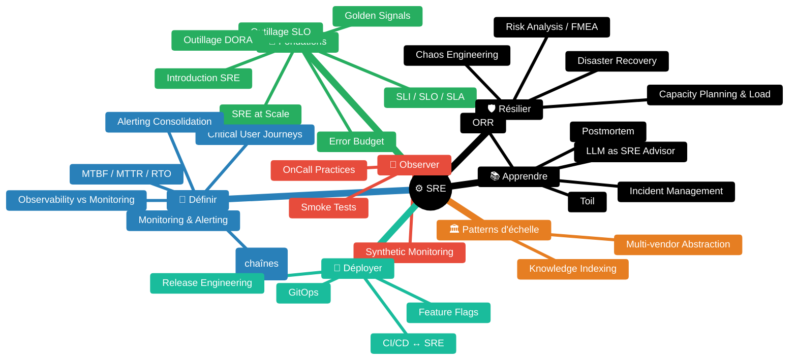
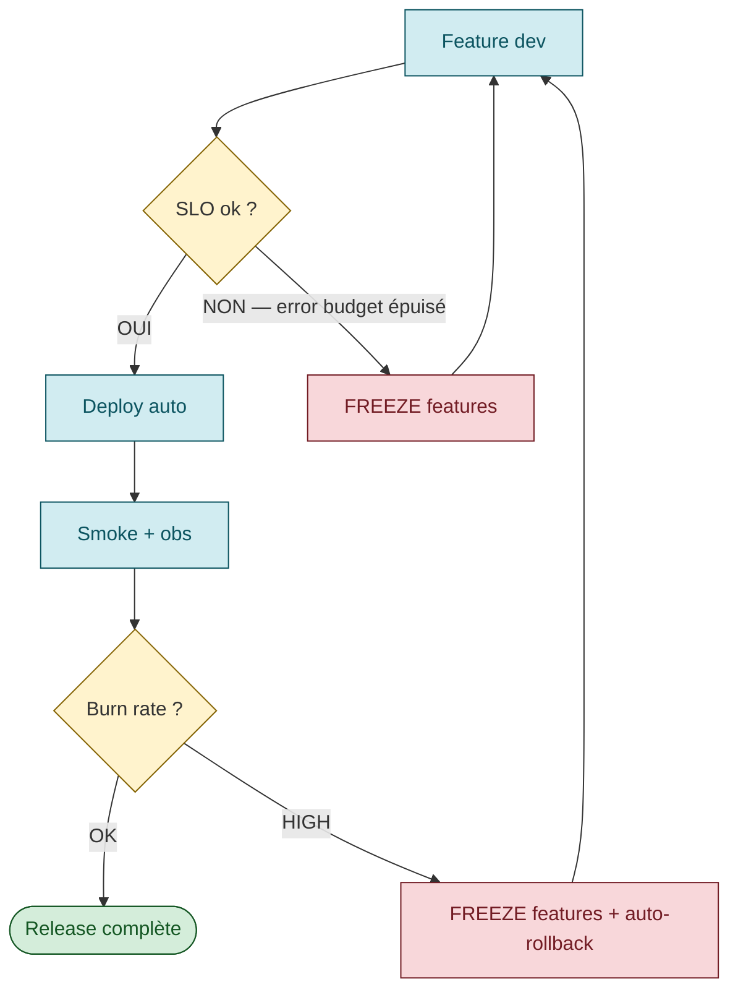

# SRE — Site Reliability Engineering

> *"Hope is not a strategy."* [📖¹](https://sre.google/sre-book/foreword/ "Google SRE book — Foreword (Benjamin Treynor Sloss)") — Traditional SRE saying, Google SRE book foreword
>
> *En français* : **l'espoir n'est pas une stratégie**.

Skill construite à partir de sources officielles reconnues (Google SRE book/workbook, AWS Well-Architected, Microsoft Azure WAF, DORA, CNCF…).

Le détail de chaque sujet est dans `guides/`. Cette page est l'index + les patterns à retenir + la **bibliothèque exhaustive des sources** utilisées dans la KB (voir la section en bas).

---

## Pourquoi le SRE existe

Le SRE part d'un constat de Google : sysadmins humains et développeurs ont des incitations opposées. Les devs sont mesurés sur la **vélocité produit**, les ops sur la **stabilité**. Ce conflit aboutit soit à des releases bloquées, soit à des incidents en série.

La réponse SRE :
1. **Définir ce que veut dire "fiable" en chiffres** (SLI, SLO, SLA)
2. **Donner aux deux équipes le même tableau de bord** (error budget)
3. **Faire de l'ingénierie sur les ops** (automation, élimination du toil, plafond 50%)
4. **Apprendre des incidents sans blamer** (postmortem culture)

> *"Hope is not a strategy. […] The role of an SRE is essentially to find ways to ensure that hope plays as small a part as possible in our day-to-day operations."* [📖¹](https://sre.google/sre-book/foreword/ "Google SRE book — Foreword (Benjamin Treynor Sloss)")
>
> *En français* : **l'espoir n'est pas une stratégie**. Le rôle d'un SRE est essentiellement de faire en sorte que l'espoir joue **le moins grand rôle possible** dans les opérations quotidiennes.

---

## Carte de navigation — sujets SRE



| 🎯 Fondations | 📐 Définir | 🔭 Observer | 🚀 Déployer | 🛡 Résilier | 📚 Apprendre |
|:---:|:---:|:---:|:---:|:---:|:---:|
| [Introduction SRE](guides/01-SRE-INTRODUCTION.md) | [CUJ](guides/critical-user-journeys.md) | [Synthetic Monitoring](guides/synthetic-monitoring.md) | [CI/CD ↔ SRE](guides/cicd-sre-link.md) | [Capacity & Load](guides/capacity-planning-load.md) | [Incident Management](guides/incident-management.md) |
| [SLI / SLO / SLA](guides/sli-slo-sla.md) | [Monitoring & Alerting](guides/monitoring-alerting.md) | [Smoke Tests](guides/smoke-tests.md) | [Release Engineering](guides/release-engineering.md) | [Disaster Recovery](guides/disaster-recovery.md) | [Postmortem](guides/postmortem.md) |
| [Error Budget](guides/error-budget.md) | [Observability vs Monitoring](guides/observability-vs-monitoring.md) | [OnCall Practices](guides/oncall-practices.md) | [Feature Flags](guides/feature-flags.md) | [Chaos Engineering](guides/chaos-engineering.md) | [ORR](guides/operational-readiness-review.md) |
| [Golden Signals](guides/golden-signals.md) | [MTBF / MTTR / RTO](guides/mtbf-mttr.md) | | [GitOps](guides/gitops.md) | [Risk Analysis / FMEA](guides/risk-analysis.md) | [Toil](guides/toil.md) |
| [Outillage SLO](guides/slo-tooling.md) | [Alerting Consolidation](guides/alerting-consolidation-strategy.md) | | | | [LLM as SRE Advisor](guides/llm-as-sre-advisor.md) |
| [Outillage DORA](guides/dora-tooling.md) | [Journey SLOs (chaînes)](guides/journey-slos-cross-service.md) | | | | |
| [SRE at Scale](guides/sre-at-scale.md) | [Service Taxonomy & SLO Ownership](guides/service-taxonomy-slo-ownership.md) | [Multi-Stack Observability](guides/multi-stack-observability.md) | | | |
| [Multi-vendor Abstraction](guides/multi-vendor-abstraction.md) | | | | | |
| [Knowledge Indexing](guides/knowledge-indexing-strategy.md) | | | | | |

---

## Le triptyque qui change tout : SLI → SLO → Error Budget

C'est le cœur de la pratique SRE. Si vous ne devez retenir qu'**une seule chose** de cette skill, c'est ça.

### SLI — Service Level Indicator

> *"a carefully defined quantitative measure of some aspect of the level of service that is provided"* [📖²](https://sre.google/sre-book/service-level-objectives/#indicators "Google SRE book ch. 4 — SLO, section Indicators (définition SLI)")
>
> *En français* : une **mesure quantitative**, rigoureusement définie, qui capture un aspect précis de la qualité du service rendu.

Forme canonique (workbook *Implementing SLOs*) :

```
SLI = number of good events / total events
```

Échelle 0–100 % où 0 = rien ne marche, 100 = rien n'est cassé. Exemples :
- `successful_HTTP_requests / total_HTTP_requests`
- `gRPC_calls_under_100ms / total_gRPC_calls`
- `search_results_using_full_corpus / total_search_results`

### SLO — Service Level Objective

> *"a target value or range of values for a service level that is measured by an SLI"* [📖²](https://sre.google/sre-book/service-level-objectives/#objectives "Google SRE book ch. 4 — SLO, section Objectives (définition SLO)")
>
> *En français* : une **valeur cible** (ou plage) pour un SLI — la cible numérique qu'on cherche à tenir.

Exemple : 99.9% des requêtes HTTP retournent un code 2xx/3xx en moins de 200ms, mesuré sur **4 semaines glissantes**.

Règles cardinales (Google SRE book ch. 4 + workbook) :
- **As few as possible** — *"if you can't ever win a conversation about priorities by quoting a particular SLO, it's probably not worth having that SLO"* [📖²](https://sre.google/sre-book/service-level-objectives/#choosing-targets "Google SRE book ch. 4 — SLO, section Choosing Targets (5 anti-patterns)")
- **Don't pick targets based on current performance** — sinon vous vous bloquez dans un effort héroïque permanent
- **Avoid absolutes** — pas de 100%, pas de "infinite", pas de "always"
- **Perfection can wait** — démarrer lâche, resserrer
- **Keep it simple** — pas d'agrégations exotiques qui masquent les régressions

### Error Budget

```
Error Budget = 1 − SLO
```

Avec SLO 99.9% sur 4 semaines, le budget = 0.1% × 4 semaines = ~40 minutes d'indisponibilité (ou 0.1% des requêtes en erreur, selon le SLI).

**Le mécanisme magique** ([Google SRE book ch. 3, *Embracing Risk*](https://sre.google/sre-book/embracing-risk/#motivation-for-error-budgets "Google SRE book ch. 3 — Embracing Risk, section Motivation for Error Budgets")) :

- Tant que le budget est plein → les devs déploient comme ils veulent, le SRE laisse passer
- Quand le budget est consommé → freeze des features, focus reliability
- Les **devs eux-mêmes** finissent par demander plus de tests / rollouts plus lents quand le budget est bas — l'incitation s'inverse d'elle-même

C'est ça qui résout le conflit dev ↔ ops.

---

## La pyramide de tests SRE

Tirée du [SRE book ch. 17 — *Testing for Reliability*](https://sre.google/sre-book/testing-reliability/ "Google SRE book ch. 17 — Testing for Reliability"), enrichie de la pratique CI/CD moderne :

<div class="sre-pyramid">
  <div class="lvl prod">🎯 Prod / Synthetic 24/7</div>
  <div class="lvl smoke">Smoke Tests · post-deploy</div>
  <div class="lvl sys">System Tests · E2E + Perf + Regression</div>
  <div class="lvl integ">Integration Tests · composants assemblés · pre-merge / pre-image</div>
  <div class="lvl unit">Unit Tests · une fonction, une classe · inner loop dev · nombreux / rapides / pas chers · la base la plus large</div>
</div>

<style>
.sre-pyramid {
  display: flex;
  flex-direction: column;
  align-items: center;
  margin: 1.5em 0;
  font-weight: 500;
}
.sre-pyramid .lvl {
  padding: 0.6em 1em;
  margin: 0.15em 0;
  border-radius: 4px;
  text-align: center;
  font-size: 0.95em;
  border: 1.5px solid;
  box-sizing: border-box;
}
.sre-pyramid .prod  { width: 25%; background:#F8D7DA; border-color:#721C24; color:#721C24; }
.sre-pyramid .smoke { width: 40%; background:#FFF3CD; border-color:#856404; color:#333; }
.sre-pyramid .sys   { width: 58%; background:#CCE5FF; border-color:#004085; color:#004085; }
.sre-pyramid .integ { width: 75%; background:#D1ECF1; border-color:#0C5460; color:#0C5460; }
.sre-pyramid .unit  { width: 92%; background:#D4EDDA; border-color:#155724; color:#155724; }
</style>

**Insight clé du SRE book ch. 17** sur les canary :

> *"A canary test isn't really a test; rather, it's structured user acceptance."* [📖³](https://sre.google/sre-book/testing-reliability/ "Google SRE book ch. 17 — Testing for Reliability")
>
> *En français* : un **canary** n'est pas vraiment un test — c'est de la **validation utilisateur structurée** en conditions réelles.

Le canary n'est pas un test déterministe — c'est de l'acceptation utilisateur en conditions réelles, mesurée par des SLI live.

---

## Les 4 Golden Signals ([Google SRE book ch. 6](https://sre.google/sre-book/monitoring-distributed-systems/#xref_monitoring_golden-signals "Google SRE book ch. 6 — Monitoring, section The Four Golden Signals"))

> *"If you measure all four golden signals and page a human when one signal is problematic […] your service will be at least decently covered by monitoring."* [📖⁴](https://sre.google/sre-book/monitoring-distributed-systems/#xref_monitoring_golden-signals "Google SRE book ch. 6 — Monitoring, section The Four Golden Signals")
>
> *En français* : si vous mesurez les 4 signaux d'or et que vous réveillez un humain dès qu'un signal dérive, votre service est **correctement couvert** par son monitoring.

| Signal | Définition | Exemple metric |
|--------|-----------|----------------|
| **Latency** | Temps de service d'une requête (séparer succès et échecs !) | p50 / p95 / p99 HTTP req duration |
| **Traffic** | Demande placée sur le système | req/s, transactions/s, I/O/s |
| **Errors** | Taux de requêtes en échec (explicit, implicit, ou par policy) | HTTP 5xx rate, deadline exceeded |
| **Saturation** | "Ressource la plus contrainte" | CPU %, mem %, queue depth, connection pool % |

**Variantes** : **RED** (Rate, Errors, Duration — pour services request/response) ; **USE** (Utilization, Saturation, Errors — pour ressources). Détail dans [`guides/golden-signals.md`](guides/golden-signals.md).

---

## Le lien CI/CD ↔ SRE

C'est souvent mal compris : **CI/CD n'est pas l'opposé du SRE**, c'en est un **outil critique**. Le SRE moderne pilote son CI/CD via les SLO :



**Patterns concrets fournis par les sources** :
- **Hermetic builds** ([SRE book ch. 8](https://sre.google/sre-book/release-engineering/ "Google SRE book ch. 8 — Release Engineering") · [Bazel — hermeticity](https://bazel.build/basics/hermeticity)) — un build de la même révision produit toujours le même artefact
- **Self-service releases** ([SRE book ch. 8](https://sre.google/sre-book/release-engineering/ "Google SRE book ch. 8 — Release Engineering")) — pas de goulot ops, les équipes contrôlent leurs releases via des outils
- **Push on Green** ([SRE book ch. 8](https://sre.google/sre-book/release-engineering/ "Google SRE book ch. 8 — Release Engineering")) — déploiement automatique de chaque build qui passe les tests
- **Canary** + **bake time** + **auto-rollback** sur burn rate — pattern [AWS (Clare Liguori)](https://aws.amazon.com/builders-library/automating-safe-hands-off-deployments/ "AWS Builders Library — Automating safe, hands-off deployments (Clare Liguori)") / [Azure — Safe deployment practices (rings)](https://learn.microsoft.com/en-us/azure/well-architected/operational-excellence/safe-deployments "Microsoft Azure WAF — Safe deployment practices (ring deployment)")
- **Smoke tests post-deploy** comme deployment gate ([Martin Fowler — SmokeTest](https://martinfowler.com/bliki/SmokeTest.html "Martin Fowler — SmokeTest (définition canonique)"))
- **Synthetic monitoring** comme SLI primaire (vs metrics serveur biaisées) — [AWS CloudWatch Synthetics](https://docs.aws.amazon.com/AmazonCloudWatch/latest/monitoring/CloudWatch_Synthetics_Canaries.html "AWS CloudWatch Synthetics — canaries (synthetic monitoring managé)") · [Azure Application Insights availability tests](https://learn.microsoft.com/en-us/azure/azure-monitor/app/availability-overview "Microsoft Azure Monitor — Application Insights availability tests")

Détail dans [`guides/cicd-sre-link.md`](guides/cicd-sre-link.md) et [`guides/release-engineering.md`](guides/release-engineering.md).

---

## Anti-patterns récurrents (à marteler en revue d'archi)

| Anti-pattern | D'où il vient | Conséquence |
|-------------|---------------|-------------|
| **SLO à 100%** | Pression commerciale ou peur | Vélocité bloquée, coût exponentiel sans bénéfice utilisateur |
| **SLO basé sur la performance actuelle** | Facilité | Impossible à atteindre durablement, équipe en burn-out |
| **Page sur causes pas sur symptômes** | Réflexe sysadmin | Pages ignorées, vraie panne ratée |
| **Page sans action humaine intelligente** | Sur-zèle monitoring | *"Pages with rote, algorithmic responses should be a red flag"* ([SRE book ch. 6 — Monitoring](https://sre.google/sre-book/monitoring-distributed-systems/ "Google SRE book ch. 6 — Monitoring Distributed Systems")) |
| **Postmortem qui désigne un coupable** | Culture de blâme | Incidents balayés sous le tapis |
| **Toil > 50% du temps SRE** | Non-priorisation auto | Pas d'amélioration, équipe quitte |
| **Pas de canary, deploy 100% direct** | Simplicité | Un bug = 100% impact instantané |
| **Smoke tests qui écrivent en prod** | Copier-coller des tests E2E | Pollution data prod, ou pire |
| **Synthetic monitoring sans alerting** | Setup orphelin | Pannes détectées et ignorées |
| **Sur-performance silencieuse** ([Chubby case](https://sre.google/sre-book/service-level-objectives/#the-global-chubby-planned-outage "Google SRE book ch. 4 — SLO, section The Global Chubby Planned Outage")) | "On fait mieux que le SLO, tant mieux" | Les clients dépendent de la réalité, pas du SLO → planifier des outages volontaires |

---

## Workflow recommandé pour une équipe qui démarre

1. **Identifier les Critical User Journeys (CUJ)** — pas plus de 3-5
2. **Définir 1-2 SLI par CUJ** (latency + availability suffit pour démarrer)
3. **Choisir un SLO modeste** (99.5% est OK pour démarrer, pas 99.99%)
4. **Calculer l'error budget mensuel/trimestriel**
5. **Écrire la error budget policy** : qui décide quoi quand le budget est consommé
6. **Instrumenter les 4 golden signals** sur les chemins critiques
7. **Mettre en place du monitoring whitebox + un seul canary blackbox** par CUJ
8. **Smoke tests post-deploy** alignés sur les CUJ (les mêmes scénarios !)
9. **Burn rate alerts multi-fenêtre** (Page : 1h/5min @ 14.4 ; 6h/30min @ 6 ; Ticket : 3j/6h @ 1)
10. **Postmortem template blameless** + premier game day

Détail de chaque étape dans les `guides/`.

---

## Cheatsheet : nombres à mémoriser

| Valeur | Vient de | Signification |
|--------|----------|---------------|
| **50%** | SRE workbook *Eliminating Toil* | Plafond max de temps SRE en ops/toil |
| **20%** | Error budget policy exemple Google | Si un incident consomme > 20% du budget → postmortem obligatoire avec action P0 |
| **4 semaines** | Workbook *Implementing SLOs* | Fenêtre roulante recommandée pour les SLO |
| **14.4 / 6 / 1** | Workbook *Alerting on SLOs*, table 5-8 | Burn rate seuils pour SLO 99.9% (page 1h/5min, page 6h/30min, ticket 3j/6h) |
| **1/12** | idem | Ratio short window / long window pour alerting multi-fenêtre |
| **2 / 5 / 10%** | idem | Pourcentage du budget consommé qui déclenche les alertes |
| **3 nines = 99.9%** | Convention | ~43 min d'indispo / mois |
| **4 nines = 99.99%** | idem | ~4 min / mois |
| **5 nines = 99.999%** | idem | ~26 sec / mois. Google Compute Engine vise 99.95% — *"three and a half nines"* [📖²](https://sre.google/sre-book/service-level-objectives/#indicators "Google SRE book ch. 4 — SLO, section Indicators (définition SLI)") |

---

## Glossaire rapide

- **CUJ** : Critical User Journey — le parcours utilisateur dont la dégradation = perte de business
- **SLI** : Service Level Indicator — mesure (good/total)
- **SLO** : Service Level Objective — cible de SLI (interne)
- **SLA** : Service Level Agreement — contrat avec conséquences (toujours < SLO)
- **Error budget** : 1 − SLO, le "droit de casser"
- **Burn rate** : à quelle vitesse on consomme le budget (1 = nominal, 14.4 = budget mensuel grillé en 2 jours)
- **MTBF / MTTR / MTTD / MTTA** : Mean Time Between Failures / To Recovery / To Detection / To Acknowledge
- **RTO / RPO** : Recovery Time Objective / Recovery Point Objective (DR/BCP)
- **Toil** : travail répétitif, manuel, automatisable, sans valeur durable
- **Postmortem** : analyse post-incident blameless
- **Golden Signals** : Latency, Traffic, Errors, Saturation
- **RED method** : Rate, Errors, Duration (pour services)
- **USE method** : Utilization, Saturation, Errors (pour ressources)
- **Whitebox monitoring** : depuis l'intérieur du système (instrumentation)
- **Blackbox monitoring** : depuis l'extérieur, comme l'utilisateur (probes, canaries)
- **Canary** : déploiement progressif sur sous-ensemble + observation
- **Bake time** : durée d'observation après un canary avant rollout complet
- **Game day** : exercice volontaire de panne pour valider la résilience
- **Hermetic build** : build reproductible quel que soit l'environnement

---

## Bibliothèque exhaustive des sources

Toutes les URLs citées dans les guides SRE (`guides/*.md`), groupées par famille. Chaque lien porte un **tooltip** (survol) avec l'auteur et la précision du sujet. Format des citations inline dans les guides : `[📖n](url)`.

### 🔖 Conventions de sourcing

- `[📖n](url)` — citation **vérifiée verbatim** dans la source pointée
- `⚠️` — reformulation pédagogique ou principe consensuel **non cité verbatim**
- Les formulations attribuées à une source mais **non retrouvées** ont été retirées lors d'une passe de vérification

---

### Canon SRE Google

**[Google SRE book](https://sre.google/sre-book/table-of-contents/ "Google SRE book — Table of contents")** — référence canonique (ch. 1-34)

- [Foreword (Benjamin Treynor Sloss)](https://sre.google/sre-book/foreword/ "Google SRE book — Foreword (Benjamin Treynor Sloss)")
- [Ch. 1 — Introduction](https://sre.google/sre-book/introduction/ "Google SRE book — Introduction (Benjamin Treynor Sloss)")
- [Ch. 2 — Production Environment at Google](https://sre.google/sre-book/production-environment/ "Google SRE book ch. 2 — Production Environment at Google")
- [Ch. 3 — Embracing Risk](https://sre.google/sre-book/embracing-risk/ "Google SRE book ch. 3 — Embracing Risk") — [Benefits](https://sre.google/sre-book/embracing-risk/#benefits "Google SRE book ch. 3 — Embracing Risk, section Benefits") · [Forming Error Budget](https://sre.google/sre-book/embracing-risk/#forming-your-error-budget "Google SRE book ch. 3 — Embracing Risk, section Forming Your Error Budget") · [Motivation for Error Budgets](https://sre.google/sre-book/embracing-risk/#motivation-for-error-budgets "Google SRE book ch. 3 — Embracing Risk, section Motivation for Error Budgets")
- [Ch. 4 — Service Level Objectives](https://sre.google/sre-book/service-level-objectives/ "Google SRE book ch. 4 — Service Level Objectives") — [Indicators](https://sre.google/sre-book/service-level-objectives/#indicators "Google SRE book ch. 4 — SLO, section Indicators (définition SLI)") · [Objectives](https://sre.google/sre-book/service-level-objectives/#objectives "Google SRE book ch. 4 — SLO, section Objectives (définition SLO)") · [Agreements](https://sre.google/sre-book/service-level-objectives/#agreements "Google SRE book ch. 4 — SLO, section Agreements (définition SLA)") · [Aggregation](https://sre.google/sre-book/service-level-objectives/#aggregation "Google SRE book ch. 4 — SLO, section Aggregation (moyennes vs percentiles)") · [Choosing Targets](https://sre.google/sre-book/service-level-objectives/#choosing-targets "Google SRE book ch. 4 — SLO, section Choosing Targets (5 anti-patterns)") · [What Do You and Your Users Care About](https://sre.google/sre-book/service-level-objectives/#what-do-you-and-your-users-care-about "Google SRE book ch. 4 — SLO, section What Do You and Your Users Care About") · [The Global Chubby Planned Outage](https://sre.google/sre-book/service-level-objectives/#the-global-chubby-planned-outage "Google SRE book ch. 4 — SLO, section The Global Chubby Planned Outage")
- [Ch. 5 — Eliminating Toil](https://sre.google/sre-book/eliminating-toil/ "Google SRE book ch. 5 — Eliminating Toil") — [Toil Defined](https://sre.google/sre-book/eliminating-toil/#id-toil-defined "Google SRE book ch. 5 — Toil, section Toil Defined") · [Is Toil Always Bad?](https://sre.google/sre-book/eliminating-toil/#is-toil-always-bad "Google SRE book ch. 5 — Toil, section Is Toil Always Bad?") · [Why Less Toil Is Better](https://sre.google/sre-book/eliminating-toil/#why-less-toil-is-better "Google SRE book ch. 5 — Toil, section Why Less Toil Is Better")
- [Ch. 6 — Monitoring Distributed Systems](https://sre.google/sre-book/monitoring-distributed-systems/ "Google SRE book ch. 6 — Monitoring Distributed Systems") — [Four Golden Signals](https://sre.google/sre-book/monitoring-distributed-systems/#xref_monitoring_golden-signals "Google SRE book ch. 6 — Monitoring, section The Four Golden Signals") · [Black-Box vs White-Box](https://sre.google/sre-book/monitoring-distributed-systems/#xref_monitoring_white-box "Google SRE book ch. 6 — Monitoring, section Black-Box vs White-Box") · [Tying These Principles Together](https://sre.google/sre-book/monitoring-distributed-systems/#id-a82udF8IBfx "Google SRE book ch. 6 — Monitoring, section Tying These Principles Together")
- [Ch. 7 — Simplicity](https://sre.google/sre-book/simplicity/ "Google SRE book ch. 7 — Simplicity")
- [Ch. 8 — Release Engineering](https://sre.google/sre-book/release-engineering/ "Google SRE book ch. 8 — Release Engineering")
- [Ch. 10 — Practical Alerting from Time-Series Data](https://sre.google/sre-book/practical-alerting/ "Google SRE book ch. 10 — Practical Alerting from Time-Series Data")
- [Ch. 11 — Being On-Call](https://sre.google/sre-book/being-on-call/ "Google SRE book ch. 11 — Being On-Call")
- [Ch. 14 — Managing Incidents](https://sre.google/sre-book/managing-incidents/ "Google SRE book ch. 14 — Managing Incidents")
- [Ch. 15 — Postmortem Culture: Learning from Failure](https://sre.google/sre-book/postmortem-culture/ "Google SRE book ch. 15 — Postmortem Culture: Learning from Failure")
- [Ch. 17 — Testing for Reliability](https://sre.google/sre-book/testing-reliability/ "Google SRE book ch. 17 — Testing for Reliability")
- [Ch. 21 — Handling Overload](https://sre.google/sre-book/handling-overload/ "Google SRE book ch. 21 — Handling Overload")
- [Ch. 22 — Addressing Cascading Failures](https://sre.google/sre-book/addressing-cascading-failures/ "Google SRE book ch. 22 — Addressing Cascading Failures")
- [Ch. 27 — Reliable Product Launches at Scale](https://sre.google/sre-book/reliable-product-launches/ "Google SRE book ch. 27 — Reliable Product Launches at Scale")

**[Google SRE workbook](https://sre.google/workbook/table-of-contents/ "Google SRE workbook — Table of contents")** — mise en pratique

- [Implementing SLOs](https://sre.google/workbook/implementing-slos/ "Google SRE workbook — Implementing SLOs (Steven Thurgood)") (Steven Thurgood) — [What to Measure Using SLIs](https://sre.google/workbook/implementing-slos/#what-to-measure-using-slis "Google SRE workbook — Implementing SLOs, section What to Measure Using SLIs") · [Choosing Appropriate Time Window](https://sre.google/workbook/implementing-slos/#choosing-an-appropriate-time-window "Google SRE workbook — Implementing SLOs, section Choosing an Appropriate Time Window") · [Continuous Improvement](https://sre.google/workbook/implementing-slos/#continuous-improvement-of-slo-targets "Google SRE workbook — Implementing SLOs, section Continuous Improvement of SLO Targets") · *Modeling User Journeys + Modeling Dependencies* (CUJ cross-team, ownership)
- [Alerting on SLOs](https://sre.google/workbook/alerting-on-slos/ "Google SRE workbook — Alerting on SLOs (burn rate alerting)") — burn rate alerting, tables 5-4 / 5-8
- [Error Budget Policy](https://sre.google/workbook/error-budget-policy/ "Google SRE workbook — Error Budget Policy (Steven Thurgood, 2018)") (Steven Thurgood, 2018)
- [Eliminating Toil](https://sre.google/workbook/eliminating-toil/ "Google SRE workbook — Eliminating Toil")
- [On-Call](https://sre.google/workbook/on-call/ "Google SRE workbook — On-Call")
- [Managing Load](https://sre.google/workbook/managing-load/ "Google SRE workbook — Managing Load")
- [Incident Response](https://sre.google/workbook/incident-response/ "Google SRE workbook — Incident Response")
- [Postmortem Culture](https://sre.google/workbook/postmortem-culture/ "Google SRE workbook — Postmortem Culture")
- [Engagement Model](https://sre.google/workbook/engagement-model/ "Google SRE workbook ch. 18 — Engagement Model") — modèles d'engagement Embedded/Consulting/Time-bounded, lifecycle de service en 7 phases, ratio < 10 %, conditions de mutualisation
- [Team Lifecycles](https://sre.google/workbook/team-lifecycles/ "Google SRE workbook ch. 19 — Team Lifecycles") — Tuckman appliqué aux équipes SRE, ratio 1:5 à 1:50, triggers de split, pratiques multi-équipes (Mission Control, SRE Exchange…)
- [SLO Engineering Case Studies](https://sre.google/workbook/slo-engineering-case-studies/ "Google SRE workbook — SLO Engineering Case Studies") — Evernote, Home Depot

**Autres ressources Google**
- [Google SRE — Practices & Processes](https://sre.google/resources/practices-and-processes/ "Google SRE — Resources, Practices & Processes")
- [Dave Rensin — class SRE implements DevOps](https://www.oreilly.com/content/how-class-sre-implements-interface-devops/ "Dave Rensin (Google) — class SRE implements DevOps")
- [Google Cloud Blog — How SRE teams are organized](https://cloud.google.com/blog/products/devops-sre/how-sre-teams-are-organized-and-how-to-get-started "Google Cloud Blog — How SRE teams are organized")
- [Google Cloud Blog — Defining SLOs for services with dependencies (CRE Life Lessons)](https://cloud.google.com/blog/products/devops-sre/defining-slos-for-services-with-dependencies-cre-life-lessons "Google Cloud Blog — Defining SLOs for services with dependencies (CRE Life Lessons)")

---

### Échelle organisationnelle — au-delà du SRE book

Sources qui complètent le canon Google quand le SRE est appliqué à des centaines d'équipes et milliers de services. Utilisées dans [`sre-at-scale.md`](guides/sre-at-scale.md), [`journey-slos-cross-service.md`](guides/journey-slos-cross-service.md), [`alerting-consolidation-strategy.md`](guides/alerting-consolidation-strategy.md), [`service-taxonomy-slo-ownership.md`](guides/service-taxonomy-slo-ownership.md), [`multi-stack-observability.md`](guides/multi-stack-observability.md).

**SLO de chaîne et dépendances**
- Treynor, Dahlin, Rau, Beyer (2017), *The Calculus of Service Availability*, ACM Queue mar-apr 2017 — [acmqueue](https://queue.acm.org/detail.cfm?id=3096459 "Treynor et al. — Calculus of Service Availability (ACM Queue 2017)") · [PDF officiel sre.google](https://sre.google/static/pdf/calculus_of.pdf "Calculus of Service Availability — PDF officiel hosté par sre.google") · [CACM mirror](https://cacm.acm.org/practice/the-calculus-of-service-availability/ "Communications of the ACM mirror — Calculus of Service Availability") — règle 1/N, rule of the extra 9, 3 leviers, mitigation (failing safe/open/closed, fallback, sharding, isolation géographique, async, graceful degradation)

**Team Topologies (Skelton & Pais)**
- [teamtopologies.com — Key concepts](https://teamtopologies.com/key-concepts "Skelton & Pais — Team Topologies, key concepts") — 4 types (Stream-aligned / Platform / Enabling / Complicated-Subsystem), 3 modes d'interaction (Collaboration / X-as-a-Service / Facilitating)
- [Martin Fowler bliki — Team Topologies](https://martinfowler.com/bliki/TeamTopologies.html "Martin Fowler bliki — Team Topologies (Skelton & Pais)") — synthèse Fowler + Conway's Law
- [IT Revolution — The Four Team Types](https://itrevolution.com/articles/four-team-types/ "IT Revolution — The Four Team Types from Team Topologies") — définitions par l'éditeur du livre
- [AWS Well-Architected — DevOps Guidance, Organize teams into distinct topology types](https://docs.aws.amazon.com/wellarchitected/latest/devops-guidance/oa.std.1-organize-teams-into-distinct-topology-types-to-optimize-the-value-stream.html "AWS Well-Architected — DevOps Guidance, OA.STD.1") — adoption AWS de Team Topologies

**Platform Engineering (CNCF)**
- [CNCF TAG App Delivery — Platforms White Paper](https://tag-app-delivery.cncf.io/whitepapers/platforms/ "CNCF TAG App Delivery — Platforms White Paper") — définition de référence d'une plateforme cloud-native, 13 capacités, attributs des équipes plateforme
- [CNCF TAG App Delivery — Platform Engineering Maturity Model](https://tag-app-delivery.cncf.io/whitepapers/platform-eng-maturity-model/ "CNCF TAG App Delivery — Platform Engineering Maturity Model") — niveaux de maturité de l'équipe plateforme

**Alerting à l'échelle (alert fatigue, consolidation)**
- [PagerDuty — Alert fatigue (Digital Operations Learn)](https://www.pagerduty.com/resources/digital-operations/learn/alert-fatigue/ "PagerDuty — Alert fatigue: definition, causes, mitigation") — 4 484 alertes/jour SecOps, Event Intelligence 98 % noise reduction
- [Atlassian — Understanding and fighting alert fatigue](https://www.atlassian.com/incident-management/on-call/alert-fatigue "Atlassian — Understanding and fighting alert fatigue") — catégorisation, techniques de réduction
- [incident.io — Alert fatigue solutions for DevOps teams in 2025](https://incident.io/blog/alert-fatigue-solutions-for-dev-ops-teams-in-2025-what-works "incident.io — Alert fatigue solutions for DevOps teams in 2025") — chiffres 2025 (67 %, 85 %, 74 %, 83 %), correlation engines, monitoring inventory
- [Runframe — State of Incident Management 2026](https://runframe.io/blog/state-of-incident-management-2025 "Runframe — State of Incident Management 2026: Toil rose 30%") — toil +30 % malgré l'IA

**Multi-vendor abstraction et knowledge indexing (patterns d'échelle)**
- [Microsoft Azure Architecture Center — Anti-corruption Layer pattern](https://learn.microsoft.com/en-us/azure/architecture/patterns/anti-corruption-layer "Microsoft Azure — ACL pattern (Eric Evans, DDD)") — pattern fondateur DDD, façade/adapter
- [AWS Prescriptive Guidance — Anti-corruption layer](https://docs.aws.amazon.com/prescriptive-guidance/latest/cloud-design-patterns/acl.html "AWS Prescriptive Guidance — ACL pattern") — variante AWS du pattern
- [OpenTelemetry — What is OpenTelemetry?](https://opentelemetry.io/docs/what-is-opentelemetry/ "OpenTelemetry — Vendor-neutral observability framework") — cas industriel multi-vendor canonique
- [Backstage TechDocs](https://backstage.io/docs/features/techdocs/ "Backstage TechDocs — Spotify docs-like-code solution") — agrégation multi-source de documentation
- [Backstage TechDocs Confluence module](https://github.com/backstage/community-plugins/blob/main/workspaces/confluence/plugins/techdocs-backend-module-confluence/README.md "Backstage Community — TechDocs Confluence module") — preparer multi-source
- [GoSearch — 2025's Leading Enterprise Knowledge Management Systems](https://www.gosearch.ai/blog/2025-leading-enterprise-knowledge-management-systems/ "GoSearch — 2025 enterprise KM systems") — federated vs indexed search
- [GoSearch — Corporate Wikis vs Enterprise Search](https://www.gosearch.ai/blog/corporate-wikis-vs-enterprise-search/ "GoSearch — index vs migrate") — indexer plutôt que migrer

---

### AWS

**[Well-Architected Framework](https://docs.aws.amazon.com/wellarchitected/latest/framework/welcome.html "AWS Well-Architected Framework — Welcome")**
- [Operational Excellence Pillar](https://docs.aws.amazon.com/wellarchitected/latest/operational-excellence-pillar/welcome.html "AWS Well-Architected — Operational Excellence Pillar") — [Observability](https://docs.aws.amazon.com/wellarchitected/latest/operational-excellence-pillar/observability.html "AWS Well-Architected — Operational Excellence, Observability") · [OPS07-BP02 ORR](https://docs.aws.amazon.com/wellarchitected/latest/operational-excellence-pillar/ops_ready_to_support_const_orr.html "AWS Well-Architected — OPS07-BP02 Operational Readiness Review") · [OPS10 Event/Incident/Problem](https://docs.aws.amazon.com/wellarchitected/latest/framework/ops_event_response_event_incident_problem_process.html "AWS Well-Architected — OPS10 Event, incident, and problem management")
- [Reliability Pillar](https://docs.aws.amazon.com/wellarchitected/latest/reliability-pillar/welcome.html "AWS Well-Architected — Reliability Pillar") — [Disaster Recovery Objectives (RTO/RPO)](https://docs.aws.amazon.com/wellarchitected/latest/reliability-pillar/disaster-recovery-dr-objectives.html "AWS Well-Architected — Reliability, Disaster Recovery Objectives (RTO/RPO)")
- [Operational Readiness Reviews (guide ORR)](https://docs.aws.amazon.com/wellarchitected/latest/operational-readiness-reviews/wa-operational-readiness-reviews.html "AWS Well-Architected — Operational Readiness Reviews (guide ORR)") — [The ORR Tool](https://docs.aws.amazon.com/wellarchitected/latest/operational-readiness-reviews/the-orr-tool.html "AWS Well-Architected — The ORR Tool") · [Scale ORR blog](https://aws.amazon.com/blogs/mt/scale-operational-readiness-reviews-with-aws-well-architected-tool/ "AWS Blog — Scale ORR with AWS Well-Architected Tool")
- [Whitepaper — Disaster Recovery Options in the Cloud](https://docs.aws.amazon.com/whitepapers/latest/disaster-recovery-workloads-on-aws/disaster-recovery-options-in-the-cloud.html "AWS Whitepaper — Disaster Recovery Options in the Cloud (4 stratégies)")
- [Blog — Establishing RPO/RTO targets](https://aws.amazon.com/blogs/mt/establishing-rpo-and-rto-targets-for-cloud-applications/ "AWS Blog — Establishing RPO/RTO targets for cloud applications")

**[Builders' Library](https://aws.amazon.com/builders-library/ "AWS Builders Library — catalogue Amazon")**
- [Automating safe, hands-off deployments](https://aws.amazon.com/builders-library/automating-safe-hands-off-deployments/ "AWS Builders Library — Automating safe, hands-off deployments (Clare Liguori)") (Clare Liguori)
- [Going faster with continuous delivery](https://aws.amazon.com/builders-library/going-faster-with-continuous-delivery/ "AWS Builders Library — Going faster with continuous delivery")
- [Implementing health checks](https://aws.amazon.com/builders-library/implementing-health-checks/ "AWS Builders Library — Implementing health checks (David Yanacek)") (David Yanacek)
- [Timeouts, retries and backoff with jitter](https://aws.amazon.com/builders-library/timeouts-retries-and-backoff-with-jitter/ "AWS Builders Library — Timeouts, retries and backoff with jitter (Marc Brooker)") (Marc Brooker)
- [Using load shedding to avoid overload](https://aws.amazon.com/builders-library/using-load-shedding-to-avoid-overload/ "AWS Builders Library — Using load shedding to avoid overload (David Yanacek)") (David Yanacek)

**Services AWS cités**
- [Service Level Agreements (contrats SLA)](https://aws.amazon.com/legal/service-level-agreements/ "AWS — Service Level Agreements (SLA contractuels)")
- [Fault Injection Service (FIS)](https://aws.amazon.com/fis/ "AWS Fault Injection Service (FIS) — chaos engineering managé") — chaos engineering managé
- [Resilience Hub](https://aws.amazon.com/resilience-hub/)
- [CloudWatch Synthetics canaries](https://docs.aws.amazon.com/AmazonCloudWatch/latest/monitoring/CloudWatch_Synthetics_Canaries.html "AWS CloudWatch Synthetics — canaries (synthetic monitoring managé)") — [runtime library](https://docs.aws.amazon.com/AmazonCloudWatch/latest/monitoring/CloudWatch_Synthetics_Canaries_Library.html)
- [CodeDeploy — rollback & redeploy](https://docs.aws.amazon.com/codedeploy/latest/userguide/deployments-rollback-and-redeploy.html) — [deployment configurations](https://docs.aws.amazon.com/codedeploy/latest/userguide/deployment-configurations-create.html)

---

### Microsoft Azure

**[Well-Architected Framework](https://learn.microsoft.com/azure/well-architected/ "Microsoft Azure Well-Architected Framework")**
- [Operational Excellence — Observability](https://learn.microsoft.com/en-us/azure/well-architected/operational-excellence/observability "Microsoft Azure WAF — Operational Excellence, Observability") · [Safe deployment practices (rings)](https://learn.microsoft.com/en-us/azure/well-architected/operational-excellence/safe-deployments "Microsoft Azure WAF — Safe deployment practices (ring deployment)") · [Dynatrace integration](https://learn.microsoft.com/en-us/azure/well-architected/operational-excellence/dynatrace)
- [Performance Efficiency — Capacity Planning](https://learn.microsoft.com/en-us/azure/well-architected/performance-efficiency/capacity-planning "Microsoft Azure WAF — Performance Efficiency, Capacity Planning")
- [Reliability — Identify flows (user flows)](https://learn.microsoft.com/en-us/azure/well-architected/reliability/identify-flows "Microsoft Azure WAF — Reliability, Identify flows (user flows)") · [Disaster Recovery](https://learn.microsoft.com/en-us/azure/well-architected/reliability/disaster-recovery "Microsoft Azure WAF — Reliability, Disaster Recovery") · [Testing strategy](https://learn.microsoft.com/en-us/azure/well-architected/reliability/testing-strategy "Microsoft Azure WAF — Reliability, Testing strategy")
- [Incident management design guide](https://learn.microsoft.com/en-us/azure/well-architected/design-guides/incident-management "Microsoft Azure WAF — Incident management design guide")

**Services Azure**
- [Azure Monitor — Application Insights availability tests](https://learn.microsoft.com/en-us/azure/azure-monitor/app/availability-overview "Microsoft Azure Monitor — Application Insights availability tests")
- [Azure — SLA contractuels](https://azure.microsoft.com/en-us/support/legal/sla/ "Microsoft Azure — SLA contractuels")
- [Azure Chaos Studio](https://azure.microsoft.com/en-us/products/chaos-studio)

---

### Google Cloud & DORA

- [Google Cloud Architecture Center — Defining SLOs](https://cloud.google.com/architecture/defining-slos "Google Cloud Architecture Center — Defining SLOs")
- [Google Cloud — Application deployment & testing strategies](https://cloud.google.com/architecture/application-deployment-and-testing-strategies)
- [Google Cloud — DR Scenarios Planning Guide](https://docs.cloud.google.com/architecture/dr-scenarios-planning-guide)
- [Google Cloud — SLA contractuels](https://cloud.google.com/terms/sla "Google Cloud — SLA contractuels")
- Blog case studies : [Hakuhodo SRE](https://cloud.google.com/blog/products/devops-sre/how-hakuhodo-technologies-transforms-its-organization-with-sre) · [Sabre SRE](https://cloud.google.com/blog/products/devops-sre/sabre-leverages-google-cloud-and-site-reliability-engineering)
- **[DORA research](https://dora.dev/research/ "DORA research (Google Cloud) — 4 key DevOps metrics")** — 4 DevOps metrics (deployment frequency, lead time, change failure rate, MTTR) · livre [Accelerate (Forsgren et al.)](https://itrevolution.com/product/accelerate/)

---

### SLO Tooling (Pyrra, Sloth, OpenSLO)

Outils open source qui industrialisent la définition SLO → `PrometheusRule` + alerting multi-window + dashboards. Voir le guide dédié [`slo-tooling.md`](guides/slo-tooling.md).

- **[Pyrra (pyrra-dev/pyrra)](https://github.com/pyrra-dev/pyrra "Pyrra — SLO controller Kubernetes + UI + génération règles Prometheus")** — CRD `pyrra.dev/v1alpha1`, operator K8s, UI web intégrée, génération automatique règles burn-rate multi-window (4 sévérités) — maintenu par Grafana Labs + Polar Signals, Apache 2.0
- **[Pyrra — site officiel](https://pyrra.dev/ "Pyrra — SLO controller Kubernetes + UI + génération règles Prometheus")** — landing page, docs, modes de déploiement (Kubernetes, Docker, filesystem)
- **[Sloth (slok/sloth)](https://github.com/slok/sloth "Sloth — générateur PrometheusRule depuis CRD, support OpenSLO")** — générateur CLI ou controller K8s, CRD `sloth.slok.dev/v1` `PrometheusServiceLevel`, **supporte OpenSLO en input**, pas d'UI (délégué à Grafana), Apache 2.0
- **[OpenSLO (OpenSLO/OpenSLO)](https://github.com/OpenSLO/OpenSLO "OpenSLO — spec YAML neutre, initiée par Nobl9")** — spec YAML vendor-agnostic (`apiVersion: openslo/v1`), objets SLO/SLI/Service/AlertPolicy/DataSource, 3 modes de budgeting (Occurrences, Timeslices, RatioTimeslices)
- [Nobl9](https://www.nobl9.com/) — implémentation commerciale OpenSLO (hors scope open source, cité pour contexte)

---

### DORA Tooling (DevLake, Four Keys, Faros)

Outils open source qui calculent les 4 métriques DORA à partir de Git/CI/postmortems. Voir le guide dédié [`dora-tooling.md`](guides/dora-tooling.md).

- **[Apache DevLake (Incubating)](https://devlake.apache.org/ "Apache DevLake — plateforme DORA + DevOps metrics (ASF Incubation)")** — plateforme Go + MySQL/PostgreSQL + Grafana, plugin GitLab avec 4 métriques DORA natives, 20+ connecteurs (GitHub, Jenkins, Jira, SonarQube…), Apache 2.0, ASF Incubation — [DevLake GitHub](https://github.com/apache/incubator-devlake "Apache DevLake — GitHub (ASF Incubation)") · [Plugin GitLab](https://devlake.apache.org/docs/Plugins/gitlab "Apache DevLake — Plugin GitLab, configuration et métriques DORA")
- **[Google Four Keys](https://github.com/dora-team/fourkeys "Google Four Keys — implémentation officielle DORA par Google Cloud")** — implémentation officielle Google Cloud, stack GCP (Cloud Run + BigQuery + Looker Studio), activité ralentie depuis 2023
- **[Faros AI Community Edition](https://github.com/faros-ai/faros-community-edition "Faros AI Community Edition — plateforme DORA open source")** — alternative OSS, TypeScript + PostgreSQL + Metabase, scope plus large que DORA (engineering analytics)
- [Sleuth](https://www.sleuth.io/ "Sleuth — outil DORA commercial (SaaS)") — outil SaaS commercial (cité pour contexte)

---

### Observabilité (Honeycomb, OpenTelemetry, Prometheus, Grafana)

**Fondamentaux observability**
- [Honeycomb — What is Observability?](https://www.honeycomb.io/what-is-observability "Honeycomb — What is Observability?")
- [Honeycomb — Observability 3-Year Retrospective (Charity Majors)](https://www.honeycomb.io/blog/observability-3-year-retrospective "Honeycomb — Observability 3-Year Retrospective (Charity Majors)")
- [Honeycomb — So you want to build an observability tool](https://www.honeycomb.io/blog/so-you-want-to-build-an-observability-tool)
- [Honeycomb — Testing in Production](https://www.honeycomb.io/blog/testing-in-production)
- [Honeycomb — Time to version observability](https://www.honeycomb.io/blog/time-to-version-observability)
- *[Distributed Systems Observability](https://www.oreilly.com/library/view/distributed-systems-observability/9781492033431/ "Cindy Sridharan (O'Reilly, 2018)")* — Cindy Sridharan (O'Reilly, 2018)
- *[Observability Engineering](https://www.oreilly.com/library/view/observability-engineering/9781492076438/ "Majors, Fong-Jones, Miranda (O'Reilly, 2022)")* — Majors, Fong-Jones, Miranda (O'Reilly, 2022)

**[OpenTelemetry (CNCF)](https://opentelemetry.io/docs/concepts/observability-primer/ "OpenTelemetry — Observability primer (CNCF)")**
- [Observability primer](https://opentelemetry.io/docs/concepts/observability-primer/ "OpenTelemetry — Observability primer (CNCF)") · [Signals (metrics, logs, traces, baggage)](https://opentelemetry.io/docs/concepts/signals/ "OpenTelemetry — Signals (metrics, logs, traces, baggage)") · [Logs](https://opentelemetry.io/docs/concepts/signals/logs/) · [Traces](https://opentelemetry.io/docs/concepts/signals/traces/)

**Prometheus**
- [Overview (pull model)](https://prometheus.io/docs/introduction/overview/ "Prometheus — Overview (pull model)") · [Data Model](https://prometheus.io/docs/concepts/data_model/ "Prometheus — Data Model (time series, labels)") · [PromQL basics](https://prometheus.io/docs/prometheus/latest/querying/basics/ "Prometheus — PromQL querying basics") · [Recording rules](https://prometheus.io/docs/prometheus/latest/configuration/recording_rules/ "Prometheus — Recording rules") · [Alertmanager](https://prometheus.io/docs/alerting/latest/alertmanager/ "Prometheus — Alertmanager (routing, deduplication)")
- Pratiques : [Histograms](https://prometheus.io/docs/practices/histograms/ "Prometheus — Practices: Histograms and Summaries") · [Alerting](https://prometheus.io/docs/practices/alerting/ "Prometheus — Practices: Alerting") · [Instrumentation](https://prometheus.io/docs/practices/instrumentation/)
- Clients/exporteurs : [Python client](https://prometheus.github.io/client_python/) · [node_exporter](https://github.com/prometheus/node_exporter) · [Blackbox Exporter](https://github.com/prometheus/blackbox_exporter)

**Grafana Labs**
- [Grafana](https://grafana.com/ "Grafana — observability UI") · [Loki (logs)](https://grafana.com/oss/loki/) · [Tempo (traces)](https://grafana.com/oss/tempo/)
- [The RED Method (Tom Wilkie)](https://grafana.com/blog/the-red-method-how-to-instrument-your-services/ "Grafana Labs — The RED Method (Tom Wilkie)")
- [Dashboard best practices](https://grafana.com/docs/grafana/latest/dashboards/build-dashboards/best-practices/) · [Annotate visualizations](https://grafana.com/docs/grafana/latest/dashboards/build-dashboards/annotate-visualizations/)
- [Types of load testing](https://grafana.com/load-testing/types-of-load-testing/) · [k6 docs](https://k6.io/docs/)

**APM & commercial**
- [Datadog](https://www.datadoghq.com/) · [Datadog APM](https://www.datadoghq.com/product/apm/) · [Datadog blog — Error Budgets & SLOs](https://www.datadoghq.com/blog/error-budget-and-slos/)
- [Datadog Synthetics](https://docs.datadoghq.com/synthetics/) · [API tests](https://docs.datadoghq.com/synthetics/api_tests/http_tests/) · [Multistep](https://docs.datadoghq.com/synthetics/multistep/) · [Browser advanced](https://docs.datadoghq.com/synthetics/browser_tests/advanced_options/) · [Trigger API](https://docs.datadoghq.com/api/latest/synthetics/#trigger-synthetics-tests) · [Guide](https://docs.datadoghq.com/synthetics/guide/synthetic-test-monitors/)
- [Dynatrace — Site Reliability Guardians](https://docs.dynatrace.com/docs/deliver/site-reliability-guardians)
- [Checkly](https://docs.checklyhq.com/) · [Pingdom](https://www.pingdom.com/) · [Uptime Kuma](https://github.com/louislam/uptime-kuma) · [Percy](https://percy.io/) · [Applitools](https://applitools.com/)

---

### Incident Management

**[PagerDuty Incident Response (CC BY 4.0)](https://response.pagerduty.com/ "PagerDuty Incident Response docs (CC BY 4.0)")**
- [Different Roles (IC/Ops/Comms/Planning)](https://response.pagerduty.com/before/different_roles/ "PagerDuty — Different Roles (IC, Ops, Comms, Planning)") · [Severity Levels](https://response.pagerduty.com/before/severity_levels/ "PagerDuty — Severity Levels (SEV-1 à SEV-5)")
- [Being On-Call](https://response.pagerduty.com/oncall/being_oncall/ "PagerDuty — Being On-Call") · [Alerting principles](https://response.pagerduty.com/oncall/alerting_principles/ "PagerDuty — Alerting principles (on-call guide)") · [Incident Commander training](https://response.pagerduty.com/training/incident_commander/ "PagerDuty — Incident Commander training")
- [Status updates](https://response.pagerduty.com/during/status_updates/) · [Post-mortem process](https://response.pagerduty.com/after/post_mortem_process/ "PagerDuty — Post-mortem process")
- [PagerDuty.com](https://www.pagerduty.com/) · [Incident metrics](https://www.pagerduty.com/resources/learn/incident-management-metrics/) · [Escalation policies](https://support.pagerduty.com/docs/escalation-policies)

**Atlassian**
- [Incident Management Handbook](https://www.atlassian.com/incident-management/handbook "Atlassian — Incident Management Handbook") · [Communications](https://www.atlassian.com/incident-management/handbook/communications)
- [Common metrics (MTBF/MTTR/MTTA/MTTF)](https://www.atlassian.com/incident-management/kpis/common-metrics "Atlassian — Common incident metrics (MTBF/MTTR/MTTA/MTTF)") · [Severity Levels](https://www.atlassian.com/incident-management/kpis/severity-levels "Atlassian — Severity Levels")
- [Incident Postmortem guide](https://www.atlassian.com/incident-management/postmortem "Atlassian — Incident Postmortem guide") · [Risk Matrix](https://www.atlassian.com/work-management/project-management/risk-matrix)
- Outils : [Jira](https://www.atlassian.com/software/jira) · [Confluence](https://www.atlassian.com/software/confluence) · [Opsgenie](https://www.atlassian.com/software/opsgenie) · [Statuspage](https://www.atlassian.com/software/statuspage)

**Postmortems publics**
- [Cloudflare](https://blog.cloudflare.com/tag/postmortem/) · [GitLab](https://about.gitlab.com/handbook/engineering/incidents/) · [Stripe Status](https://status.stripe.com/) · [Instatus](https://instatus.com/)

---

### Release, GitOps, Progressive Delivery

**Kubernetes / Helm**
- [Deployment rolling update](https://kubernetes.io/docs/concepts/workloads/controllers/deployment/#rolling-update-deployment) · [Rollback](https://kubernetes.io/docs/concepts/workloads/controllers/deployment/#rolling-back-a-deployment)
- [Liveness/Readiness/Startup probes](https://kubernetes.io/docs/tasks/configure-pod-container/configure-liveness-readiness-startup-probes/ "Kubernetes — Liveness, Readiness, Startup probes")
- [Helm rollback](https://helm.sh/docs/helm/helm_rollback/)
- [Istio](https://istio.io/latest/docs/concepts/what-is-istio/) — service mesh pour traffic splitting / mTLS
- Résilience : [Hystrix (Netflix)](https://github.com/Netflix/Hystrix) · [resilience4j](https://resilience4j.readme.io/) · [Envoy — Circuit Breaking](https://www.envoyproxy.io/docs/envoy/latest/intro/arch_overview/upstream/circuit_breaking) · [Martin Fowler — CircuitBreaker](https://martinfowler.com/bliki/CircuitBreaker.html)

**Progressive delivery**
- [Argo Rollouts](https://argoproj.github.io/argo-rollouts/ "Argo Rollouts — progressive delivery Kubernetes") · [Analysis templates](https://argoproj.github.io/argo-rollouts/features/analysis/)
- [Argo CD](https://argo-cd.readthedocs.io/ "Argo CD — GitOps continuous delivery")
- [Flagger](https://flagger.app/ "Flagger — progressive delivery Flux (CNCF)") · [FluxCD](https://fluxcd.io/ "FluxCD — GitOps toolkit (CNCF)")
- [Spinnaker — Canary analysis (Kayenta)](https://spinnaker.io/docs/guides/user/canary/)
- [Bazel — hermeticity](https://bazel.build/basics/hermeticity)

**GitOps**
- [OpenGitOps — 4 principes canoniques (CNCF)](https://opengitops.dev/#principles "OpenGitOps — 4 principes canoniques (CNCF)")
- [Weaveworks — What is GitOps really (Alexis Richardson, 2017)](https://www.weave.works/blog/what-is-gitops-really) · [GitOps case studies](https://www.weave.works/technologies/gitops/)
- [CNCF — State of GitOps 2022](https://www.cncf.io/reports/the-voice-of-kubernetes-experts-2022/)
- [James Governor (RedMonk) — Towards Progressive Delivery (2018)](https://redmonk.com/jgovernor/2018/08/06/towards-progressive-delivery/ "James Governor (RedMonk) — Towards Progressive Delivery (2018)")

---

### Feature Flags

- [Martin Fowler / Pete Hodgson — Feature Toggles (référence canonique)](https://martinfowler.com/articles/feature-toggles.html "Martin Fowler / Pete Hodgson — Feature Toggles (référence canonique)")
- [LaunchDarkly — What are feature flags](https://launchdarkly.com/blog/what-are-feature-flags/ "LaunchDarkly — What are feature flags") · [Technical debt from flags](https://launchdarkly.com/docs/guides/flags/technical-debt)
- [Unleash — 11 best practices](https://docs.getunleash.io/guides/feature-flag-best-practices)
- [Flagsmith](https://www.flagsmith.com/) · [ConfigCat](https://configcat.com/)
- [AWS CloudWatch Evidently](https://docs.aws.amazon.com/AmazonCloudWatch/latest/monitoring/CloudWatch-Evidently.html) · [Azure App Configuration Feature Management](https://learn.microsoft.com/en-us/azure/azure-app-configuration/concept-feature-management)
- [DevCycle — Managing tech debt](https://docs.devcycle.com/best-practices/tech-debt/)
- [Octopus Deploy — 4 types of feature flags](https://octopus.com/devops/feature-flags/)
- [OpenFeature — CNCF spec](https://openfeature.dev/)

---

### Chaos Engineering

- [Principles of Chaos Engineering (Netflix / ChaosConf)](https://principlesofchaos.org/ "Principles of Chaos Engineering (Netflix / ChaosConf)")
- [Netflix Tech Blog — The Netflix Simian Army (2011)](https://netflixtechblog.com/the-netflix-simian-army-16e57fbab116 "Netflix Tech Blog — The Netflix Simian Army (2011)")
- [Netflix SimianArmy source code](https://github.com/Netflix/SimianArmy "Netflix SimianArmy — source code Chaos Monkey")
- [Gremlin — Chaos Engineering history & practice](https://www.gremlin.com/community/tutorials/chaos-engineering-the-history-principles-and-practice/)
- [Chaos Mesh (CNCF)](https://chaos-mesh.org/ "Chaos Mesh — Kubernetes chaos (CNCF)") · [LitmusChaos (CNCF)](https://litmuschaos.io/ "LitmusChaos — Kubernetes chaos (CNCF)") · [Chaos Toolkit](https://chaostoolkit.org/)
- Autoscaling prédictif : [AWS Predictive Scaling](https://docs.aws.amazon.com/autoscaling/ec2/userguide/ec2-auto-scaling-predictive-scaling.html) · [Google Cloud — Predictive autoscaling](https://cloud.google.com/compute/docs/autoscaler/predictive-autoscaling)

---

### Testing & Frameworks

- [Martin Fowler — SmokeTest (référence canonique)](https://martinfowler.com/bliki/SmokeTest.html "Martin Fowler — SmokeTest (définition canonique)") · [Test Pyramid](https://martinfowler.com/bliki/TestPyramid.html "Martin Fowler — Test Pyramid") · [Continuous Integration](https://martinfowler.com/articles/continuousIntegration.html "Martin Fowler — Continuous Integration") · [Blue-Green Deployment](https://martinfowler.com/bliki/BlueGreenDeployment.html "Martin Fowler — Blue-Green Deployment") · [ParallelChange (Expand/Contract)](https://martinfowler.com/bliki/ParallelChange.html "Martin Fowler — ParallelChange (Expand/Contract pattern)")
- [Sadalage & Ambler — Refactoring Databases](https://www.martinfowler.com/books/refactoringDatabases.html)
- [Behave — Tag expressions](https://behave.readthedocs.io/en/stable/tag_expressions/ "Behave (Python BDD) — Tag expressions v2 (documentation)")
- [Locust](https://locust.io/) · [Gatling](https://gatling.io/)
- [Google Testing Blog — Flaky Tests (2016)](https://testing.googleblog.com/2016/05/flaky-tests-at-google-and-how-we.html)
- [Chromium — Issue triage guidelines](https://chromium.googlesource.com/chromium/src/+/HEAD/docs/issue_triage.md)

---

### Risk Analysis, FMEA, Safety

- [Wikipedia — FMEA](https://en.wikipedia.org/wiki/Failure_mode_and_effects_analysis "Wikipedia — FMEA (Failure Mode and Effects Analysis)") · [Risk Matrix](https://en.wikipedia.org/wiki/Risk_matrix) · [Five whys](https://en.wikipedia.org/wiki/Five_whys "Wikipedia — Five whys (Taiichi Ohno / Toyota)") · [SMART criteria](https://en.wikipedia.org/wiki/SMART_criteria "Wikipedia — SMART criteria (Doran 1981)") · [High Availability (nines)](https://en.wikipedia.org/wiki/High_availability#%22Nines%22 "Wikipedia — High Availability (terminologie nines)") · [Sanity check](https://en.wikipedia.org/wiki/Sanity_check "Wikipedia — Sanity check (origine QA)")
- [6Sigma.us — Risk Priority Number in FMEA](https://www.6sigma.us/six-sigma-articles/risk-priority-number-rpn/)
- [HBK — Examining Risk Priority Numbers in FMEA](https://www.hbkworld.com/en/knowledge/resource-center/articles/examining-risk-priority-numbers-in-fmea)
- [AIAG/VDA FMEA Handbook 2019](https://www.aiag.org/quality/automotive-core-tools/fmea)
- [OWASP — Threat Modeling](https://owasp.org/www-community/Threat_Modeling) · [Microsoft — STRIDE threats](https://learn.microsoft.com/en-us/azure/security/develop/threat-modeling-tool-threats)

---

### Standards & référentiels institutionnels

- [C.A.R. Hoare — Turing Award Lecture 1980 *The Emperor's Old Clothes*](https://www.cs.fsu.edu/~engelen/courses/HPC-adv/p75-hoare.pdf "C.A.R. Hoare — Turing Award Lecture 1980") — *« the pursuit of the utmost simplicity »*
- [NIST SP 800-34 — Contingency Planning](https://csrc.nist.gov/publications/detail/sp/800-34/rev-1/final)
- [ISO/IEC/IEEE 24765 — vocabulaire engineering](https://www.iso.org/standard/71952.html)
- [Veeam — 3-2-1-1-0 backup rule](https://www.veeam.com/blog/321-backup-rule.html)

---

### Auteurs individuels cités

- **Benjamin Treynor Sloss** (Google) — fondateur SRE, [foreword SRE book](https://sre.google/sre-book/foreword/ "Google SRE book — Foreword (Benjamin Treynor Sloss)")
- **Steven Thurgood** (Google) — auteur [Implementing SLOs](https://sre.google/workbook/implementing-slos/ "Google SRE workbook — Implementing SLOs (Steven Thurgood)") et [Error Budget Policy](https://sre.google/workbook/error-budget-policy/ "Google SRE workbook — Error Budget Policy (Steven Thurgood, 2018)")
- **Charity Majors** (Honeycomb) — observability 2.0 / wide events — [Observability retrospective](https://www.honeycomb.io/blog/observability-3-year-retrospective "Honeycomb — Observability 3-Year Retrospective (Charity Majors)")
- **Brendan Gregg** (Netflix) — [USE Method](https://www.brendangregg.com/usemethod.html "Brendan Gregg (Netflix) — The USE Method") · [USE Linux checklist](https://www.brendangregg.com/USEmethod/use-linux.html)
- **Tom Wilkie** (Grafana Labs, ex-Weaveworks) — [RED Method](https://grafana.com/blog/the-red-method-how-to-instrument-your-services/ "Grafana Labs — The RED Method (Tom Wilkie)") · [New Stack interview](https://thenewstack.io/monitoring-microservices-red-method/) · [Last9 synthèse](https://last9.io/blog/monitoring-with-red-method/)
- **Clare Liguori**, **David Yanacek**, **Marc Brooker** (Amazon) — auteurs [AWS Builders' Library](https://aws.amazon.com/builders-library/ "AWS Builders Library — catalogue Amazon")
- **Pete Hodgson** — [Feature Toggles pour Martin Fowler](https://martinfowler.com/articles/feature-toggles.html "Martin Fowler / Pete Hodgson — Feature Toggles (référence canonique)")
- **Martin Fowler** — blog + livres [martinfowler.com](https://martinfowler.com/)
- **Alexis Richardson** (Weaveworks) — [origine du GitOps](https://www.weave.works/blog/what-is-gitops-really)
- **James Governor** (RedMonk) — [Progressive Delivery](https://redmonk.com/jgovernor/2018/08/06/towards-progressive-delivery/ "James Governor (RedMonk) — Towards Progressive Delivery (2018)")
- **Nicole Forsgren, Jez Humble, Gene Kim** — [Accelerate (DORA book)](https://itrevolution.com/product/accelerate/)
- **Cindy Sridharan** — [Distributed Systems Observability](https://www.oreilly.com/library/view/distributed-systems-observability/9781492033431/ "Cindy Sridharan (O'Reilly, 2018)")
- **Dave Rensin** (Google) — [class SRE implements DevOps](https://www.oreilly.com/content/how-class-sre-implements-interface-devops/ "Dave Rensin (Google) — class SRE implements DevOps")
- **Taiichi Ohno** (Toyota) — inventeur des [Five whys](https://en.wikipedia.org/wiki/Five_whys "Wikipedia — Five whys (Taiichi Ohno / Toyota)")
- **C.A.R. Hoare** — [Turing Award Lecture 1980](https://www.cs.fsu.edu/~engelen/courses/HPC-adv/p75-hoare.pdf "C.A.R. Hoare — Turing Award Lecture 1980")
- **George S. Doran** — [SMART criteria 1981](https://en.wikipedia.org/wiki/SMART_criteria "Wikipedia — SMART criteria (Doran 1981)")

---

### Outils collaboratifs cités (contexte opérationnel)

[Slack](https://slack.com/) · [Microsoft Teams](https://www.microsoft.com/en-us/microsoft-teams/) · [Google Docs](https://docs.google.com/) · [GitHub Issues](https://github.com/features/issues)

---

## Crédits & licences

Le matériel Google SRE est sous licence **CC BY-NC-ND 4.0** : citations courtes attribuées OK, redistribution intégrale ou modifications interdites. Les contenus AWS Builders' Library, Microsoft Learn, PagerDuty Response (CC BY 4.0) et autres sont publiés sous leurs propres conditions — référencer les URLs plutôt que copier.
