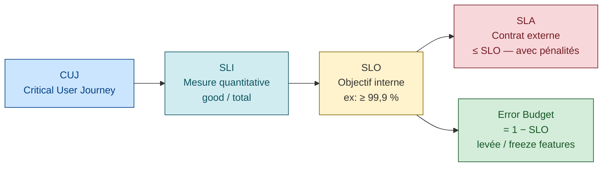
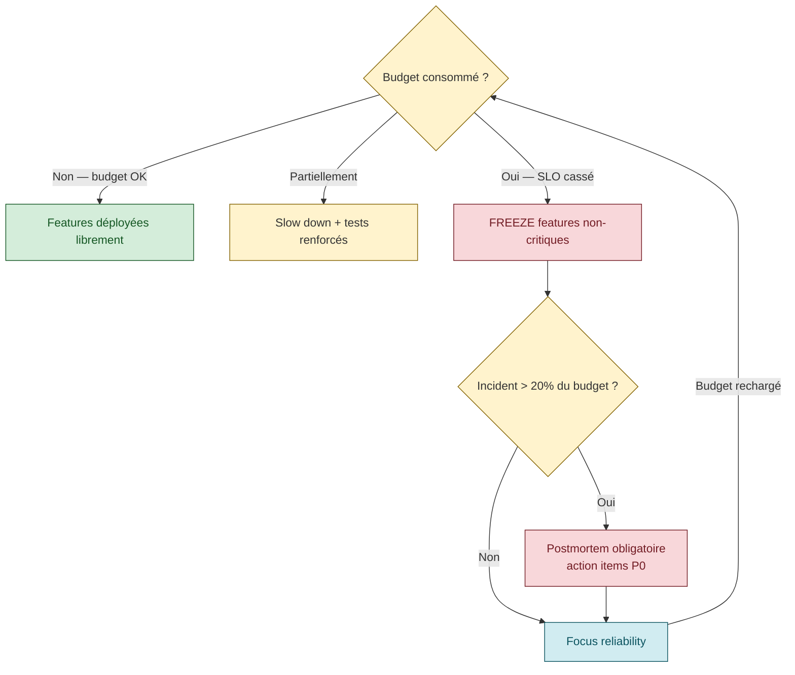

# SRE — Introduction : Philosophie et fondements

> Synthèse du chapitre **Introduction** du Google SRE Book.
> Source : [Google SRE book — Introduction](https://sre.google/sre-book/introduction/ "Google SRE book — Introduction (Benjamin Treynor Sloss)")
> Auteurs originaux : Benjamin Treynor Sloss (fondateur SRE chez Google), et al.

---

## 1. Qu'est-ce que le SRE ?

**SRE (Site Reliability Engineering)** est la discipline née chez Google en 2003 lorsque Benjamin Treynor
Sloss a confié à une équipe d'ingénieurs logiciel la responsabilité de ce qui était auparavant
appelé "operations". L'idée centrale :

> *"SRE is what happens when you ask a software engineer to design an operations team."* [📖¹](https://sre.google/sre-book/introduction/ "Google SRE book — Introduction (Benjamin Treynor Sloss)")
>
> *En français* : le SRE, c'est ce qui se passe quand on demande à un **ingénieur logiciel** de concevoir une équipe d'ops.

Le SRE n'est **pas** un simple renommage du rôle "ops". C'est un changement de paradigme :
les ingénieurs SRE **codent** des solutions pour les problèmes opérationnels plutôt que d'exécuter
manuellement des procédures répétitives.

### Différence SRE vs DevOps

> ⚠️ **Tableau comparatif SRE vs DevOps** — synthèse pédagogique cohérente avec la [vision Google "class SRE implements DevOps"](https://www.oreilly.com/content/how-class-sre-implements-interface-devops/ "Dave Rensin (Google) — class SRE implements DevOps") (Dave Rensin). Pas un tableau officiel unique.

| Dimension | DevOps | SRE |
|-----------|--------|-----|
| Nature | Mouvement culturel / ensemble de pratiques | Mise en œuvre concrète (prescriptive) |
| Focus | Collaboration dev/ops, CI/CD | Fiabilité mesurable, SLO, error budget |
| Automatisation | Recommandée | Obligatoire (règle des 50% toil max) |
| Rôle | Transverse, rôle partagé | Équipe dédiée avec critères d'entrée |

SRE implémente les principes DevOps mais de façon plus structurée et quantifiée.

---

## 2. La fiabilité comme feature

### Définition de la fiabilité

La fiabilité d'un système est définie comme sa **capacité à exécuter sa fonction requise dans
des conditions données, pendant un temps donné**. En pratique chez Google :

> La fiabilité est la feature la plus importante d'un produit. Un système inaccessible
> a une utilité nulle, quelles que soient ses autres qualités.

### Le paradoxe dev/ops

Sans SRE, les équipes de développement et d'exploitation ont des **incitations antagonistes** :
- **Dev** : pousser des nouvelles features vite → veut du changement
- **Ops** : maintenir la stabilité → veut éviter le changement

SRE résout ce paradoxe avec l'**error budget**.

---

## 3. Les trois concepts fondamentaux : SLI, SLO, SLA



### SLI — Service Level Indicator

Un **SLI** est une mesure quantitative d'un aspect de la qualité du service rendu.

Exemples types :
- Proportion de requêtes servies en < 100 ms (latence)
- Proportion de requêtes aboutissant avec HTTP 2xx (disponibilité)
- Débit de traitement d'événements (throughput)
- Taux d'erreur sur une fenêtre glissante

> Un SLI doit être **mesurable**, **continu**, et **représentatif de l'expérience utilisateur**.

### SLO — Service Level Objective

Un **SLO** est la valeur cible (ou plage) d'un SLI sur une période donnée.

Exemple :
```
SLI : proportion de requêtes HTTP 200 sur 28 jours
SLO : ≥ 99,9 % de disponibilité mesurée sur 28 jours glissants
```

**Propriétés clés d'un bon SLO :**
- Aligné sur l'expérience utilisateur (pas sur les métriques internes ésotériques)
- Suffisamment ambitieux pour être signifiant, suffisamment réaliste pour être tenable
- Peu nombreux (focus sur 1-3 SLO critiques par service, pas 20)
- Établi avec les parties prenantes product/business

> ⚠️ Viser 100% est une erreur : c'est impossible et ça consume tout l'error budget pour rien.
> 99,9% est souvent plus que suffisant selon le contexte utilisateur.

### SLA — Service Level Agreement

Un **SLA** est un **contrat externe** (souvent avec engagements financiers/pénalités) basé sur des SLO.

```
SLO (interne) ≥ SLA (externe)
```

Le SLO interne doit être plus strict que le SLA pour avoir une marge avant la pénalité.
Exemple : SLO interne = 99,9% / SLA externe = 99,5%.

---

## 4. L'Error Budget

### Concept

L'error budget est le **complément à 100% du SLO**. Il représente la quantité d'indisponibilité
ou d'erreurs tolérée avant de violer le SLO.

```
Error budget = 100% - SLO
Exemple : SLO = 99,9%  →  Error budget = 0,1%  →  ~43 min/mois de downtime autorisé
```

### Comment l'utiliser

L'error budget est un **outil de négociation** entre les équipes de développement et de fiabilité :

- **Si budget disponible** : les équipes dev peuvent déployer librement, expérimenter, prendre des risques
- **Si budget épuisé** : le déploiement de nouvelles features est gelé — priorité aux corrections de fiabilité

### Bénéfices

1. **Fin du conflit dev/ops** : les deux équipes ont intérêt à gérer le budget ensemble
2. **Décisions objectives** : on ne discute plus d'opinion mais de chiffres mesurés
3. **Incitation à l'automatisation** : les incidents "grillent" l'error budget → on automatise pour éviter les incidents
4. **Flexibilité** : si le service est très fiable, on peut s'autoriser plus de risques



---

## 5. Réduire le Toil

### Définition du toil

Le **toil** est le travail opérationnel lié à l'exécution d'un service de production qui a
les propriétés suivantes (cf. [Google SRE book ch. 5 — *Toil Defined*](https://sre.google/sre-book/eliminating-toil/#id-toil-defined "Google SRE book ch. 5 — Toil, section Toil Defined")) :

| Propriété | Description |
|-----------|-------------|
| **Manuel** | Nécessite une intervention humaine |
| **Répétitif** | Revient régulièrement, aucune valeur d'apprentissage |
| **Automatisable** | Pourrait être fait par une machine |
| **Tactique** | Réactif, déclenché par une interruption |
| **Sans valeur durable** | Ne laisse rien de mieux après passage |
| **Croît avec le trafic** | Volume de toil ∝ charge du service |

### Règle des 50%

Google impose que les SRE consacrent **au plus 50% de leur temps** à du toil ([SRE book ch. 5 — *Why Less Toil Is Better*](https://sre.google/sre-book/eliminating-toil/#why-less-toil-is-better "Google SRE book ch. 5 — Toil, section Why Less Toil Is Better")).
L'autre 50% minimum doit aller à du travail d'ingénierie (automatisation, amélioration, réduction du toil futur).

> Si un SRE passe plus de 50% en toil, c'est un signal que l'équipe est sous-dimensionnée
> ou que le service n'est pas assez mature pour l'échelle actuelle.

### Exemples de toil dans un projet comme <composant>

- Redémarrer manuellement un consommateur RabbitMQ tombé
- Corriger manuellement des données en base Oracle suite à un bug
- Rejouer manuellement des messages DLQ (Dead Letter Queue)
- Surveiller des tableaux de bord à la main sans alertes configurées
- Effectuer des déploiements avec des scripts à demi-automatisés

---

## 6. Les sept principes SRE

Le Google SRE Book identifie sept principes structurants :

### 6.1 Embracing Risk (Accepter le risque)

La fiabilité a un coût. Augmenter la disponibilité de 99% à 99,99% n'est pas linéaire —
cela exige des investissements exponentiellement plus élevés. Le SRE cherche le point
optimal entre fiabilité et vitesse d'innovation.

**Règle pratique** : choisir le SLO le plus bas acceptable par l'utilisateur, pas le plus haut possible. Détail : [SRE book ch. 3 — *Embracing Risk*](https://sre.google/sre-book/embracing-risk/ "Google SRE book ch. 3 — Embracing Risk").

### 6.2 Service Level Objectives

SLI + SLO + error budget : la triade fondamentale (détaillée ci-dessus). Chapitre source : [SRE book ch. 4 — *Service Level Objectives*](https://sre.google/sre-book/service-level-objectives/ "Google SRE book ch. 4 — Service Level Objectives").

### 6.3 Eliminating Toil

Automatisation systématique de tout ce qui est répétitif et manuel (détaillé ci-dessus). Chapitre source : [SRE book ch. 5 — *Eliminating Toil*](https://sre.google/sre-book/eliminating-toil/ "Google SRE book ch. 5 — Eliminating Toil").

### 6.4 Monitoring Distributed Systems

Observabilité comme discipline première — détaillé dans [`monitoring-alerting.md`](monitoring-alerting.md), [`observability-vs-monitoring.md`](observability-vs-monitoring.md) et [`golden-signals.md`](golden-signals.md). Chapitre source : [SRE book ch. 6 — *Monitoring Distributed Systems*](https://sre.google/sre-book/monitoring-distributed-systems/ "Google SRE book ch. 6 — Monitoring Distributed Systems").

### 6.5 Automation (Release Engineering)

L'automatisation libère les SRE du toil et améliore la fiabilité des déploiements (cf. [SRE book ch. 8 — *Release Engineering*](https://sre.google/sre-book/release-engineering/ "Google SRE book ch. 8 — Release Engineering")) :
- Builds reproductibles (infra as code, images Docker versionnées) — voir [Bazel — hermeticity](https://bazel.build/basics/hermeticity)
- Pipelines CI/CD idempotents — voir [Martin Fowler — *Continuous Integration*](https://martinfowler.com/articles/continuousIntegration.html "Martin Fowler — Continuous Integration")
- Rollback automatisé en cas de smoke test échoué — voir [AWS — *Automating safe, hands-off deployments* (Clare Liguori)](https://aws.amazon.com/builders-library/automating-safe-hands-off-deployments/ "AWS Builders Library — Automating safe, hands-off deployments (Clare Liguori)")
- Configuration externalisée (spring-cloud-config, vault)

### 6.6 Simplicity

> *"The price of reliability is the pursuit of the utmost simplicity."* [📖²](https://www.cs.fsu.edu/~engelen/courses/HPC-adv/p75-hoare.pdf "C.A.R. Hoare — Turing Award Lecture 1980")
>
> *En français* : le **prix de la fiabilité**, c'est la **quête de la plus grande simplicité** possible.

Chaque ligne de code est une source potentielle de panne. Le SRE valorise (cf. [SRE book ch. 7 — *Simplicity*](https://sre.google/sre-book/simplicity/ "Google SRE book ch. 7 — Simplicity")) :
- La réduction de la surface d'exposition (moins de dépendances)
- La suppression des features inutilisées ("bloat software")
- La lisibilité et la testabilité du code de production

### 6.7 On-Call et gestion des incidents

Un SRE ne passe **pas** sa vie en astreinte (cf. [SRE book ch. 11 — *Being On-Call*](https://sre.google/sre-book/being-on-call/ "Google SRE book ch. 11 — Being On-Call")). Google vise [📖⁴](https://sre.google/workbook/on-call/ "Google SRE workbook — On-Call") :
- Maximum 2 incidents significatifs par astreinte (12h)
- Postmortem blameless systématique après incident P1/P2
- Les mêmes incidents ne doivent pas se répéter (correction structurelle)

---

## 7. Organisation d'une équipe SRE

### Composition

Une équipe SRE Google typique sur un service :
- 6-8 ingénieurs (rarement moins de 5, rarement plus de 10) ⚠️ ordres de grandeur communs dans la littérature SRE (cf. SRE workbook *On-Call* 5/8 min), pas un chiffre unique du SRE book
- Mix de compétences : software, systèmes, réseau, sécurité
- Rotation on-call sur toute l'équipe (5x8 ou 24x7 selon criticité)

### Critère d'admission d'un service

Google applique un **critère d'admission** : un service n'est pas pris en charge par le SRE
s'il n'a pas atteint un certain niveau de maturité (tests automatisés, SLO définis,
runbooks documentés, capacité à faire rollback). Cf. [SRE book ch. 27 — *Reliable Product Launches at Scale*](https://sre.google/sre-book/reliable-product-launches/ "Google SRE book ch. 27 — Reliable Product Launches at Scale") (Launch Coordination Checklist) et [`operational-readiness-review.md`](operational-readiness-review.md).

> Si le service n'est pas "production-ready", le SRE refuse — et **aide** l'équipe dev
> à atteindre ce niveau. Ce n'est pas un rejet, c'est un partenariat.

### La règle du "cap ops"

Si la charge opérationnelle dépasse 50% du temps SRE, le surplus de tickets/interventions
est **renvoyé à l'équipe dev** pour correction structurelle. Ce mécanisme de feedback
forcé est l'un des leviers les plus puissants du modèle SRE.

---

## 8. Points clés à retenir

| # | Principe | Application concrète |
|---|----------|---------------------|
| 1 | La fiabilité est la feature n°1 | Définir SLO avant de coder |
| 2 | Error budget = monnaie d'échange | Geler les déploiements quand budget épuisé |
| 3 | Toil < 50% du temps | Automatiser toute opération répétitive |
| 4 | Pas de 100% SLO | Viser le bon niveau, pas le max |
| 5 | Postmortem blameless | Analyser les causes, pas les coupables |
| 6 | Simplicité | Moins de code = moins de pannes |
| 7 | Automatiser le rollback | Le déploiement doit être réversible en < 5 min |

---

## 9. Lectures complémentaires recommandées

Chapitres du Google SRE Book :

- **Chapitre 2** — [Production Environment at Google](https://sre.google/sre-book/production-environment/ "Google SRE book ch. 2 — Production Environment at Google") *(comprendre le substrat technique)*
- **Chapitre 3** — [Embracing Risk](https://sre.google/sre-book/embracing-risk/ "Google SRE book ch. 3 — Embracing Risk") *(approfondissement error budget)* — cf. [`error-budget.md`](error-budget.md)
- **Chapitre 4** — [Service Level Objectives](https://sre.google/sre-book/service-level-objectives/ "Google SRE book ch. 4 — Service Level Objectives") *(SLI/SLO en pratique)* — cf. [`sli-slo-sla.md`](sli-slo-sla.md)
- **Chapitre 5** — [Eliminating Toil](https://sre.google/sre-book/eliminating-toil/ "Google SRE book ch. 5 — Eliminating Toil") — cf. [`toil.md`](toil.md)
- **Chapitre 6** — [Monitoring Distributed Systems](https://sre.google/sre-book/monitoring-distributed-systems/ "Google SRE book ch. 6 — Monitoring Distributed Systems") — cf. [`monitoring-alerting.md`](monitoring-alerting.md) et [`golden-signals.md`](golden-signals.md)
- **Chapitre 11** — [Being On-Call](https://sre.google/sre-book/being-on-call/ "Google SRE book ch. 11 — Being On-Call") — cf. [`oncall-practices.md`](oncall-practices.md)
- **Chapitre 15** — [Postmortem Culture](https://sre.google/sre-book/postmortem-culture/ "Google SRE book ch. 15 — Postmortem Culture: Learning from Failure") — cf. [`postmortem.md`](postmortem.md)

> Référence complète : [sre.google/sre-book/table-of-contents](https://sre.google/sre-book/table-of-contents/ "Google SRE book — Table of contents")

## Ressources

Sources primaires :

1. [Google SRE book — Introduction](https://sre.google/sre-book/introduction/ "Google SRE book — Introduction (Benjamin Treynor Sloss)") — citation Ben Treynor Sloss verbatim
2. [C.A.R. Hoare — Turing Award Lecture 1980](https://www.cs.fsu.edu/~engelen/courses/HPC-adv/p75-hoare.pdf "C.A.R. Hoare — Turing Award Lecture 1980") — *"pursuit of the utmost simplicity"*
3. [Google SRE book ch. 7 — Simplicity](https://sre.google/sre-book/simplicity/ "Google SRE book ch. 7 — Simplicity") — reprise de la citation Hoare
4. [Google SRE workbook — On-Call](https://sre.google/workbook/on-call/ "Google SRE workbook — On-Call") — limite 2 incidents/shift

Ressources complémentaires :
- [Google SRE book table of contents](https://sre.google/sre-book/table-of-contents/ "Google SRE book — Table of contents")
- [Google SRE workbook](https://sre.google/workbook/table-of-contents/ "Google SRE workbook — Table of contents")
- [Dave Rensin — class SRE implements DevOps](https://www.oreilly.com/content/how-class-sre-implements-interface-devops/ "Dave Rensin (Google) — class SRE implements DevOps")

## Smoke tests en production : convention SRE

En production (et tous les environnements adjacents à la prod), on n'écrit pas, on ne joue
que des **Critical User Journeys** (CUJ — [`critical-user-journeys.md`](critical-user-journeys.md)). Tag [Behave](https://behave.readthedocs.io/en/stable/tag_expressions/ "Behave (Python BDD) — Tag expressions v2 (documentation)") standardisé : `@smoke` (cf. [Martin Fowler — *SmokeTest*](https://martinfowler.com/bliki/SmokeTest.html "Martin Fowler — SmokeTest (définition canonique)") et [`smoke-tests.md`](smoke-tests.md)).

### La règle

| Environnement | Tests joués | Lecture | Écriture |
|---|---|---|---|
| `e2e` (éphémère) | tous | ✓ | ✓ |
| `<env-int>`, `<env-validation>` | tous backend (`features/infra features/api features/kafka`) | ✓ | ✓ |
| **`<env-prod>`, `<env-preprod>`** | **`@smoke` uniquement** | ✓ | ✗ |

Les tasks Behave Concourse en production utilisent `BEHAVE_TAGS: "@smoke"` exclusivement.

### Pourquoi pas de tests destructifs en prod

- Pollue les rapports métier (un OI fictif apparaît dans les stats prod)
- Déclenche des workflows aval (mail à destinataire réel, push Kafka vers consommateur réel)
- Casse les partitions d'audit qui ne savent plus distinguer test et prod
- Pas de rollback DDL si la migration a changé un schéma

### Décision tree pour tagger un test `@smoke`

| Question | `@smoke` si... |
|---|---|
| Le scénario fait POST/PUT/PATCH/DELETE sur ressource métier ? | non |
| Le scénario crée un fichier S3, écrit Oracle, publie Kafka ? | non |
| Le scénario casserait silencieusement si l'app était plantée ? | oui |
| Le scénario tourne en moins de 5 secondes ? | oui |
| Le scénario teste un parcours qu'un user fait au moins une fois par jour ? | oui |
| Le scénario teste un edge case ? | non |

### Comment marquer

Dans les fichiers `.feature` Behave :
```gherkin
@smoke
Scenario: L'API GET /orders retourne une commande existante
  When j'appelle GET /api/orders/12345
  Then la reponse a le statut 200
```

### Couverture cible

Au moins **un smoke par feature**, idéalement deux : un parcours nominal + un endpoint API
critique. Audit : `grep -B1 'Scenario:' features/**/*.feature | grep -c '@smoke'`.

### Limitations

- Si aucun scénario n'est marqué `@smoke`, Behave termine en succès (rien à jouer). Le job
  Concourse passe vert mais ne valide rien fonctionnellement. À mitiger par un check
  `if SCENARIOS_RUN==0; exit 1` dans la task `behave-e2e.yml`.
- Le tag est manuel — un dev qui oublie le tag laisse le test invisible en prod.
