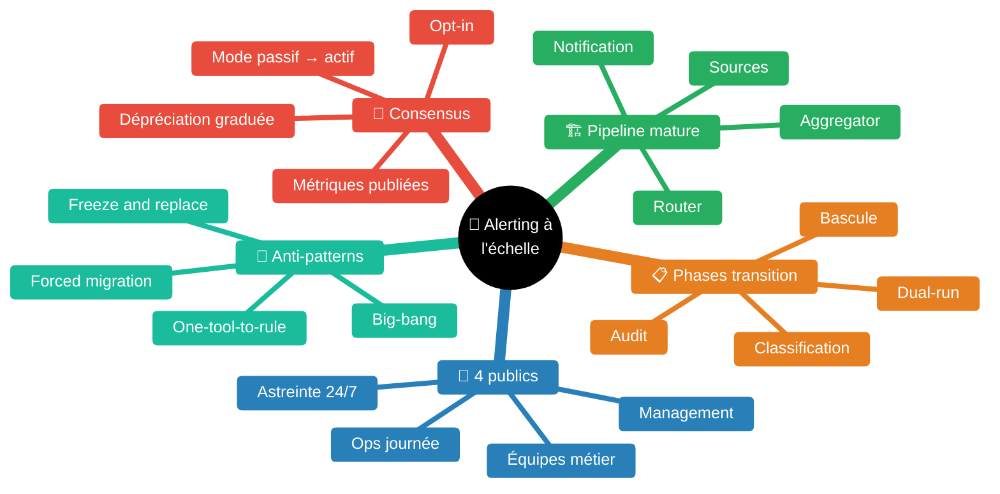
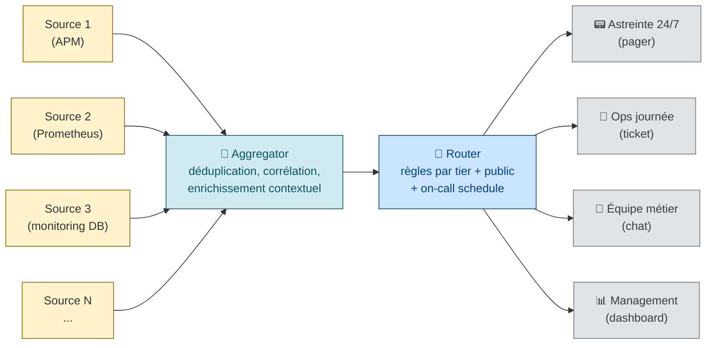
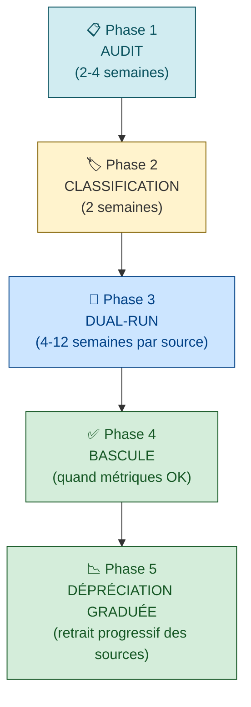

# Consolidation de l'alerting à l'échelle d'une grande organisation

> *"teams receive over 2,000 alerts weekly, with only 3% needing immediate action"* [📖¹](https://incident.io/blog/alert-fatigue-solutions-for-dev-ops-teams-in-2025-what-works "incident.io — Alert fatigue solutions for DevOps teams in 2025 (state of the practice)")
>
> *En français* : les équipes reçoivent **plus de 2 000 alertes par semaine**, dont **3 % seulement** méritent une action immédiate. Le reste, c'est du bruit qui dévaste la capacité d'attention de l'astreinte.

À l'échelle d'une grande DSI (centaines d'équipes, milliers de services), le paysage d'alerting devient typiquement un patchwork de **10 à 30 sources hétérogènes** héritées de différentes époques, équipes, et choix d'outillage. Consolider sans casser la confiance des équipes en place demande une **stratégie de transition** — pas un *big-bang*. Ce guide formalise les phases d'audit, de classification, de mode dual-run, et de bascule consensuelle.

Skill construite à partir de sources industrielles reconnues (Google SRE workbook, PagerDuty, Atlassian, incident.io 2025, runframe state of IM 2026, CNCF Alertmanager) avec citations vérifiées verbatim.

## Pourquoi le paysage d'alerting devient ingérable à l'échelle

Quatre forces structurelles convergent dans toute grande DSI :

1. **Sédimentation historique** — chaque génération de stack a apporté son outil de monitoring : APM legacy, Prometheus pour le cloud-native, scripts cron pour les batchs, alerting métier dans le SI applicatif, monitoring infra réseau, supervision DB, monitoring de jobs CI/CD. Aucun n'a été retiré quand le suivant est arrivé.
2. **Effets de niche** — chaque outil sert bien une équipe spécifique (l'équipe DBA aime son monitoring DB, l'équipe perf aime son APM, l'équipe sécurité a son SIEM). Tenter de remplacer brutalement un outil de niche déclenche une résistance forte et légitime.
3. **Routage incohérent** — la même alerte (ex. *« la base est lente »*) peut générer 3 alertes différentes vers 3 destinations différentes (oncall infra, oncall app, dashboard métier) sans corrélation.
4. **Asymétrie signal/bruit** — *cf.* citation d'ouverture : 97 % du volume est du bruit. Mais identifier les 3 % actionnables au milieu des 97 % est combinatoire.

Les conséquences mesurées en 2025 :

| Métrique | Valeur | Source |
|---|---|---|
| Alertes ignorées quotidiennement | **67 %** | [📖¹](https://incident.io/blog/alert-fatigue-solutions-for-dev-ops-teams-in-2025-what-works "incident.io — 67% alerts ignored daily") |
| Taux de faux positifs | **85 %** | [📖¹](https://incident.io/blog/alert-fatigue-solutions-for-dev-ops-teams-in-2025-what-works "incident.io — 85% false positive rate") |
| Équipes en surcharge d'alertes | **74 %** | [📖¹](https://incident.io/blog/alert-fatigue-solutions-for-dev-ops-teams-in-2025-what-works "incident.io — 74% of teams with alert overload") |
| Analystes submergés par les gaps de contexte | **83 %** | [📖¹](https://incident.io/blog/alert-fatigue-solutions-for-dev-ops-teams-in-2025-what-works "incident.io — 83% analysts overwhelmed by context gaps") |
| Coût downtime (moyenne) | **5 600 $/min** | [📖¹](https://incident.io/blog/alert-fatigue-solutions-for-dev-ops-teams-in-2025-what-works "incident.io — $5600/min unplanned downtime") |
| Volume quotidien (SecOps moyens) | **4 484 alertes/jour** | [📖²](https://www.pagerduty.com/resources/digital-operations/learn/alert-fatigue/ "PagerDuty — Alert fatigue, average daily alerts SecOps") |

Et la définition opérationnelle :

> *"Alert fatigue — sometimes called alarm fatigue — happens when a team is inundated by a constant barrage of notifications and alerts from security systems, automated workflows, or monitoring tools. When alerts constantly occur, many of which can be low priority or false positives, it can cause team members to become desensitized."* [📖²](https://www.pagerduty.com/resources/digital-operations/learn/alert-fatigue/ "PagerDuty — Alert fatigue definition")
>
> *En français* : l'**alert fatigue** survient quand une équipe est inondée de notifications constantes — beaucoup de basse priorité ou de faux positifs — et que les membres deviennent **désensibilisés** au bruit.

## Carte des concepts

## L'architecture cible — pipeline en 4 étages

Au lieu de remplacer un outil par un autre, on insère **un pipeline** entre les sources existantes et les notifications, qui découple la production d'alertes de leur consommation.

| Étage | Rôle | Outils typiques |
|---|---|---|
| **Sources** | Détectent les événements bruts (Prometheus rules, APM thresholds, log patterns, health checks, batch failures) | Prometheus, OpenTelemetry, Datadog, Dynatrace, Splunk, monitoring custom |
| **Aggregator** | **Déduplique**, **corrèle**, **enrichit** — convertit le flux brut en *incidents* structurés | [Alertmanager](https://prometheus.io/docs/alerting/latest/alertmanager/) (CNCF), [Karma](https://github.com/prymitive/karma) (UI sur Alertmanager), correlation engines commerciaux |
| **Router** | Décide **qui** est notifié, **comment**, et **quand** — règles par sévérité, tier de service, fenêtre horaire, on-call schedule | Alertmanager routing tree, PagerDuty, Opsgenie/JSM, incident.io |
| **Notification** | Délivre au bon canal — pager (téléphone), ticket (queue async), chat (informationnel), dashboard (passif) | PagerDuty pager, Slack/Teams, Jira, Grafana dashboards |

L'aggregator est le **point névralgique** : c'est lui qui absorbe la diversité des sources (sans les remplacer) et expose une interface uniforme aux étages suivants. Pour la majorité des organisations cloud-native, c'est **[Alertmanager](https://prometheus.io/docs/alerting/latest/alertmanager/)** (composant CNCF Prometheus) qui occupe ce rôle.

> ⚠️ **Recommandation pattern aggregator** — Alertmanager est l'option par défaut quand l'écosystème est Prometheus-natif. Pour des écosystèmes hétérogènes (sources non-Prometheus dominantes), des correlation engines commerciaux (PagerDuty Event Intelligence, incident.io correlation) ou des hubs OpenTelemetry peuvent jouer ce rôle. Le choix dépend du paysage existant — pas un dogme.

### Ce que l'aggregator doit faire (Google SRE workbook)

Le routage standard Google SRE distingue 3 niveaux de destination [📖³](https://sre.google/sre-book/monitoring-distributed-systems/ "Google SRE Book ch. 6 — Monitoring Distributed Systems") :

| Niveau | Destination | Critères |
|---|---|---|
| **Page** | Pager (réveille un humain 24/7) | Symptôme actif ou imminent, requiert intelligence humaine |
| **Ticket** | Queue à traiter sous quelques heures | Important mais pas urgent (ex : certificat expire dans 7 jours) |
| **Log / dashboard** | Pas d'alerte, trace disponible | Information de fond, contexte de débogage |

L'aggregator doit être capable de classer **dynamiquement** chaque alerte dans l'un de ces niveaux selon son contexte. Cf. guide [`monitoring-alerting.md`](monitoring-alerting.md) pour la philosophie d'alerting Google complète.

## Différenciation par public — la clé du consensus

Une erreur fréquente : penser le pipeline comme **mono-public** (« on alerte les SRE »). À l'échelle organisationnelle, **plusieurs publics** consomment des alertes différentes, avec des cadences et des canaux différents. Forcer un public unique = mécontentement systémique.

| Public | Cadence | Canal | Critère d'éligibilité d'une alerte |
|---|---|---|---|
| **Astreinte 24/7** | Réveille la nuit | Pager (PagerDuty/Opsgenie/incident.io) | Symptôme actif, requiert intelligence humaine, cible SLO menacée [📖³] |
| **Ops journée** | Heures ouvrées | Ticket (Jira) ou queue Slack/Teams | Important mais non urgent — certif, capacité, batch en retard |
| **Équipe métier** (PO, support, run applicatif) | Réactif aux heures ouvrées | Chat (Slack/Teams), email digest | Impact métier visible — taux d'erreur fonctionnel, échec de jobs métier |
| **Management** | Hebdo / trimestriel | Dashboard agrégé, rapport | Tendances, SLO trimestriels, budget d'erreur consommé, DORA metrics |

Implication pratique : **chaque source d'alerting existante** dans le paysage actuel sert typiquement déjà **un de ces publics**. Si on tente de les fusionner sans cartographier qui consomme quoi, on rompt des contrats implicites.

> **🟢 Confiance 8/10** — La distinction pager / ticket / dashboard vient verbatim du SRE book Google. La 4ᵉ catégorie (équipe métier) est une projection consensuelle des pratiques industrielles ; la cadence management/dashboard est une lecture cohérente avec DORA.

## Stratégie de transition en 4 phases

> **⚠️ Synthèse expérientielle** — Le séquencement en 4 phases (audit → dual-run → bascule → dépréciation), les durées indicatives et les modes (silent / shadow / actif) ci-dessous ne sont pas tirés d'une source unique verbatim. C'est une **consolidation** de patterns publiés dans plusieurs guides de migration alerting (Atlassian, incident.io, PagerDuty, Datadog), de la doctrine SRE *progressive rollout* (Google SRE workbook), et de retours d'expérience industrielle. À adapter au contexte. Confiance : 🟡 6/10.

### Phase 1 — Audit du paysage existant

Cartographier **chaque source d'alerting** active dans la DSI. Pour chacune, capturer :

- **Nom et propriétaire** (équipe responsable de la source)
- **Volume mensuel** (ordre de grandeur — `<100`, `100-1k`, `1k-10k`, `>10k` alertes/mois)
- **Public(s) destinataire(s)** parmi les 4 publics ci-dessus
- **Canal de livraison actuel** (mail, pager, Slack, ticket, dashboard)
- **Taux d'actionnabilité estimé** (sondage rapide auprès des équipes : *« sur 10 alertes reçues, combien provoquent une action ? »*)
- **Statut** : critique / utile / niche / oubliée

Une matrice d'audit minimale :

| Source | Owner | Volume/mois | Publics | Canal | % actionnable | Statut |
|---|---|---|---|---|---|---|
| Source A | Équipe X | 1 200 | astreinte | pager | 25 % | critique |
| Source B | Équipe Y | 8 000 | dashboard | mail | 2 % | niche / candidat dépréciation |
| ... | | | | | | |

Le simple fait de produire cette matrice révèle 80 % du chantier — typiquement on découvre :
- 30 % des sources livrent < 100 alertes/mois → **dépréciables sans douleur**
- 20 % des sources livrent > 5 000 alertes/mois avec < 5 % actionnables → **principales sources de fatigue**
- 50 % du volume vient de **3-5 sources** → priorité d'absorption dans le pipeline cible

> ⚠️ **Pattern de monitoring inventory** — incident.io recommande explicitement *"creating a monitoring inventory to identify overlaps and de-duplicate alerts"* [📖¹](https://incident.io/blog/alert-fatigue-solutions-for-dev-ops-teams-in-2025-what-works "incident.io — monitoring inventory to identify overlaps").

### Phase 2 — Classification par tier et par public

Pour chaque alerte (pas chaque source — chaque type d'alerte), classifier sur **2 axes** :

**Axe 1 — Tier de criticité** (basé sur le SLO impacté ou l'impact métier) :

| Tier | Définition | Public typique | Canal |
|---|---|---|---|
| T1 | Service critique, SLO en danger immédiat | Astreinte 24/7 | Pager P1 |
| T2 | Service critique, SLO menacé sous quelques heures | Astreinte 24/7 ou ops journée | Pager P2 / ticket urgent |
| T3 | Service standard, dégradation tolérable | Ops journée | Ticket |
| T4 | Information / tendance | Équipe métier ou management | Chat / dashboard |

**Axe 2 — Public principal** (parmi les 4 ci-dessus).

Cette classification produit **la matrice de routage cible** : pour chaque type d'alerte, on sait `(tier, public) → canal`. C'est cette matrice qu'on programme dans le router.

Le but de cette phase : **avoir un consensus écrit** entre les équipes sur *qui reçoit quoi à quel niveau d'urgence*. C'est la base politique sans laquelle la consolidation technique échoue.

### Phase 3 — Dual-run par source

**Ne jamais débrancher une source en remplaçant directement.** Faire tourner les deux en parallèle pendant une période calibrée (4 à 12 semaines selon la criticité) :

1. La source historique continue d'envoyer ses alertes à ses canaux historiques (rien ne change pour ses consommateurs)
2. **En parallèle**, la même source nourrit l'aggregator du pipeline cible — qui produit ses propres notifications dans des canaux **shadow** (Slack channel dédié `#alerts-dual-run-<source>`, jamais le pager)
3. Comparer **chaque jour** : *« ce qu'a vu la source historique vs ce qu'a routé le pipeline cible »* — incohérences = bugs à fixer dans la classification ou le routage

Mode passif → actif :

| Étape | Pipeline cible | Source historique |
|---|---|---|
| Semaine 1-2 | Mode log uniquement (pas de notifications) | Active normalement |
| Semaine 3-6 | Notifications shadow vers canal dédié | Active normalement |
| Semaine 7-10 | Notifications shadow + revue hebdo des écarts | Active normalement |
| Semaine 11+ | Si métriques OK (cf. Phase 4) → bascule | Active normalement |

Le dual-run **a un coût** (double notification, charge double sur l'aggregator), mais c'est le **prix de la confiance** : aucune équipe n'accepte de débrancher sa source historique sans avoir vu le remplacement tourner avec succès pendant des semaines.

### Phase 4 — Bascule consensuelle

La bascule (= retrait de la notification historique, le pipeline devient seul actif pour cette source) se fait **uniquement** quand :

1. **Métriques de cohérence** atteintes pendant N semaines consécutives :
   - Taux de cohérence entre les 2 systèmes > 99 % (ce que voit l'historique = ce que voit le cible)
   - Aucun faux négatif majeur identifié pendant le dual-run
   - Latence de notification cible <= latence historique
2. **Validation explicite** des consommateurs principaux (les 4 publics qui reçoivent les alertes de cette source)
3. **Plan de rollback** documenté : comment réactiver la source historique en < 1 h si le pipeline défaille

La bascule est **annoncée 1 à 2 semaines à l'avance**, avec :
- Liste des changements visibles côté consommateurs (canaux, format, fréquence)
- Procédure de signalement de tout écart constaté
- Période d'observation accrue (cf. Phase 5)

### Phase 5 — Dépréciation graduée des sources historiques

Une fois la bascule effectuée, on **n'éteint pas immédiatement** la source historique :

| Étape | Source historique | Pipeline cible |
|---|---|---|
| Bascule | Active mais notifications coupées (mode silent) | Seul système actif |
| Bascule + 1 mois | Toujours en mode silent, mais log encore disponible pour comparaison | Seul système actif |
| Bascule + 3 mois | Désactivation complète de la source si aucun écart | Seul système actif |
| Bascule + 6 mois | Décommissionnement de l'infra de la source | Seul système actif |

Ce délai de 6 mois est généreux mais sain : il garantit qu'aucune alerte critique de niche n'a été perdue dans la transition.

## Patterns techniques de l'aggregator

### Déduplication

Une même condition d'erreur peut être détectée par plusieurs sources simultanément (Prometheus rule + APM threshold + log pattern). L'aggregator les regroupe en **un seul incident** avec un *fingerprint* commun.

Pattern Alertmanager : `group_by` sur les labels métier (`service`, `severity`, `instance`) — toutes les alertes partageant ces labels sont groupées.

### Corrélation

Plusieurs alertes sémantiquement liées (ex : *« base lente »* + *« API timeout »* + *« checkout en erreur »*) sont la signature d'**un seul incident** — mais sources différentes les détectent indépendamment. Un correlation engine déduit l'incident parent et envoie **une notification** au lieu de N.

> *"Alert correlation engines group related notifications, reducing volume and providing richer context. Instead of multiple alerts, teams receive a single notification indicating 'web service degradation' with all related symptoms."* [📖¹](https://incident.io/blog/alert-fatigue-solutions-for-dev-ops-teams-in-2025-what-works "incident.io — Alert correlation engines")
>
> *En français* : les moteurs de corrélation regroupent les notifications liées et fournissent un contexte enrichi. Au lieu de plusieurs alertes, les équipes reçoivent **une seule notification** *« dégradation du service web »* avec tous les symptômes corrélés.

### Suppression / inhibition

Une alerte de bas niveau (*« CPU élevé »*) est automatiquement **inhibée** quand une alerte de haut niveau couvrant le même domaine (*« service down »*) est active. Pattern Alertmanager : `inhibit_rules`.

### Enrichissement contextuel

Avant d'envoyer une notification, l'aggregator y attache du contexte automatique : runbook lié à l'alerte, dashboard pertinent, dernier déploiement du service, on-call de l'équipe propriétaire. Réduit le délai de diagnostic.

### Capping / rate limiting

> *"PagerDuty can bundle multiple related alerts into a single notification during alert storms, and Event Intelligence reduces alert fatigue by filtering out up to 98% of system noise."* [📖²](https://www.pagerduty.com/resources/digital-operations/learn/alert-fatigue/ "PagerDuty — Event Intelligence: 98% noise reduction")
>
> *En français* : pendant une *alert storm*, l'aggregator regroupe les alertes liées en une seule notification — **jusqu'à 98 % de réduction de bruit**.

## Construire le consensus — au-delà du technique

> **⚠️ Synthèse expérientielle** — Cette section consolide des patterns organisationnels (opt-in, métriques publiques de transition, garantie de non-régression, investissement formation) issus de retours d'expérience publics de transformation outillée et des principes *Adopt → Optimize* du Promotion of Reliability Engineering Practices (Google SRE workbook). Pas un protocole académique sourcé verbatim. Confiance : 🟡 6/10.

Le succès d'une consolidation outillée est en grande partie **politique** — le travail de conviction et de gouvernance pèse autant ou plus que le travail technique. Patterns qui fonctionnent :

### Opt-in plutôt qu'opt-out

Les équipes adoptent le pipeline cible **volontairement** lorsqu'elles voient son intérêt — pas parce qu'on les y force. Concrètement :
- **Démarrer avec 2-3 équipes pilotes** qui veulent l'expérience (typiquement les plus matures, les plus en souffrance avec leur outillage actuel)
- Capitaliser leurs **retours visibles** (réduction d'alert volume, MTTR, satisfaction astreinte)
- Les autres équipes demandent à rejoindre

### Métriques publiques de transition

Publier mensuellement un dashboard de la transition, accessible à toute la DSI :
- **Volume d'alertes** par équipe avant / après
- **Taux d'actionnabilité** (qui monte avec la consolidation)
- **MTTR moyen** (qui descend grâce à l'enrichissement contextuel)
- **Taux de bascule** : N sources sur M ont basculé

Ces métriques publiques **créent une pression positive** : les équipes encore sur l'ancien système voient les bénéfices et veulent rejoindre.

### Garantie de **ne pas casser**

Communication explicite à chaque équipe avant son onboarding :
- *« Pendant le dual-run, votre source historique reste 100 % fonctionnelle »*
- *« On ne débranche rien sans votre validation explicite »*
- *« Si le pipeline cible défaille, on revient à l'historique en < 1 h »*

Cette garantie supprime la résistance majeure (*« je ne veux pas perdre mon outil qui fonctionne »*).

### Investissement formation

Chaque équipe qui adopte le pipeline cible bénéficie d'**une demi-journée de formation** : routage Alertmanager, création de règles, gestion des silences, escalade. C'est un investissement qui paie : sans formation, l'adoption est superficielle et l'équipe revient sur ses outils précédents.

## Anti-patterns à proscrire

| Anti-pattern | Symptôme | Conséquence | Pattern correct |
|---|---|---|---|
| **Big-bang** | « Le 1er du mois, on bascule tout le monde » | Rejet massif, retours arrière, perte de confiance dans toute l'initiative | Phasage par source + dual-run + opt-in |
| **One-tool-to-rule-them-all** | « Tous les services doivent migrer sur l'outil X dans 6 mois » | Niches malheureuses, contournements, double système permanent | Pipeline qui **absorbe** les sources existantes plutôt que de les remplacer |
| **Freeze and replace** | Désactivation immédiate de l'ancien outil après bascule | Découverte tardive de cas non couverts, alertes critiques perdues | Mode silent puis dépréciation 3-6 mois |
| **Forced migration** | « Vous n'avez plus le choix, vous migrez » | Adversité politique, sabotage passif, équipes qui maintiennent un *shadow alerting* | Opt-in avec démonstration des bénéfices |
| **Ignorer les niches** | « Cette source a 100 alertes/mois, on l'éteint » | Perte d'un signal métier irremplaçable que personne dans le projet ne connaissait | Audit avec questions au propriétaire de la source |
| **Pas de mesure cohérence dual-run** | Bascule sur la foi du « ça a l'air de marcher » | Faux négatifs découverts en prod | Métriques de cohérence > 99 % avant bascule |
| **Public unique** | « On unifie sur un seul canal Slack » | Le public dashboard est noyé par le public pager (et vice versa) | Différenciation par tier × public |
| **Pas de runbook par alerte** | Page reçue, on-call ne sait pas quoi faire | Investigation longue, MTTR explose | Chaque type d'alerte a un runbook lié dans l'enrichissement [📖³](https://sre.google/sre-book/monitoring-distributed-systems/ "SRE Book ch. 6 — Tying these principles together") |
| **Bascule pendant un freeze** | « On attend la fin du freeze pour basculer » | Si le freeze dure, la transition s'éternise et perd son momentum | Dual-run **pendant** le freeze, bascule juste après |

> **🟢 Confiance 8/10** — Anti-patterns dont 5 sont sourcés directement (Google SRE, incident.io, PagerDuty), 4 sont des consensus communautaires de transformation alerting documentés dans les retours d'expérience publics.

## Métriques de succès de la consolidation

Quatre indicateurs pour piloter la transition :

| Métrique | Cible | Comment mesurer |
|---|---|---|
| **Taux de pages par astreinte par jour** | < 5 (idéal < 2) | Compter les notifications reçues par l'astreinte / nombre d'astreintes / jours |
| **Taux d'actionnabilité** | > 80 % | Sondage périodique : *« la dernière alerte que tu as reçue, as-tu fait une action ? »* |
| **MTTR moyen** | Tendance baissière | Latence entre détection et résolution dans les postmortems |
| **Couverture du pipeline** | % du volume total absorbé par le pipeline | (volume aggregator) / (volume total des sources) |
| **Satisfaction astreinte** | NPS > +20 | Enquête trimestrielle équipes d'astreinte |

Ces métriques **doivent être publiées** mensuellement (cf. *Métriques publiques de transition* ci-dessus).

## Cheatsheet — démarrer une consolidation alerting

- [ ] **Audit complet** des sources d'alerting actuelles (matrice : source / owner / volume / public / canal / actionnabilité / statut)
- [ ] Identifier **2-3 équipes pilotes** matures et volontaires
- [ ] **Classification** par tier (T1-T4) × public (4 publics) — produire la matrice de routage cible
- [ ] Choisir l'**aggregator** selon l'écosystème (Alertmanager pour le cloud-native par défaut)
- [ ] Implémenter **déduplication, corrélation, inhibition, enrichissement** dans l'aggregator
- [ ] **Dual-run** pendant 4-12 semaines par source, avec mode silent → shadow → notifications
- [ ] **Métriques de cohérence** > 99 % atteintes pendant N semaines avant chaque bascule
- [ ] **Validation explicite** des consommateurs avant chaque bascule
- [ ] **Plan de rollback** documenté pour chaque source basculée
- [ ] **Mode silent + dépréciation graduée** sur 3-6 mois après bascule
- [ ] **Métriques publiques** mensuelles : volume, actionnabilité, MTTR, couverture, NPS astreinte
- [ ] **Formation** : 1/2 journée par équipe qui adopte le pipeline
- [ ] **Aucune migration forcée** — opt-in, démonstration de bénéfices, équipes pilotes en référence
- [ ] **Runbook lié** à chaque type d'alerte (enrichissement automatique)
- [ ] **Différenciation des publics** : pager vs ticket vs chat vs dashboard, jamais mélangés

## Glossaire

| Terme | Définition |
|---|---|
| **Aggregator** | Étage du pipeline qui déduplique, corrèle, inhibe, enrichit les alertes brutes en incidents structurés |
| **Alert fatigue** | État de désensibilisation d'une équipe inondée d'alertes, dont beaucoup non actionnables [📖²] |
| **Correlation engine** | Composant qui regroupe automatiquement plusieurs alertes liées en un seul incident parent |
| **Dual-run** | Période pendant laquelle la source historique et le pipeline cible tournent en parallèle, sans perte de signal |
| **Enrichissement** | Ajout automatique de contexte (runbook, dashboard, on-call) à une alerte avant notification |
| **Inhibition** | Suppression automatique d'une alerte de bas niveau quand une alerte de haut niveau couvrant le même domaine est active |
| **Pipeline d'alerting** | Architecture en 4 étages : sources → aggregator → router → notification |
| **Mode silent** | Phase où la source historique reste active mais ne notifie plus — sécurité avant dépréciation |
| **Mode shadow** | Phase de dual-run où le pipeline cible notifie dans un canal dédié non-pager pour comparaison |
| **Tier** | Niveau de criticité d'une alerte (T1 critique → T4 information) |

## Bibliothèque exhaustive des sources

### Alert fatigue et consolidation
- [📖] *PagerDuty — Alert fatigue (Digital Operations Learn)* — https://www.pagerduty.com/resources/digital-operations/learn/alert-fatigue/ — Définition canonique, 4 484 alertes/jour SecOps, Event Intelligence 98 % noise reduction
- [📖] *Atlassian — Understanding and fighting alert fatigue* — https://www.atlassian.com/incident-management/on-call/alert-fatigue — Catégorisation des types d'alerte, techniques de réduction
- [📖] *incident.io — Alert fatigue solutions for DevOps teams in 2025: What works* — https://incident.io/blog/alert-fatigue-solutions-for-dev-ops-teams-in-2025-what-works — Chiffres 2025 (67 % ignorées, 85 % faux positifs, 74 % surcharge), correlation engines, monitoring inventory
- [📖] *Runframe — State of Incident Management 2026* — https://runframe.io/blog/state-of-incident-management-2025 — Toil +30 % malgré l'IA, contexte consolidation 2025-2026

### Philosophie d'alerting (Google SRE)
- [📖] *Google SRE Book ch. 6 — Monitoring Distributed Systems* — https://sre.google/sre-book/monitoring-distributed-systems/ — Page / ticket / dashboard, page on symptoms, every page actionable
- [📖] *Google SRE Book ch. 10 — Practical Alerting from Time-Series Data* — https://sre.google/sre-book/practical-alerting/ — Borgmon → Prometheus, blackbox monitoring
- [📖] *Google SRE Workbook — Alerting on SLOs* — https://sre.google/workbook/alerting-on-slos/ — Burn rate alerting multi-window

### Patterns CNCF / outillage
- [📖] *Prometheus Alertmanager — Configuration* — https://prometheus.io/docs/alerting/latest/alertmanager/ — Aggregator de référence cloud-native (déduplication, group_by, inhibit_rules, routing tree)
- [📖] *OpenTelemetry — Specification* — https://opentelemetry.io/docs/specs/otel/ — Standard d'instrumentation et de propagation de signaux

### Cadres adjacents
- [📖] *Microsoft Azure WAF — Operational Excellence, Health monitoring* — https://learn.microsoft.com/en-us/azure/well-architected/operational-excellence/observability — Pratiques de monitoring d'entreprise
- [📖] *AWS Well-Architected — Reliability Pillar* — https://docs.aws.amazon.com/wellarchitected/latest/reliability-pillar/welcome.html — Patterns alerting AWS

## Conventions de sourcing

- `[📖n](url "tooltip")` — Citation **vérifiée verbatim** via WebFetch / lecture directe des sources
- ⚠️ — Reformulation pédagogique ou pattern consensuel non cité verbatim

Notes de confiance par solution : 🟢 9-10 (verbatim) / 🟢 7-8 (reformulation fidèle) / 🟡 5-6 (choix défendable) / 🟠 3-4 (choix d'équipe) / 🔴 1-2 (à challenger).

## Liens internes KB

- [`monitoring-alerting.md`](monitoring-alerting.md) — Philosophie d'alerting Google (page on symptoms, blackbox vs whitebox)
- [`oncall-practices.md`](oncall-practices.md) — Pratiques d'astreinte, follow-the-sun, rotation
- [`incident-management.md`](incident-management.md) — Conduite d'incident en aval de la notification
- [`sli-slo-sla.md`](sli-slo-sla.md) — Bases SLI / SLO / SLA
- [`error-budget.md`](error-budget.md) — Burn rate alerting
- [`journey-slos-cross-service.md`](journey-slos-cross-service.md) — SLO de chaîne (qui informe le routage par tier)
- [`sre-at-scale.md`](sre-at-scale.md) — Modèles d'organisation SRE à l'échelle (où s'inscrit la transformation alerting)
- [`postmortem.md`](postmortem.md) — Postmortem qui mesure le MTTR de bout en bout
- [`toil.md`](toil.md) — Mesure du toil généré par les alertes non-actionnables
