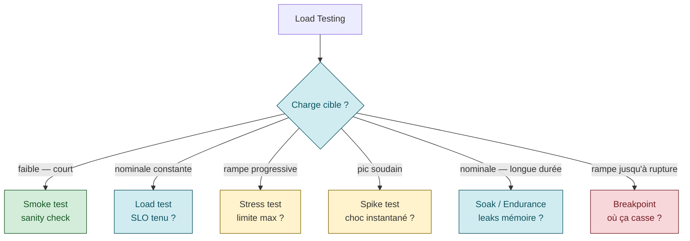
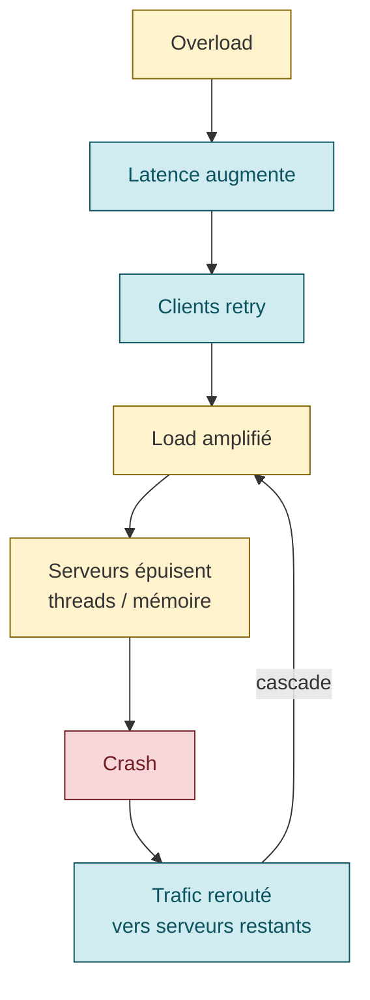
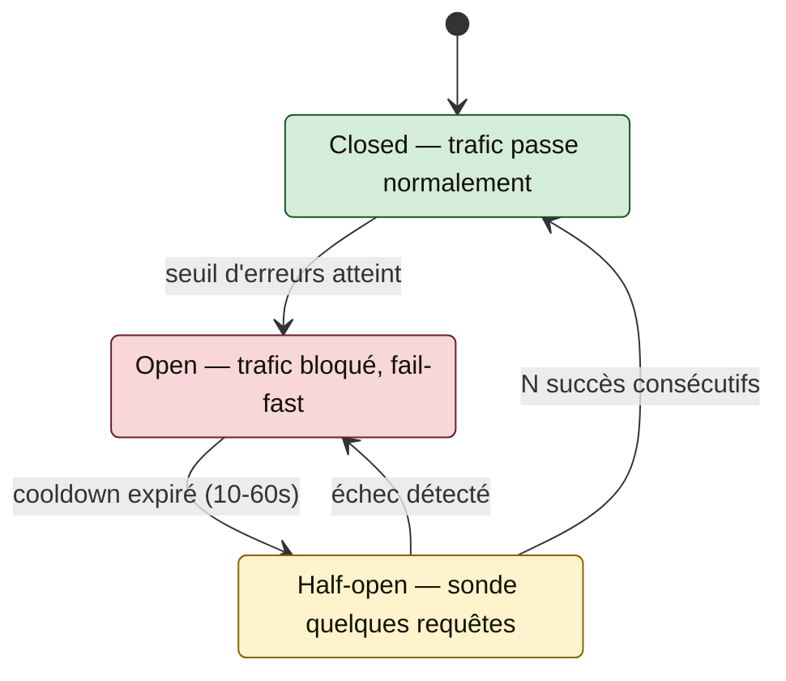

# Capacity Planning + Load Testing

> **Sources** :
> - Google SRE book ch. 21, [*Handling Overload*](https://sre.google/sre-book/handling-overload/ "Google SRE book ch. 21 — Handling Overload")
> - Google SRE book ch. 22, [*Addressing Cascading Failures*](https://sre.google/sre-book/addressing-cascading-failures/ "Google SRE book ch. 22 — Addressing Cascading Failures")
> - Google SRE workbook, [*Managing Load*](https://sre.google/workbook/managing-load/ "Google SRE workbook — Managing Load")
> - AWS Builders' Library, [*Using load shedding to avoid overload*](https://aws.amazon.com/builders-library/using-load-shedding-to-avoid-overload/ "AWS Builders Library — Using load shedding to avoid overload (David Yanacek)")
> - AWS Builders' Library, [*Timeouts, retries, and backoff with jitter*](https://aws.amazon.com/builders-library/timeouts-retries-and-backoff-with-jitter/ "AWS Builders Library — Timeouts, retries and backoff with jitter (Marc Brooker)")
> - Microsoft Azure WAF, [*Capacity Planning*](https://learn.microsoft.com/en-us/azure/well-architected/performance-efficiency/capacity-planning "Microsoft Azure WAF — Performance Efficiency, Capacity Planning")

## Capacity Planning

### Définition (Microsoft Azure WAF)

> *"Capacity planning refers to the process of determining the resources required to meet workload performance targets."* [📖¹](https://learn.microsoft.com/en-us/azure/well-architected/performance-efficiency/capacity-planning "Microsoft Azure WAF — Performance Efficiency, Capacity Planning")
>
> *En français* : le **capacity planning**, c'est le processus qui détermine les **ressources nécessaires** pour tenir les cibles de performance d'un workload.

L'exercice porte sur :
- CPU, mémoire, stockage, bande passante
- Personnel et processus (souvent oublié)
- Quotas et limites cloud

À conduire **avant** tout changement anticipé du profil d'usage.

### Quand re-planifier (Azure)

| Trigger | Exemple |
|---------|---------|
| Design initial | Nouveau service |
| Pics réguliers | "8h sign-in rush" matinal |
| Launch | Mise en prod |
| Changement business model | Pricing, modèle freemium |
| Fusion-acquisition | Doublement des utilisateurs |
| Campagne marketing | Pic temporaire ×10 |
| Saisonnalité | Black Friday, fin d'année |
| Lancement de feature | "+5% de demande répétitive" |
| Cycle périodique | Trimestriel, annuel |

### Organic growth vs inorganic growth

| Type | Modélisation | Exemple |
|------|-------------|---------|
| **Organic** | Régression, séries temporelles, moyennes mobiles | Croissance naturelle ×1.05/an |
| **Inorganic** | Non-modélisable par historique seul | Black Friday, campagne TV, pic d'incident |

L'organic se prévoit. L'inorganic se gère par **headroom**.

### Headroom et target utilization

> *"We recommend configuring your autoscaler to keep your service far from key system bottlenecks (such as CPU)."* [📖²](https://sre.google/workbook/managing-load/ "Google SRE workbook — Managing Load")
>
> *En français* : configurez votre autoscaler pour **maintenir votre service loin** des goulots système clés (comme le CPU).

Et :

> *"reserve enough spare capacity for both overload protection and redundancy"* [📖²](https://sre.google/workbook/managing-load/ "Google SRE workbook — Managing Load")
>
> *En français* : **réservez** assez de marge pour **deux rôles** : absorber la surcharge et couvrir la redondance (perte d'une zone).

**Logique** : la marge sert deux fonctions distinctes :
1. **Overload absorption** : absorber les pics
2. **Redundancy** : couvrir la perte d'une zone ou d'un cluster

Calcul : un service qui tolère la perte de 1 DC sur N doit dimensionner chaque DC à au plus `(N-1)/N` de sa capacité max.

| N (datacenters/zones) | Target utilization max |
|-----------------------|------------------------|
| 2 | 50% |
| 3 | 66% |
| 5 | 80% |
| 10 | 90% |

→ Plus vous avez de redondance, plus vous pouvez tolérer une utilisation élevée par DC.

## Load testing — taxonomie

| Type | Objectif | Profil de charge | Question |
|------|----------|------------------|----------|
| **Smoke test** | Sanity check | Charge faible, courte | "Le système démarre, l'instru fonctionne ?" |
| **Load test (average)** | Valider la charge nominale | Constante au trafic prod | "Le SLO est tenu ?" |
| **Stress test** | Trouver la capacité max | Rampe graduelle jusqu'à dégradation | "À quelle charge ça commence à faiblir ?" |
| **Spike test** | Simuler un pic soudain | Montée brutale puis redescente | "Le système absorbe-t-il un choc instantané ?" |
| **Soak / Endurance** | Révéler les leaks | Charge nominale prolongée (h-jours) | "Memory leaks, FD leaks, dégradation graduelle ?" |
| **Breakpoint** | Point de rupture | Rampe jusqu'à casse complète | "Où exactement ça casse, comment ?" |



### Lien load test ↔ SLO

Un load test n'est utile qu'à 3 conditions :

1. L'objectif est **chiffré** par rapport au SLO (ex: *"latence p99 < 300 ms à 10 000 RPS pendant 1 h"*)
2. Les metrics captées sont celles du **SLI**, pas seulement CPU/RAM
3. La cible reste tenue **pendant ET après** le pic (queue drain, TCP retransmits, GC pressure résiduelle)

### Synthetic load vs replay traffic

| Approche | Avantages | Inconvénients |
|----------|-----------|---------------|
| **Synthetic** (k6, Locust, JMeter, Gatling) | Reproductible, scriptable, CI-friendly | Rate la distribution réelle (hotkeys, séquences) |
| **Replay traffic** (goreplay, tcpcopy, AWS VPC mirroring) | Distribution réaliste, révèle les cas non scriptés | RGPD/secrets à scrubber, dérive contrat API |

**Pratique recommandée** : synthetic en CI + soak mensuel en replay sur env iso-prod.

## Cascading failures

### Définition

> *"A cascading failure is a failure that grows over time as a result of positive feedback."* [📖³](https://sre.google/sre-book/addressing-cascading-failures/ "Google SRE book ch. 22 — Addressing Cascading Failures")
>
> *En français* : une **panne en cascade** est une panne qui **grandit avec le temps** via une boucle de rétroaction positive (chaque effet amplifie sa cause).

### Mécanique typique



> Chaîne décrite dans le SRE book ch. 22 : CPU exhaustion → slowed requests → more in-flight requests → more RAM → reduced cache efficiency → more backend load. [📖³](https://sre.google/sre-book/addressing-cascading-failures/ "Google SRE book ch. 22 — Addressing Cascading Failures")
> ⚠️ **Reformulation** — le texte original détaille le scénario autour d'un frontend Java avec GC mal tuné. La chaîne causale ci-dessus est une synthèse cohérente.

### Conditions favorables

- Retries naïfs sans backoff
- Pas de circuit breaker
- Pas de load shedding
- Routing simpliste qui concentre le trafic
- Health checks fail-closed (instances retirées trop tôt)

## Load shedding (AWS Builders' Library)

> *"Load shedding lets a server maintain its goodput and complete as many requests as it can, even as offered throughput increases."* [📖⁴](https://aws.amazon.com/builders-library/using-load-shedding-to-avoid-overload/ "AWS Builders Library — Using load shedding to avoid overload (David Yanacek)")
>
> *En français* : le **load shedding** permet à un serveur de préserver son **goodput** (requêtes traitées avec succès dans les temps) et d'en servir autant que possible, même quand le throughput offert augmente.

### Throughput vs Goodput

- **Throughput** : nombre de requêtes traitées (succès + échecs + slow)
- **Goodput** : nombre de requêtes traitées **dans les temps avec succès**

**Insight** : mieux vaut accepter 6 000 RPS et en servir 6 000 correctement que tenter 10 000 RPS et n'en servir aucun dans les temps.

### Mécaniques concrètes

- **Retour 429** (rate limited) ou **503** + `Retry-After` **avant** que les timeouts clients ne se déclenchent
- **Priorisation par criticité** — catégoriser les requêtes (ex : critique / optionnelle) et **drop d'abord les moins critiques** quand la charge monte.
- **Mesure en ressources** (CPU, mémoire) plutôt qu'en RPS — *"memory pressure naturally translates into increased CPU consumption"* ⚠️ citation à re-vérifier verbatim dans l'article AWS
- **Client-side throttling adaptatif** : le client observe son propre taux de rejets et s'auto-régule

## Circuit breakers

Pattern classique ([Hystrix](https://github.com/Netflix/Hystrix), [resilience4j](https://resilience4j.readme.io/), [Envoy](https://www.envoyproxy.io/docs/envoy/latest/intro/arch_overview/upstream/circuit_breaking) — voir aussi [Martin Fowler — *CircuitBreaker*](https://martinfowler.com/bliki/CircuitBreaker.html)). 3 états :



- **Closed** : trafic passe normalement
- **Open** : trafic bloqué, fail-fast
- **Half-open** : sonde quelques requêtes pour tester

Paramètres typiques :
- **Seuil d'ouverture** : x% d'erreurs sur fenêtre glissante
- **Cooldown** avant half-open : 10-60s
- **Critère de fermeture** : N succès consécutifs en half-open

## Timeouts, retries, backoff, jitter

### Le problème : retry storms

> *"Retries are 'selfish.' When a client retries, it spends more of the server's time to get a higher chance of success."* [📖⁵](https://aws.amazon.com/builders-library/timeouts-retries-and-backoff-with-jitter/ "AWS Builders Library — Timeouts, retries and backoff with jitter (Marc Brooker)")
>
> *En français* : les retries sont **« égoïstes »** : un client qui retry consomme **plus de temps serveur** pour augmenter **sa propre** chance de succès (au détriment des autres).

AWS documente qu'un retry naïf sur **5 couches empilées** peut amplifier la charge backend **×243** (3 retries × 5 couches).

### Le besoin de jitter

> *"When failures are caused by overload or contention, backing off often doesn't help as much as it seems like it should. This is because of correlation... Our solution is jitter."* [📖⁵](https://aws.amazon.com/builders-library/timeouts-retries-and-backoff-with-jitter/ "AWS Builders Library — Timeouts, retries and backoff with jitter (Marc Brooker)")
>
> *En français* : quand les pannes viennent d'une **surcharge** ou d'une **contention**, le simple *backoff* aide moins qu'on le pense — à cause de la **corrélation** (tous les clients retry en même temps). La solution : **ajouter du jitter**.

Sans jitter, tous les clients qui ont échoué retry **en même temps** après le backoff → nouvelle vague synchronisée → re-overload.

### Pattern recommandé

```python
import random
import time

def retry_with_jittered_backoff(func, max_retries=3, base_delay=0.1, max_delay=10):
    for attempt in range(max_retries):
        try:
            return func()
        except RetryableError:
            if attempt == max_retries - 1:
                raise
            # Exponential backoff with full jitter
            delay = min(max_delay, base_delay * (2 ** attempt))
            jittered = random.uniform(0, delay)
            time.sleep(jittered)
```

### Règles AWS

- **Timeouts** calés sur p99.9 downstream
- **Exponential backoff + jitter aléatoire** (anti-thundering-herd)
- **Retry à une seule couche** du stack (pas à chaque couche)
- **Token bucket** pour borner globalement le retry budget
- **APIs idempotentes** (obligatoire pour retry safe sur écriture)

## Autoscaling : reactive vs predictive

| Type | Mécanisme | Force | Limite |
|------|-----------|-------|--------|
| **Reactive** | Trigger sur metric live (CPU > 70%, queue > N) | Simple | Réagit après le problème |
| **Predictive** | ML sur historique ([AWS Predictive Scaling](https://docs.aws.amazon.com/autoscaling/ec2/userguide/ec2-auto-scaling-predictive-scaling.html), [Google Autoscaler](https://cloud.google.com/compute/docs/autoscaler/predictive-autoscaling)) | Provisionne avant le pic | Complexe, risque de mauvais forecast |

> Google SRE workbook : *"Success requires a holistic view of the interactions between systems"* [📖²](https://sre.google/workbook/managing-load/ "Google SRE workbook — Managing Load") ⚠️ formulation à re-vérifier verbatim

**Cas Dressy** (workbook) : un load shedder qui rejette efficacement peut faire paraître une région saine au LB → le LB y concentre du trafic → aggravation. Toujours penser **système complet** (LB + autoscaler + shedder).

## Anti-patterns

| Anti-pattern | Conséquence |
|--------------|-------------|
| **Pas de load test** avant prod | Découverte des limites en prod |
| **Load test qui ne touche que `/health`** | Aucune valeur |
| **Retry sans backoff ni jitter** | Retry storm, cascade |
| **Retry à toutes les couches** | Amplification ×243 |
| **Autoscaling sur metric non-saturation** | Autoscale inutile (sur request count alors que c'est le CPU qui sature) |
| **Target utilization à 90%** "pour économiser" | Plus de headroom, le moindre pic = panne |
| **Load test qui ignore les dépendances externes** | DB / cache / 3rd party deviennent les goulots inattendus |
| **Pas de circuit breaker** | Panne d'un service propage à toute la stack |
| **Pas de load shedding** | Le serveur s'effondre au lieu de dégrader gracefully |
| **Health checks qui sortent les instances en panne** quand toute la flotte échoue | Cascade — mieux vaut fail-open |

## Lien avec les autres piliers SRE

- **SLO** : le load test valide que le SLO tient sous charge attendue
- **Capacity planning** : alimente le dimensionnement initial et continu
- **Chaos engineering** : tests de charge + injection de pannes = couverture complète
- **Synthetic monitoring** : détecte les dégradations en production réelle
- **Observability** : permet de voir où sont les goulots pendant un load test

## Ressources

Sources primaires vérifiées :

1. [Microsoft Azure WAF — Capacity Planning](https://learn.microsoft.com/en-us/azure/well-architected/performance-efficiency/capacity-planning "Microsoft Azure WAF — Performance Efficiency, Capacity Planning") — définition verbatim
2. [Google SRE workbook — Managing Load](https://sre.google/workbook/managing-load/ "Google SRE workbook — Managing Load") — autoscaler + spare capacity
3. [Google SRE book ch. 22 — Addressing Cascading Failures](https://sre.google/sre-book/addressing-cascading-failures/ "Google SRE book ch. 22 — Addressing Cascading Failures") — définition cascade verbatim, chaîne CPU/cache
4. [AWS Builders' Library — Using load shedding to avoid overload](https://aws.amazon.com/builders-library/using-load-shedding-to-avoid-overload/ "AWS Builders Library — Using load shedding to avoid overload (David Yanacek)") — goodput verbatim
5. [AWS Builders' Library — Timeouts, retries, and backoff with jitter](https://aws.amazon.com/builders-library/timeouts-retries-and-backoff-with-jitter/ "AWS Builders Library — Timeouts, retries and backoff with jitter (Marc Brooker)") — selfish retries, jitter

Ressources complémentaires :
- [Google SRE book ch. 21 — Handling Overload](https://sre.google/sre-book/handling-overload/ "Google SRE book ch. 21 — Handling Overload")
- [Grafana — Types of Load Testing](https://grafana.com/load-testing/types-of-load-testing/)
- [k6 Docs](https://k6.io/docs/)
- [Locust](https://locust.io/)
- [Gatling](https://gatling.io/)
