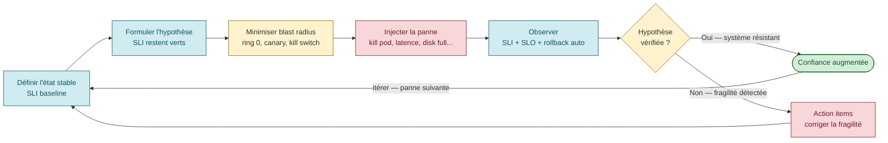
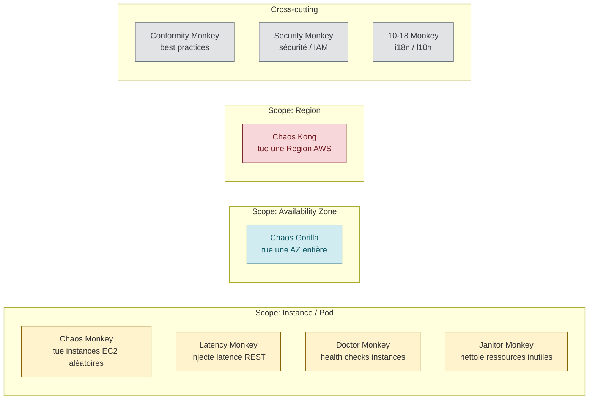

# Chaos Engineering — tester la résilience volontairement

> **Sources** :
> - [Principles of Chaos Engineering](https://principlesofchaos.org/ "Principles of Chaos Engineering (Netflix / ChaosConf)") — les 5 principes canoniques (Netflix, 2015+)
> - [Netflix Tech Blog — The Netflix Simian Army](https://netflixtechblog.com/the-netflix-simian-army-16e57fbab116 "Netflix Tech Blog — The Netflix Simian Army (2011)") — origine historique
> - [Gremlin — Chaos Engineering: history, principles, practice](https://www.gremlin.com/community/tutorials/chaos-engineering-the-history-principles-and-practice/)
> - [Chaos Mesh](https://chaos-mesh.org/ "Chaos Mesh — Kubernetes chaos (CNCF)") — outil CNCF
> - [LitmusChaos](https://litmuschaos.io/ "LitmusChaos — Kubernetes chaos (CNCF)") — outil CNCF
> - [Microsoft Azure WAF — Testing strategy](https://learn.microsoft.com/en-us/azure/well-architected/reliability/testing-strategy "Microsoft Azure WAF — Reliability, Testing strategy")
> - [AWS Builders' Library — Going faster with continuous delivery](https://aws.amazon.com/builders-library/going-faster-with-continuous-delivery/ "AWS Builders Library — Going faster with continuous delivery")

## Définition canonique

> *"Chaos Engineering is the discipline of experimenting on a system in order to build confidence in the system's capability to withstand turbulent conditions in production."* [📖¹](https://principlesofchaos.org/ "Principles of Chaos Engineering (Netflix / ChaosConf)")
>
> *En français* : le **Chaos Engineering** est la discipline qui **expérimente volontairement** sur un système pour construire la confiance dans sa capacité à résister à des conditions turbulentes en production.

L'idée fondamentale : **on ne peut pas avoir confiance dans la résilience d'un système qu'on n'a jamais testé sous stress**. Plutôt que d'attendre la prochaine panne pour découvrir un bug de résilience, on injecte volontairement des pannes contrôlées et on observe.

## Les 5 principes canoniques



### 1. Build a Hypothesis around Steady State Behavior

> *"Focus on the measurable output of a system, rather than internal attributes of the system."* [📖¹](https://principlesofchaos.org/ "Principles of Chaos Engineering (Netflix / ChaosConf)")
>
> *En français* : se concentrer sur la **sortie mesurable** du système (SLI observables), plutôt que sur ses attributs internes.

On définit d'abord ce qu'est le *"comportement normal"* du système via des **SLI mesurables** (latence p99, taux d'erreur, throughput). L'hypothèse devient : *"Si j'injecte X, alors les SLI restent dans les bornes Y"*.

### 2. Vary Real-world Events

> *"Chaos variables reflect real-world events. Prioritize events either by potential impact or estimated frequency."* [📖¹](https://principlesofchaos.org/ "Principles of Chaos Engineering (Netflix / ChaosConf)")
>
> *En français* : les variables de chaos doivent refléter des **événements réels**. Prioriser par impact potentiel ou fréquence estimée.

Les pannes à simuler doivent être **réalistes** :
- Hardware failures (disk, CPU, network)
- State changes (reboot, restart)
- Bugs logiciels
- Traffic spikes (1.5×, 5×, 100× nominal)
- Latence réseau, packet loss
- Dependencies down (DB, cache, 3rd party)
- Certificat TLS expiré
- Disk plein
- DNS qui ment

### 3. Run Experiments in Production

> *"To guarantee both authenticity of the way in which the system is exercised and relevance to the current deployed system, Chaos strongly prefers to experiment directly on production traffic."* [📖¹](https://principlesofchaos.org/ "Principles of Chaos Engineering (Netflix / ChaosConf)")
>
> *En français* : pour garantir **l'authenticité** des conditions testées et la **pertinence** par rapport au système réellement déployé, le Chaos préfère expérimenter **directement sur le trafic de production**.

Le principe le plus controversé. Justification : seul l'environnement prod a la **vraie** distribution de trafic, les vraies dépendances, la vraie config. Tester en staging valide staging, pas prod.

⚠️ Cela suppose **principe 5** (blast radius) et une excellente observabilité.

### 4. Automate Experiments to Run Continuously

> *"Running experiments manually is labor-intensive and ultimately unsustainable. Automate experiments and run them continuously."* [📖¹](https://principlesofchaos.org/ "Principles of Chaos Engineering (Netflix / ChaosConf)")
>
> *En français* : lancer des expériences à la main est **coûteux** et **insoutenable** sur la durée. Il faut **automatiser** et **tourner en continu**.

Un game day annuel ne suffit pas. Le système évolue, les bugs aussi. Pour avoir une confiance durable, il faut une **boucle continue** d'expériences automatisées qui tourne en background.

### 5. Minimize Blast Radius

> *"It is the responsibility and obligation of the Chaos Engineer to ensure the fallout from experiments are minimized and contained."* [📖¹](https://principlesofchaos.org/ "Principles of Chaos Engineering (Netflix / ChaosConf)")
>
> *En français* : c'est la **responsabilité** du Chaos Engineer de **minimiser et contenir** les retombées de ses expériences.

Techniques de containment :
- **Ring 0 / Ring 1 / Ring N** : démarrer sur 0.1% du trafic, monter progressivement
- **Canary chaos** : injecter sur le canary, pas sur la prod globale
- **Circuit breakers / kill switches** : bouton "stop" qui remet tout d'aplomb en < 30s
- **Temporalité limitée** : 5-15 min, pas des jours
- **Bornes géographiques** : 1 AZ, 1 cluster, 1 tenant

## Origine : Netflix Simian Army (2011)

En 2011, Netflix migre de leur datacenter vers AWS. Pour forcer leurs équipes à construire des services qui tolèrent la défaillance d'une instance EC2 aléatoire, ils créent **Chaos Monkey** — qui tue des instances en production pendant les heures ouvrées.

> *"The best way to avoid failure is to fail constantly."* — ⚠️ citation largement attribuée à Netflix (cf. [Chaos Monkey Release Notes 2012](https://netflixtechblog.com/the-netflix-simian-army-16e57fbab116 "Netflix Tech Blog — The Netflix Simian Army (2011)")) mais formulation exacte à re-vérifier dans la source originale
>
> *En français* : la meilleure façon d'**éviter les pannes**, c'est d'**échouer constamment** (à petite échelle et sous contrôle).

Rapidement, Netflix ajoute d'autres "monkeys" sous le nom collectif **Simian Army** :

| Monkey | Rôle |
|--------|------|
| **Chaos Monkey** | Tue des instances EC2 aléatoires |
| **Latency Monkey** | Injecte de la latence sur les appels REST client-serveur |
| **Conformity Monkey** | Détecte les instances qui ne respectent pas les best practices et les shut down |
| **Doctor Monkey** | Vérifie la santé des instances |
| **Janitor Monkey** | Nettoie les ressources inutilisées |
| **Security Monkey** | Variant de Conformity sur les aspects sécurité |
| **10-18 Monkey** | Teste les instances servant des clients dans différentes régions/langues |
| **Chaos Gorilla** | Simule la perte d'une **AZ** entière |
| **Chaos Kong** | Simule la perte d'une **Region** AWS entière |



Le code de Chaos Monkey est libéré en **2012** sous Apache 2.0 (GitHub Netflix/SimianArmy).

## Game day vs chaos continu

| Aspect | Game day (ponctuel) | Chaos continu (automatisé) |
|--------|---------------------|---------------------------|
| **Fréquence** | Trimestrielle / annuelle | Continue (heures, jours) |
| **Préparation** | Heavy (briefing, runbook, rôles) | Minimal (config initiale) |
| **Annonce** | Annoncé à l'équipe | Non-annoncé (background) |
| **Cible** | Apprentissage humain | Résilience technique |
| **Outils** | Process humain + scripts simples | Chaos Monkey, Gremlin, Litmus |
| **Sévérité** | Peut être plus lourd | Limité, blast radius minimal |

Les deux sont **complémentaires**.

## Structure d'un Game Day

### Préparation (jours avant)

1. **Choix du scénario** : qu'est-ce qu'on simule ?
2. **Hypothèse de steady state** : quels SLI doivent rester verts ?
3. **Runbook** existant ou prévu
4. **Participants** identifiés (game master, attackers, defenders, observers)
5. **Heure annoncée** à l'équipe (pas surprise)
6. **Rollback prévu** : comment on arrête en cas de problème
7. **Approbation management**

### Briefing (1h avant)

- Rappel du scénario
- Rôles attribués
- Steady state baseline confirmée
- Channel Slack dédié `#gameday-2026-04`

### Exécution (1-4h)

1. **Injection de la panne** par l'attacker
2. **Observation** : alertes, dashboards, comportement des opérateurs
3. **Réponse** : l'équipe traite l'incident comme un vrai
4. **Mesure** : MTTD, MTTA, MTTR observés
5. **Stop si scope dépassé**

### Debrief (1-2h après)

- **Blameless postmortem** (cf. [`postmortem.md`](postmortem.md))
- **Action items** identifiés (runbook manquant, alerte à ajouter, procédure à clarifier)
- **Mise à jour** des runbooks et de l'observabilité
- **Plan** pour le prochain game day

## Scénarios typiques

| Scénario | Validation | Outil |
|----------|-----------|-------|
| **Perte d'une AZ** | Multi-AZ failover marche | AWS FIS, Chaos Mesh `PodChaos` per zone |
| **Latence injectée** sur appel inter-service | Circuit breakers + timeouts marchent | Chaos Mesh `NetworkChaos` |
| **DB master down** | Replica promu en X minutes | Manuel (kubectl delete pod) |
| **Saturation CPU** | Autoscaler kicks in, dégradation graceful | Chaos Mesh `StressChaos` |
| **Disque plein etcd** | Détection + procédure de cleanup | Manuel (dd if=/dev/zero) |
| **Certificat TLS expiré** | Alerte arrive, runbook clear | Manuel (modifier date système) |
| **DNS qui ment** | Service utilise IP cachée ou fallback | Chaos Mesh `DNSChaos` |
| **Region down** | Multi-region failover | Très lourd, game day annuel |

## Outils disponibles

| Outil | Cible | Particularité |
|-------|-------|---------------|
| **[Chaos Monkey](https://github.com/Netflix/SimianArmy "Netflix SimianArmy — source code Chaos Monkey")** (Netflix, 2011) | AWS EC2 | Le pionnier. Aujourd'hui intégré à Spinnaker |
| **[Gremlin](https://www.gremlin.com/community/tutorials/chaos-engineering-the-history-principles-and-practice/)** | SaaS, multi-cloud | Commercial, polish UI, library d'attacks, safety controls |
| **[LitmusChaos](https://litmuschaos.io/ "LitmusChaos — Kubernetes chaos (CNCF)")** | Kubernetes (CNCF) | Open-source, CRDs `ChaosEngine`, ChaosHub de scénarios |
| **[Chaos Mesh](https://chaos-mesh.org/ "Chaos Mesh — Kubernetes chaos (CNCF)")** | Kubernetes (CNCF) | Créé par PingCAP. CRDs `PodChaos`, `NetworkChaos`, `StressChaos`, `IOChaos`, `DNSChaos`, `TimeChaos`. Workflows complexes |
| **[AWS Fault Injection Simulator (FIS)](https://aws.amazon.com/fis/ "AWS Fault Injection Service (FIS) — chaos engineering managé")** | AWS | Managed service AWS |
| **[Azure Chaos Studio](https://azure.microsoft.com/en-us/products/chaos-studio)** | Azure | Équivalent Azure managé |
| **[Chaos Toolkit](https://chaostoolkit.org/)** | Multi-cloud | Open-source, déclaratif YAML/JSON |

## Lien chaos ↔ error budget

> *"Establish an error budget as an investment in chaos and fault injection. Your error budget is the difference between achieving 100 percent of the SLO and achieving the agreed upon SLO."* [📖³](https://learn.microsoft.com/en-us/azure/well-architected/reliability/testing-strategy "Microsoft Azure WAF — Reliability, Testing strategy")
>
> *En français* : considérer l'**error budget** comme un **investissement** dans le chaos engineering et l'injection de pannes. Le budget = l'écart entre 100 % et votre SLO.

> ⚠️ **Citation Microsoft Azure WAF** — cohérente avec l'esprit du guide Testing strategy, formulation exacte à re-vérifier

Idée : tant que le budget d'erreur n'est pas consommé, **vous pouvez vous permettre des expériences chaos**. Le chaos consume une petite partie du budget en échange d'apprentissage.

Si le budget est déjà consommé → suspendre les expériences chaos.

## Pré-requis avant le 1er game day

1. **Observability solide** : metrics, logs, traces. Sans cela, vous ne mesurerez rien.
2. **Alerting qui marche** : sinon l'expérience passe inaperçue.
3. **Runbooks** pour les scénarios connus.
4. **Équipe formée** au processus de game day.
5. **Approbation management** + comms aux équipes dépendantes.
6. **Rollback automatique ou quasi-automatique** : chaque expérience a une abort condition.

## Chaos engineering en CI/CD

Tendance : injecter du chaos **en pré-prod** dans les pipelines.

**Pattern** : après un déploiement en staging, un job lance 3 minutes de `NetworkChaos` (latence 200ms) sur les pods, puis lance les tests E2E. Si les tests échouent, le pipeline bloque la promotion vers prod.

→ Évite de découvrir en prod qu'un bug ne se déclenche que sous conditions dégradées.

```yaml
# Exemple Argo Workflow + Litmus
- name: chaos-network-latency
  inputs:
    parameters:
      - name: target_namespace
        value: staging
  template:
    resource:
      action: create
      manifest: |
        apiVersion: litmuschaos.io/v1alpha1
        kind: ChaosEngine
        metadata:
          name: pod-network-latency
          namespace: '{{inputs.parameters.target_namespace}}'
        spec:
          experiments:
            - name: pod-network-latency
              spec:
                components:
                  env:
                    - name: NETWORK_LATENCY
                      value: '200'  # 200ms
                    - name: TOTAL_CHAOS_DURATION
                      value: '180'  # 3 min
```

## Anti-patterns

| Anti-pattern | Conséquence |
|--------------|-------------|
| **Chaos en prod sans observabilité** | On ne voit pas ce qui casse |
| **Scénarios irréalistes** ("tuer 90% des instances") | Inconcluant — ça casse, on le sait déjà |
| **Équipes non prévenues** | Méfiance, burnout |
| **Pas de blast radius** | Incident réel qui impacte les vrais clients |
| **Absence de debrief** | L'exercice n'a aucune valeur d'apprentissage |
| **Chaos-washing** | "On a fait un game day" sans amélioration continue |
| **Pas d'abort condition** | L'expérience continue alors que ça vrille |
| **Hypothèse vague** | "On verra ce qui se passe" — rien à mesurer |

## Lien avec les autres piliers SRE

- **SLI/SLO** : le steady state est défini par les SLI
- **Error budget** ([`error-budget.md`](error-budget.md)) : finance les expériences
- **Postmortem** ([`postmortem.md`](postmortem.md)) : chaque game day produit un postmortem
- **Incident management** ([`incident-management.md`](incident-management.md)) : un game day est un IR simulé
- **Synthetic monitoring** ([`synthetic-monitoring.md`](synthetic-monitoring.md)) : alimente la détection pendant l'expérience

## 📐 À l'échelle d'une grande organisation

Le chaos engineering tel que décrit par le *Principles of Chaos* de Netflix [📖](https://principlesofchaos.org/ "Principles of Chaos Engineering") est défini sur un service. À l'échelle d'une grande organisation tech, **trois ajustements** s'imposent :

- **Coordonner cross-team** — un game day touche typiquement plusieurs services possédés par plusieurs équipes. Le scope ne peut pas être décidé par une équipe seule. Voir le pattern « comité chaîne » dans [`journey-slos-cross-service.md`](journey-slos-cross-service.md).
- **Tier-aware** — l'injection sur un service T1 (chaîne critique) exige des garde-fous (fenêtre, blast radius, kill-switch) plus stricts que sur un T4. Voir [`sre-at-scale.md`](sre-at-scale.md) §*Tier de service*.
- **Mesurer le maillon faible de la chaîne** — le chaos engineering à l'échelle ne révèle de la valeur que s'il cible le maillon dont la défaillance brûle l'error budget de la chaîne (cf. composition multiplicative + règle 1/N dans [`journey-slos-cross-service.md`](journey-slos-cross-service.md)).

## Ressources

Sources primaires vérifiées :

1. [Principles of Chaos Engineering](https://principlesofchaos.org/ "Principles of Chaos Engineering (Netflix / ChaosConf)") — 5 principes + définition verbatim confirmés
2. [Netflix Tech Blog — The Netflix Simian Army](https://netflixtechblog.com/the-netflix-simian-army-16e57fbab116 "Netflix Tech Blog — The Netflix Simian Army (2011)") — origine historique 2011
3. [Microsoft Azure WAF — Testing strategy](https://learn.microsoft.com/en-us/azure/well-architected/reliability/testing-strategy "Microsoft Azure WAF — Reliability, Testing strategy") — error budget as investment

Ressources complémentaires :
- [Gremlin — Chaos Engineering tutorial](https://www.gremlin.com/community/tutorials/chaos-engineering-the-history-principles-and-practice/)
- [Chaos Mesh (CNCF)](https://chaos-mesh.org/ "Chaos Mesh — Kubernetes chaos (CNCF)")
- [LitmusChaos (CNCF)](https://litmuschaos.io/ "LitmusChaos — Kubernetes chaos (CNCF)")
- [Netflix SimianArmy GitHub](https://github.com/Netflix/SimianArmy "Netflix SimianArmy — source code Chaos Monkey")
- [AWS Fault Injection Simulator](https://aws.amazon.com/fis/ "AWS Fault Injection Service (FIS) — chaos engineering managé")
- [Azure Chaos Studio](https://azure.microsoft.com/en-us/products/chaos-studio)
- [Chaos Toolkit](https://chaostoolkit.org/)
