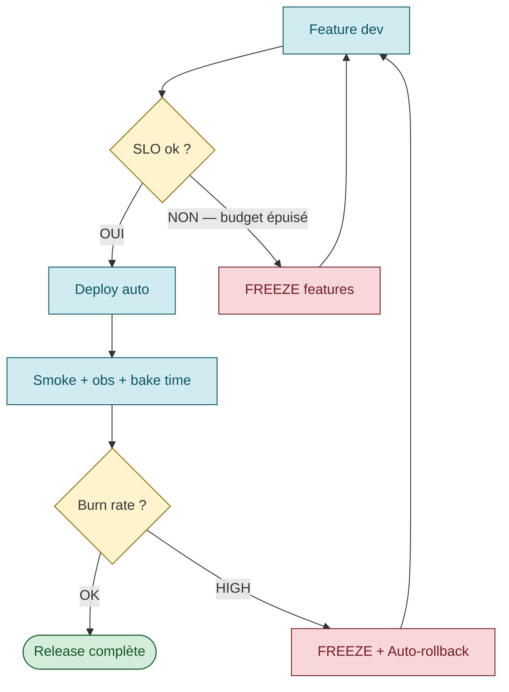
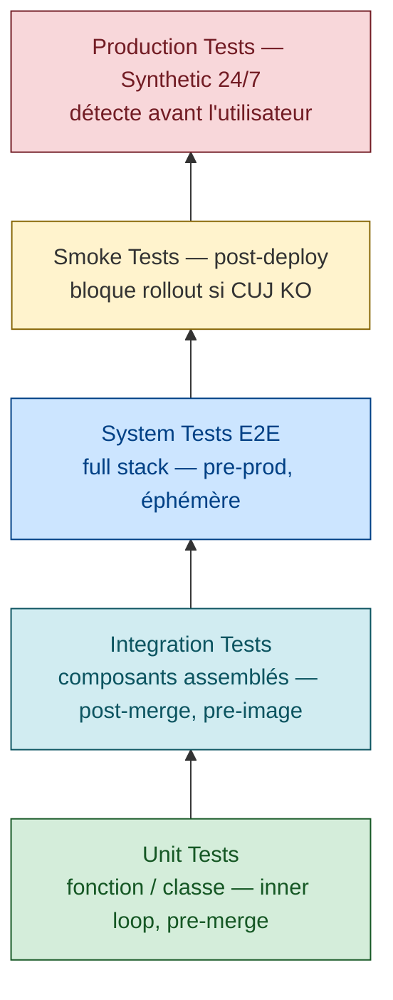
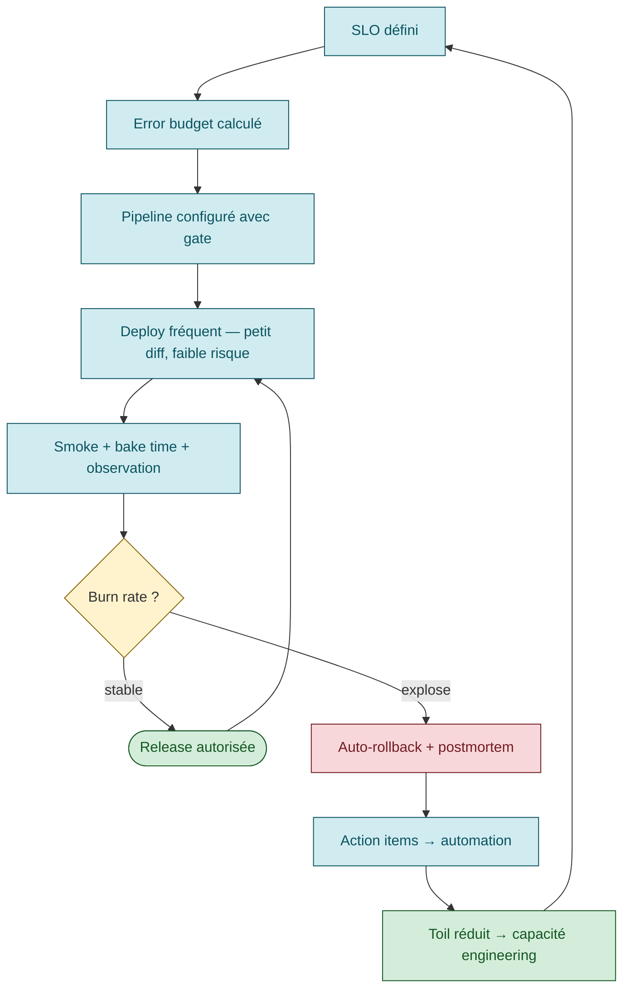

# CI/CD ↔ SRE — comment le pipeline sert les SLO

> **Sources primaires** :
> - Google SRE book ch. 8, [*Release Engineering*](https://sre.google/sre-book/release-engineering/ "Google SRE book ch. 8 — Release Engineering")
> - Google SRE book ch. 17, [*Testing for Reliability*](https://sre.google/sre-book/testing-reliability/ "Google SRE book ch. 17 — Testing for Reliability")
> - AWS Builders' Library, [*Going faster with continuous delivery*](https://aws.amazon.com/builders-library/going-faster-with-continuous-delivery/ "AWS Builders Library — Going faster with continuous delivery")
> - AWS Builders' Library, [*Automating safe, hands-off deployments*](https://aws.amazon.com/builders-library/automating-safe-hands-off-deployments/ "AWS Builders Library — Automating safe, hands-off deployments (Clare Liguori)")
> - Microsoft Azure WAF, [*Operational Excellence — Safe deployment practices*](https://learn.microsoft.com/en-us/azure/well-architected/operational-excellence/safe-deployments "Microsoft Azure WAF — Safe deployment practices (ring deployment)")
> - [DORA research — Google Cloud](https://dora.dev/research/ "DORA research (Google Cloud) — 4 key DevOps metrics")

## La fausse dichotomie SRE vs CI/CD

On entend parfois *"l'équipe SRE bloque les déploiements"*. C'est un anti-pattern. Le SRE moderne **utilise** le CI/CD comme outil principal.

### La vraie dichotomie

| ✗ Anti-pattern | ✓ SRE moderne |
|------|------|
| Déploiements rares = sûrs | Déploiements fréquents = sûrs (parce que diff petit + rollback rapide) |
| SRE valide chaque release | SRE configure le pipeline pour qu'il valide tout seul via SLO |
| Tests à la fin | Tests à chaque étape, smoke en continu post-deploy |
| Rollback manuel | Rollback automatique sur burn rate |
| Pas de canary | Canary obligatoire avec bake time |

> ⚠️ **Tableau de dichotomie** — synthèse pédagogique cohérente avec les principes SRE (SRE book ch. 8) et la recherche DORA. Pas une citation directe unique.

## Le mécanisme central : SLO comme deployment gate



### Pattern 1 : Pre-deploy gate sur error budget

```yaml
# Pseudo-pipeline (illustration)
- task: check-error-budget
  run: |
    BUDGET=$(query_slo_dashboard --service=$SERVICE --window=4w)
    if [ $BUDGET -lt 20 ]; then
      echo "Error budget < 20%, freeze in effect"
      exit 1
    fi

- task: deploy-prod
  passed: [check-error-budget, smoke-tests]
```

> Anti-pattern : "freeze" géré dans le wiki par un humain. Le freeze doit être **mécanique** — sinon il sera contourné.

*Principe automatique du freeze : [Google SRE workbook — Error Budget Policy](https://sre.google/workbook/error-budget-policy/ "Google SRE workbook — Error Budget Policy (Steven Thurgood, 2018)") [📖¹](https://sre.google/workbook/error-budget-policy/ "Google SRE workbook — Error Budget Policy (Steven Thurgood, 2018)").*

### Pattern 2 : Canary auto-rollback sur burn rate

```yaml
- task: canary-deploy
  run: |
    deploy --traffic-percent=5
    sleep 600  # bake time 10 min

    BURN_RATE=$(query_burn_rate --service=$SERVICE --window=10m)
    if [ $BURN_RATE -gt 14.4 ]; then
      rollback
      alert "Auto-rollback : burn rate $BURN_RATE > 14.4 sur 10min"
      exit 1
    fi

- task: full-rollout
  passed: [canary-deploy]
```

*Seuil 14.4 tiré de la Table 5-8 du [SRE workbook — Alerting on SLOs](https://sre.google/workbook/alerting-on-slos/ "Google SRE workbook — Alerting on SLOs (burn rate alerting)") [📖²](https://sre.google/workbook/alerting-on-slos/ "Google SRE workbook — Alerting on SLOs (burn rate alerting)").*

Outils qui automatisent ce pattern :
- **[Argo Rollouts](https://argoproj.github.io/argo-rollouts/features/analysis/)** + AnalysisTemplates Prometheus
- **[Flagger](https://flagger.app/ "Flagger — progressive delivery Flux (CNCF)")** (GitOps Flux ecosystem)
- **[Spinnaker + Kayenta](https://spinnaker.io/docs/guides/user/canary/)**
- **[AWS CodeDeploy](https://docs.aws.amazon.com/codedeploy/latest/userguide/deployments-rollback-and-redeploy.html)** + CloudWatch alarms

## Les 4 principes Google appliqués au CI/CD

Source : Google SRE book ch. 8, [*Release Engineering*](https://sre.google/sre-book/release-engineering/ "Google SRE book ch. 8 — Release Engineering") [📖³](https://sre.google/sre-book/release-engineering/ "Google SRE book ch. 8 — Release Engineering")

| Principe | Traduction CI/CD concrète |
|----------|---------------------------|
| **Self-service model** | Pipelines déclaratifs (Concourse, GitLab CI, GitHub Actions, ArgoCD) que les équipes contrôlent elles-mêmes |
| **High velocity** | "Push on green" — tout commit qui passe les tests va en prod (dans la limite du SLO) |
| **Hermetic builds** | Image figée, pas de `apt install` au build, dépendances vendorées, builds reproductibles |
| **Enforcement of policies** | Codeowners, branch protection, signatures, audit log, manual gate sur prod |

> ⚠️ **Colonne « Traduction CI/CD concrète »** — mapping pédagogique vers les outils CI/CD modernes. Le SRE book ch. 8 décrit les principes ; la correspondance avec Concourse/Argo/GitHub Actions est interprétation communautaire.

## Pyramide de tests SRE-friendly



> *"It's essential that the latest version of a software project in source control is working completely. When the build system notifies engineers about broken code, they should drop all of their other tasks and prioritize fixing the problem."* [📖⁴](https://sre.google/sre-book/testing-reliability/ "Google SRE book ch. 17 — Testing for Reliability")
>
> *En français* : il est **essentiel** que la dernière version dans le source control fonctionne **complètement**. Quand le build system signale un code cassé, les ingénieurs doivent **tout laisser tomber** et prioriser la correction.

*Pyramide inspirée de la [Test Pyramid — Martin Fowler](https://martinfowler.com/bliki/TestPyramid.html "Martin Fowler — Test Pyramid") + classification SRE book ch. 17.*

## Smoke tests réutilisés à 3 endroits

Le même scénario d'un CUJ peut servir :

| Phase | Quand | Scope | Source |
|-------|-------|-------|--------|
| **E2E pre-prod** | Avant chaque promotion | `@cuj` (full path, écriture+lecture) | repo de tests |
| **Smoke post-deploy** | Après chaque déploiement vers les environnements cibles | `@cuj @smoke` (read-only en prod) | même repo de tests |
| **Synthetic 24/7** | En continu depuis l'extérieur | `@cuj @smoke` (depuis Datadog/Checkly) | même repo de tests |

**Code partagé** : un seul jeu de scénarios Behave/Playwright avec des **tags** pour scoper :
- `@cuj` : fait partie d'un Critical User Journey
- `@smoke` : sous-ensemble re-jouable post-deploy en prod (idempotent, read-only)
- `@e2e-only` : scénarios destructeurs réservés au pre-prod
- `@synthetic` : exécutables aussi depuis Datadog/Checkly

Cf. [`smoke-tests.md`](smoke-tests.md) et [`synthetic-monitoring.md`](synthetic-monitoring.md).

> ⚠️ **Convention des tags `@cuj`, `@smoke`, `@e2e-only`, `@synthetic`** — convention d'équipe, pas un standard officiel Behave/Cypress. À adapter.

## Pattern AWS — Automating safe, hands-off deployments

Source : [AWS Builders' Library — Automating safe, hands-off deployments](https://aws.amazon.com/builders-library/automating-safe-hands-off-deployments/ "AWS Builders Library — Automating safe, hands-off deployments (Clare Liguori)") [📖⁵](https://aws.amazon.com/builders-library/automating-safe-hands-off-deployments/ "AWS Builders Library — Automating safe, hands-off deployments (Clare Liguori)")

AWS décrit un pipeline en plusieurs phases avec **bake time** entre chaque étape :

```mermaid
flowchart LR
    classDef proc fill:#D1ECF1,stroke:#0C5460,color:#0C5460
    classDef gate fill:#FFF3CD,stroke:#856404,color:#333
    classDef prod fill:#F8D7DA,stroke:#721C24,color:#721C24

    SRC[Source]:::proc --> BUILD[Build]:::proc --> TEST[Test]:::proc --> PREPROD["Pre-prod<br/>tests + load"]:::gate
    PREPROD --> OB["One-box prod<br/>1 instance, observe"]:::prod
    OB -->|"bake 30 min"| ZONE["1 zone prod — 1 AZ<br/>observe"]:::prod
    ZONE -->|"bake 1h"| REGION["Région complète<br/>observe"]:::prod
    REGION -->|"bake 24h"| MULTI["Multi-region<br/>rollout global"]:::prod
```



À chaque étape :
1. **Deploy** sur le sous-ensemble
2. **Bake time** : observation passive
3. **Auto-promotion** si SLI OK
4. **Auto-rollback** si SLI dégradé

> ⚠️ **Les bake times (30 min / 1h / 24h)** sont illustratifs. AWS documente le **principe** (bake time entre phases) sans imposer de durées exactes dans la page Builders' Library.

## DevOps vs SRE — l'angle Microsoft

Microsoft ne les oppose pas, les complète :

| DevOps | SRE |
|--------|-----|
| Casse les silos dev/ops | Implémente DevOps avec une approche d'ingénierie |
| Automation, CI/CD, infra-as-code | Automation **+ SLO + error budget + toil ceiling** |
| "Move fast" | "Move fast **safely**, mesurable" |
| Culture | Culture **+ chiffres** |

> Le SRE ajoute la **rigueur quantitative** au DevOps. Le DevOps ajoute la **culture collaborative** au SRE.

> ⚠️ **Tableau de comparaison DevOps/SRE** — synthèse pédagogique consolidée à partir de multiples sources (Google SRE book, Dave Rensin « class SRE implements DevOps », Atlassian). Pas un tableau littéral.

## Anti-patterns CI/CD ↔ SRE

| Anti-pattern | Conséquence |
|--------------|-------------|
| **Pas de SLO → pipeline volant** | Aucun gate objectif, décisions arbitraires |
| **Pipeline qui ignore le SLO** | Vous déployez sur un service déjà en panne |
| **Pas de smoke post-deploy** | Vous découvrez la panne via un ticket client |
| **Smoke qui ne reflète pas le CUJ** | Vous validez ce qui n'est pas critique |
| **Rollback uniquement manuel** | MTTR explose, burn rate consume le budget |
| **Pas de bake time** | Bug détecté après 100% rollout |
| **Pas de canary** | 100% impact à chaque release |
| **Ops qui contournent le pipeline** | Drift, état prod ≠ source control |
| **Fix-forward only** | Pas de rollback, donc pression à pousser un fix sous stress |
| **Pas de tests prod** | Vous ne savez pas ce qui se passe entre 2 releases |

> ⚠️ **Tableau anti-patterns** — consolidé à partir des principes SRE book + pratiques DORA. Pas une liste littérale unique.

## Cycle vertueux SRE × CI/CD



## Mesures à mettre en place dans le pipeline

Les **DORA metrics** [📖⁶](https://dora.dev/research/ "DORA research (Google Cloud) — 4 key DevOps metrics") sont la référence universelle pour mesurer la performance d'une organisation CI/CD. Pour l'**outillage** qui calcule ces métriques à partir des sources de vérité (Git, CI/CD, postmortems), voir le guide dédié [`dora-tooling.md`](dora-tooling.md) (panorama DevLake / Four Keys / Faros / Sleuth).

| Métrique | Comment | Pourquoi |
|----------|---------|----------|
| **Deployment frequency** | Compter les deploys/jour | DORA metric — vélocité [📖⁶](https://dora.dev/research/ "DORA research (Google Cloud) — 4 key DevOps metrics") |
| **Lead time for changes** | commit → prod (heures) | DORA metric — agilité [📖⁶](https://dora.dev/research/ "DORA research (Google Cloud) — 4 key DevOps metrics") |
| **Change failure rate** | % deploys qui causent un incident | DORA metric — qualité [📖⁶](https://dora.dev/research/ "DORA research (Google Cloud) — 4 key DevOps metrics") |
| **Time to restore** | MTTR sur incidents prod | DORA metric — résilience [📖⁶](https://dora.dev/research/ "DORA research (Google Cloud) — 4 key DevOps metrics") |
| **Pipeline duration** | Temps total pipeline | Friction pour les devs |
| **Test flakiness** | % tests qui passent/échouent aléatoirement | Tueur de confiance |
| **Rollback rate** | % deploys rollbackés | Indicateur de qualité de smoke/canary |

> ⚠️ **Les 4 dernières metrics** (pipeline duration, test flakiness, rollback rate, etc.) sont des indicateurs opérationnels cohérents mais **pas des DORA metrics** au sens strict. DORA = 4 metrics seulement : deployment frequency, lead time, change failure rate, time to restore [📖⁶](https://dora.dev/research/ "DORA research (Google Cloud) — 4 key DevOps metrics").

## Lien avec les autres piliers SRE

- **SLI/SLO** : la cible que le pipeline défend
- **Error budget** : le budget que le pipeline consomme/préserve
- **Smoke tests** : le gate du pipeline post-deploy
- **Synthetic monitoring** : la sentinelle entre les releases
- **Release engineering** : le détail de comment on déploie (canary, blue/green, ring)
- **Toil** : le pipeline élimine le toil de promotion manuelle
- **Postmortem** : alimente le backlog d'amélioration du pipeline

## Ressources

Sources primaires vérifiées :

1. [Google SRE workbook — Error Budget Policy](https://sre.google/workbook/error-budget-policy/ "Google SRE workbook — Error Budget Policy (Steven Thurgood, 2018)") — freeze mécanique sur budget épuisé
2. [Google SRE workbook — Alerting on SLOs](https://sre.google/workbook/alerting-on-slos/ "Google SRE workbook — Alerting on SLOs (burn rate alerting)") — Table 5-8, seuil burn rate 14.4
3. [Google SRE book ch. 8 — Release Engineering](https://sre.google/sre-book/release-engineering/ "Google SRE book ch. 8 — Release Engineering") — 4 principes self-service/velocity/hermetic/policies
4. [Google SRE book ch. 17 — Testing for Reliability](https://sre.google/sre-book/testing-reliability/ "Google SRE book ch. 17 — Testing for Reliability") — build system priority
5. [AWS Builders' Library — Automating safe hands-off deployments](https://aws.amazon.com/builders-library/automating-safe-hands-off-deployments/ "AWS Builders Library — Automating safe, hands-off deployments (Clare Liguori)") — one-box, bake time
6. [DORA research — Google Cloud](https://dora.dev/research/ "DORA research (Google Cloud) — 4 key DevOps metrics") — 4 key metrics

Ressources complémentaires :
- [AWS Builders' Library — Going faster with continuous delivery](https://aws.amazon.com/builders-library/going-faster-with-continuous-delivery/ "AWS Builders Library — Going faster with continuous delivery")
- [Microsoft Azure WAF — Safe deployment practices](https://learn.microsoft.com/en-us/azure/well-architected/operational-excellence/safe-deployments "Microsoft Azure WAF — Safe deployment practices (ring deployment)")
- [Dave Rensin — class SRE implements DevOps](https://www.oreilly.com/content/how-class-sre-implements-interface-devops/ "Dave Rensin (Google) — class SRE implements DevOps")
- [Martin Fowler — Test Pyramid](https://martinfowler.com/bliki/TestPyramid.html "Martin Fowler — Test Pyramid")
- [Argo Rollouts](https://argoproj.github.io/argo-rollouts/ "Argo Rollouts — progressive delivery Kubernetes")
- [Flagger](https://flagger.app/ "Flagger — progressive delivery Flux (CNCF)")
- [Spinnaker Kayenta](https://spinnaker.io/docs/guides/user/canary/)
