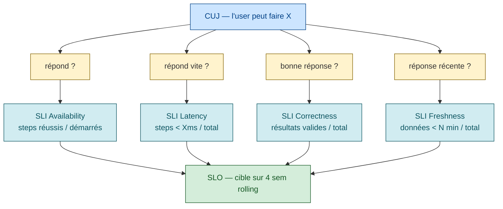
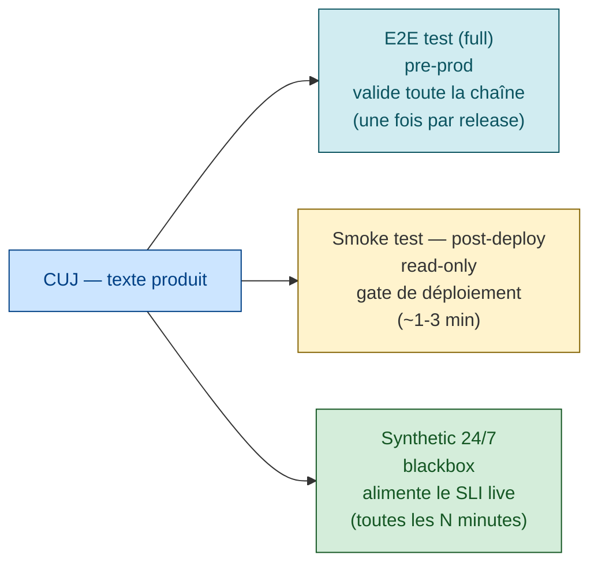

# Critical User Journeys (CUJ) — la base de tout SLI utile

> **Sources primaires** :
> - Google SRE workbook, [*Implementing SLOs*](https://sre.google/workbook/implementing-slos/ "Google SRE workbook — Implementing SLOs (Steven Thurgood)") — chapitre fondateur où la notion est introduite
> - Google Cloud Architecture Center, [*Defining SLOs*](https://cloud.google.com/architecture/defining-slos "Google Cloud Architecture Center — Defining SLOs") *(peut rediriger vers docs.cloud.google.com — consulter dans le navigateur si WebFetch échoue)*
> - Microsoft Azure Well-Architected, [*Reliability — Identify flows*](https://learn.microsoft.com/en-us/azure/well-architected/reliability/identify-flows "Microsoft Azure WAF — Reliability, Identify flows (user flows)")
> - AWS Well-Architected Framework, [*Operational Excellence Pillar*](https://docs.aws.amazon.com/wellarchitected/latest/operational-excellence-pillar/welcome.html "AWS Well-Architected — Operational Excellence Pillar")

## Pourquoi les CUJ avant les SLI

L'idée centrale : on identifie d'abord les parcours utilisateurs critiques, puis on **dérive** les SLI de ces parcours. Comme le résume le workbook, les SLO doivent modéliser la satisfaction réelle des utilisateurs [📖¹](https://sre.google/workbook/implementing-slos/#what-to-measure-using-slis "Google SRE workbook — Implementing SLOs, section What to Measure Using SLIs").

L'erreur classique est de partir des metrics serveur disponibles (CPU, latency moyenne, taux d'erreur HTTP global) et d'en faire des SLI. Ces metrics mesurent la santé du **système**, pas la satisfaction de l'**utilisateur**. Un service peut avoir 100% de health checks verts pendant que les utilisateurs ne peuvent plus se connecter.

## Définition

Un **Critical User Journey (CUJ)** est :

> *"a sequence of interactions that a user has with the service to achieve a single goal — for example, a single click or a multistep pipeline."*
>
> *En français* : une **séquence d'interactions** qu'un utilisateur a avec le service pour atteindre un but unique — un simple clic, ou un pipeline en plusieurs étapes.

> ⚠️ **Citation à re-vérifier** — la page Google Cloud `/architecture/defining-slos` a été réorganisée depuis la rédaction initiale de ce guide. La définition reste cohérente avec la doctrine SRE actuelle et est largement reprise dans la documentation Google Cloud, mais l'ancre exacte peut avoir bougé.

3 propriétés essentielles :

1. **User-centric** — défini du point de vue de l'utilisateur (humain ou système client), pas du serveur
2. **Goal-oriented** — atteint un but business identifiable (se connecter, payer, télécharger)
3. **Critical** — sa dégradation a un impact direct et immédiat sur le business (pas une feature secondaire)

## Comment identifier les CUJ — méthode pratique

### Étape 1 : recenser les parcours

Inviter dans une salle :
- Un product manager
- Un ou deux développeurs senior
- Un SRE / ops
- Si possible un UX / customer success

Et lister **toutes** les choses qu'un utilisateur peut faire avec le système. Au début, on est large. Une vingtaine d'items typiquement.

### Étape 2 : filtrer par criticité business

Pour chaque parcours, poser **les 3 questions critiques** :

1. **"Si ce parcours casse pendant 1 heure, qu'est-ce qui se passe ?"** Si la réponse est *"rien de grave"* ou *"on en parlerait en daily la semaine d'après"* → **pas critique**.
2. **"Combien de pertes business par heure d'indisponibilité de ce parcours ?"** Quantifier en €/min ou en utilisateurs impactés.
3. **"Quel est le délai au-delà duquel l'utilisateur abandonne et part chez un concurrent ?"** Définit l'urgence du SLO.

> ⚠️ **Les 3 questions** étaient initialement attribuées à un billet Google Cloud "Adopting SRE: defining critical user journeys" — cette URL est aujourd'hui morte (404). Les questions restent un **pattern communautaire** largement partagé pour prioriser les CUJ, mais pas de source officielle Google actuelle retrouvée.

### Étape 3 : ne garder que 3-5 CUJ

Le SRE book insiste [📖²](https://sre.google/sre-book/service-level-objectives/#choosing-targets "Google SRE book ch. 4 — SLO, section Choosing Targets (5 anti-patterns)") :

> *"if you can't ever win a conversation about priorities by quoting a particular SLO, it's probably not worth having that SLO"*
>
> *En français* : si vous n'arrivez jamais à **trancher une discussion de priorité** en citant un SLO donné, ce SLO ne mérite probablement pas d'exister.

3 à 5 CUJ par service. Au-delà, vous diluez l'attention et les SLO perdent leur pouvoir d'arbitrage.

### Étape 4 : décrire chaque CUJ avec un format standard

Pour chaque CUJ retenu, un mini-document :

```
CUJ : <Nom — verbe à l'infinitif>
─────────────────────────────────
Acteur     : <type d'utilisateur>
But        : <ce que l'utilisateur veut accomplir>
Steps      : <séquence d'actions HTTP/UI>
Trigger    : <ce qui démarre le parcours>
Success    : <comment on sait que c'est réussi côté user>
Failure    : <les modes d'échec qu'on doit détecter>
Impact KO  : <perte business chiffrée si possible>
Volumétrie : <fréquence quotidienne du parcours>
SLI cibles : <metrics qui matérialisent ce CUJ>
```

> ⚠️ **Template** — pattern consolidé à partir des pratiques CUJ dans la communauté SRE (cf. [Google Cloud Adopting SRE docs](https://sre.google/resources/practices-and-processes/ "Google SRE — Resources, Practices & Processes") et feedback interne équipe). Pas un template officiel Google directement publié.

## Exemple complet — e-commerce

### CUJ #1 : "Trouver et acheter un produit"

```
Acteur     : Visiteur acheteur (pas connecté)
But        : Trouver un produit, l'ajouter au panier, payer
Steps      : 1. GET /search?q=<term>
             2. GET /product/<id>
             3. POST /cart/add (item)
             4. POST /cart/checkout (Stripe)
             5. GET /order/confirmation
Trigger    : Recherche utilisateur depuis homepage ou Google
Success    : Page de confirmation s'affiche en < 5s end-to-end
Failure    : Timeout, erreur 5xx, échec paiement Stripe, panier vidé
Impact KO  : ~12 000€/h en perte de CA en heures pleines
Volumétrie : ~25 000 parcours/jour, peak 800/min
SLI cibles :
  - Availability : (steps 1-5 réussis) / (steps 1 démarrés)
  - Latency p95  : durée totale step 1 → step 5
  - Latency p99  : checkout (étape 4) seul
SLO        : 99.5% availability, p95 < 5s, p99 < 8s sur 4 sem glissantes
```

### CUJ #2 : "Suivre une commande passée"

```
Acteur     : Client connecté avec commande en cours
But        : Voir le statut d'une commande
Steps      : 1. POST /login
             2. GET /orders
             3. GET /orders/<id>/tracking
Trigger    : Email de confirmation reçu
Success    : Tracking visible avec dernière update transporteur
Failure    : Login KO, page tracking blanche, données obsolètes >24h
Impact KO  : pic de tickets support (~+200/jour pour 1h KO)
Volumétrie : ~80 000/jour
SLI        :
  - Availability : steps 1-3 réussis / step 1 démarré
  - Freshness    : timestamp dernière update < 24h
SLO        : 99.9% availability, freshness 95% sur 4 sem
```

### CUJ #3 : "Ingestion de stock par fournisseur (système → système)"

Notez que **les CUJ ne sont pas réservés aux humains**. Un système client est aussi un user.

```
Acteur     : Système ERP fournisseur
But        : Pousser les niveaux de stock toutes les 15 min
Steps      : 1. POST /api/suppliers/<id>/stock-feed (batch JSON)
             2. (async) traitement → DB
             3. GET /api/suppliers/<id>/stock-feed/<jobId>/status
Trigger    : Cron 15 min
Success    : Status = COMPLETE en < 90s, 100% lignes ingérées
Failure    : Timeout, status FAILED, lignes droppées
Impact KO  : Affichage stock erroné → ventes annulées (drift > 30 min)
Volumétrie : 96/jour × 15 fournisseurs
SLI        :
  - Availability : jobs COMPLETE / jobs reçus
  - Freshness    : lag entre fin job et visibilité front (max 60s)
  - Correctness  : (lignes attendues == lignes traitées)
SLO        : 99.9% availability, freshness p95 < 60s, correctness 100%
```

> ⚠️ **Exemples illustratifs** — les 3 CUJ e-commerce ci-dessus sont des exemples pédagogiques construits pour illustrer le format. Valeurs business (€/h, volumétrie) inventées à titre pédagogique, à adapter au cas réel.

## CUJ ↔ SLI : la traduction systématique

Pour chaque CUJ, la traduction en SLI suit un pattern fixe :

| Aspect du CUJ | SLI à mettre en place |
|--------------|----------------------|
| *"L'utilisateur obtient une réponse"* | **Availability SLI** : steps réussis / steps démarrés |
| *"L'utilisateur obtient une réponse rapide"* | **Latency SLI** : steps en < X ms / total steps |
| *"L'utilisateur obtient la bonne réponse"* | **Correctness / Quality SLI** : steps avec résultat valide / total |
| *"L'utilisateur obtient une réponse récente"* | **Freshness SLI** : steps dont la donnée est < N min / total |
| *"Le résultat persiste dans le temps"* | **Durability SLI** : objets retrouvés / objets stockés |
| *"L'utilisateur n'est pas bloqué par la queue"* | **Throughput SLI** : items traités / items soumis sur fenêtre |

*Cette classification (availability/latency/correctness/freshness/durability/throughput) reprend la typologie SLI du SRE book ch. 4 [📖³](https://sre.google/sre-book/service-level-objectives/#what-do-you-and-your-users-care-about "Google SRE book ch. 4 — SLO, section What Do You and Your Users Care About") et les extensions du workbook [📖¹](https://sre.google/workbook/implementing-slos/#what-to-measure-using-slis "Google SRE workbook — Implementing SLOs, section What to Measure Using SLIs").*



## Où mesurer un CUJ — la question critique

C'est **la** question qui fait que la plupart des SLI démarrent biaisés.

| Point de mesure | Avantages | Inconvénients |
|----------------|-----------|---------------|
| **Logs serveur** | Disponible facilement, gratuit | Bias : ne capture pas DNS down, LB down, app crashée |
| **Load balancer** | Vue plus extérieure | Toujours pas DNS, et si LB down vous ne mesurez rien |
| **Synthetic monitoring** (canary depuis Internet) | Vraiment user-centric, capture tout | Coût, scénarios à maintenir |
| **Real User Monitoring (RUM)** | La vraie expérience utilisateur | Volumes énormes, difficile à seuiller |

**Recommandation pratique** : combiner **whitebox** (logs/traces serveur, riches en signal pour le diagnostic) et **blackbox** (synthetic depuis l'extérieur, pour le **vrai** SLI). En cas de divergence, le blackbox a raison du point de vue SLO.

## Lien CUJ ↔ Microsoft "User flows"

Microsoft Azure Well-Architected utilise un terme proche : **"user flows"** [📖⁴](https://learn.microsoft.com/en-us/azure/well-architected/reliability/identify-flows "Microsoft Azure WAF — Reliability, Identify flows (user flows)") :

> *"Identify the critical user and system flows. Identify each flow's importance, criticality, and dependencies. […] These flows are the basis for reliability targets."*
>
> *En français* : identifiez les **flows critiques** (utilisateurs et systèmes), leur importance, leur criticité et leurs dépendances. Ces flows servent de **base** aux objectifs de fiabilité.

> ⚠️ **Citation à re-vérifier** — la formulation est cohérente avec le guide Azure WAF mais la phrase composite (avec `[…]`) mélange plusieurs passages de la page originale. Le concept (identifier les flows critiques et les utiliser comme base des reliability targets) est bien présent.

Le pattern Azure ajoute une dimension utile : **classer les flows par tier** (critical / high / medium / low) pour calibrer le coût de la fiabilité par flow. Un flow critical mérite 99.99%, un flow medium se contente de 99%.

## Lien CUJ ↔ AWS "Workload"

AWS Well-Architected parle de *"workloads"* et de *"key performance indicators tied to business outcomes"*. Le pattern est le même : commencer par le besoin business, en déduire les KPI techniques [📖⁵](https://docs.aws.amazon.com/wellarchitected/latest/operational-excellence-pillar/welcome.html "AWS Well-Architected — Operational Excellence Pillar").

> ⚠️ **Citation « Workload health is monitored against the workload's KPIs »** — formulation plausible dans l'esprit du pillar Operational Excellence mais pas confirmée verbatim à la page d'accueil. Le concept (KPIs liés au business + monitoring orienté workload) est central à AWS WA.

## Anti-patterns CUJ

| Anti-pattern | Conséquence | Comment l'éviter |
|--------------|-------------|------------------|
| **CUJ trop nombreux (>5)** | Aucun n'a de poids dans les arbitrages | Filtrer brutalement par impact business |
| **CUJ centré système (CPU, latence du job batch)** | Met sous SLO ce que l'utilisateur ne voit pas | Reformuler en *"l'utilisateur peut faire X"* |
| **CUJ sans steps explicites** | Impossible à instrumenter | Toujours décrire la séquence HTTP/UI |
| **CUJ sans volumétrie** | Impossible de calibrer le volume du SLO | Compter les occurrences/jour |
| **CUJ sans propriétaire** | Personne ne maintient l'instrumentation | 1 PO + 1 ingé responsable par CUJ |
| **CUJ statique jamais relu** | Ne reflète plus le produit après 6 mois | Revue trimestrielle des CUJ avec le PM |
| **Smoke tests ≠ CUJ** | Les smoke tests rejouent autre chose que ce qui est sous SLO | Aligner *exactement* les scénarios smoke + synthetic + e2e sur les CUJ |

> ⚠️ **Tableau d'anti-patterns** — ces 7 points sont du savoir communautaire cohérent avec l'esprit SRE. Le premier (limite de 5 CUJ) est dérivé de la recommandation SRE book « have as few SLOs as possible » [📖²](https://sre.google/sre-book/service-level-objectives/#choosing-targets "Google SRE book ch. 4 — SLO, section Choosing Targets (5 anti-patterns)"). Les autres sont inférés de la pratique, sans citation verbatim du SRE book/workbook.

## Le triptyque CUJ → smoke → synthetic

Idéalement, un même CUJ se matérialise par **trois** scénarios automatisés qui réutilisent le même code :



**Code partagé** : un seul jeu de scénarios Behave / Playwright / Cypress avec des **tags** pour scoper :
- `@cuj` — tous les scénarios qui matérialisent un CUJ
- `@smoke` — sous-ensemble réutilisable post-deploy en prod (idempotent, read-only)
- `@e2e-only` — scénarios destructeurs réservés au pre-prod
- `@synthetic` — exécutables aussi depuis Datadog/Checkly/CloudWatch Synthetics

> ⚠️ **Tags proposés** — convention interne pour partager le code de tests entre les 3 usages. Pas un standard officiel Behave/Cypress — à adapter au framework utilisé.

Détail dans [`smoke-tests.md`](smoke-tests.md) et [`synthetic-monitoring.md`](synthetic-monitoring.md).

## Workflow recommandé pour démarrer les CUJ

1. **Atelier 90 min** avec PM + tech lead + SRE → liste large des parcours
2. **Filtrer** par les 3 questions critiques (impact, perte business, délai d'abandon)
3. **Garder 3-5 CUJ** maximum
4. **Documenter** chaque CUJ au format standard (ci-dessus)
5. **Stocker** les CUJ dans le repo cicd, à côté des SLO (`cicd/sre/cuj/<nom>.md`)
6. **Dériver les SLI** par CUJ
7. **Instrumenter** chaque SLI (logs ou synthetic, idéalement les deux)
8. **Définir le SLO** sur fenêtre 4 sem, en partant lâche
9. **Aligner** smoke tests et synthetic monitoring sur ces CUJ
10. **Revue trimestrielle** des CUJ : ajouter, retirer, ajuster les seuils

## CUJ transverses et chaînes de services

À l'échelle d'une grande organisation tech, la plupart des CUJ pertinents **traversent plusieurs services possédés par plusieurs équipes**. Le mapping CUJ → SLI mono-service décrit ci-dessus reste valide, mais s'enrichit de questions spécifiques à la coordination cross-team :

- **Qui possède le CUJ end-to-end ?** Souvent l'équipe la plus en aval (celle qui voit l'utilisateur). Mais chaque service de la chaîne possède aussi son SLO local, avec un 9 supplémentaire (*rule of the extra 9*).
- **Comment mesurer le CUJ end-to-end ?** Synthetic monitoring + distributed tracing avec un `trace_id` propagé sur toute la chaîne. La somme arithmétique des SLO per-service ne suffit pas — il faut une mesure côté utilisateur.
- **Quelle stratégie de mitigation pour une dépendance hors contrôle ?** Capacity cache, *failing safe/open/closed*, failover automatique, asynchronicité, dégradation gracieuse — chacune adaptée à un contexte métier différent.

Le guide [`journey-slos-cross-service.md`](journey-slos-cross-service.md) formalise la composition multiplicative des SLO sur une chaîne (règle 1/N du Calculus de Treynor et al.), les patterns de mitigation, et la matérialisation contractuelle inter-équipes.

> **Anti-pattern fréquent** : l'inflation des 9 par profondeur de dépendance (« 4 niveaux donc 99,9999 % à la racine »). C'est faux — le Calculus démolit ce raisonnement. C'est le **nombre de dépendances critiques uniques** qui borne le SLO atteignable, pas la profondeur. Cf. [`journey-slos-cross-service.md`](journey-slos-cross-service.md) §*La règle de composition correcte*.

## Templates utiles

### Template Markdown pour un CUJ

```markdown
# CUJ : <Nom>

**Owner technique** : <equipe>
**Owner produit** : <PM>
**Dernière revue** : YYYY-MM-DD

## Contexte

<2-3 phrases sur le contexte business du parcours>

## Acteur

<qui fait ce parcours>

## Steps

1. <step 1>
2. <step 2>
3. ...

## Critères de succès

- <ce qui doit marcher du point de vue user>
- <delai max acceptable>

## Modes d'échec

- <mode 1>
- <mode 2>

## Impact business si KO

- <€ par heure ou utilisateurs impactés>

## Volumétrie

- <occurrences/jour, peak/min>

## SLI dérivés

- **Availability** : <formule>
- **Latency p95** : <formule>
- **(Autre)** : ...

## SLO

| Indicateur | Cible | Fenêtre | Tracking |
|------------|-------|---------|----------|
| Availability | 99.X% | 4 sem rolling | <où c'est mesuré> |
| Latency p95 | < X ms | 4 sem rolling | <où c'est mesuré> |

## Scenarios automatisés

- E2E : `tests/e2e/<nom>.feature` (tag `@cuj`)
- Smoke : sous-ensemble du même fichier (tag `@cuj @smoke`)
- Synthetic : <plateforme> — <ID/lien>
```

## Ressources

Sources primaires vérifiées dans ce document :

1. [SRE workbook — Implementing SLOs — What to Measure Using SLIs](https://sre.google/workbook/implementing-slos/#what-to-measure-using-slis "Google SRE workbook — Implementing SLOs, section What to Measure Using SLIs") — mesure de l'expérience utilisateur
2. [SRE book ch. 4 — Choosing Targets](https://sre.google/sre-book/service-level-objectives/#choosing-targets "Google SRE book ch. 4 — SLO, section Choosing Targets (5 anti-patterns)") — *Have as few SLOs as possible*
3. [SRE book ch. 4 — What Do You and Your Users Care About](https://sre.google/sre-book/service-level-objectives/#what-do-you-and-your-users-care-about "Google SRE book ch. 4 — SLO, section What Do You and Your Users Care About") — typologie SLI
4. [Microsoft Azure WAF — Identify flows](https://learn.microsoft.com/en-us/azure/well-architected/reliability/identify-flows "Microsoft Azure WAF — Reliability, Identify flows (user flows)") — classification flows par criticité
5. [AWS Well-Architected — Operational Excellence Pillar](https://docs.aws.amazon.com/wellarchitected/latest/operational-excellence-pillar/welcome.html "AWS Well-Architected — Operational Excellence Pillar") — KPIs business-driven

Ressources complémentaires :
- [Google Cloud Architecture Center — Defining SLOs](https://cloud.google.com/architecture/defining-slos "Google Cloud Architecture Center — Defining SLOs") *(URL historique — peut avoir été réorganisée)*
- [Google Cloud blog — Hakuhodo SRE case study (CUJ)](https://cloud.google.com/blog/products/devops-sre/how-hakuhodo-technologies-transforms-its-organization-with-sre)
- [Google Cloud blog — Sabre SRE](https://cloud.google.com/blog/products/devops-sre/sabre-leverages-google-cloud-and-site-reliability-engineering)
- [Google SRE — Resources & Practices](https://sre.google/resources/practices-and-processes/ "Google SRE — Resources, Practices & Processes")

> ⚠️ **Lien mort** — l'ancien billet *"Adopting SRE: defining critical user journeys for better SLOs"* (`cloud.google.com/blog/products/devops-sre/define-critical-user-journeys-for-better-slos`) retourne un 404. Remplacé par les case studies Hakuhodo / Sabre ci-dessus qui mentionnent aussi les CUJ dans un contexte concret.
