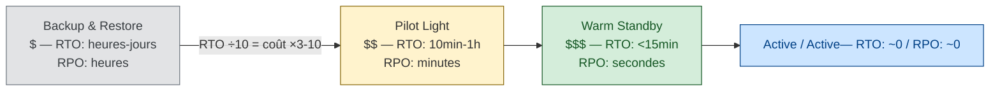

# Disaster Recovery — RTO / RPO

> **Sources** :
> - [AWS — Establishing RPO/RTO Targets for Cloud Applications](https://aws.amazon.com/blogs/mt/establishing-rpo-and-rto-targets-for-cloud-applications/ "AWS Blog — Establishing RPO/RTO targets for cloud applications")
> - [AWS Whitepaper — Disaster Recovery Options in the Cloud](https://docs.aws.amazon.com/whitepapers/latest/disaster-recovery-workloads-on-aws/disaster-recovery-options-in-the-cloud.html "AWS Whitepaper — Disaster Recovery Options in the Cloud (4 stratégies)")
> - [AWS Well-Architected — Disaster Recovery objectives](https://docs.aws.amazon.com/wellarchitected/latest/reliability-pillar/disaster-recovery-dr-objectives.html "AWS Well-Architected — Reliability, Disaster Recovery Objectives (RTO/RPO)")
> - [Microsoft Azure WAF — Disaster Recovery](https://learn.microsoft.com/en-us/azure/well-architected/reliability/disaster-recovery "Microsoft Azure WAF — Reliability, Disaster Recovery")
> - [Google Cloud — DR Scenarios Planning Guide](https://docs.cloud.google.com/architecture/dr-scenarios-planning-guide)

## Définitions officielles

### RTO — Recovery Time Objective

> *"the maximum acceptable delay between the interruption of service and restoration of service. This determines what is considered an acceptable time window when service is unavailable."* [📖¹](https://docs.aws.amazon.com/wellarchitected/latest/reliability-pillar/disaster-recovery-dr-objectives.html "AWS Well-Architected — Reliability, Disaster Recovery Objectives (RTO/RPO)")
>
> *En français* : le **délai maximum acceptable** entre l'interruption du service et sa restauration. Définit la fenêtre d'indisponibilité qu'on peut se permettre.

C'est un **maximum** pour un *single event*, **pas une moyenne**. Différence avec MTTR :
- **MTTR** = moyenne mesurée sur N événements historiques
- **RTO** = engagement cible sur un événement futur

### RPO — Recovery Point Objective

> *"the maximum acceptable amount of time since the last data recovery point. This determines what is considered an acceptable loss of data."* [📖¹](https://docs.aws.amazon.com/wellarchitected/latest/reliability-pillar/disaster-recovery-dr-objectives.html "AWS Well-Architected — Reliability, Disaster Recovery Objectives (RTO/RPO)")
>
> *En français* : la **quantité maximum de temps** entre la dernière sauvegarde saine et l'incident. Définit la **perte de données acceptable**.

### Schéma mental

### DR vs disponibilité normale

Azure précise :

> *"Disaster recovery covers single major events (natural disasters, large-scale failures, attacks) — distinct from 'normal' availability which handles recurring small incidents."*
> ⚠️ **Citation Microsoft Azure** — formulation cohérente mais à vérifier verbatim dans la page actuelle (la doc Azure évolue régulièrement)
>
> *En français* : le **disaster recovery** couvre les événements **majeurs et ponctuels** (catastrophes naturelles, pannes à grande échelle, attaques) — à distinguer de la disponibilité normale, qui gère les petits incidents récurrents.

| | DR | Disponibilité normale |
|---|----|----------------------|
| Type d'événement | Major, rare, géographique | Récurrent, petit |
| Réponse | Plan documenté, drill | Auto-recovery, rolling restart |
| Métrique | RTO/RPO | SLO availability |
| Exemple | Region down, ransomware | Pod OOM, deploy raté |

## Les 4 stratégies AWS

| Stratégie | RTO | RPO | Coût | Quand l'utiliser |
|-----------|-----|-----|------|------------------|
| **Backup & Restore** | Heures à jours | Heures | $ | Workloads non critiques, conformité basique |
| **Pilot Light** | 10 min - 1h | Minutes | $$ | Infra core pré-déployée, app servers éteints |
| **Warm Standby** | Minutes (< 15 min) | Secondes | $$$ | Infra complète réduite, scale-up au failover |
| **Multi-site Active/Active** | Secondes (~0) | ~0 | $$$$ | Zéro downtime requis, distribué globalement |

### 1. Backup & Restore

- Backups réguliers vers une autre region/cloud
- En cas de désastre : redéploiement complet via IaC + restore data
- ⚠️ Dépend du **control plane cloud** (CloudFormation, Terraform). Si le control plane est lui-même down, le RTO explose.

### 2. Pilot Light

- Données répliquées en continu (RDS cross-region, Aurora Global, DynamoDB Global Tables)
- Compute core pré-déployé mais **éteint**
- Failover : démarrer les instances + scale up
- RTO : 10 min - 1h selon la taille

### 3. Warm Standby

- Différence avec Pilot Light : l'app **tourne déjà** à capacité réduite (10-20%)
- Le failover = simple **scale-up**
- RTO : minutes
- Coût : ~30-50% de la prod en plus

### 4. Multi-site Active/Active

3 sous-variantes selon la gestion des écritures :

| Sous-variante | Mécanisme | Outils |
|---------------|-----------|--------|
| **Write Global** | 1 seul writer global | Aurora Global DB |
| **Write Local** | Multi-master | DynamoDB Global Tables, Cassandra |
| **Write Partitioned** | Sharding géographique | Custom — chaque user sticky à 1 region |

## Coût vs RTO/RPO — courbe exponentielle

> AWS et Google Cloud convergent : *"smaller RTO and RPO values often mean greater complexity"*.
> ⚠️ **Citation composite** — reformulation qui synthétise les 2 sources. Principe bien établi mais formulation exacte à ajuster.

**Règle pratique** : diviser RTO par 10 multiplie le coût par 3 à 10×, selon l'architecture.

> Microsoft Azure : *"Choose tier of criticality before strategy. Accept that less critical components have longer RTO."*
> ⚠️ **Citation à re-vérifier** — formulation plausible mais à valider dans l'[Azure WAF DR guide](https://learn.microsoft.com/en-us/azure/well-architected/reliability/disaster-recovery "Microsoft Azure WAF — Reliability, Disaster Recovery")

## Data replication : sync vs async

| Mode | Latence | RPO | Failure mode |
|------|---------|-----|--------------|
| **Synchrone** | Haute (attend ACK distant) | 0 (zéro perte) | Une zone lente bloque tout |
| **Asynchrone** | Basse | > 0 (fonction du lag) | Perte de la queue de réplication au crash |

> Azure : *"synchronous across availability zones for high-priority data, asynchronous across regions for lower priority"* ⚠️ principe cohérent, formulation à re-vérifier

Latence intra-AZ < 2 ms permet le sync. Latence inter-region (~50-100 ms) force l'async.

## DR drills — tester avant la catastrophe

> *"A DR plan is only meaningful when validated under realistic conditions."*
>
> *En français* : un **plan DR** n'a de sens que s'il est **validé** dans des conditions réalistes (drill, game day).

### Cadence recommandée

| Type | Description | Fréquence |
|------|-------------|-----------|
| **Tabletop exercises** | Répétition sur papier, role-play | Trimestrielle |
| **Dry-runs non-prod** | Failover complet sur env iso-prod | Semestrielle |
| **Production drills / Game Days** | Failover réel en prod | Annuelle à semestrielle |
| **Surprise game days** | Non annoncés, testent l'oncall | Annuelle |

### Tester le **failback** aussi

Azure insiste : tester le **failback** comme processus distinct du failover. C'est souvent là que ça casse — le retour à l'état nominal après un failover est complexe (synchroniser les data écrites pendant le failover, revalider l'état, repointer les clients).

## Lien DR ↔ SLO

DR est le cas limite de la disponibilité long terme.

**Exemple** : SLO annuel = 99.95% (4h 22 min d'indispo/an). Un seul incident DR de 4 h consomme **~100% du budget** d'erreur de l'année.

Tiers typiques :
- **Tier 1** (mission-critical) : RTO < 15 min → Warm Standby ou Active/Active
- **Tier 2** : RTO < 4 h → Pilot Light acceptable
- **Tier 3** : RTO < 24 h → Backup & Restore suffit

## Règle 3-2-1 pour les backups

Standard industrie (origine : US-CERT / Peter Krogh *DAM Book*, popularisé par [Veeam — *3-2-1-1-0 backup rule*](https://www.veeam.com/blog/321-backup-rule.html)) :

- **3** copies des données
- sur **2** médias différents
- dont **1** off-site (ou off-line, ou immutable)

Extension moderne **[3-2-1-1-0](https://www.veeam.com/blog/321-backup-rule.html)** :
- **+1** copie air-gapped / immutable (ransomware-proof)
- **0** erreurs après test de restore

> Azure : *"Regularly test restores to validate backups."* ⚠️ principe central de l'Azure WAF, formulation exacte à re-vérifier Un backup jamais restauré n'est pas un backup, c'est un vœu pieux.

## Region failover et dépendances cachées

**Piège classique** : un service dépend silencieusement d'une région.

Exemples :
- Logs vers S3 us-east-1
- Secrets dans Parameter Store us-east-1
- Wiki interne hosted dans la region qui tombe → **plus de runbook**
- DNS gestion via Route 53 (qui a des endpoints régionaux)
- Container registry mono-region

**Solution** : identifier ces dépendances via **chaos engineering drills** (simulation d'indisponibilité de region).

## Anti-patterns DR

| Anti-pattern | Conséquence |
|--------------|-------------|
| **Backups jamais testés en restore** | Le jour J : "le backup est corrompu" |
| **RTO/RPO documentés mais jamais mesurés en drill** | Le jour J : "on prend 3× plus de temps" |
| **Dépendance silencieuse** à une région/service unique | Tout casse, alors qu'on pensait avoir de la redondance |
| **Runbook DR stocké dans la region qui tombe** | Personne n'a accès au runbook quand on en a besoin |
| **Pas de failback plan** (ou identique au failover) | Le retour à la normale échoue |
| **Automation DR sans dry-run** | Surprise le jour J — bug dans l'automation jamais testée |
| **Confondre HA et DR** | HA = intra-region, DR = survie inter-region. Différent. |
| **DR = "restore depuis backup S3"** sans calcul RTO | RTO réel découvert > SLA |
| **Pas de runbook explicit** | Improvisation pendant l'incident |
| **DR équipe séparée des devs** | Devs ignorent le plan DR, le construisent pas pour |

## Checklist DR opérationnelle

- [ ] RTO/RPO définis par tier de criticité
- [ ] Stratégie DR choisie et documentée par tier
- [ ] Backups testés en restore tous les mois
- [ ] Drill DR complet exécuté tous les 6 mois
- [ ] Runbook DR stocké dans **un autre** endroit que la region en cause
- [ ] Failback testé tous les 12 mois
- [ ] Dépendances cachées identifiées via chaos drill
- [ ] Région secondary dimensionnée pour la prod (Warm Standby/Active)
- [ ] Réplication data monitored (lag alerté)
- [ ] Plan de communication client en cas de DR

## Lien avec les autres piliers SRE

- **SLO** : DR définit les bornes "long terme" du SLO
- **Chaos engineering** : les game days valident le DR plan
- **Incident management** : un événement DR déclenche une SEV-1
- **Postmortem** : chaque drill DR produit un postmortem
- **Capacity planning** : la region secondary doit être dimensionnée

## 📐 À l'échelle d'une grande organisation

Le RTO/RPO d'un service isolé est insuffisant à l'échelle d'une grande organisation : ce qui compte pour l'utilisateur final est le RTO/RPO **de la chaîne** qui porte son parcours.

- **Composition** — le RTO de chaîne est borné par la **somme** (sériel) ou le **maximum** (parallèle) des RTO des maillons. Un service à RTO = 1h dans une chaîne sérielle de 5 services à RTO = 1h donne un RTO de chaîne ≈ 5h. Voir [`journey-slos-cross-service.md`](journey-slos-cross-service.md).
- **DR par tier** — toutes les chaînes n'ont pas le même RTO/RPO. Une chaîne T1 (transactionnelle critique) exige un DR multi-région ; une chaîne T4 (reporting hebdo) peut tolérer une restauration backup. Voir [`sre-at-scale.md`](sre-at-scale.md) §*Tier de service*.
- **Ownership** — le RTO/RPO de chaîne est porté par un comité cross-team, pas par l'équipe « la plus en aval ». Voir [`service-taxonomy-slo-ownership.md`](service-taxonomy-slo-ownership.md).

## Ressources

Sources primaires :

1. [AWS Well-Architected — DR Objectives](https://docs.aws.amazon.com/wellarchitected/latest/reliability-pillar/disaster-recovery-dr-objectives.html "AWS Well-Architected — Reliability, Disaster Recovery Objectives (RTO/RPO)") — définitions RTO/RPO verbatim
2. [AWS Whitepaper — Disaster Recovery Options in the Cloud](https://docs.aws.amazon.com/whitepapers/latest/disaster-recovery-workloads-on-aws/disaster-recovery-options-in-the-cloud.html "AWS Whitepaper — Disaster Recovery Options in the Cloud (4 stratégies)") — 4 stratégies (Backup, Pilot Light, Warm Standby, Active/Active)
3. [Microsoft Azure WAF — Disaster Recovery](https://learn.microsoft.com/en-us/azure/well-architected/reliability/disaster-recovery "Microsoft Azure WAF — Reliability, Disaster Recovery")

Ressources complémentaires :
- [AWS — Establishing RPO/RTO Targets](https://aws.amazon.com/blogs/mt/establishing-rpo-and-rto-targets-for-cloud-applications/ "AWS Blog — Establishing RPO/RTO targets for cloud applications")
- [Google Cloud — DR Scenarios Planning Guide](https://docs.cloud.google.com/architecture/dr-scenarios-planning-guide)
- [NIST SP 800-34 — Contingency Planning](https://csrc.nist.gov/publications/detail/sp/800-34/rev-1/final) — référence institutionnelle
- [Veeam — 3-2-1-1-0 backup rule](https://www.veeam.com/blog/321-backup-rule.html)
