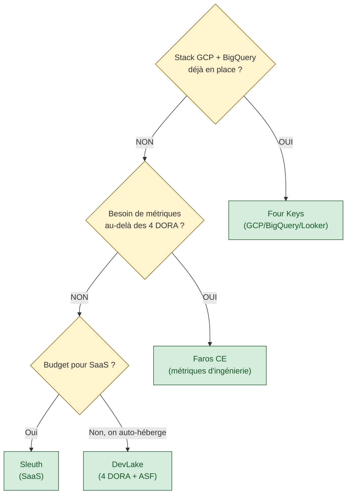

# Outillage DORA — DevLake, Four Keys, Faros, Sleuth

> **Sources primaires** :
> - [Apache DevLake (incubating)](https://devlake.apache.org/ "Apache DevLake — plateforme DORA + DevOps metrics (ASF Incubation)") — ASF Incubation, plateforme agrège 20+ outils DevOps
> - [Google Four Keys](https://github.com/dora-team/fourkeys "Google Four Keys — implémentation officielle DORA par Google Cloud") — implémentation officielle Google Cloud (GCP/BigQuery)
> - [Faros AI Community Edition](https://github.com/faros-ai/faros-community-edition "Faros AI Community Edition — plateforme DORA open source") — alternative open source (auto-hébergée)
> - [Sleuth](https://www.sleuth.io/ "Sleuth — outil DORA commercial (SaaS)") — outil SaaS commercial, cité pour comparaison
> - [DORA research](https://dora.dev/research/ "DORA research (Google Cloud) — 4 key DevOps metrics") — la spec des 4 métriques que ces outils implémentent

Ce guide documente les outils open source qui calculent les 4 métriques DORA (Deployment Frequency, Lead Time for Changes, Change Failure Rate, Time to Restore) à partir des sources de vérité (Git, CI/CD, Jira, postmortems). Il répond à : *comment éviter d'écrire soi-même des scrapers Python + Pushgateway pour suivre les DORA metrics de ses services ?*

---

## Pourquoi un outillage dédié

DORA définit **quoi** mesurer [📖¹](https://dora.dev/research/ "DORA research (Google Cloud) — 4 key DevOps metrics") mais pas **comment** agréger les données. Une équipe qui implémente les 4 métriques elle-même doit écrire :

- un scraper GitLab / GitHub pour extraire les tags de version → Deployment Frequency
- un calcul `commit → tag` pour Lead Time for Changes
- un scraper des jobs CI/CD pour détecter les rollbacks → Change Failure Rate
- un parser de postmortems pour extraire les timelines → Time to Restore
- une base de stockage (time-series ou SQL)
- des dashboards Grafana ou équivalent

À la main : **5 à 10 jours d'ingénierie** côté SRE + maintenance continue. Les outils ci-dessous **suppriment ce code** en l'industrialisant.

---

## Panorama des outils

| Outil | Statut / Maintien | Stack | Sources supportées | Stockage |
|---|---|---|---|---|
| **Apache DevLake** | ASF Incubation, actif (3k stars, v1.0+) | Go + MySQL/PostgreSQL + Grafana | GitLab, GitHub, Bitbucket, Jenkins, Jira, SonarQube, TAPD, Azure DevOps, CircleCI, Jira Cloud, GitHub Actions, TeamCity, + ~20 autres | MySQL ou PostgreSQL |
| **Google Four Keys** | Google Cloud officiel, archivage partiel (activité ralentie depuis 2023) | Python + Cloud Run + BigQuery + Looker Studio | GitHub, GitLab (webhooks) | BigQuery |
| **Faros AI CE** | Commercial avec Community Edition OSS, maintenu | TypeScript + PostgreSQL + Metabase | GitHub, GitLab, Jenkins, PagerDuty, ... | PostgreSQL |
| **Sleuth** | SaaS commercial | — | GitHub, GitLab, Jira, PagerDuty | Hosted |

---

## DevLake en détail

### Architecture

Six composants dans le même déploiement :

- **API Server** — expose l'API REST de configuration et de lecture
- **Config UI** — interface web pour configurer les connexions aux sources
- **Runner** — exécute les *pipelines d'ingestion* (extraction → transformation → load)
- **Database** — stocke trois couches : raw (JSON API), tool (schéma par outil), domain (unifié pour GitLab+GitHub+...)
- **Plugins** — un plugin par source de données (GitLab, GitHub, Jira, …)
- **Grafana** — UI de visualisation des dashboards DORA

### Format de déploiement

- **Kubernetes** : Helm chart officiel (`apache/devlake` — `helm repo add devlake https://apache.github.io/incubator-devlake-helm-chart`)
- **Docker Compose** : `docker-compose.yml` officiel pour POC / single-node
- **Bare metal** : binaires Go + MySQL externe

### Plugin GitLab — 4 métriques DORA natives

Le plugin GitLab de DevLake ingère :

- repositories, branches, tags
- commits (avec auteur, timestamp, message)
- merge requests (MR state, reviewer, timing)
- pipelines + jobs + deployments
- issues

Et expose **les 4 métriques DORA automatiquement** via les dashboards Grafana pré-construits :

- **DORA — Deployment Frequency** → déduit des deployments GitLab ou des tags (configurable)
- **DORA — Lead Time for Changes** → timing premier commit MR → deployment
- **DORA — Change Failure Rate** → ratio deployments suivis de rollback / incidents
- **DORA — Median Time to Restore Service** → durée incident → résolution (source Jira ou PagerDuty ou issues GitLab)

### Compatibilité GitLab

- GitLab Cloud (gitlab.com)
- GitLab Community Edition 11+ (self-hosted)
- Token d'authentification : PAT GitLab avec scopes `read_api, read_repository`

### Stockage

DevLake supporte **MySQL** et **PostgreSQL** (depuis v0.11). Pour un cluster K8s qui n'a pas encore de DB partagée pour les outillages internes, c'est le composant qui demande un provisionnement de DB managée (procédure interne à votre organisation, souvent un ticket plateforme/SRE).

### Licence

Apache 2.0 (projet Apache Software Foundation, incubation).

---

## Four Keys — spécificité Google Cloud

[Four Keys](https://github.com/dora-team/fourkeys "Google Four Keys — implémentation officielle DORA par Google Cloud") est l'implémentation officielle Google Cloud des 4 DORA metrics. Elle a deux caractéristiques fortes :

- **Stack GCP-native** : Cloud Run + BigQuery + Looker Studio. Adaptation non triviale à une stack on-premise.
- **Activité réduite** : dernier commit significatif courant 2023, non archivé mais peu de PRs mergées depuis. Statut de référence plutôt que de runtime actif.

**Quand Four Keys est pertinent** : organisation qui utilise déjà GCP et BigQuery pour l'analytics et qui peut recevoir les webhooks GitHub/GitLab. Sinon, DevLake est plus portable.

---

## Faros AI Community Edition

[Faros AI CE](https://github.com/faros-ai/faros-community-edition "Faros AI Community Edition — plateforme DORA open source") est la version OSS d'un produit commercial. Différences avec DevLake :

- **UI** — Metabase (DevLake = Grafana)
- **Scope** — au-delà des 4 DORA, inclut des *engineering analytics* plus larges (productivity, quality, cost)
- **Communauté** — plus restreinte que DevLake, projet commercial derrière

Intéressant pour qui cherche une plateforme de métriques d'ingénierie plus large que les 4 DORA.

---

## Comment choisir

### Raccourci par profil

- **Écosystème K8s on-premise + Prometheus/Grafana** → **DevLake**
- **Écosystème GCP + BigQuery** → Four Keys
- **Besoin d'analytics d'ingénierie plus large que DORA** → Faros CE
- **Budget SaaS, tolérance au vendor lock-in** → Sleuth / LinearB / Swarmia

---

## Anti-patterns

### 1. Écrire ses propres scrapers Python + Pushgateway

C'est ce que beaucoup d'équipes commencent par faire (scrapers maison). L'effort est sous-estimé : il faut maintenir les scrapers, gérer les schémas de données GitLab qui changent, couvrir les edge-cases (tags mal formés, postmortems vides). DevLake le fait pour vous avec 196 contributeurs.

### 2. Confondre les 4 DORA avec *"toutes les métriques DevOps"*

DORA = **4 métriques précises** [📖¹](https://dora.dev/research/ "DORA research (Google Cloud) — 4 key DevOps metrics"). Ajouter *pipeline duration*, *test flakiness*, *code coverage*, *rollback rate* à votre dashboard DORA les dilue. Ces indicateurs sont utiles mais **ne sont pas DORA**. Les documenter dans un dashboard à part.

### 3. Utiliser DORA comme KPI individuel

Le SRE book ch. 15 (*Postmortem Culture*) insiste : les métriques de performance d'équipe ne doivent **jamais** être utilisées pour évaluer individuellement. *"Accelerate"* (Forsgren, Humble, Kim) confirme : DORA mesure un **système** (équipe + outillage + processus), pas une personne.

---

## 📐 À l'échelle d'une grande organisation

Les 4 DORA metrics (deployment frequency, lead time, MTTR, change failure rate) sont définies *par équipe livrant un service*. À l'échelle, deux extensions sont nécessaires :

- **Agrégation par chaîne** — la performance perçue par l'utilisateur dépend de la chaîne. Un MTTR moyen équipe de 30 min sur 5 maillons sériels donne un MTTR de chaîne potentiellement plus élevé selon les corrélations. Agréger les DORA par chaîne (somme/max selon la métrique) est plus représentatif que par équipe isolée. Voir [`journey-slos-cross-service.md`](journey-slos-cross-service.md).
- **Bench inter-équipes pondéré par tier** — comparer les DORA de toutes les équipes uniformément est faux. Les équipes T1 (chaîne critique) ne devraient pas être comparées à T4 sur la même grille — leurs cibles sont différentes. Voir [`sre-at-scale.md`](sre-at-scale.md).
- **DORA pour les services techniques foundational** — le bus, l'auth, le service de gestion documentaire ont leur propre cycle DORA, à mesurer mais pas à comparer aux services métier (cycles, contraintes, releases différentes). Voir [`service-taxonomy-slo-ownership.md`](service-taxonomy-slo-ownership.md).

## Ressources

Sources primaires :

1. [DORA research (Google Cloud)](https://dora.dev/research/ "DORA research (Google Cloud) — 4 key DevOps metrics") — définition des 4 métriques, State of DevOps Report annuel
2. [*Accelerate* (Forsgren, Humble, Kim)](https://itrevolution.com/product/accelerate/ "Accelerate — Forsgren, Humble, Kim (IT Revolution)") — livre fondateur qui présente les 4 métriques et la méthodologie DORA

Outillage (documentation officielle) :

3. [Apache DevLake](https://devlake.apache.org/ "Apache DevLake — plateforme DORA + DevOps metrics (ASF Incubation)") — site officiel + docs
4. [DevLake — GitHub](https://github.com/apache/incubator-devlake "Apache DevLake — GitHub (ASF Incubation)") — code source et Helm chart
5. [DevLake — Plugin GitLab](https://devlake.apache.org/docs/Plugins/gitlab "Apache DevLake — Plugin GitLab, configuration et métriques DORA") — configuration plugin GitLab
6. [Google Four Keys](https://github.com/dora-team/fourkeys "Google Four Keys — implémentation officielle DORA par Google Cloud") — repo officiel
7. [Faros AI Community Edition](https://github.com/faros-ai/faros-community-edition "Faros AI Community Edition — plateforme DORA open source") — repo OSS
8. [Sleuth](https://www.sleuth.io/ "Sleuth — outil DORA commercial (SaaS)") — alternative commerciale

Voir aussi [`cicd-sre-link.md`](cicd-sre-link.md) pour la définition des 4 DORA metrics et [`mtbf-mttr.md`](mtbf-mttr.md) pour MTTR spécifiquement.
