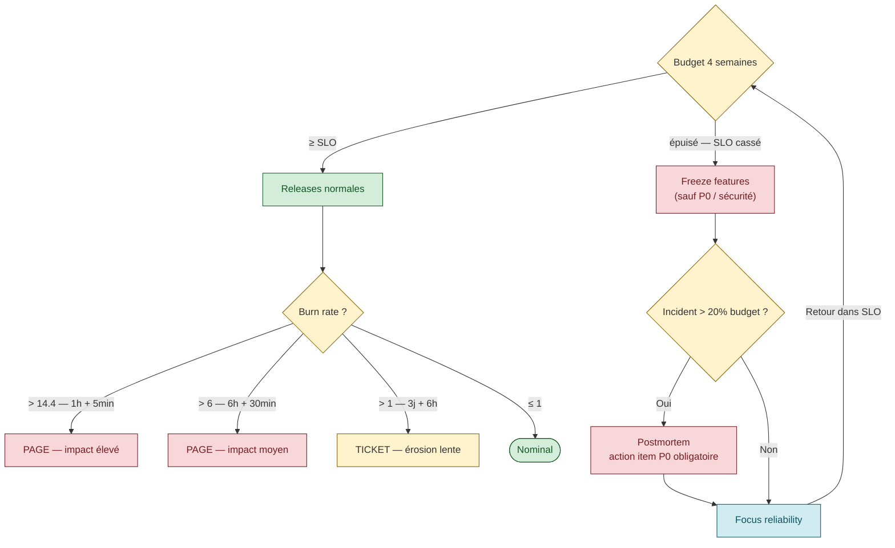

# Error Budget — le mécanisme qui résout le conflit dev ↔ ops

> **Sources primaires** :
> - Google SRE book ch. 3, [*Embracing Risk*](https://sre.google/sre-book/embracing-risk/ "Google SRE book ch. 3 — Embracing Risk")
> - Google SRE workbook, [*Implementing SLOs*](https://sre.google/workbook/implementing-slos/ "Google SRE workbook — Implementing SLOs (Steven Thurgood)")
> - Google SRE workbook, [*Error Budget Policy*](https://sre.google/workbook/error-budget-policy/ "Google SRE workbook — Error Budget Policy (Steven Thurgood, 2018)") (Steven Thurgood, 2018-02-19)
> - Google SRE workbook, [*Alerting on SLOs*](https://sre.google/workbook/alerting-on-slos/ "Google SRE workbook — Alerting on SLOs (burn rate alerting)")

## Définition

> *"the 'budget' of how much 'unreliability' is remaining for the quarter"* [📖¹](https://sre.google/sre-book/embracing-risk/#forming-your-error-budget "Google SRE book ch. 3 — Embracing Risk, section Forming Your Error Budget")
>
> *En français* : le **« budget »** d'indisponibilité (*unreliability*) qui reste pour le trimestre.

Formule fondamentale :

```
Error Budget = 1 − SLO
```

C'est le pourcentage (et le volume) de défaillance qu'on a le droit d'avoir sur une fenêtre donnée **sans casser le SLO**.

## Exemples chiffrés

### Exemple 1 — service web (Google SRE workbook)

Hypothèses (exemple officiel Workbook [📖²](https://sre.google/workbook/implementing-slos/#what-to-measure-using-slis "Google SRE workbook — Implementing SLOs, section What to Measure Using SLIs")) :
- SLO : 99.9% de requêtes en succès
- Volume : 3 000 000 de requêtes sur 4 semaines

Calcul :
```
Budget = (1 − 0.999) × 3 000 000 = 3 000 erreurs sur 4 semaines
```

> *"If a single outage is responsible for 1,500 errors, that error costs 50% of the error budget."* [📖²](https://sre.google/workbook/implementing-slos/#what-to-measure-using-slis "Google SRE workbook — Implementing SLOs, section What to Measure Using SLIs")
>
> *En français* : Si une seule panne est responsable de 1 500 erreurs, cette panne coûte 50 % du budget d'erreur total.

### Exemple 2 — disponibilité temps

Hypothèses :
- SLO : 99.95% de disponibilité
- Fenêtre : 4 semaines (= 40 320 minutes)

Calcul :
```
Budget = 0.0005 × 40 320 = 20 minutes d'indispo permises sur 4 semaines
```

Si vous prenez une panne de 12 minutes mardi → il vous reste 8 minutes pour les 3 semaines suivantes.

*Calcul arithmétique dérivé de la formule `1 − SLO` — aucune source externe nécessaire.*

## La mécanique d'arbitrage feature velocity ↔ stability

Le SRE book ch. 3 expose les *"two populations of concerns"* dans la section *Motivation for Error Budgets* [📖³](https://sre.google/sre-book/embracing-risk/#motivation-for-error-budgets "Google SRE book ch. 3 — Embracing Risk, section Motivation for Error Budgets") :

| Acteur | Incentive principal |
|--------|---------------------|
| **Product Development** | *"evaluated on product velocity, which creates an incentive to push new code as quickly as possible"* [📖³](https://sre.google/sre-book/embracing-risk/#motivation-for-error-budgets "Google SRE book ch. 3 — Embracing Risk, section Motivation for Error Budgets") |
| **SRE** | *"evaluated based upon reliability of a service, which implies an incentive to push back against a high rate of change"* [📖³](https://sre.google/sre-book/embracing-risk/#motivation-for-error-budgets "Google SRE book ch. 3 — Embracing Risk, section Motivation for Error Budgets") |

Sans error budget, ces deux populations se battent en permanence (les ops bloquent les releases, les devs forcent les releases).

**Avec error budget**, la règle devient mécanique [📖⁴](https://sre.google/sre-book/embracing-risk/#benefits "Google SRE book ch. 3 — Embracing Risk, section Benefits") :

> *"as long as the system's SLOs are met, releases can continue. If SLO violations occur frequently enough to expend the error budget, releases are temporarily halted while additional resources are invested in system testing."*
>
> *En français* : tant que les SLO du système sont tenus, on peut continuer à déployer. Si les violations de SLO consomment le budget d'erreur, on gèle les releases et on réinvestit l'effort en tests et en fiabilité.

Et le **point génial** [📖⁴](https://sre.google/sre-book/embracing-risk/#benefits "Google SRE book ch. 3 — Embracing Risk, section Benefits") :

> Quand le budget est plein, les devs sont **encouragés** à prendre des risques. Quand il devient bas, *"the product developers themselves will push for more testing or slower push velocity"* — l'incitation s'inverse d'elle-même.

C'est ça le coup de génie SRE : on n'a plus besoin que les ops bloquent les devs, **les devs s'auto-régulent**.

## Error Budget Policy — formaliser qui décide quoi

Une *policy* écrit noir sur blanc ce qui se passe dans les 4 cas possibles :

| Situation | Action |
|-----------|--------|
| Budget OK, SLO OK | Releases continuent normalement |
| Budget bas (warning) | Slow down, tests renforcés |
| Budget consommé (SLO cassé sur fenêtre) | Freeze des features non-critiques |
| Incident > X% du budget en une fois | Postmortem obligatoire avec action items P0 |

> ⚠️ **Ce tableau synthétique** est une interprétation cohérente avec l'exemple *Game Service* de la policy Workbook (voir ci-dessous), mais pas un tableau littéral du SRE book ou du workbook. Pattern largement accepté dans la littérature SRE.

### Exemple de policy fournie par le Workbook

> Source officielle : [Google SRE workbook — Error Budget Policy](https://sre.google/workbook/error-budget-policy/ "Google SRE workbook — Error Budget Policy (Steven Thurgood, 2018)")
> Auteur : Steven Thurgood, 2018-02-19 (approbation Betsy Beyer 2018-02-20)

L'exemple *"Game Service"* du Workbook [📖⁵](https://sre.google/workbook/error-budget-policy/ "Google SRE workbook — Error Budget Policy (Steven Thurgood, 2018)") :

```
Si le service est à ≥ son SLO :
    → Releases (y compris data changes) procèdent selon la release policy normale.

Si le service a excédé son budget sur les 4 semaines glissantes :
    → Halt de TOUS les changements et releases sauf P0 ou security fixes,
      jusqu'au retour dans le SLO.

Seuil postmortem obligatoire :
    → Si un seul incident consomme > 20% du budget sur 4 semaines,
      l'équipe DOIT conduire un postmortem.
    → Le postmortem DOIT contenir au moins une action item P0
      pour traiter la cause racine.

Escalation :
    → En cas de désaccord entre devs et SRE, l'issue remonte au CTO.
```

### Synthèse décisionnelle — Error Budget Policy



### Distinction "cause externe vs cause interne"

La policy précise les cas où l'équipe **doit** focus reliability vs les cas où elle **peut continuer les features** [📖⁵](https://sre.google/workbook/error-budget-policy/ "Google SRE workbook — Error Budget Policy (Steven Thurgood, 2018)") :

- **Cause hors équipe** (panne réseau corporate, service d'une autre équipe, utilisateurs hors scope type load-tests/pen-tests, erreurs mal catégorisées sans impact utilisateur) : la policy peut **autoriser** la poursuite des features tout en investiguant
- **Cause interne** (bug code, erreur procédurale, dépendance durcissable révélée au postmortem) : focus reliability **imposé**

Cette nuance évite que l'équipe soit punie pour des incidents qu'elle ne pouvait pas prévenir.

## Budget burn rate

Source : [Google SRE workbook — Alerting on SLOs](https://sre.google/workbook/alerting-on-slos/ "Google SRE workbook — Alerting on SLOs (burn rate alerting)") [📖⁶](https://sre.google/workbook/alerting-on-slos/ "Google SRE workbook — Alerting on SLOs (burn rate alerting)")

Le **burn rate** est le **multiplicateur** de consommation du budget par rapport au taux nominal.

Définition :
```
Burn rate = (taux d'erreur observé) / (taux d'erreur permis par le SLO)
```

Exemples avec un SLO 99.9% (taux d'erreur permis = 0.1%) — tirés de la Table 5-4 du Workbook [📖⁶](https://sre.google/workbook/alerting-on-slos/ "Google SRE workbook — Alerting on SLOs (burn rate alerting)") :

| Burn rate | Error rate observé | Temps d'épuisement du budget mensuel |
|-----------|-------------------|---------------------------------------|
| **1** (nominal) | 0.1% | 30 jours (vous consommez exactement le budget) |
| **2** | 0.2% | 15 jours |
| **10** | 1% | 3 jours |
| **100** | 10% | 7.2 heures |
| **1 000** | 100% | **43 minutes** |

### Pourquoi le burn rate est plus utile qu'une alerte sur le SLO direct

**Anti-pattern** — Approach 1 *"Target Error Rate ≥ SLO Threshold"* critiquée par le Workbook [📖⁶](https://sre.google/workbook/alerting-on-slos/ "Google SRE workbook — Alerting on SLOs (burn rate alerting)") : quand vous recevez l'alerte, c'est trop tard, vous avez déjà 100% consommé le budget (*"up to 144 alerts per day"* selon les mesures Google).

**Pattern correct** : pager quand le burn rate est assez élevé pour que le budget **va être** consommé bientôt, **avant** qu'il le soit.

## Multi-window multi-burn-rate alerting

Source : Workbook *Alerting on SLOs*, Table 5-8 [📖⁶](https://sre.google/workbook/alerting-on-slos/ "Google SRE workbook — Alerting on SLOs (burn rate alerting)").

Pour un SLO 99.9%, les seuils recommandés Google :

| Severity | Long window | Short window | Burn rate | % budget consommé pour déclencher |
|----------|-------------|--------------|-----------|-----------------------------------|
| **Page** | 1 heure | 5 minutes | 14.4 | 2% |
| **Page** | 6 heures | 30 minutes | 6 | 5% |
| **Ticket** | 3 jours | 6 heures | 1 | 10% |

Lecture :
- L'alerte Page niveau 1 se déclenche si **les deux fenêtres** (1h et 5min) franchissent burn rate 14.4 — confirmation rapide + résorption rapide quand l'incident est terminé
- L'alerte Page niveau 2 capture les incidents plus longs (6h) qui cumulent à burn rate 6
- Le Ticket capture l'érosion lente (3 jours) à burn rate 1

> *"A good guideline is to make the short window 1/12 the duration of the long window"* [📖⁶](https://sre.google/workbook/alerting-on-slos/ "Google SRE workbook — Alerting on SLOs (burn rate alerting)")
>
> *En français* : une bonne règle est de prendre une fenêtre courte = 1/12 de la fenêtre longue (ex : 1 h / 5 min, 6 h / 30 min, 3 j / 6 h).

C'est-à-dire : 1h → 5 min, 6h → 30 min, 3j → 6h.

## Comment opérationnaliser le budget

### Suivi quotidien

Dashboard avec :
- **% budget restant** sur la fenêtre 4 semaines
- **Burn rate actuel** (sur 1h, 6h, 24h)
- **Time to exhaustion** estimé
- Historique des incidents qui ont consommé du budget (top 5)

### Communication

- **Daily standup** : statut du budget par CUJ
- **Weekly review** : trend du budget, incidents qui ont coûté le plus
- **Monthly reliability review** : ajustement éventuel des SLO, retour sur la policy

### Décisions visibles

Quand un freeze démarre, le **communiquer publiquement** dans le canal de l'équipe et au PM. Sinon les devs continuent à pousser sans savoir.

> ⚠️ **Recommandations opérationnelles non sourcées** — les 3 sous-sections ci-dessus (suivi quotidien / communication / décisions visibles) sont des pratiques d'exploitation cohérentes avec l'esprit SRE mais sans citation directe du SRE book/workbook. Pattern largement répandu dans la communauté SRE (cf. [Datadog SRE guides](https://www.datadoghq.com/blog/error-budget-and-slos/), [Dynatrace SLO docs](https://docs.dynatrace.com/docs/deliver/site-reliability-guardians)) mais à considérer comme conseil pratique plutôt que loi.

## Anti-patterns explicites

| Anti-pattern | Pourquoi c'est mauvais |
|--------------|------------------------|
| **Pas de policy écrite** | Personne ne sait ce qui doit se passer quand le budget est cassé. Décisions au cas par cas, conflits permanents. |
| **Policy imposée par les ops sans accord PM** | Premier conflit = la policy saute. Doit être co-signée. |
| **Punir l'équipe quand le budget est consommé** | Tue la culture blameless. Le budget n'est pas une note de mérite, c'est un outil de pilotage. |
| **Reset du budget arbitraire** | Le budget n'est pas une cagnotte qu'on remet à zéro pour rassurer. C'est une mesure objective. |
| **SLO trop laxe → budget toujours OK** | Aucun arbitrage possible, aucune pression sur la qualité. Reserrer le SLO. |
| **SLO trop strict → budget jamais OK** | Plus aucune release ne passe. Élargir le SLO. |
| **Budget calculé sans baseline historique** | On découvre après coup qu'on est à 200% du budget chaque mois. Faire 1 mois de mesure avant de figer. |
| **Pas d'alerte burn rate** | On découvre l'épuisement à la fin de la fenêtre (trop tard). |
| **Alertes burn rate sans long window** | Faux positifs : un pic de 30s déclenche une page. Toujours combiner long + short window. |

> ⚠️ **Tableau d'anti-patterns consolidé** — la plupart de ces points sont des déductions issues de la pratique SRE (le SRE book/workbook mentionne certains en filigrane mais pas tous en liste). Les points « policy co-signée », « reset arbitraire », « baseline historique » ne sont pas citations directes. Assertion cohérente avec la culture SRE mais considérer comme savoir communautaire.

## Lien avec le CI/CD

Le budget pilote naturellement le pipeline. Patterns :

- **Deployment gate basé sur le budget** : si budget restant < seuil, le pipeline refuse de promouvoir vers prod (sauf override manuel)
- **Canary auto-rollback** : si le canary fait monter le burn rate au-delà d'un seuil, rollback automatique

Détail dans [`cicd-sre-link.md`](cicd-sre-link.md) et [`release-engineering.md`](release-engineering.md).

## Calcul rapide — table de référence

Fenêtre 4 semaines = 40 320 minutes = 2 419 200 secondes.

| SLO | Error budget % | Indispo permise (temps) | Erreurs permises sur 1M req |
|-----|----------------|------------------------|----------------------------|
| 99% | 1% | 6h 43min | 10 000 |
| 99.5% | 0.5% | 3h 21min | 5 000 |
| 99.9% | 0.1% | 40 min | 1 000 |
| 99.95% | 0.05% | 20 min | 500 |
| 99.99% | 0.01% | 4 min | 100 |
| 99.999% | 0.001% | 24 sec | 10 |

*Valeurs arithmétiques dérivées de `window × (1 − SLO)`.*

## Ressources

Sources primaires vérifiées dans ce document :

1. [SRE book ch. 3 — Forming Your Error Budget](https://sre.google/sre-book/embracing-risk/#forming-your-error-budget "Google SRE book ch. 3 — Embracing Risk, section Forming Your Error Budget") — définition canonique
2. [SRE workbook — Implementing SLOs — What to Measure Using SLIs](https://sre.google/workbook/implementing-slos/#what-to-measure-using-slis "Google SRE workbook — Implementing SLOs, section What to Measure Using SLIs") — exemple 3M req, citation « 1,500 errors »
3. [SRE book ch. 3 — Motivation for Error Budgets](https://sre.google/sre-book/embracing-risk/#motivation-for-error-budgets "Google SRE book ch. 3 — Embracing Risk, section Motivation for Error Budgets") — tension dev/ops, citations *product velocity* et *push back against high rate of change*
4. [SRE book ch. 3 — Benefits](https://sre.google/sre-book/embracing-risk/#benefits "Google SRE book ch. 3 — Embracing Risk, section Benefits") — *as long as SLOs are met*, auto-régulation devs
5. [SRE workbook — Error Budget Policy](https://sre.google/workbook/error-budget-policy/ "Google SRE workbook — Error Budget Policy (Steven Thurgood, 2018)") — Game Service example, distinction cause externe/interne, escalation CTO
6. [SRE workbook — Alerting on SLOs](https://sre.google/workbook/alerting-on-slos/ "Google SRE workbook — Alerting on SLOs (burn rate alerting)") — Table 5-4 (burn rate → time to exhaustion), Table 5-8 (multi-window), ratio 1/12, anti-pattern Approach 1

Ressources complémentaires (pratiques non-SRE-book) :
- [Datadog — Error Budgets & SLOs](https://www.datadoghq.com/blog/error-budget-and-slos/)
- [Dynatrace — Site Reliability Guardians](https://docs.dynatrace.com/docs/deliver/site-reliability-guardians)

Voir aussi [`sli-slo-sla.md`](sli-slo-sla.md) pour les fondamentaux, [`monitoring-alerting.md`](monitoring-alerting.md) pour l'alerting, et [`release-engineering.md`](release-engineering.md) pour l'intégration CI/CD.
