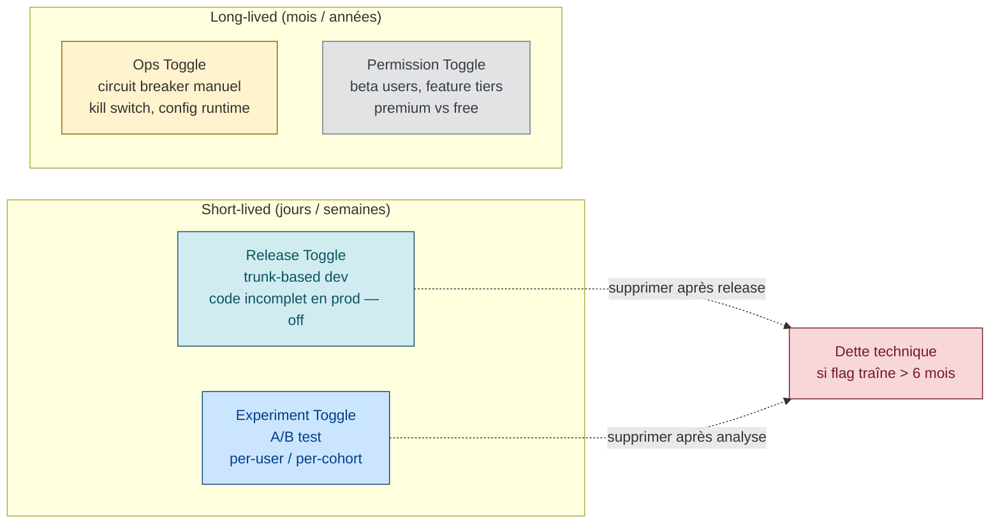

# Feature Flags / Progressive Delivery

> **Sources** :
> - [Martin Fowler / Pete Hodgson — Feature Toggles](https://martinfowler.com/articles/feature-toggles.html "Martin Fowler / Pete Hodgson — Feature Toggles (référence canonique)") — référence canonique
> - [LaunchDarkly — What are feature flags](https://launchdarkly.com/blog/what-are-feature-flags/ "LaunchDarkly — What are feature flags")
> - [LaunchDarkly — Reducing technical debt from feature flags](https://launchdarkly.com/docs/guides/flags/technical-debt)
> - [Unleash — 11 best practices for feature flag systems](https://docs.getunleash.io/guides/feature-flag-best-practices)
> - [Octopus Deploy — 4 types of feature flags](https://octopus.com/devops/feature-flags/)
> - [DevCycle — Managing tech debt](https://docs.devcycle.com/best-practices/tech-debt/)

## Définition

Un **feature flag** (ou *feature toggle*) est un mécanisme qui permet de **changer le comportement d'un système sans changer le code**. Techniquement, c'est une conditionnelle :

```python
if flags.is_enabled("new_checkout"):
    return new_checkout_handler(request)
else:
    return legacy_checkout_handler(request)
```

dont la valeur vient d'une configuration externe (fichier, DB, service SaaS).

### Le principe clé : **isoler la livraison du déploiement**

> *"enable or disable a feature without modifying the source code or requiring a redeploy"* [📖¹](https://launchdarkly.com/blog/what-are-feature-flags/ "LaunchDarkly — What are feature flags")
>
> *En français* : activer ou désactiver une fonctionnalité **sans** modifier le code source ni redéployer.

- On peut **déployer** du code en prod sans **l'activer**
- On peut **activer** une feature à 9h du matin sans **redéployer** à 3h
- On peut **rollback** une feature en 2 secondes
- On peut **A/B tester** sans dupliquer du code

## Les 4 types (Pete Hodgson)



Pete Hodgson classifie les flags selon **2 axes** :
- **Dynamicity** : static (on/off binaire) vs dynamic (per-request)
- **Longevity** : short-lived vs long-lived

Cela donne **4 catégories** :

### 1. Release Toggles

**But** : permettre le **trunk-based development**. Le code incomplet est en prod mais désactivé.

| Caractéristique | Valeur |
|----------------|--------|
| Durée typique | 1-2 semaines |
| Dynamicité | Static (on/off pour une release) |
| Anti-pattern | Toggle qui traîne 6 mois → dette technique |

```python
# Pendant le développement de la nouvelle feature
if flags.is_enabled("new_checkout_v2"):
    return new_checkout_v2()  # incomplet, mais déployé
else:
    return legacy_checkout()
```

Une fois la feature stable et déployée à 100%, **le toggle DOIT être supprimé** + le code legacy avec.

### 2. Experiment Toggles (A/B Testing)

**But** : router un user de manière cohérente vers une variante ou une autre, pour **mesurer statistiquement**.

| Caractéristique | Valeur |
|----------------|--------|
| Durée typique | Heures à semaines (jusqu'à significativité statistique) |
| Dynamicité | Très dynamique (routing par user) |
| Contrainte | Un user donné doit toujours voir la **même variante** pendant toute la durée de l'expérience |

```python
variant = flags.get_variant("checkout_color_test", user_id=user.id)
# variant in ["blue_button", "green_button"]
# Hash consistant : user 12345 verra TOUJOURS "blue_button"
return render_checkout(button_color=variant)
```

### 3. Ops Toggles (kill switches, circuit breakers)

**But** : permettre aux opérateurs de **dégrader gracefully** ou **désactiver** une feature pendant un incident.

| Caractéristique | Valeur |
|----------------|--------|
| Durée | Souvent court-lived, mais **certains sont permanents** |
| Dynamicité | Doit changer **très vite** (redéploiement exclu pendant un incident) |
| Exemple | Couper les recommandations personnalisées si le service ML sature |

```python
def get_recommendations(user):
    if not flags.is_enabled("recommendations_enabled"):
        return get_fallback_static_recommendations()  # dégradation gracieuse
    return ml_service.get_personalized(user)
```

### 4. Permission Toggles (entitlements, beta programs)

**But** : gater une feature par **attribut user** (premium, beta tester, staff, région).

| Caractéristique | Valeur |
|----------------|--------|
| Durée | **Très long** (années). Long-lived **by design** |
| Dynamicité | Très dynamique (décision per-request, per-user) |
| Caveat | Pete Hodgson : pratique du *"Champagne Brunch"* [📖²](https://martinfowler.com/articles/feature-toggles.html "Martin Fowler / Pete Hodgson — Feature Toggles (référence canonique)") — voir une feature à ses propres employés d'abord (*"drink your own champagne"*) |

```python
if user.has_subscription("premium") and flags.is_enabled("advanced_analytics", user=user):
    return render_advanced_analytics()
```

## Lifetime / longevity et dette

### Tableau récapitulatif

| Type | Lifetime | Dette si oublié |
|------|----------|-----------------|
| Release toggle | Court (jours-semaines) | **Élevée** — code conditionnel mort |
| Experiment toggle | Court (semaines) | Élevée |
| Ops toggle | Variable | Faible si bien documenté |
| Permission toggle | Long (années) | Faible |

### Les problèmes documentés du toggle qui ne meurt jamais

- **Code complexity** : chaque toggle = un branch conditionnel. Au-delà de 30 toggles → code illisible avec des dead paths
- **Explosion combinatoire des tests** : tester **toutes** les combinaisons est infaisable
- **Performance** : chaque évaluation de flag a un coût (cache miss, appel réseau)
- **Catastrophe du 6-month-old flag** : toggler un flag de 6 mois en prod est un pari risqué — personne ne sait plus ce que fait le code éteint. (Citation initiale *"a recipe for disaster"* non vérifiée verbatim dans les sources ; principe largement partagé en communauté.) ⚠️

### Solution : règles strictes de cleanup

- **Expiration date + owner obligatoire** à la création
- **Revue mensuelle/trimestrielle** des flags actifs
- **Cleanup ≤ 30 jours après 100% rollout**
- **Time bomb CI** : le build échoue si un flag marqué `obsolete` est encore présent après N jours

## Progressive delivery

### Définition

Terme popularisé par James Governor (RedMonk) en 2018 ([*Towards Progressive Delivery*](https://redmonk.com/jgovernor/2018/08/06/towards-progressive-delivery/ "James Governor (RedMonk) — Towards Progressive Delivery (2018)")) :

**Progressive delivery** = **canary deployment** + **feature flags** + **observabilité + automated analysis**

Concrètement :

1. **Canary ou rolling deployment** : déploiement progressif par lots d'instances
2. **Feature flags** : contrôler finement qui voit quoi
3. **Observability + automated analysis** : mesurer en continu et **rollback automatique** si régression détectée

### Outils Kubernetes

| Outil | Approche | Particularité |
|-------|---------|---------------|
| **[Argo Rollouts](https://argoproj.github.io/argo-rollouts/ "Argo Rollouts — progressive delivery Kubernetes")** | CRD `Rollout` qui remplace `Deployment` | Supporte blue/green, canary, avec **[AnalysisTemplates](https://argoproj.github.io/argo-rollouts/features/analysis/)** Prometheus/Datadog/Wavefront. Rollback auto si analyse KO |
| **[Flagger](https://flagger.app/ "Flagger — progressive delivery Flux (CNCF)")** ([FluxCD](https://fluxcd.io/ "FluxCD — GitOps toolkit (CNCF)")) | CRD `Canary` qui pilote un service mesh (Istio, Linkerd, App Mesh) | Traffic splitting progressif, analyse via Prometheus, rollback auto |

### Différence avec un canary classique

**Canary classique** : on déploie à 5%, on regarde, on décide manuellement.

**Progressive delivery** : analyse automatisée + rollback automatique basés sur les SLI. **Pas besoin d'humain** pour décider.

## Lien avec les SLO

Un feature flag permet de **protéger le budget d'erreur**.

**Scénario** : une nouvelle feature sort et consomme 50% du budget d'erreur en 2 heures.

| Sans flag | Avec flag |
|-----------|-----------|
| Rollback = redéploiement complet | Kill switch OFF en 5 secondes |
| 15-30 minutes de stress | Diagnostic tranquille post-mortem |
| Tout le code rollback (perte des autres changements) | Seule la feature problématique désactivée |

**C'est pour cette raison qu'un kill switch est considéré comme un pattern SRE de base.** Toute feature non-triviale devrait en avoir un.

## Cohort targeting

Les plateformes modernes (LaunchDarkly, Unleash, Flagsmith, ConfigCat, Azure App Configuration, CloudWatch Evidently) permettent de cibler :

| Critère | Exemple |
|---------|---------|
| **Par % users** | "1% → 5% → 25% → 50% → 100%" (ramping) |
| **Par segment** | beta testers, internal staff, premium, free-tier |
| **Par géographie** | eu-west uniquement, excluant les régions en crise |
| **Par version client** | iOS 17+ uniquement |
| **Par attribut arbitraire** | email domain, tenant_id, company_size |
| **Par hash consistant** | un user reste dans le même bucket entre requêtes (sticky), crucial pour A/B test |

## Kill switches — pattern SRE essentiel

Un **kill switch** est un Ops toggle binaire conçu pour **désactiver immédiatement** une fonctionnalité non critique en cas d'incident.

### Principes

- **Testé en pré-prod** (sinon, le jour où on en a besoin, il ne marche pas)
- **Documenté** (qui l'active, dans quelles conditions, effets de bord)
- **Rapide à activer** : pas de redéploiement, pas de PR, idéalement un bouton dans un dashboard admin
- **Monitoré** : alertes quand il est activé, pour tracer les incidents
- **Owner** : une équipe responsable, sinon il pourrit

### Exemples

- Désactiver les recommandations quand le moteur ML sature
- Désactiver un export PDF lourd quand la queue est pleine
- Désactiver le registration quand l'anti-fraude est down
- Désactiver l'intégration avec un fournisseur externe en panne

## Anti-patterns

| Anti-pattern | Conséquence |
|--------------|-------------|
| **Flags qui ne meurent jamais** | Dead code path, panique quand on touche |
| **Conditions imbriquées** `if (A) { if (B) { if (C) {…} } }` | Explosion combinatoire |
| **Flags non documentés** | Personne ne sait ce qu'ils font → impossible à supprimer |
| **Flags sans owner** | Quand la personne part, le flag devient orphelin |
| **Coupling decision points to logic** | Évaluer le flag partout → brittle |
| **Testing all combinations** | Infaisable. Tester seulement la config prod attendue + le fallback |
| **Pas d'exposure de l'état des flags** | Impossible de savoir quel flag est ON sur quel env → debug difficile |
| **Pas de CI enforcement** | Un flag obsolète reste éternellement |
| **Flag pour tout** | Quotidien : "tu mets ça derrière un flag" → flag inflation |

## Solutions aux anti-patterns

| Problème | Solution |
|----------|----------|
| Flags non doc | **Description obligatoire à la création**, wiki, lien vers ticket |
| Flags sans owner | **Owner obligatoire**, réassignation lors des départs |
| Coupling | **Abstraction** : 1 fonction `should_show_new_checkout(user)` qui encapsule la logique |
| Toggles éternels | **Time bomb CI** : build échoue si flag `obsolete` > N jours |
| Pas d'état visible | **Endpoint admin** qui expose l'état courant des flags |

## Outils SaaS et open-source

| Outil | Type | Force |
|-------|------|-------|
| **[LaunchDarkly](https://launchdarkly.com/blog/what-are-feature-flags/ "LaunchDarkly — What are feature flags")** | SaaS commercial | Le plus mature, riche en intégrations |
| **[Unleash](https://docs.getunleash.io/guides/feature-flag-best-practices)** | OSS + SaaS | Open-source first |
| **[Flagsmith](https://www.flagsmith.com/)** | OSS + SaaS | Self-hostable |
| **[ConfigCat](https://configcat.com/)** | SaaS | Pricing simple |
| **[AWS CloudWatch Evidently](https://docs.aws.amazon.com/AmazonCloudWatch/latest/monitoring/CloudWatch-Evidently.html)** | AWS managed | Intégration AWS native |
| **[Azure App Configuration Feature Management](https://learn.microsoft.com/en-us/azure/azure-app-configuration/concept-feature-management)** | Azure managed | Intégration Azure native |
| **[OpenFeature](https://openfeature.dev/)** | Spec CNCF | Standard vendor-neutral |

## Lien avec les autres piliers SRE

- **Error budget** ([`error-budget.md`](error-budget.md)) : kill switch protège le budget
- **Release engineering** ([`release-engineering.md`](release-engineering.md)) : flags isolent livraison ↔ déploiement
- **Incident management** ([`incident-management.md`](incident-management.md)) : kill switch est l'outil de mitigation rapide
- **Postmortem** ([`postmortem.md`](postmortem.md)) : "kill switch absent" est un fréquent action item
- **CI/CD ↔ SRE** ([`cicd-sre-link.md`](cicd-sre-link.md)) : trunk-based dev rendu possible par les release toggles

## 📐 À l'échelle d'une grande organisation

Les feature flags (FF) introduits service par service produisent rapidement à l'échelle un *flag debt* incontrôlable (centaines de flags morts, conflits, dérive). Trois patterns à appliquer :

- **Plateforme FF mutualisée** — une seule plateforme FF (LaunchDarkly, Unleash auto-hébergé, Flipper, etc.) gérée par une platform team, consommée par toutes les équipes. Voir [`sre-at-scale.md`](sre-at-scale.md) §*Consume vs Build*.
- **Kill-switch coordonnés cross-team** — un kill-switch sur un maillon foundational (auth, paiement, bus) peut casser plusieurs chaînes. Le kill-switch doit avoir un *blast radius* documenté et une procédure d'activation cross-team. Voir [`journey-slos-cross-service.md`](journey-slos-cross-service.md).
- **TTL par flag + sweep périodique** — chaque flag a un *expiration date* (3-6 mois) et un sweep automatisé identifie les flags morts pour suppression. Sans gouvernance, l'inventaire se dégrade en mois.

## Ressources

Sources primaires vérifiées :

1. [LaunchDarkly — What are feature flags](https://launchdarkly.com/blog/what-are-feature-flags/ "LaunchDarkly — What are feature flags") — définition *enable/disable without redeploy*
2. [Martin Fowler / Pete Hodgson — Feature Toggles](https://martinfowler.com/articles/feature-toggles.html "Martin Fowler / Pete Hodgson — Feature Toggles (référence canonique)") — 4 catégories + 2 axes + *Champagne Brunch* vérifiés verbatim
3. [James Governor (RedMonk) — Towards Progressive Delivery, 2018](https://redmonk.com/jgovernor/2018/08/06/towards-progressive-delivery/ "James Governor (RedMonk) — Towards Progressive Delivery (2018)") — origine du terme *Progressive Delivery*

Ressources complémentaires :
- [LaunchDarkly — Technical debt from feature flags](https://launchdarkly.com/docs/guides/flags/technical-debt)
- [Unleash — 11 best practices](https://docs.getunleash.io/guides/feature-flag-best-practices)
- [Octopus Deploy — 4 types of feature flags](https://octopus.com/devops/feature-flags/)
- [DevCycle — Managing tech debt](https://docs.devcycle.com/best-practices/tech-debt/)
- [OpenFeature spec (CNCF)](https://openfeature.dev/)
- [Argo Rollouts](https://argoproj.github.io/argo-rollouts/ "Argo Rollouts — progressive delivery Kubernetes")
- [Flagger](https://flagger.app/ "Flagger — progressive delivery Flux (CNCF)")
