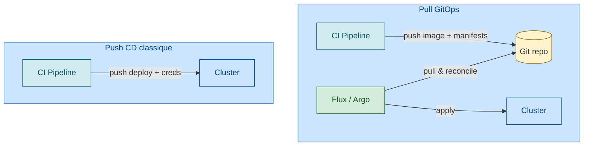

# GitOps — pointer

## Pourquoi une skill séparée

GitOps est une discipline à part entière qui dépasse le cadre SRE :
- A ses propres principes canoniques (4 principes [OpenGitOps](https://opengitops.dev/#principles "OpenGitOps — 4 principes canoniques (CNCF)") [📖¹](https://opengitops.dev/#principles "OpenGitOps — 4 principes canoniques (CNCF)"))
- A son propre écosystème ([FluxCD](https://fluxcd.io/ "FluxCD — GitOps toolkit (CNCF)"), [Argo CD](https://argo-cd.readthedocs.io/ "Argo CD — GitOps continuous delivery"))
- A ses propres défis (secrets management, repo structure, image automation)
- Beaucoup d'équipes utilisent GitOps sans pratiquer le SRE formellement

## Les 4 principes OpenGitOps (v1.0.0)

Source : [OpenGitOps.dev — Principles](https://opengitops.dev/#principles "OpenGitOps — 4 principes canoniques (CNCF)") [📖¹](https://opengitops.dev/#principles "OpenGitOps — 4 principes canoniques (CNCF)")

| # | Principe | Formulation officielle |
|---|----------|-----------------------|
| 1 | **Declarative** | *"A system managed by GitOps must have its desired state expressed declaratively."* |
| 2 | **Versioned and Immutable** | *"Desired state is stored in a way that enforces immutability, versioning and retains a complete version history."* |
| 3 | **Pulled Automatically** | *"Software agents automatically pull the desired state declarations from the source."* |
| 4 | **Continuously Reconciled** | *"Software agents continuously observe actual system state and attempt to apply the desired state."* |

## Lien avec le SRE

GitOps reste **profondément SRE-friendly** :

| Pilier SRE | Apport GitOps |
|-----------|---------------|
| **Toil** ([`toil.md`](toil.md)) | Élimine la promotion manuelle, le drift, l'audit manuel |
| **Release engineering** ([`release-engineering.md`](release-engineering.md)) | Pattern de release déclaratif, rollback = `git revert` |
| **MTTR** | Rollback rapide par revert Git (souvent ~1 min) vs cycle CI complet en push CD classique |
| **Postmortem** ([`postmortem.md`](postmortem.md)) | Audit Git complet pour les RCA |
| **CI/CD ↔ SRE** ([`cicd-sre-link.md`](cicd-sre-link.md)) | Pull-based, agent dans le cluster, pas de credentials côté pipeline |
| **Disaster Recovery** | Le repo Git **est** la source de vérité — reconstruire un cluster = bootstrap Flux/Argo |

> ⚠️ **Chiffres MTTR (1 min vs 30 min)** — ordres de grandeur observés dans la communauté (cf. [Weaveworks GitOps case studies](https://www.weave.works/technologies/gitops/) et [CNCF State of GitOps 2022](https://www.cncf.io/reports/the-voice-of-kubernetes-experts-2022/)) mais pas des valeurs universelles. Dépend fortement du pipeline en place.

## 📐 À l'échelle d'une grande organisation

Le GitOps single-cluster + single-team décrit dans les guides Argo CD / Flux ne tient pas tel quel à l'échelle d'une grande organisation. Trois ajustements :

- **Multi-cluster, multi-tenant** — patterns App-of-Apps (Argo CD), ClusterAPI, FluxCD multi-tenancy. Une instance GitOps centralisée pour des dizaines de clusters et centaines d'équipes. Voir [`sre-at-scale.md`](sre-at-scale.md) §*Plateforme interne*.
- **Multi-stack** — toutes les équipes ne sont pas K8s-native. Le GitOps doit cohabiter avec du déploiement non-GitOps (VM legacy, mainframe, edge). Voir [`multi-stack-observability.md`](multi-stack-observability.md) et [`multi-vendor-abstraction.md`](multi-vendor-abstraction.md).
- **Gouvernance des manifests** — l'inventaire de centaines de repos GitOps exige indexation, scan sécurité, pinning de versions. Voir [`knowledge-indexing-strategy.md`](knowledge-indexing-strategy.md).

## Ressources

Sources primaires vérifiées :

1. [OpenGitOps — Principles v1.0.0](https://opengitops.dev/#principles "OpenGitOps — 4 principes canoniques (CNCF)") — 4 principes canoniques verbatim

Ressources complémentaires :
- [FluxCD](https://fluxcd.io/ "FluxCD — GitOps toolkit (CNCF)")
- [Argo CD](https://argo-cd.readthedocs.io/ "Argo CD — GitOps continuous delivery")
- [CNCF — State of GitOps 2022](https://www.cncf.io/reports/the-voice-of-kubernetes-experts-2022/)
- [Weaveworks — GitOps (Alexis Richardson, 2017)](https://www.weave.works/blog/what-is-gitops-really)
