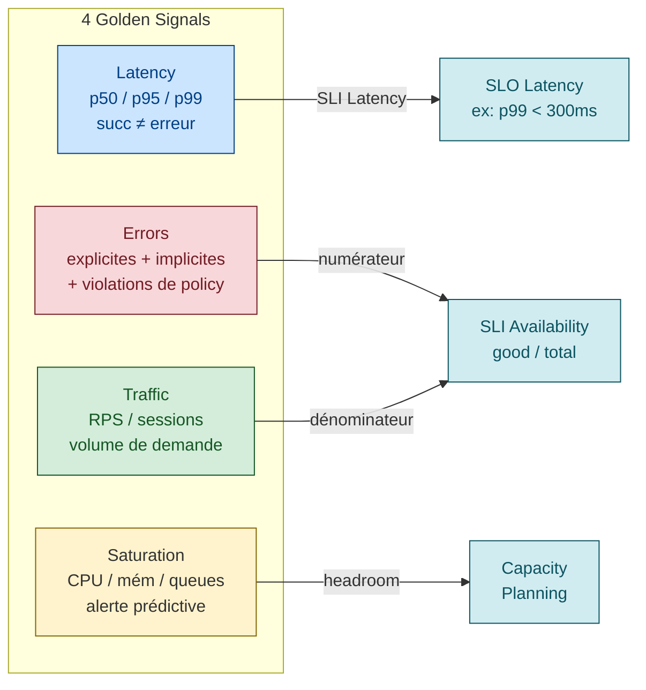

# Les 4 Golden Signals + RED + USE

> **Sources primaires** :
> - Google SRE book ch. 6, [*Monitoring Distributed Systems — The Four Golden Signals*](https://sre.google/sre-book/monitoring-distributed-systems/#xref_monitoring_golden-signals "Google SRE book ch. 6 — Monitoring, section The Four Golden Signals")
> - Tom Wilkie (Grafana Labs), [*The RED Method: How To Instrument Your Services*](https://grafana.com/blog/the-red-method-how-to-instrument-your-services/ "Grafana Labs — The RED Method (Tom Wilkie)") *(précédemment hébergé chez Weaveworks — URL Grafana Labs depuis l'acquisition de Kausal)*
> - Brendan Gregg (Netflix), [*The USE Method*](https://www.brendangregg.com/usemethod.html "Brendan Gregg (Netflix) — The USE Method")
> - Microsoft Azure WAF, [*Operational Excellence — Observability*](https://learn.microsoft.com/en-us/azure/well-architected/operational-excellence/observability)

## Les 4 Golden Signals (Google)



> *"If you measure all four golden signals and page a human when one signal is problematic (or, in the case of saturation, nearly problematic), your service will be at least decently covered by monitoring."* [📖¹](https://sre.google/sre-book/monitoring-distributed-systems/#xref_monitoring_golden-signals "Google SRE book ch. 6 — Monitoring, section The Four Golden Signals")
>
> *En français* : si vous mesurez les 4 signaux d'or et que vous réveillez un humain dès qu'un signal dérive (ou commence à dériver pour la saturation), votre service est **correctement couvert** par son monitoring.

### Latency

**Définition Google** [📖¹](https://sre.google/sre-book/monitoring-distributed-systems/#xref_monitoring_golden-signals "Google SRE book ch. 6 — Monitoring, section The Four Golden Signals") : *"The time it takes to service a request."*

**Subtilité critique** [📖¹](https://sre.google/sre-book/monitoring-distributed-systems/#xref_monitoring_golden-signals "Google SRE book ch. 6 — Monitoring, section The Four Golden Signals") :
> *"It's important to distinguish between the latency of successful requests and the latency of failed requests."*

>
> *En français* : il est critique de **séparer** la latence des requêtes qui réussissent de celle des requêtes en échec (une 500 rapide tire la moyenne vers le bas et masque la panne).
Une 500 rapide a une latence courte, mais c'est une erreur. Si vous mélangez les deux dans un p99, vous êtes aveugle aux pics d'erreurs masqués par leur propre rapidité.

**Comment mesurer** :
- p50, p95, p99, p99.9 (jamais que la moyenne — voir [`sli-slo-sla.md`](sli-slo-sla.md))
- Séparer requêtes succès vs échec
- Séparer par endpoint critique (login, search, checkout)
- Histogrammes (Prometheus `_bucket` [📖²](https://prometheus.io/docs/practices/histograms/ "Prometheus — Practices: Histograms and Summaries"), Datadog distributions)

### Traffic

**Définition Google** [📖¹](https://sre.google/sre-book/monitoring-distributed-systems/#xref_monitoring_golden-signals "Google SRE book ch. 6 — Monitoring, section The Four Golden Signals") : *"A measure of how much demand is being placed on your system, measured in a high-level system-specific metric."*

> *En français* : une mesure de la **demande** placée sur votre système, exprimée dans une métrique de haut niveau adaptée à son type.

Exemples (Google) [📖¹](https://sre.google/sre-book/monitoring-distributed-systems/#xref_monitoring_golden-signals "Google SRE book ch. 6 — Monitoring, section The Four Golden Signals") :
- Web service : HTTP requests / second
- Streaming : network I/O rate ou simultaneous sessions
- Storage : transactions / second ou retrievals / second
- Key-value : transactions / second

**Pourquoi c'est un signal critique** : un drop de traffic peut signifier une panne *upstream* (DNS, LB, CDN) que vos metrics serveur ne voient pas. Une chute de 50% du traffic à 3h du matin pendant un déploiement = symptôme de mauvaise route.

> ⚠️ **Cette remarque sur le « drop de traffic = panne upstream »** est une inférence opérationnelle cohérente avec la philosophie Golden Signals mais pas une citation directe du SRE book ch. 6. Pratique largement partagée dans la communauté SRE.

### Errors

**Définition Google** [📖¹](https://sre.google/sre-book/monitoring-distributed-systems/#xref_monitoring_golden-signals "Google SRE book ch. 6 — Monitoring, section The Four Golden Signals") : *"The rate of requests that fail, either explicitly (e.g., HTTP 500s), implicitly (for example, an HTTP 200 success response, but coupled with the wrong content), or by policy (for example, 'If you committed to one-second response times, any request over one second is an error')."*

> *En français* : le taux de requêtes en échec, qu'il soit **explicite** (HTTP 500), **implicite** (HTTP 200 avec un contenu erroné), ou **par policy** (si vous vous engagez sur 1 s, toute requête > 1 s est une erreur).

3 catégories d'erreurs :
- **Explicit** : HTTP 5xx, gRPC `INTERNAL`, exceptions non gérées
- **Implicit** : HTTP 200 mais payload erroné, résultat partiel
- **Policy** : violation d'un SLA contractuel (p99 > 1s, etc.)

> Les erreurs implicites sont les plus pernicieuses : votre monitoring est vert mais l'utilisateur reçoit du contenu cassé. **Seul un canary blackbox avec validation de payload** détecte ce cas (cf. [`synthetic-monitoring.md`](synthetic-monitoring.md)).

### Saturation

**Définition Google** [📖¹](https://sre.google/sre-book/monitoring-distributed-systems/#xref_monitoring_golden-signals "Google SRE book ch. 6 — Monitoring, section The Four Golden Signals") : *"How 'full' your service is. A measure of your system fraction, emphasizing the resources that are most constrained (e.g., in a memory-constrained system, show memory; in an I/O-constrained system, show I/O)."*

> *En français* : à quel point votre service est **« plein »** — une mesure de l'utilisation de la ressource la plus contrainte (mémoire si la mémoire sature, I/O si l'I/O sature, etc.).

**Subtilité** [📖¹](https://sre.google/sre-book/monitoring-distributed-systems/#xref_monitoring_golden-signals "Google SRE book ch. 6 — Monitoring, section The Four Golden Signals") :
> *"Note that many systems degrade in performance before they achieve 100% utilization, so having a utilization target is essential."*
>
> *En français* : beaucoup de systèmes dégradent leurs performances **bien avant** d'atteindre 100 % d'utilisation — d'où l'intérêt de fixer une cible d'utilisation en-dessous du plafond.

**Comment mesurer** :
- CPU % (mais attention : load average ≠ CPU%)
- Mémoire utilisée
- Disk I/O queue depth
- Connection pool utilization
- Thread pool queue
- Goroutine count (Go) / threads (Java)

Le SRE book souligne [📖¹](https://sre.google/sre-book/monitoring-distributed-systems/#xref_monitoring_golden-signals "Google SRE book ch. 6 — Monitoring, section The Four Golden Signals") :
> *"saturation is also concerned with predictions of impending saturation, such as 'It looks like your database will fill its hard drive in 4 hours.'"*
>
> *En français* : la saturation ne mesure pas seulement le présent — elle doit aussi **prédire** la saturation à venir (ex : *« le disque de ta base va être plein dans 4 heures »*).

Le signal saturation doit **alerter avant** la dégradation, pas après. C'est ce qui le distingue des 3 autres (qui mesurent le présent).

## RED method — Tom Wilkie (services)

| Lettre | Mesure | Équivalent Golden Signals |
|--------|--------|---------------------------|
| **R**ate | requêtes / seconde | = Traffic |
| **E**rrors | requêtes en échec / seconde | = Errors |
| **D**uration | distribution de temps de réponse (histogramme) | = Latency |

**Quand utiliser** : services request/response, microservices. C'est un sous-ensemble simplifié des 4 golden signals (RED = Latency + Traffic + Errors, sans Saturation).

> ⚠️ **Citation « This method specifically tells you how to instrument your microservices... » non retrouvée sur le site officiel actuel** — l'URL historique (Weaveworks) redirige vers un domaine tiers. La formulation est cohérente avec l'esprit de la méthode (cf. [Last9 — Monitoring with RED Method](https://last9.io/blog/monitoring-with-red-method/) et [TheNewStack](https://thenewstack.io/monitoring-microservices-red-method/)), mais à vérifier dans la version Grafana Labs actuelle avant citation verbatim.

Avantage : RED est plus prescriptif que les 4 golden signals — il dit *exactement* ce qu'il faut exposer pour un microservice HTTP/gRPC.

## USE method — Brendan Gregg (ressources)

Définition canonique [📖⁴](https://www.brendangregg.com/usemethod.html "Brendan Gregg (Netflix) — The USE Method") :

> *"For every resource, check utilization, saturation, and errors."*
>
> *En français* : pour **chaque** ressource, vérifier utilization, saturation, et errors.

Définitions exactes de Gregg [📖⁴](https://www.brendangregg.com/usemethod.html "Brendan Gregg (Netflix) — The USE Method") :

| Lettre | Définition officielle |
|--------|----------------------|
| **U**tilization | *"the average time that the resource was busy servicing work"* |
| **S**aturation | *"the degree to which the resource has extra work which it can't service, often queued"* |
| **E**rrors | *"the count of error events"* |

**Quand utiliser** : ressources physiques ou logiques (CPU, RAM, disque, NIC, file descriptors, mutex, threads).

C'est l'approche complémentaire à RED : RED couvre la santé applicative, USE couvre la santé infra.

### Exemples USE concrets

| Ressource | Utilization | Saturation | Errors |
|-----------|-------------|------------|--------|
| CPU | % CPU busy | run queue length, load avg | thermal throttling events |
| Memory | % RAM used | swap used, pages scanned/s | OOM kills |
| Disk I/O | % time disk busy | I/O queue depth | I/O errors |
| Network | bandwidth used / capacity | RX/TX buffer dropped pkts | NIC errors, retries |
| Connection pool | conns used / max | conns waiting | conn timeout |

> ⚠️ **Tableau d'exemples** — inspiré de la [USE Method Checklist Linux](https://www.brendangregg.com/USEmethod/use-linux.html) de Gregg mais reformulé. Les lignes sont cohérentes avec la philosophie USE ; quelques exemples (thermal throttling CPU, OOM kills) sont des interprétations modernes non présentes littéralement dans la checklist 2012.

## Récap — quand utiliser quoi

| Méthodologie | Pour quoi | Mesure |
|-------------|-----------|--------|
| **4 Golden Signals** (Google) | Service end-to-end | Latency + Traffic + Errors + Saturation |
| **RED** (Wilkie) | Microservices HTTP/gRPC | Rate + Errors + Duration |
| **USE** (Gregg) | Ressources (CPU, mem, I/O, ...) | Utilization + Saturation + Errors |

**En pratique** : combiner. RED pour chaque service applicatif, USE pour chaque ressource sous-jacente, et les 4 golden signals comme **vérification** que rien n'est oublié au niveau service global.

## Mapping golden signals → SLI

```
Latency  → SLI Latency (p95, p99 < seuil)
Traffic  → input du calcul de SLI ratio (denominateur)
Errors   → SLI Availability ratio (numerateur de "good events")
Saturation → SLI predictif (capacity headroom)
```

Voir [`sli-slo-sla.md`](sli-slo-sla.md) pour le détail de la dérivation.

## Anti-patterns explicites

| Anti-pattern | Pourquoi c'est mauvais | Source |
|--------------|------------------------|--------|
| **Mesurer la moyenne au lieu des percentiles** | Masque la longue traîne (5% slow requests invisibles) | [SRE book ch. 4 — Aggregation](https://sre.google/sre-book/service-level-objectives/#aggregation "Google SRE book ch. 4 — SLO, section Aggregation (moyennes vs percentiles)") |
| **Mélanger latency succès et erreurs** | Une 500 rapide tire la latency vers le bas, vous loupez la dégradation | [SRE book ch. 6](https://sre.google/sre-book/monitoring-distributed-systems/#xref_monitoring_golden-signals "Google SRE book ch. 6 — Monitoring, section The Four Golden Signals") |
| **Mesurer Errors sans contexte de Traffic** | "0 erreur" peut signifier "0 traffic" — pas un succès | ⚠️ Inférence — pas citation directe |
| **Saturation = 100% comme alerte** | Vos pods crashent avant que vous ayez le temps de réagir. Alerter à 80% / 90%. | [SRE book ch. 6](https://sre.google/sre-book/monitoring-distributed-systems/#xref_monitoring_golden-signals "Google SRE book ch. 6 — Monitoring, section The Four Golden Signals") |
| **USE method appliquée aux services au lieu des ressources** | Ne capture pas l'expérience utilisateur. Utiliser RED. | [Gregg — USE method](https://www.brendangregg.com/usemethod.html "Brendan Gregg (Netflix) — The USE Method") |
| **RED method appliquée aux ressources** | RED est conçu pour les services. Pour les ressources, USE. | [Grafana — RED method](https://grafana.com/blog/the-red-method-how-to-instrument-your-services/ "Grafana Labs — The RED Method (Tom Wilkie)") |
| **4 golden signals "implicites"** (1 dashboard sans label clair) | L'opérateur ne sait pas distinguer les 4 quand ça va mal | ⚠️ Inférence — pas citation directe |

## Implémentation Prometheus / OpenTelemetry

### Pour un service HTTP (RED + golden signals)

```python
# Exemple Python avec prometheus_client
from prometheus_client import Counter, Histogram, Gauge

# RATE + ERRORS — counter par route + status
http_requests_total = Counter(
    'http_requests_total',
    'Total HTTP requests',
    ['method', 'route', 'status_code']
)

# DURATION — histogramme pour percentiles
http_request_duration_seconds = Histogram(
    'http_request_duration_seconds',
    'HTTP request duration',
    ['method', 'route'],
    buckets=(.005, .01, .025, .05, .1, .25, .5, 1, 2.5, 5, 10)
)

# SATURATION — connection pool, thread pool
db_pool_in_use = Gauge('db_pool_in_use', 'DB connections in use')
db_pool_max = Gauge('db_pool_max', 'DB connections max')

# Usage dans un middleware
@app.middleware("http")
async def metrics_middleware(request, call_next):
    start = time.time()
    response = await call_next(request)
    duration = time.time() - start
    http_requests_total.labels(
        method=request.method,
        route=request.url.path,
        status_code=response.status_code
    ).inc()
    http_request_duration_seconds.labels(
        method=request.method,
        route=request.url.path
    ).observe(duration)
    return response
```

*Exemple de code conforme au client Python Prometheus [📖⁵](https://prometheus.github.io/client_python/) et aux bonnes pratiques histogramme [📖²](https://prometheus.io/docs/practices/histograms/ "Prometheus — Practices: Histograms and Summaries").*

### Pour une ressource (USE)

```promql
# CPU utilization
1 - rate(node_cpu_seconds_total{mode="idle"}[5m])

# CPU saturation (run queue length proxy)
node_load1 / count(node_cpu_seconds_total{mode="idle"})

# Memory utilization
1 - (node_memory_MemAvailable_bytes / node_memory_MemTotal_bytes)

# Disk saturation (I/O wait)
rate(node_disk_io_time_seconds_total[5m])
```

*PromQL standard basé sur les métriques de [node_exporter](https://github.com/prometheus/node_exporter) [📖⁶](https://github.com/prometheus/node_exporter).*

## Le piège des dashboards "tableaux de bord noël"

Anti-pattern récurrent : 50 panels sur un dashboard, aucun ne raconte d'histoire. Bonnes pratiques :

1. **1 dashboard = 1 audience** : SRE on-call ≠ dev débuggant ≠ exec
2. **Top-down** : 4 golden signals en haut, drill-down en dessous
3. **Liens entre dashboards** (drill-down clickable)
4. **Annotations sur déploiements** : voir le timing de la dégradation vs la release
5. **Pas de moyennes seules** : toujours percentiles
6. **Couleurs cohérentes** : rouge = mauvais sur tous les dashboards
7. **Légendes lisibles** : pas de `{instance, job, mode, namespace, pod, ...}` qui débordent

> ⚠️ **Bonnes pratiques dashboards** — ces 7 points sont du savoir communautaire (cf. [Grafana dashboard best practices](https://grafana.com/docs/grafana/latest/dashboards/build-dashboards/best-practices/)) mais pas tous dans le SRE book. Pattern largement consensuel dans la communauté observabilité.

## Lien avec les pratiques d'observabilité

Les golden signals sont la **brique de base** du monitoring. L'observabilité moderne (cf. [`observability-vs-monitoring.md`](observability-vs-monitoring.md)) ajoute :
- Distributed tracing (lien entre services) [📖⁷](https://opentelemetry.io/docs/concepts/signals/traces/)
- Wide events (toutes les dimensions, haute cardinalité) [📖⁸](https://www.honeycomb.io/blog/time-to-version-observability)
- Logs structurés corrélés aux traces [📖⁹](https://opentelemetry.io/docs/concepts/signals/logs/)

Mais sans golden signals correctement instrumentés, l'observabilité avancée ne sert à rien : vous ne savez même pas que quelque chose va mal.

## Ressources

Sources primaires vérifiées dans ce document :

1. [SRE book ch. 6 — The Four Golden Signals](https://sre.google/sre-book/monitoring-distributed-systems/#xref_monitoring_golden-signals "Google SRE book ch. 6 — Monitoring, section The Four Golden Signals") — 7 citations verbatim confirmées
2. [Prometheus — Histograms and Summaries](https://prometheus.io/docs/practices/histograms/ "Prometheus — Practices: Histograms and Summaries") — bonnes pratiques buckets
3. [TheNewStack — Monitoring Microservices: The RED Method](https://thenewstack.io/monitoring-microservices-red-method/) — contexte historique 2015 London meetup
4. [Brendan Gregg — The USE Method](https://www.brendangregg.com/usemethod.html "Brendan Gregg (Netflix) — The USE Method") — définition officielle, vocabulaire
5. [Prometheus Python Client](https://prometheus.github.io/client_python/) — Counter, Histogram, Gauge
6. [Prometheus — node_exporter](https://github.com/prometheus/node_exporter) — métriques système PromQL
7. [OpenTelemetry — Traces](https://opentelemetry.io/docs/concepts/signals/traces/)
8. [Honeycomb — Wide events / time to version observability](https://www.honeycomb.io/blog/time-to-version-observability)
9. [OpenTelemetry — Logs](https://opentelemetry.io/docs/concepts/signals/logs/)

Ressources complémentaires :
- [Grafana Labs — The RED Method](https://grafana.com/blog/the-red-method-how-to-instrument-your-services/ "Grafana Labs — The RED Method (Tom Wilkie)") (URL canonique actuelle, ex-Weaveworks)
- [Grafana — Dashboard Best Practices](https://grafana.com/docs/grafana/latest/dashboards/build-dashboards/best-practices/)
- [Microsoft Azure WAF — Observability](https://learn.microsoft.com/en-us/azure/well-architected/operational-excellence/observability)
- [Brendan Gregg — USE Method Linux Checklist](https://www.brendangregg.com/USEmethod/use-linux.html)
