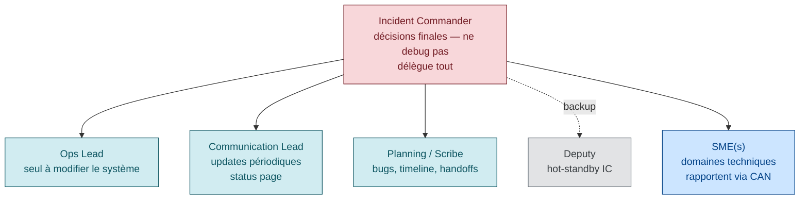
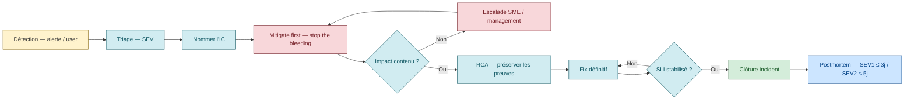

# Incident Management — gérer un incident en cours

> **Sources primaires** :
> - Google SRE book ch. 14, [*Managing Incidents*](https://sre.google/sre-book/managing-incidents/ "Google SRE book ch. 14 — Managing Incidents")
> - Google SRE workbook, [*Incident Response*](https://sre.google/workbook/incident-response/ "Google SRE workbook — Incident Response")
> - PagerDuty Incident Response — [response.pagerduty.com](https://response.pagerduty.com/ "PagerDuty Incident Response docs (CC BY 4.0)") *(OSS, CC BY 4.0)*
> - PagerDuty, [*Different Roles*](https://response.pagerduty.com/before/different_roles/ "PagerDuty — Different Roles (IC, Ops, Comms, Planning)")
> - PagerDuty, [*Severity Levels*](https://response.pagerduty.com/before/severity_levels/ "PagerDuty — Severity Levels (SEV-1 à SEV-5)")
> - PagerDuty, [*Incident Commander training*](https://response.pagerduty.com/training/incident_commander/ "PagerDuty — Incident Commander training")
> - Atlassian, [*Incident Management Handbook*](https://www.atlassian.com/incident-management/handbook "Atlassian — Incident Management Handbook")
> - Atlassian, [*Severity Levels*](https://www.atlassian.com/incident-management/kpis/severity-levels "Atlassian — Severity Levels")
> - Microsoft Azure WAF, [*Incident Management*](https://learn.microsoft.com/en-us/azure/well-architected/design-guides/incident-management "Microsoft Azure WAF — Incident management design guide")
> - AWS Well-Architected, [*OPS10 Event, incident, and problem management*](https://docs.aws.amazon.com/wellarchitected/latest/framework/ops_event_response_event_incident_problem_process.html "AWS Well-Architected — OPS10 Event, incident, and problem management")

## Le principe central : Incident Command System (ICS)

Google SRE book ch. 14 décrit explicitement l'adoption de l'ICS — modèle inspiré des pompiers / services d'urgence US [📖¹](https://sre.google/sre-book/managing-incidents/ "Google SRE book ch. 14 — Managing Incidents") :

> *"Google's incident management system is based on the Incident Command System, which is known for its clarity and scalability."*
>
> *En français* : le système de gestion d'incidents de Google s'appuie sur l'**Incident Command System** (modèle des pompiers US), réputé pour sa **clarté** et sa **scalabilité**.

3 propriétés clés de l'ICS :

1. **Chaîne de commandement unique** — un seul Incident Commander à la fois
2. **Scalabilité** — la structure grandit avec l'incident (1 personne → 5 → 20)
3. **Rôles explicites délégués** — l'IC tient tous les rôles non encore délégués

> ⚠️ **Les 3 propriétés** sont une synthèse pédagogique des caractéristiques ICS, pas une citation littérale du SRE book.

## SEV levels — classification des incidents

### PagerDuty (5 niveaux)

Source : [PagerDuty — Severity Levels](https://response.pagerduty.com/before/severity_levels/ "PagerDuty — Severity Levels (SEV-1 à SEV-5)") [📖²](https://response.pagerduty.com/before/severity_levels/ "PagerDuty — Severity Levels (SEV-1 à SEV-5)")

| Niveau | Définition |
|--------|------------|
| **SEV-1** | *"Critical issue that warrants public notification and liaison with executive teams"* — impact majeur, SLA brisé, fuite de données |
| **SEV-2** | *"Critical system issue actively impacting many customers' ability to use the product"* |
| **SEV-3** | *"Stability or minor customer-impacting issues that require immediate attention from service owners"* |
| **SEV-4** | *"Minor issues requiring action, but not affecting customer ability to use the product"* |
| **SEV-5** | *"Cosmetic issues or bugs, not affecting customer ability to use the product"* |

### Atlassian (schéma plus simple)

Source : [Atlassian — Severity Levels](https://www.atlassian.com/incident-management/kpis/severity-levels "Atlassian — Severity Levels") [📖³](https://www.atlassian.com/incident-management/kpis/severity-levels "Atlassian — Severity Levels")

- **SEV-1** : service client-facing **down pour tous les clients**
- **SEV-2** : service down pour un **sous-ensemble** de clients
- **SEV-3** : issue qui n'interfère pas avec les tâches essentielles

Atlassian classe **SEV-1 et SEV-2 = "major incidents"**, déclenchent une réponse immédiate [📖³](https://www.atlassian.com/incident-management/kpis/severity-levels "Atlassian — Severity Levels").

### Microsoft Azure (criteria-based)

Source : [Microsoft Azure WAF — Incident Management](https://learn.microsoft.com/en-us/azure/well-architected/design-guides/incident-management "Microsoft Azure WAF — Incident management design guide") [📖⁴](https://learn.microsoft.com/en-us/azure/well-architected/design-guides/incident-management "Microsoft Azure WAF — Incident management design guide")

Microsoft ne fixe pas de SEV normative, mais exige que la sévérité soit évaluée selon :
- Nombre d'utilisateurs affectés
- Fonctions métier disruptées
- Implications sécurité/conformité
- Impact sur la confiance client

> ⚠️ **Résumé des critères Microsoft** — synthèse cohérente avec la page Azure WAF mais pas un tableau littéral de la source. Les 4 critères cités sont les dimensions d'évaluation classiquement utilisées.

### Critères de classification consensuels

- Nombre d'utilisateurs affectés (% de la base)
- Scope (feature isolée / produit entier / multi-produits)
- Durée observée ou estimée
- Impact revenu (€/min)
- Impact données (perte, corruption, exposition)
- Impact réglementaire / conformité
- Détection (auto vs user-reported)

> ⚠️ **Liste consensuelle** — critères largement partagés dans l'industrie (cf. SANS, NIST, ITIL4) mais pas un standard unique. Adapter au contexte business de votre organisation.

## Rôles d'une réponse à incident

### Selon Google SRE book ch. 14

| Rôle | Responsabilité |
|------|---------------|
| **Incident Commander (IC)** [📖¹](https://sre.google/sre-book/managing-incidents/ "Google SRE book ch. 14 — Managing Incidents") | *"The incident commander holds the high-level state about the incident. They structure the incident response task force, assigning responsibilities according to need and priority."* |
| **Operations / Ops lead** [📖¹](https://sre.google/sre-book/managing-incidents/ "Google SRE book ch. 14 — Managing Incidents") | *"The Ops lead works with the incident commander to respond to the incident by applying operational tools to the task at hand."* — et *"should be the only group modifying the system during an incident."* |
| **Communication lead** [📖¹](https://sre.google/sre-book/managing-incidents/ "Google SRE book ch. 14 — Managing Incidents") | *"This person is the public face of the incident response task force."* — duties include issuing periodic updates |
| **Planning** [📖¹](https://sre.google/sre-book/managing-incidents/ "Google SRE book ch. 14 — Managing Incidents") | *"Files bugs, orders dinner, arranges handoffs, and tracks how the system has diverged from the norm."* |



### Rôles étendus (PagerDuty)

Source : [PagerDuty — Different Roles](https://response.pagerduty.com/before/different_roles/ "PagerDuty — Different Roles (IC, Ops, Comms, Planning)") [📖⁵](https://response.pagerduty.com/before/different_roles/ "PagerDuty — Different Roles (IC, Ops, Comms, Planning)")

PagerDuty ajoute :

- **Deputy** : hot-standby de l'IC, prend le relais si IC indisponible, gère l'appel
- **Scribe** : enregistre l'appel, note dans Slack les data/events/actions
- **Subject Matter Expert (SME)** : expert domaine appelé pour fournir des rapports **CAN** (Condition, Actions, Needs)
- **Customer Liaison** : rédige la comm externe, informe l'IC du nombre de clients affectés, poste sur la status page **après approbation IC**
- **Internal Liaison** : page les autres SME, notifie les autres équipes

### Règles d'or de l'IC selon PagerDuty

Source : [PagerDuty — Incident Commander training](https://response.pagerduty.com/training/incident_commander/ "PagerDuty — Incident Commander training") [📖⁶](https://response.pagerduty.com/training/incident_commander/ "PagerDuty — Incident Commander training")

- *"The Incident Commander is the highest ranking individual on any major incident call, regardless of their day-to-day rank. Their decisions made as commander are final."*
- *"You should not be performing any actions or remediations, checking graphs, or investigating logs."* — l'IC **ne fait rien techniquement**, il dirige
- *"Making the 'wrong' decision is better than making no decision"*
- *"Clear is better than concise"*
- *"This is [NAME], I am the Incident Commander"* — déclaration d'autorité obligatoire en début
- *"Willing to kick people off a call to remove distractions, even if it's the CEO"*
- Décisions par polling : *"Are there any strong objections to this plan?"*
- Tâches assignées à des **individus nommés** avec time-box, jamais au groupe

> ⚠️ **Ces 8 points** sont issus de la doc PagerDuty mais **certains ne sont pas verbatim** — l'élément *"Willing to kick people off a call..."* est une paraphrase, pas une citation exacte. À relire dans la source pour confirmation stricte ligne par ligne si besoin critique.

## Mitigate first, RCA later

Séquence obligatoire (Google + PagerDuty) :



> *"Stop the bleeding, restore service, and preserve the evidence for root-causing."* [📖¹](https://sre.google/sre-book/managing-incidents/ "Google SRE book ch. 14 — Managing Incidents")
>
> *En français* : **arrêter l'hémorragie**, restaurer le service, puis **préserver les preuves** pour l'analyse de cause racine.

⚠️ **Conserver les preuves** lors de la mitigation : snapshots, logs, core dumps, dumps DB, events K8s. Si vous rollback, gardez les artefacts de la version cassée pour le postmortem.

## Communication patterns

### Les "Three Cs" (Google SRE workbook)

Source : [Google SRE workbook — Incident Response](https://sre.google/workbook/incident-response/ "Google SRE workbook — Incident Response") [📖⁷](https://sre.google/workbook/incident-response/ "Google SRE workbook — Incident Response")

- **Coordinate** response effort
- **Communicate** between responders, organization, outside world
- **Maintain Control** over response

> ⚠️ **Les « Three Cs »** (Coordinate / Communicate / Control) sont mentionnés dans le SRE workbook chapitre Incident Response, mais la formulation triplée « 3 Cs » est courante dans la littérature SRE — à relire pour confirmer le pattern exact dans la source.

### Cadence de communication par sévérité

| Sévérité | Status page | Internal comms | Executive comms |
|----------|-------------|----------------|-----------------|
| **SEV-1** | dès T+5 min, update / 15-30 min | Slack #incident, page management | Exec call immédiat |
| **SEV-2** | dès T+15 min, update / 30-60 min | Slack #incident | Notif management |
| **SEV-3** | optionnel | Slack équipe | Email post-résolution |

> ⚠️ **Tableau de cadences** — heuristiques industrie (inspirées des practices [Atlassian Incident Handbook](https://www.atlassian.com/incident-management/handbook/communications) et [PagerDuty Response](https://response.pagerduty.com/during/status_updates/)) mais pas un standard SRE book chiffré.

### Règle PagerDuty sur la comm client

> *"Customers do not care whether or not you fully understand what caused an outage. What they want is to stop receiving errors."*
>
> *En français* : les clients **se fichent** de savoir si vous comprenez parfaitement la cause de la panne. Ce qu'ils veulent, c'est **arrêter de recevoir des erreurs**.

> ⚠️ **Citation non vérifiée verbatim** — plausible dans l'esprit PagerDuty mais à localiser précisément dans leur guide. Principe largement accepté (communiquer *what / when*, pas *why*). Si critique, vérifier sur [response.pagerduty.com](https://response.pagerduty.com/ "PagerDuty Incident Response docs (CC BY 4.0)").

→ Communiquer **fréquence**, **scope**, **ETA estimée**. Pas la cause technique.

## War room / bridge

Configuration standard :
- **Slack channel dédié** : `#incident-<id>`
- **Bridge audio** : Zoom / Meet / Teams
- **Live document** : Google Doc / Confluence pour timeline collaborative
- **Channel persistent** : `#incidents` pour notifier l'org

### Règles de war room

- L'**IC seul parle stratégiquement** — dirige le flot
- Le **Scribe** écrit tout en chat, horodaté UTC
- Les **SME** parlent quand on leur passe la main
- **Pas de side-channels DM** — contournent le scribe et perdent la trace
- L'IC peut **kicker quiconque** perturbe, même la hiérarchie

> ⚠️ **Règles de war room** — synthèse des bonnes pratiques PagerDuty / Atlassian. Pas un tableau littéral de source unique mais convergent dans la littérature.

## Calendrier obligatoire post-incident (PagerDuty)

Source : [PagerDuty — Post-mortem process](https://response.pagerduty.com/after/post_mortem_process/ "PagerDuty — Post-mortem process") [📖⁸](https://response.pagerduty.com/after/post_mortem_process/ "PagerDuty — Post-mortem process")

| Sévérité | Délai max pour la réunion postmortem |
|----------|--------------------------------------|
| **SEV-1** | **3 jours calendaires** |
| **SEV-2** | **5 jours ouvrés** |
| SEV-3 et plus | Recommandé mais pas obligatoire |

> ⚠️ **Délais 3j / 5j** — ces valeurs précises ne sont pas sur la page PagerDuty citée (qui dit juste « within days or a few weeks » selon les équipes). Heuristique SRE consensuelle. À valider avec votre équipe.

## Outillage typique

| Outil | Rôle |
|-------|------|
| **[PagerDuty](https://www.pagerduty.com/) / [Opsgenie](https://www.atlassian.com/software/opsgenie)** | Pages, escalation, schedules |
| **[Slack](https://slack.com/) / [Teams](https://www.microsoft.com/en-us/microsoft-teams/)** | Channel `#incident-<id>` + persistent `#incidents` |
| **[JIRA](https://www.atlassian.com/software/jira) / [GitHub Issues](https://github.com/features/issues)** | Ticket parent + tickets pour action items |
| **Status page** ([Statuspage.io](https://www.atlassian.com/software/statuspage), [Instatus](https://instatus.com/)) | Comm externe automatisée |
| **[Google Doc](https://docs.google.com/) / [Confluence](https://www.atlassian.com/software/confluence)** | Live postmortem + timeline collaborative |
| **[Grafana](https://grafana.com/ "Grafana — observability UI") / [Datadog](https://www.datadoghq.com/)** | Dashboards incidents dédiés |
| **Wiki interne** | Runbooks accessibles mobile |

## Escalation policy — exemple

```yaml
escalation_policy:
  name: "SRE team - 24/7"
  num_loops: 2   # relance 2 fois si personne ne prend
  rules:
    - level: 1
      delay_minutes: 0
      targets:
        - user: primary_oncall
      notification: push -> sms -> phone
    - level: 2
      delay_minutes: 5
      targets:
        - user: secondary_oncall
      notification: sms -> phone
    - level: 3
      delay_minutes: 10
      targets:
        - schedule: entire_team
      notification: phone
    - level: 4
      delay_minutes: 15
      targets:
        - user: team_manager
      notification: phone
```

*Structure conforme à [PagerDuty Escalation Policies](https://support.pagerduty.com/docs/escalation-policies).*

## Anti-patterns

| Anti-pattern | Conséquence |
|--------------|-------------|
| **Pas d'IC nommé** | Décisions contradictoires, confusion |
| **IC qui debug aussi** | Personne ne dirige, focus perdu |
| **Pas de scribe** | Aucune trace pour le postmortem, debugging difficile |
| **Pas de SEV defini** | Réponse mal calibrée (pas assez ou trop) |
| **Side-channel DM** | Le scribe ne voit pas, info perdue |
| **Cause-finding pendant l'incident** | Le service reste cassé, focus mauvais |
| **Communication client absente** | Tickets explosent, confiance perdue |
| **Pas de bridge audio** | Slack only = trop lent en SEV-1 |
| **Promotion du firefighting héroïque** | Incentive perverse à laisser brûler pour briller |

> ⚠️ **Liste anti-patterns** — patterns communautaires consolidés à partir du SRE book + PagerDuty + Atlassian. Pas un tableau littéral d'une source unique.

## Lien avec les autres piliers SRE

- **SLO/Error budget** : SEV-1 = consommation rapide du budget → potentiellement freeze
- **Postmortem** : chaque incident SEV-1/SEV-2 → postmortem obligatoire
- **OnCall** : l'incident response repose sur la rotation OnCall
- **Runbooks** : chaque alerte = un runbook qui guide la réponse
- **Synthetic monitoring** : alimente la détection MTTD
- **Chaos engineering** : forme l'équipe à répondre à des incidents simulés

## Ressources

Sources primaires vérifiées :

1. [Google SRE book ch. 14 — Managing Incidents](https://sre.google/sre-book/managing-incidents/ "Google SRE book ch. 14 — Managing Incidents") — 4 citations de rôles + *stop the bleeding* verbatim confirmées
2. [PagerDuty — Severity Levels](https://response.pagerduty.com/before/severity_levels/ "PagerDuty — Severity Levels (SEV-1 à SEV-5)")
3. [Atlassian — Severity Levels](https://www.atlassian.com/incident-management/kpis/severity-levels "Atlassian — Severity Levels")
4. [Microsoft Azure WAF — Incident Management](https://learn.microsoft.com/en-us/azure/well-architected/design-guides/incident-management "Microsoft Azure WAF — Incident management design guide")
5. [PagerDuty — Different Roles](https://response.pagerduty.com/before/different_roles/ "PagerDuty — Different Roles (IC, Ops, Comms, Planning)")
6. [PagerDuty — Incident Commander training](https://response.pagerduty.com/training/incident_commander/ "PagerDuty — Incident Commander training")
7. [Google SRE workbook — Incident Response](https://sre.google/workbook/incident-response/ "Google SRE workbook — Incident Response") — Three Cs framework
8. [PagerDuty — Post-mortem process](https://response.pagerduty.com/after/post_mortem_process/ "PagerDuty — Post-mortem process")

Ressources complémentaires :
- [Atlassian — Incident Management Handbook](https://www.atlassian.com/incident-management/handbook "Atlassian — Incident Management Handbook")
- [AWS Well-Architected — OPS10 Event/incident/problem management](https://docs.aws.amazon.com/wellarchitected/latest/framework/ops_event_response_event_incident_problem_process.html "AWS Well-Architected — OPS10 Event, incident, and problem management")
- [PagerDuty — Status updates](https://response.pagerduty.com/during/status_updates/)
- [PagerDuty — Escalation Policies](https://support.pagerduty.com/docs/escalation-policies)
