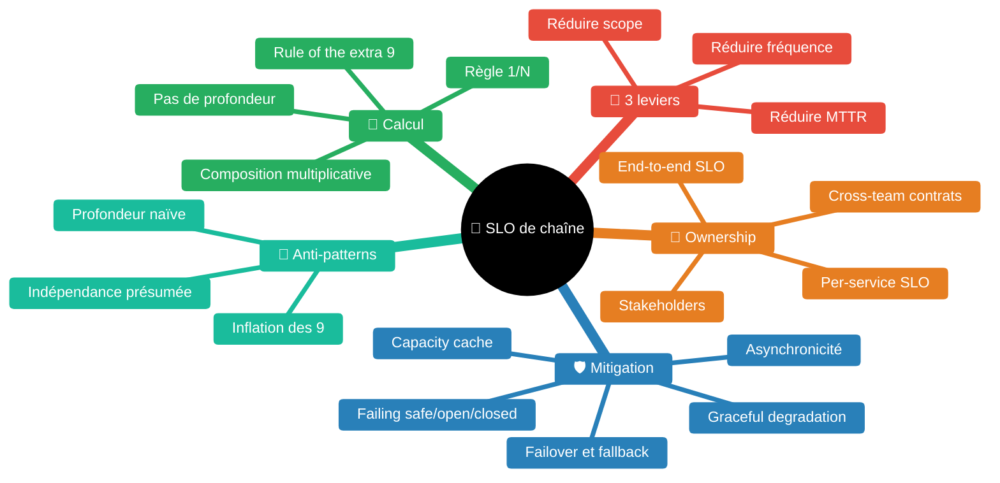
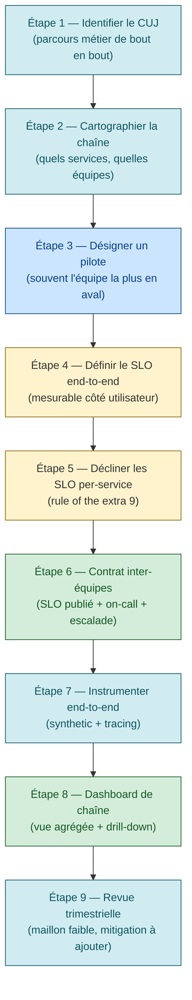

# CUJ transverses et SLO de chaîne — la composition à plusieurs équipes

> *"You're only as available as the sum of your dependencies."* [📖¹](https://queue.acm.org/detail.cfm?id=3096459 "Treynor, Dahlin, Rau, Beyer — The Calculus of Service Availability — sous-titre (ACM Queue march-april 2017)")
>
> *En français* : votre disponibilité est **bornée par celle de vos dépendances**. À l'échelle d'une grande organisation tech où un parcours utilisateur traverse 5 à 10 services possédés par 5 à 10 équipes, la fiabilité devient une **propriété de la chaîne**, pas du service isolé.

Skill construite à partir de sources officielles reconnues (article ACM Queue *The Calculus of Service Availability*, Google SRE workbook *Implementing SLOs*, Google Cloud CRE Life Lessons, Microsoft Azure WAF Reliability) avec citations vérifiées verbatim.

## Pourquoi le SLO d'un service unique ne suffit pas

Le SRE book initial décrit un SLO **par service** mesuré sur des SLI propres au service. À l'échelle d'une grande DSI, ce modèle naïf casse pour deux raisons :

1. **Les parcours utilisateur sont transverses** — Un parcours « passer une commande » traverse typiquement : load balancer → API Gateway → service de catalogue → service de panier → service de paiement → service de notification → bus d'événements → service de tracking. Chaque appel est une dépendance critique. La satisfaction utilisateur dépend de **l'ensemble**, pas d'un maillon.
2. **L'ownership est multi-équipes** — Chacun de ces services est typiquement possédé par une équipe différente, avec son propre SLO, son propre on-call, sa propre roadmap. Aucune équipe seule ne peut garantir le SLO du parcours.

C'est exactement ce que pose *The Calculus of Service Availability* dès l'observation 1 :

> *"Outages originate from two main sources: problems with the service itself and problems with the service's critical dependencies. A critical dependency is one that, if it malfunctions, causes a corresponding malfunction in the service."* [📖²](https://queue.acm.org/detail.cfm?id=3096459 "Calculus of Service Availability — Observation 1: Sources of outages")
>
> *En français* : les pannes viennent de **deux sources** — le service lui-même, et ses **dépendances critiques**. Une dépendance critique est une dépendance dont la défaillance entraîne mécaniquement la défaillance du service.

## Carte des concepts

| Concept | Source |
|---|---|
| Règle 1/N pour dépendances multiples | Calculus §*Clarifying the rule of the extra 9 for nested dependencies* |
| Rule of the extra 9 | Calculus §*Implication 1* |
| Levers to make a service more available | Calculus §*Implication: Levers* |
| Critical user journey + ownership cross-team | Workbook §*Modeling User Journeys* + §*Modeling Dependencies* |
| Stratégies de mitigation | Calculus §*Strategies for minimizing and mitigating critical dependencies* |

## La règle de composition correcte — 1/N, pas la profondeur

Une intuition fausse : *« si chaque niveau de dépendance ajoute un 9 supplémentaire, alors une chaîne de 4 niveaux exige 4 9s supplémentaires, soit du 99,9999 % au niveau 4 »*. Le Calculus la démolit explicitement :

> *"A casual reader might infer that each additional link in a dependency chain calls for an additional 9, such that second-order dependencies need two extra 9s, third-order dependencies need three extra 9s, and so on. This inference is incorrect. It is based on a naive model of a dependency hierarchy as a tree with constant fan-out at each level."* [📖³](https://queue.acm.org/detail.cfm?id=3096459 "Calculus — Clarifying the rule of the extra 9 for nested dependencies (ACM Queue 2017, p. 55)")
>
> *En français* : un lecteur pressé pourrait croire qu'il faut **un 9 supplémentaire par niveau de dépendance**. C'est faux. Ce raisonnement repose sur un modèle naïf — un arbre avec un fan-out constant à chaque niveau.

Le Calculus illustre le problème : avec un fan-out de 10 et 4 niveaux, on aboutit à **1 111 dépendances critiques uniques** — irréaliste.

> *"with that many independent critical dependencies is clearly unrealistic"* [📖³](https://queue.acm.org/detail.cfm?id=3096459 "Calculus — illustration figure 1, 10x10x10 = 1111 services")

### La règle effectivement applicable

> *"If a service has N unique critical dependencies, then each one contributes 1/N to the dependency-induced unavailability of the top-level service, regardless of its depth in the dependency hierarchy. Each dependency should be counted only once, even if it appears multiple times in the dependency hierarchy."* [📖⁴](https://queue.acm.org/detail.cfm?id=3096459 "Calculus — The correct rule (ACM Queue 2017, p. 56-57)")
>
> *En français* : si un service a **N dépendances critiques uniques**, chacune contribue `1/N` à l'indisponibilité induite — **indépendamment de sa profondeur** dans la hiérarchie. Chaque dépendance n'est comptée **qu'une seule fois**, même si elle apparaît plusieurs fois dans le graphe.

Conséquence : c'est le **nombre de dépendances critiques uniques**, pas la profondeur, qui borne le SLO atteignable.

> *"Typical services often have about 5 to 10 critical dependencies, and therefore each one can fail only one-tenth or one-twentieth as much as Service A."* [📖⁵](https://queue.acm.org/detail.cfm?id=3096459 "Calculus — Typical fan-out, p. 57")
>
> *En français* : un service typique a **5 à 10 dépendances critiques** ; chaque dépendance ne peut donc faillir que `1/10ᵉ` ou `1/20ᵉ` de la part de l'indisponibilité globale.

## Rule of the extra 9

> *"A service cannot be more available than the intersection of all its critical dependencies. If your service aims to offer 99.99 percent availability, then all of your critical dependencies must be significantly more than 99.99 percent available. Internally at Google, we use the following rule of thumb: critical dependencies must offer one additional 9 relative to your service — in the example case, 99.999 percent availability — because any service will have several critical dependencies, as well as its own idiosyncratic problems. This is called the 'rule of the extra 9.'"* [📖⁶](https://queue.acm.org/detail.cfm?id=3096459 "Calculus — Implication 1: Rule of the extra 9, p. 52")
>
> *En français* : un service **ne peut pas être plus disponible que l'intersection de ses dépendances critiques**. Pour viser 99,99 %, vos dépendances doivent offrir **99,999 %** — un 9 de plus. Parce qu'un service a toujours plusieurs dépendances **plus** ses propres défauts.

Implications opérationnelles directes :

- **Pour un fournisseur de plateforme** (équipe Platform team, équipe SRE plateforme, équipe sous-système complexe) : votre SLO doit être **nettement supérieur** à celui des services qui dépendent de vous. Si vos consommateurs visent 99,9 %, vous visez 99,99 %.
- **Pour un consommateur de plateforme** : si une de vos dépendances critiques ne tient pas le 9 supplémentaire, votre SLO est mécaniquement intenable — il faut soit changer la dépendance, soit ajouter une mitigation locale, soit baisser votre cible.

### Le corollaire — quand on ne peut pas tenir

> *"If your service is relied upon for an availability level you cannot deliver, you should make energetic efforts to correct the situation — either by increasing the availability level of your service or by adding mitigation as described earlier. Reducing expectations (i.e., the published availability) is also an option, and often it is the correct choice: make it clear to the dependent service that it should either reengineer its system to compensate for your service's availability or reduce its own target."* [📖⁷](https://queue.acm.org/detail.cfm?id=3096459 "Calculus — Corollary to implications 1 and 2, p. 53")
>
> *En français* : si vous êtes invoqué pour un niveau de disponibilité que vous **ne pouvez pas livrer**, vous avez 3 options :
> 1. **Augmenter** votre disponibilité (investissement)
> 2. **Ajouter une mitigation** (cache, fallback, async — voir plus bas)
> 3. **Réduire l'attente publiée** (renégocier le SLA/SLO) — souvent **le bon choix**, force le consommateur à compenser ou à réduire sa propre cible

C'est le pivot stratégique : **un SLO publié honnête vaut mieux qu'un SLO inflaté que tout le monde sait intenable**.

## Les 3 leviers de fiabilisation

> *"there are three main levers to make a service more reliable. Reduce the frequency of outages — via rollout policy, testing, design reviews, etc. Reduce the scope of the average outage — via sharding, geographic isolation, graceful degradation, or customer isolation. Reduce the time to recover — via monitoring, one-button safe actions (for example, rollback or adding emergency capacity), operational readiness practice, etc."* [📖⁸](https://queue.acm.org/detail.cfm?id=3096459 "Calculus — Implication: Levers to make a service more available, p. 55")
>
> *En français* : trois leviers actionnables pour augmenter la disponibilité d'un service :
> 1. **Réduire la fréquence** des pannes — politique de rollout, tests, revues de design
> 2. **Réduire la portée** des pannes — sharding, isolation géographique, dégradation gracieuse, isolation client
> 3. **Réduire le temps de récupération** — monitoring, *one-button safe actions* (rollback en un clic, ajout de capacité d'urgence), pratique opérationnelle

Le Calculus précise : ces trois leviers se **substituent** les uns aux autres — si un MTTR de 17 min est intenable, on compense en réduisant le scope ou la fréquence.

| Levier | Exemples de mécanismes | Cf. guide |
|---|---|---|
| Fréquence | Rollout progressif (5/20/100), tests `@smoke` à 5 niveaux, revues d'architecture, ORR | [`release-engineering.md`](release-engineering.md), [`smoke-tests.md`](smoke-tests.md), [`operational-readiness-review.md`](operational-readiness-review.md) |
| Scope | Sharding, isolation géographique, *customer isolation* (limitation de débit par client), dégradation gracieuse | [`disaster-recovery.md`](disaster-recovery.md), [`feature-flags.md`](feature-flags.md) |
| MTTR | Monitoring orienté symptômes, runbooks vivants, rollback automatique sur burn rate, *one-button actions* | [`monitoring-alerting.md`](monitoring-alerting.md), [`incident-management.md`](incident-management.md), [`mtbf-mttr.md`](mtbf-mttr.md) |

## CUJ transverses — la modélisation du parcours multi-équipes

Le SRE workbook décrit le CUJ comme la base de la mesure :

> *"A critical user journey is a sequence of tasks that is a core part of a given user's experience and an essential aspect of the service."* [📖⁹](https://sre.google/workbook/implementing-slos/ "Google SRE workbook — Implementing SLOs, section Modeling User Journeys")
>
> *En français* : un CUJ est une **séquence de tâches** qui constitue une part centrale de l'expérience utilisateur et un aspect essentiel du service.

Pour un parcours mono-service, le mapping CUJ → SLI est direct (cf. [`critical-user-journeys.md`](critical-user-journeys.md)). Pour un parcours **transverse**, plusieurs questions stratégiques surgissent :

### Q1 — Qui possède le CUJ ?

Réponse Google explicite :

> *"If a single component is a critical dependency for a particularly high-value interaction, its reliability guarantee should be at least as high as the reliability guarantee of the dependent action. The team that runs that particular component needs to own and manage its service's SLO in the same way as the overarching product SLO."* [📖¹⁰](https://sre.google/workbook/implementing-slos/ "Google SRE workbook — Implementing SLOs, section Modeling Dependencies")
>
> *En français* : si un composant est une dépendance critique d'une interaction de forte valeur, sa garantie de fiabilité doit être **au moins égale** à celle de l'action dépendante. **L'équipe qui possède ce composant possède son SLO** de la même manière que le SLO produit global.

Pattern qui en découle :

- **CUJ end-to-end** = porté par une équipe-pilote (souvent l'équipe la plus en aval, celle qui voit l'utilisateur)
- **SLO per-service** = porté par chaque équipe propriétaire de son service, **avec un 9 supplémentaire** par rapport au CUJ end-to-end (rule of the extra 9)
- **Contrat inter-équipes** explicite : qui doit quoi à qui, et à quel SLO

### Q2 — Comment mesurer le CUJ end-to-end ?

Le workbook l'évoque indirectement :

> *"Once you can measure an event, it becomes just another SLI, which you can track alongside your existing SLIs and SLOs."* [📖¹¹](https://sre.google/workbook/implementing-slos/ "Google SRE workbook — Implementing SLOs, section Modeling User Journeys")
>
> *En français* : dès qu'on sait **mesurer** un événement (comme « le parcours s'est terminé avec succès »), il devient un SLI normal qu'on suit comme les autres.

Trois techniques de mesure end-to-end usuelles :

| Technique | Avantage | Limite |
|---|---|---|
| **Synthetic monitoring** (probes externes qui rejouent le CUJ) | Mesure ce que l'utilisateur expérimente, indépendamment de la santé interne | Coût, faux positifs si la probe a un bug |
| **Distributed tracing** (un `trace_id` propagé sur toute la chaîne) | Mesure réelle, par utilisateur, avec attribution de la latence par service | Demande l'instrumentation complète, échantillonnage à calibrer |
| **Aggregation logique** (succès = produit des succès de chaque étape) | Calcul économique à partir des SLI per-service existants | Suppose l'indépendance — fausse en pratique (cf. anti-pattern) |

Cf. guides [`synthetic-monitoring.md`](synthetic-monitoring.md), [`observability-vs-monitoring.md`](observability-vs-monitoring.md).

### Q3 — Comment gérer une dépendance hors de votre contrôle ?

Le Calculus l'aborde directement :

> *"If you have a critical dependency that does not offer enough 9s (a relatively common challenge!), you must employ mitigation to increase the effective availability of your dependency (e.g., via a capacity cache, failing open, graceful degradation in the face of errors, and so on)."* [📖¹²](https://queue.acm.org/detail.cfm?id=3096459 "Calculus — Implication 1, mitigation, p. 52")
>
> *En français* : si une dépendance critique n'offre pas assez de 9s (cas fréquent !), vous **devez ajouter une mitigation** pour relever sa disponibilité effective : cache de capacité, *failing open*, dégradation gracieuse.

## Stratégies de mitigation des dépendances critiques

Le Calculus consacre une section entière aux stratégies. Synthèse opérationnelle :

### Capacity cache

> *"A cache that serves precomputed results for API calls or queries to a service, generating cost savings in terms of compute/IO resource needs by reducing the volume of client traffic hitting the underlying service. Unlike the more typical performance/latency cache, a capacity cache is considered critical to service operation. A drop in the cache hit rate or cache ratio below the SLO is considered a capacity loss."* [📖¹³](https://queue.acm.org/detail.cfm?id=3096459 "Calculus — Definitions: Capacity cache, p. 59")
>
> *En français* : un cache qui sert des **résultats pré-calculés** d'appels d'API ou de requêtes à un service. Contrairement au cache classique de perf, un *capacity cache* est **critique** : si son taux de hit chute sous le SLO, c'est une perte de capacité.

Cas d'usage : votre dépendance a un SLO de 99,9 % et vous visez 99,95 %. Un capacity cache devant elle absorbe les pannes courtes et augmente la disponibilité effective vue par votre service.

### Failing safe / failing open / failing closed

Trois stratégies de gestion d'échec, à choisir selon le contexte métier :

| Stratégie | Définition (Calculus) | Exemple métaphorique |
|---|---|---|
| **Failing open** | *"the trigger normally required to authorize an action fails, failing open means to let some action happen, rather than making a decision"* [📖¹⁴](https://queue.acm.org/detail.cfm?id=3096459 "Calculus — Failing open, p. 61") | Porte de sortie d'immeuble qui s'ouvre sans badge en cas de panne électrique |
| **Failing closed** | *"the opposite of failing open. For example, a bank vault door denies all attempts to unlock it if its badge reader cannot contact the access-control database."* [📖¹⁴](https://queue.acm.org/detail.cfm?id=3096459 "Calculus — Failing closed, p. 61") | Porte de coffre-fort qui refuse toute ouverture si le système d'auth est down |
| **Failing safe** | *"whatever behavior is required to prevent the system from falling into an unsafe mode when expected functionality suddenly doesn't work."* [📖¹⁴](https://queue.acm.org/detail.cfm?id=3096459 "Calculus — Failing safe, p. 61") | Combinaison contextuelle (fail open temporairement puis fail closed quand les données expirent) |

Le choix dépend du **risque métier** : on fail open quand l'indisponibilité est plus coûteuse que le risque, on fail closed quand le risque (sécurité, conformité) domine.

### Failover et fallback

> *"Failover: a strategy that handles failure of a system component or service instance by automatically routing incoming requests to a different instance."* [📖¹⁵](https://queue.acm.org/detail.cfm?id=3096459 "Calculus — Failover, p. 61-62")
>
> *"Fallback: A mechanism that allows a tool or system to use an alternative source for serving results when a given component is unavailable. For example, a system might fall back to using an in-memory cache of previous results. While the results may be slightly stale, this behavior is better than outright failure. This type of fallback is an example of graceful degradation."* [📖¹⁵](https://queue.acm.org/detail.cfm?id=3096459 "Calculus — Fallback, p. 62")
>
> *En français* :
> - **Failover** : routage automatique vers une autre instance en cas de panne
> - **Fallback** : usage d'une source alternative (souvent un cache local de résultats précédents). Résultats potentiellement périmés mais meilleurs qu'un échec complet — exemple de **graceful degradation**.

Pattern important souligné par le Calculus : **automatiser** failover et fallback.

> *"Pursue software rollouts and migrations that fail safe and are automatically isolated should a problem arise. The basic principle at work here is that by the time you bring a human online to trigger a failover, you've likely already exceeded your error budget. Where concurrency/voting is not possible, automate failover and fallback. Again, if the issue needs a human to check what the problem is, the chances of meeting your SLO are slim."* [📖¹⁶](https://queue.acm.org/detail.cfm?id=3096459 "Calculus — Failover and fallback, p. 62")
>
> *En français* : si vous attendez **un humain** pour déclencher un failover, vous avez **déjà** brûlé votre error budget. Automatisez.

### Asynchronicité

> *"Design dependencies to be asynchronous rather than synchronous where possible so that they don't accidentally become critical. If a service waits for an RPC response from one of its noncritical dependencies and this dependency has a spike in latency, the spike will unnecessarily hurt the latency of the parent service. By making the RPC call to a noncritical dependency asynchronous, you can decouple the latency of the parent service from the latency of the dependency."* [📖¹⁷](https://queue.acm.org/detail.cfm?id=3096459 "Calculus — Asynchronicity, p. 62")
>
> *En français* : rendez les dépendances **asynchrones** quand c'est possible, pour qu'elles **ne deviennent pas accidentellement critiques**. Un appel RPC synchrone à une dépendance non-critique fait remonter ses pics de latence dans votre service. Un appel async les découple.

Pattern sous-jacent : **toute dépendance synchrone est critique par construction**. Pour réduire le N de la règle 1/N, transformez les dépendances en async (events, queues, processings différés).

### Sharding et isolation géographique

> *"Sharding: Splitting a data structure or service into shards is a management strategy based on the principle that systems built for a single machine's worth of resources don't scale."* [📖¹⁸](https://queue.acm.org/detail.cfm?id=3096459 "Calculus — Sharding, p. 65")
>
> *"Geographic isolation: You can build additional reliability into your service by isolating particular geographic zones to have no dependencies on each other. For example, if you separate North America and Australia into separate serving zones, an outage that occurs in Australia because of a traffic overload won't also take out your service in North America."* [📖¹⁹](https://queue.acm.org/detail.cfm?id=3096459 "Calculus — Geographic isolation, p. 62-63")
>
> *En français* : **sharder** un service ou une donnée pour qu'une panne ne touche qu'un sous-ensemble. **Isoler géographiquement** pour qu'une zone tombe sans entraîner les autres.

Effet : on transforme une panne globale en panne partielle. Le SLO global est préservé même quand un shard ou une zone tombe.

### Graceful degradation

> *"A service should be 'elastic' and not fail catastrophically under overload conditions and spikes — that is, you should make your applications do something reasonable even if not all is right. It is better to give users limited functionality than an error page."* [📖²⁰](https://queue.acm.org/detail.cfm?id=3096459 "Calculus — Graceful degradation, p. 63")
>
> *En français* : un service doit être **« élastique »** et ne pas s'écrouler sous charge — il vaut mieux **fonctionnalité limitée** qu'une page d'erreur.

Exemple : un service de recherche qui, sous charge, désactive les filtres avancés mais maintient la recherche par mot-clé. Pour l'utilisateur, c'est dégradé mais utilisable.

## Pour passer un cap d'échelle — capacity planning et configuration

> *"Capacity planning: Make sure that every dependency is correctly provisioned. When in doubt, overprovision if the cost is acceptable."* [📖²¹](https://queue.acm.org/detail.cfm?id=3096459 "Calculus — Capacity planning, p. 63")
>
> *"Configuration: When possible, standardize configuration of your dependencies to limit inconsistencies among subsystems and avoid one-off failure/error modes."* [📖²¹](https://queue.acm.org/detail.cfm?id=3096459 "Calculus — Configuration, p. 63")
>
> *En français* : provisionnez correctement chaque dépendance ; en cas de doute et de coût acceptable, **surprovisionnez**. Standardisez la config pour éviter les modes d'erreur uniques. Cf. [`capacity-planning-load.md`](capacity-planning-load.md).

## Anti-patterns à proscrire

| Anti-pattern | Symptôme | Conséquence | Pattern correct |
|---|---|---|---|
| **Inflation des 9 par profondeur** | « 4 niveaux de dépendance, donc je vise 99,9999 % à la racine » | Cible irréaliste, démotivation, abandon SLO | Règle 1/N (Calculus) — c'est le **nombre** de dépendances uniques qui compte, pas la profondeur [📖³] |
| **Indépendance présumée** | « Mes 5 dépendances sont indépendantes donc leur disponibilité multiplie » | Fausse sécurité — souvent corrélées (même infra réseau, même cluster, même éditeur) | Mesurer la corrélation réelle, sourcer les vraies dépendances communes, traiter chaque shared infra comme **un** SPOF [📖²²](https://queue.acm.org/detail.cfm?id=3096459 "Calculus — Shared infrastructure, p. 60") |
| **Dépendance synchrone par défaut** | Tout appel RPC en synchrone, y compris les calls non-critiques | N artificiellement élevé, MTTR ralenti | Async par défaut pour tout ce qui n'est pas dans le chemin critique [📖¹⁷] |
| **SLO publié inflaté** | Tout le monde annonce 99,99 %, personne ne le tient | Perte de confiance, *gate* error budget systématiquement épuisé | Publier un SLO honnête, renégocier au besoin (corollaire Calculus) [📖⁷] |
| **Failover manuel** | « En cas de panne, on appelle l'astreinte qui bascule manuellement » | Error budget brûlé avant l'humain en ligne | Failover automatique, humain en *seconde ligne* [📖¹⁶] |
| **Pas d'attribution cross-team** | Le CUJ end-to-end existe mais sans propriétaire identifié par maillon | Pas de pression à fixer le maillon faible | Contrat inter-équipes : pour chaque service de la chaîne, équipe + SLO publié + on-call [📖¹⁰] |
| **Mesure end-to-end ignorée** | On suit les SLI per-service mais aucune mesure du CUJ global | Tous les services brillent en vert pendant que le SLO de chaîne brûle — les utilisateurs souffrent sans signal opérationnel | Synthetic monitoring + distributed tracing du CUJ end-to-end |

> **🟢 Confiance 8/10** — Tableau d'anti-patterns dont 4 sont sourcés directement Calculus, 3 sont des consensus communautaires SRE cohérents avec les sources Google.

## Décliner un CUJ transverse en pratique

Étapes opérationnelles pour matérialiser un CUJ qui traverse N équipes :

À chaque étape, demander explicitement : *« quelle équipe est responsable, et de quoi s'engage-t-elle ? »*. Sans cette explicitation, le CUJ end-to-end devient un orphelin que personne ne défend en cas d'incident.

## Cheatsheet — concevoir une chaîne de services fiable

- [ ] **Compter les dépendances critiques uniques** (pas la profondeur) — viser 5 à 10 max
- [ ] **Appliquer la rule of the extra 9** : chaque dépendance critique doit offrir un 9 de plus que le service qu'elle sert
- [ ] **Désynchroniser** tout ce qui peut l'être — rendre les dépendances non-critiques **vraiment** non-critiques via async
- [ ] **Capacity cache** devant les dépendances qui n'offrent pas assez de 9s (et SLO sur le hit rate du cache)
- [ ] **Stratégie de fail explicite** : safe / open / closed selon le contexte métier, **documentée par dépendance**
- [ ] **Failover et fallback automatiques** (pas humains)
- [ ] **Sharding** ou **isolation géographique** pour limiter la portée des pannes
- [ ] **Graceful degradation** plutôt qu'erreur fatale — fonctionnalité réduite vaut mieux que page d'erreur
- [ ] **Mesure end-to-end** du CUJ — synthetic monitoring + distributed tracing
- [ ] **Contrat inter-équipes** publié et revu : qui possède quoi, à quel SLO, avec quelle escalade
- [ ] **Revue trimestrielle** de la chaîne pour identifier le maillon faible et le pattern de mitigation à ajouter

## Glossaire

| Terme | Définition courte |
|---|---|
| **Capacity cache** | Cache critique qui sert des résultats pré-calculés ; sa baisse de hit rate est une perte de capacité [📖¹³] |
| **Critical dependency** | Dépendance dont la défaillance entraîne mécaniquement la défaillance du service [📖²] |
| **End-to-end SLO** | SLO mesuré côté utilisateur sur un parcours qui traverse plusieurs services |
| **Failing open / closed / safe** | Trois stratégies de gestion d'échec de dépendance, choisies selon le risque métier |
| **Graceful degradation** | Service qui dégrade fonctionnellement au lieu de s'effondrer sous panne ou surcharge |
| **Per-service SLO** | SLO mesuré au niveau d'un service unique, avec un 9 de plus que le SLO end-to-end qu'il sert |
| **Request critical path** | Chemin d'appels nécessaires pour servir une requête utilisateur — borne inférieure du nombre de dépendances critiques |
| **Rule of the extra 9** | Vos dépendances critiques doivent offrir au moins un 9 de plus que votre service [📖⁶] |
| **Rule 1/N** | Si N dépendances critiques uniques, chacune contribue 1/N à l'indisponibilité induite, indépendamment de la profondeur [📖⁴] |

## Bibliothèque exhaustive des sources

### Calcul de fiabilité de chaîne
- [📖] Treynor, Dahlin, Rau, Beyer (2017), *The Calculus of Service Availability*, ACM Queue march-april 2017, p. 49-66 — https://queue.acm.org/detail.cfm?id=3096459 *(PDF officiel : https://sre.google/static/pdf/calculus_of.pdf)* — Source canonique pour la règle 1/N, la rule of the extra 9, les 3 leviers, les stratégies de mitigation, le corollaire de renégociation.
- [📖] CACM mirror — *The Calculus of Service Availability* — https://cacm.acm.org/practice/the-calculus-of-service-availability/ — Mirror Communications of the ACM (sept 2017)

### CUJ et SLO multi-équipes
- [📖] *Google SRE Workbook — Implementing SLOs* — https://sre.google/workbook/implementing-slos/ — Définition CUJ, modélisation user journeys, modélisation dépendances, ownership cross-team
- [📖] *Google SRE Workbook — SLO Engineering Case Studies* — https://sre.google/workbook/slo-engineering-case-studies/ — Études de cas Evernote, Home Depot
- [📖] *Google Cloud Architecture Center — Defining SLOs* — https://cloud.google.com/architecture/defining-slos — Guide pratique SLO avec dépendances *(URL peut rediriger — vérifier dans le navigateur)*
- [📖] *Google SRE — Product-focused reliability* — https://sre.google/resources/practices-and-processes/product-focused-reliability-for-sre/ — Vue produit de la fiabilité, alignement SRE-PM-Dev
- [📖] *Google Cloud Blog — Defining SLOs for services with dependencies (CRE Life Lessons)* — https://cloud.google.com/blog/products/devops-sre/defining-slos-for-services-with-dependencies-cre-life-lessons — Approfondissement opérationnel par les Customer Reliability Engineers

### Cadres adjacents
- [📖] *Microsoft Azure WAF — Reliability, Identify flows* — https://learn.microsoft.com/en-us/azure/well-architected/reliability/identify-flows — Concept de *user flows* (proche du CUJ Google)
- [📖] *AWS Well-Architected Framework — Reliability Pillar* — https://docs.aws.amazon.com/wellarchitected/latest/reliability-pillar/welcome.html — Pratiques de fiabilité distribuée
- [📖] Beyer, Jones, Petoff, Murphy (2016), *Site Reliability Engineering: How Google Runs Production Systems*, O'Reilly — https://sre.google/sre-book/table-of-contents/ — Le SRE book fondateur

## Conventions de sourcing

- `[📖n](url "tooltip")` — Citation **vérifiée verbatim** via WebFetch / lecture directe des sources
- ⚠️ — Reformulation pédagogique ou pattern consensuel non cité verbatim

Notes de confiance par solution : 🟢 9-10 (verbatim) / 🟢 7-8 (reformulation fidèle) / 🟡 5-6 (choix défendable) / 🟠 3-4 (choix d'équipe) / 🔴 1-2 (à challenger).

## Liens internes KB

- [`critical-user-journeys.md`](critical-user-journeys.md) — Identifier les CUJ d'un service ; ce guide-ci traite leur extension transverse
- [`sli-slo-sla.md`](sli-slo-sla.md) — Bases des SLI / SLO / SLA
- [`error-budget.md`](error-budget.md) — Mécanique de l'error budget par service
- [`sre-at-scale.md`](sre-at-scale.md) — Modèles d'organisation SRE à l'échelle (où s'inscrit la coordination cross-team)
- [`alerting-consolidation-strategy.md`](alerting-consolidation-strategy.md) — Stratégie d'alerting à l'échelle d'une grande organisation
- [`monitoring-alerting.md`](monitoring-alerting.md) — Philosophie d'alerting (page on symptoms)
- [`synthetic-monitoring.md`](synthetic-monitoring.md) — Mesure end-to-end des CUJ
- [`observability-vs-monitoring.md`](observability-vs-monitoring.md) — Distributed tracing pour la mesure de chaîne
- [`disaster-recovery.md`](disaster-recovery.md) — Isolation géographique et basculement
- [`capacity-planning-load.md`](capacity-planning-load.md) — Capacity planning des dépendances
- [`feature-flags.md`](feature-flags.md) — Mitigation par graceful degradation
- [`incident-management.md`](incident-management.md) — MTTR et conduite d'incident multi-équipes
- [`mtbf-mttr.md`](mtbf-mttr.md) — MTBF, MTTR et détection
