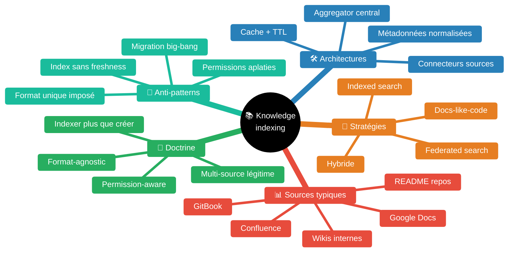
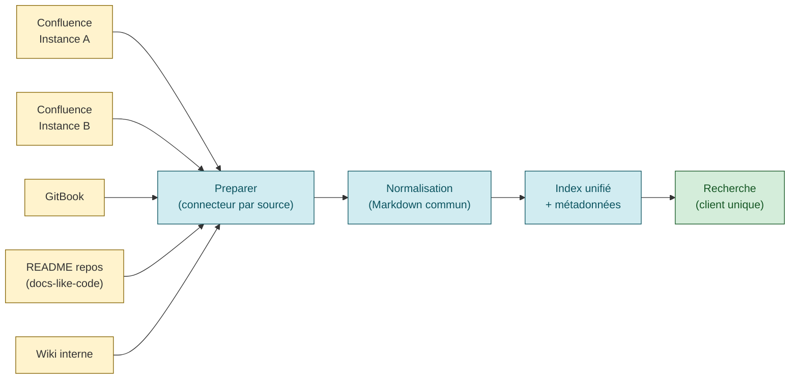
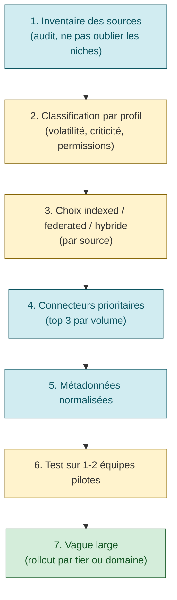

# Knowledge indexing strategy — indexer l'existant plutôt que tout migrer

> *"Rather than manually consolidating all company documentation into a single wiki — which can be lengthy and resource-intensive — implementing enterprise search allows you to connect all existing knowledge sources with minimal disruption, creating a more scalable and unified search experience."* [📖¹](https://www.gosearch.ai/blog/corporate-wikis-vs-enterprise-search/ "GoSearch — Corporate Wikis vs Enterprise Search 2025")
>
> *En français* : plutôt que de **consolider manuellement** toute la documentation de l'entreprise dans un wiki unique — long et coûteux en ressources — connecter les sources de connaissance existantes via une couche d'indexation crée une expérience unifiée **avec une perturbation minimale**.

À l'échelle d'une grande organisation, la connaissance opérationnelle (runbooks, postmortems, guides, procédures) **existe déjà** — dispersée dans de multiples systèmes : Confluence, GitBook, README de repos, wikis internes, ServiceNow, Google Docs. La tentation classique est de tout migrer vers un format unique. Cette tentation est presque toujours **un piège** : l'effort de migration est massif, le ROI est négatif, et la friction d'adoption est sous-estimée.

L'alternative — **indexer en place** — accepte la diversité des sources et offre une couche de recherche/agrégation unifiée par-dessus. Pattern adopté par les principaux outils 2024-2026 : Backstage TechDocs (Spotify), Glean, Coveo, GoSearch.

Skill construite à partir de sources industrielles 2024-2026 (Backstage / Spotify, GoSearch, MoveWorks, Bloomfire) et de la doctrine *docs-like-code* + *enterprise search*.

## Pourquoi « indexer > créer » à l'échelle

Trois forces structurelles imposent cette doctrine :

1. **Migration coûteuse, ROI négatif** — Migrer 10 000+ pages Confluence vers un nouveau format demande typiquement 6-12 mois × N personnes. Pendant ce temps, le contenu **continue à évoluer** dans la source originale (les équipes ne s'arrêtent pas d'écrire). Résultat : double système permanent, désynchronisation, perte de confiance.
2. **Diversité légitime des sources** — Une équipe applicative écrit ses runbooks dans le `README` de son repo (proximité du code, ownership clair). Une équipe métier écrit ses procédures dans Confluence (collaboration produit, validation PO). Une équipe sécurité écrit dans son wiki interne (contrôle d'accès strict). **Cette diversité est rationnelle**, pas une erreur à corriger.
3. **Permission-aware access** — L'agrégation indexée doit respecter les permissions de la source originale. Migrer = aplatir les permissions ou les recréer (complexe). Indexer = consommer les permissions natives.

## Carte des concepts

## Indexed search vs federated search

Deux stratégies fondamentales (souvent combinées dans les solutions modernes) :

> *"Federated search queries multiple live sources in real time, ideal for dynamic or regulated environments, while indexed search builds a pre-processed centralized repository for fast, consistent, rankable results. Federated search works best for multi-system environments with strict data residency requirements, as regulatory constraints often require data to remain in original systems."* [📖²](https://www.gosearch.ai/blog/2025-leading-enterprise-knowledge-management-systems/ "GoSearch — 2025's Leading Enterprise Knowledge Management Systems")
>
> *En français* : la **federated search** interroge plusieurs sources **en temps réel**, idéale pour les environnements dynamiques ou régulés. L'**indexed search** construit un dépôt centralisé pré-traité, plus rapide et permettant de classer les résultats. Federated convient quand la **résidence des données** est une contrainte forte (les données doivent rester dans le système d'origine).

| Critère | Indexed search | Federated search |
|---|---|---|
| Architecture | Aggregator central qui copie/indexe | Aggregator qui dispatche les requêtes |
| Latence requête | Faible (< 100 ms) | Moyenne (somme des sources, 200-1000 ms) |
| Fraîcheur | Tributaire du cycle de re-indexation | Live, instantanée |
| Permissions | Recréées dans l'index ou propagées | Natives de la source |
| Scaling | Stockage central à dimensionner | Charge sur les sources |
| Coût | Plus élevé (stockage + indexation) | Plus faible mais N appels par requête |
| Adapté à | Sources stables, requêtes massives | Sources volatiles, contraintes régulatoires |

**Pattern hybride** souvent adopté : indexer les sources stables (runbooks dans repos), federated sur les sources volatiles (Google Docs en cours d'édition). Permet d'optimiser latence et fraîcheur selon le profil de chaque source.

## Cas canonique 2024-2026 — Backstage TechDocs

Backstage TechDocs (Spotify, CNCF Incubating) est une référence pratique de l'approche docs-like-code + agrégation multi-source.

### Philosophie docs-like-code

> *"TechDocs is Spotify's homegrown docs-like-code solution built directly into Backstage. Engineers write their documentation in Markdown files which live together with their code."* [📖³](https://backstage.io/docs/features/techdocs/ "Backstage TechDocs — Documentation")
>
> *En français* : TechDocs est la solution **docs-like-code** maison de Spotify. Les ingénieurs écrivent leur documentation en Markdown directement **à côté du code**, dans le même repo.

C'est **un cas d'usage légitime du *« créer »*** : pour les services applicatifs avec runbooks intimement liés au code, écrire en Markdown dans le repo a du sens (proximité, versioning, ownership). Mais Spotify reconnaît que la majorité de la documentation existe **déjà ailleurs** — d'où le module Confluence.

### Module Confluence — agrégation de l'existant

Le module communautaire `techdocs-backend-module-confluence` permet à TechDocs de consommer les pages Confluence sans migration.

> *"This plugin provides a TechDocs preparer that fetches documentation from Confluence pages and converts them to Markdown for rendering in Backstage TechDocs."* [📖⁴](https://github.com/backstage/community-plugins/blob/main/workspaces/confluence/plugins/techdocs-backend-module-confluence/README.md "Backstage Community — TechDocs Confluence module")
>
> *En français* : ce plugin fournit un **preparer** TechDocs qui **fetch** les pages Confluence et les **convertit en Markdown** pour rendu dans Backstage TechDocs.

Capacités clés :

> *"Automatic HTML to Markdown conversion — Converts Confluence page content to MkDocs-compatible Markdown."* [📖⁴]
>
> *"Multiple Confluence instances — Connect to multiple Confluence instances and automatically route URLs to the correct one."* [📖⁴]
>
> *"Page tree support — Recursively fetches child pages to build a complete documentation hierarchy."* [📖⁴]
>
> *"Attachment handling — Downloads and embeds images and draw.io diagrams."* [📖⁴]

**Architecture conceptuelle** :

> ⚠️ La phrase exacte *« do not migrate »* n'apparaît pas dans la doc Backstage TechDocs. La doctrine est **implicite** dans la conception même du module Confluence : l'existant reste dans Confluence, l'agrégation se fait via un *preparer* qui pull à la demande. Cohérent avec la philosophie indexer > migrer.

## Pattern multi-source — règles de conception

### Règle 1 — Connecteurs par source, allow-list explicite

Chaque source a son **connecteur dédié** qui sait dialoguer avec son API. La liste des connecteurs est **explicite** (allow-list). Ajouter une source = développer/installer un connecteur. Pas de connecteur générique magique.

### Règle 2 — Métadonnées normalisées par-dessus

Au-delà du contenu, chaque document indexé porte des **métadonnées normalisées** :

| Métadonnée | Rôle |
|---|---|
| `source` | `confluence | gitbook | git-readme | wiki | google-docs` |
| `source_url` | URL d'origine (pour drill-down) |
| `last_modified` | Date de dernière modification (fraîcheur) |
| `owner_team` | Équipe propriétaire (déduit de la source) |
| `permissions_native` | Réutilisation des permissions natives ou règle de mapping |
| `domain` | Domaine fonctionnel (paiement, auth, batch, …) — utile pour filtrage |
| `tier` | Tier de criticité du service documenté (si applicable) |

Ces métadonnées permettent **filtrage** (par domaine, par tier, par équipe) et **fraîcheur** (alerter sur des docs périmées).

### Règle 3 — Permission-aware par construction

> *"Success requires unified platforms combining indexed and federated search, RAG, vector embeddings, and zero trust security with permission-aware access."* [📖⁵](https://www.gosearch.ai/blog/2025-leading-enterprise-knowledge-management-systems/ "GoSearch — 2025 Leading Enterprise Knowledge Management Systems")
>
> *En français* : le succès demande des plateformes unifiées combinant indexation, recherche federated, RAG, embeddings vectoriels, **et sécurité zero trust avec accès permission-aware**.

L'index **ne doit pas exposer** un document à un utilisateur qui n'aurait pas le droit de le lire dans la source originale. Trois patterns :

| Pattern | Description | Quand l'utiliser |
|---|---|---|
| **Permissions natives** (post-filter) | L'index récupère tous les résultats puis filtre selon les permissions de l'utilisateur dans la source | Sources avec API permission rapide (Confluence) |
| **Permissions répliquées** (pre-filter) | L'index stocke les permissions au moment de l'indexation et filtre côté index | Sources sans API permission ou trop lente |
| **Federated** (live) | Pas d'index, requête directe à la source qui filtre nativement | Sources très sensibles, contraintes de résidence |

### Règle 4 — Fraîcheur calibrée par profil de source

Pas toutes les sources ont la même volatilité. Calibrer le re-indexing :

| Profil | Fréquence de re-indexation |
|---|---|
| README de repos (lié au code) | À chaque push (webhook) |
| Confluence runbooks | Quotidien |
| Confluence spec produit | Hebdomadaire |
| Postmortems publiés | Quotidien (rare mais important) |
| Google Docs en cours | Federated (pas d'index) |

### Règle 5 — Format Markdown comme dénominateur commun

Quel que soit la source, **convertir en Markdown** au moment de l'indexation. Avantages :
- Format texte simple, indexable par tout moteur
- Compatible RAG / embeddings vectoriels
- Lecteur Markdown universel (IDE, terminal, web)
- Pas de dépendance au moteur de rendu source

C'est ce que fait Backstage TechDocs systématiquement.

## Domaines d'application — exemples concrets

### Indexation de runbooks (cas SRE)

À l'échelle, les runbooks vivent dans :
- `runbooks/<alerte>.md` (golden path, repo applicatif)
- Confluence (équipes traditionnelles)
- ServiceNow (équipes ops legacy)
- Wiki interne (équipes spécifiques)
- Threads de tickets résolus (postmortems oubliés)

Stratégie : indexer les 4 premiers, ignorer le 5ᵉ (signal/bruit défavorable). MCP Server / search engine derrière qui interroge l'index.

### Indexation de postmortems

Les postmortems vivent dans :
- Confluence (format collaboratif riche)
- Google Docs (rédaction d'incident)
- `postmortems/*.md` (pour les équipes docs-like-code)

Stratégie : indexer en convertissant en Markdown. Métadonnées extraites : date, sévérité, services impactés, chaîne impactée. Permet d'agréger les MTTR et autres métriques DORA par chaîne.

### Indexation de guides / spec produit

Les guides produit vivent typiquement dans Confluence (collaboration PO). Indexer en lecture seule pour les rendre interrogeables aux assistants IA.

## Anti-patterns à proscrire

| Anti-pattern | Symptôme | Conséquence | Pattern correct |
|---|---|---|---|
| **Migration big-bang vers format unique** | Projet 6-12 mois, équipe dédiée, *« on migre tout d'ici fin d'année »* | Désynchronisation pendant la transition, dette permanente, friction d'adoption | Indexation en place + golden path optionnel pour les nouveaux contenus |
| **Format unique imposé** | *« Tout le monde doit écrire en Markdown dans le repo »* | Rejet par les équipes qui ont des besoins légitimes ailleurs (PO en Confluence) | Multi-source légitime, conversion à l'indexation |
| **Permissions aplaties** | L'index expose tous les documents à tous les utilisateurs | Fuite de doc sensible, perte de confiance | Permission-aware (post-filter ou pre-filter selon source) |
| **Index sans freshness** | Re-indexation hebdo pour un README qui change quotidiennement | Doc périmée, confiance érodée | Calibrage par profil de source (webhooks pour repos) |
| **Connecteurs génériques magiques** | *« Notre solution indexe tout automatiquement »* | Indexation incomplète, traduction lossy, métadonnées manquantes | Connecteurs dédiés par source, allow-list explicite |
| **Création de nouveaux runbooks systématique** | À chaque onboarding, on demande à l'équipe de créer 50 runbooks au format X | Charge inacceptable, échec d'adoption, runbooks copiés-collés vides | Indexation en priorité, création optionnelle (golden path pour nouveaux services) |
| **Pas de drill-down vers la source** | L'index montre un extrait sans lien vers le document original | L'utilisateur doit re-chercher pour valider, perte de confiance | `source_url` obligatoire sur chaque résultat |
| **Indexation sans normalisation** | Chaque source garde son format (HTML Confluence, .md GitBook, .rst…) | Le client doit savoir interpréter chaque format | Normalisation Markdown au moment de l'indexation |

> **🟢 Confiance 8/10** — Anti-patterns dont 5 sont sourcés directement (GoSearch, Backstage), 3 sont des consensus communautaires de plateformes Coveo/Glean/MoveWorks documentés.

## Méthode — démarrer une stratégie d'indexation

**Étape 1 — Inventaire** : auditer toutes les sources de connaissance opérationnelle, ne pas oublier les niches (Google Drive d'une équipe, README cachés, threads de tickets).

**Étape 2 — Classification** : pour chaque source, capturer volatilité, criticité, modèle de permissions, volume estimé.

**Étape 3 — Choix de stratégie** : indexed pour les sources stables et massives, federated pour les sources volatiles ou sensibles, hybride au cas par cas.

**Étape 4 — Connecteurs prioritaires** : développer/installer les 3 connecteurs qui couvrent ≥ 80 % du volume (loi de Pareto). Confluence + GitBook + git crawl typiquement.

**Étape 5 — Métadonnées normalisées** : définir le schéma commun (cf. Règle 2).

**Étape 6 — Pilote** : 1-2 équipes volontaires testent l'index, retours sur signal/bruit, latence, pertinence.

**Étape 7 — Vague large** : déploiement progressif par tier (T1 d'abord) ou par domaine (paiement / auth / batch).

## Cheatsheet — concevoir un index multi-source

- [ ] **Inventaire complet** des sources (ne pas oublier les niches)
- [ ] **Profil par source** : volatilité, criticité, permissions, volume
- [ ] **Stratégie hybride** : indexed pour stable + federated pour volatile
- [ ] **Connecteurs dédiés** par source, allow-list explicite
- [ ] **Métadonnées normalisées** (source, owner, tier, domain, last_modified)
- [ ] **Permission-aware** par construction (post-filter ou pre-filter selon source)
- [ ] **Conversion Markdown** systématique à l'indexation
- [ ] **Drill-down** vers source originale (URL native obligatoire dans chaque résultat)
- [ ] **Re-indexation calibrée** par profil de volatilité (webhook pour repos, daily pour Confluence runbooks)
- [ ] **Détection de fraîcheur** (alerter sur docs > 90 jours sans modif sur sources critiques)
- [ ] **Métriques** : volume indexé par source, taux de hit utilisateur, signal/bruit
- [ ] **Plan de rajout d'un nouveau connecteur** documenté (template, exemple, tests)
- [ ] **Pas de migration forcée** : laisser les équipes écrire où elles veulent

## Glossaire

| Terme | Définition |
|---|---|
| **Indexed search** | Stratégie où un aggregator copie le contenu et l'indexe centralement, requêtes rapides sur l'index local [📖²] |
| **Federated search** | Stratégie où l'aggregator dispatche la requête en temps réel vers chaque source [📖²] |
| **Connecteur** | Composant logiciel qui sait dialoguer avec une source spécifique (Confluence API, GitBook API, git crawl…) |
| **Preparer** (Backstage) | Composant qui fetch et convertit le contenu d'une source en Markdown TechDocs [📖³][📖⁴] |
| **Docs-like-code** | Philosophie où la documentation vit dans le repo à côté du code, en Markdown, versionnée comme du code [📖³] |
| **Permission-aware** | L'index ou le moteur de recherche respecte les permissions natives de la source pour chaque utilisateur [📖⁵] |
| **Multi-source aggregation** | Pattern d'agrégation de contenu venant de N sources hétérogènes |
| **Index in place** | Synonyme de federated search dans certains contextes — ne pas déplacer les données |
| **Drill-down** | Capacité à cliquer un résultat pour aller dans la source originale |
| **Freshness** | Fraîcheur de l'index, mesurée par le décalage entre contenu source et contenu indexé |

## Bibliothèque exhaustive des sources

### Sources industrielles 2024-2026
- [📖] *GoSearch — Corporate Wikis vs Enterprise Search* — https://www.gosearch.ai/blog/corporate-wikis-vs-enterprise-search/ — Argument *« indexer plutôt que migrer »*, comparaison wiki vs search
- [📖] *GoSearch — 2025's Leading Enterprise Knowledge Management Systems* — https://www.gosearch.ai/blog/2025-leading-enterprise-knowledge-management-systems/ — Indexed vs federated search, permission-aware, RAG
- [📖] *MoveWorks — Enterprise Search vs Knowledge Management* — https://www.moveworks.com/us/en/resources/blog/enterprise-search-vs-knowledge-management-guide — Distinction conceptuelle
- [📖] *Bloomfire — What is Enterprise Search* — https://bloomfire.com/blog/what-is-enterprise-search/ — Pourquoi l'enterprise search au-delà du wiki
- [📖] *IBM — What Is Enterprise Search* — https://www.ibm.com/think/topics/enterprise-search — Vue institutionnelle

### Backstage TechDocs (cas canonique)
- [📖] *Backstage TechDocs — Documentation* — https://backstage.io/docs/features/techdocs/ — Philosophie docs-like-code, Spotify
- [📖] *Backstage TechDocs Confluence module* — https://github.com/backstage/community-plugins/blob/main/workspaces/confluence/plugins/techdocs-backend-module-confluence/README.md — Préparer multi-source, agrégation Confluence
- [📖] *Backstage TechDocs — Spotify announcement (2020)* — https://backstage.io/blog/2020/09/08/announcing-tech-docs/ — Article fondateur
- [📖] *Roadie — Centralized Documentation* — https://roadie.io/product/documentation/ — Variante commerciale Backstage

### Patterns adjacents
- [📖] *AsciiDoctor / MkDocs / Docusaurus* — alternatives docs-like-code
- [📖] *RAG (Retrieval-Augmented Generation)* — pattern d'enrichissement IA via index
- [📖] *Vector embeddings* — index sémantique pour recherche par similarité

## Conventions de sourcing

- `[📖n](url "tooltip")` — Citation **vérifiée verbatim** via WebFetch / lecture directe des sources
- ⚠️ — Reformulation pédagogique ou pattern consensuel non cité verbatim

## Liens internes KB

- [`multi-vendor-abstraction.md`](multi-vendor-abstraction.md) — Pattern voisin : abstraction multi-vendor (sources d'observabilité, CI/CD, etc.)
- [`sre-at-scale.md`](sre-at-scale.md) — Modèles d'organisation SRE à l'échelle (où s'inscrit la stratégie d'indexation pour la KB SRE)
- [`alerting-consolidation-strategy.md`](alerting-consolidation-strategy.md) — Cas particulier : agréger sources d'alerting hétérogènes
- [`monitoring-alerting.md`](monitoring-alerting.md) — Runbooks obligatoires (cibles d'indexation)
- [`incident-management.md`](incident-management.md) — Postmortems (cibles d'indexation)
- [`postmortem.md`](postmortem.md) — Format postmortem (alimente l'index)
